## Willkommen zu Mikrocomputertechnik 3!

- von der isolierten CPU zum Gesamtsystem
- System-on-Chip (SoC): CPU, Speicher, Busse und Peripherie im Zusammenspiel
- Hardware trifft Software: von nacktem Assembler zur hardwarenahen C-Programmierung

```{mermaid}
%%| fig-width: 3.8
%%{init: {'theme': 'base', 'themeVariables': {'background': '#FFFFFF', 'primaryColor': '#FFFFFF', 'primaryBorderColor': '#E5E5EA', 'primaryTextColor': '#1D1D1F', 'lineColor': '#86868B', 'secondaryColor': '#F5F5F7', 'tertiaryColor': '#FFFFFF', 'mainBkg': '#FFFFFF', 'nodeBorder': '#E5E5EA', 'clusterBkg': '#F5F5F7', 'clusterBorder': '#E5E5EA', 'titleColor': '#1D1D1F', 'edgeLabelBackground': '#FFFFFF'}}}%%
graph LR
  A[MCT1: CPU Core] --> B[MCT3: System-on-Chip]
  B --> C[Speicher]
  B --> D[Bussysteme]
  B --> E[Peripherie und I/O]
  style B fill:#FFFFFF,stroke:#E2001A,stroke-width:2px !important

```

::: notes
Mikrocomputertechnik 3 verbindet den Rechenkern mit Speicher, Bussen und Peripherie. CPU bedeutet Central Processing Unit, also das Rechenwerk. SoC bedeutet System-on-Chip: viele dieser Funktionen sitzen in einem integrierten System, nicht zwingend alle auf einem einzigen Die. Ein Temperaturmesser liest den Sensor über eine Schnittstelle, legt den Wert im Arbeitsspeicher ab und führt die Firmware aus. Hardwarenahe C-Programmierung erlaubt Zeiger auf Adressen; sie garantiert nicht, dass jeder Zugriff ohne Treiber und ohne passende Speicherattribute funktioniert. Das Kursmodell mit angenommenen Adressen ist keine konkrete Laborplatine. Offen bleibt, welche Architekturbegriffe aus MCT1 wir dafür wieder brauchen. Halten Sie drei Ebenen auseinander: die Zelle oder das Bauelement, die Schnittstelle aus Adresse, Takt und Kommando, und die Softwareabbildung in C oder im Linker. Eine Zahl gilt nur mit ihrer Einheit und der genannten Annahme. Sie ist keine Messung und kein Laufzeitergebnis. Steht Code auf der Folie, ist er Lehrcode. Eine RISC-V-Toolchain, Renode und TFLM waren nicht verfügbar, deshalb wurde er nicht übersetzt und nicht ausgeführt. Prüfen Sie danach die offene Frage des Übergangs, bevor Sie die nächste Folie nur als Wiederholung lesen.
:::

## Rückblick: Was wir aus MCT1 wissen

- Die RISC-V ISA: eleganter, modularer Befehlssatz (RV32I)
- Die Register-Werkbank: 32 Architektur-Register als schneller, aber winziger Arbeitsbereich
- Der Datenpfad: Fetch, Decode, Execute, Memory und Write-Back
- Pipelining: mehrere Befehle gleichzeitig auf dem Fließband
- Memory-Mapped I/O: Geräte tarnen sich als Adressen im Arbeitsspeicher

```riscv
# Lehrcode — nicht assembliert oder ausgeführt.
# Didaktischer Ausschnitt: Basis und Ready-Bit sind Annahmen.
    li   s1, 0xF0000000
Wait:
    lw   t0, 0(s1)
    andi t1, t0, 1
    beq  t1, zero, Wait
```

::: notes
ISA bedeutet Instruction Set Architecture, hier RISC-V. RV32I hat 32 Integerregister mit 32 Bit; x0 liefert immer null, die übrigen 31 sind beschreibbar. Die Pipeline-Stufen sind Fetch, Decode, Execute, Memory und Write-Back. MMIO bedeutet Memory-Mapped Input/Output: ein Gerät belegt Adressen. li ist eine Pseudoinstruktion, lw lädt ein Wort, andi isoliert Bits, beq springt bei Gleichheit. Der gezeigte Ausschnitt ist Lehrcode und wurde nicht assembliert. Die Basis 0xF0000000 und Bit 0 als Ready sind Annahmen. Das Label Wait steht vor dem erneuten lw, sonst wäre das Sprungziel undefiniert. Ein endloses Polling ist kein guter allgemeiner Treiber, weil das Statusregister Seiteneffekte haben kann. Als Nächstes fehlen die übrigen Bausteine um den Kern. Halten Sie drei Ebenen auseinander: die Zelle oder das Bauelement, die Schnittstelle aus Adresse, Takt und Kommando, und die Softwareabbildung in C oder im Linker. Eine Zahl gilt nur mit ihrer Einheit und der genannten Annahme. Sie ist keine Messung und kein Laufzeitergebnis. Steht Code auf der Folie, ist er Lehrcode. Eine RISC-V-Toolchain, Renode und TFLM waren nicht verfügbar, deshalb wurde er nicht übersetzt und nicht ausgeführt. Prüfen Sie danach die offene Frage des Übergangs, bevor Sie die nächste Folie nur als Wiederholung lesen.
:::

## Der Paradigmenwechsel: Core vs. SoC

- Core: Rechenkern mit ALU, Registern und Pipeline. CPU ist der weitere Begriff für das Rechenwerk
- MCU: Microcontroller mit Kern, Speicher und Peripherie, oft auf einem Die
- SoC: System-on-Chip integriert viele Funktionen; großer DRAM kann trotzdem ein eigener Chip sein
- Ein Mikroprozessor bleibt ein gültiger Begriff. Interne Verbindungen ersetzen nicht jede externe Leitung

::: notes
Der Core ist der Rechenkern mit ALU, Registern und Pipeline. ALU bedeutet Arithmetic Logic Unit. CPU ist der weitere Name des Rechenwerks, MCU bedeutet Microcontroller Unit und umfasst oft Kern, Speicher und Peripherie. Ein SoC integriert viele Systemfunktionen; großer DRAM kann ein eigener Chip mit Controller bleiben. Die Folie sagt deshalb nicht mehr, alles liege auf einem Die, und sie erklärt Mikroprozessoren nicht für überholt. Interne Verbindungen sparen Leitungen auf der Platine, ersetzen aber nicht jede externe Verbindung. Eine kleine MCU mit Flash und SRAM und ein SoC mit externem DRAM sind zwei gültige Beispiele. Die nächste Folie ordnet diese Blöcke am Bus. Halten Sie drei Ebenen auseinander: die Zelle oder das Bauelement, die Schnittstelle aus Adresse, Takt und Kommando, und die Softwareabbildung in C oder im Linker. Eine Zahl gilt nur mit ihrer Einheit und der genannten Annahme. Sie ist keine Messung und kein Laufzeitergebnis. Steht Code auf der Folie, ist er Lehrcode. Eine RISC-V-Toolchain, Renode und TFLM waren nicht verfügbar, deshalb wurde er nicht übersetzt und nicht ausgeführt. Prüfen Sie danach die offene Frage des Übergangs, bevor Sie die nächste Folie nur als Wiederholung lesen.
:::

## SoC: Komponenten am Systembus

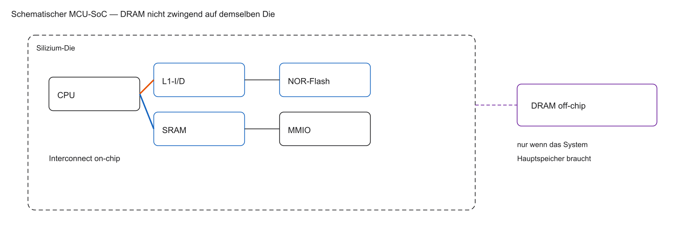

- Cache hängt am Kern, nicht „irgendwo am Bus“ wie ein UART
- NOR-Flash und SRAM können on-chip sein; großer DRAM meist eigener Chip
- Nicht jeder SoC trägt den gesamten Hauptspeicher auf demselben Die

::: notes
Die Abbildung zeigt den Kern, getrennte L1-Instruktions- und Datenpfade, den Systembus, SRAM, NOR-Flash und MMIO. L1 bedeutet Level 1. SRAM ist statisches RAM, DRAM dynamisches RAM. Gestricheltes DRAM liegt außerhalb des Dies und wird über einen Controller erreicht; die CPU adressiert keine rohen Kondensatorzellen. Ein L1-Cache puffert Befehle oder Daten im Kernpfad. Ein UART-Registerblock ist Peripherie und kein Cache. Ein Sensor-MCU kann ohne DRAM auskommen und nur Flash plus SRAM nutzen. Die Abbildung ist ein Schema, keine Flächenmessung. Als Nächstes klären wir die Werkzeuge, mit denen Firmware entsteht. Halten Sie drei Ebenen auseinander: die Zelle oder das Bauelement, die Schnittstelle aus Adresse, Takt und Kommando, und die Softwareabbildung in C oder im Linker. Eine Zahl gilt nur mit ihrer Einheit und der genannten Annahme. Sie ist keine Messung und kein Laufzeitergebnis. Steht Code auf der Folie, ist er Lehrcode. Eine RISC-V-Toolchain, Renode und TFLM waren nicht verfügbar, deshalb wurde er nicht übersetzt und nicht ausgeführt. Prüfen Sie danach die offene Frage des Übergangs, bevor Sie die nächste Folie nur als Wiederholung lesen.
:::

## Unsere Werkzeuge in MCT3

- Hochsprache statt Assembler: Programmierung in C (Embedded Systems)
- Toolchain: RISC-V GCC übersetzt C in Maschinencode
- Simulator: von Venus zu Renode
- Fokus: Hardware-Treiber statt Sortier-Algorithmen
- Bare-Metal: direkt auf der Hardware, ohne Betriebssystem

```{mermaid}
%%| fig-width: 3.8
%%{init: {'theme': 'base', 'themeVariables': {'background': '#FFFFFF', 'primaryColor': '#FFFFFF', 'primaryBorderColor': '#E5E5EA', 'primaryTextColor': '#1D1D1F', 'lineColor': '#86868B', 'secondaryColor': '#F5F5F7', 'tertiaryColor': '#FFFFFF', 'mainBkg': '#FFFFFF', 'nodeBorder': '#E5E5EA', 'clusterBkg': '#F5F5F7', 'clusterBorder': '#E5E5EA', 'titleColor': '#1D1D1F', 'edgeLabelBackground': '#FFFFFF'}}}%%
flowchart LR
  A[main.c] -->|RISC-V GCC| B[firmware.elf]
  B -->|Laden| C[Renode]
  C --> D[Virtueller SoC]
  style C fill:#FFFFFF,stroke:#E2001A,stroke-width:2px !important

```

::: notes
C ist die Hochsprache. Ein Compiler übersetzt sie, ein Assembler übersetzt Assembler, der Linker bindet Objektdateien zu Firmware. GCC bedeutet GNU Compiler Collection. GNU ist das rekursive Akronym GNU's Not Unix. Die Kette lautet Quelltext, Objektdatei, ELF. ELF bedeutet Executable and Linkable Format. Ein Pointer ist eine Adresse in einem Zeiger. Bare-Metal bedeutet Software ohne Betriebssystem, aber mit Reset, Startup und Treibern. C nimmt die Registerzuteilung ab und garantiert keinen direkten Hardwarezugriff. Assembler bleibt für Startup und für die Kontrolle der Übersetzung nötig. Der gezeigte Weg zu Renode ist ein Zielbild. Eine RISC-V-Toolchain war für diese Überarbeitung nicht verfügbar, der Ausschnitt ist Lehrcode. Als Nächstes muss die emulierte Maschine beschrieben werden. Halten Sie drei Ebenen auseinander: die Zelle oder das Bauelement, die Schnittstelle aus Adresse, Takt und Kommando, und die Softwareabbildung in C oder im Linker. Eine Zahl gilt nur mit ihrer Einheit und der genannten Annahme. Sie ist keine Messung und kein Laufzeitergebnis. Steht Code auf der Folie, ist er Lehrcode. Eine RISC-V-Toolchain, Renode und TFLM waren nicht verfügbar, deshalb wurde er nicht übersetzt und nicht ausgeführt. Prüfen Sie danach die offene Frage des Übergangs, bevor Sie die nächste Folie nur als Wiederholung lesen.
:::

## Was ist Renode?

- Renode emuliert eingebettete Systeme funktional. Eine konkrete Kundenliste wird hier nicht behauptet
- Beschrieben werden CPU, Busse, Timer und Speicher, soweit das Modell sie enthält
- Professionelles Kommandozeilen-Tool (ohne grafisches Breadboard)
- Funktionale Emulation von CPU, Bussen und Peripherie — kein Versprechen taktgenauer Chip-Nachbildung
- Virtuelle Zeit des Simulators ist nicht dasselbe wie ein HDL-Timing-Modell
- Skript-gesteuert: SoCs über Textdateien (`.resc` / `.repl`)

```text
# Nicht ausgeführtes Kommandobeispiel. Keine Plattform im Repository.
# mach create "mct3"
# machine LoadPlatformDescription @PLATZHALTER.repl
# sysbus LoadELF @PLATZHALTER.elf
# start
```

::: notes
Renode ist eine Umgebung für die funktionale Emulation eingebetteter Systeme. Der Monitor nimmt Kommandos entgegen. Die virtuelle Zeit ist die Simulationszeit, kein HDL-Takt. Eine .repl-Datei beschreibt die Plattform, eine .resc-Datei ist ein Kommandoskript. Das sind Dateiendungen, keine Langformen. mach create legt eine Maschine an. Der gezeigte Pfad ist ein Platzhalter und wurde nicht ausgeführt. LoadELF und start sind deshalb keine beobachteten Schritte. Funktionale Emulation belegt keine SRAM- oder DRAM-Zelllatenz. Im Repository liegt keine Plattformdatei. Als Nächstes ordnen wir die Kursblöcke, die auf diesem Werkzeug aufbauen können. Halten Sie drei Ebenen auseinander: die Zelle oder das Bauelement, die Schnittstelle aus Adresse, Takt und Kommando, und die Softwareabbildung in C oder im Linker. Eine Zahl gilt nur mit ihrer Einheit und der genannten Annahme. Sie ist keine Messung und kein Laufzeitergebnis. Steht Code auf der Folie, ist er Lehrcode. Eine RISC-V-Toolchain, Renode und TFLM waren nicht verfügbar, deshalb wurde er nicht übersetzt und nicht ausgeführt. Prüfen Sie danach die offene Frage des Übergangs, bevor Sie die nächste Folie nur als Wiederholung lesen.
:::

## Modul-Übersicht: Unser Fahrplan

- Block 1 & 2: Speicherphysik, RAM-Typen, Caches und die Memory Wall
- Block 3 & 4: Interrupts, Hardware-Timer, PWM und Watchdogs
- Block 5 & 6: Serielle Busse (UART, I2C, SPI) und DMA
- Block 7 & 8: Out-of-Order Execution und Edge-AI (KI-Beschleuniger)
- Block 9: Multicore und Abschluss-Labor

```{mermaid}
%%| fig-width: 4.8
%%{init: {'theme': 'base', 'themeVariables': {'background': '#FFFFFF', 'primaryColor': '#FFFFFF', 'primaryBorderColor': '#E5E5EA', 'primaryTextColor': '#1D1D1F', 'lineColor': '#86868B', 'secondaryColor': '#F5F5F7', 'tertiaryColor': '#FFFFFF', 'mainBkg': '#FFFFFF', 'nodeBorder': '#E5E5EA', 'clusterBkg': '#F5F5F7', 'clusterBorder': '#E5E5EA', 'titleColor': '#1D1D1F', 'edgeLabelBackground': '#FFFFFF'}}}%%
flowchart TD
  A[Speicher und Caches] --> B[Timer und Peripherie]
  B --> C[Busse und DMA]
  C --> D[OoO und Edge-AI]
  D --> E[Multicore und Abschluss]
  style A fill:#FFFFFF,stroke:#E2001A,stroke-width:2px !important

```

::: notes
Der Fahrplan beginnt beim Speicher, weil spätere Peripherie und Parallelität darauf aufsetzen. RAM ist Random-Access Memory, ein Cache ein schneller Zwischenspeicher. PWM ist Pulse Width Modulation, UART Universal Asynchronous Receiver/Transmitter, I2C Inter-Integrated Circuit, SPI Serial Peripheral Interface, DMA Direct Memory Access. AI beziehungsweise KI bedeutet Artificial Intelligence. Out-of-Order heißt, dass ein Kern Befehle intern außerhalb der Programmreihenfolge ausführen kann. Edge-AI verarbeitet Daten nahe am Gerät. Diese Folie führt die Namen ein und erklärt die Verfahren noch nicht. Die offene Frage ist, wie Theorie und Labor zusammengehören. Halten Sie drei Ebenen auseinander: die Zelle oder das Bauelement, die Schnittstelle aus Adresse, Takt und Kommando, und die Softwareabbildung in C oder im Linker. Eine Zahl gilt nur mit ihrer Einheit und der genannten Annahme. Sie ist keine Messung und kein Laufzeitergebnis. Steht Code auf der Folie, ist er Lehrcode. Eine RISC-V-Toolchain, Renode und TFLM waren nicht verfügbar, deshalb wurde er nicht übersetzt und nicht ausgeführt. Prüfen Sie danach die offene Frage des Übergangs, bevor Sie die nächste Folie nur als Wiederholung lesen.
:::

## Prüfungsleistung und Laborbetrieb

- Theorie und Praxis: je Einheit 2 Stunden Theorie und 2 Stunden Labor
- Labor als Schlüssel: C-Treiber für das Verständnis der SoC-Architektur
- Prüfungsform: schriftliche Klausur. Dauer und Hilfsmittel stehen in der offiziellen Ankündigung.
- Klausurinhalte: C-Code, Pointer-Arithmetik, Architektur, Cache-Berechnungen
- Fokus auf Problemlösung, nicht auf Auswendiglernen von Datenblättern

::: notes
Theorie und Labor gehören zusammen, sobald eine Plattform bereitsteht. Diese Überarbeitung hat keine Firmware ausgeführt. Dauer und Hilfsmittel der Klausur stehen nur in der offiziellen Ankündigung; hier wird keine neue Regel erfunden. Eine konzeptionelle Aufgabe kann fragen, warum ein Objekt in .bss liegt oder warum ein L1-Miss nicht automatisch DRAM heißt. C, Pointer, SoC und DMA sind die Werkzeuge solcher Fragen. Auswendiglernen von Basisadressen ist nicht das Ziel. Als Nächstes wird die heutige Stunde in eine Kausalkette gelegt. Halten Sie drei Ebenen auseinander: die Zelle oder das Bauelement, die Schnittstelle aus Adresse, Takt und Kommando, und die Softwareabbildung in C oder im Linker. Eine Zahl gilt nur mit ihrer Einheit und der genannten Annahme. Sie ist keine Messung und kein Laufzeitergebnis. Steht Code auf der Folie, ist er Lehrcode. Eine RISC-V-Toolchain, Renode und TFLM waren nicht verfügbar, deshalb wurde er nicht übersetzt und nicht ausgeführt. Prüfen Sie danach die offene Frage des Übergangs, bevor Sie die nächste Folie nur als Wiederholung lesen.
:::

## Agenda für den heutigen Tag

1. Systemarchitektur (Von-Neumann vs. Harvard) und Memory Wall
2. Speicher-Klassifikationen (volatil, non-volatil, Random Access)
3. Festwertspeicher (ROM, EPROM, Flash) — Architektur und Nutzung
4. Volatiler Speicher (SRAM vs. DRAM) — Transistoren vs. Kondensatoren
5. Spezialspeicher im SoC (DPRAM, FIFOs) und Brückenschlag zum Labor

::: notes
Die fünf Punkte hängen zusammen. Zuerst begrenzen Architektur und Memory Wall den Zugriff. Dann unterscheiden wir Zugriffsarten. Danach folgen nichtflüchtige Zellen, dann flüchtige Zellen, zuletzt die Abbildung in Software. ROM, EPROM, SRAM, DRAM, DPRAM und FIFO werden jeweils an ihrer Folie definiert. Code liegt nicht immer im Flash und Variablen nicht immer im RAM; das ist nur eine typische Bare-Metal-Anordnung. Die Pause trennt die nichtflüchtige von der flüchtigen Hälfte. Die Lernziele machen diese Kette prüfbar. Halten Sie drei Ebenen auseinander: die Zelle oder das Bauelement, die Schnittstelle aus Adresse, Takt und Kommando, und die Softwareabbildung in C oder im Linker. Eine Zahl gilt nur mit ihrer Einheit und der genannten Annahme. Sie ist keine Messung und kein Laufzeitergebnis. Steht Code auf der Folie, ist er Lehrcode. Eine RISC-V-Toolchain, Renode und TFLM waren nicht verfügbar, deshalb wurde er nicht übersetzt und nicht ausgeführt. Prüfen Sie danach die offene Frage des Übergangs, bevor Sie die nächste Folie nur als Wiederholung lesen.
:::

## Lernziele Block 1

- Memory Wall und Speicherhierarchie-Idee motivieren
- Volatil vs. non-volatil sowie Random Access vs. sequentiell einordnen
- NOR-Flash/XIP vs. NAND und Wear Leveling erklären
- SRAM (6T) vs. DRAM (1T1C, Refresh) unterscheiden
- Memory Map und Linker-Sections (`.text`, `.data`, `.bss`) zuordnen

::: notes
Am Ende sollen Sie fünf Dinge können: flüchtig und wahlfrei unterscheiden, einen Flash-Zugriff begründen, eine 6T- und eine 1T1C-Zelle erklären, DDR-Bandbreite von Latenz trennen und C-Objekte Sections zuordnen. NOR ist NOT-OR, NAND ist NOT-AND, XIP bedeutet Execute-in-Place. 6T sind sechs Transistoren, 1T1C ein Transistor und ein Kondensator. .text enthält Code, .rodata Konstanten, .data initialisierte Variablen, .bss nullzuinitialisierende Variablen. Die Literatur Harris und Harris, RISC-V Edition, bleibt die Begriffsquelle. Die Leitfrage zeigt, warum eine einzige Zellbauart nicht reicht. Halten Sie drei Ebenen auseinander: die Zelle oder das Bauelement, die Schnittstelle aus Adresse, Takt und Kommando, und die Softwareabbildung in C oder im Linker. Eine Zahl gilt nur mit ihrer Einheit und der genannten Annahme. Sie ist keine Messung und kein Laufzeitergebnis. Steht Code auf der Folie, ist er Lehrcode. Eine RISC-V-Toolchain, Renode und TFLM waren nicht verfügbar, deshalb wurde er nicht übersetzt und nicht ausgeführt. Prüfen Sie danach die offene Frage des Übergangs, bevor Sie die nächste Folie nur als Wiederholung lesen.
:::

## Die Leitfrage des Tages

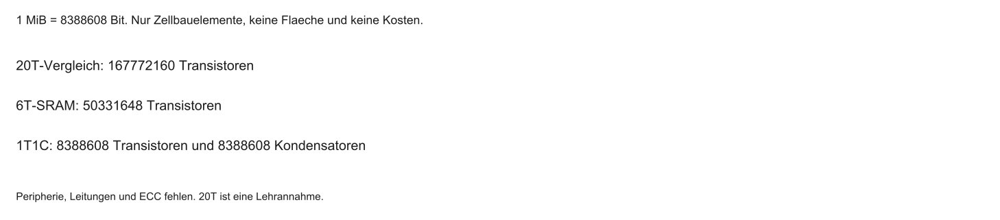

- Die CPU ist schnell: Milliarden Berechnungen pro Sekunde
- Datenhunger: jede Berechnung braucht Befehle und Daten
- Masse: moderne Programme bestehen aus Milliarden von Bits
- Flip-Flop-Problem: Milliarden D-Flip-Flops sind zu groß, teuer und stromhungrig
- Leitfrage: Wie speichert Silizium Milliarden Bits dicht und effizient?

```{mermaid}
%%| fig-width: 3.8
%%{init: {'theme': 'base', 'themeVariables': {'background': '#FFFFFF', 'primaryColor': '#FFFFFF', 'primaryBorderColor': '#E5E5EA', 'primaryTextColor': '#1D1D1F', 'lineColor': '#86868B', 'secondaryColor': '#F5F5F7', 'tertiaryColor': '#FFFFFF', 'mainBkg': '#FFFFFF', 'nodeBorder': '#E5E5EA', 'clusterBkg': '#F5F5F7', 'clusterBorder': '#E5E5EA', 'titleColor': '#1D1D1F', 'edgeLabelBackground': '#FFFFFF'}}}%%
flowchart TD
  A[1 Bit speichern] --> B[D-Flip-Flop: 20+ Transistoren]
  B --> C[1 Gigabyte = 8 Mrd. Bits]
  C --> D[160 Mrd. Transistoren?]
  D --> E[Lösung: neue Speicherkonzepte]
  style E fill:#FFFFFF,stroke:#E2001A,stroke-width:2px !important

```

::: notes
Ein Bit ist eine Ja-Nein-Information, ein Byte sind acht Bit. 1 GB sind 10 hoch 9 Byte, also 8 mal 10 hoch 9 Bit. 1 GiB wären 2 hoch 30 Byte und ist hier nicht gemeint. Die Lehrannahme 20 Transistoren je D-Flip-Flop ergibt 160 mal 10 hoch 9 Transistoren nur für die Bits eines Gigabytes. Für 1 MiB, also 8388608 Bit, sind es 167772160 Transistoren. Das ist keine Chipfläche und kein Wärmenachweis. Die CPU-Rechenleistung bleibt geräteabhängig. Die nächste Grenze ist die Organisation der Zugriffe, nicht nur die Transistorzahl. Halten Sie drei Ebenen auseinander: die Zelle oder das Bauelement, die Schnittstelle aus Adresse, Takt und Kommando, und die Softwareabbildung in C oder im Linker. Eine Zahl gilt nur mit ihrer Einheit und der genannten Annahme. Sie ist keine Messung und kein Laufzeitergebnis. Steht Code auf der Folie, ist er Lehrcode. Eine RISC-V-Toolchain, Renode und TFLM waren nicht verfügbar, deshalb wurde er nicht übersetzt und nicht ausgeführt. Prüfen Sie danach die offene Frage des Übergangs, bevor Sie die nächste Folie nur als Wiederholung lesen.
:::

## Systemarchitektur: Von-Neumann

- Klassisches Modell nach John von Neumann (1945)
- Gemeinsamer Speicher: Befehle und Daten im selben Arbeitsspeicher
- Gemeinsamer Bus für Adressen und Daten zwischen CPU und RAM
- Von-Neumann-Flaschenhals: kein paralleles Laden von Befehl und Variable
- Folge: Structural Hazards auf dem Fließband

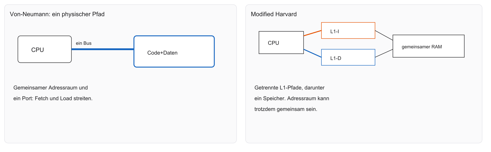

- Gemeinsamer Adressraum heißt nicht automatisch ein gemeinsamer physischer Port
- Am einfachen Ein-Port-Modell kollidieren Fetch und Load

::: notes
Im klassischen Von-Neumann-Modell liegen Befehle und Daten im selben Speicher. Ein einfaches Modell hat dafür einen gemeinsamen physischen Port. Ein Fetch und ein Daten-Load brauchen dann dieselbe Ressource und bilden einen Structural Hazard, also einen Ressourcenkonflikt. Ein gemeinsamer Adressraum erzwingt diesen einen Port nicht. Die linke Bildhälfte zeigt den Konflikt, die rechte schon getrennte L1-Pfade und gehört streng zur Harvard-Folie. Es wird nicht behauptet, jedes Von-Neumann-System könne nie parallel zugreifen. Die nächste Folie trennt die Wege ausdrücklich. Halten Sie drei Ebenen auseinander: die Zelle oder das Bauelement, die Schnittstelle aus Adresse, Takt und Kommando, und die Softwareabbildung in C oder im Linker. Eine Zahl gilt nur mit ihrer Einheit und der genannten Annahme. Sie ist keine Messung und kein Laufzeitergebnis. Steht Code auf der Folie, ist er Lehrcode. Eine RISC-V-Toolchain, Renode und TFLM waren nicht verfügbar, deshalb wurde er nicht übersetzt und nicht ausgeführt. Prüfen Sie danach die offene Frage des Übergangs, bevor Sie die nächste Folie nur als Wiederholung lesen.
:::

## Systemarchitektur: Harvard

- Harvard-Architektur trennt die Speicherräume strikt
- Getrennte Speicher für Befehle (Code) und Daten
- Getrennte Bus-Systeme zur CPU
- Vorteil: Fetch und Memory im selben Taktzyklus möglich
- Modified Harvard: extern Von-Neumann, intern getrennte L1-Caches


- Striktes Harvard: getrennte Speicher *und* getrennte Busse
- Modified Harvard: getrennte L1-Caches, gemeinsamer Speicher darunter
- Der Adressraum kann trotzdem ein linearer 32-Bit-Raum bleiben

::: notes
Striktes Harvard trennt Instruktions- und Datenspeicher auch im Adressraum. Modified Harvard trennt die L1-I- und L1-D-Pfade und führt sie später auf gemeinsamen Speicher. L1 ist die erste Cache-Ebene, I steht für Instruction, D für Data. Parallel möglich sind dann ein Befehls-Fetch und ein Datenzugriff auf den getrennten ersten Ebenen. Weiter unten können sie wieder kollidieren. Eine Verdopplung der Leistung ist daraus nicht garantiert. Die Memory Wall bleibt, weil der Speicher hinter den Pfaden langsamer sein kann als der Kern. Halten Sie drei Ebenen auseinander: die Zelle oder das Bauelement, die Schnittstelle aus Adresse, Takt und Kommando, und die Softwareabbildung in C oder im Linker. Eine Zahl gilt nur mit ihrer Einheit und der genannten Annahme. Sie ist keine Messung und kein Laufzeitergebnis. Steht Code auf der Folie, ist er Lehrcode. Eine RISC-V-Toolchain, Renode und TFLM waren nicht verfügbar, deshalb wurde er nicht übersetzt und nicht ausgeführt. Prüfen Sie danach die offene Frage des Übergangs, bevor Sie die nächste Folie nur als Wiederholung lesen.
:::

## Die Memory Wall

- Moores Gesetz: Transistoren kleiner, CPUs schneller
- Ungleichgewicht: RAM-Geschwindigkeit hielt nicht mit
- Kenngröße hier: Durchsatz (Arbeit pro Zeit), nicht Latenz mit Bandbreite vermischt
- Voll abhängig, ohne Überlappung: $4\,\mathrm{GHz}\times 100\,\mathrm{ns} = 400$ Takte

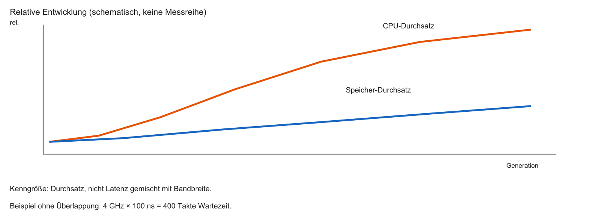

::: notes
Die Memory Wall bezeichnet den wachsenden Abstand zwischen Kern und Speicher. Latenz ist die Wartezeit bis zum ersten Ergebnis, Bandbreite der Durchsatz danach. Moores Gesetz ist eine historische Beobachtung zur Integrationsdichte, keine Garantie steigender Taktfrequenz. Das Lehrbeispiel 4 GHz mal 100 ns ergibt 400 Taktperioden: 4 mal 10 hoch 9 mal 100 mal 10 hoch minus 9 ist 400. Eine Taktperiode dauert dann 0,25 ns. Das gilt für einen vollständig abhängigen, nicht überlappten Zugriff und beschreibt nicht diesen RISC-V-Kurskern. Die nächste Folie zeigt den Zielkonflikt der Speicherauswahl. Halten Sie drei Ebenen auseinander: die Zelle oder das Bauelement, die Schnittstelle aus Adresse, Takt und Kommando, und die Softwareabbildung in C oder im Linker. Eine Zahl gilt nur mit ihrer Einheit und der genannten Annahme. Sie ist keine Messung und kein Laufzeitergebnis. Steht Code auf der Folie, ist er Lehrcode. Eine RISC-V-Toolchain, Renode und TFLM waren nicht verfügbar, deshalb wurde er nicht übersetzt und nicht ausgeführt. Prüfen Sie danach die offene Frage des Übergangs, bevor Sie die nächste Folie nur als Wiederholung lesen.
:::

## Das magische Speicher-Dreieck

Drei Ziele, die sich gegenseitig ausschließen:

1. Geschwindigkeit — wie schnell lesen/schreiben?
2. Kapazität — wie viele Gigabyte auf dem Chip?
3. Kosten — wie teuer ist ein Bit in der Herstellung?

Eiserne Regel als Modell: Geschwindigkeit, Kapazität und geringe Kosten lassen sich nicht alle drei gleichzeitig maximieren.
Beispiel: schnell und groß ist extrem teuer (SRAM); groß und billig ist langsam (Massenspeicher).

```{mermaid}
%%| fig-width: 3.8
%%{init: {'theme': 'base', 'themeVariables': {'background': '#FFFFFF', 'primaryColor': '#FFFFFF', 'primaryBorderColor': '#E5E5EA', 'primaryTextColor': '#1D1D1F', 'lineColor': '#86868B', 'secondaryColor': '#F5F5F7', 'tertiaryColor': '#FFFFFF', 'mainBkg': '#FFFFFF', 'nodeBorder': '#E5E5EA', 'clusterBkg': '#F5F5F7', 'clusterBorder': '#E5E5EA', 'titleColor': '#1D1D1F', 'edgeLabelBackground': '#FFFFFF'}}}%%
flowchart TD
  A[Geschwindigkeit] --- B[Kapazität]
  B --- C[Geringe Kosten]
  C --- A
  style A fill:#FFFFFF,stroke:#E2001A,stroke-width:2px !important

```

::: notes
Geschwindigkeit meint hier vor allem Latenz, Kapazität die speicherbare Menge, Kosten den Preis je Bit. Das Dreieck ist ein Entwurfsbild, kein Satz, dass alle drei Ziele zugleich unmöglich seien. SRAM ist schnell und teuer je Bit, DRAM dichter und billiger je Bit, Massenspeicher noch dichter und nichtflüchtig, aber mit anderen Updatekosten. Der Vergleich gilt nur innerhalb desselben Systemkontexts. Energie und Datenerhalt kommen in den Notizen als weitere Achsen dazu. Vor dem Technologievergleich brauchen wir zwei unabhängige Klassifikationen. Halten Sie drei Ebenen auseinander: die Zelle oder das Bauelement, die Schnittstelle aus Adresse, Takt und Kommando, und die Softwareabbildung in C oder im Linker. Eine Zahl gilt nur mit ihrer Einheit und der genannten Annahme. Sie ist keine Messung und kein Laufzeitergebnis. Steht Code auf der Folie, ist er Lehrcode. Eine RISC-V-Toolchain, Renode und TFLM waren nicht verfügbar, deshalb wurde er nicht übersetzt und nicht ausgeführt. Prüfen Sie danach die offene Frage des Übergangs, bevor Sie die nächste Folie nur als Wiederholung lesen.
:::

## Klassifikation 1: Volatil vs. Non-Volatil

**Volatiler Speicher (flüchtig)**

- Verliert Daten sofort ohne Betriebsspannung
- Beispiele: SRAM, DRAM, CPU-Register
- Vorteil: meist schnell und beliebig oft beschreibbar

**Non-volatiler Speicher (nicht-flüchtig)**

- Behält Daten Jahre ohne Strom
- Beispiele: Flash, SD-Karten, ROM
- Nachteil: oft langsamer beim Schreiben, physischer Verschleiß

::: notes
Flüchtiger Speicher sichert den Inhalt ohne Versorgung nicht zu. Nichtflüchtiger Speicher ist für den Datenerhalt ohne Versorgung vorgesehen. Sofort weg, Jahre garantiert und beliebig oft beschreibbar sind keine allgemeinen Gesetze. SRAM und DRAM sind beide flüchtig. Eine Batterie erhält die Versorgung, macht die Zelle aber nicht selbst nichtflüchtig. Eine SD-Karte, Secure Digital, ist ein System aus Flash und Controller, keine Zelltechnologie. Retention ist die zugesicherte Haltedauer, Endurance die Zahl der Programmier- und Löschzyklen. Beides steht im Datenblatt. Die zweite Achse ist die Zugriffsart. Halten Sie drei Ebenen auseinander: die Zelle oder das Bauelement, die Schnittstelle aus Adresse, Takt und Kommando, und die Softwareabbildung in C oder im Linker. Eine Zahl gilt nur mit ihrer Einheit und der genannten Annahme. Sie ist keine Messung und kein Laufzeitergebnis. Steht Code auf der Folie, ist er Lehrcode. Eine RISC-V-Toolchain, Renode und TFLM waren nicht verfügbar, deshalb wurde er nicht übersetzt und nicht ausgeführt. Prüfen Sie danach die offene Frage des Übergangs, bevor Sie die nächste Folie nur als Wiederholung lesen.
:::

## Klassifikation 2: Random Access vs. sequenziell

**Random Access (wahlfreier Zugriff)**

- Jede Adresse ist direkt ansprechbar — die Latenz muss deshalb nicht für jede Anfrage gleich sein
- Beispiel RAM: kein Spulen wie bei einem Band; Caches und DRAM-Zeilen ändern die konkrete Wartezeit trotzdem

**Sequenzieller Zugriff**

- Daten nur der Reihe nach (wie eine Kassette)
- Ende erreicht man erst nach dem Durchlaufen der davorliegenden Daten

Architektur-Bedeutung: CPUs führen Code nur aus Random-Access-Speichern direkt aus.

::: notes
Random Access bedeutet, eine Adresse zu wählen, ohne alle vorherigen Datensätze zu durchlaufen. Gleiche Latenz ist dafür nicht nötig. Eine SRAM-Zelle wird über Wort- und Bitleitung gewählt, ein DRAM-Row-Hit trifft eine schon offene Zeile, ein Band muss gespult werden. NAND ist pageorientiert und trotzdem kein Magnetband. Normale Fetches brauchen einen adressierbaren Pfad. Daten aus Massenspeicher werden dafür üblicherweise in ausführbaren Speicher geladen. Die Folie 38 darf deshalb nicht sagen, jede Adresse sei gleich schnell. Die Hierarchie kombiniert diese Zugriffe. Halten Sie drei Ebenen auseinander: die Zelle oder das Bauelement, die Schnittstelle aus Adresse, Takt und Kommando, und die Softwareabbildung in C oder im Linker. Eine Zahl gilt nur mit ihrer Einheit und der genannten Annahme. Sie ist keine Messung und kein Laufzeitergebnis. Steht Code auf der Folie, ist er Lehrcode. Eine RISC-V-Toolchain, Renode und TFLM waren nicht verfügbar, deshalb wurde er nicht übersetzt und nicht ausgeführt. Prüfen Sie danach die offene Frage des Übergangs, bevor Sie die nächste Folie nur als Wiederholung lesen.
:::

## Die Speicherhierarchie-Pyramide

Um die Memory Wall zu überwinden, stapeln Architekten Speicher übereinander:

- Spitze: CPU-Register (klein, teuer, blitzschnell)
- Ebene 2: Caches L1/L2/L3 (SRAM — Megabytes, sehr schnell)
- Ebene 3: Main Memory (DRAM — Gigabytes, moderat)
- Basis: Massenspeicher (Flash/SSD — Terabytes, langsam, billig, non-volatil)

Prinzip: häufig genutzte Daten liegen weiter oben.

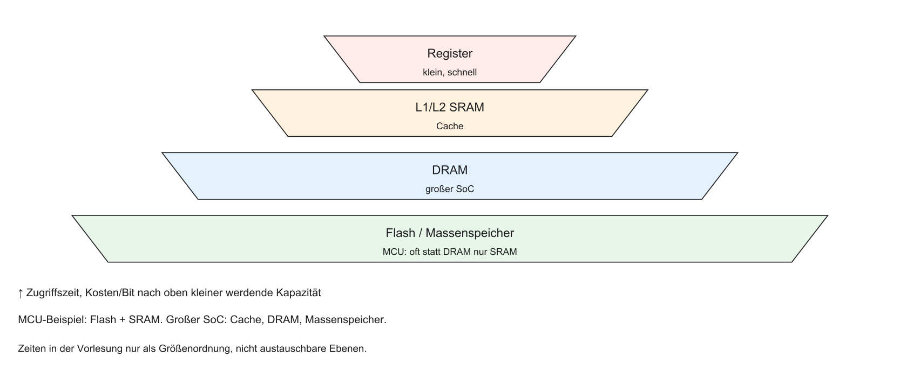

::: notes
Die Pyramide stapelt Register, L1, L2 und L3, dann DRAM und Massenspeicher. SRAM ist Static RAM, DRAM Dynamic RAM, SSD ein Solid State Drive. L1 wird in MCUs eher in Kibibyte beschrieben; ohne Plattform bleiben die Größen qualitativ. Zeitliche Lokalität heißt, denselben Wert bald wieder zu brauchen. Räumliche Lokalität heißt, Nachbarn zu brauchen, etwa beim Durchlaufen eines Arrays. Eine kleine MCU hat oft nur Flash und SRAM und keine drei Cache-Ebenen. Cache-Details folgen in Vorlesung 2. Heute öffnen wir die Zellen dieser Ebenen. Halten Sie drei Ebenen auseinander: die Zelle oder das Bauelement, die Schnittstelle aus Adresse, Takt und Kommando, und die Softwareabbildung in C oder im Linker. Eine Zahl gilt nur mit ihrer Einheit und der genannten Annahme. Sie ist keine Messung und kein Laufzeitergebnis. Steht Code auf der Folie, ist er Lehrcode. Eine RISC-V-Toolchain, Renode und TFLM waren nicht verfügbar, deshalb wurde er nicht übersetzt und nicht ausgeführt. Prüfen Sie danach die offene Frage des Übergangs, bevor Sie die nächste Folie nur als Wiederholung lesen.
:::

## Fokus heute: Wir öffnen die Chips

- Heute: Physik statt Betriebssystem
- Wir öffnen die Boxen der Speicherhierarchie
- Wie funktioniert Festwertspeicher (ROM/Flash)?
- Warum nutzen SRAM und DRAM andere physikalische Konzepte?
- Was bedeutet das für uns als C-Programmierer am SoC?

::: notes
Die Ebenen sind das C-Objekt, die Adresse, die Schnittstelle, das Array und die Zelle. Der Fokus liegt auf Zelle und Organisation, nicht darauf, dass Software unwichtig wäre. Flash-Löschung, der Flächenbedarf der 6T-Zelle und der DRAM-Refresh werden später zu Softwareentscheidungen. ROM und Flash halten Firmware, SRAM und DRAM halten Laufzeitdaten. Ein SoC verbindet sie über Adressen. Der nächste Schritt ist der Datenerhalt ohne Betriebsspannung. Halten Sie drei Ebenen auseinander: die Zelle oder das Bauelement, die Schnittstelle aus Adresse, Takt und Kommando, und die Softwareabbildung in C oder im Linker. Eine Zahl gilt nur mit ihrer Einheit und der genannten Annahme. Sie ist keine Messung und kein Laufzeitergebnis. Steht Code auf der Folie, ist er Lehrcode. Eine RISC-V-Toolchain, Renode und TFLM waren nicht verfügbar, deshalb wurde er nicht übersetzt und nicht ausgeführt. Prüfen Sie danach die offene Frage des Übergangs, bevor Sie die nächste Folie nur als Wiederholung lesen.
:::

## Festwertspeicher (Non-Volatile)

- Start unten in der Pyramide: Speicher, der Stromausfall überlebt
- Überbegriff: ROM (Read-Only Memory)
- Historisch wirklich nur lesbar
- Evolution: Firmware nachträglich updatebar machen
- Weg: Mask-ROM, PROM, EPROM, EEPROM, Flash

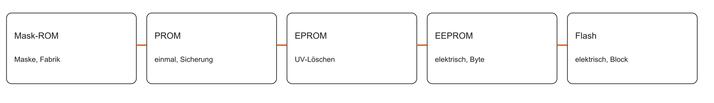

::: notes
Non-Volatile Memory hält Daten ohne Versorgung. ROM bedeutet Read-Only Memory und ist hier der historische Einstieg, nicht die Obermenge jedes nichtflüchtigen Speichers. Die Leiste zeigt Mask-ROM, PROM, EPROM, EEPROM und Flash. Programmieren und Löschen sind verschiedene Vorgänge. Ein System braucht einen Bootpfad. Der Bootcode kann auch von außen kommen und muss nicht im eigenen Flash liegen. Mask-ROM legt den Inhalt schon in der Fertigung fest. Halten Sie drei Ebenen auseinander: die Zelle oder das Bauelement, die Schnittstelle aus Adresse, Takt und Kommando, und die Softwareabbildung in C oder im Linker. Eine Zahl gilt nur mit ihrer Einheit und der genannten Annahme. Sie ist keine Messung und kein Laufzeitergebnis. Steht Code auf der Folie, ist er Lehrcode. Eine RISC-V-Toolchain, Renode und TFLM waren nicht verfügbar, deshalb wurde er nicht übersetzt und nicht ausgeführt. Prüfen Sie danach die offene Frage des Übergangs, bevor Sie die nächste Folie nur als Wiederholung lesen.
:::

## Mask-ROM

- Nullen und Einsen bei der Herstellung physisch verdrahtet (Fotolithografie-Masken)
- Vorteil: extrem billig in der Massenproduktion
- Nachteil: Bug $\Rightarrow$ alle Chips unbrauchbar
- Früher: Game-Cartridges, Spieluhren
- Heute: kaum noch für Anwendercode; ggf. unveränderliche Boot-Loader

::: notes
Bei Mask-ROM legt die Fertigung die Zellzustände fest, etwa über Kontakte, die Transistoranordnung oder Implantation. Eine durchtrennte Kupferleitung ist nur ein vereinfachtes Sicherungsbild. Nach der Herstellung ist der Inhalt nicht regulär umprogrammierbar. Ein Maskenfehler ist teuer, macht aber nicht automatisch jeden Chip unbrauchbar. Eine feste Maskengebühr wird hier nicht behauptet. Ein Boot-ROM kann einen Bootloader enthalten, also das erste Programm, das weitere Software lädt. PROM verlagert die einmalige Programmierung zum Anwender. Halten Sie drei Ebenen auseinander: die Zelle oder das Bauelement, die Schnittstelle aus Adresse, Takt und Kommando, und die Softwareabbildung in C oder im Linker. Eine Zahl gilt nur mit ihrer Einheit und der genannten Annahme. Sie ist keine Messung und kein Laufzeitergebnis. Steht Code auf der Folie, ist er Lehrcode. Eine RISC-V-Toolchain, Renode und TFLM waren nicht verfügbar, deshalb wurde er nicht übersetzt und nicht ausgeführt. Prüfen Sie danach die offene Frage des Übergangs, bevor Sie die nächste Folie nur als Wiederholung lesen.
:::

## PROM (Programmable ROM)

- Chip verlässt das Werk leer (alles Einsen) und wird beim Kunden beschrieben
- Jede Zelle besitzt eine mikroskopische Sicherung (Fuse)
- Hohe Spannung „brennt“ die Sicherung durch: $1 \rightarrow 0$
- OTP (One-Time Programmable): einmal durchgebrannt, nie reparierbar
- Gut für kleine Serien; Firmware-Updates weiterhin unmöglich

::: notes
PROM bedeutet Programmable Read-Only Memory. OTP bedeutet One-Time Programmable, wenn die Zelle nur einmal geändert wird. Im gewählten Fuse-Modell ist der Anfangszustand geschlossen und eine hohe Spannung öffnet die Sicherung dauerhaft. Nicht jede OTP-Technik schmilzt eine Sicherung. Antifuse und andere Prinzipien gibt es. Ob die durchgebrannte Zelle logisch 0 oder 1 ist, hängt von der Technologie ab. Das Programmiergerät ist nicht der normale Laufzeitzugriff der CPU. EPROM ergänzt das Löschen. Halten Sie drei Ebenen auseinander: die Zelle oder das Bauelement, die Schnittstelle aus Adresse, Takt und Kommando, und die Softwareabbildung in C oder im Linker. Eine Zahl gilt nur mit ihrer Einheit und der genannten Annahme. Sie ist keine Messung und kein Laufzeitergebnis. Steht Code auf der Folie, ist er Lehrcode. Eine RISC-V-Toolchain, Renode und TFLM waren nicht verfügbar, deshalb wurde er nicht übersetzt und nicht ausgeführt. Prüfen Sie danach die offene Frage des Übergangs, bevor Sie die nächste Folie nur als Wiederholung lesen.
:::

## EPROM (Erasable PROM)

- Speicher, der gelöscht und neu beschrieben werden kann
- Quarzglas-Fenster auf der Chip-Oberseite
- UV-Licht (ca. 20–30 Minuten) löscht den gesamten Chip
- Nachteil: immer ganzer Chip, langsam, Ausbau nötig
- Fenster nach dem Brennen abdecken, sonst löscht Sonnenlicht den Code

::: notes
EPROM bedeutet Erasable Programmable Read-Only Memory. UV bedeutet ultraviolett. Die Zelle hält Ladung isoliert. UV-Licht durch ein Gehäusefenster kann sie löschen. 20 bis 30 Minuten sind nur ein dokumentiertes Beispiel, keine allgemeine Löschzeit. Typisch wird der ganze UV-EPROM gelöscht, nicht ein einzelnes Byte. Ein abgedecktes Fenster schützt vor unbeabsichtigter Bestrahlung. EEPROM ersetzt das optische Löschen durch einen elektrischen Vorgang. Halten Sie drei Ebenen auseinander: die Zelle oder das Bauelement, die Schnittstelle aus Adresse, Takt und Kommando, und die Softwareabbildung in C oder im Linker. Eine Zahl gilt nur mit ihrer Einheit und der genannten Annahme. Sie ist keine Messung und kein Laufzeitergebnis. Steht Code auf der Folie, ist er Lehrcode. Eine RISC-V-Toolchain, Renode und TFLM waren nicht verfügbar, deshalb wurde er nicht übersetzt und nicht ausgeführt. Prüfen Sie danach die offene Frage des Übergangs, bevor Sie die nächste Folie nur als Wiederholung lesen.
:::

## EEPROM (Electrically Erasable PROM)

- Löschen per elektrischem Signal statt UV-Licht
- In-System Programming: kein Auslöten nötig
- Byte-Ebene: einzelne Bytes gezielt löschen und neu beschreiben
- Kehrseite: große Zellen, geringe Dichte, hohe Kosten pro Megabyte
- Heute: kleine Konfigurationsdaten (MAC-Adresse, Kalibrierung)

::: notes
EEPROM bedeutet Electrically Erasable Programmable Read-Only Memory. Programmieren und Löschen erfolgen elektrisch. Die Update-Einheit ist oft feiner als bei Flash, aber byteweise Adressierung bedeutet nicht beliebig schnelles Schreiben. Page-Writes und interne Wartezeiten stehen im Datenblatt. Kalibrierwerte sind ein typischer Einsatz, weil sie selten und klein sind. Eine absolute Kapazitätsobergrenze wird nicht behauptet. Flash spart Steueraufwand, indem es gröber löscht. Halten Sie drei Ebenen auseinander: die Zelle oder das Bauelement, die Schnittstelle aus Adresse, Takt und Kommando, und die Softwareabbildung in C oder im Linker. Eine Zahl gilt nur mit ihrer Einheit und der genannten Annahme. Sie ist keine Messung und kein Laufzeitergebnis. Steht Code auf der Folie, ist er Lehrcode. Eine RISC-V-Toolchain, Renode und TFLM waren nicht verfügbar, deshalb wurde er nicht übersetzt und nicht ausgeführt. Prüfen Sie danach die offene Frage des Übergangs, bevor Sie die nächste Folie nur als Wiederholung lesen.
:::

## Flash-Speicher: Die Revolution der Blöcke

- Geburt des Flash (Toshiba, 1984): Kompromiss aus EPROM und EEPROM
- Löschen nicht byteweise, sondern blockweise „blitzartig“
- Architektur-Trick: Wegfall der byteweisen Löschlogik $\Rightarrow$ kleinere Zellen
- Resultat: hohe Speicherdichte zu niedrigen Preisen
- Dominante Technologie für Firmware und Massenspeicher (SSD, USB, Smartphones)

::: notes
Flash ist elektrisch programmierbar und wird in Blöcken oder Sektoren gelöscht. Zelle, Page und Erase-Block sind verschiedene Größen und bausteinspezifisch. Ein kleines Update kann deshalb einen großen Bereich betreffen. Flash wurde 1984 angekündigt, NAND 1987. Das sind historische Marken, keine Bewertung der Produkte. Ein normales Speicherbild wird nicht als Marketingzahl verwendet. Die nächste Folie erklärt, wie die Ladung ohne Versorgung bleibt. Halten Sie drei Ebenen auseinander: die Zelle oder das Bauelement, die Schnittstelle aus Adresse, Takt und Kommando, und die Softwareabbildung in C oder im Linker. Eine Zahl gilt nur mit ihrer Einheit und der genannten Annahme. Sie ist keine Messung und kein Laufzeitergebnis. Steht Code auf der Folie, ist er Lehrcode. Eine RISC-V-Toolchain, Renode und TFLM waren nicht verfügbar, deshalb wurde er nicht übersetzt und nicht ausgeführt. Prüfen Sie danach die offene Frage des Übergangs, bevor Sie die nächste Folie nur als Wiederholung lesen.
:::

## Das Floating-Gate (logische Sicht)

- Flash speichert Bits ohne Strom über Floating-Gate-Transistoren
- Zwei Gates: Control-Gate und isoliertes Floating-Gate
- Floating-Gate vollständig in Siliziumdioxid eingeschlossen
- Hohe Spannung kann Elektronen auf das Floating Gate bringen
- Die CPU sieht keine Elektronen, sondern eine verschobene Schwellspannung

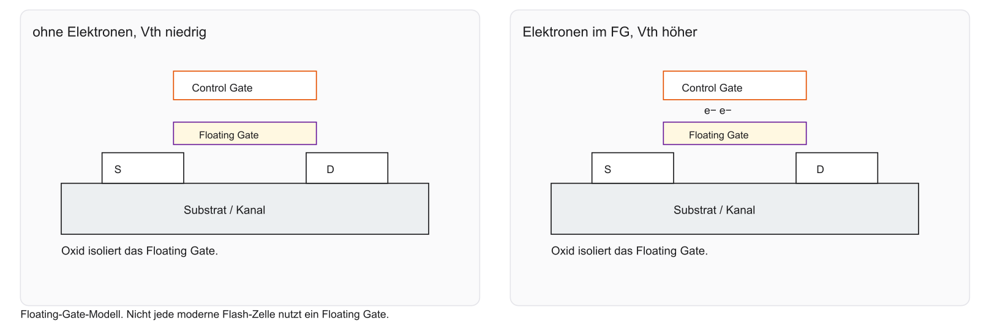

::: notes
Source und Drain begrenzen den Kanal. Das Control Gate steuert, das Floating Gate speichert Ladung isoliert. Im gewählten n-Kanal-Modell erhöht negative Ladung die Schwellspannung, also die Spannung, ab der der Kanal leitet. Beim Lesen wird dieses Verhalten geprüft, nicht ein Draht zum Floating Gate. SLC bedeutet Single-Level Cell, hier ein Bit je Zelle. Charge-Trap-Speicher ohne leitendes Floating Gate bleibt eine andere Technologie. Die Verschaltung bestimmt danach den Zugriff. Halten Sie drei Ebenen auseinander: die Zelle oder das Bauelement, die Schnittstelle aus Adresse, Takt und Kommando, und die Softwareabbildung in C oder im Linker. Eine Zahl gilt nur mit ihrer Einheit und der genannten Annahme. Sie ist keine Messung und kein Laufzeitergebnis. Steht Code auf der Folie, ist er Lehrcode. Eine RISC-V-Toolchain, Renode und TFLM waren nicht verfügbar, deshalb wurde er nicht übersetzt und nicht ausgeführt. Prüfen Sie danach die offene Frage des Übergangs, bevor Sie die nächste Folie nur als Wiederholung lesen.
:::

## NAND vs. NOR Flash

Flash spaltet sich in zwei Architekturen — je nach Verdrahtung der Floating-Gate-Zellen:

| | NOR | NAND |
|---|---|---|
| Verdrahtung | parallel | seriell (Kette) |
| Zugriff | Byte/Wort (Random Access) | Seiten (Pages) |
| Typischer Einsatz | Mikrocontroller, XIP | SSD, Smartphones |

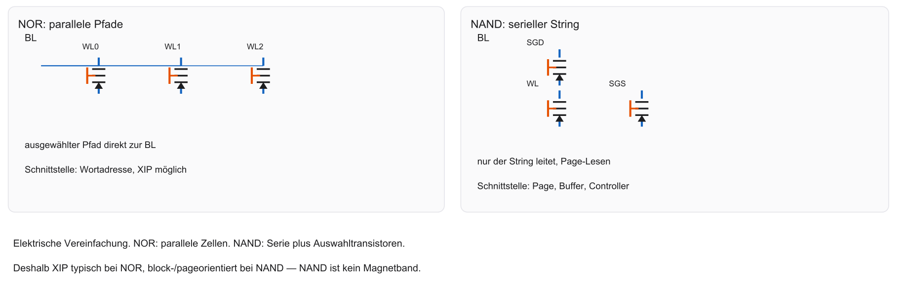

::: notes
NOR bedeutet NOT-OR, NAND NOT-AND. Die Namen beziehen sich auf die Zellverschaltung. NOR-Zellen haben eher parallele Pfade zur Bitleitung, NAND-Zellen liegen in einem String mit Auswahltransistoren. Die Reihenschaltung bedeutet nicht, dass Software Bytes wie ein Band liest. Serial-NOR kann über einen Controller trotzdem speicherabbildbar sein. NOR wird oft für Code, NAND für Massendaten verwendet. Universelle Latenzzahlen werden nicht behauptet. NOR kann einen Instruktionspfad ermöglichen. Halten Sie drei Ebenen auseinander: die Zelle oder das Bauelement, die Schnittstelle aus Adresse, Takt und Kommando, und die Softwareabbildung in C oder im Linker. Eine Zahl gilt nur mit ihrer Einheit und der genannten Annahme. Sie ist keine Messung und kein Laufzeitergebnis. Steht Code auf der Folie, ist er Lehrcode. Eine RISC-V-Toolchain, Renode und TFLM waren nicht verfügbar, deshalb wurde er nicht übersetzt und nicht ausgeführt. Prüfen Sie danach die offene Frage des Übergangs, bevor Sie die nächste Folie nur als Wiederholung lesen.
:::

## NOR-Flash & Execute-In-Place (XIP)

- XIP: Fetch holt Befehle direkt aus dem NOR-Flash (ohne vorherige RAM-Kopie des Codes)
- Fetch-Stage der RISC-V-Pipeline liest Code aus dem Flash
- Nachteil: geringere Dichte als NAND; Lesezugriff hat Waitstates, ist kein SRAM
- XIP heißt: der Fetch holt den Befehl aus dem NOR, nicht dass jede Adresse dieselbe Latenz hat

::: notes
XIP bedeutet Execute-in-Place: Code wird aus einer speicherabbildbaren nichtflüchtigen Region geholt, ohne ihn vorher vollständig nach RAM zu kopieren. Der Fetch läuft vom Kern über Cache oder Prefetch und den Flash-Controller zum NOR. Ein Cache-Hit liest nicht jedes Mal physisch aus dem Flash. Serielles NOR braucht den Controller. Rohe NAND-Zellen bieten diesen Fetch nicht. XIP garantiert weder kurze noch feste Latenz. C allein legt den Ort trotzdem nicht fest. Halten Sie drei Ebenen auseinander: die Zelle oder das Bauelement, die Schnittstelle aus Adresse, Takt und Kommando, und die Softwareabbildung in C oder im Linker. Eine Zahl gilt nur mit ihrer Einheit und der genannten Annahme. Sie ist keine Messung und kein Laufzeitergebnis. Steht Code auf der Folie, ist er Lehrcode. Eine RISC-V-Toolchain, Renode und TFLM waren nicht verfügbar, deshalb wurde er nicht übersetzt und nicht ausgeführt. Prüfen Sie danach die offene Frage des Übergangs, bevor Sie die nächste Folie nur als Wiederholung lesen.
:::

## C-Code und der Flash-Speicher

- `const` erzwingt in C keine Flash-Platzierung
- Bei der hier betrachteten Embedded-Toolchain liegen *statische* Konstanten typischerweise in `.rodata`
- Welche Region `.rodata` trifft, entscheidet Linker-Skript und Startup, nicht das Schlüsselwort allein
- Ein normaler Store in eine nicht beschreibbare Region und ein konkreter RISC-V-Trap (`mcause`) sind zwei Ebenen
- Ohne Plattformmodell (kein `.repl` im Repo) wird hier kein bestimmter `mcause`-Wert behauptet

```c
static const uint32_t table[] = {1, 2}; /* typisch .rodata */
```

::: notes
const ist ein Typqualifizierer. Über diese Deklaration darf das Objekt nicht verändert werden. Es ist keine Flash-Anweisung. static begrenzt die Sichtbarkeit oder die Lebensdauer. uint32_t ist ein vorzeichenloser 32-Bit-Typ. .rodata ist die Section für nur lesbare Daten. Ob sie im Flash liegt, entscheiden Linker und Startup. Eine unbenutzte Tabelle kann der Compiler entfernen. __flash bei AVR ist ein Named Address Space, kein universelles Attribut. mcause ist das RISC-V-Machine-Cause-Register. Ohne Plattform wird kein konkreter Trap-Wert behauptet. Der Code ist Lehrcode und nicht kompiliert. NAND benutzt einen anderen Pfad. Halten Sie drei Ebenen auseinander: die Zelle oder das Bauelement, die Schnittstelle aus Adresse, Takt und Kommando, und die Softwareabbildung in C oder im Linker. Eine Zahl gilt nur mit ihrer Einheit und der genannten Annahme. Sie ist keine Messung und kein Laufzeitergebnis. Steht Code auf der Folie, ist er Lehrcode. Eine RISC-V-Toolchain, Renode und TFLM waren nicht verfügbar, deshalb wurde er nicht übersetzt und nicht ausgeführt. Prüfen Sie danach die offene Frage des Übergangs, bevor Sie die nächste Folie nur als Wiederholung lesen.
:::

## NAND-Flash (Massenspeicher)

- Höchste Dichte durch serielle Verkettung der Zellen
- Page-orientiert: der Controller liefert eine Seite in einen Buffer, keine einzelne CPU-Adresse wie NOR
- Kein XIP: Code wird nach RAM kopiert
- Nicht rein sequenziell wie ein Magnetband — innerhalb der Page wählt der Controller

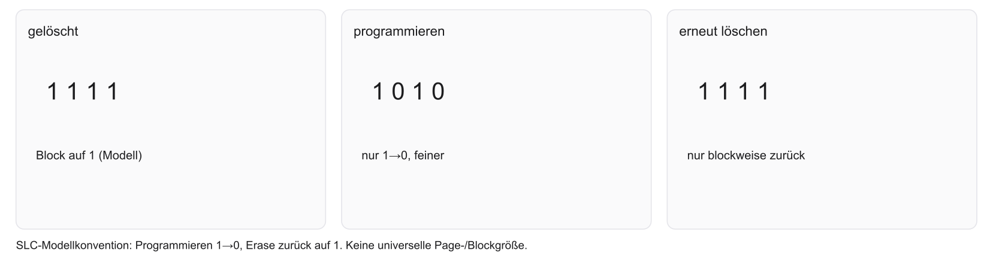

::: notes
Eine NAND-Page wird in einen internen Puffer gelesen. Der Controller gibt daraus Daten aus. Programmieren betrifft Pages, Löschen größere Blöcke. Das Modell gelöscht gleich 1 und Programmieren setzt Bits auf 0 ist eine SLC-Konvention, keine Kodierung jeder Technologie. Code aus NAND wird in ausführbares RAM geladen. Der Weg ist Controller, Page Buffer, CPU oder DMA. Ein normaler C-Store ersetzt keinen Flash-Befehl. Programmieren und Löschen verursachen Verschleiß. Halten Sie drei Ebenen auseinander: die Zelle oder das Bauelement, die Schnittstelle aus Adresse, Takt und Kommando, und die Softwareabbildung in C oder im Linker. Eine Zahl gilt nur mit ihrer Einheit und der genannten Annahme. Sie ist keine Messung und kein Laufzeitergebnis. Steht Code auf der Folie, ist er Lehrcode. Eine RISC-V-Toolchain, Renode und TFLM waren nicht verfügbar, deshalb wurde er nicht übersetzt und nicht ausgeführt. Prüfen Sie danach die offene Frage des Übergangs, bevor Sie die nächste Folie nur als Wiederholung lesen.
:::

## Die Flash-Krankheit: Wear and Tear

- Geheimnis: Flash verschleißt bei jedem Schreibvorgang
- Hohe Spannung beim Tunneln beschädigt die Oxid-Isolation
- Viele Schreib-/Löschzyklen ermüden das Oxid — die Zahl hängt vom Zelltyp ab, sie ist nicht unendlich und nicht für alle Technologien gleich

::: notes
Endurance ist die Zahl der Programmier- und Löschzyklen, Retention die Datenerhaltung danach. P/E bedeutet Program/Erase. Im Zellmodell belasten die hohen Spannungen die Isolation. Ein Host-Write ist nicht automatisch ein physischer Löschvorgang. Puffern, Zusammenfassen und Write Amplification ändern die Zahl der physischen Zyklen. Eine allgemeine Zyklenzahl wird nicht genannt. Ein oft geschriebener Zähler braucht ein anderes Verfahren als einmal programmierte Firmware. Verschleiß lässt sich verteilen, nicht abschaffen. Halten Sie drei Ebenen auseinander: die Zelle oder das Bauelement, die Schnittstelle aus Adresse, Takt und Kommando, und die Softwareabbildung in C oder im Linker. Eine Zahl gilt nur mit ihrer Einheit und der genannten Annahme. Sie ist keine Messung und kein Laufzeitergebnis. Steht Code auf der Folie, ist er Lehrcode. Eine RISC-V-Toolchain, Renode und TFLM waren nicht verfügbar, deshalb wurde er nicht übersetzt und nicht ausgeführt. Prüfen Sie danach die offene Frage des Übergangs, bevor Sie die nächste Folie nur als Wiederholung lesen.
:::

## Die Rettung: Wear Leveling (FTL)

- Wear Leveling: Verschleißausgleich über wechselnde physische Blöcke
- Logischer Sektor → jedes Mal anderer physischer Flash-Block
- Flash Translation Layer (FTL) übersetzt logisch $\leftrightarrow$ physisch
- SD/SSD: FTL im Controller. Bare-Metal: Software muss das selbst leisten

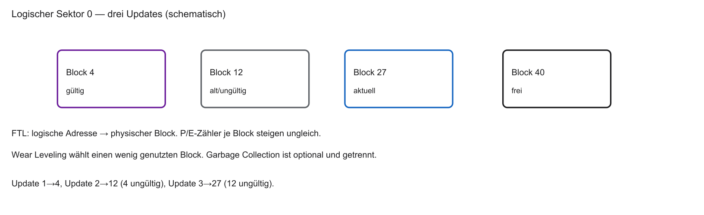

::: notes
FTL bedeutet Flash Translation Layer. Eine logische Adresse wird auf eine physische Page oder einen Block abgebildet. Out-of-Place-Update schreibt eine neue Stelle und markiert die alte als ungültig. Wear Leveling verteilt die Zyklen. Garbage Collection gewinnt freie Blöcke zurück. Das sind drei Aufgaben, keine Synonyme. Nicht jeder Host-Write wechselt den ganzen Block. Bei SD und SSD sitzt das oft im Controller. Rohes Flash auf einem Mikrocontroller braucht ein eigenes Verfahren, nicht automatisch einen SSD-FTL. Ein Journal kann kleiner sein. Danach erscheint die Region in der Memory Map. Halten Sie drei Ebenen auseinander: die Zelle oder das Bauelement, die Schnittstelle aus Adresse, Takt und Kommando, und die Softwareabbildung in C oder im Linker. Eine Zahl gilt nur mit ihrer Einheit und der genannten Annahme. Sie ist keine Messung und kein Laufzeitergebnis. Steht Code auf der Folie, ist er Lehrcode. Eine RISC-V-Toolchain, Renode und TFLM waren nicht verfügbar, deshalb wurde er nicht übersetzt und nicht ausgeführt. Prüfen Sie danach die offene Frage des Übergangs, bevor Sie die nächste Folie nur als Wiederholung lesen.
:::

## Memory Map: Wo liegt der Flash im SoC?

- In der 32-Bit Memory Map ist ein Block für Flash reserviert
- Beispieladressen stehen im Datenblatt der jeweiligen Plattform
- Im Repo gibt es kein `.repl` und kein Linker-Skript — die spätere Map ist ausdrücklich schematisch
- Boot per XIP nur, wenn der Fetch-Pfad den NOR-Flash wortweise lesen kann

::: notes
Eine Memory Map ordnet Adressbereiche den Ressourcen zu. Die Basisadresse ist der Anfang, die Länge die Größe. Der Adressdecoder wertet Bits aus und wählt den Baustein. Die Adresse sagt nichts über Transistoren. Die späteren Zahlen 0x00000000 für 256 KiB Flash und 0x10000000 für 64 KiB RAM sind Annahmen, kein STM32- und kein SiFive-Layout. XIP funktioniert nur, wenn der Fetch den Speicher wortweise lesen kann. RV32 bezeichnet hier das 32-Bit-Integer-Modell. Als Nächstes fassen wir die nichtflüchtigen Eigenschaften zusammen. Halten Sie drei Ebenen auseinander: die Zelle oder das Bauelement, die Schnittstelle aus Adresse, Takt und Kommando, und die Softwareabbildung in C oder im Linker. Eine Zahl gilt nur mit ihrer Einheit und der genannten Annahme. Sie ist keine Messung und kein Laufzeitergebnis. Steht Code auf der Folie, ist er Lehrcode. Eine RISC-V-Toolchain, Renode und TFLM waren nicht verfügbar, deshalb wurde er nicht übersetzt und nicht ausgeführt. Prüfen Sie danach die offene Frage des Übergangs, bevor Sie die nächste Folie nur als Wiederholung lesen.
:::

## Zusammenfassung: Non-Volatile Memory

- Festwertspeicher überlebt Stromausfall und hält Firmware/Boot-Code
- Evolution: Mask-ROM bis blockbasiertes Flash
- NOR-Flash: parallel, XIP, Standard in Mikrocontrollern
- NAND-Flash: seriell, dicht, Massenspeicher; braucht RAM zum Ausführen
- Flash verschleißt (Oxid-Schäden) und braucht Wear Leveling

::: notes
Die Tabelle vergleicht Datenerhalt, Lesezugriff, Update- oder Löschgranularität und die typische Verwendung. ROM ist fest nach der Fertigung, EEPROM elektrisch in kleineren Einheiten änderbar, NOR kann einen Fetch-Pfad bieten, NAND ist dicht und pageorientiert. NOR ist nicht immer ein paralleler Außenbus. NAND ist kein Magnetband. Wear Leveling ist keine Pflicht für eine Region, die nie beschrieben wird. Die Kürzel wurden auf den Einzelfolien definiert. Häufig geänderte Laufzeitdaten brauchen einen anderen Speicher. Halten Sie drei Ebenen auseinander: die Zelle oder das Bauelement, die Schnittstelle aus Adresse, Takt und Kommando, und die Softwareabbildung in C oder im Linker. Eine Zahl gilt nur mit ihrer Einheit und der genannten Annahme. Sie ist keine Messung und kein Laufzeitergebnis. Steht Code auf der Folie, ist er Lehrcode. Eine RISC-V-Toolchain, Renode und TFLM waren nicht verfügbar, deshalb wurde er nicht übersetzt und nicht ausgeführt. Prüfen Sie danach die offene Frage des Übergangs, bevor Sie die nächste Folie nur als Wiederholung lesen.
:::

## Der Bedarf an Arbeitsspeicher

Wir brauchen Speicher, der:

- im Bereich der Pipeline nutzbar liest und schreibt
- sehr oft beschreibbar ist, ohne Flash-artigen Verschleiß

Antwort: volatiler Speicher (RAM).\
Zwei Technologien: **SRAM** und **DRAM**.

::: notes
Arbeitsvariablen, der Stack und Zwischenergebnisse werden oft geändert und sollen passende Latenz haben. Nicht jede Variable liegt im RAM. Der Compiler kann einen Wert in einem Register halten oder entfernen. Nichtflüchtigkeit allein wäre kein Hindernis. Hier stören die Updatekosten des betrachteten Flash. ALU, RAM, SRAM und DRAM werden lokal benannt. Eine Messwertsumme, die jede Probe neu addiert, ist ein Beispiel häufiger Änderungen. Vor der Zellphysik sichern die Fragen die Flash-Grundlagen. Halten Sie drei Ebenen auseinander: die Zelle oder das Bauelement, die Schnittstelle aus Adresse, Takt und Kommando, und die Softwareabbildung in C oder im Linker. Eine Zahl gilt nur mit ihrer Einheit und der genannten Annahme. Sie ist keine Messung und kein Laufzeitergebnis. Steht Code auf der Folie, ist er Lehrcode. Eine RISC-V-Toolchain, Renode und TFLM waren nicht verfügbar, deshalb wurde er nicht übersetzt und nicht ausgeführt. Prüfen Sie danach die offene Frage des Übergangs, bevor Sie die nächste Folie nur als Wiederholung lesen.
:::

## Fragen? — Non-Volatile

- Flash-Architektur?
- Execute-in-Place (XIP)?
- Wear Leveling?

::: notes
Drei Fragen. Erstens: Warum legt const nicht in Flash ab? Weil const eine Typregel ist und die Section der Linker setzt. Zweitens: Warum kann 0xA5 nach 0x5A im gewählten NOR-Modell eine Löschung brauchen? Weil Bits von 0 nach 1 nur durch Erase des größeren Bereichs zurückkehren. Drittens: Warum ist Wear Leveling kein vollständiges FTL? Weil Übersetzung, Verschleißverteilung und Garbage Collection verschieden sind. XIP, Blocklöschung und FTL wurden oben definiert. Nach der Pause folgt der flüchtige Speicher. Halten Sie drei Ebenen auseinander: die Zelle oder das Bauelement, die Schnittstelle aus Adresse, Takt und Kommando, und die Softwareabbildung in C oder im Linker. Eine Zahl gilt nur mit ihrer Einheit und der genannten Annahme. Sie ist keine Messung und kein Laufzeitergebnis. Steht Code auf der Folie, ist er Lehrcode. Eine RISC-V-Toolchain, Renode und TFLM waren nicht verfügbar, deshalb wurde er nicht übersetzt und nicht ausgeführt. Prüfen Sie danach die offene Frage des Übergangs, bevor Sie die nächste Folie nur als Wiederholung lesen.
:::

## Kurze Pause

10 Minuten Pause.\
Danach:

- SRAM (6-Transistor-Zelle)
- DRAM (1-Transistor-Zelle und Refresh)
- Spezialspeicher (FIFOs und Dual-Ported RAM)

::: notes
Zehn Minuten Pause. Bisher hielten nichtflüchtige Zellen Daten ohne Versorgung, aber Updates sind teuer. Danach folgen SRAM und DRAM für häufig geänderte Daten. Eine freiwillige Frage: Warum reicht ein Kondensator nicht als Dauerspeicher? Weil Leckströme die Spannung ändern. Die spätere Antwort ist der Refresh. FIFO und SRAM werden hier nicht neu eingeführt.
:::

## Volatiler Speicher: RAM

- Arbeitsspeicher: Kurzzeitgedächtnis des Prozessors
- Volatil: Daten weg ohne Versorgungsspannung
- Wahlfreier Zugriff: jede Adresse ist direkt wählbar. Die Latenz muss nicht gleich sein
- Zwei Architekturen: SRAM (Static RAM) und DRAM (Dynamic RAM)
- Gleicher Zweck, grundlegend andere Physik

::: notes
RAM bedeutet Random-Access Memory und beschreibt die direkte Adressierbarkeit, nicht gleiche Latenz für jede Adresse. Flüchtig heißt, ohne Versorgung ist der Inhalt nicht zugesichert. SRAM ist Static RAM, DRAM Dynamic RAM. Laufzeitvariablen liegen in einem typischen Bare-Metal-Programm oft im SRAM. const-Objekte, Registerwerte und wegoptimierte Variablen widerlegen die Aussage, alle Variablen lägen im RAM. SRAM hält Spannungszustände durch Rückkopplung, DRAM eine Ladung, die gepflegt werden muss. Die nächste Übersicht trennt ihre Aufgaben. Halten Sie drei Ebenen auseinander: die Zelle oder das Bauelement, die Schnittstelle aus Adresse, Takt und Kommando, und die Softwareabbildung in C oder im Linker. Eine Zahl gilt nur mit ihrer Einheit und der genannten Annahme. Sie ist keine Messung und kein Laufzeitergebnis. Steht Code auf der Folie, ist er Lehrcode. Eine RISC-V-Toolchain, Renode und TFLM waren nicht verfügbar, deshalb wurde er nicht übersetzt und nicht ausgeführt. Prüfen Sie danach die offene Frage des Übergangs, bevor Sie die nächste Folie nur als Wiederholung lesen.
:::

## RAM: SRAM und DRAM

```{mermaid}
%%| fig-width: 4.2
%%{init: {'theme': 'base', 'themeVariables': {'background': '#FFFFFF', 'primaryColor': '#FFFFFF', 'primaryBorderColor': '#E5E5EA', 'primaryTextColor': '#1D1D1F', 'lineColor': '#86868B', 'secondaryColor': '#F5F5F7', 'tertiaryColor': '#FFFFFF', 'mainBkg': '#FFFFFF', 'nodeBorder': '#E5E5EA', 'clusterBkg': '#F5F5F7', 'clusterBorder': '#E5E5EA', 'titleColor': '#1D1D1F', 'edgeLabelBackground': '#FFFFFF'}}}%%
flowchart LR
  A[RAM] --> B[SRAM]
  A --> C[DRAM]
  B --> D[Sehr schnell, teuer, CPU-nah]
  C --> E[Langsamer, billig, Hauptspeicher]
  style A fill:#FFFFFF,stroke:#E2001A,stroke-width:2px !important
```

::: notes
SRAM sitzt häufig klein und schnell nahe am Kern, DRAM als größerer Hauptspeicher in Systemen, die ihn haben. Ein Registerfile ist nicht pauschal eine 6T-Zelle. Beide Technologien sind flüchtig. Die Platzierung ist eine Entwurfsentscheidung, keine Naturregel. Die Sensor-MCU ohne DRAM bleibt das Gegenbeispiel. CPU, SRAM, DRAM und Cache werden hier nur als Rollen benannt. Zuerst zeigt SRAM, wie ein Zustand ohne Refresh hält. Halten Sie drei Ebenen auseinander: die Zelle oder das Bauelement, die Schnittstelle aus Adresse, Takt und Kommando, und die Softwareabbildung in C oder im Linker. Eine Zahl gilt nur mit ihrer Einheit und der genannten Annahme. Sie ist keine Messung und kein Laufzeitergebnis. Steht Code auf der Folie, ist er Lehrcode. Eine RISC-V-Toolchain, Renode und TFLM waren nicht verfügbar, deshalb wurde er nicht übersetzt und nicht ausgeführt. Prüfen Sie danach die offene Frage des Übergangs, bevor Sie die nächste Folie nur als Wiederholung lesen.
:::

## SRAM — Prinzip

- Statisch: Wert bleibt ohne Auffrischen, solange Strom anliegt
- Kein Refresh nötig (im Gegensatz zu DRAM)
- Schnell auf der Zell- und Cache-Ebene; die Systemlatenz ist eine andere Größe
- Keine pauschale Grenze unter $1\,\mathrm{ns}$ ohne benannte Ebene
- Kehrseite: geringe Dichte — viele Transistoren pro Zelle

::: notes
Statisch bedeutet stabile Speicherung bei anliegender Versorgung ohne periodisches Auffrischen. Es bedeutet nicht nichtflüchtig und nicht stromlos. Die Zelle, das SRAM-Makro mit Decoder und Sense Amplifier und die Cache-Latenz sind drei Ebenen. Ein Cache-Hit ist nicht universell ein Takt, und eine Sub-Nanosekunden-Zahl wird ohne benannte Ebene nicht behauptet. Die Rückkopplung hält die Pegel. Das D-Flip-Flop ist der Vergleich, nicht die übliche große Bitzelle. Halten Sie drei Ebenen auseinander: die Zelle oder das Bauelement, die Schnittstelle aus Adresse, Takt und Kommando, und die Softwareabbildung in C oder im Linker. Eine Zahl gilt nur mit ihrer Einheit und der genannten Annahme. Sie ist keine Messung und kein Laufzeitergebnis. Steht Code auf der Folie, ist er Lehrcode. Eine RISC-V-Toolchain, Renode und TFLM waren nicht verfügbar, deshalb wurde er nicht übersetzt und nicht ausgeführt. Prüfen Sie danach die offene Frage des Übergangs, bevor Sie die nächste Folie nur als Wiederholung lesen.
:::

## Refresher: Das D-Flip-Flop (MCT1)

- Register in MCT1: D-Flip-Flops
- Master-Slave-D-FF: oft über 20 Transistoren
- 1 MB mit Flip-Flops: Hunderte Millionen Transistoren
- Zu viel Fläche und Abwärme
- Lösung: Design auf das physikalische Minimum eindampfen

::: notes
D ist der Dateneingang, Q der gespeicherte Ausgang, CLK der Takt. Ein flankengesteuertes D-Flip-Flop übernimmt D zu einem Flankenzeitpunkt. Das Logikmodell ist nicht die Transistorschaltung. Etwa 20 Transistoren sind eine Vergleichsannahme. Für 1 MiB, 8388608 Bit, wären das 167772160 Transistoren nur in diesem Vergleich. Register aus Flip-Flops bleiben für wenige Bits sinnvoll. Ein Master-Slave-Aufbau erklärt den Aufwand und das Flankenverhalten. Halten Sie drei Ebenen auseinander: die Zelle oder das Bauelement, die Schnittstelle aus Adresse, Takt und Kommando, und die Softwareabbildung in C oder im Linker. Eine Zahl gilt nur mit ihrer Einheit und der genannten Annahme. Sie ist keine Messung und kein Laufzeitergebnis. Steht Code auf der Folie, ist er Lehrcode. Eine RISC-V-Toolchain, Renode und TFLM waren nicht verfügbar, deshalb wurde er nicht übersetzt und nicht ausgeführt. Prüfen Sie danach die offene Frage des Übergangs, bevor Sie die nächste Folie nur als Wiederholung lesen.
:::

## D-Flip-Flop: Master und Slave

```{mermaid}
%%| fig-width: 3.8
%%{init: {'theme': 'base', 'themeVariables': {'background': '#FFFFFF', 'primaryColor': '#FFFFFF', 'primaryBorderColor': '#E5E5EA', 'primaryTextColor': '#1D1D1F', 'lineColor': '#86868B', 'secondaryColor': '#F5F5F7', 'tertiaryColor': '#FFFFFF', 'mainBkg': '#FFFFFF', 'nodeBorder': '#E5E5EA', 'clusterBkg': '#F5F5F7', 'clusterBorder': '#E5E5EA', 'titleColor': '#1D1D1F', 'edgeLabelBackground': '#FFFFFF'}}}%%
flowchart TD
  D[Daten D] --> M[Master-Latch]
  CLK[Clock] --> M
  CLK --> S[Slave-Latch]
  M --> S
  S --> Q[Ausgang Q]
  style M fill:#FFFFFF,stroke:#E2001A,stroke-width:2px !important
  style S fill:#FFFFFF,stroke:#E2001A,stroke-width:2px !important
```

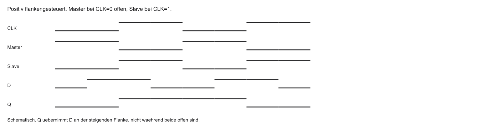

- Master bei CLK = 0 transparent, Slave bei CLK = 1. Die Phasen sind entgegengesetzt
- Übernahme an der steigenden Flanke. Beide Latches dürfen nicht gleichzeitig offen sein

::: notes
Zwei Latches liegen hintereinander. Im gewählten positiv flankengesteuerten Modell ist der Master bei CLK gleich 0 transparent und der Slave bei CLK gleich 1. Die Enable-Phasen sind entgegengesetzt. Das Zeitbild zeigt CLK, die beiden Enables, D und Q. Q übernimmt den Wert an der steigenden Flanke. Level-sensitive heißt pegeloffen, edge-triggered flankengesteuert. Wären beide zugleich offen, liefe D unkontrolliert nach Q. SRAM braucht keine solche Taktzelle für jedes Bit, sondern eine kompaktere Rückkopplung. Halten Sie drei Ebenen auseinander: die Zelle oder das Bauelement, die Schnittstelle aus Adresse, Takt und Kommando, und die Softwareabbildung in C oder im Linker. Eine Zahl gilt nur mit ihrer Einheit und der genannten Annahme. Sie ist keine Messung und kein Laufzeitergebnis. Steht Code auf der Folie, ist er Lehrcode. Eine RISC-V-Toolchain, Renode und TFLM waren nicht verfügbar, deshalb wurde er nicht übersetzt und nicht ausgeführt. Prüfen Sie danach die offene Frage des Übergangs, bevor Sie die nächste Folie nur als Wiederholung lesen.
:::
## Die 6T-SRAM-Zelle

- Klassisches SRAM-Bit: exakt 6 Transistoren (6T)
- Vier Transistoren: zwei kreuzgekoppelte Inverter
- Zwei Access-Transistoren als „Türsteher“
- Wordline (WL): öffnet die Zelle
- Bitlines (BL / $\overline{\mathrm{BL}}$): Daten hinein und heraus

::: notes
Die klassische Zelle hat sechs Transistoren. Zwei CMOS-Inverter bestehen aus vier Transistoren, zwei weitere sind Zugriffstransistoren. CMOS bedeutet Complementary Metal-Oxide-Semiconductor. Es sind nicht vier Inverter. WL ist die Wordline und öffnet beide Zugriffstransistoren. BL und BL_bar sind die komplementären Bitleitungen. nMOS und pMOS sind n- und p-Kanal-Transistoren. 6T ist ein verbreitetes Beispiel, nicht die Definition jedes SRAM. Die Übersicht ordnet dieselben sechs Bauelemente. Halten Sie drei Ebenen auseinander: die Zelle oder das Bauelement, die Schnittstelle aus Adresse, Takt und Kommando, und die Softwareabbildung in C oder im Linker. Eine Zahl gilt nur mit ihrer Einheit und der genannten Annahme. Sie ist keine Messung und kein Laufzeitergebnis. Steht Code auf der Folie, ist er Lehrcode. Eine RISC-V-Toolchain, Renode und TFLM waren nicht verfügbar, deshalb wurde er nicht übersetzt und nicht ausgeführt. Prüfen Sie danach die offene Frage des Übergangs, bevor Sie die nächste Folie nur als Wiederholung lesen.
:::

## 6T-Zelle: Überblick

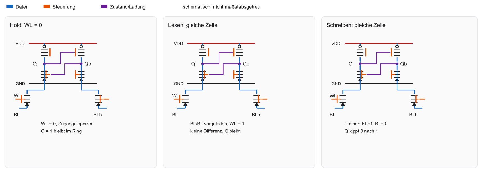

::: notes
Die Zelle hat VDD als positive Versorgung und GND als Bezug. Q und Q_bar sind die komplementären Speicherknoten. Zwei kreuzgekoppelte Inverter bestätigen einander. Zwei Zugriffstransistoren hängen an derselben WL. BL und BL_bar führen nach außen. Hold, Lesen und Schreiben benutzen dieselbe Geometrie und ändern die Signale. Farben allein tragen die Bedeutung nicht. Die Kreuzkopplung erklärt als Nächstes den stabilen Zustand. Halten Sie drei Ebenen auseinander: die Zelle oder das Bauelement, die Schnittstelle aus Adresse, Takt und Kommando, und die Softwareabbildung in C oder im Linker. Eine Zahl gilt nur mit ihrer Einheit und der genannten Annahme. Sie ist keine Messung und kein Laufzeitergebnis. Steht Code auf der Folie, ist er Lehrcode. Eine RISC-V-Toolchain, Renode und TFLM waren nicht verfügbar, deshalb wurde er nicht übersetzt und nicht ausgeführt. Prüfen Sie danach die offene Frage des Übergangs, bevor Sie die nächste Folie nur als Wiederholung lesen.
:::

## Der kreuzgekoppelte Inverter-Ring

- Bit speichern ohne Taktsignal
- Inverter: $1 \rightarrow 0$, $0 \rightarrow 1$
- Ausgang von Inverter 1 $\rightarrow$ Eingang von Inverter 2 und zurück
- Stabiler Ring: Zustand hält sich selbst
- Bistabilität: Gleichgewicht, solange Strom anliegt

::: notes
Liegt Q auf 1 und Q_bar auf 0, bestätigt jeder Inverter den anderen. Der zweite stabile Zustand ist Q gleich 0 und Q_bar gleich 1. NOT ist die Negation. Zwei Inverter ergeben eine positive Rückkopplung des Zustands. Ring meint diese Signalrückkopplung, keinen dauerhaft kreisenden Strom. VDD setzt den Rahmen für die Pegel. Ohne aktivierte WL bleibt die Zelle von den Bitleitungen weitgehend getrennt. Halten Sie drei Ebenen auseinander: die Zelle oder das Bauelement, die Schnittstelle aus Adresse, Takt und Kommando, und die Softwareabbildung in C oder im Linker. Eine Zahl gilt nur mit ihrer Einheit und der genannten Annahme. Sie ist keine Messung und kein Laufzeitergebnis. Steht Code auf der Folie, ist er Lehrcode. Eine RISC-V-Toolchain, Renode und TFLM waren nicht verfügbar, deshalb wurde er nicht übersetzt und nicht ausgeführt. Prüfen Sie danach die offene Frage des Übergangs, bevor Sie die nächste Folie nur als Wiederholung lesen.
:::

## Zustand halten (Hold State)

- Wordline $= 0\,\mathrm{V}$: Hold State
- Access-Transistoren sperren
- Zelle von den Bitlines isoliert
- Im idealen CMOS-Ruhezustand gibt es keinen dauerhaften Pfad von VDD nach GND
- Real bleiben Leckströme. Der Zustand wird durch die Spannungsrückkopplung gehalten

::: notes
Im Hold ist WL gleich 0 und die Zugriffstransistoren sperren. Die Zelle ist von BL und BL_bar isoliert. Im idealen stabilen CMOS-Zustand gibt es keinen dauerhaften leitenden Pfad von VDD nach GND. Der Zustand wird durch die rückgekoppelten Spannungen gehalten. Real fließen Leckströme. Bit gefangen ist nur eine Metapher. Die große Zeichnung zeigt genau diesen Zustand. Halten Sie drei Ebenen auseinander: die Zelle oder das Bauelement, die Schnittstelle aus Adresse, Takt und Kommando, und die Softwareabbildung in C oder im Linker. Eine Zahl gilt nur mit ihrer Einheit und der genannten Annahme. Sie ist keine Messung und kein Laufzeitergebnis. Steht Code auf der Folie, ist er Lehrcode. Eine RISC-V-Toolchain, Renode und TFLM waren nicht verfügbar, deshalb wurde er nicht übersetzt und nicht ausgeführt. Prüfen Sie danach die offene Frage des Übergangs, bevor Sie die nächste Folie nur als Wiederholung lesen.
:::

## Hold State — Schema


Linkes Panel der 6T-Abbildung bleibt der Vergleich. Diese Folie zeigt den Haltezustand groß.

::: notes
Die eigene Abbildung zeigt WL gleich 0, Q gleich 1 und Q_bar gleich 0. Beide Zugriffstransistoren sind aus. Die Kreuzkopplung ist sichtbar, ein erfundener Kreisstrom nicht. VDD, GND, WL, BL und BL_bar behalten die Bedeutung der vorigen Folie. Die Notiz muss ohne Rückblättern lesbar sein: Halten ist Isolation plus Rückkopplung. Zum Lesen werden die Bitleitungen vorgeladen und dann kurz angekoppelt. Halten Sie drei Ebenen auseinander: die Zelle oder das Bauelement, die Schnittstelle aus Adresse, Takt und Kommando, und die Softwareabbildung in C oder im Linker. Eine Zahl gilt nur mit ihrer Einheit und der genannten Annahme. Sie ist keine Messung und kein Laufzeitergebnis. Steht Code auf der Folie, ist er Lehrcode. Eine RISC-V-Toolchain, Renode und TFLM waren nicht verfügbar, deshalb wurde er nicht übersetzt und nicht ausgeführt. Prüfen Sie danach die offene Frage des Übergangs, bevor Sie die nächste Folie nur als Wiederholung lesen.
:::

## SRAM Lesen

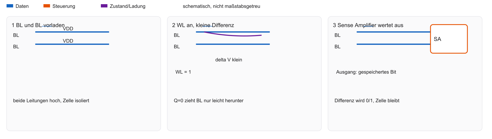

- Die Zelle zieht eine Leitung nur leicht; sie wird im vorgesehenen Lesen nicht umgeschrieben

::: notes
Zuerst werden beide Bitleitungen auf VDD vorgeladen, dann die Vorladetreiber gelöst. WL wird aktiv. Der niedrige Zellknoten entlädt seine Bitleitung nur wenig. Der Sense Amplifier digitalisiert die Differenz. Danach wird WL wieder geschlossen. Der Zellzustand soll beim vorgesehenen Lesen erhalten bleiben. Read Stability ist die qualitative Fähigkeit, nicht umzukippen. Eine universelle Transistorgrößenregel wird nicht behauptet. Schreiben muss die Rückkopplung dagegen bewusst überwinden. Halten Sie drei Ebenen auseinander: die Zelle oder das Bauelement, die Schnittstelle aus Adresse, Takt und Kommando, und die Softwareabbildung in C oder im Linker. Eine Zahl gilt nur mit ihrer Einheit und der genannten Annahme. Sie ist keine Messung und kein Laufzeitergebnis. Steht Code auf der Folie, ist er Lehrcode. Eine RISC-V-Toolchain, Renode und TFLM waren nicht verfügbar, deshalb wurde er nicht übersetzt und nicht ausgeführt. Prüfen Sie danach die offene Frage des Übergangs, bevor Sie die nächste Folie nur als Wiederholung lesen.
:::

## SRAM Schreiben

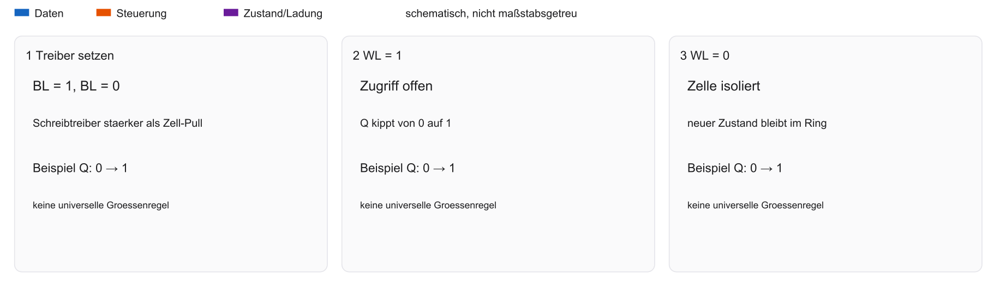

- Die Schreibtreiber müssen die Rückkopplung überwinden; eine feste Transistor-Größenregel gilt nicht für jede Bibliothek

::: notes
Soll Q von 0 nach 1, treibt das gewählte Modell BL auf 1 und BL_bar auf 0. Die Treiber setzen die Pegel, WL öffnet den Zugriff, die Zelle kippt, WL schließt. Die analoge Treiberstärke und die Zellauslegung balancieren Schreibbarkeit und Lesestabilität. Eine für alle Prozesse geltende Größenregel gibt es hier nicht. Nach dem Schreiben gilt wieder Hold. Der stabile Zustand ohne Refresh macht SRAM für kleine schnelle Speicher attraktiv. Halten Sie drei Ebenen auseinander: die Zelle oder das Bauelement, die Schnittstelle aus Adresse, Takt und Kommando, und die Softwareabbildung in C oder im Linker. Eine Zahl gilt nur mit ihrer Einheit und der genannten Annahme. Sie ist keine Messung und kein Laufzeitergebnis. Steht Code auf der Folie, ist er Lehrcode. Eine RISC-V-Toolchain, Renode und TFLM waren nicht verfügbar, deshalb wurde er nicht übersetzt und nicht ausgeführt. Prüfen Sie danach die offene Frage des Übergangs, bevor Sie die nächste Folie nur als Wiederholung lesen.
:::

## Vorteile von SRAM

- Sehr kurze Zugriffszeit auf Makro-Ebene — nicht mit einem kompletten DRAM-Burst vergleichen
- Kein Refresh der Zelle
- Einfache Schnittstelle: Adresse anlegen, Daten abholen
- Geringer Stromverbrauch bei Inaktivität
- Integration im selben Logic-Prozess wie die ALU

::: notes
Auf der betrachteten Ebene ist der Zugriff kurz, ein periodischer Refresh fehlt, und die Zellen lassen sich in Logikprozessen integrieren. Eine asynchrone Schnittstelle braucht eine gültige Adresse, Steuersignale und eine spezifizierte Zugriffszeit. Es gibt auch synchrone SRAMs. Die Pipeline wird nicht pauschal kaum gebremst. Decoder, Verstärker und Leitungen bleiben. ALU und Cache werden nur als Nutzer benannt. Sechs Transistoren und die Verschaltung kosten Fläche und Energie. Halten Sie drei Ebenen auseinander: die Zelle oder das Bauelement, die Schnittstelle aus Adresse, Takt und Kommando, und die Softwareabbildung in C oder im Linker. Eine Zahl gilt nur mit ihrer Einheit und der genannten Annahme. Sie ist keine Messung und kein Laufzeitergebnis. Steht Code auf der Folie, ist er Lehrcode. Eine RISC-V-Toolchain, Renode und TFLM waren nicht verfügbar, deshalb wurde er nicht übersetzt und nicht ausgeführt. Prüfen Sie danach die offene Frage des Übergangs, bevor Sie die nächste Folie nur als Wiederholung lesen.
:::

## Nachteile von SRAM

- Geringe Datendichte: 6 Transistoren pro Bit brauchen Fläche
- Hohe Kosten: Chipfläche ist teuer
- Kapazitäts-Limit: selten mehr als einige Dutzend MB SRAM als Cache
- Ungeeignet für Massenspeicher (Laptop mit 16 GB SRAM wäre unrealistisch)

::: notes
Gegenüber der klassischen 1T1C-DRAM-Zelle ist die Bitdichte geringer und der Preis je Bit im passenden Vergleich höher. Die Fläche hängt nicht nur von der Transistorzahl ab. Leitungen, Abstände und Peripherie zählen. Eine absolute Aussage, SRAM erreiche niemals Gigabyte, wird ohne Beleg nicht gemacht. Das 6T- und 20T-Beispiel zählt nur Bauelemente. Auch im Ruhezustand bleiben Leckströme. Halten Sie drei Ebenen auseinander: die Zelle oder das Bauelement, die Schnittstelle aus Adresse, Takt und Kommando, und die Softwareabbildung in C oder im Linker. Eine Zahl gilt nur mit ihrer Einheit und der genannten Annahme. Sie ist keine Messung und kein Laufzeitergebnis. Steht Code auf der Folie, ist er Lehrcode. Eine RISC-V-Toolchain, Renode und TFLM waren nicht verfügbar, deshalb wurde er nicht übersetzt und nicht ausgeführt. Prüfen Sie danach die offene Frage des Übergangs, bevor Sie die nächste Folie nur als Wiederholung lesen.
:::

## Die Leckströme (Leakage)

- Moderne Nodes (z. B. 3 nm): Transistoren sperren nicht mehr perfekt
- Static Leakage auch im Hold State (Quantentunneling)
- Folge: Strom und Wärme nur zum Datenhalten
- Mobile SoCs: Power Gating ganzer SRAM-Blöcke im Standby

::: notes
Leakage ist Leckstrom. Dynamische Energie entsteht beim Schalten, statische Verlustleistung im Ruhezustand. Subthreshold- und Gate-Leckströme sind Beispiele, nicht alles ist Quantentunneln. Ein Knotenname wie 3 nm ist keine allgemeine exakte Kanallänge. Clock Gating schaltet den Takt ab und erhält den Zustand. Power Gating trennt die Versorgung und verliert normalen SRAM-Inhalt, wenn keine Retention vorgesehen ist. Deshalb wird SRAM gezielt für kleine schnelle Speicher eingesetzt. Halten Sie drei Ebenen auseinander: die Zelle oder das Bauelement, die Schnittstelle aus Adresse, Takt und Kommando, und die Softwareabbildung in C oder im Linker. Eine Zahl gilt nur mit ihrer Einheit und der genannten Annahme. Sie ist keine Messung und kein Laufzeitergebnis. Steht Code auf der Folie, ist er Lehrcode. Eine RISC-V-Toolchain, Renode und TFLM waren nicht verfügbar, deshalb wurde er nicht übersetzt und nicht ausgeführt. Prüfen Sie danach die offene Frage des Übergangs, bevor Sie die nächste Folie nur als Wiederholung lesen.
:::

## Einsatzgebiet von SRAM im SoC

- Registerfiles können aus Flip-Flops, Latches oder speziellen SRAM-Strukturen bestehen
- Ein RISC-V-Register ist nicht pauschal eine Standard-6T-Zelle
- L1/L2 sind häufig SRAM-Makros; die Latenz eines Cache-Hits ist nicht die Zellzeit allein

::: notes
SRAM steht in Caches, in kleinen MCU-Arbeitsspeichern und in passenden Puffern. Ein Registerfile kann mehrportig oder anders aufgebaut sein. Ein L1-Miss geht zur nächsten vorhandenen Ebene, etwa L2, und nicht sofort ins DRAM. Eine MCU kann Flash und SRAM ohne DRAM haben. CPU, MCU, SRAM und Cache-Miss werden lokal so verstanden. Die Hierarchie ordnet diese Rollen. Halten Sie drei Ebenen auseinander: die Zelle oder das Bauelement, die Schnittstelle aus Adresse, Takt und Kommando, und die Softwareabbildung in C oder im Linker. Eine Zahl gilt nur mit ihrer Einheit und der genannten Annahme. Sie ist keine Messung und kein Laufzeitergebnis. Steht Code auf der Folie, ist er Lehrcode. Eine RISC-V-Toolchain, Renode und TFLM waren nicht verfügbar, deshalb wurde er nicht übersetzt und nicht ausgeführt. Prüfen Sie danach die offene Frage des Übergangs, bevor Sie die nächste Folie nur als Wiederholung lesen.
:::

## SRAM in der Hierarchie

```{mermaid}
%%| fig-width: 4.2
%%{init: {'theme': 'base', 'themeVariables': {'background': '#FFFFFF', 'primaryColor': '#FFFFFF', 'primaryBorderColor': '#E5E5EA', 'primaryTextColor': '#1D1D1F', 'lineColor': '#86868B', 'secondaryColor': '#F5F5F7', 'tertiaryColor': '#FFFFFF', 'mainBkg': '#FFFFFF', 'nodeBorder': '#E5E5EA', 'clusterBkg': '#F5F5F7', 'clusterBorder': '#E5E5EA', 'titleColor': '#1D1D1F', 'edgeLabelBackground': '#FFFFFF'}}}%%
flowchart LR
  CPU[CPU] --> L1[L1 Cache SRAM]
  L1 --> L2[L2 Cache SRAM]
  L2 --> L3[L3 Cache SRAM]
  L3 --> RAM[Main Memory DRAM]
  style L1 fill:#FFFFFF,stroke:#E2001A,stroke-width:2px !important
```

::: notes
Die 6T-Zelle erklärt die Technik, der Cache die Funktion. Kleine schnelle Ebenen werden mit größeren langsameren kombiniert. Ein Cache braucht zusätzlich Tags und Steuerung. SRAM-Technologie und Cache sind verschiedene Wörter. L1, L2 und L3 sind Ebenen, keine festen Produktgrößen. Register und Cachezellen werden nicht gleichgesetzt. Der Floorplan zeigt eine schematische räumliche Anordnung. Halten Sie drei Ebenen auseinander: die Zelle oder das Bauelement, die Schnittstelle aus Adresse, Takt und Kommando, und die Softwareabbildung in C oder im Linker. Eine Zahl gilt nur mit ihrer Einheit und der genannten Annahme. Sie ist keine Messung und kein Laufzeitergebnis. Steht Code auf der Folie, ist er Lehrcode. Eine RISC-V-Toolchain, Renode und TFLM waren nicht verfügbar, deshalb wurde er nicht übersetzt und nicht ausgeführt. Prüfen Sie danach die offene Frage des Übergangs, bevor Sie die nächste Folie nur als Wiederholung lesen.
:::

## Schematischer Floorplan

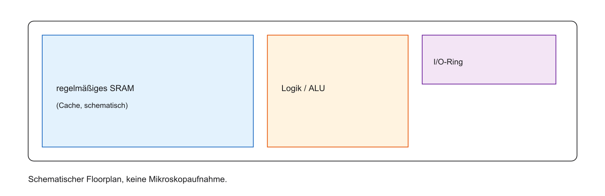

::: notes
Ein Floorplan ordnet Funktionsblöcke auf dem Chip. Die Abbildung ist nicht maßstäblich und keine Flächenmessung. Core, ALU, Registerfile, Cache und Peripheriebereich sind Rollen, soweit sie gezeichnet sind. Nähe kann Leitungen kürzen und beweist keine Zugriffszeit. Die Die-Grenze und die Legende trennen On-Chip von außen. Die SRAM-Zusammenfassung verbindet Zelle, Kosten und Einsatz. Halten Sie drei Ebenen auseinander: die Zelle oder das Bauelement, die Schnittstelle aus Adresse, Takt und Kommando, und die Softwareabbildung in C oder im Linker. Eine Zahl gilt nur mit ihrer Einheit und der genannten Annahme. Sie ist keine Messung und kein Laufzeitergebnis. Steht Code auf der Folie, ist er Lehrcode. Eine RISC-V-Toolchain, Renode und TFLM waren nicht verfügbar, deshalb wurde er nicht übersetzt und nicht ausgeführt. Prüfen Sie danach die offene Frage des Übergangs, bevor Sie die nächste Folie nur als Wiederholung lesen.
:::

## Zusammenfassung SRAM

- Typ: volatiler Arbeitsspeicher
- Zelle: 6T (Inverter-Ring)
- Vorteile: kein Refresh, sehr schnell
- Nachteile: flächenintensiv, Leckströme bei kleinen Nodes
- Einsatz: Caches und CPU-naher Speicher im SoC

::: notes
Zwei kreuzgekoppelte CMOS-Inverter ergeben zwei stabile Zustände bei Versorgung. Zwei Zugriffstransistoren koppeln die Zelle an. Ein periodischer Refresh entfällt. Die Zellzeit ist nicht die Systemlatenz. SRAM bleibt flüchtig. Ein kurzer Puffer spricht für SRAM, ein großer billiger Hauptspeicher oft für DRAM. Die Fragen prüfen die Zelle, bevor DRAM den anderen Kompromiss zeigt. Halten Sie drei Ebenen auseinander: die Zelle oder das Bauelement, die Schnittstelle aus Adresse, Takt und Kommando, und die Softwareabbildung in C oder im Linker. Eine Zahl gilt nur mit ihrer Einheit und der genannten Annahme. Sie ist keine Messung und kein Laufzeitergebnis. Steht Code auf der Folie, ist er Lehrcode. Eine RISC-V-Toolchain, Renode und TFLM waren nicht verfügbar, deshalb wurde er nicht übersetzt und nicht ausgeführt. Prüfen Sie danach die offene Frage des Übergangs, bevor Sie die nächste Folie nur als Wiederholung lesen.
:::

## Fragen? — SRAM

- Aufbau der 6T-Zelle?
- Schreib- oder Lesevorgang?
- Warum kein Refresh bei SRAM?

::: notes
Warum ist statisches RAM flüchtig? Weil ohne Versorgung die Pegel nicht zugesichert sind. Wozu zwei Bitleitungen? Für komplementäres Schreiben und ein differentielles Lesesignal. Was unterscheidet Lesen und Schreiben? Lesen soll den Zustand erhalten, Schreiben kippt ihn. WL und BL wurden oben definiert. Falsch wären ein dauernder Haltestrom als Prinzip und die Gleichsetzung mit einem getakteten Flip-Flop. Für mehr Dichte folgen weniger Bauteile und dafür Pflege. Halten Sie drei Ebenen auseinander: die Zelle oder das Bauelement, die Schnittstelle aus Adresse, Takt und Kommando, und die Softwareabbildung in C oder im Linker. Eine Zahl gilt nur mit ihrer Einheit und der genannten Annahme. Sie ist keine Messung und kein Laufzeitergebnis. Steht Code auf der Folie, ist er Lehrcode. Eine RISC-V-Toolchain, Renode und TFLM waren nicht verfügbar, deshalb wurde er nicht übersetzt und nicht ausgeführt. Prüfen Sie danach die offene Frage des Übergangs, bevor Sie die nächste Folie nur als Wiederholung lesen.
:::

## Volatiler Speicher: DRAM

- Ziel: Gigabyte Arbeitsspeicher zu akzeptablen Kosten
- Weg: Bauteile pro Bit radikal reduzieren
- Ergebnis: Dynamic RAM (DRAM)
- Dynamisch: Zelle hält den Zustand nicht allein — Ladung geht in Millisekunden verloren
- Zelle einfach, Controller komplex

::: notes
DRAM bedeutet Dynamic Random-Access Memory. Dynamisch bezieht sich auf den Ladungszustand, der erhalten werden muss, nicht auf malloc. Ein klassisches DRAM braucht Refresh und einen Controller. Eine feste Lebensdauer jeder Zelle in Millisekunden wird nicht zugesichert. Große Hauptspeicher und kleine MCUs ohne DRAM sind verschiedene Systeme. Die klassische Zelle hat einen Transistor und einen Kondensator. Halten Sie drei Ebenen auseinander: die Zelle oder das Bauelement, die Schnittstelle aus Adresse, Takt und Kommando, und die Softwareabbildung in C oder im Linker. Eine Zahl gilt nur mit ihrer Einheit und der genannten Annahme. Sie ist keine Messung und kein Laufzeitergebnis. Steht Code auf der Folie, ist er Lehrcode. Eine RISC-V-Toolchain, Renode und TFLM waren nicht verfügbar, deshalb wurde er nicht übersetzt und nicht ausgeführt. Prüfen Sie danach die offene Frage des Übergangs, bevor Sie die nächste Folie nur als Wiederholung lesen.
:::

## Die 1T1C-Zelle

- Flip-Flop: $\approx 20$ Transistoren; SRAM: 6; DRAM: 1 Transistor + 1 Kondensator
- Kondensator: speichert Ladung („Eimer“)
- Transistor: Schalter zum Füllen/Leeren
- Weniger Bauteile pro Bit sind kaum möglich

::: notes
1T1C bedeutet one transistor, one capacitor. 20T ist die Flip-Flop-Vergleichsannahme, 6T die klassische SRAM-Zelle, 1T1C die klassische DRAM-Zelle. Der Transistor schaltet den Zugriff, der Kondensator hält einen Spannungszustand. Das ist nicht das physikalische Minimum jeder Speichertechnik. Decoder und Sense Amplifiers fehlen in der Zellzählung. Für 1 MiB sind es 8388608 Transistoren und ebenso viele Kondensatoren, nur als Zellzählung. Das Schaltbild zeigt Zugriff und Bezug. Halten Sie drei Ebenen auseinander: die Zelle oder das Bauelement, die Schnittstelle aus Adresse, Takt und Kommando, und die Softwareabbildung in C oder im Linker. Eine Zahl gilt nur mit ihrer Einheit und der genannten Annahme. Sie ist keine Messung und kein Laufzeitergebnis. Steht Code auf der Folie, ist er Lehrcode. Eine RISC-V-Toolchain, Renode und TFLM waren nicht verfügbar, deshalb wurde er nicht übersetzt und nicht ausgeführt. Prüfen Sie danach die offene Frage des Übergangs, bevor Sie die nächste Folie nur als Wiederholung lesen.
:::

## 1T1C — Schema

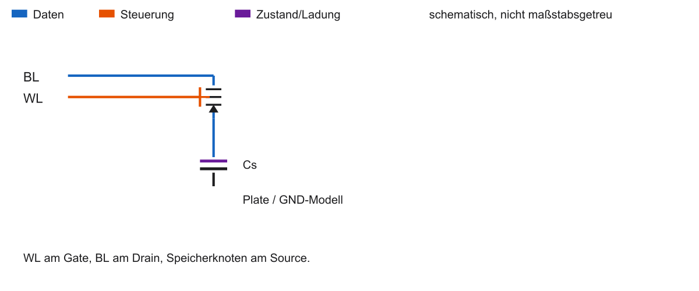

::: notes
WL liegt am Gate des Zugriffstransistors, BL ist die Zugriffsleitung, der Speicherknoten hängt am Kondensator. Die Plate-Elektrode ist im Bild auf GND gelegt. Das ist ein vereinfachtes Modell. Reale Plates können eine andere Spannung haben. VDD ist die positive Versorgung, C die Kapazität. Bei WL gleich 0 ist die Zelle isoliert, bei WL gleich 1 an BL gekoppelt. Ladung und Kapazität bestimmen das kleine Signal. Halten Sie drei Ebenen auseinander: die Zelle oder das Bauelement, die Schnittstelle aus Adresse, Takt und Kommando, und die Softwareabbildung in C oder im Linker. Eine Zahl gilt nur mit ihrer Einheit und der genannten Annahme. Sie ist keine Messung und kein Laufzeitergebnis. Steht Code auf der Folie, ist er Lehrcode. Eine RISC-V-Toolchain, Renode und TFLM waren nicht verfügbar, deshalb wurde er nicht übersetzt und nicht ausgeführt. Prüfen Sie danach die offene Frage des Übergangs, bevor Sie die nächste Folie nur als Wiederholung lesen.
:::

## Kondensator als Speicher

- Geladen (hohe Spannung) $\rightarrow$ logische 1
- Entladen ($\approx 0\,\mathrm{V}$) $\rightarrow$ logische 0
- Kapazitäten im Femtofarad-Bereich — einige zehntausend bis hunderttausend Elektronen
- 3D-Fertigung: Trench-/Stack-Kondensatoren für Dichte

::: notes
Q gleich C mal Delta V. Q ist hier die Ladung in Coulomb, nicht der SRAM-Knoten. C ist die Kapazität in Farad, Delta V die Spannung gegen die Plate in Volt. Mit C gleich 20 Femtofarad und Delta V gleich 0,5 Volt ist Q gleich 10 Femtocoulomb. Geteilt durch die Elementarladung 1,602176634 mal 10 hoch minus 19 Coulomb sind das etwa 62415 Elektronen. Femto ist 10 hoch minus 15. Die Werte sind illustrativ. Trench- und Stack-Kondensatoren nutzen die dritte Dimension. Leckströme gefährden diese Ladung. Halten Sie drei Ebenen auseinander: die Zelle oder das Bauelement, die Schnittstelle aus Adresse, Takt und Kommando, und die Softwareabbildung in C oder im Linker. Eine Zahl gilt nur mit ihrer Einheit und der genannten Annahme. Sie ist keine Messung und kein Laufzeitergebnis. Steht Code auf der Folie, ist er Lehrcode. Eine RISC-V-Toolchain, Renode und TFLM waren nicht verfügbar, deshalb wurde er nicht übersetzt und nicht ausgeführt. Prüfen Sie danach die offene Frage des Übergangs, bevor Sie die nächste Folie nur als Wiederholung lesen.
:::

## Was bedeutet „dynamisch“?

- Die Spannung einer gespeicherten 1 sinkt durch Leckstrom
- Das Refresh-Fenster ist geräte- und temperaturabhängig; 64 ms ist nur ein bekanntes Beispiel, keine Lebensdauer jedes Bits

::: notes
Ein real isolierter Kondensator hält die Spannung nicht unbegrenzt. Temperatur, Streuung und das Datenblatt bestimmen den Refresh. 64 ms sind ein bekanntes Fenster unter geeigneten Bedingungen, keine gemessene Entladezeit jedes Bits. Die Zuordnung von 0 und 1 folgt dem gewählten Spannungsmodell. DRAM und Refresh werden so verstanden: der analoge Zustand muss rechtzeitig rekonstruiert werden. Der Zyklus organisiert diese Pflege. Halten Sie drei Ebenen auseinander: die Zelle oder das Bauelement, die Schnittstelle aus Adresse, Takt und Kommando, und die Softwareabbildung in C oder im Linker. Eine Zahl gilt nur mit ihrer Einheit und der genannten Annahme. Sie ist keine Messung und kein Laufzeitergebnis. Steht Code auf der Folie, ist er Lehrcode. Eine RISC-V-Toolchain, Renode und TFLM waren nicht verfügbar, deshalb wurde er nicht übersetzt und nicht ausgeführt. Prüfen Sie danach die offene Frage des Übergangs, bevor Sie die nächste Folie nur als Wiederholung lesen.
:::

## Der Refresh-Zyklus

- Refresh läuft über Zeilen und Bänke, nicht als ein Schlag für den gesamten Speicher
- Ob und wie lange Zugriffe dabei warten, ist geräteabhängig

::: notes
Refresh erfasst eine Zeile intern und stellt die Pegel wieder her. Das ist kein CPU-Load jedes Bytes. Das Refresh-Fenster, der Abstand der Kommandos und die Dauer eines Vorgangs sind verschieden. Nicht der ganze Speicher steht während des gesamten Fensters still. Self-Refresh bedeutet, dass der Baustein die Pflege in einem spezifizierten Sparzustand selbst anstößt. Die Spannungskurve zeigt den rechtzeitigen Eingriff. Halten Sie drei Ebenen auseinander: die Zelle oder das Bauelement, die Schnittstelle aus Adresse, Takt und Kommando, und die Softwareabbildung in C oder im Linker. Eine Zahl gilt nur mit ihrer Einheit und der genannten Annahme. Sie ist keine Messung und kein Laufzeitergebnis. Steht Code auf der Folie, ist er Lehrcode. Eine RISC-V-Toolchain, Renode und TFLM waren nicht verfügbar, deshalb wurde er nicht übersetzt und nicht ausgeführt. Prüfen Sie danach die offene Frage des Übergangs, bevor Sie die nächste Folie nur als Wiederholung lesen.
:::

## Refresh — Schema

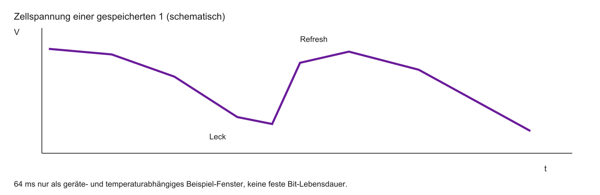

::: notes
Die x-Achse ist die Zeit, die y-Achse die Zellspannung. Die Kurve ist qualitativ, kein Messdatensatz und kein universelles RC-Gesetz. Eine Entscheidungszone markiert, wo die Information noch sicher erkannt werden kann. Der Refresh muss davor erfolgen. Es werden keine willkürlichen Nanosekunden als Messung beschriftet. Das interne Lesen verändert den Zustand und muss ihn wiederherstellen. Halten Sie drei Ebenen auseinander: die Zelle oder das Bauelement, die Schnittstelle aus Adresse, Takt und Kommando, und die Softwareabbildung in C oder im Linker. Eine Zahl gilt nur mit ihrer Einheit und der genannten Annahme. Sie ist keine Messung und kein Laufzeitergebnis. Steht Code auf der Folie, ist er Lehrcode. Eine RISC-V-Toolchain, Renode und TFLM waren nicht verfügbar, deshalb wurde er nicht übersetzt und nicht ausgeführt. Prüfen Sie danach die offene Frage des Übergangs, bevor Sie die nächste Folie nur als Wiederholung lesen.
:::

## DRAM-Lesen ist destruktiv

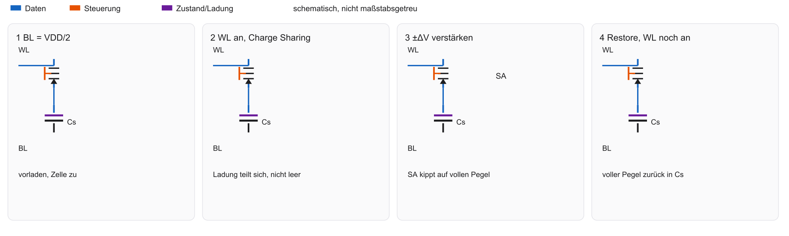

- Charge Sharing verschiebt BL und Zelle auf einen gemeinsamen Zwischenpegel
- Der Sense Amplifier treibt danach den vollen Pegel zurück in die Zelle

::: notes
Vier Schritte: BL auf VDD durch 2 vorladen, WL aktivieren und Ladung teilen, die kleine Abweichung verstärken, den Zellpegel bei noch aktiver WL restaurieren. Destruktiv heißt veränderte Ladungsverteilung, nicht ein immer leerer Kondensator. Mit Plate 0, VDD 1,2 Volt, C_cell 30 fF, C_BL 300 fF und Vorladung 0,6 Volt wird eine gespeicherte 1 etwa 0,6545 Volt und eine 0 etwa 0,5455 Volt. Die Abweichung ist rund plus oder minus 54,5 Millivolt. SA ist der Sense Amplifier. Er übernimmt Erkennung und Wiederherstellung. Halten Sie drei Ebenen auseinander: die Zelle oder das Bauelement, die Schnittstelle aus Adresse, Takt und Kommando, und die Softwareabbildung in C oder im Linker. Eine Zahl gilt nur mit ihrer Einheit und der genannten Annahme. Sie ist keine Messung und kein Laufzeitergebnis. Steht Code auf der Folie, ist er Lehrcode. Eine RISC-V-Toolchain, Renode und TFLM waren nicht verfügbar, deshalb wurde er nicht übersetzt und nicht ausgeführt. Prüfen Sie danach die offene Frage des Übergangs, bevor Sie die nächste Folie nur als Wiederholung lesen.
:::

## Sense Amplifiers

- Panels 3 und 4 der Lese-Abbildung: kleine Abweichung $\pm\Delta V$ wird zum vollen Pegel
- Derselbe volle Pegel schreibt die Zelle zurück (Restore)
- Refresh einer Zeile nutzt denselben Mechanismus

::: notes
Der Sense Amplifier, kurz SA, macht aus der kleinen Differenz volle digitale Pegel. Dieselbe Struktur stellt die Zelle wieder her, solange WL aktiv ist. Ein Row Buffer ist die aktivierte Zeile in diesen Verstärkern, nicht automatisch eine zweite SRAM-Kopie. Zuerst wird die Zeile aktiviert, danach eine Spalte ausgewählt. Schreiben legt den gewünschten Zustand dagegen gezielt auf die Bitleitung. Halten Sie drei Ebenen auseinander: die Zelle oder das Bauelement, die Schnittstelle aus Adresse, Takt und Kommando, und die Softwareabbildung in C oder im Linker. Eine Zahl gilt nur mit ihrer Einheit und der genannten Annahme. Sie ist keine Messung und kein Laufzeitergebnis. Steht Code auf der Folie, ist er Lehrcode. Eine RISC-V-Toolchain, Renode und TFLM waren nicht verfügbar, deshalb wurde er nicht übersetzt und nicht ausgeführt. Prüfen Sie danach die offene Frage des Übergangs, bevor Sie die nächste Folie nur als Wiederholung lesen.
:::

## DRAM Schreiben

- Bitline hart auf High oder Low treiben
- Wordline öffnet den Access-Transistor
- Kondensator füllt/entleert sich schnell
- Wordline zu — Bit gefangen (bis zum nächsten Refresh)

::: notes
Der Auftrag kommt vom Controller zur gewählten Spalte einer aktivierten Zeile. In der Zelle treibt die Bitleitung den Kondensator, WL erlaubt den Zugriff, danach wird WL geschlossen. Moderne Kommandos und Timingbedingungen bleiben darüber bestehen. 0 und 1 beziehen sich auf die festgelegte Spannung. Der Schreibzustand ist das Gegenstück zur Leseabbildung. Millionen Zellen brauchen Bank, Zeile und Spalte. Halten Sie drei Ebenen auseinander: die Zelle oder das Bauelement, die Schnittstelle aus Adresse, Takt und Kommando, und die Softwareabbildung in C oder im Linker. Eine Zahl gilt nur mit ihrer Einheit und der genannten Annahme. Sie ist keine Messung und kein Laufzeitergebnis. Steht Code auf der Folie, ist er Lehrcode. Eine RISC-V-Toolchain, Renode und TFLM waren nicht verfügbar, deshalb wurde er nicht übersetzt und nicht ausgeführt. Prüfen Sie danach die offene Frage des Übergangs, bevor Sie die nächste Folie nur als Wiederholung lesen.
:::

## Adress-Matrix und Multiplexing

- Zellen in Zeilen und Spalten, oft mehrere Bänke
- Die Adresse zerfällt in Bank, Row, Column und Byte-Offset — die Breiten sind nicht zwei gleiche Hälften

::: notes
Bank, Row, Column und Byte-Offset sind die Auswahlfelder dieses Lehrbeispiels. Die CPU-Adresse wird vom Controller abgebildet, nicht automatisch in zwei Hälften zu 16 Bit. Vier Bänke, 128 Zeilen, 64 Spalten und 2 Byte ergeben 65536 Byte, also 64 KiB. Die Felder brauchen 2 plus 7 plus 6 plus 1 gleich 16 Bit. Bank 2, Zeile 5, Spalte 9 und Byte 1 ergeben die Adresse 33427 oder 0x8293. Echte DRAMs können verschachteln oder hashen. Die Matrix zeigt Zeile und Spalte. Halten Sie drei Ebenen auseinander: die Zelle oder das Bauelement, die Schnittstelle aus Adresse, Takt und Kommando, und die Softwareabbildung in C oder im Linker. Eine Zahl gilt nur mit ihrer Einheit und der genannten Annahme. Sie ist keine Messung und kein Laufzeitergebnis. Steht Code auf der Folie, ist er Lehrcode. Eine RISC-V-Toolchain, Renode und TFLM waren nicht verfügbar, deshalb wurde er nicht übersetzt und nicht ausgeführt. Prüfen Sie danach die offene Frage des Übergangs, bevor Sie die nächste Folie nur als Wiederholung lesen.
:::

## Multiplexing — Schema

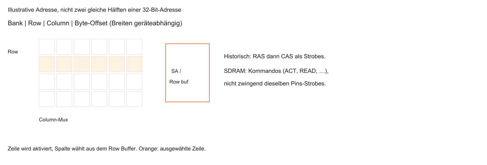

::: notes
Das Bild führt vom Bank- und Zeilenfeld zum Decoder, zur aktiven Zeile und zu den Sense Amplifiers. Die Spaltenauswahl liefert danach die Daten. Alle Pfeile behalten die Bedeutung der vorigen Folie. Die Zeile wird physisch gemeinsam aktiviert, die Spalte danach ausgegeben. Die Größen sind dieselben 64 KiB des Beispiels. Historische RAS- und CAS-Signale beschreiben die ältere Steuerung. Halten Sie drei Ebenen auseinander: die Zelle oder das Bauelement, die Schnittstelle aus Adresse, Takt und Kommando, und die Softwareabbildung in C oder im Linker. Eine Zahl gilt nur mit ihrer Einheit und der genannten Annahme. Sie ist keine Messung und kein Laufzeitergebnis. Steht Code auf der Folie, ist er Lehrcode. Eine RISC-V-Toolchain, Renode und TFLM waren nicht verfügbar, deshalb wurde er nicht übersetzt und nicht ausgeführt. Prüfen Sie danach die offene Frage des Übergangs, bevor Sie die nächste Folie nur als Wiederholung lesen.
:::

## RAS und CAS

- Historisch: RAS und CAS als Strobes für Zeile und Spalte
- Moderne SDRAM-Schnittstellen nutzen Kommandos (Activate, Read, Precharge), nicht zwingend dieselben Strobes
- Die Abbildung der vorigen Folie trennt Matrix und diese Schnittstellen-Ebene

::: notes
RAS bedeutet Row Address Strobe, CAS Column Address Strobe. Das sind historische Strobe-Signale asynchroner DRAMs. SDRAM benutzt Kommandos wie ACTIVATE, READ, WRITE und PRECHARGE. CAS Latency, kurz CL, ist die spezifizierte Verzögerung vom READ bis zum ersten Datenwort unter passenden Bedingungen, nicht die ganze Latenz eines CPU-Loads. BIOS, Basic Input/Output System, wird hier nicht gebraucht. Row-Hit und Row-Konflikt unterscheiden die Wartezeit. Halten Sie drei Ebenen auseinander: die Zelle oder das Bauelement, die Schnittstelle aus Adresse, Takt und Kommando, und die Softwareabbildung in C oder im Linker. Eine Zahl gilt nur mit ihrer Einheit und der genannten Annahme. Sie ist keine Messung und kein Laufzeitergebnis. Steht Code auf der Folie, ist er Lehrcode. Eine RISC-V-Toolchain, Renode und TFLM waren nicht verfügbar, deshalb wurde er nicht übersetzt und nicht ausgeführt. Prüfen Sie danach die offene Frage des Übergangs, bevor Sie die nächste Folie nur als Wiederholung lesen.
:::

## Warum DRAM langsamer ist als SRAM

- Adress-Multiplexing (Row, dann Column)
- Analoges Auslesen und Sense Amplifier
- Destruktives Lesen inkl. Zurückschreiben / Precharge
- Mögliche Wartezeiten während Refresh

::: notes
Nicht jede Anfrage durchläuft dieselbe volle Sequenz. Ein Row-Hit liest eine schon passende offene Zeile. Eine geschlossene Bank braucht ACTIVATE und dann READ. Ein Konflikt kann PRECHARGE, ACTIVATE und READ verlangen. Die Kürzel werden so lokal erklärt. Physik, Organisation, Controller und Refresh tragen zur Latenz bei. Auch SRAM hat Peripherie. Die Zellzeit ist nicht die CPU-Systemlatenz. DDR verbessert danach den Durchsatz der Datenphase. Halten Sie drei Ebenen auseinander: die Zelle oder das Bauelement, die Schnittstelle aus Adresse, Takt und Kommando, und die Softwareabbildung in C oder im Linker. Eine Zahl gilt nur mit ihrer Einheit und der genannten Annahme. Sie ist keine Messung und kein Laufzeitergebnis. Steht Code auf der Folie, ist er Lehrcode. Eine RISC-V-Toolchain, Renode und TFLM waren nicht verfügbar, deshalb wurde er nicht übersetzt und nicht ausgeführt. Prüfen Sie danach die offene Frage des Übergangs, bevor Sie die nächste Folie nur als Wiederholung lesen.
:::

## SDRAM und DDR

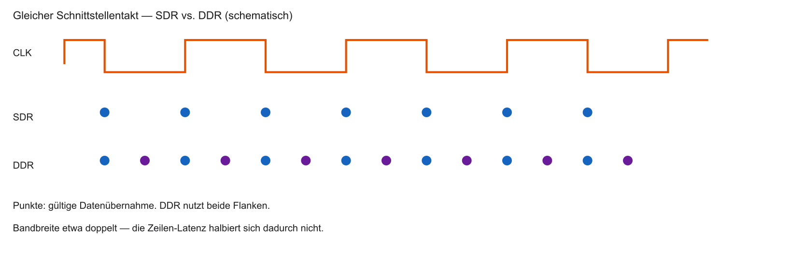

- LPDDR ist eine energiesparende Familie derselben Zellidee

::: notes
SDRAM ist Synchronous DRAM, SDR Single Data Rate, DDR Double Data Rate, LPDDR Low-Power DDR. Beim gleichen Bustakt und gleicher Breite überträgt DDR an beiden Flanken. 200 MHz mal 64 Bit durch 8 mal 1 ergibt 1,6 GB/s für SDR und mal 2 ergibt 3,2 GB/s für DDR. DDR sind hier 400 MT/s, Megatransfers je Sekunde, nicht 400 MHz Bustakt. Kommandos, Refresh und Turnaround fehlen. Die Load-Latenz wird nicht halbiert. DRAM wird dort eingesetzt, wo die Kapazität zählt. Halten Sie drei Ebenen auseinander: die Zelle oder das Bauelement, die Schnittstelle aus Adresse, Takt und Kommando, und die Softwareabbildung in C oder im Linker. Eine Zahl gilt nur mit ihrer Einheit und der genannten Annahme. Sie ist keine Messung und kein Laufzeitergebnis. Steht Code auf der Folie, ist er Lehrcode. Eine RISC-V-Toolchain, Renode und TFLM waren nicht verfügbar, deshalb wurde er nicht übersetzt und nicht ausgeführt. Prüfen Sie danach die offene Frage des Übergangs, bevor Sie die nächste Folie nur als Wiederholung lesen.
:::

## Einsatzgebiet von DRAM im SoC

- Meist nicht auf dem Logic-Die (anderer Prozess)
- Separater Chip oder Package-on-Package
- Main Memory: OS, Heap (`malloc`), große Arrays
- Kleine MCUs: oft nur interner SRAM, kein DRAM

::: notes
DRAM sitzt oft in einem eigenen Gehäuse am Controller, auch als Package-on-Package. SoC heißt nicht, dass der DRAM auf demselben Die liegt. OS bedeutet Operating System. Ein Heap ist ein dynamischer Speicherbereich, malloc die C-Funktion, die ihn bei passender Laufzeit anfordert. Heap-Daten müssen nicht DRAM sein. Kleine MCUs nutzen häufig nur SRAM. Die Vergleichstabelle fasst die Zellkompromisse. Halten Sie drei Ebenen auseinander: die Zelle oder das Bauelement, die Schnittstelle aus Adresse, Takt und Kommando, und die Softwareabbildung in C oder im Linker. Eine Zahl gilt nur mit ihrer Einheit und der genannten Annahme. Sie ist keine Messung und kein Laufzeitergebnis. Steht Code auf der Folie, ist er Lehrcode. Eine RISC-V-Toolchain, Renode und TFLM waren nicht verfügbar, deshalb wurde er nicht übersetzt und nicht ausgeführt. Prüfen Sie danach die offene Frage des Übergangs, bevor Sie die nächste Folie nur als Wiederholung lesen.
:::

## Vergleich: SRAM vs. DRAM

|  | SRAM | DRAM |
|--|------|------|
| Zelle | 6T Inverter-Ring | 1T1C |
| Datenerhalt | stabil (mit Strom) | Refresh nötig |
| Geschwindigkeit | kurz auf SRAM-Makro-Ebene | länger für einen vollen DRAM-Zugriff |
| Dichte | gering | sehr hoch |
| Einsatz | Caches; Register je nach Implementierung | Hauptspeicher |
| Kosten / Bit | hoch | niedrig |

::: notes
Beide sind flüchtig. SRAM nutzt im klassischen Modell sechs Transistoren und keinen Refresh, DRAM einen Transistor, einen Kondensator und Refresh. Dichte und Kosten je Bit werden nur auf vergleichbaren Ebenen gegenübergestellt. Schnell und langsam ohne Bezug sind ungenau. Ein Registerfile ist nur dann SRAM, wenn die Implementierung das so baut. Die Tabelle darf Beschriftungen nicht überlagern. Der Spickzettel wird zur Auswahlhilfe. Halten Sie drei Ebenen auseinander: die Zelle oder das Bauelement, die Schnittstelle aus Adresse, Takt und Kommando, und die Softwareabbildung in C oder im Linker. Eine Zahl gilt nur mit ihrer Einheit und der genannten Annahme. Sie ist keine Messung und kein Laufzeitergebnis. Steht Code auf der Folie, ist er Lehrcode. Eine RISC-V-Toolchain, Renode und TFLM waren nicht verfügbar, deshalb wurde er nicht übersetzt und nicht ausgeführt. Prüfen Sie danach die offene Frage des Übergangs, bevor Sie die nächste Folie nur als Wiederholung lesen.
:::

## Spickzettel SRAM / DRAM

| Eigenschaft | SRAM | DRAM |
|-------------|------|------|
| Zellen-Architektur | 6 Transistoren | 1T + 1C |
| Datenerhalt | stabil (Strom an) | flüchtig (Refresh) |
| Geschwindigkeit | Zell-/Makro-Ebene, nicht Cache-Hit | voller Zugriff inkl. Zeile/Spalte |
| Speicherdichte | gering | extrem hoch |
| Einsatz im SoC | häufig Caches | Main Memory, oft off-chip |
| Kosten pro Bit | hoch | niedrig |

*Angaben schematisch — typische Größenordnungen.*

::: notes
Drei Situationen. Ein kleiner schneller Cache spricht für SRAM. Ein großer Hauptspeicher in einem PC-ähnlichen System spricht für DRAM. Eine kleine MCU mit Puffer kann bei SRAM bleiben. Die Antwort hängt von der vorhandenen Hardware ab. Flüchtig und Refresh werden kurz wiederholt. Die Fragen prüfen Physik und die Grenzen der Vereinfachung. Halten Sie drei Ebenen auseinander: die Zelle oder das Bauelement, die Schnittstelle aus Adresse, Takt und Kommando, und die Softwareabbildung in C oder im Linker. Eine Zahl gilt nur mit ihrer Einheit und der genannten Annahme. Sie ist keine Messung und kein Laufzeitergebnis. Steht Code auf der Folie, ist er Lehrcode. Eine RISC-V-Toolchain, Renode und TFLM waren nicht verfügbar, deshalb wurde er nicht übersetzt und nicht ausgeführt. Prüfen Sie danach die offene Frage des Übergangs, bevor Sie die nächste Folie nur als Wiederholung lesen.
:::

## Fragen? — DRAM

- Kondensator-Prinzip?
- Destruktives Lesen?
- Refresh-Zyklus klar?

::: notes
Warum Refresh? Weil Leckströme den analogen Zustand ändern. Was passiert beim Charge Sharing? Die Zellladung teilt sich mit der Bitleitung, der Pegel rückt nur wenig von VDD durch 2 weg, danach wird restauriert. Warum halbiert DDR nicht die Load-Latenz? Weil zwei Transfers je Takt den Durchsatz der Datenphase erhöhen, nicht jede vorherige Phase kürzen. DRAM, DDR, WL und BL bleiben die bekannten Kürzel. Zellzustand, Row Buffer und CPU-Anfrage sind drei Ebenen. Danach folgen besondere Puffer. Halten Sie drei Ebenen auseinander: die Zelle oder das Bauelement, die Schnittstelle aus Adresse, Takt und Kommando, und die Softwareabbildung in C oder im Linker. Eine Zahl gilt nur mit ihrer Einheit und der genannten Annahme. Sie ist keine Messung und kein Laufzeitergebnis. Steht Code auf der Folie, ist er Lehrcode. Eine RISC-V-Toolchain, Renode und TFLM waren nicht verfügbar, deshalb wurde er nicht übersetzt und nicht ausgeführt. Prüfen Sie danach die offene Frage des Übergangs, bevor Sie die nächste Folie nur als Wiederholung lesen.
:::

## Spezialspeicher im SoC

- Neben Cache und Main Memory: spezialisierte RAM-Zellen
- Problem: CPU und Peripherie mit unterschiedlichen Takten
- Wie Daten austauschen ohne gegenseitiges Blockieren?
- Lösungen: Dual-Ported RAM (DPRAM) und FIFOs

::: notes
DPRAM und FIFO sind Zugriffsorganisationen, keine dritte Zellphysik. DPRAM bedeutet Dual-Port RAM, FIFO First-In First-Out. CPU und Peripherie können zwei Nutzer und zwei Takte sein. Single-Port-RAM mit Arbitration kann denselben Speicher teilen, aber nicht jeden gleichzeitigen Zugriff. Zwei Ports lösen kein Clock-Domain-Crossing. CDC bedeutet die Synchronisation zwischen Taktdomänen. Zuerst werden die zwei Schnittstellen des DPRAM erklärt. Halten Sie drei Ebenen auseinander: die Zelle oder das Bauelement, die Schnittstelle aus Adresse, Takt und Kommando, und die Softwareabbildung in C oder im Linker. Eine Zahl gilt nur mit ihrer Einheit und der genannten Annahme. Sie ist keine Messung und kein Laufzeitergebnis. Steht Code auf der Folie, ist er Lehrcode. Eine RISC-V-Toolchain, Renode und TFLM waren nicht verfügbar, deshalb wurde er nicht übersetzt und nicht ausgeführt. Prüfen Sie danach die offene Frage des Übergangs, bevor Sie die nächste Folie nur als Wiederholung lesen.
:::

## Dual-Ported RAM (DPRAM)

- Zwei Ports mit eigener Adresse, eigenen Daten und eigener Steuerung
- Gleichzeitig an verschiedenen Adressen möglich
- Die Transistorzahl hängt von der konkreten Zelltopologie ab; „8T“ ist keine allgemeine Definition

::: notes
Jeder Port hat Adresse, Daten, Lese- oder Schreibsteuerung und gegebenenfalls einen Takt. Echtes Dual-Port erlaubt zwei passende Zugriffe, Simple-Dual-Port oft nur eine Schreib- und eine Leserichtung. Zwei Ports kosten zusätzliche Leitungen. Eine universelle 8T-Zelle wird nicht behauptet. Verschiedene Adressen können parallel bedient werden. Dieselbe Adresse braucht die spezifizierte Regel. Die Zeichnung zeigt beide Ports an demselben Inhalt. Halten Sie drei Ebenen auseinander: die Zelle oder das Bauelement, die Schnittstelle aus Adresse, Takt und Kommando, und die Softwareabbildung in C oder im Linker. Eine Zahl gilt nur mit ihrer Einheit und der genannten Annahme. Sie ist keine Messung und kein Laufzeitergebnis. Steht Code auf der Folie, ist er Lehrcode. Eine RISC-V-Toolchain, Renode und TFLM waren nicht verfügbar, deshalb wurde er nicht übersetzt und nicht ausgeführt. Prüfen Sie danach die offene Frage des Übergangs, bevor Sie die nächste Folie nur als Wiederholung lesen.
:::

## DPRAM — Schema

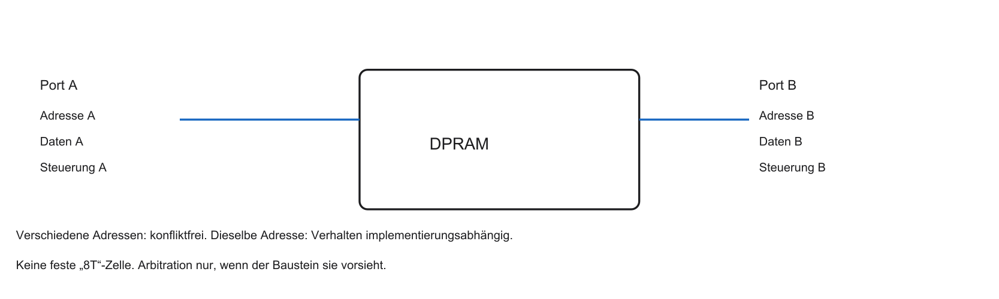

::: notes
Port A und Port B haben eigene Adress-, Daten- und Steuerpfade und denselben Speicherinhalt. Wenn das Modell synchron ist, gibt es einen gemeinsamen Takt. Wenn es unabhängig getaktet ist, hat jeder Port seinen Takt. Ein zulässiges Beispiel benutzt verschiedene Adressen. Die Kollision derselben Adresse folgt danach. Die Leitungen sind der Datenfluss, nicht nur eine Beschriftungsübung. Halten Sie drei Ebenen auseinander: die Zelle oder das Bauelement, die Schnittstelle aus Adresse, Takt und Kommando, und die Softwareabbildung in C oder im Linker. Eine Zahl gilt nur mit ihrer Einheit und der genannten Annahme. Sie ist keine Messung und kein Laufzeitergebnis. Steht Code auf der Folie, ist er Lehrcode. Eine RISC-V-Toolchain, Renode und TFLM waren nicht verfügbar, deshalb wurde er nicht übersetzt und nicht ausgeführt. Prüfen Sie danach die offene Frage des Übergangs, bevor Sie die nächste Folie nur als Wiederholung lesen.
:::

## Kollisionsvermeidung im DPRAM

- Verschiedene Adressen: beide Ports arbeiten
- Dieselbe Adresse: Ergebnis und Arbitration sind implementierungsabhängig
- Ein Busy-Flag oder Stall ist eine mögliche, keine universelle Lösung

::: notes
Read gegen Read kann spezifiziert harmlos sein. Read gegen Write und Write gegen Write auf derselben Adresse sind konflikthaft. Gleiche und verschiedene Taktdomänen unterscheiden sich. Ohne konkreten Baustein bleibt das Ergebnis alt, neu oder ungültig eine Datenblattfrage. Ein Busy- oder Stall-Signal ist eine mögliche Schutzstrategie, keine automatische Eigenschaft. Arbitration vergibt den Zugriff. Eine FIFO vermeidet beliebige Nutzeradressen. Halten Sie drei Ebenen auseinander: die Zelle oder das Bauelement, die Schnittstelle aus Adresse, Takt und Kommando, und die Softwareabbildung in C oder im Linker. Eine Zahl gilt nur mit ihrer Einheit und der genannten Annahme. Sie ist keine Messung und kein Laufzeitergebnis. Steht Code auf der Folie, ist er Lehrcode. Eine RISC-V-Toolchain, Renode und TFLM waren nicht verfügbar, deshalb wurde er nicht übersetzt und nicht ausgeführt. Prüfen Sie danach die offene Frage des Übergangs, bevor Sie die nächste Folie nur als Wiederholung lesen.
:::

## FIFO-Puffer

- First-In-First-Out: Warteschlange
- Keine expliziten Adressen für Push/Pop
- Hardware: SRAM mit Write-/Read-Pointer (Ringpuffer)

::: notes
FIFO bedeutet First-In First-Out. Push oder Enqueue legt hinten ab, Pop oder Dequeue nimmt vorn weg. Die Hardware kann aus Registern oder RAM bestehen. Der Write-Pointer zeigt im Lehrbeispiel auf den nächsten freien Platz, der Read-Pointer auf den nächsten lesbaren Eintrag. Empty ist count gleich 0, Full ist count gleich 8 bei acht Plätzen. Überlauf und Unterlauf müssen behandelt werden. Das Modell hat einen gemeinsamen Takt. Eine asynchrone FIFO braucht ein anderes Statuskonzept. Die Schrittfolge zeigt Wraparound. Halten Sie drei Ebenen auseinander: die Zelle oder das Bauelement, die Schnittstelle aus Adresse, Takt und Kommando, und die Softwareabbildung in C oder im Linker. Eine Zahl gilt nur mit ihrer Einheit und der genannten Annahme. Sie ist keine Messung und kein Laufzeitergebnis. Steht Code auf der Folie, ist er Lehrcode. Eine RISC-V-Toolchain, Renode und TFLM waren nicht verfügbar, deshalb wurde er nicht übersetzt und nicht ausgeführt. Prüfen Sie danach die offene Frage des Übergangs, bevor Sie die nächste Folie nur als Wiederholung lesen.
:::

## FIFO — Schema

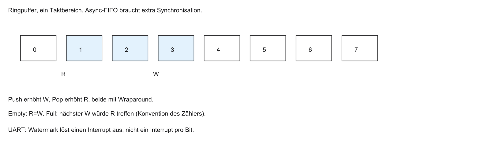

::: notes
Acht Plätze, der Ring springt von 7 nach 0. Drei Pushes füllen drei Einträge, ein Pop nimmt den ältesten weg. Gleiche Pointer können leer oder voll bedeuten. In diesem synchronen Modell entscheidet der Zähler. Eine asynchrone Skizze trennt Schreib- und Lesetakt und synchronisiert den Status. Gray-Code für Pointer ist ein verbreitetes Verfahren, kein gemeinsamer atomarer Zähler zwischen den Takten. Solche Puffer entlasten die CPU bei Peripheriedaten. Halten Sie drei Ebenen auseinander: die Zelle oder das Bauelement, die Schnittstelle aus Adresse, Takt und Kommando, und die Softwareabbildung in C oder im Linker. Eine Zahl gilt nur mit ihrer Einheit und der genannten Annahme. Sie ist keine Messung und kein Laufzeitergebnis. Steht Code auf der Folie, ist er Lehrcode. Eine RISC-V-Toolchain, Renode und TFLM waren nicht verfügbar, deshalb wurde er nicht übersetzt und nicht ausgeführt. Prüfen Sie danach die offene Frage des Übergangs, bevor Sie die nächste Folie nur als Wiederholung lesen.
:::

## Hardware-FIFOs für I/O

- Übliche UART: ohne FIFO ein Interrupt pro empfangenem Zeichen, nicht pro Bit
- Ein Watermark ist eine mögliche Schwelle, keine universelle UART-Regel. Weniger Bytes als die Schwelle brauchen Timeout, Idle oder Polling
- Stehen Sender und Empfänger in verschiedenen Takten, ist die FIFO asynchron und braucht Synchronisationslogik

::: notes
UART bedeutet Universal Asynchronous Receiver/Transmitter, I/O Input/Output. Eine Hardware-UART sammelt Bits zu Zeichen. Ein Interrupt je Bit ist nicht die übliche UART. Mit FIFO sind Schwellen, Timeout oder DMA möglich, je nach Baustein. Watermark ist eine programmierbare Füllstandsschwelle. Drei Bytes bei Schwelle vier brauchen eine Restdatenstrategie, sonst bleiben sie liegen. Unterschiedliche Takte brauchen CDC. Die Baudrate allein beweist den FIFO-Aufbau nicht. Software sieht das über Adressen. Halten Sie drei Ebenen auseinander: die Zelle oder das Bauelement, die Schnittstelle aus Adresse, Takt und Kommando, und die Softwareabbildung in C oder im Linker. Eine Zahl gilt nur mit ihrer Einheit und der genannten Annahme. Sie ist keine Messung und kein Laufzeitergebnis. Steht Code auf der Folie, ist er Lehrcode. Eine RISC-V-Toolchain, Renode und TFLM waren nicht verfügbar, deshalb wurde er nicht übersetzt und nicht ausgeführt. Prüfen Sie danach die offene Frage des Übergangs, bevor Sie die nächste Folie nur als Wiederholung lesen.
:::

## Brückenschlag zur Software

- CPU sieht keinen Kondensator — nur linearen 32-Bit-Adressraum
- Adress-Decoder lenkt Bereiche an physische Bausteine
- Beispiel: Pointer auf Flash vs. Pointer auf SRAM/DRAM

::: notes
Die CPU sieht einen Zeiger und eine Zahl. Im gewählten RV32-Lehrbild ist der Adressraum 32 Bit. Das ist kein Gesetz jeder CPU. Der Decoder wählt anhand der Bits Flash, SRAM oder ein Gerät. Er kennt keine Kondensatoren. Normale Speicherbereiche und MMIO unterscheiden sich, weil MMIO Seiteneffekte haben kann. Der Pointertyp garantiert nicht das Medium. Die Memory Map verbindet die C-Objekte mit den Bereichen. Halten Sie drei Ebenen auseinander: die Zelle oder das Bauelement, die Schnittstelle aus Adresse, Takt und Kommando, und die Softwareabbildung in C oder im Linker. Eine Zahl gilt nur mit ihrer Einheit und der genannten Annahme. Sie ist keine Messung und kein Laufzeitergebnis. Steht Code auf der Folie, ist er Lehrcode. Eine RISC-V-Toolchain, Renode und TFLM waren nicht verfügbar, deshalb wurde er nicht übersetzt und nicht ausgeführt. Prüfen Sie danach die offene Frage des Übergangs, bevor Sie die nächste Folie nur als Wiederholung lesen.
:::

## Memory Map eines Mikrocontrollers

Schematisches Beispiel, keine Plattformadressen aus dem Repo:

```c
static const uint32_t table[] = {1, 2};
uint32_t counter = 3;
uint32_t buffer[16];
```

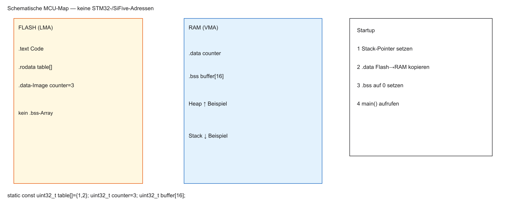

::: notes
Das Beispiel enthält static const uint32_t table[], uint32_t counter gleich 3 und buffer mit 16 Einträgen. Typisch liegt table in .rodata, counter in .data mit Initialbild im Flash und Laufzeitadresse im RAM, buffer in .bss. Unbenutzte Objekte können verschwinden. ELF ist das Dateiformat, eine Section ein Abschnitt, VMA die Laufzeitadresse und LMA die Adresse des Initialbilds. Nach Reset kopiert Startup .data und nullt .bss, dann kommt main. Stack nach unten und Heap nach oben sind eine Konvention. Das Linker-Skript legt die Zuordnung fest. Der C-Ausschnitt ist Lehrcode und nicht kompiliert. Halten Sie drei Ebenen auseinander: die Zelle oder das Bauelement, die Schnittstelle aus Adresse, Takt und Kommando, und die Softwareabbildung in C oder im Linker. Eine Zahl gilt nur mit ihrer Einheit und der genannten Annahme. Sie ist keine Messung und kein Laufzeitergebnis. Steht Code auf der Folie, ist er Lehrcode. Eine RISC-V-Toolchain, Renode und TFLM waren nicht verfügbar, deshalb wurde er nicht übersetzt und nicht ausgeführt. Prüfen Sie danach die offene Frage des Übergangs, bevor Sie die nächste Folie nur als Wiederholung lesen.
:::

## Das Linker-Skript

Ein `MEMORY`-Block allein legt Sections nicht ab. Typische Toolchain (schematisch, GNU ld: VMA = Laufzeit, LMA = Ladeadresse):

```ld
MEMORY {
  FLASH (rx) : ORIGIN = 0x00000000, LENGTH = 256K
  RAM (rwx)  : ORIGIN = 0x10000000, LENGTH = 64K
}
SECTIONS {
  .text : { *(.text*) } > FLASH
  .rodata : { *(.rodata*) } > FLASH
  .data : {
    _data_start = .;
    *(.data*)
    _data_end = .;
  } > RAM AT> FLASH
  _data_load = LOADADDR(.data);
  .bss : {
    _bss_start = .;
    *(.bss*)
    _bss_end = .;
  } > RAM
}
```

Startup kopiert von `_data_load` nach `_data_start` und setzt `.bss` auf 0. Das Skript selbst führt die Kopie nicht aus. Die Adressen sind Platzhalter. Lehrcode, nicht gelinkt.

::: notes
GNU ld ist der Linker. MEMORY nennt ORIGIN und LENGTH. SECTIONS legt .text, .rodata, .data und .bss ab. FLASH beginnt im Beispiel bei 0x00000000 mit 256 KiB, RAM bei 0x10000000 mit 64 KiB. Das sind Annahmen. _data_load gleich LOADADDR von .data ist die Flash-Quelle. _data_start und _data_end sind das RAM-Ziel. .bss hat RAM-Bedarf und im üblichen Bare-Metal-Modell kein Nullbild im Flash. Größer-RAM AT größer-FLASH beschreibt VMA und LMA und kopiert nichts. Der Ausschnitt ist didaktisch und Lehrcode. Reset, Stack und RISC-V-.sdata fehlen. Eine ELF- oder Map-Datei wurde nicht erzeugt, weil keine RISC-V-Toolchain verfügbar war. Ein späteres Labor könnte die Zuordnung prüfen. Halten Sie drei Ebenen auseinander: die Zelle oder das Bauelement, die Schnittstelle aus Adresse, Takt und Kommando, und die Softwareabbildung in C oder im Linker. Eine Zahl gilt nur mit ihrer Einheit und der genannten Annahme. Sie ist keine Messung und kein Laufzeitergebnis. Steht Code auf der Folie, ist er Lehrcode. Eine RISC-V-Toolchain, Renode und TFLM waren nicht verfügbar, deshalb wurde er nicht übersetzt und nicht ausgeführt. Prüfen Sie danach die offene Frage des Übergangs, bevor Sie die nächste Folie nur als Wiederholung lesen.
:::

## Ausblick Labor (Renode)

Geplantes Laborziel (Details folgen mit dem Übungsblatt):

- C-Projekt für einen RISC-V-SoC kompilieren
- Linker-Skript und Memory Map untersuchen
- Binary in Renode laden
- Speicherinhalte beobachten

::: notes
Ein späteres Labor könnte mit einer dann vorhandenen RISC-V-Toolchain und Renode übersetzen, die Map ansehen und Speicher beobachten. Das wurde nicht durchgeführt. Renode, ELF, .repl und die Linker-Map wurden oben benannt. LoadELF kann Segmente laden und ist nicht dasselbe wie ausgeführter Startup. Ein vom Modell genullter RAM beweist die .bss-Schleife nicht. Zelllatenz und Refresh werden am funktionalen Modell nicht gemessen. Die Abschlussfolie verbindet die Teilkonzepte. Halten Sie drei Ebenen auseinander: die Zelle oder das Bauelement, die Schnittstelle aus Adresse, Takt und Kommando, und die Softwareabbildung in C oder im Linker. Eine Zahl gilt nur mit ihrer Einheit und der genannten Annahme. Sie ist keine Messung und kein Laufzeitergebnis. Steht Code auf der Folie, ist er Lehrcode. Eine RISC-V-Toolchain, Renode und TFLM waren nicht verfügbar, deshalb wurde er nicht übersetzt und nicht ausgeführt. Prüfen Sie danach die offene Frage des Übergangs, bevor Sie die nächste Folie nur als Wiederholung lesen.
:::

## Zusammenfassung Block 1

- Speicherphysik: Kompromisse aus Kosten, Geschwindigkeit, Dichte
- Flash (non-volatil): Firmware; NOR oft mit XIP in MCUs
- SRAM (6T): schnell, teuer — typische Cache-Zellen. Ein Registerfile ist nicht pauschal dieselbe Zelle
- DRAM (1T1C): dicht, Refresh — Hauptspeicher
- Linker-Skript verteilt Software auf physische Zonen

::: notes
Unterschiedliche Zellen bedienen unterschiedliche Anforderungen. Flash hält Daten ohne Versorgung und macht Updates teuer. SRAM hält Spannungen durch zwei Inverter und bleibt flüchtig. DRAM hält Ladung und braucht Refresh. Software legt Objekte in Sections, der Linker beschreibt Adressen, Startup kopiert und nullt. Drei Selbstfragen: Ist SRAM nichtflüchtig? Nein. Macht DDR jede Latenz halb so lang? Nein. Führt der Linker die .data-Kopie aus? Nein. Vorlesung 2 fragt, wie ein Cache Lokalität nutzt. Er beseitigt nicht jede DRAM-Latenz. Die neuen C- und Assemblerausschnitte dieser Vorlesung sind Lehrcode. Toolchain, Renode und TFLM wurden nicht ausgeführt. Halten Sie drei Ebenen auseinander: die Zelle oder das Bauelement, die Schnittstelle aus Adresse, Takt und Kommando, und die Softwareabbildung in C oder im Linker. Eine Zahl gilt nur mit ihrer Einheit und der genannten Annahme. Sie ist keine Messung und kein Laufzeitergebnis. Steht Code auf der Folie, ist er Lehrcode. Eine RISC-V-Toolchain, Renode und TFLM waren nicht verfügbar, deshalb wurde er nicht übersetzt und nicht ausgeführt. Prüfen Sie danach die offene Frage des Übergangs, bevor Sie die nächste Folie nur als Wiederholung lesen.
:::

