## Willkommen zu Block 2!

- Willkommen zurück zur zweiten Vorlesung in Mikrocomputertechnik 3
- Rückblick: Block 1 hat Speicher auf Transistor-/Kondensatorebene untersucht (Flash, SRAM, DRAM)
- Heute: Bindeglied zwischen schneller CPU und langsamem RAM
- Fokus: das Konzept der Caches
- Ziel: verstehen, warum die Art Ihres C-Codes die Hardware massiv beeinflusst

```{mermaid}
%%| fig-width: 4.0
%%{init: {'theme': 'base', 'themeVariables': {'background': '#FFFFFF', 'primaryColor': '#FFFFFF', 'primaryBorderColor': '#E5E5EA', 'primaryTextColor': '#1D1D1F', 'lineColor': '#86868B', 'secondaryColor': '#F5F5F7', 'tertiaryColor': '#FFFFFF', 'mainBkg': '#FFFFFF', 'nodeBorder': '#E5E5EA', 'clusterBkg': '#F5F5F7', 'clusterBorder': '#E5E5EA', 'titleColor': '#1D1D1F', 'edgeLabelBackground': '#FFFFFF'}}}%%
flowchart LR
  A[Block 1: RAM-Physik] --> B[Block 2: Caches]
  B --> C[Schnellerer C-Code]
  style B fill:#FFFFFF,stroke:#E2001A,stroke-width:2px !important
```

::: notes
Herzlich willkommen zur zweiten Einheit! In Block 1 haben wir Speicher auf Transistor- und Kondensatorebene betrachtet (Flash, SRAM, DRAM). Heute verlassen wir die reine Physik und gehen zur Architektur: Caches verbergen die DRAM-Latenz. Dabei sehen Sie auch, warum die Struktur Ihres C-Codes die Hit Rate — und damit die Laufzeit — stark beeinflussen kann.
:::

## Anknüpfung: Memory Map und Linker

Kurz-Recap aus Block 1 (Labor folgt mit dem Übungsblatt):

- Memory Map: Flash, SRAM und MMIO belegen feste Adressbereiche
- Linker-Skript legt `.text` in den Flash, Variablen in den SRAM
- C-Pointer adressieren physische Bausteine über denselben Adressraum

```c
// Prinzip aus Block 1:
int global_var = 42;   // typisch: SRAM (.data)
const int config = 1;  // typisch: Flash (.rodata)
```

::: notes
In Block 1 haben wir Memory Map und Linker-Skript konzeptionell eingeführt; das zugehörige Renode-Labor steht als Übungsblatt noch aus. Für heute reicht der Anschluss: Die CPU greift über Adressen auf SRAM/DRAM zu — und genau dort setzen Caches an.
:::

## Kurz-Recap: SRAM vs. DRAM

Aus Block 1 (Spickzettel) — die Motivation für Caches:

- SRAM: schnell und flächenintensiv, häufig für Caches. Registerfiles können auch aus Flip-Flops oder Latches bestehen, nicht nur aus 6T-Zellen
- DRAM (1T1C): dicht und günstig, aber hohe Latenz (Refresh, Multiplexing)
- Wunsch „alles SRAM“ ist wirtschaftlich und flächenmäßig unrealistisch

|  | SRAM | DRAM |
|--|------|------|
| Geschwindigkeit | sehr hoch | niedriger |
| Kosten / Bit | hoch | niedrig |
| Typische Rolle | Cache | Hauptspeicher |

*Schematisch — Trendillustration aus Block 1.*

::: notes
Kurz wiederholt aus Block 1: SRAM ist schnell, aber teuer; DRAM fasst Gigabytes, ist aber langsam. Genau dieses Spannungsfeld erzwingt die Speicherhierarchie und den Cache als Zwischenschicht.
:::

## Die CPU hungert — das Latenz-Problem

- Moderne CPU: ca. 3–5 GHz
- DRAM-Latenz: ca. 50–100 ns
- Daraus folgen grob 150–500 Takte, nicht 100–300
- Das einfache blockierende Modell unten nutzt getrennt 100 Takte Wartezeit

| Schritt | Dauer (einfaches blockierendes Modell) |
|---------|----------------------------------------|
| ALU Add | 1 Takt |
| Warten auf DRAM | 100 Takte in diesem Modell |
| ALU Sub | 1 Takt |

::: notes
3 GHz und 100 ns ergeben 300 Takte. Die Spanne 3–5 GHz mal 50–100 ns ist etwa 150–500 Takte. Ein Stall friert nicht jede moderne CPU vollständig ein; das Modell hier ist die einfache Pipeline aus MCT1.
:::

## Die Illusion erschaffen

- Ziel: Nutzer und CPU „betrügen“
- Illusion: Speicher so schnell wie SRAM und so billig/groß wie DRAM
- Trick: kleine, versteckte SRAM-Schicht zwischen CPU und DRAM
- Name: Cache (französisch: geheimes Versteck)
- Ideal: CPU merkt kaum, dass DRAM existiert

::: notes
Da wir die Physik nicht ändern können, bedienen wir uns einer Illusion. Wir geben der CPU einen winzigen, aber extrem schnellen Schreibtisch (den Cache). Den riesigen Aktenschrank (den DRAM) stellen wir in den Keller. Die Kunst besteht nun darin, immer genau die Akten auf den Schreibtisch zu legen, die die CPU in den nächsten Millisekunden brauchen wird. Wenn das klappt, rechnet die CPU mit maximaler Geschwindigkeit.
:::

## Cache als Zwischenschicht

```{mermaid}
%%| fig-width: 4.2
%%{init: {'theme': 'base', 'themeVariables': {'background': '#FFFFFF', 'primaryColor': '#FFFFFF', 'primaryBorderColor': '#E5E5EA', 'primaryTextColor': '#1D1D1F', 'lineColor': '#86868B', 'secondaryColor': '#F5F5F7', 'tertiaryColor': '#FFFFFF', 'mainBkg': '#FFFFFF', 'nodeBorder': '#E5E5EA', 'clusterBkg': '#F5F5F7', 'clusterBorder': '#E5E5EA', 'titleColor': '#1D1D1F', 'edgeLabelBackground': '#FFFFFF'}}}%%
flowchart LR
  CPU[Schnelle CPU] <-->|1 Takt| Cache[Kleiner SRAM-Cache]
  Cache <-->|~300 Takte| RAM[Großer DRAM]
  style Cache fill:#FFFFFF,stroke:#E2001A,stroke-width:2px !important
```

::: notes
Schematisch: Die CPU spricht zuerst mit dem Cache. Nur bei einem Miss geht der Weg zum DRAM — oft hunderte Takte. Genau diese Zwischenschicht macht die Memory Wall handhabbar.
:::

## Agenda für den heutigen Tag

1. Memory Wall und Lokalitätsprinzip — warum Caches funktionieren
2. Cache-Grundlagen und Terminologie (Hit, Miss, AMAT)
3. Cache-Mapping I: Direct Mapped
4. Cache-Mapping II: Set-Associative
5. Schreibstrategien: Write-Through vs. Write-Back
6. Brückenschlag zum C-Code; Ausblick Labor (z. B. Ripes)

::: notes
Um diese Illusion perfekt zu machen, müssen wir verstehen, wie der Cache organisiert ist. Wir starten mit der Theorie der Lokalität, klären dann die Vokabeln der Computerarchitekten und schauen uns danach die konkreten Hardware-Schaltungen an, die Daten im Cache wiederfinden. Am Ende übersetzen wir das alles in C-Code.
:::

## Lernziele Block 2

- Memory Wall erklären können
- Zeitliche und räumliche Lokalität unterscheiden
- Hit Rate, Miss Penalty und AMAT berechnen
- Direct-Mapped und Set-Associative Caches unterscheiden
- C-Code so schreiben, dass Cache-Hits maximiert werden

::: notes
Am Ende dieser Vorlesung können Sie Memory Wall, Lokalität und AMAT erklären sowie Direct-Mapped von Set-Associative unterscheiden. Cache-freundlichen C-Code werden Sie im geplanten Labor (z. B. mit Ripes) weiter vertiefen, sobald das Übungsblatt vorliegt.
:::

## Die Leitfrage des Tages

- Ein Cache ist nutzlos, wenn nicht die benötigten Daten darin liegen
- Hardware muss „ahnen“, was die Software als Nächstes tut
- Problem: Silizium kann keine C-Programme lesen und nicht in die Zukunft sehen
- Leitfrage: Welche Adressmuster nutzt ein Cache ohne das C-Programm zu lesen?
- Eine Hit Rate von 95 % ist ein Rechenbeispiel, keine Garantie und keine Vorhersagegenauigkeit der nächsten Adresse

::: notes
Der Cache speichert Blöcke und behält sie. Prefetching ist eine optionale zusätzliche Wette, nicht dasselbe wie die Hit Rate.
:::

## Die Memory Wall im Detail

- Seit ~1980: CPU-Geschwindigkeit wuchs jahrzehntelang stark
- DRAM: deutlich langsameres Wachstum der Latenz/Performance
- Diese öffnende Schere heißt Memory Wall (Speichermauer)
- Ab einem Punkt bringt ein schnellerer Kern kaum noch Zuwachs
- Flaschenhals: Datenlieferung, nicht die ALU

| Epoche (schematisch) | CPU relativ | DRAM relativ |
|----------------------|-------------|--------------|
| 1980 | $1\times$ | $1\times$ |
| 2000 | $\approx 100\times$ | $\approx 4\times$ |
| 2020 | $\approx 10\,000\times$ | $\approx 16\times$ |

*Schematische Trendillustration, workloadabhängig. Keine Messreihe und kein Beweis für 0 % Mehrleistung.*

::: notes
Latenz und Bandbreite sind verschiedene Größen. Eine schnellere CPU kann bei speichergebundenen Programmen wenig bringen; „0 %“ wäre nur ein Extremfall, keine allgemeine Aussage.
:::

## Zyklen vs. Zugriffszeiten

Beispiel: RISC-V-SoC mit $3\,\mathrm{GHz}$

- 1 Takt: $\dfrac{1}{3\cdot 10^{9}}\,\mathrm{s} \approx 0{,}33\,\mathrm{ns}$
- L1-Cache: ca. $1\,\mathrm{ns}$ $\rightarrow$ $\approx 3$ Takte
- DRAM: ca. $100\,\mathrm{ns}$ $\rightarrow$ $\approx 300$ Takte
- Jeder Hauptspeicherzugriff kostet hunderte Arbeitsgelegenheiten

::: notes
Zahlen sprechen lauter als Worte. Bei 3 Gigahertz tickt die Uhr der CPU alle 0,33 Nanosekunden. Wenn wir auf den L1-Cache zugreifen, geht das rasend schnell, vielleicht verlieren wir ein oder zwei Takte. Aber wenn wir auf den RAM warten, stehen wir 300 Takte still! Stellen Sie sich vor, Sie müssten bei jedem Wort, das Sie lesen, 300 Sekunden (5 Minuten) die Augen schließen. Sie würden niemals ein Buch beenden.
:::

## Stalls und Bubbles — Link zu MCT1

- Hazard-Logik kann im einfachen blockierenden Modell Fetch und Decode anhalten
- Eine Bubble ist ein eingefügter Leertakt, keine aus dem Speicher geladene NOP-Instruktion
- Unabhängige Befehle können in anderen Implementierungen weiterlaufen

```riscv
lw   t0, 0(a0)     # abhängiger Load, blockierendes Modell
add  t1, t0, t2    # wartet auf t0
```

::: notes
Hunderte Bubbles beschreiben dieses Lehr-Modell, nicht jede Out-of-Order-CPU.
:::

## Die Lösung: Speicherhierarchie

- L1: winzig (z. B. 32 KB), on-chip SRAM, 1–3 Takte
- L2: größer (z. B. 512 KB), SRAM, 10–15 Takte
- L3: sehr groß (z. B. 32 MB), SRAM, 30–40 Takte
- Main Memory: riesig (z. B. 16 GB), DRAM, $\approx 300$ Takte
- Hardware kopiert Blöcke automatisch zwischen den Schichten

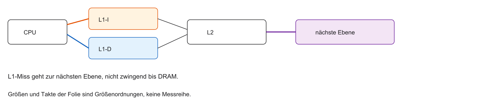

- L1 klein und nah, weitere SRAM-Ebenen größer, DRAM oft die unterste Ebene
- Takte auf der Folie sind Größenordnungen, keine Messreihe

::: notes
Nicht jeder L1-Miss geht bis zum DRAM. Ein Treffer in L2 bleibt in der Hierarchie.
:::

## Die Geheimwaffe: Lokalitätsprinzip

- Warum funktioniert die Pyramide so gut?
- Software zeigt kein rein zufälliges Zugriffsverhalten
- Code hat Struktur: Schleifen, Arrays
- Principle of Locality (Lokalitätsprinzip)
- Zwei Säulen: zeitliche und räumliche Lokalität

::: notes
Jetzt lösen wir unsere Leitfrage auf. Warum funktioniert der Cache? Weil unsere Programme nicht chaotisch auf Speicher zugreifen. Wenn Programme bei jedem Takt eine völlig zufällige Adresse aus 16 Gigabyte RAM abfragen würden, wäre der Cache nutzlos und die Hit-Rate läge bei 0 %. Aber Code wird von Menschen geschrieben. Wir nutzen Schleifen. Wir nutzen strukturierte Arrays. Dieses geordnete Verhalten rettet die Architektur.
:::

## Säule 1: Zeitliche Lokalität

- Temporal Locality: eine gerade genutzte Adresse wird sehr wahrscheinlich bald wieder genutzt
- Metapher: aufgeschlagenes Buch bleibt auf dem Schreibtisch
- Hardware: geladene Daten bleiben eine Weile im Cache

::: notes
Die erste Säule ist die zeitliche Lokalität. Die Regel lautet: Was gerade benutzt wurde, wird bald wieder gebraucht. Das klingt banal, ist aber die fundamentale Daseinsberechtigung für den Cache. Wenn die CPU eine Adresse anfragt, kopiert der Cache sie nicht nur durch, sondern speichert sie ab, weil er darauf wettet, dass die CPU bald wieder genau dieselbe Adresse anfragen wird.
:::

## Zeitliche Lokalität im C-Code

Die Schleife selbst zeigt zeitliche Lokalität der *Befehle* (L1-I). `i`, `sum` und `limit` können in Registern liegen oder wegoptimiert werden. Sie sind kein Beweis für wiederholte Data-Cache-Loads.

```asm
# explizite Load-Folge, nicht das optimierte Ergebnis der Schleife
lw t0, 0(a0)    # 0x1000
lw t0, 0(a0)    # wieder 0x1000
lw t1, 4(a0)    # 0x1004, räumlich
```

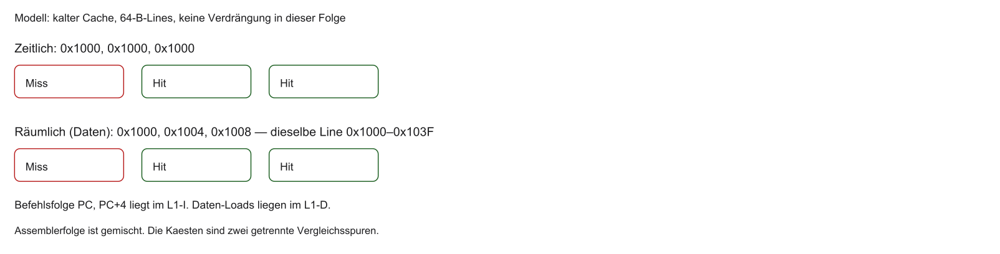

::: notes
`volatile` kann Loads erzwingen, ist aber keine Optimierungsstrategie und umgeht den Cache nicht. Lösung der Übungsfrage: 0x1000, 0x1000 ist zeitlich; 0x1000, 0x1004 ist räumlich. Im Assembler oben existieren genau diese drei Loads.
:::

## Säule 2: Räumliche Lokalität

- Spatial Locality: nach einer Adresse folgen sehr wahrscheinlich die Nachbarn
- Metapher: Band 2 der Enzyklopädie — Band 3 gleich mitnehmen
- Hardware: nie nur ein Byte — immer ein ganzer Block (Cache Line)

::: notes
Die zweite Säule ist die räumliche Lokalität. Die Wette der Hardware lautet hier: Wenn die CPU die Adresse 1000 liest, wird sie als Nächstes sehr wahrscheinlich die Adresse 1004 lesen. Um Zeit zu sparen, bringt der Cache beim Besuch im DRAM nicht nur das angefragte Byte mit, sondern packt gleich die nächsten 64 Bytes mit ein. Das ist ein Geniestreich!
:::

## Räumliche Lokalität im C-Code

Zwei typische Quellen:

1. Sequenzielle Befehle: nach Befehl $n$ oft Befehl $n+1$
2. Arrays und Strings: benachbarte Elemente hintereinander

Wenn `array[0]` geladen wird, lädt der Cache oft schon `array[1]`, `[2]`, …

```c
int daten[100];

// Klassischer Array-Durchlauf — hohe räumliche Lokalität
for (int i = 0; i < 100; i++) {
    daten[i] = 0;
}
```

::: notes
Warum stimmt diese Wette der Hardware fast immer? Weil Code sequenziell ist. Der Program Counter zählt fast immer einfach +4 weiter. Und bei Datenstrukturen lieben wir Arrays. Wenn Sie in C ein Array anlegen, liegen die Elemente im RAM physikalisch direkt nebeneinander. Wenn Sie das erste Element lesen, zieht der Cache den gesamten restlichen Datenblock in den schnellen SRAM. Der Zugriff auf Element 2, 3 und 4 kostet dann in der Regel nur noch die Hit Time — ohne erneute Miss Penalty.
:::

## Array vs. Linked List

- Pointer-Knoten können verstreut liegen; das ist möglich, nicht zwingend
- Dann füllt eine Line Nachbardaten, die der nächste Knoten nicht nutzt
- Ein kompaktes Listenlayout kann räumliche Lokalität behalten

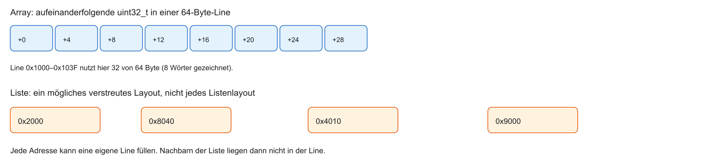

::: notes
Das ist eine fundamentale Erkenntnis für Sie als Software-Entwickler. In der Informatik lernt man oft, dass verkettete Listen wegen flexibler Einfügeoperationen attraktiv sind. Aus Sicht der modernen Hardware sind sie problematisch: Die Knoten liegen quer im RAM verstreut. Der Cache lädt bei Knoten 1 oft Daten mit, die für Knoten 2 nutzlos sind. Arrays sind auf modernen CPUs deshalb oft um ein Vielfaches schneller — allein wegen besserer Cache-Nutzung.
:::

## Layout im Speicher: Array vs. Liste

Die Abbildung steht auf der vorigen Folie: zusammenhängende Wörter gegen ein ausdrücklich mögliches Streulayout.

::: notes
Nicht jede Liste ist cache-feindlich. Ein Array in C liegt im Beispiel dicht.
:::

## Die 90/10-Regel

- Faustregel, workloadabhängig: oft liegt viel Laufzeit in wenig Code
- Der übrige Code wird nicht grundsätzlich nur einmal geladen

::: notes
„90/10“ ist eine Orientierung, keine Garantie. Der Rest des Programms kann ebenfalls wiederholt ausgeführt werden.
:::

## Übung — Lokalität

Welche Folge ist zeitlich, welche räumlich: `0x1000, 0x1000` oder `0x1000, 0x1004`? Welche Loads stehen im gezeigten Assembler wirklich?

::: notes
Zeitlich: zweimal 0x1000. Räumlich: 0x1000 dann 0x1004 in derselben 64-Byte-Line. Der Assembler enthält genau diese drei `lw`, nicht die C-Variablen i, sum und limit.
:::

## Was ist ein Cache?

- Kleiner, schneller Speicher mit Kopien aus einem größeren, langsameren Speicher
- Transparent: Software sieht ihn in der Regel nicht (`load_to_cache` gibt es nicht)
- Steuerwerk kopiert, sucht und verwaltet autonom
- CPU fordert `0x1000` an — der Cache fängt die Anfrage ab

::: notes
Wir klären nun das Vokabular. Wichtig ist: Der Cache ist unsichtbar. In MCT1 haben wir Register mit lw und sw manuell geladen. Den Cache laden Sie nicht manuell. Wenn Sie einen Load-Befehl ausführen, prüft die Hardware heimlich, ob die Adresse im Cache liegt. Wenn ja, antwortet der Cache. Wenn nein, reicht der Cache die Anfrage an den RAM weiter.
:::

## Split Caches: L1i und L1d

- Von-Neumann-Flaschenhals auf L1-Ebene entschärfen
- Split Caches (Harvard auf L1):
  - L1-I: nur Befehle (Fetch)
  - L1-D: nur Daten (Memory)
- Vorteil: Fetch und Memory gleichzeitig, ohne Streit um denselben Port
- L2 oft unified (gemeinsam für Code und Daten)


::: notes
Auf dem Level 1, also direkt an der CPU, haben wir fast immer zwei Caches. Einen für Code, einen für Daten. Warum? Damit unsere Pipeline aus MCT1 nicht blockiert. Wenn die Fetch-Stufe den nächsten Befehl laden will und die Memory-Stufe gleichzeitig ein Array liest, würden sie sich bei einem gemeinsamen Cache blockieren. Durch Split-Caches haben wir zwei getrennte Eingangstüren. Auf Level 2 wird dann meistens alles wieder in einem gemeinsamen (unified) Cache zusammengefasst.
:::

## Cache Hit vs. Cache Miss

Cache Hit (Treffer):

- Adresse liegt als Kopie im Cache
- Lieferung in der Hit Time des getroffenen Levels
- Ein L1-Miss kann in L2 treffen; erst ein Miss der letzten Cache-Ebene geht zum DRAM

::: notes
Das sind die wichtigsten Vokabeln des heutigen Tages. Ein Cache Hit ist ein Treffer, ein Erfolg. Die Pipeline rennt weiter. Ein Cache Miss ist ein Fehlschlag. Der Cache muss zugeben, dass er das gesuchte Datum nicht hat. Jetzt friert die CPU ein und wir müssen auf den lahmen Hauptspeicher warten.
:::

## Hit Rate und Miss Rate

$$
\text{Hit Rate} = \frac{\text{Hits}}{\text{Gesamtzugriffe}}, \qquad
\text{Miss Rate} = 1 - \text{Hit Rate}
$$

- Hit Rate: Anteil der Zugriffe, die im Cache gefunden werden
- Miss Rate: Anteil der Fehlschläge
- Praxiswerte hängen vom Workload ab; 90–98 % ist ein typischer Bereich, keine Garantie

::: notes
95 % im Rechenbeispiel heißt 95 von 100 betrachteten Zugriffen, nicht eine Vorhersagegenauigkeit der nächsten Adresse.
:::

## Miss Penalty

- Hit Time: Kosten jedes Zugriffs im Modell, hier 1 Takt
- Miss Penalty: *zusätzliche* Kosten nur der Misses, hier 100 Takte
- Das 3-GHz-Beispiel „100 ns = 300 Takte“ ist eine andere Größenordnung, nicht diese Penalty

::: notes
Zusätzliche Penalty heißt: der Miss kostet Hit Time plus Penalty, nicht die Penalty statt der Hit Time.
:::

## AMAT — Average Memory Access Time

Klausurrelevante Kernformel:

$$
\text{AMAT} = \text{Hit Time} + (\text{Miss Rate} \times \text{Miss Penalty})
$$

- Jeder Zugriff kostet mindestens die Hit Time (Cache wird immer geprüft)
- Nur bei Miss kommt die gewichtete Penalty hinzu

::: notes
Das ist die wichtigste Formel der Speicherarchitektur. Wenn Sie bei Intel oder Apple Chips designen, optimieren Sie diese Formel. Die Average Memory Access Time sagt uns, wie lange die CPU im Schnitt für einen Speicherzugriff warten muss. Wir zahlen immer den Preis für den Blick in den Cache (Hit Time). Und in einem bestimmten Prozentsatz der Fälle (Miss Rate) zahlen wir zusätzlich die teure Strafe (Miss Penalty).
:::

## Rechenbeispiel: Macht des Caches

- L1 Hit Time: $1$ Takt
- RAM Miss Penalty: $100$ Takte

Ohne Cache in diesem Modell: jeder Zugriff 100 Takte.

Mit 95 Hits und 5 Misses:

$$
95\cdot 1 + 5\cdot(1+100) = 600,\qquad 600/100 = 6
$$

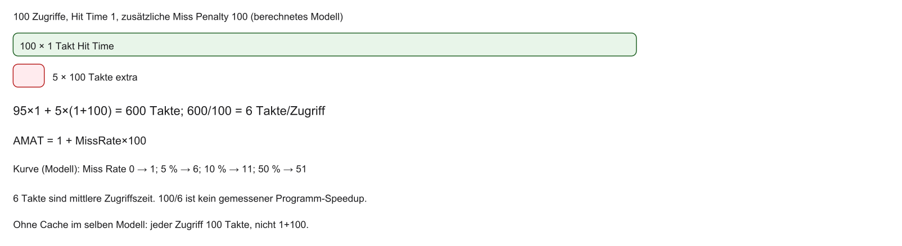

6 Takte sind die mittlere Zugriffszeit. $100/6$ ist ein Verhältnis dieser Zeiten, kein gemessener Speedup des Programms.

::: notes
Dieselbe Zahl folgt aus $1 + 0{,}05\cdot 100$. Eine optionale Vertiefung wäre eine rekursive L1/L2-Formel; dort müssen lokale und globale Miss Rates getrennt werden.
:::

## Wir laden niemals einzelne Bytes

- Räumliche Lokalität $\Rightarrow$ keine Einzelbyte-Verwaltung
- Verwaltungseinheit: Cache Block / Cache Line
- Typisch 32 oder 64 Bytes zusammenhängender Speicher
- Ein Miss lädt immer die gesamte Line aus dem DRAM

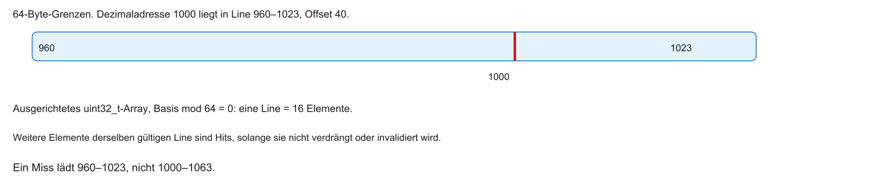

| Feld | Bedeutung |
|------|-----------|
| Valid | Eintrag wurde geladen |
| Tag | welcher Block |
| Daten | 64 Byte auf Blockgrenze |
| Dirty | nur bei Write-Back: verändert |

::: notes
Die dezimale Adresse 1000: floor(1000/64)*64 = 960, Offset 40. Ein ausgerichtetes uint32_t-Array hat 16 Elemente pro Line.
:::

## Cache Line und räumliche Lokalität

- Miss bei `array[0]` lädt die ganze Line (z. B. 16 Integers)
- Weitere Elemente derselben gültigen Line sind Hits, solange die Line nicht verdrängt oder invalidiert wird
- „Garantierte Hits“ gibt es ohne diese Annahme nicht

::: notes
Ein Miss lädt die Line auf Blockgrenze. Die nächsten Elemente derselben gültigen Line sind Hits, bis sie verdrängt oder invalidiert wird. Das ist das Modell, keine Garantie für jedes kompilierte Programm.
:::

## Anatomie einer Cache-Zeile

Ein Cache-Eintrag enthält drei Felder:

1. Daten (Block): z. B. 64-Byte-Paket aus dem RAM
2. Valid-Bit: $1$ = gültige Daten, $0$ = leer/ungültig (nach Reset)
3. Tag: Adress-Etikett — woher aus dem großen Adressraum stammt der Block?

| Valid | Tag | Daten |
|-------|-----|-------|
| 1 Bit | z. B. 17 Bit | z. B. 64 Bytes |

::: notes
Im SRAM des Caches speichern wir nicht nur die Daten. Wir müssen die Daten markieren. Stellen Sie sich vor, Sie legen Aktenordner aus dem Keller auf den Schreibtisch. Wenn auf dem Ordner nicht steht, wo er herkommt, wissen Sie später nicht, wem die Daten gehören. Dieses Etikett ist das Tag. Und das Valid-Bit brauchen wir, weil der Cache beim Einschalten des PCs voller Strom-Rauschen und Müll ist. Das Valid-Bit sagt: Diese Daten sind frisch und echt.
:::

## Blockgröße: Der Kompromiss

- Größere Lines: bessere räumliche Lokalität — aber höhere Miss Penalty
- Wenige große Blöcke: weniger „Slots“, mehr Verdrängung (Thrashing)
- Industrie-Sweetspot: oft 32–64 Bytes pro Line

::: notes
Könnten wir nicht einfach 4-Kilobyte-Blöcke laden? Die Antwort liegt wieder im magischen Dreieck. Ein L1-Cache hat vielleicht nur 32 Kilobyte. Wenn wir 4 Kilobyte große Blöcke nutzen, passen genau 8 Blöcke in den Cache. Wenn das Programm nun an 9 verschiedenen Stellen im RAM gleichzeitig arbeitet, werfen sich diese Blöcke ständig gegenseitig aus dem Cache. Die Miss Penalty explodiert, weil das ständige Nachladen den Speicherbus blockiert. 64 Bytes haben sich heute als guter Kompromiss erwiesen.
:::

## Übung — AMAT

Berechnen Sie AMAT für Hit Rate 95 % und 80 % bei Hit Time 1 und zusätzlicher Penalty 100. Was bedeutet „zusätzlich“?

::: notes
95 %: $1+0{,}05\cdot 100=6$. 80 %: $1+0{,}2\cdot 100=21$. Zusätzlich heißt: die Hit Time wird immer gezahlt, die Penalty nur bei Misses.
:::

## Das Mapping-Problem

- Massives Platzproblem zwischen RAM und Cache
- RAM: z. B. 4 GB (Millionen Cache-Blöcke)
- L1-Cache: z. B. 32 KB (vielleicht nur 512 Cache-Zeilen)
- Frage: Wo darf ein RAM-Block im Cache abgelegt werden?
- Herausforderung: Mapping in Hardware, idealerweise in höchstens 1 Takt
- Drei grundlegende Strategien lösen dieses Problem

::: notes
Wir stehen vor einem logistischen Engpass. Wir haben Millionen von Aktenordnern im Keller, aber nur 512 freie Plätze auf unserem Schreibtisch. Wenn wir eine Akte hochholen, wo legen wir sie ab? Und wenn die CPU eine Akte sucht, wie findet sie diese in etwa 1 Nanosekunde wieder? Wenn die CPU jede der 512 Positionen nacheinander durchsuchen müsste, wäre der Zeitvorteil des Caches sofort wieder zerstört.
:::

## Mapping: Kapazität vs. Suche

```{mermaid}
%%| fig-width: 4.0
%%{init: {'theme': 'base', 'themeVariables': {'background': '#FFFFFF', 'primaryColor': '#FFFFFF', 'primaryBorderColor': '#E5E5EA', 'primaryTextColor': '#1D1D1F', 'lineColor': '#86868B', 'secondaryColor': '#F5F5F7', 'tertiaryColor': '#FFFFFF', 'mainBkg': '#FFFFFF', 'nodeBorder': '#E5E5EA', 'clusterBkg': '#F5F5F7', 'clusterBorder': '#E5E5EA', 'titleColor': '#1D1D1F', 'edgeLabelBackground': '#FFFFFF'}}}%%
flowchart LR
  RAM["4 GB RAM\nMillionen Blöcke"] -->|Mapping?| Cache["32 KB Cache\n512 Zeilen"]
  style Cache fill:#FFFFFF,stroke:#E2001A,stroke-width:2px !important
```

::: notes
Schematische Größenordnung: Der Hauptspeicher fasst Millionen Blöcke, der L1-Cache nur wenige hundert Zeilen. Die Mapping-Funktion muss deshalb in Hardware extrem schnell entscheiden, wohin ein Block gehört und wo er gesucht wird.
:::

## Direct Mapped Cache

- Einfachste Strategie: Direct Mapped (Direktabbildung)
- Regel: jeder RAM-Block hat genau einen festen Platz im Cache
- Parkhaus-Metapher: Parkplatznummer aus den letzten Ziffern des Nummernschilds
- Endet das Schild auf 05 → nur Parkplatz 05
- Vorteil: Suche nur an genau diesem einen Platz

::: notes
Direct Mapped ist die simpelste und schnellste Hardware-Lösung. Jedem RAM-Block wird mathematisch ein fester Platz im Cache diktiert. Das ist wie in einem Parkhaus, in dem Sie nicht frei parken dürfen. Wenn die CPU wissen will, ob Block 512 im Cache ist, weiß sie sofort: „Wenn er da ist, dann zwingend auf Platz 0.“ Die Hardware schaut nur auf Fach 0. Ist er da, Hit. Ist er nicht da, Miss.
:::

## Direct Mapped: feste Zuordnung

```{mermaid}
%%| fig-width: 4.2
%%{init: {'theme': 'base', 'themeVariables': {'background': '#FFFFFF', 'primaryColor': '#FFFFFF', 'primaryBorderColor': '#E5E5EA', 'primaryTextColor': '#1D1D1F', 'lineColor': '#86868B', 'secondaryColor': '#F5F5F7', 'tertiaryColor': '#FFFFFF', 'mainBkg': '#FFFFFF', 'nodeBorder': '#E5E5EA', 'clusterBkg': '#F5F5F7', 'clusterBorder': '#E5E5EA', 'titleColor': '#1D1D1F', 'edgeLabelBackground': '#FFFFFF'}}}%%
flowchart LR
  B0[RAM-Block 0] --> L0[Cache-Zeile 0]
  B1[RAM-Block 1] --> L1[Cache-Zeile 1]
  B512[RAM-Block 512] -.->|Modulo 512| L0
  B513[RAM-Block 513] -.->|Modulo 512| L1
  style L0 fill:#FFFFFF,stroke:#E2001A,stroke-width:2px !important
```

::: notes
Beispiel mit 512 Zeilen: Block 0 und Block 512 konkurrieren um dieselbe Cache-Zeile 0. Genau diese Kollision führt später zum Thrashing-Problem.
:::

## Modulo-Arithmetik in Hardware

- Cache-Index $= (\text{RAM-Blockadresse}) \bmod (\text{Anzahl Cache-Zeilen})$
- Modulo einer Zweierpotenz ist ein Bitfeld, kein allgemeiner Dividierer
- Die Auswahl selbst ist verdrahtet; der Speicherzugriff ist deshalb nicht verzögerungsfrei

::: notes
1234 mod 100 nutzt die letzten Dezimalziffern. $2^9$ nutzt neun Indexbits. Das ersetzt keinen physikalisch laufzeitfreien Pfad.
:::

## Die Adress-Zerlegung

Die CPU legt eine 32-Bit-Adresse auf den Bus. Der Cache zerschneidet sie in drei Felder:

1. Block Offset — unterste Bits
2. Cache Index — mittlere Bits
3. Tag — oberste Bits

Diese drei Felder sind der Schlüssel jeder Cache-Architektur.

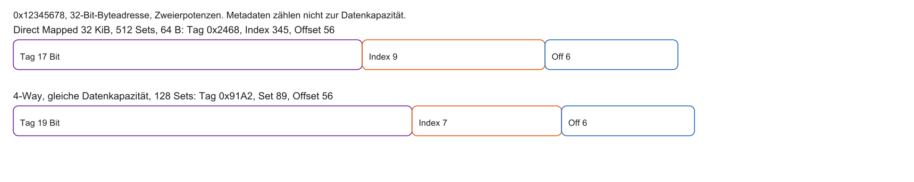

- $S = C/(B\cdot W)$, Offset $\log_2 B$, Index $\log_2 S$, Tag $P-b-s$
- Zweierpotenzen erlauben die Zerlegung durch Bitfelder, ohne Dividierer
- Leitungen, Decoder, SRAM, Komparator und MUX haben trotzdem Laufzeit

::: notes
Direct Mapped: Tag 0x2468, Index 345, Offset 56. 4-Way bei gleicher Datenkapazität: Tag 0x91A2, Set 89, Offset 56. „0 Takte“ für die Bitselektion wäre falsch.
:::

## Feld 1: Der Block Offset

- Wo in der Cache-Zeile liegt das gesuchte Byte?
- Eine Line bringt z. B. 64 Bytes am Stück
- CPU will oft nur ein 4-Byte-Wort
- $2^{6} = 64$ → unterste 6 Bits als Offset innerhalb des Blocks

```{mermaid}
%%| fig-width: 3.8
%%{init: {'theme': 'base', 'themeVariables': {'background': '#FFFFFF', 'primaryColor': '#FFFFFF', 'primaryBorderColor': '#E5E5EA', 'primaryTextColor': '#1D1D1F', 'lineColor': '#86868B', 'secondaryColor': '#F5F5F7', 'tertiaryColor': '#FFFFFF', 'mainBkg': '#FFFFFF', 'nodeBorder': '#E5E5EA', 'clusterBkg': '#F5F5F7', 'clusterBorder': '#E5E5EA', 'titleColor': '#1D1D1F', 'edgeLabelBackground': '#FFFFFF'}}}%%
flowchart TD
  A["Cache Line: 64 Bytes"] --> B["Offset 000000 → Byte 0"]
  A --> C["Offset 000100 → Byte 4"]
  style A fill:#FFFFFF,stroke:#E2001A,stroke-width:2px !important
```

::: notes
Das erste Bündel sind die untersten Bits. Erinnern wir uns: Der Cache lädt immer fette 64-Byte-Blöcke. Wenn der 64-Byte-Block endlich gefunden ist, müssen wir aus diesen 64 Bytes das richtige Stück herausschneiden, das die CPU angefragt hat. Bei 64 Bytes brauchen wir exakt 6 Bits, um jedes Byte darin durchzunummerieren.
:::

## Feld 2: Der Cache Index

- Welche Zeile des Caches? (Modulo-Operation)
- Mittlere Bits schneiden die Adresse auf die Cache-Größe
- Beispiel: 512 Zeilen $\Rightarrow 2^{9}$ → nächste 9 Bits über dem Offset
- Diese Bits gehen direkt an den Adress-Decoder des Cache-SRAM

::: notes
Das ist der Index. Er sagt der Hardware, in welche Schublade sie greifen muss. Wenn wir 512 Schubladen haben, reichen 9 Bits völlig aus. Wir nehmen also die nächsten 9 Kabel der Adresse, schließen sie an den SRAM des Caches an und die Schublade springt sofort auf. Kein Suchen, kein Warten. Purer Random Access in Sub-Nanosekunden.
:::

## Feld 3: Das Tag

- Prüft: Sind das wirklich meine Daten?
- Alias-Problem: Millionen RAM-Blöcke teilen denselben Index
- Beim Öffnen der Zeile: welches der vielen Blöcke liegt darin?
- Oberste Bits = Tag
- Bei 512 Sets hat Block 512 den Tag 1, nicht das Etikett 512
- Der Vergleich ist ein Bitvergleich mit Reduktion, nicht ein einzelnes XOR als vollständige Schaltung

::: notes
Tag = floor(Blocknummer / Anzahl Sets). Blocknummer 512 und Tag 1 sind verschiedene Zahlen.
:::

## Das Valid-Bit — Boot-Problem

- Nach Einschalten: SRAM voller zufälligem Rauschen
- Zufällig könnte das Rauschen dem gesuchten Tag gleichen
- Lösung: 1-Bit Valid-Flag
- Hardware-Reset setzt alle Valid-Bits auf 0
- Hit nur wenn Tag übereinstimmt und $\text{Valid} = 1$

::: notes
Das Valid-Bit rettet den Computer beim Einschalten. Ohne dieses Bit würde die CPU beim ersten Load-Befehl einen Hit melden, weil der physikalische Zufallsmüll im SRAM zufällig das richtige Tag-Muster aufweist. Das Valid-Bit sagt knallhart: „Dieser Eintrag ist Müll, er wurde noch nie absichtlich aus dem RAM geladen.“
:::

## Ablauf eines Lesezugriffs (Direct Mapped)

1. 32-Bit-Adresse anliegend — Index-Bits öffnen das Cache-SRAM
2. Gespeichertes Tag und Valid-Bit auslesen
3. Komparator: $(\text{Tag} = \text{CPU-Tag}) \land (\text{Valid} = 1)$
4. Hit → Daten zur CPU; Miss → Stall und Anfrage an Main Memory

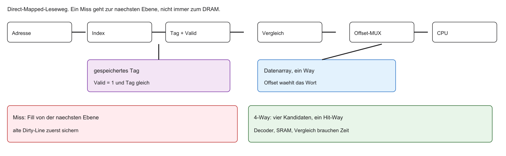

::: notes
Beim 4-Way-Modell vergleichen vier Ways parallel. Der Daten-MUX wählt den treffenden Way. Die Datenkapazität bleibt 32 KiB, der Cache wird nicht viermal größer.
:::

## Vorteil von Direct Mapped

- Suche nur an einer Stelle → minimaler Hardware-Aufwand
- Nur ein Komparator: Strom und Chipfläche sparen
- Schnelle Hit-Time: oft Antwort in einem Takt
- Bei Miss keine Wahl: nur ein Platz kann verdrängt werden

::: notes
Direct Mapped Caches sind wunderschön simpel. Die Hardware-Ingenieure lieben sie, weil sie kaum Strom verbrauchen und rasend schnell sind. Es gibt keine Diskussion, wer den Parkplatz räumen muss, wenn ein neues Auto kommt. Es gibt für das neue Auto ja eh nur diesen einen Platz. Der alte Besitzer fliegt gnadenlos raus.
:::

## Nachteil: Thrashing

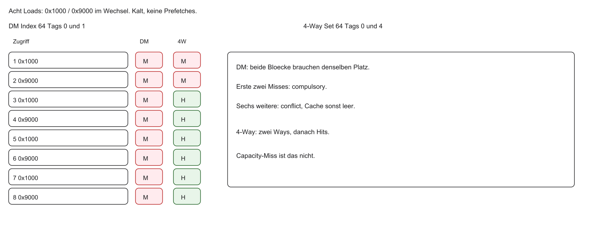

- Beide Adressen treffen Set 64. Direct-Mapped-Tags 0 und 1, 4-Way-Tags 0 und 4
- Zwei compulsory Misses, im Direct Mapped zusätzlich sechs Conflict Misses
- Der übrige Cache kann leer bleiben; das ist kein Capacity Miss dieses Paars

::: notes
Fully associative legt beide Blöcke ohne diesen Index-Konflikt ab. Ein zu großes Working Set erzeugt trotzdem Capacity Misses.
:::

## Thrashing-Beispiel in C

Thrashing *kann* auftreten, wenn zwei heiß genutzte Arrays denselben Cache-Index treffen (abhängig von Alignment, Array-Größe und Cache-Organisation):

```c
// Kollision möglich bei gleichem Cache-Index
int A[1000];
int B[1000];

for (int i = 0; i < 1000; i++) {
    // Konflikt: gegenseitiges Verdrängen
    A[i] = A[i] + B[i];
}
```

::: notes
Ein harmlos wirkendes C-Programm: Zwei Arrays werden addiert. Wenn der Linker diese Arrays so platziert, dass ihre Adressen denselben Cache-Index ergeben — und der Cache Direct Mapped ist — können sich A und B gegenseitig verdrängen. Dann läuft das Programm deutlich langsamer. Ob die Kollision wirklich eintritt, hängt von Alignment, Größen und Cache-Parametern ab; dem Quelltext allein sieht man das oft nicht an.
:::

## Übung — Adressfelder

Bestimmen Sie für 0x12345678 im Referenzmodell Tag, Index und Offset, direct mapped. Was liefert die Folge 0x1000, 0x9000, 0x1000 im kalten Direct-Mapped-Cache?

::: notes
Tag 0x2468, Index 345, Offset 56. Die Folge trifft zweimal Set 64 mit verschiedenen Tags: Miss, Miss, Miss.
:::

## Fully Associative Cache

- Gegenteil von Direct Mapped: Fully Associative (vollassoziativ)
- Regel: RAM-Block darf an jedem freien Platz liegen
- Parkhaus: freie Platzwahl
- Vorteil: kein Thrashing — A und B können nebeneinander leben

::: notes
Um Thrashing zu stoppen, geben wir die starren Parkplätze auf. Fully Associative heißt absolute Freiheit. Ein Block aus dem RAM darf in jede beliebige Zeile des Caches geschrieben werden. Dadurch können Variable A und Variable B aus unserem C-Beispiel friedlich nebeneinander im Cache leben, auch wenn ihre Adressen eigentlich kollidieren würden.
:::

## Das Such-Problem bei Fully Associative

- Freiheit hat einen Preis: Wo liegt der Block?
- Kein Index mehr — Adresse nur noch Tag und Offset
- Hardware muss alle Zeilen parallel nach dem Tag durchsuchen
- Bei 512 Zeilen: 512 parallele Komparatoren

```{mermaid}
%%| fig-width: 4.0
%%{init: {'theme': 'base', 'themeVariables': {'background': '#FFFFFF', 'primaryColor': '#FFFFFF', 'primaryBorderColor': '#E5E5EA', 'primaryTextColor': '#1D1D1F', 'lineColor': '#86868B', 'secondaryColor': '#F5F5F7', 'tertiaryColor': '#FFFFFF', 'mainBkg': '#FFFFFF', 'nodeBorder': '#E5E5EA', 'clusterBkg': '#F5F5F7', 'clusterBorder': '#E5E5EA', 'titleColor': '#1D1D1F', 'edgeLabelBackground': '#FFFFFF'}}}%%
flowchart LR
  Tag[CPU-Tag] --> K1{Komp 1}
  Tag --> K2{Komp 2}
  Tag --> Kn{Komp N}
  K1 --> OR((ODER))
  K2 --> OR
  Kn --> OR
  OR --> Hit[Hit?]
  style OR fill:#FFFFFF,stroke:#E2001A,stroke-width:2px !important
```

::: notes
Wenn es keinen festen Parkplatz mehr gibt, muss die CPU jedes Mal das gesamte Parkhaus absuchen, um ihr Auto zu finden. In der Informatik lösen wir das durch massive Parallelität. Wir bauen für jede einzelne Zeile des Caches einen eigenen Komparator-Schaltkreis. Wenn die CPU eine Anfrage stellt, brüllen alle 512 Komparatoren gleichzeitig auf. Einer meldet hoffentlich: „Ich hab's!“.
:::

## Nachteile von Fully Associative

- Strom und Hitze: hunderte parallele Vergleiche jede Nanosekunde
- Chipfläche: Komparatoren oft größer als der SRAM selbst
- Latenz: große ODER-Netze verlangsamen das Hit-Signal
- Fazit: für große L1-Caches in der Praxis unbrauchbar

::: notes
Fully Associative Caches sind theoretisch attraktiv, weil sie Hit-Raten maximieren — physikalisch aber teuer: Hitzeentwicklung und Platzbedarf der parallelen Vergleichslogik machen die Architektur für große L1-Caches ungeeignet. Wir brauchen einen Kompromiss aus beiden Welten.
:::

## Der Mittelweg: Set-Associative Cache

- Industriestandard: Set-Associative (mengenassoziativ)
- Hybrid aus Direct Mapped und Fully Associative
- Parkhaus: feste Zone (Set) wie Direct Mapped — darin z. B. 4 freie Plätze (Ways)
- Sie müssen in Zone 05 parken, dürfen dort aber einen der 4 Plätze wählen

::: notes
Willkommen beim Industriestandard. Fast jeder Prozessor in Ihrem Handy oder Laptop nutzt Set-Associative Caches. Wir mischen die Strategien. Die Adresse sagt uns wieder: „Geh zu Index 5“. Aber auf Index 5 gibt es nicht nur eine Cache-Zeile, sondern eine kleine Menge (ein Set) von Zeilen.
:::

## N-Way Set-Associative Struktur

- Cache in Sets; jedes Set hat $N$ Ways
- Beispiel 4-Way: Index zeigt auf Set mit 4 Blöcken
- Suche: nur $N$ parallele Komparatoren (z. B. 4)
- Bestes aus beiden Welten:
  - wenig Komparatoren (schnell, sparsam)
  - bis zu $N$ Blöcke mit gleichem Index ohne gegenseitiges Rauswerfen

| Index | Way 0 | Way 1 | Way 2 | Way 3 |
|-------|-------|-------|-------|-------|
| Set 0 | Block | Block | Block | Block |
| Set 1 | … | … | … | … |

::: notes
Das ist der Sweetspot. Wenn wir einen 4-Way Set-Associative Cache bauen, brauchen wir nur vier Komparatoren. Das ist billig und kalt. Wenn unser C-Programm jetzt Variable A und B abfragt, die denselben Index haben, legen wir A in Way 0 und B in Way 1 des selben Sets. Das Thrashing-Problem ist gelöst.
:::

## Praxis: 2-Way und 4-Way

- Moderne CPUs nutzen typischerweise Set-Associative Caches
- Typische Größenordnungen (schematisch, je nach Generation/Produkt):
  - L1: oft 4-Way oder 8-Way
  - L3: oft höhere Assoziativität (z. B. 12–16-Way)
- Größeres $N$: weniger Konflikt-Misses, aber mehr Komparatoren und Strom

*Angaben schematisch — konkrete Werte den jeweiligen Microarchitecture-/Datenblättern entnehmen.*

::: notes
Assoziativität ist das Stellrad der Computerarchitekten. Für den L1-Cache, der extrem schnell sein muss, wählt man oft moderate Assoziativität (z. B. 4- oder 8-Way). Für den L3-Cache, bei dem Kapazität und Hit-Rate wichtiger sind als die letzte Nanosekunde, sind höhere Assoziativitäten üblich. Die konkreten Zahlen variieren stark zwischen Herstellern und Generationen.
:::

## Adress-Zerlegung bei Set-Associative

- Ein Set fasst mehrere Ways → insgesamt weniger Sets
- Weniger Sets → weniger Index-Bits
- Eingesparte Index-Bits wandern ins Tag
- Offset bleibt gleich (Blockgröße unverändert)

| Tag (z. B. 19 Bit) | Set-Index (z. B. 7 Bit) | Offset (z. B. 6 Bit) |
|--------------------|-------------------------|----------------------|

::: notes
Das ist wichtig für Klausuraufgaben: Wenn Sie einen Cache von Direct Mapped auf 4-Way umbauen (bei gleicher Gesamtkapazität), schrumpft die Anzahl der Indizes um den Faktor 4. Sie brauchen also 2 Index-Bits weniger. Diese 2 Bits rücken eine Stelle nach links und werden Teil des Tags. Der Offset bleibt immer gleich, denn die Blockgröße ändert sich ja nicht.
:::

## Hardware-Ablauf beim N-Way Cache

1. Set-Index wählt genau ein Set
2. Alle $N$ Ways (Tags + Valid) parallel auslesen
3. $N$ Komparatoren vergleichen mit dem CPU-Tag
4. MUX wählt die Datenleitung des Hit-Ways

```{mermaid}
%%| fig-width: 4.2
%%{init: {'theme': 'base', 'themeVariables': {'background': '#FFFFFF', 'primaryColor': '#FFFFFF', 'primaryBorderColor': '#E5E5EA', 'primaryTextColor': '#1D1D1F', 'lineColor': '#86868B', 'secondaryColor': '#F5F5F7', 'tertiaryColor': '#FFFFFF', 'mainBkg': '#FFFFFF', 'nodeBorder': '#E5E5EA', 'clusterBkg': '#F5F5F7', 'clusterBorder': '#E5E5EA', 'titleColor': '#1D1D1F', 'edgeLabelBackground': '#FFFFFF'}}}%%
flowchart LR
  Idx[Set-Index] --> Set[Set öffnen]
  Set --> T0[Tag Way 0] --> K0{Komp}
  Set --> T1[Tag Way 1] --> K1{Komp}
  K0 -->|Hit?| MUX[MUX]
  K1 -->|Hit?| MUX
  MUX --> CPU[Daten zur CPU]
  style MUX fill:#FFFFFF,stroke:#E2001A,stroke-width:2px !important
```

::: notes
Die Hardware arbeitet stark parallel. Wir greifen in die Schublade (das Set) und ziehen gleichzeitig vier Ordner heraus. Vier Angestellte prüfen gleichzeitig die vier Etiketten (Komparatoren). Derjenige, der das richtige Etikett hat, schiebt die Akte zur CPU durch. Die anderen drei werfen die Akten wieder zurück.
:::

## Eviction — Verdrängung

- Direct Mapped: voller Platz → alter Block fliegt raus (keine Wahl)
- N-Way: Set voll (alle $N$ Ways belegt) → welcher Block wird geopfert?
- Eviction = Verdrängung
- Hardware braucht eine Replacement Policy

::: notes
Freiheit bringt Verantwortung. Wenn wir vier Plätze in unserem Set haben und alle voll sind, müssen wir eine Entscheidung treffen. Welchen der vier wertvollen Cache-Einträge opfern wir, um Platz für den neuen Block aus dem langsamen RAM zu schaffen? Wenn wir den falschen wählen, zerstören wir die zeitliche Lokalität.
:::

## Replacement: Random und FIFO

Random:

- Zufälligen Way aus dem Set werfen
- Hardware sehr einfach; bei großen Caches oft erstaunlich gut

FIFO (First-In-First-Out):

- Ältesten geladenen Block verdrängen
- Problem: früh geladene, aber oft genutzte Daten (z. B. Schleifenzähler) fliegen unnötig raus

::: notes
Die Hardware-Ingenieure haben viel experimentiert. Einfacher Zufall funktioniert erstaunlich gut und kostet fast kein Silizium. FIFO, also das Rauswerfen des ältesten Eintrags, klingt fair, ist aber oft dumm. Die Variable i einer Schleife wurde ganz zu Beginn geladen, wird aber in jedem Takt gebraucht. FIFO würde sie einfach rauswerfen.
:::

## Replacement: LRU

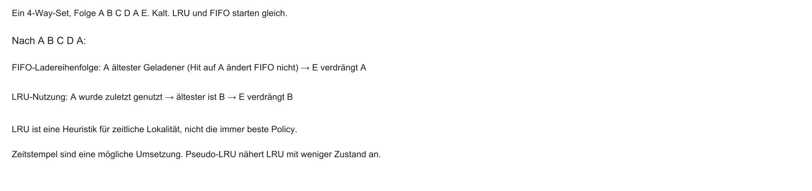

- Ein Hit macht den Block bei LRU wieder jung, bei FIFO bleibt die Ladereihenfolge
- LRU ist eine gute Heuristik, nicht perfekt und nicht immer die beste Policy
- Zeitstempel sind eine mögliche Umsetzung. Pseudo-LRU spart Bits

::: notes
Nach dem erneuten A ist A bei FIFO weiter der älteste geladene Block. LRU hat B als am längsten ungenutzt.
:::

## Zusammenfassung Mapping-Strategien

| Merkmal | Direct Mapped | Fully Associative | N-Way Set-Associative |
|---------|---------------|-------------------|------------------------|
| Platzwahl | 1 fester Platz | überall | frei innerhalb eines Sets |
| Komparatoren | 1 | sehr viele | $N$ (z. B. 4) |
| Kollisionen | Conflict Misses möglich | keine Conflict Misses | weniger pro Set |
| Eviction | keine Wahl | LRU / Random | LRU / Random |
| Praxis | billige Chips | kleine Puffer (z. B. TLB) | L1/L2/L3-Standard |

::: notes
Hier haben Sie alle drei Welten auf einen Blick. In der Klausur oder in der Industrie werden Sie fast immer auf Set-Associative Caches stoßen, da sie die Nachteile der beiden anderen Extreme perfekt ausbalancieren.
:::

## Übung — gleiche Kapazität

32 KiB und 64-Byte-Lines: Warum hat 4-Way weniger Indexbits als Direct Mapped?

::: notes
Die Set-Zahl fällt von 512 auf 128, der Index von 9 auf 7 Bit, der Tag wächst von 17 auf 19. Der Offset bleibt 6. Die Datenkapazität bleibt 32 KiB.
:::

## Das Problem beim Schreiben

- Bisher: Lesen (`lw`)
- Store (`sw`): CPU schreibt einen neuen Wert
- Schreiben in den L1 ist schnell — der DRAM bleibt aber unverändert
- Cache hält dann einen neueren Wert als der RAM

::: notes
Caches machen das Lesen effizient. Beim Schreiben entsteht jedoch ein Konsistenzproblem: Wenn Sie in C `a = 5;` schreiben, aktualisiert die CPU den Wert im L1-Cache. Der Wert im Hauptspeicher kann vorerst unverändert bleiben. Die Ebenen sind dann vorübergehend inkonsistent.
:::

## Das Cache-Kohärenz-Problem

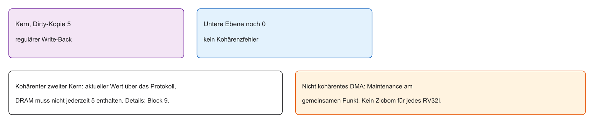

- Ein kohärenter zweiter Kern kann den aktuellen Wert über das Protokoll sehen
- Nicht kohärentes DMA braucht Sichtbarkeit am gemeinsamen Zugriffspunkt
- Clean, Invalidate und Flush sind konzeptionell verschieden und plattformabhängig
- Kein Zicbom und kein MESI für eine beliebige RV32I-Plattform; Multicore folgt in Block 9

::: notes
DRAM muss im kohärenten Fall nicht jederzeit den neuesten Wert halten. Ein nicht kohärenter DMA-Leser sieht sonst die alte Kopie.
:::

## Schreibstrategie 1: Write-Through

- Write-Through (Durchschreiben)
- Jeder Schreibvorgang geht synchron in L1 und Main Memory
- RAM bleibt aktuell (gegenüber dem schreibenden Kern)
- Achtung Multicore: ein anderer Kern kann trotzdem eine veraltete L1-Kopie halten — volle Kohärenz braucht Invalidierung/Snooping (Block 9)

::: notes
Eine einfache Methode für die RAM-Konsistenz ist das Durchschreiben. Jeder Store-Befehl geht nicht nur in den Cache, sondern wird sofort an den langsamen RAM durchgereicht. Vorteil: keine Diskrepanz zwischen Cache und RAM beim schreibenden Kern — volle Multicore-Kohärenz braucht trotzdem Invalidierung/Snooping.
:::

## Write-Through: Datenfluss

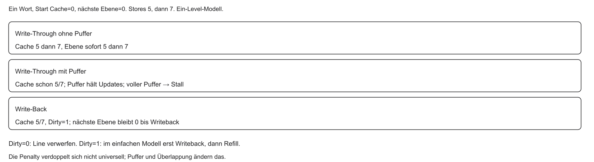

::: notes
Die nächste Ebene des Ein-Level-Modells steht hier für den Hauptspeicher. In einer echten Hierarchie schreibt L1 zuerst zur nächsten Cache-Ebene.
:::

## Nachteile von Write-Through

- Ohne Write Buffer: jedes `sw` wartet auf den langsamen DRAM ($\approx 300$ Takte)
- Rückfall in die Memory Wall beim Schreiben
- Schreibintensive Programme stark ausgebremst
- Bus durch ständige Einzel-Updates überlastet

::: notes
Ohne Puffer verlieren wir den Performance-Vorteil des Caches beim Schreiben weitgehend. Wenn der C-Code eine Variable tausendmal überschreibt und jeder Store synchron auf den DRAM wartet, zahlen wir tausendmal die lange Latenz. Write-Through allein ist deshalb für performante SoCs oft zu teuer — deshalb folgt der Write Buffer.
:::

## Hardware-Hack: Write Buffer

- Write Buffer: kleine FIFO-Warteschlange zwischen L1 und RAM
- CPU schreibt rasch in Cache und Buffer und rechnet weiter
- Buffer schickt Daten im Hintergrund zum DRAM
- Wenn der Buffer voll läuft: CPU muss wieder stallen

::: notes
Der Write Buffer wirkt wie ein Postausgangskorb: Die CPU legt den neuen Wert ab und arbeitet weiter; der Controller transportiert ihn asynchron zum DRAM. Das rettet die Performance — solange der Buffer nicht überläuft. Bei dichten Speicher-Kopien kann er schnell voll sein, dann stallen wir erneut.
:::

## Schreibstrategie 2: Write-Back

- Write-Back (Zurückschreiben): Schreiben nur in den L1
- CPU kann dieselbe Variable tausendfach schnell aktualisieren
- Risiko: Cache ist „schmutzig“ — neuer als der RAM

::: notes
Der Industriestandard heute ist oft Write-Back. Die CPU aktualisiert Variablen im Cache, ohne bei jedem Store den RAM zu blockieren. Der Hauptspeicher kann vorübergehend veraltete Kopien halten — riskant für Kohärenz, aber vorteilhaft für die Ausführungsgeschwindigkeit.
:::

## Write-Back: Datenfluss

```{mermaid}
%%| fig-width: 3.8
%%{init: {'theme': 'base', 'themeVariables': {'background': '#FFFFFF', 'primaryColor': '#FFFFFF', 'primaryBorderColor': '#E5E5EA', 'primaryTextColor': '#1D1D1F', 'lineColor': '#86868B', 'secondaryColor': '#F5F5F7', 'tertiaryColor': '#FFFFFF', 'mainBkg': '#FFFFFF', 'nodeBorder': '#E5E5EA', 'clusterBkg': '#F5F5F7', 'clusterBorder': '#E5E5EA', 'titleColor': '#1D1D1F', 'edgeLabelBackground': '#FFFFFF'}}}%%
flowchart TD
  CPU["CPU schreibt 5"] --> Cache["L1 hält 5"]
  Cache -.->|wartet| RAM["RAM noch 0"]
  style Cache fill:#FFFFFF,stroke:#E2001A,stroke-width:2px !important
```

::: notes
Schematisch: Der neue Wert liegt im Cache; der DRAM bleibt vorerst unverändert, bis eine Eviction oder ein Kohärenzprotokoll den Block zurückschreibt.
:::

## Das Dirty-Bit

- Dirty-Bit (D) markiert veränderte Cache-Zeilen
- Nach Laden aus dem RAM: $\text{Dirty} = 0$ (sauber)
- Nach erstem `sw` in den Block: $\text{Dirty} = 1$

| Valid | Dirty | Tag | Daten |
|-------|-------|-----|-------|
| 1 Bit | 1 Bit | Adress-Etikett | z. B. 64 Bytes |

::: notes
Die Hardware muss den Überblick behalten. Neben dem Valid-Bit bekommt jede Zeile ein Dirty-Bit. Ein schmutziger Block bedeutet: „Achtung, meine Daten sind wertvoller als die im RAM. Verliere mich nicht!“
:::

## Eviction bei Write-Back

- Writebacks entstehen durch Eviction, Maintenance oder Protokollaktionen, nicht nur durch Eviction
- Dirty = 0: die Line darf verworfen werden
- Dirty = 1: im einfachen Modell erst zurückschreiben, dann den neuen Block laden
- Puffer und Überlappung können die Penalty ändern; sie verdoppelt sich nicht allgemein

::: notes
Eine saubere Eviction verwirft die Line. Eine schmutzige Eviction schreibt sie zurück. Das ist das Lehr-Modell, keine vollständige Definition aller Writeback-Auslöser.
:::

## Vergleich Schreibstrategien

| Merkmal | Write-Through | Write-Back |
|---------|---------------|------------|
| Weitergabe | synchron oder über Puffer | bis Writeback |
| Store-Miss | eigene Policy | eigene Policy |
| Bus-Last im einfachen Modell | höher | geringer |
| Zusatzzustand | gering | Dirty-Bit |

Write-Through und Write-Back bestimmen die Weitergabe geänderter Cache-Daten, nicht die RAM-Kohärenz.

## Store-Miss: Write-Allocate

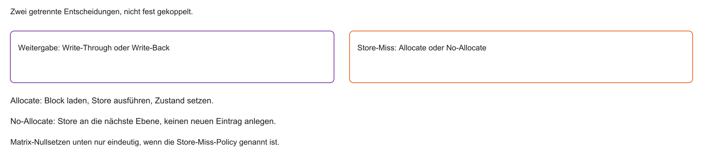

- Write-Allocate: fehlenden Block laden, dann den Store im Cache ausführen
- No-Write-Allocate: Store weitergeben und keinen neuen Cache-Eintrag anlegen
- Typische Paarungen sind Beispiele, keine zwingende Kopplung

::: notes
Mit Allocate entsteht nach dem Miss ein gültiger Eintrag. Ohne Allocate bleibt er draußen. Eine Dirty-Line darf verworfen werden, wenn Dirty = 0 oder der Wert bereits sichtbar geschrieben wurde.
:::

## Software optimieren

- Hardware bekannt: Cache Lines (räumlich) und LRU (zeitlich)
- Gute Nachricht: Caches müssen in C nicht manuell programmiert werden
- Schlechte Nachricht: gegen die Hardware zu programmieren kostet leicht Faktor 100
- Software-Engineering heute: C-Code für maximale Hits, minimale Misses

::: notes
Damit verlassen wir die Gatter-Ebene und setzen den Hut des C-Programmierers auf. Das wertvollste Wissen aus dieser Vorlesung für Ihren Berufsalltag: Schreiben Sie cache-freundlichen Code. Wenn Sie wissen, dass der Cache 64-Byte-Blöcke lädt, dürfen Sie niemals wild kreuz und quer durch den Speicher springen.
:::

## Labor-Szenario: 2D-Arrays

- Beispiel: Matrizen, Bilder, Tabellen
- Bild mit $1000 \times 1000$ Pixeln auf 0 setzen
- Variante A oder Variante B — mathematisch gleich, architektonisch nicht

```c
int bild[1000][1000];

// Variante A oder Variante B?
```

::: notes
Genau dieses Phänomen eignet sich gut für ein späteres Labor: Eine Matrix auf Null setzen — zeilenweise oder spaltenweise. Mathematisch identisch, architektonisch oft stark unterschiedlich in der Miss Rate.
:::

## 2D-Arrays im RAM — Row-Major Order

- RAM ist linear, kein 2D-Gitter
- C speichert zeilenweise (Row-Major Order)
- `[0][0]`, `[0][1]`, `[0][2]` liegen nebeneinander
- `[0][0]` und `[1][0]` liegen $1000$ Integers ($\approx 4000$ Bytes) auseinander

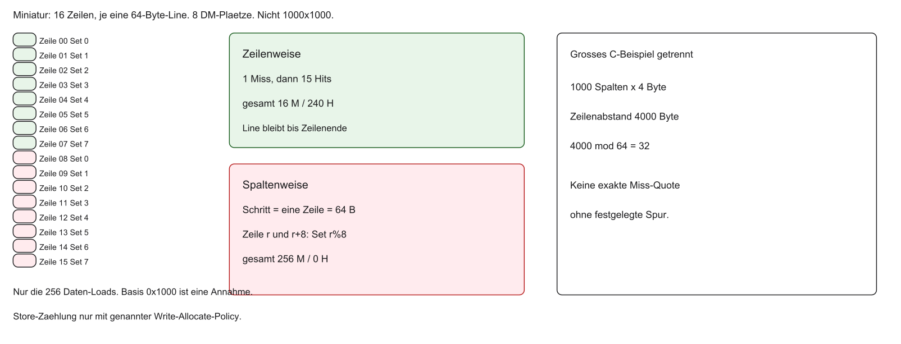

- C legt Zeilen hintereinander. Abstand `[0][0]` zu `[1][0]` bei 1000 Spalten und 4 Byte: 4000 Byte
- 4000 ist kein Vielfaches von 64; die erste Line einer Zeile beginnt nicht generell bei Spalte 0
- Die genannten Hit-/Miss-Zahlen gelten nur für das Miniaturmodell
- Stores der großen Matrix nur unter angenommener Write-Allocate-Policy; das sind nicht alle Zugriffe eines kompilierten Programms

::: notes
Adresse(m[r][c]) = 0x1000 + 4*(16*r+c). „Nahe 100 % Miss Rate“ beim großen Beispiel braucht Kapazität, Alignment, Policy und Working Set. Prefetch und der Compiler können das ändern.
:::

## Cache-Albtraum: spaltenweiser Zugriff

```c
// Column-Major Traversal — schlecht für den Cache
for (int col = 0; col < 1000; col++) {
    for (int row = 0; row < 1000; row++) {
        bild[row][col] = 0;
    }
}
```

Innere Schleife erhöht `row`: Zugriff `[0][0]`, `[1][0]`, `[2][0]`, …

::: notes
Schauen Sie sich diesen Code an. Die innere Schleife erhöht row. Das heißt, wir gehen spaltenweise nach unten. Mathematisch ist die Matrix am Ende genullt. Aber schauen wir uns an, was der Cache dabei durchmacht.
:::

## Was passiert beim spaltenweisen Zugriff?

- Im Miniaturmodell ist jeder Spaltenzugriff ein Miss
- Beim 1000×1000-Beispiel ist „nahe 100 %“ nur unter den genannten Annahmen eine Orientierung
- Die mitgeladenen Nachbarn einer Zeile werden bei Spaltentraversal nicht als Nächstes genutzt

::: notes
Das Nullsetzen ist eine Store-Folge. Unter Write-Allocate zählt jeder erste Bezug einer Line als Miss. Writebacks kämen zusätzlich, wenn verdrängte Lines dirty sind.
:::

## Cache-Traum: zeilenweiser Zugriff

Nur die Schleifen vertauschen:

```c
// Row-Major Traversal — cache-freundlich
for (int row = 0; row < 1000; row++) {
    for (int col = 0; col < 1000; col++) {
        bild[row][col] = 0;
    }
}
```

- Unter Write-Allocate und gültig bleibender Line folgen auf den ersten Store einer Line weitere Hits
- Der Compiler kann Schleifen entfernen, vertauschen oder in Bibliotheksaufrufe umwandeln
- Ein Geschwindigkeitsfaktor ist damit nicht allgemein festgelegt

::: notes
Die innere Schleife läuft bei Row-Major über benachbarte Spalten. Das Miniaturmodell quantifiziert das; das große Bild bleibt qualitativ, weil 4000 nicht durch 64 teilbar ist.
:::

## Ausblick: Visualisierung im Labor

- Ripes kann Hit-, Miss- und Writeback-Zähler einer Zugriffsspur zeigen
- Der Cache-Simulator modelliert laut Dokumentation keine Cache-Latenzen und damit keine CPU-Laufzeit
- Die Memory-Ansicht zeigt auch im Write-Back-Modus die geschriebenen Werte; sie beweist keinen veralteten DRAM-Inhalt
- Für die Zählung eignet sich das Single-Cycle-Modell; Pipeline-Stalls können zusätzliche Zugriffe zählen
- Vergleiche nur bei gleicher Kapazität, Line-Größe, Startzustand und Spur. Ein Exponent in der UI ist keine Anzahl

::: notes
Simulatorstatistik, aus AMAT gerechnete Modellwerte und gemessene Laufzeit sind drei verschiedene Dinge. Es gibt hier keine Labor-Screenshots. Die konkrete Ripes-Version und ihre Optionen müssen im Übungsblatt geprüft werden.
:::

## Zusammenfassung Block 2

- Memory Wall erzwingt Speicherhierarchie
- Caches basieren auf Lokalität (zeitlich und räumlich)
- AMAT = Hit Time + Miss Rate $\times$ Miss Penalty
- Direct Mapped: schnell, aber Thrashing-anfällig
- Set-Associative: Kollisionen innerhalb eines Sets entschärfen
- Write-Through und Write-Back bestimmen die Weitergabe geänderter Cache-Daten
- Store-Miss: Write-Allocate oder No-Write-Allocate, unabhängig davon
- Row-Major nutzt Lines; das Miniaturmodell macht die Zählung explizit

::: notes
Wir haben damit begründet, warum CPUs trotz relativ langsamem Hauptspeicher leistungsfähig bleiben: Der Cache nutzt Lokalität aus. Im nächsten Block folgen Interrupts und System-Timer. Vielen Dank — und viel Erfolg beim Üben der Konzepte.
:::

