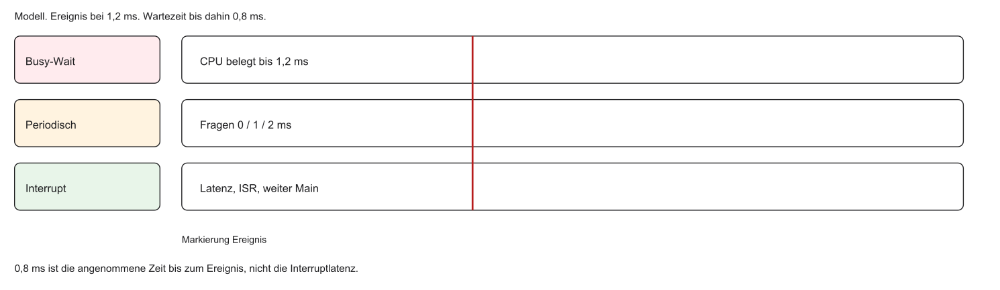
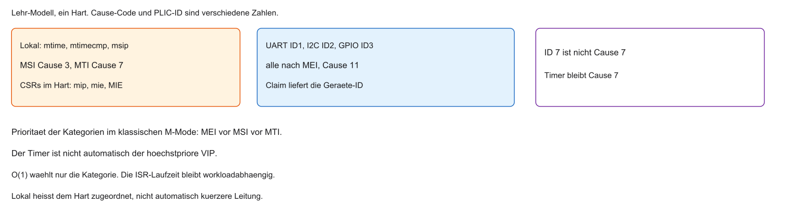
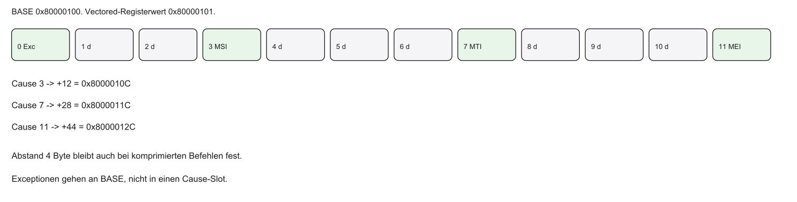
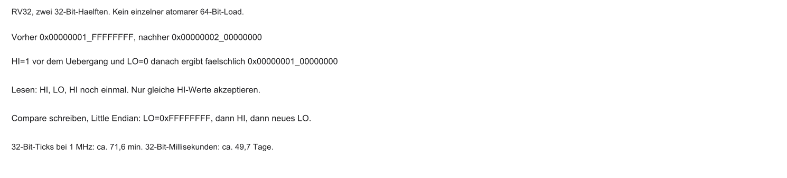
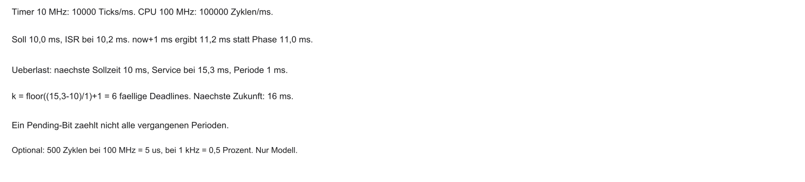
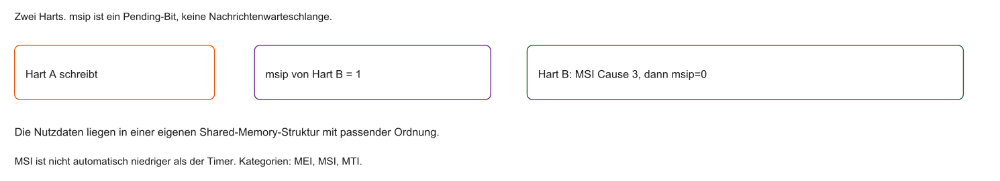
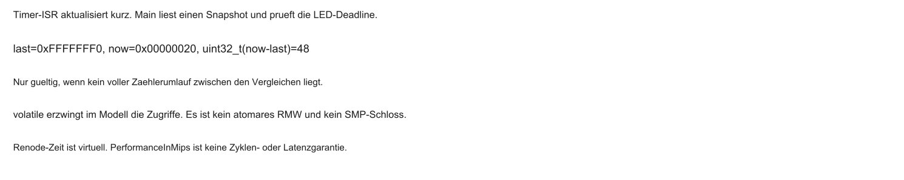

## Willkommen zu Block 3!

- Willkommen zur dritten Vorlesung in Mikrocomputertechnik 3
- Rückblick Block 1 und 2: Speicherphysik und Caches
- Bisher: Daten möglichst schnell zur CPU bringen
- Heute: Zeit und asynchrone Ereignisse
- Ein System-Timer ist oft eine Zeitquelle, aber kein Pflicht-Tick jedes Betriebssystems

::: notes
Willkommen zu Block 3 setzt die bisherige Frage nach Ereignis, Zeit und Ursache fort. CPU heißt Central Processing Unit, SoC System on Chip, OS Operating System. Speicherphysik und Caches beschleunigen Datenzugriffe, entscheiden aber nicht, wann ein Sensor beachtet wird. Asynchron heißt unabhängig vom gerade laufenden Befehl, zeitbezogen heißt mit Frist oder Zeitpunkt. Ein System-Timer ist häufig eine Zeitquelle, aber kein Beweis für einen obligatorischen periodischen Tick. Willkommen zur dritten Vorlesung in Mikrocomputertechnik 3. Rückblick Block 1 und 2: Speicherphysik und Caches. Bisher: Daten möglichst schnell zur CPU bringen. Heute: Zeit und asynchrone Ereignisse. Verständnischeck: Kann ein schneller Prozessor ein Ereignis übersehen? Ja, wenn Software oder Hardware es nicht erkennt oder speichert. Die nächste Folie nimmt die noch offene Unterscheidung auf. Zahlen und Adressen dieses Blocks sind das synthetische RV32-M-Mode-Modell, keine Messung und kein Datenblatt. Steht Code auf der Folie, ist er Lehrcode und wurde nicht kompiliert, assembliert oder ausgeführt.
:::

## Einordnung im Semester

```{mermaid}
%%| fig-width: 4.2
%%{init: {'theme': 'base', 'themeVariables': {'background': '#FFFFFF', 'primaryColor': '#FFFFFF', 'primaryBorderColor': '#E5E5EA', 'primaryTextColor': '#1D1D1F', 'lineColor': '#86868B', 'secondaryColor': '#F5F5F7', 'tertiaryColor': '#FFFFFF', 'mainBkg': '#FFFFFF', 'nodeBorder': '#E5E5EA', 'clusterBkg': '#F5F5F7', 'clusterBorder': '#E5E5EA', 'titleColor': '#1D1D1F', 'edgeLabelBackground': '#FFFFFF'}}}%%
flowchart LR
  A[Block 1 und 2: Speicher] --> B[Block 3: Zeit und Ereignisse]
  B --> C[Block 4: Aktorik]
  style B fill:#FFFFFF,stroke:#E2001A,stroke-width:2px !important
```

::: notes
Einordnung im Semester setzt die bisherige Frage nach Ereignis, Zeit und Ursache fort. Echtzeit meint die Einhaltung geforderter Reaktionszeiten, nicht bloß eine hohe Taktfrequenz. Speicher ist die Datenbasis, dieser Block die Ereignis- und Zeitbasis, der spätere Atomikblock die Grundlage korrekter geteilter Zugriffe. Eine ISR, die Interrupt Service Routine, und das Hauptprogramm können dieselbe Variable zu verschiedenen Zeiten benutzen. Verständnischeck: Welche neue Schwierigkeit bringt eine ISR? Hauptprogramm und ISR teilen sich Zustand. Die nächste Folie nimmt die noch offene Unterscheidung auf. Zahlen und Adressen dieses Blocks sind das synthetische RV32-M-Mode-Modell, keine Messung und kein Datenblatt. Steht Code auf der Folie, ist er Lehrcode und wurde nicht kompiliert, assembliert oder ausgeführt.
:::

## Anknüpfung: Cache und Lokalität

Kurz-Recap aus Block 2 (Labor folgt mit dem Übungsblatt):

- Spaltenweiser Zugriff kann den Cache durch schlechte Lokalität belasten
- Zeilenweiser Zugriff kann räumliche Lokalität verbessern; die Hit Rate hängt vom Modell ab
- Software und Hardware sind untrennbar verbunden

```c
/* Lehrcode — nicht kompiliert. Großer Ausschnitt, kein Stack-Rezept. */
for (int row = 0; row < 1000; row++) {
    for (int col = 0; col < 1000; col++) {
        bild[row][col] = 0; /* Store, keine reine Load-Spur */
    }
}
```

::: notes
Anknüpfung: Cache und Lokalität setzt die bisherige Frage nach Ereignis, Zeit und Ursache fort. Hit Rate zählt Treffer einer betrachteten Zugriffsspur. In C liegen die Elemente einer Zeile hintereinander, Row-Major. Die innere col-Schleife kann räumliche Lokalität verbessern. Compiler, Schreibstrategie und Datengröße ändern das Ergebnis. Stores sind keine reine Load-Spur. Ripes ist ein geplantes Labor, keine vorliegende Messung. Der Ausschnitt ist Lehrcode. Spaltenweiser Zugriff kann den Cache durch schlechte Lokalität belasten. Zeilenweiser Zugriff kann räumliche Lokalität verbessern; die Hit Rate hängt vom Modell ab. Software und Hardware sind untrennbar verbunden. Verständnischeck: Warum ist bild[row][col+1] räumlich nah? Die Zeilenelemente folgen aufeinander. Die nächste Folie nimmt die noch offene Unterscheidung auf. Zahlen und Adressen dieses Blocks sind das synthetische RV32-M-Mode-Modell, keine Messung und kein Datenblatt. Steht Code auf der Folie, ist er Lehrcode und wurde nicht kompiliert, assembliert oder ausgeführt.
:::

## Von Daten zu Ereignissen

- 3 GHz ist eine illustrative CPU-Frequenz, nicht der Kurs-MCU-Takt
- Die Außenwelt (Taster, Sensoren) ist vergleichsweise langsam
- Eine enge Warteschleife verbraucht Ausführungszeit; die Energie hängt vom Betriebszustand ab
- Ziel: nützliche Arbeit, während auf Peripherie gewartet wird
- Ausweg: asynchrone, ereignisgesteuerte Systeme

::: notes
Von Daten zu Ereignissen setzt die bisherige Frage nach Ereignis, Zeit und Ursache fort. 3 GHz ist eine illustrative CPU-Frequenz, nicht der Takt der Kurs-MCU. Gigahertz bedeutet eine Milliarde Takte je Sekunde. Eine enge Abfrageschleife verbraucht Ausführungszeit. Ob dabei Energie gespart wird, hängt von Takt, Last und Idle-Zustand ab. Ein Interrupt ermöglicht Zwischenarbeit oder Ruhe, garantiert sie aber nicht. 3 GHz ist eine illustrative CPU-Frequenz, nicht der Kurs-MCU-Takt. Die Außenwelt (Taster, Sensoren) ist vergleichsweise langsam. Eine enge Warteschleife verbraucht Ausführungszeit; die Energie hängt vom Betriebszustand ab. Ziel: nützliche Arbeit, während auf Peripherie gewartet wird. Verständnischeck: Muss die CPU zwischen Tastendrücken untätig sein? Nein, sie kann rechnen oder geeignet ruhen. Die nächste Folie nimmt die noch offene Unterscheidung auf. Zahlen und Adressen dieses Blocks sind das synthetische RV32-M-Mode-Modell, keine Messung und kein Datenblatt. Steht Code auf der Folie, ist er Lehrcode und wurde nicht kompiliert, assembliert oder ausgeführt.
:::

## CPU-Zeit sinnvoll nutzen

| Phase | Inhalt (schematisch) |
|-------|----------------------|
| Main | nützliche Arbeit |
| ISR | kurzes Event-Handling |
| Main | weiterrechnen |

*Interrupt unterbricht nur kurz — kein Dauer-Polling.*

::: notes
CPU-Zeit sinnvoll nutzen setzt die bisherige Frage nach Ereignis, Zeit und Ursache fort. Die Zeitachse zeigt Ereignis, Eintrittslatenz, kurze ISR und Wiederaufnahme. Kontext sind die Register und Daten, die zum Fortsetzen gebraucht werden. Im Ein-Hart-Modell laufen Main und ISR nacheinander, nicht auf zwei Prozessoren zugleich. Kurz ist ein Softwareziel. ISR-Aufwand verkürzt die übrige Arbeit. Verständnischeck: Was folgt nach der ISR? Der gesicherte Kontext wird hergestellt und die Ausführung geht weiter. Die nächste Folie nimmt die noch offene Unterscheidung auf. Zahlen und Adressen dieses Blocks sind das synthetische RV32-M-Mode-Modell, keine Messung und kein Datenblatt. Steht Code auf der Folie, ist er Lehrcode und wurde nicht kompiliert, assembliert oder ausgeführt.
:::

## Refresher MCT1: Polling vs. Interrupts

- Dauer-Polling (Busy Waiting) und gelegentliches Abfragen sind verschieden
- Interrupt: Ereignissignal, Freigabe, Handler, Rückkehr — keine gespeicherte Klingel für jede Flanke
- Hardware signalisiert Ereignis → CPU unterbricht die laufende Arbeit
- Danach Rückkehr in den unterbrochenen Kontext

::: notes
Refresher MCT1: Polling vs. Interrupts setzt die bisherige Frage nach Ereignis, Zeit und Ursache fort. Polling ist Abfragen. Busy Waiting ist eine blockierende Dauerschleife. Gelegentliches Abfragen zwischen anderer Arbeit ist ein anderer Fall. Die Klingelanalogie meint Signal, Freigabe, Handler und Rückkehr. Nicht jede elektrische Flanke wird automatisch gespeichert. Interrupts haben eigenen Aufwand und können bei hoher Rate ungünstig werden. Dauer-Polling (Busy Waiting) und gelegentliches Abfragen sind verschieden. Interrupt: Ereignissignal, Freigabe, Handler, Rückkehr — keine gespeicherte Klingel für jede Flanke. Hardware signalisiert Ereignis → CPU unterbricht die laufende Arbeit. Danach Rückkehr in den unterbrochenen Kontext. Verständnischeck: Wann ist gelegentliches Polling brauchbar? Wenn die Quelle lange genug sichtbar bleibt und die Abfragelatenz tolerierbar ist. Die nächste Folie nimmt die noch offene Unterscheidung auf. Zahlen und Adressen dieses Blocks sind das synthetische RV32-M-Mode-Modell, keine Messung und kein Datenblatt. Steht Code auf der Folie, ist er Lehrcode und wurde nicht kompiliert, assembliert oder ausgeführt.
:::

## Polling vs. Interrupt — Schema



::: notes
Polling vs. Interrupt — Schema setzt die bisherige Frage nach Ereignis, Zeit und Ursache fort. Drei Bahnen: Dauer-Polling, periodische Abfrage, Interrupt. 0,8 ms ist die angenommene Zeit bis zum Ereignis, nicht die Interruptlatenz. Eine periodische Abfrage kann ein kurzes, nicht gespeichertes Signal verpassen. Auch der Interrupt wartet auf Freigabe und Latenz. Ein Flag verschiebt Nutzarbeit in die Hauptschleife. Verständnischeck: Ist eine kurze ISR schon die Nutzarbeit? Nein, bei Deferred Handling kommt die Latenz der Hauptschleife hinzu. Die nächste Folie nimmt die noch offene Unterscheidung auf. Zahlen und Adressen dieses Blocks sind das synthetische RV32-M-Mode-Modell, keine Messung und kein Datenblatt. Steht Code auf der Folie, ist er Lehrcode und wurde nicht kompiliert, assembliert oder ausgeführt.
:::

## Refresher MCT1: Das CSR-System

- Control and Status Registers: spezielle Maschinenregister
- `mstatus`: globaler Interrupt-Schalter (u. a. MIE)
- `mcause`: Grund der Unterbrechung (Interrupt/Exception-Code)
- `mepc`: Rücksprungadresse des unterbrochenen Programms
- `mret`: Rückkehr anhand von `mepc`

```riscv
# Typische Aktion in einer ISR (Kontext lesen)
csrr t0, mcause    # Warum wurde ich geweckt?
csrr t1, mepc      # Wo muss ich später wieder hin?
```

::: notes
Refresher MCT1: Das CSR-System setzt die bisherige Frage nach Ereignis, Zeit und Ursache fort. CSR heißt Control and Status Register. MIE ist Machine Interrupt Enable, MPIE der gemerkte vorherige Zustand. mepc hält die Rücksprung- oder Fehleradresse, mcause die Ursache, mstatus den Status, mret die Trap-Rückkehr. csrr liest ein CSR. Hardware schreibt diesen Trapzustand, sichert aber nicht alle allgemeinen Register. Bei Exceptions gibt es kein pauschales mepc plus 4. Der gezeigte csrr-Ausschnitt ist isolierter Lehrcode. Control and Status Registers: spezielle Maschinenregister. `mstatus`: globaler Interrupt-Schalter (u. a. MIE). `mcause`: Grund der Unterbrechung (Interrupt/Exception-Code). `mepc`: Rücksprungadresse des unterbrochenen Programms. Verständnischeck: Worin unterscheidet sich mret von ret? mret nutzt Trap-CSRs, ret die normale Aufrufkonvention. Die nächste Folie nimmt die noch offene Unterscheidung auf. Zahlen und Adressen dieses Blocks sind das synthetische RV32-M-Mode-Modell, keine Messung und kein Datenblatt. Steht Code auf der Folie, ist er Lehrcode und wurde nicht kompiliert, assembliert oder ausgeführt.
:::

## Der rudimentäre MCT1-Trap-Handler


- In MCT1 oft ein einziger Einsprung über `mtvec`
- Alle Quellen landen an derselben Adresse
- Software muss per `mcause` verzweigen (`if`/`else`)
- Direct mit Claim und Tabelle skaliert; eine lineare Statussuche ist das langsame Verfahren

```c
uint32_t raw = read_csr(mcause);
int is_irq = (raw >> 31) & 1;          /* RV32: Interrupt-Bit */
uint32_t code = raw & 0x7fffffffu;     /* Cause-Code */
if (is_irq && code == 7) handle_timer();
else if (is_irq && code == 11) {
    uint32_t id = plic_claim();        /* UART=1, nicht Cause 7 */
    if (id == 1) handle_uart();
    if (id != 0) plic_complete(id);
}
```

::: notes
Der rudimentäre MCT1-Trap-Handler setzt die bisherige Frage nach Ereignis, Zeit und Ursache fort. RV32 meint hier 32-Bit-Integerregister. Bit 31 von mcause kennzeichnet einen Interrupt, die Maske 0x7fffffff isoliert den Cause. Cause 7 ist Machine Timer, Cause 11 Machine External. Die UART-ID 1, Universal Asynchronous Receiver/Transmitter, kommt erst vom PLIC-Claim. 0x8000000B ist Interrupt plus Cause 11, keine UART-ID. Hardware setzt mepc, mcause, MPIE und MIE. Software rettet Register. Hilfsfunktionen sind Lehrcode. In MCT1 oft ein einziger Einsprung über `mtvec`. Alle Quellen landen an derselben Adresse. Software muss per `mcause` verzweigen (`if`/`else`). Direct mit Claim und Tabelle skaliert; eine lineare Statussuche ist das langsame Verfahren. Verständnischeck: Ist 0x8000000B eine UART-ID? Nein, auf RV32 ist es Interrupt plus External Cause 11. Die nächste Folie nimmt die noch offene Unterscheidung auf. Zahlen und Adressen dieses Blocks sind das synthetische RV32-M-Mode-Modell, keine Messung und kein Datenblatt. Steht Code auf der Folie, ist er Lehrcode und wurde nicht kompiliert, assembliert oder ausgeführt.
:::

## Agenda für den heutigen Tag

1. Grenzen des einfachen Traps
2. Vektorisierte Interrupts (Vectored Mode)
3. RISC-V CLINT — lokale Timer und Software-Interrupts
4. RISC-V PLIC — Dirigent für externe Peripherie
5. Nested Interrupts
6. Brückenschlag zum Labor (System-Ticks, z. B. in Renode)

::: notes
Agenda für den heutigen Tag setzt die bisherige Frage nach Ereignis, Zeit und Ursache fort. CLINT heißt Core Local Interruptor, PLIC Platform-Level Interrupt Controller. Die Agenda trennt Kategorie, Termin, Gerät und Verschachtelung. Vectored Mode wählt den Kategorie-Einsprung, nicht jede Geräte-ID. Renode ist ein optionaler späterer Laborrahmen ohne vorliegenden Lauf. Verständnischeck: Warum Vectored Mode und PLIC getrennt? Der eine wählt die Kategorie, der andere identifiziert Geräte. Die nächste Folie nimmt die noch offene Unterscheidung auf. Zahlen und Adressen dieses Blocks sind das synthetische RV32-M-Mode-Modell, keine Messung und kein Datenblatt. Steht Code auf der Folie, ist er Lehrcode und wurde nicht kompiliert, assembliert oder ausgeführt.
:::

## Lernziele Block 3

- Grenzen linearer Statusabfragen bewerten; Direct plus Claim bleibt zulässig
- Vektor-Tabelle und Vectored Mode in RISC-V verstehen
- CLINT (lokal) und PLIC (global) unterscheiden
- Mathematik hinter dem 64-Bit-System-Timer (`mtime`) beherrschen
- Gefahren und Lösungen bei Nested Interrupts kennen

::: notes
Lernziele Block 3 setzt die bisherige Frage nach Ereignis, Zeit und Ursache fort. Lernziel ist, lineare Statusabfragen zu bewerten, nicht Direct pauschal abzulehnen. Pending, Freigabe und Trap sind verschieden, ebenso ISR-Zähler und vergangene Zeit. Für BASE 0x80000100 und Timer Cause 7 ist der Einsprung 0x8000011C. Nesting wird in Voraussetzungen erklärt, nicht als fertiger Prolog. Grenzen linearer Statusabfragen bewerten; Direct plus Claim bleibt zulässig. Vektor-Tabelle und Vectored Mode in RISC-V verstehen. CLINT (lokal) und PLIC (global) unterscheiden. Mathematik hinter dem 64-Bit-System-Timer (`mtime`) beherrschen. Verständnischeck: Prüfziel: BASE 0x80000100 und Cause 7 ergeben 0x8000011C, nicht eine Geräte-ID. Die nächste Folie nimmt die noch offene Unterscheidung auf. Zahlen und Adressen dieses Blocks sind das synthetische RV32-M-Mode-Modell, keine Messung und kein Datenblatt. Steht Code auf der Folie, ist er Lehrcode und wurde nicht kompiliert, assembliert oder ausgeführt.
:::

## Die Leitfrage des Tages

- Moderne MCUs: dutzende Peripheriegeräte können Interrupts auslösen
- Theoretisch sogar im selben Taktzyklus
- Wer darf zuerst? Was passiert mit den anderen?
- Leitfrage: Wie managt die CPU viele Alarme ohne Suchaufwand und ohne den Wichtigen zu verpassen?
- Antwort: spezialisierte Interrupt-Controller-Hardware

::: notes
Die Leitfrage des Tages setzt die bisherige Frage nach Ereignis, Zeit und Ursache fort. MCU heißt Microcontroller Unit. UART-Daten und ein fälliger Timer können zugleich bereitstehen. Auswahl, Freigabe, blockierende ISR und die Speichertiefe der Quelle bestimmen, was ankommt. Ein Pending-Bit kennt nur wartend oder nicht. Hohe PLIC-Priorität ist nicht automatisch die höchste CPU-Kategorie. Moderne MCUs: dutzende Peripheriegeräte können Interrupts auslösen. Theoretisch sogar im selben Taktzyklus. Wer darf zuerst? Was passiert mit den anderen?. Leitfrage: Wie managt die CPU viele Alarme ohne Suchaufwand und ohne den Wichtigen zu verpassen?. Verständnischeck: Bleiben zehn Ereignisse in einem Bit einzeln erhalten? Nein, das Bit hat nur zwei Zustände. Die nächste Folie nimmt die noch offene Unterscheidung auf. Zahlen und Adressen dieses Blocks sind das synthetische RV32-M-Mode-Modell, keine Messung und kein Datenblatt. Steht Code auf der Folie, ist er Lehrcode und wurde nicht kompiliert, assembliert oder ausgeführt.
:::

## Viele Quellen — ein Problem



```{mermaid}
%%| fig-width: 4.0
%%{init: {'theme': 'base', 'themeVariables': {'background': '#FFFFFF', 'primaryColor': '#FFFFFF', 'primaryBorderColor': '#E5E5EA', 'primaryTextColor': '#1D1D1F', 'lineColor': '#86868B', 'secondaryColor': '#F5F5F7', 'tertiaryColor': '#FFFFFF', 'mainBkg': '#FFFFFF', 'nodeBorder': '#E5E5EA', 'clusterBkg': '#F5F5F7', 'clusterBorder': '#E5E5EA', 'titleColor': '#1D1D1F', 'edgeLabelBackground': '#FFFFFF'}}}%%
flowchart LR
  A[Timer] --> CPU[CPU]
  B[UART Rx] --> CPU
  C[Not-Aus] --> CPU
  D[Sensoren] --> CPU
  style C fill:#FFFFFF,stroke:#E2001A,stroke-width:2px !important
```

::: notes
Viele Quellen — ein Problem setzt die bisherige Frage nach Ereignis, Zeit und Ursache fort. MSI, MTI und MEI sind Machine Software, Timer und External Interrupt, Causes 3, 7 und 11. Timer und Software gehen im Modell direkt an den Hart. UART und Sensor gehen über den PLIC nach Cause 11. Geräte-IDs und Causes sind verschiedene Namensräume. Ein Not-Aus ist hier nur ein Beispiel, keine Sicherheitsarchitektur. Verständnischeck: Warum können zwei UART-Geräte denselben mcause haben? Sie teilen den External-Pfad, Claim unterscheidet sie. Die nächste Folie nimmt die noch offene Unterscheidung auf. Zahlen und Adressen dieses Blocks sind das synthetische RV32-M-Mode-Modell, keine Messung und kein Datenblatt. Steht Code auf der Folie, ist er Lehrcode und wurde nicht kompiliert, assembliert oder ausgeführt.
:::

## Das Skalierungsproblem

- MCT1: wenige Quellen (z. B. Taster, ein Timer)
- Echte SoCs: dutzende Interrupt-Quellen
- RISC-V-Kern: nur wenige feste Interrupt-Leitungen (u. a. Timer, Software, External)
- Folge: viele Geräte teilen sich typischerweise den External-Interrupt-Pfad

::: notes
Das Skalierungsproblem setzt die bisherige Frage nach Ereignis, Zeit und Ursache fort. Das klassische CLINT/PLIC-Modell bündelt viele Geräte auf wenige Kategorien. Das ist kein Pinplan jedes RISC-V-Kerns. Viele Geräte erzwingen nicht schon eine lineare Statussuche. MCT1: wenige Quellen (z. B. Taster, ein Timer). Echte SoCs: dutzende Interrupt-Quellen. RISC-V-Kern: nur wenige feste Interrupt-Leitungen (u. a. Timer, Software, External). Folge: viele Geräte teilen sich typischerweise den External-Interrupt-Pfad. Verständnischeck: Was fehlt nach Cause 11? Die Quellen-ID aus dem PLIC-Claim. Die nächste Folie nimmt die noch offene Unterscheidung auf. Zahlen und Adressen dieses Blocks sind das synthetische RV32-M-Mode-Modell, keine Messung und kein Datenblatt. Steht Code auf der Folie, ist er Lehrcode und wurde nicht kompiliert, assembliert oder ausgeführt.
:::

## Der Software-Flaschenhals

- Alle teilen sich „External“ → `mcause` sagt oft nur die Kategorie
- Software muss Quellen abfragen: „Warst du das?“
- Lange `if`/`else`-Ketten kosten viele Takte

```c
// Problematisch für Echtzeit
void isr(void) {
    if (check(SPI)) handle_spi();
    else if (check(I2C)) handle_i2c();
    /* ... viele weitere Abfragen ... */
}
```

::: notes
Der Software-Flaschenhals setzt die bisherige Frage nach Ereignis, Zeit und Ursache fort. SPI ist Serial Peripheral Interface, I2C Inter-Integrated Circuit. Der gezeigte if/else-Lehrcode behandelt nur die erste wahre Bedingung. Die Reihenfolge ist eine Softwareauswahl. Langsam ist diese Suche, nicht jede gemeinsame Trapadresse. Alle teilen sich „External“ → `mcause` sagt oft nur die Kategorie. Software muss Quellen abfragen: „Warst du das?“. Lange `if`/`else`-Ketten kosten viele Takte. Verständnischeck: SPI und I2C beide bereit: Der gezeigte Eintritt bedient SPI. I2C braucht einen weiteren Weg. Die nächste Folie nimmt die noch offene Unterscheidung auf. Zahlen und Adressen dieses Blocks sind das synthetische RV32-M-Mode-Modell, keine Messung und kein Datenblatt. Steht Code auf der Folie, ist er Lehrcode und wurde nicht kompiliert, assembliert oder ausgeführt.
:::

## Latenz-Explosion

- Latenz: Zeit vom Signal bis zur nützlichen ISR
- Best Case: Quelle steht oben in der Kette
- Worst Case: viele falsche Abfragen zuvor
- $\mathcal{O}(n)$ beschreibt die Skalierung der gezeigten Suche, keine Nanosekunden und kein ABS-Nachweis

::: notes
Latenz-Explosion setzt die bisherige Frage nach Ereignis, Zeit und Ursache fort. O(n) beschreibt, wie die Suchzeit mit der Zahl der Prüfungen wächst, nicht eine Nanosekunde. Harte Echtzeit braucht eine obere Schranke des ganzen Wegs: Maskierung, Trap, Rettung, Suche, Service. WCET heißt Worst-Case Execution Time, falls als Schranke gemeint. ABS ist Motivation, kein Beleg einer realen Architektur. Acht Abfragen zu 2 µs sind 16 µs Scanzeit und nur ein Teilbudget. Latenz: Zeit vom Signal bis zur nützlichen ISR. Best Case: Quelle steht oben in der Kette. Worst Case: viele falsche Abfragen zuvor. $\mathcal{O}(n)$ beschreibt die Skalierung der gezeigten Suche, keine Nanosekunden und kein ABS-Nachweis. Verständnischeck: Kann 16 µs Scan in eine 100-µs-Frist passen? Als Teilbudget ja, als vollständiger Nachweis nein. Die nächste Folie nimmt die noch offene Unterscheidung auf. Zahlen und Adressen dieses Blocks sind das synthetische RV32-M-Mode-Modell, keine Messung und kein Datenblatt. Steht Code auf der Folie, ist er Lehrcode und wurde nicht kompiliert, assembliert oder ausgeführt.
:::

## Das Prioritäten-Problem

- Gleichzeitige Events: wer gewinnt?
- Reine Software-Kette: Priorität oft „wer steht oben im Code“
- Schwer zur Laufzeit flexibel umzupriorisieren
- Wunsch: Hardware entscheidet den Gewinner automatisch

::: notes
Das Prioritäten-Problem setzt die bisherige Frage nach Ereignis, Zeit und Ursache fort. Code-Reihenfolge, PLIC-Priorität und CPU-Kategorie sind drei Auswahlstufen. Eine if/else-Kette wählt lokal. Hardware-Arbitration kann ohne alle Statusreads wählen. Hohe Priorität unterbricht bei MIE gleich 0 keine laufende ISR. Gleichzeitige Events: wer gewinnt?. Reine Software-Kette: Priorität oft „wer steht oben im Code“. Schwer zur Laufzeit flexibel umzupriorisieren. Wunsch: Hardware entscheidet den Gewinner automatisch. Verständnischeck: Kann hohe PLIC-Priorität bei MIE gleich 0 unterbrechen? Nein, Freigabe und Politik fehlen. Die nächste Folie nimmt die noch offene Unterscheidung auf. Zahlen und Adressen dieses Blocks sind das synthetische RV32-M-Mode-Modell, keine Messung und kein Datenblatt. Steht Code auf der Folie, ist er Lehrcode und wurde nicht kompiliert, assembliert oder ausgeführt.
:::

## Die RISC-V-Architektur-Lösung

- Arbeitsteilung: CPU rechnet, Controller managen Alarme
- Externe Module sammeln, priorisieren und melden den Gewinner
- Direkter Kategorie-Einsprung oder Claim plus Tabelle; der PLIC springt nicht selbst in jede Gerätefunktion
- Trennung: lokale vs. globale Ereignisse

::: notes
Die RISC-V-Architektur-Lösung setzt die bisherige Frage nach Ereignis, Zeit und Ursache fort. Der Controller verwaltet Pending und Prioritäten, der Kern den Trap, die Software Kontext und Gerätebedienung. Der PLIC springt nicht in jede Gerätefunktion. Nach Cause 11 folgen Claim und Handlerwahl. Arbeitsteilung: CPU rechnet, Controller managen Alarme. Externe Module sammeln, priorisieren und melden den Gewinner. Direkter Kategorie-Einsprung oder Claim plus Tabelle; der PLIC springt nicht selbst in jede Gerätefunktion. Trennung: lokale vs. globale Ereignisse. Verständnischeck: Wer wählt den UART-Handler? Die Software nach der Claim-ID. Die nächste Folie nimmt die noch offene Unterscheidung auf. Zahlen und Adressen dieses Blocks sind das synthetische RV32-M-Mode-Modell, keine Messung und kein Datenblatt. Steht Code auf der Folie, ist er Lehrcode und wurde nicht kompiliert, assembliert oder ausgeführt.
:::

## Interrupt-Controller vor der CPU

```{mermaid}
%%| fig-width: 4.2
%%{init: {'theme': 'base', 'themeVariables': {'background': '#FFFFFF', 'primaryColor': '#FFFFFF', 'primaryBorderColor': '#E5E5EA', 'primaryTextColor': '#1D1D1F', 'lineColor': '#86868B', 'secondaryColor': '#F5F5F7', 'tertiaryColor': '#FFFFFF', 'mainBkg': '#FFFFFF', 'nodeBorder': '#E5E5EA', 'clusterBkg': '#F5F5F7', 'clusterBorder': '#E5E5EA', 'titleColor': '#1D1D1F', 'edgeLabelBackground': '#FFFFFF'}}}%%
flowchart LR
  A[Sensoren] -->|Sammeln und Sortieren| B[Interrupt-Controller]
  B -->|Wichtigster gewinnt| CPU[CPU]
  style B fill:#FFFFFF,stroke:#E2001A,stroke-width:2px !important
```

::: notes
Interrupt-Controller vor der CPU setzt die bisherige Frage nach Ereignis, Zeit und Ursache fort. IRQ, falls als Label genutzt, heißt Interrupt Request. Die Benachrichtigung ist kein Paket mit UART-ID. Sensoren gehen zum Controller, die CPU sieht die Kategorie und claimt per MMIO. Es gibt keinen Latenzwert ohne Plattformmodell. Verständnischeck: Kennt die CPU das Gerät sofort nach der Notification? Im klassischen PLIC erst nach Claim. Die nächste Folie nimmt die noch offene Unterscheidung auf. Zahlen und Adressen dieses Blocks sind das synthetische RV32-M-Mode-Modell, keine Messung und kein Datenblatt. Steht Code auf der Folie, ist er Lehrcode und wurde nicht kompiliert, assembliert oder ausgeführt.
:::

## Lokale vs. globale Interrupts

Lokale Interrupts (core-nah):

- Beispiele: System-Timer, Software-Interrupts
- Eigene Leitungen in den RISC-V-Kern
- Eigener Kategoriepfad, ohne Garantie kürzerer Leitung oder höchster Priorität

Globale Interrupts (Peripherie):

- UART, SPI, Taster, …
- Über den External-Interrupt-Pfad gebündelt

::: notes
Lokale vs. globale Interrupts setzt die bisherige Frage nach Ereignis, Zeit und Ursache fort. Lokal meint im Modell den hartbezogenen Software- und Timerpfad. mtime kann außerhalb des Kerns liegen. MMIO, Memory-Mapped Input/Output, kann Buskosten haben. Global heißt Zustellung an einen Hartkontext, nicht geringere Wichtigkeit. Im klassischen M-Mode gilt MEI vor MSI vor MTI. Beispiele: System-Timer, Software-Interrupts. Eigene Leitungen in den RISC-V-Kern. Eigener Kategoriepfad, ohne Garantie kürzerer Leitung oder höchster Priorität. UART, SPI, Taster, …. Verständnischeck: Ist lokal gleich höchste Priorität? Nein, External steht vor Software vor Timer. Die nächste Folie nimmt die noch offene Unterscheidung auf. Zahlen und Adressen dieses Blocks sind das synthetische RV32-M-Mode-Modell, keine Messung und kein Datenblatt. Steht Code auf der Folie, ist er Lehrcode und wurde nicht kompiliert, assembliert oder ausgeführt.
:::

## Die zwei Giganten: CLINT und PLIC

- CLINT (Core Local Interruptor): lokale Timer- und Software-Interrupts
- PLIC (Platform-Level Interrupt Controller): Dirigent für externe Geräte
- PLIC → External Interrupt an die CPU

::: notes
Die zwei Giganten: CLINT und PLIC setzt die bisherige Frage nach Ereignis, Zeit und Ursache fort. CLINT liefert Timer- und Softwarezustand, PLIC die externen Quellen. Beides ist ein verbreitetes Beispiel, keine universelle Chipintegration. Geräteprioritäten gehören nicht zum CLINT. CLINT (Core Local Interruptor): lokale Timer- und Software-Interrupts. PLIC (Platform-Level Interrupt Controller): Dirigent für externe Geräte. PLIC → External Interrupt an die CPU. Verständnischeck: Wer liefert die UART-ID? Der PLIC. Wer setzt den Timerzustand? Die Timerlogik des CLINT-Modells. Die nächste Folie nimmt die noch offene Unterscheidung auf. Zahlen und Adressen dieses Blocks sind das synthetische RV32-M-Mode-Modell, keine Messung und kein Datenblatt. Steht Code auf der Folie, ist er Lehrcode und wurde nicht kompiliert, assembliert oder ausgeführt.
:::

## CLINT und PLIC — Schema

```{mermaid}
%%| fig-width: 4.2
%%{init: {'theme': 'base', 'themeVariables': {'background': '#FFFFFF', 'primaryColor': '#FFFFFF', 'primaryBorderColor': '#E5E5EA', 'primaryTextColor': '#1D1D1F', 'lineColor': '#86868B', 'secondaryColor': '#F5F5F7', 'tertiaryColor': '#FFFFFF', 'mainBkg': '#FFFFFF', 'nodeBorder': '#E5E5EA', 'clusterBkg': '#F5F5F7', 'clusterBorder': '#E5E5EA', 'titleColor': '#1D1D1F', 'edgeLabelBackground': '#FFFFFF'}}}%%
flowchart LR
  T[Timer] --> CLINT
  SW[Software] --> CLINT
  CLINT -->|lokal| CPU[CPU]
  U[UART] --> PLIC
  S[SPI] --> PLIC
  PLIC -->|External| CPU
  style CLINT fill:#FFFFFF,stroke:#E2001A,stroke-width:2px !important
  style PLIC fill:#FFFFFF,stroke:#E2001A,stroke-width:2px !important
```

::: notes
CLINT und PLIC — Schema setzt die bisherige Frage nach Ereignis, Zeit und Ursache fort. Die Leitungen tragen Cause 7, 3 und 11. Durchgezogene Pfeile sind Interruptsignale, gestrichelte wären MMIO-Zugriffe der Software. Ein Signal meldet Zustand, ein Zugriff liest oder schreibt Register. Vectored Mode löst damit nicht die Gerätesuche. Verständnischeck: Warum unterscheiden sich die Pfeile? Signal und Registerzugriff haben verschiedene Richtung und Bedeutung. Die nächste Folie nimmt die noch offene Unterscheidung auf. Zahlen und Adressen dieses Blocks sind das synthetische RV32-M-Mode-Modell, keine Messung und kein Datenblatt. Steht Code auf der Folie, ist er Lehrcode und wurde nicht kompiliert, assembliert oder ausgeführt.
:::

## Fragen? — Motivation

- Skalierungsproblem klar?
- Warum sind lineare `if`/`else`-Ketten in ISRs riskant für Echtzeit?
- Lokal vs. global?

::: notes
Fragen? — Motivation setzt die bisherige Frage nach Ereignis, Zeit und Ursache fort. Eine lineare Gerätestatussuche macht die Zeit von der Codeposition abhängig. Ein Direct-Handler mit Claim ist eine andere Lösung. Lokal und global sind Pfade, keine Kritikalitätsordnung. UART-ID 7 und Timer Cause 7 sind verschiedene Schnittstellen. Skalierungsproblem klar?. Warum sind lineare `if`/`else`-Ketten in ISRs riskant für Echtzeit?. Lokal vs. global?. Verständnischeck: Sind UART-ID 7 und Timer Cause 7 dasselbe? Nein, gleiche Zahl, anderer Namensraum. Die nächste Folie nimmt die noch offene Unterscheidung auf. Zahlen und Adressen dieses Blocks sind das synthetische RV32-M-Mode-Modell, keine Messung und kein Datenblatt. Steht Code auf der Folie, ist er Lehrcode und wurde nicht kompiliert, assembliert oder ausgeführt.
:::

## Das Register `mtvec` im Detail

- `mtvec`: Basisadresse der Trap-/Interrupt-Behandlung
- In MCT1 oft vereinfacht als reine Handler-Adresse gesetzt
- Unterste 2 Bits sind MODE — keine Adressbits
- Obere Bits: BASE-Adresse

| Bits 31:2 | Bits 1:0 |
|-----------|----------|
| BASE | MODE |

::: notes
Das Register `mtvec` im Detail setzt die bisherige Frage nach Ereignis, Zeit und Ursache fort. mtvec ist die Machine Trap-Vector Base-Address, der PC der Program Counter. Im RV32-Beispiel stehen in den Bits 31:2 die oberen Basisbits, die unteren zwei Adressbits sind null. Bits 1:0 sind MODE. Der Wert 0x80000101 hat BASE 0x80000100 und MODE 1. BASE ist nicht der Registerwert inklusive Mode. `mtvec`: Basisadresse der Trap-/Interrupt-Behandlung. In MCT1 oft vereinfacht als reine Handler-Adresse gesetzt. Unterste 2 Bits sind MODE — keine Adressbits. Obere Bits: BASE-Adresse. Verständnischeck: mtvec gleich 0x80000101: BASE ist 0x80000100, MODE ist 1. Die Ziele werden von der BASE aus gerechnet. Die nächste Folie nimmt die noch offene Unterscheidung auf. Zahlen und Adressen dieses Blocks sind das synthetische RV32-M-Mode-Modell, keine Messung und kein Datenblatt. Steht Code auf der Folie, ist er Lehrcode und wurde nicht kompiliert, assembliert oder ausgeführt.
:::

## Das MODE-Feld in `mtvec`

- MODE = 0 (Direct): alle Traps zur Adresse BASE (MCT1-Verhalten)
- MODE = 1 (Vectored): Interrupts springen versetzt; Exceptions weiter zu BASE
- MODE 2 und 3: im Standard reserviert

::: notes
Das MODE-Feld in `mtvec` setzt die bisherige Frage nach Ereignis, Zeit und Ursache fort. Direct ist MODE 0, Vectored MODE 1. Reservierte Werte 2 und 3 sind kein freier Extra-Modus. Eine Implementierung kann Vectored oder das Alignment einschränken. Vectored wählt Kategorien, nicht eine PLIC-ID. Eine synchrone Exception geht auch in MODE 1 an die BASE. MODE = 0 (Direct): alle Traps zur Adresse BASE (MCT1-Verhalten). MODE = 1 (Vectored): Interrupts springen versetzt; Exceptions weiter zu BASE. MODE 2 und 3: im Standard reserviert. Verständnischeck: Wohin geht eine Exception in Mode 1? An die BASE, unabhängig vom Exception-Code. Die nächste Folie nimmt die noch offene Unterscheidung auf. Zahlen und Adressen dieses Blocks sind das synthetische RV32-M-Mode-Modell, keine Messung und kein Datenblatt. Steht Code auf der Folie, ist er Lehrcode und wurde nicht kompiliert, assembliert oder ausgeführt.
:::

## Direct Mode (MODE = 0)

- Hardware setzt PC = BASE
- Alle Quellen landen an derselben Stelle
- Software liest `mcause` und verzweigt

::: notes
Direct Mode (MODE = 0) setzt die bisherige Frage nach Ereignis, Zeit und Ursache fort. Im Direct Mode setzt der Kern bei einem angenommenen Trap die CSRs und den PC auf die BASE. Software wertet mcause aus. Direct sagt nichts über if/else. Claim plus Tabelle ist ein schneller Direct-Dispatch. Hardware setzt PC = BASE. Alle Quellen landen an derselben Stelle. Software liest `mcause` und verzweigt. Verständnischeck: Kann Direct Geräte schnell wählen? Ja, mit Claim und indexierter Tabelle. Die nächste Folie nimmt die noch offene Unterscheidung auf. Zahlen und Adressen dieses Blocks sind das synthetische RV32-M-Mode-Modell, keine Messung und kein Datenblatt. Steht Code auf der Folie, ist er Lehrcode und wurde nicht kompiliert, assembliert oder ausgeführt.
:::

## Direct Mode — Schema

```{mermaid}
%%| fig-width: 4.0
%%{init: {'theme': 'base', 'themeVariables': {'background': '#FFFFFF', 'primaryColor': '#FFFFFF', 'primaryBorderColor': '#E5E5EA', 'primaryTextColor': '#1D1D1F', 'lineColor': '#86868B', 'secondaryColor': '#F5F5F7', 'tertiaryColor': '#FFFFFF', 'mainBkg': '#FFFFFF', 'nodeBorder': '#E5E5EA', 'clusterBkg': '#F5F5F7', 'clusterBorder': '#E5E5EA', 'titleColor': '#1D1D1F', 'edgeLabelBackground': '#FFFFFF'}}}%%
flowchart LR
  A[Timer] --> B["PC = BASE"]
  C[UART] --> B
  D[Exception] --> B
  B --> E[Software: if/else]
  style B fill:#FFFFFF,stroke:#E2001A,stroke-width:2px !important
```

::: notes
Direct Mode — Schema setzt die bisherige Frage nach Ereignis, Zeit und Ursache fort. Timer, External und Exception treffen dieselbe BASE. Danach wertet Software mcause aus. External braucht zusätzlich Claim. Ein gemeinsamer Eintritt heißt nicht, alle Gerätestatusregister zu lesen. Verständnischeck: Was reicht für den Timerpfad? Interruptbit und Cause 7. External braucht danach die ID. Die nächste Folie nimmt die noch offene Unterscheidung auf. Zahlen und Adressen dieses Blocks sind das synthetische RV32-M-Mode-Modell, keine Messung und kein Datenblatt. Steht Code auf der Folie, ist er Lehrcode und wurde nicht kompiliert, assembliert oder ausgeführt.
:::

## Vectored Mode (MODE = 1)

- Jede Interrupt-Kategorie erhält einen Slot, nicht jede Peripheriequelle
- Hardware nutzt den Cause-Code ohne das Interrupt-Bit
- Keine Software-Kategorieauswahl vor dem Slot; Claim bleibt bei External nötig
- Der Slotabstand ist fest 4 Byte, unabhängig von der Befehlslänge

::: notes
Vectored Mode (MODE = 1) setzt die bisherige Frage nach Ereignis, Zeit und Ursache fort. Jeder Interrupt-Cause erhält einen Slot. UART, I2C und GPIO, General-Purpose Input/Output, teilen Cause 11. Es entfällt die Software-Kategorieauswahl vor dem Slot, nicht Claim und Dispatch. Konstante Slotrechnung ist keine konstante Gesamtlatenz. Jede Interrupt-Kategorie erhält einen Slot, nicht jede Peripheriequelle. Hardware nutzt den Cause-Code ohne das Interrupt-Bit. Keine Software-Kategorieauswahl vor dem Slot; Claim bleibt bei External nötig. Der Slotabstand ist fest 4 Byte, unabhängig von der Befehlslänge. Verständnischeck: Landen UART und I2C in zwei mtvec-Slots? Nein, beide über Cause 11. Die nächste Folie nimmt die noch offene Unterscheidung auf. Zahlen und Adressen dieses Blocks sind das synthetische RV32-M-Mode-Modell, keine Messung und kein Datenblatt. Steht Code auf der Folie, ist er Lehrcode und wurde nicht kompiliert, assembliert oder ausgeführt.
:::

## Vectored Mode — Schema

```{mermaid}
%%| fig-width: 4.2
%%{init: {'theme': 'base', 'themeVariables': {'background': '#FFFFFF', 'primaryColor': '#FFFFFF', 'primaryBorderColor': '#E5E5EA', 'primaryTextColor': '#1D1D1F', 'lineColor': '#86868B', 'secondaryColor': '#F5F5F7', 'tertiaryColor': '#FFFFFF', 'mainBkg': '#FFFFFF', 'nodeBorder': '#E5E5EA', 'clusterBkg': '#F5F5F7', 'clusterBorder': '#E5E5EA', 'titleColor': '#1D1D1F', 'edgeLabelBackground': '#FFFFFF'}}}%%
flowchart LR
  A[Timer] -->|Hardware| B["PC = BASE + Offset_Timer"]
  C[UART, I2C, GPIO] -->|Cause 11| D["PC = BASE + 44, dann Claim"]
  style B fill:#FFFFFF,stroke:#E2001A,stroke-width:2px !important
```

::: notes
Vectored Mode — Schema setzt die bisherige Frage nach Ereignis, Zeit und Ursache fort. Software Cause 3 liegt bei BASE plus 12, Timer Cause 7 bei plus 28, External Cause 11 bei plus 44. Exceptions bleiben an der BASE. Alle External-Geräte teilen den Slot, danach Claim, ID, Handler. Verständnischeck: Welche Stufe trennt UART-ID 1 von SPI-ID 3? Claim und Dispatch nach dem gemeinsamen Slot. Die nächste Folie nimmt die noch offene Unterscheidung auf. Zahlen und Adressen dieses Blocks sind das synthetische RV32-M-Mode-Modell, keine Messung und kein Datenblatt. Steht Code auf der Folie, ist er Lehrcode und wurde nicht kompiliert, assembliert oder ausgeführt.
:::

## Wie Vectored Mode rechnet



Bei MODE = 1 und Interrupt:

$$
\mathrm{PC} = \mathrm{BASE} + 4 \times \mathrm{mcause.ExceptionCode}
$$

- Faktor 4: fester Slotabstand, nicht die aktuelle Befehlslänge
- Beispiel: Timer Cause 7 ergibt BASE + 28 = 0x8000011C

::: notes
Wie Vectored Mode rechnet setzt die bisherige Frage nach Ereignis, Zeit und Ursache fort. MSI, MTI und MEI sind die drei Kategorien. Die Formel PC gleich BASE plus 4 mal Cause gilt nur für Interrupts in Mode 1. Das höchstwertige Interrupt-Bit von mcause wird nicht mitmultipliziert. Der Abstand 4 Byte ist architektonisch fest, auch bei RVC, den komprimierten Befehlen. Die Architektur definiert das Ergebnis, nicht einen bestimmten Multiplizierer. Mit BASE 0x80000100 folgen 0x8000010C, 0x8000011C und 0x8000012C. Faktor 4: fester Slotabstand, nicht die aktuelle Befehlslänge. Beispiel: Timer Cause 7 ergibt BASE + 28 = 0x8000011C. Verständnischeck: Bleibt der Abstand bei 16-Bit-Kompression 4 Byte? Ja, Slotbreite und Befehlslänge sind getrennt. Die nächste Folie nimmt die noch offene Unterscheidung auf. Zahlen und Adressen dieses Blocks sind das synthetische RV32-M-Mode-Modell, keine Messung und kein Datenblatt. Steht Code auf der Folie, ist er Lehrcode und wurde nicht kompiliert, assembliert oder ausgeführt.
:::

## Die Vektor-Tabelle

- An BASE liegt eine Tabelle aus Sprungbefehlen (`j` / `jal`)
- Eintrag $k$ bei Offset $4k$
- Beispiel: bei Offset 28 der Sprung zur Timer-ISR

```riscv
# Lehrcode — nicht assembliert. Slots 0–11, je 4 Byte.
.option push
.option norvc
.option norelax
.balign 4
vector_table_base:
    jal x0, exc_entry      # 0
    jal x0, default_entry  # 1
    jal x0, default_entry  # 2
    jal x0, msi_entry      # 3  Offset 12
    jal x0, default_entry  # 4
    jal x0, default_entry  # 5
    jal x0, default_entry  # 6
    jal x0, mti_entry      # 7  Offset 28
    jal x0, default_entry  # 8
    jal x0, default_entry  # 9
    jal x0, default_entry  # 10
    jal x0, mei_entry      # 11 Offset 44
.option pop
```

::: notes
Die Vektor-Tabelle setzt die bisherige Frage nach Ereignis, Zeit und Ursache fort. Die Lehrtabelle hat zwölf Slots zu 4 Byte. jal x0 springt ohne Link, damit ra, die Return Address, nicht vor der Rettung verändert wird. .option norvc unterbindet Kompression, .option norelax eine Relaxation, .balign 4 die minimale Ausrichtung. Das ist GNU-as-Lehrsyntax, kein geprüftes Binärlayout. Vor Cause 7 liegen sieben Slots, der Timer beginnt bei Offset 28. An BASE liegt eine Tabelle aus Sprungbefehlen (`j` / `jal`). Eintrag $k$ bei Offset $4k$. Beispiel: bei Offset 28 der Sprung zur Timer-ISR. Verständnischeck: Wie viele 4-Byte-Slots liegen vor Cause 7? Sieben, der Sprung beginnt bei BASE plus 28. Die nächste Folie nimmt die noch offene Unterscheidung auf. Zahlen und Adressen dieses Blocks sind das synthetische RV32-M-Mode-Modell, keine Messung und kein Datenblatt. Steht Code auf der Folie, ist er Lehrcode und wurde nicht kompiliert, assembliert oder ausgeführt.
:::

## Memory Layout einer Vektor-Tabelle

- Oft früh im Flash (nahe Boot-Code), Section z. B. `.vectors`
- RISC-V: an `BASE + 4k` steht ein Befehl, kein geladener Zeiger
- Cortex-M speichert u. a. Stackanfang und besondere Einträge, nicht nur Handlerzeiger
- Eine `.vectors`-Section markiert Inhalt; der Linker legt Ort und Ausführbarkeit fest

Die vollständige Sprungtabelle steht auf der vorigen Folie. Kommentare ersetzen keine Slots.

::: notes
Memory Layout einer Vektor-Tabelle setzt die bisherige Frage nach Ereignis, Zeit und Ursache fort. Eine Section .vectors markiert Inhalt. Der Linker entscheidet Ort und Ausführbarkeit. Flash ist möglich, nicht Pflicht. Der Kern lädt kein Tabellenwort als Zeiger, sondern führt die Instruktion am Slot aus. Bei Cortex-M gehören auch Stackanfang und Sondereinträge zur Tabelle, nicht nur Handlerzeiger. Oft früh im Flash (nahe Boot-Code), Section z. B. `.vectors`. RISC-V: an `BASE + 4k` steht ein Befehl, kein geladener Zeiger. Cortex-M speichert u. a. Stackanfang und besondere Einträge, nicht nur Handlerzeiger. Eine `.vectors`-Section markiert Inhalt; der Linker legt Ort und Ausführbarkeit fest. Verständnischeck: Warum reicht ein C-Array von Adressen nicht? Der Kern beginnt mit der Ausführung am Slot. Die nächste Folie nimmt die noch offene Unterscheidung auf. Zahlen und Adressen dieses Blocks sind das synthetische RV32-M-Mode-Modell, keine Messung und kein Datenblatt. Steht Code auf der Folie, ist er Lehrcode und wurde nicht kompiliert, assembliert oder ausgeführt.
:::

## Alignment-Vorgaben

- Unterste 2 Bits von `mtvec` = MODE
- BASE muss an den unteren Bits 0 sein (sonst Mode-Kollision)
- Tabelle mindestens 4-Byte-aligned; je nach System strengere Grenzen
- In Assembler: `.align`

::: notes
Alignment-Vorgaben setzt die bisherige Frage nach Ereignis, Zeit und Ursache fort. Ausgerichtet heißt, die unteren zwei Bits sind 00. Auch eine gerade Adresse mit Bits 10, etwa 0x80000102, ist unpassend. In GNU-as ist .align potenzbezogen, .balign 4 benennt Bytes. Vectored kann auf einer Plattform strenger sein. .balign 4 ist der klare Lehrwert, keine universelle Garantie. Unterste 2 Bits von `mtvec` = MODE. BASE muss an den unteren Bits 0 sein (sonst Mode-Kollision). Tabelle mindestens 4-Byte-aligned; je nach System strengere Grenzen. In Assembler: `.align`. Verständnischeck: Ist 0x80000102 ausgerichtet? Nein, die unteren zwei Bits sind nicht beide null. Die nächste Folie nimmt die noch offene Unterscheidung auf. Zahlen und Adressen dieses Blocks sind das synthetische RV32-M-Mode-Modell, keine Messung und kein Datenblatt. Steht Code auf der Folie, ist er Lehrcode und wurde nicht kompiliert, assembliert oder ausgeführt.
:::

## Der Performance-Gewinn

- Die gezeigte lineare Suche skaliert mit der Position, nicht jeder Direct-Handler
- Vectored wählt den Kategorie-Slot unabhängig von der Scanposition
- Gerät 50 hat keine eigene mtvec-Adresse; Claim bleibt nötig
- $\mathcal{O}(1)$ ist keine Nanosekunden- oder Echtzeitgarantie

::: notes
Der Performance-Gewinn setzt die bisherige Frage nach Ereignis, Zeit und Ursache fort. O(n) gilt für die gezeigte Suche, nicht für jeden Direct-Handler. Vectored macht die Kategorie unabhängig von der Scanposition. Gerät 50 bleibt ein PLIC-Gerät und braucht Claim. O(1) ist keine Nanosekundengarantie und kein harter Echtzeitnachweis. Die gezeigte lineare Suche skaliert mit der Position, nicht jeder Direct-Handler. Vectored wählt den Kategorie-Slot unabhängig von der Scanposition. Gerät 50 hat keine eigene mtvec-Adresse; Claim bleibt nötig. $\mathcal{O}(1)$ ist keine Nanosekunden- oder Echtzeitgarantie. Verständnischeck: Kann derselbe Claim aus Direct kommen? Ja, Dispatch und mtvec-Modus sind getrennt. Die nächste Folie nimmt die noch offene Unterscheidung auf. Zahlen und Adressen dieses Blocks sind das synthetische RV32-M-Mode-Modell, keine Messung und kein Datenblatt. Steht Code auf der Folie, ist er Lehrcode und wurde nicht kompiliert, assembliert oder ausgeführt.
:::

## Fragen? — Vectored Mode

- Direct vs. Vectored klar?
- Warum $\times 4$?
- Vektor-Tabelle verstanden?

::: notes
Fragen? — Vectored Mode setzt die bisherige Frage nach Ereignis, Zeit und Ursache fort. Direct: alle Traps an die BASE. Vectored: Interrupt an BASE plus 4 mal Cause, Exception an die BASE. Der Faktor 4 ist der Slotabstand. Cause 11 mal 4 ist 44 oder 0x2C, Summe 0x8000012C. Die ID kommt erst per Claim. UART-ID 7 ist nicht der Timer. Direct vs. Vectored klar?. Warum $\times 4$?. Vektor-Tabelle verstanden?. Verständnischeck: BASE 0x80000100 und Cause 11 ergeben 0x8000012C. Die konkrete ID folgt dem Claim. Die nächste Folie nimmt die noch offene Unterscheidung auf. Zahlen und Adressen dieses Blocks sind das synthetische RV32-M-Mode-Modell, keine Messung und kein Datenblatt. Steht Code auf der Folie, ist er Lehrcode und wurde nicht kompiliert, assembliert oder ausgeführt.
:::

## Was ist der CLINT?

- CLINT = Core Local Interruptor
- Verbreitetes Plattformmodul, keine ISA-weit feste Memory Map
- Kein generischer ISA-Befehl, sondern Systembaustein
- Aufgabe: lokale Zeit (Timer) und Software-Interrupts
- Typische Codes: Machine Timer (7), Machine Software (3)

::: notes
Was ist der CLINT setzt die bisherige Frage nach Ereignis, Zeit und Ursache fort. ALU heißt Arithmetic Logic Unit, ISA Instruction Set Architecture. Der CLINT ist ein verbreiteter Baustein für Timer- und Software-Interrupts, kein Befehl und keine feste Adresse 0x02000000 für jedes System. mtime, mtimecmp und msip kommen als Register. Causes 3 und 7 sind CPU-Kategorien. CLINT = Core Local Interruptor. Verbreitetes Plattformmodul, keine ISA-weit feste Memory Map. Kein generischer ISA-Befehl, sondern Systembaustein. Aufgabe: lokale Zeit (Timer) und Software-Interrupts. Verständnischeck: Muss jedes RISC-V-System dieses Modul an 0x02000000 haben? Nein, das ist plattformspezifisch. Die nächste Folie nimmt die noch offene Unterscheidung auf. Zahlen und Adressen dieses Blocks sind das synthetische RV32-M-Mode-Modell, keine Messung und kein Datenblatt. Steht Code auf der Folie, ist er Lehrcode und wurde nicht kompiliert, assembliert oder ausgeführt.
:::

## Warum „Local“?

- Timer-Interrupts sind oft kritisch für OS (Scheduler, Context Switch)
- Sollen nicht hinter UART/SPI auf einem gemeinsamen Bus warten
- Der Timer wartet nicht auf eine PLIC-Gerätewahl; MEI hat im Modell Vorrang vor MSI vor MTI

::: notes
Warum „Local“ setzt die bisherige Frage nach Ereignis, Zeit und Ursache fort. Der Timer wartet nicht auf die PLIC-Gerätearbitration. MMIO kann trotzdem Bus- und Taktdomänenkosten haben. Bei gleichzeitig freigegebenen Kategorien gewinnt MEI vor MSI vor MTI. Bei MIE gleich 0 läuft der Timer nicht sofort. Zugriffslatenz, Auswahl und ISR-Zeit sind verschiedene Größen. Timer-Interrupts sind oft kritisch für OS (Scheduler, Context Switch). Sollen nicht hinter UART/SPI auf einem gemeinsamen Bus warten. Der Timer wartet nicht auf eine PLIC-Gerätewahl; MEI hat im Modell Vorrang vor MSI vor MTI. Verständnischeck: Timer und External zugleich: Wer gewinnt? MEI, nicht automatisch der Tick. Die nächste Folie nimmt die noch offene Unterscheidung auf. Zahlen und Adressen dieses Blocks sind das synthetische RV32-M-Mode-Modell, keine Messung und kein Datenblatt. Steht Code auf der Folie, ist er Lehrcode und wurde nicht kompiliert, assembliert oder ausgeführt.
:::

## Getrennte lokale und externe Pfade

```{mermaid}
%%| fig-width: 4.0
%%{init: {'theme': 'base', 'themeVariables': {'background': '#FFFFFF', 'primaryColor': '#FFFFFF', 'primaryBorderColor': '#E5E5EA', 'primaryTextColor': '#1D1D1F', 'lineColor': '#86868B', 'secondaryColor': '#F5F5F7', 'tertiaryColor': '#FFFFFF', 'mainBkg': '#FFFFFF', 'nodeBorder': '#E5E5EA', 'clusterBkg': '#F5F5F7', 'clusterBorder': '#E5E5EA', 'titleColor': '#1D1D1F', 'edgeLabelBackground': '#FFFFFF'}}}%%
flowchart LR
  CLINT[CLINT Timer] -->|lokal| CPU[CPU]
  PLIC[PLIC] -->|External| CPU
  style CLINT fill:#FFFFFF,stroke:#E2001A,stroke-width:2px !important
```

::: notes
Getrennte lokale und externe Pfade setzt die bisherige Frage nach Ereignis, Zeit und Ursache fort. Drei Kategorien, keine Überholspur mit garantierter Chipnähe. Für den Timer entfällt der PLIC-Claim, nicht Freigabe und Kontextrettung. Kürzere Pfeile sind keine kürzere gemessene Zeit. Verständnischeck: Braucht der Timer einen PLIC-Claim? Im Modell nein, eine Freigabe schon. Die nächste Folie nimmt die noch offene Unterscheidung auf. Zahlen und Adressen dieses Blocks sind das synthetische RV32-M-Mode-Modell, keine Messung und kein Datenblatt. Steht Code auf der Folie, ist er Lehrcode und wurde nicht kompiliert, assembliert oder ausgeführt.
:::

## Das Herz der Zeit: `mtime`

- Register `mtime` (Machine Time) im CLINT
- Zählt mit dem Takt eines Hardware-Oszillators
- Startwert und Betriebszustand sind plattformspezifisch, nicht automatisch Uptime seit Einschalten
- Zeit seit Softwarestart ist eine Differenz zu einem gespeicherten Startwert

::: notes
Das Herz der Zeit: `mtime` setzt die bisherige Frage nach Ereignis, Zeit und Ursache fort. mtime ist ein 64-Bit-Zähler einer plattformspezifischen Zeitbasis, nicht automatisch der CPU-Takt. Resetwert und Start sind nicht als null seit Einschalten garantiert. Zeit seit Softwarestart ist eine Differenz zum gemerkten Startwert. Schreibbarkeit im M-Mode macht den Zähler nicht zu einer unaufhaltsamen API. Register `mtime` (Machine Time) im CLINT. Zählt mit dem Takt eines Hardware-Oszillators. Startwert und Betriebszustand sind plattformspezifisch, nicht automatisch Uptime seit Einschalten. Zeit seit Softwarestart ist eine Differenz zu einem gespeicherten Startwert. Verständnischeck: mtime gleich 100000 bei 10 MHz sind 10 ms ab dem Zählnullpunkt, nicht automatisch seit Programmstart. Die nächste Folie nimmt die noch offene Unterscheidung auf. Zahlen und Adressen dieses Blocks sind das synthetische RV32-M-Mode-Modell, keine Messung und kein Datenblatt. Steht Code auf der Folie, ist er Lehrcode und wurde nicht kompiliert, assembliert oder ausgeführt.
:::

## Das 64-Bit-Problem auf RV32



- RV32: native Wortbreite 32 Bit
- 32-Bit-Zähler bei 1 MHz: Overflow nach $\approx 71$ Minuten
- Deshalb: `mtime` im CLINT 64 Bit — auch auf RV32
- Overflow erst nach astronomisch langen Zeiten (bei üblichen Takten)

::: notes
Das 64-Bit-Problem auf RV32 setzt die bisherige Frage nach Ereignis, Zeit und Ursache fort. Bei 1 MHz laufen 2 hoch 32 Ticks etwa 71,58 Minuten, bei 10 MHz etwa 7,16 Minuten. 2 hoch 32 Millisekunden sind etwa 49,71 Tage. 2 hoch 64 Ticks bei 10 MHz sind etwa 58454 Jahre. Ein Überlauf zerstört nicht automatisch den Scheduler, wenn Differenzen korrekt gebildet werden. Auf RV32 sind 64 Bit mehrere Zugriffe. RV32: native Wortbreite 32 Bit. 32-Bit-Zähler bei 1 MHz: Overflow nach $\approx 71$ Minuten. Deshalb: `mtime` im CLINT 64 Bit — auch auf RV32. Overflow erst nach astronomisch langen Zeiten (bei üblichen Takten). Verständnischeck: Ist ein Millisekundenzähler nach 71 Minuten übergelaufen? Nein, erst nach etwa 49,71 Tagen. Die nächste Folie nimmt die noch offene Unterscheidung auf. Zahlen und Adressen dieses Blocks sind das synthetische RV32-M-Mode-Modell, keine Messung und kein Datenblatt. Steht Code auf der Folie, ist er Lehrcode und wurde nicht kompiliert, assembliert oder ausgeführt.
:::

## 64-Bit lesen auf RV32

- CLINT liefert `mtime` als `mtime_lo` / `mtime_hi`
- Race: Overflow zwischen den beiden Reads möglich
- Sicheres Muster: `hi` vor und nach `lo` prüfen

```c
uint32_t hi, lo;
do {
    hi = CLINT_MTIME_HI;
    lo = CLINT_MTIME_LO;
} while (hi != CLINT_MTIME_HI);
```

::: notes
64-Bit lesen auf RV32 setzt die bisherige Frage nach Ereignis, Zeit und Ursache fort. HI und LO sind die beiden 32-Bit-Hälften. Vor dem Übergang steht 0x00000001_FFFFFFFF, danach 0x00000002_00000000. Altes HI 1 und neues LO 0 ergeben falsch 0x00000001_00000000. Ein zweites HI gleich 2 verwirft den Versuch. Der Cast zu uint64_t steht vor dem Schieben um 32. IRQ-Sperren stoppen mtime nicht. Das Muster gilt für geordnete MMIO-Snapshots, nicht für jede Softwarevariable. CLINT liefert `mtime` als `mtime_lo` / `mtime_hi`. Race: Overflow zwischen den beiden Reads möglich. Sicheres Muster: `hi` vor und nach `lo` prüfen. Verständnischeck: Warum zweimal HI? Damit ein Überlauf der unteren Hälfte erkannt wird. Die nächste Folie nimmt die noch offene Unterscheidung auf. Zahlen und Adressen dieses Blocks sind das synthetische RV32-M-Mode-Modell, keine Messung und kein Datenblatt. Steht Code auf der Folie, ist er Lehrcode und wurde nicht kompiliert, assembliert oder ausgeführt.
:::

## Der Auslöser: `mtimecmp`


- `mtimecmp` (Machine Time Compare), ebenfalls 64 Bit
- Software schreibt einen Zukunftswert (Eieruhr)
- Beispiel: jetzt $= 100$, Intervall $50$ → `mtimecmp = 150`

::: notes
Der Auslöser: `mtimecmp` setzt die bisherige Frage nach Ereignis, Zeit und Ursache fort. mtimecmp ist der absolute Vergleichswert, Machine Time Compare, kein herunterzählender Timer. 100 plus 50 gleich 150 meint Ticks. MTIP ist das Pending-Bit, MTIE die Freigabe, MIE die globale M-Mode-Freigabe. Pending kann bei maskierter CPU bestehen. mtimecmp ist MMIO, kein CSR. `mtimecmp` (Machine Time Compare), ebenfalls 64 Bit. Software schreibt einen Zukunftswert (Eieruhr). Beispiel: jetzt $= 100$, Intervall $50$ → `mtimecmp = 150`. Verständnischeck: mtime gleich mtimecmp gleich 150 und MTIE gleich 0: pending, aber kein Trap. Die nächste Folie nimmt die noch offene Unterscheidung auf. Zahlen und Adressen dieses Blocks sind das synthetische RV32-M-Mode-Modell, keine Messung und kein Datenblatt. Steht Code auf der Folie, ist er Lehrcode und wurde nicht kompiliert, assembliert oder ausgeführt.
:::

## Hardware-Logik im CLINT

- 64-Bit-Komparator: in jedem Takt `mtime >= mtimecmp`?
- Bei wahr: lokaler Timer-Interrupt an die CPU
- CPU springt (im Vectored Mode) zur Timer-ISR

::: notes
Hardware-Logik im CLINT setzt die bisherige Frage nach Ereignis, Zeit und Ursache fort. Der Vergleich ist unsigned 64-Bit mtime größer oder gleich mtimecmp. In jedem Takt ist nur ein vereinfachtes Logikmodell, keine zugesagte Komparatorlatenz. Der Sprung zur ISR braucht Freigabe und Trap. Im Vectored Mode landet die CPU zuerst am Slot. Größer-gleich behält einen überschrittenen Termin. 64-Bit-Komparator: in jedem Takt `mtime >= mtimecmp`?. Bei wahr: lokaler Timer-Interrupt an die CPU. CPU springt (im Vectored Mode) zur Timer-ISR. Verständnischeck: Warum nicht nur Gleichheit? Eine verpasste exakte Gleichheit würde den Alarm verlieren. Die nächste Folie nimmt die noch offene Unterscheidung auf. Zahlen und Adressen dieses Blocks sind das synthetische RV32-M-Mode-Modell, keine Messung und kein Datenblatt. Steht Code auf der Folie, ist er Lehrcode und wurde nicht kompiliert, assembliert oder ausgeführt.
:::

## CLINT-Komparator — Schema

```{mermaid}
%%| fig-width: 4.0
%%{init: {'theme': 'base', 'themeVariables': {'background': '#FFFFFF', 'primaryColor': '#FFFFFF', 'primaryBorderColor': '#E5E5EA', 'primaryTextColor': '#1D1D1F', 'lineColor': '#86868B', 'secondaryColor': '#F5F5F7', 'tertiaryColor': '#FFFFFF', 'mainBkg': '#FFFFFF', 'nodeBorder': '#E5E5EA', 'clusterBkg': '#F5F5F7', 'clusterBorder': '#E5E5EA', 'titleColor': '#1D1D1F', 'edgeLabelBackground': '#FFFFFF'}}}%%
flowchart LR
  A[mtime] --> C{"mtime >= mtimecmp?"}
  B[mtimecmp] --> C
  C -->|ja| D[Timer-Interrupt]
  style C fill:#FFFFFF,stroke:#E2001A,stroke-width:2px !important
```

::: notes
CLINT-Komparator — Schema setzt die bisherige Frage nach Ereignis, Zeit und Ursache fort. Die Zeitachse trennt Vergleich, Pending und Freigabe. Bei jetzt 100 und Compare 150 gibt es kein Pending. Bei 150 und gesperrtem MIE bleibt der Termin fällig, der Trap wird nicht angenommen. Es gibt keinen belegten Zyklusabstand. Verständnischeck: MIE gleich 0 löscht den Termin nicht, sondern maskiert die Annahme. Die nächste Folie nimmt die noch offene Unterscheidung auf. Zahlen und Adressen dieses Blocks sind das synthetische RV32-M-Mode-Modell, keine Messung und kein Datenblatt. Steht Code auf der Folie, ist er Lehrcode und wurde nicht kompiliert, assembliert oder ausgeführt.
:::

## Quittieren des Timer-Interrupts

- Vergleich ist $\ge$: Interrupt bleibt aktiv, solange `mtime >= mtimecmp`
- Ohne Update: sofort erneuter Eintritt nach `mret`
- Pflicht in der ISR: neuen Zukunftswert nach `mtimecmp` schreiben

```c
/* Lehrcode — nicht kompiliert. Absolutes Raster, kein Wrap im Zeitraum. */
static uint64_t next_deadline;
static uint64_t boot_time;
static volatile uint32_t elapsed_ms_snapshot;
static uint32_t handled_timer_irqs;

void timer_isr(void) {
    uint64_t now = read_mtime();
    handled_timer_irqs++;
    if (now >= next_deadline) {
        uint64_t k = (now - next_deadline) / TICKS_PER_MS + 1u;
        next_deadline += k * TICKS_PER_MS;
        write_mtimecmp(next_deadline);
    }
    elapsed_ms_snapshot = (uint32_t)((now - boot_time) / TICKS_PER_MS);
}
```

Die Vier-Schritt-Schleife ist eine andere Strategie: bei 15,3 ms endet sie bei 16,3 ms statt 16,0 ms.

::: notes
Quittieren des Timer-Interrupts setzt die bisherige Frage nach Ereignis, Zeit und Ursache fort. Das Hauptmodell prüft now größer oder gleich next_deadline und springt mit k gleich (now minus next) geteilt durch Intervall plus 1 auf den nächsten Zukunftstermin. Bei 10,0 ms und now 15,3 ms ist k gleich 6 und der nächste Termin 16,0 ms. Die Vier-Schritt-Schleife erreicht 14,0 ms und setzt dann 16,3 ms, das ist eine andere Strategie. elapsed_ms_snapshot kommt aus (now minus boot_time) geteilt durch 10000. handled_timer_irqs zählt Eintritte. Ein erneuter Eintritt vor dem Termin verschiebt nichts. TICKS_PER_MS ist 10000 im 10-MHz-Modell. Lehrcode, nicht kompiliert. Vergleich ist $\ge$: Interrupt bleibt aktiv, solange `mtime >= mtimecmp`. Ohne Update: sofort erneuter Eintritt nach `mret`. Pflicht in der ISR: neuen Zukunftswert nach `mtimecmp` schreiben. Verständnischeck: next 10 ms, now 15,3 ms: k gleich 6, next gleich 16 ms. Bei 15,4 ms ohne neuen Termin bleibt 16 ms. Die nächste Folie nimmt die noch offene Unterscheidung auf. Zahlen und Adressen dieses Blocks sind das synthetische RV32-M-Mode-Modell, keine Messung und kein Datenblatt. Steht Code auf der Folie, ist er Lehrcode und wurde nicht kompiliert, assembliert oder ausgeführt.
:::

## Konzept: Der System-Tick

- Wofür nutzen wir den Timer in der Praxis?
- Ein periodischer Tick ist ein Softwarekonzept, kein Pflichtbaustein jedes Betriebssystems
- SysTick ist der Name eines ARM-Timers, hier nicht ein RISC-V-Register
- Die Zeitbasis kommt aus `mtime`, nicht aus der Zahl der ISR-Aufrufe
- Ein Tick kann den Scheduler anstoßen, erzwingt aber keinen Taskwechsel

::: notes
Konzept: Der System-Tick setzt die bisherige Frage nach Ereignis, Zeit und Ursache fort. Ein System-Tick ist ein Softwarekonzept. SysTick ist zusätzlich der Name eines ARM-Timers, hier kein RISC-V-Register. Kooperative Systeme und ticklose Strategien kommen ohne periodischen Tick aus. Ein Tick muss keinen Taskwechsel erzwingen. Linux ist eine Einordnung, kein Nachweis dieses M-Mode-Modells. Wofür nutzen wir den Timer in der Praxis?. Ein periodischer Tick ist ein Softwarekonzept, kein Pflichtbaustein jedes Betriebssystems. SysTick ist der Name eines ARM-Timers, hier nicht ein RISC-V-Register. Die Zeitbasis kommt aus `mtime`, nicht aus der Zahl der ISR-Aufrufe. Verständnischeck: Muss jeder Tick Task A gegen B tauschen? Nein, das entscheidet die Schedulerpolitik. Die nächste Folie nimmt die noch offene Unterscheidung auf. Zahlen und Adressen dieses Blocks sind das synthetische RV32-M-Mode-Modell, keine Messung und kein Datenblatt. Steht Code auf der Folie, ist er Lehrcode und wurde nicht kompiliert, assembliert oder ausgeführt.
:::

## Warum oft 1 Millisekunde?

- 1 ms ist ein Lehrkompromiss, kein universeller Sweetspot
- Aufwand, Auflösung und Frist hängen vom System ab
- Menschliche Wahrnehmung ersetzt keine Regelungsfrist

::: notes
Warum oft 1 Millisekunde setzt die bisherige Frage nach Ereignis, Zeit und Ursache fort. Der Modellanteil ist Tickfrequenz mal ISR-Zyklen geteilt durch CPU-Frequenz. Bei 100 MHz und 1 ms gibt es 100000 CPU-Zyklen. 500 Zyklen sind 5 µs und bei 1 kHz rechnerisch 0,5 Prozent, ohne weitere ISRs. Eine 1-µs-Periode passt nicht zu 5 µs Aufwand. Das sind Annahmen, kein Sweetspot-Gesetz. 1 ms ist ein Lehrkompromiss, kein universeller Sweetspot. Aufwand, Auflösung und Frist hängen vom System ab. Menschliche Wahrnehmung ersetzt keine Regelungsfrist. Verständnischeck: Kann die Tickrate folgenlos steigen? Nein, Aufwand und Zeitbudget ändern sich. Die nächste Folie nimmt die noch offene Unterscheidung auf. Zahlen und Adressen dieses Blocks sind das synthetische RV32-M-Mode-Modell, keine Messung und kein Datenblatt. Steht Code auf der Folie, ist er Lehrcode und wurde nicht kompiliert, assembliert oder ausgeführt.
:::

## Mathematik: Takte berechnen



- `mtime` zählt Oszillator-Takte, keine Sekunden
- Umrechnung in Software nötig
- Beispiel: Quarz $10\,\mathrm{MHz}$ $\Rightarrow$ $10^{7}$ Takte/s
- Pro ms: $10^{7}/1000 = 10^{4}$ Takte
- Nächster Alarm im absoluten Modell: `next_deadline`, nicht `now + 10000`
- `now + 10000` bleibt nur das relative Gegenbeispiel und driftet

```c
#define TIMER_FREQ   10000000u
#define TICKS_PER_MS (TIMER_FREQ / 1000u)
```

::: notes
Mathematik: Takte berechnen setzt die bisherige Frage nach Ereignis, Zeit und Ursache fort. 10 MHz sind 10 hoch 7 Ticks je Sekunde und 10000 Ticks je Millisekunde. 100 MHz CPU sind 100000 Zyklen je Millisekunde. TIMER_FREQ geteilt durch 1000 ist Ganzzahldivision. Service bei 10,2 ms: relativ 11,2 ms, absolut 11,0 ms. Überlast 15,3 ms: sechs fällige Punkte, nächste absolute Zukunft 16,0 ms. Der Fallback 16,3 ms ist der andere Algorithmus. Absolutes Raster entfernt keine Latenz und keinen Oszillatorfehler. `mtime` zählt Oszillator-Takte, keine Sekunden. Umrechnung in Software nötig. Beispiel: Quarz $10\,\mathrm{MHz}$ $\Rightarrow$ $10^{7}$ Takte/s. Pro ms: $10^{7}/1000 = 10^{4}$ Takte. Verständnischeck: Warum sechs Deadlines? 10 bis 15 ms sind fällig, 16 ms liegt in der Zukunft. Die nächste Folie nimmt die noch offene Unterscheidung auf. Zahlen und Adressen dieses Blocks sind das synthetische RV32-M-Mode-Modell, keine Messung und kein Datenblatt. Steht Code auf der Folie, ist er Lehrcode und wurde nicht kompiliert, assembliert oder ausgeführt.
:::

## Software-Interrupts im CLINT

- `msip` ist ein Pending-Bit pro Hart, Cause 3
- Die Nutzdaten liegen daneben im Speicher, nicht im Bit selbst
- MSI ist nicht automatisch der Deferred-Pfad unter dem Timer

::: notes
Software-Interrupts im CLINT setzt die bisherige Frage nach Ereignis, Zeit und Ursache fort. msip ist der MMIO-Softwarezustand, mip.MSIP die Pending-Anzeige. Das Bit enthält keine Nachricht und zählt nicht beliebig viele Anforderungen. MSI steht im klassischen Modell vor MTI. Eine Queue liegt separat. volatile ist kein Protokoll. `msip` ist ein Pending-Bit pro Hart, Cause 3. Die Nutzdaten liegen daneben im Speicher, nicht im Bit selbst. MSI ist nicht automatisch der Deferred-Pfad unter dem Timer. Verständnischeck: Dreimal msip gleich 1 ergibt nicht drei Aufrufe. Die Nutzdaten liegen daneben. Die nächste Folie nimmt die noch offene Unterscheidung auf. Zahlen und Adressen dieses Blocks sind das synthetische RV32-M-Mode-Modell, keine Messung und kein Datenblatt. Steht Code auf der Folie, ist er Lehrcode und wurde nicht kompiliert, assembliert oder ausgeführt.
:::

## Inter-Processor Interrupts (IPI)



Vorgriff auf Block 9 (Multicore):

- Zwei Harts, ein `msip`-Bit je Hart
- Hart A setzt das Bit von Hart B. B erhält Cause 3 und löscht es wieder

::: notes
Inter-Processor Interrupts (IPI) setzt die bisherige Frage nach Ereignis, Zeit und Ursache fort. IPI heißt Inter-Processor Interrupt. Hart A legt Nutzdaten ab, veröffentlicht sie nach einer Ordnungsregel und setzt msip von B. B sieht Cause 3. Das Löschen des Bits allein ist kein verlustfreies Protokoll. Zwei Harts sind ein Vorgriff, kein ausgeführter Multicore-Versuch. Zwei Harts, ein `msip`-Bit je Hart. Hart A setzt das Bit von Hart B. B erhält Cause 3 und löscht es wieder. Verständnischeck: Steht die Nachricht im msip-Bit? Nein, das Bit fordert zum Prüfen einer Datenstruktur auf. Die nächste Folie nimmt die noch offene Unterscheidung auf. Zahlen und Adressen dieses Blocks sind das synthetische RV32-M-Mode-Modell, keine Messung und kein Datenblatt. Steht Code auf der Folie, ist er Lehrcode und wurde nicht kompiliert, assembliert oder ausgeführt.
:::

## MMIO beim CLINT

- `mtime` / `mtimecmp` sind keine CSRs (`csrw`), sondern Memory-Mapped Register
- Zugriff über normale C-Pointer auf physische Adressen
- Basisadresse abhängig vom SoC (bei SiFive oft ab `0x02000000`)

::: notes
MMIO beim CLINT setzt die bisherige Frage nach Ereignis, Zeit und Ursache fort. CSR-Zugriffe und Loads/Stores an MMIO sind verschieden. Ein C-Pointer macht Hardware nicht zu RAM: Breite, Alignment, Seiteneffekt und Ordnung zählen. 0x02000000 ist eine unvalidierte Lehradresse. time und timeh können CSR-Schatten der Zeit sein. mtime selbst ist in diesem Beispiel MMIO, deshalb ist csrw mtime nicht der gezeigte Zugriff. `mtime` / `mtimecmp` sind keine CSRs (`csrw`), sondern Memory-Mapped Register. Zugriff über normale C-Pointer auf physische Adressen. Basisadresse abhängig vom SoC (bei SiFive oft ab `0x02000000`). Verständnischeck: Warum nicht csrw mtime? mtime ist hier kein CSR-Name dieser Schnittstelle. Die nächste Folie nimmt die noch offene Unterscheidung auf. Zahlen und Adressen dieses Blocks sind das synthetische RV32-M-Mode-Modell, keine Messung und kein Datenblatt. Steht Code auf der Folie, ist er Lehrcode und wurde nicht kompiliert, assembliert oder ausgeführt.
:::

## C-Beispiel: System-Tick initialisieren

```c
/* Lehr-Modell, keine geprüfte SiFive-Map */
#define CLINT_MTIMECMP 0x02004000u
#define CLINT_MTIME    0x0200BFF8u

static uint64_t read_mtime(void) {
    volatile uint32_t *mt = (volatile uint32_t *)CLINT_MTIME;
    uint32_t hi, lo;
    do {
        hi = mt[1];
        lo = mt[0];
    } while (hi != mt[1]); /* nur ein konsistenter Snapshot */
    return ((uint64_t)hi << 32) | lo;
}

static void write_mtimecmp(uint64_t v) {
    volatile uint32_t *cmp = (volatile uint32_t *)CLINT_MTIMECMP;
    cmp[0] = 0xffffffffu;          /* kein zu kleiner Zwischenwert */
    cmp[1] = (uint32_t)(v >> 32);
    cmp[0] = (uint32_t)v;
}

void init_system_tick(void) {
    /* Stack und mtvec müssen schon stehen */
    boot_time = read_mtime();
    next_deadline = boot_time + 10000u; /* 1 ms bei 10 MHz */
    write_mtimecmp(next_deadline);
    set_csr(mie, (1u << 7));       /* MTIE */
    set_csr(mstatus, MSTATUS_MIE);
}
```

- Kein 64-Bit-Store auf RV32. Die drei 32-Bit-Schreibungen sind die Compare-Sequenz.
- Adressen sind das Lehr-Modell, nicht das Labor-Datenblatt.

::: notes
C-Beispiel: System-Tick initialisieren setzt die bisherige Frage nach Ereignis, Zeit und Ursache fort. Little Endian und geordnete 32-Bit-MMIO-Zugriffe sind Voraussetzungen. cmp Index 1 ist das Wort bei Offset 4, nicht ein Bit. Die Folge LO gleich 0xffffffff, dann HI, dann neues LO vermeidet den gezeigten zu kleinen Zwischenwert. volatile uint64_t ist auf RV32 nicht atomar. MTIE ist Bit 7 in mie, MIE Bit 3 in mstatus. Stack, mtvec und Variablen müssen vorher gelten. Die globale Freigabe kommt im Startmodell zuletzt. Adressen sind Lehrwerte. ILP32 ist die 32-Bit-Integer-ABI. Kein 64-Bit-Store auf RV32. Die drei 32-Bit-Schreibungen sind die Compare-Sequenz. Adressen sind das Lehr-Modell, nicht das Labor-Datenblatt. Verständnischeck: Ist ein volatile-64-Bit-Store auf RV32 atomar? Nein, die gezeigte Folge ist ein anderer Vertrag. Die nächste Folie nimmt die noch offene Unterscheidung auf. Zahlen und Adressen dieses Blocks sind das synthetische RV32-M-Mode-Modell, keine Messung und kein Datenblatt. Steht Code auf der Folie, ist er Lehrcode und wurde nicht kompiliert, assembliert oder ausgeführt.
:::
## Zusammenfassung CLINT

- Lokale, zeitkritische Ereignisse
- 64-Bit-Zähler `mtime`, Compare `mtimecmp`
- Soft-Interrupts melden Arbeit oder einen anderen Hart; spätere Bearbeitung ist Strategie, kein eingebauter Niedrigprioritätsmodus
- Konfiguration über MMIO

::: notes
Zusammenfassung CLINT setzt die bisherige Frage nach Ereignis, Zeit und Ursache fort. Zähler, Compare, Pending, Freigabe und Rearming gehören zusammen. Ohne Update eines abgelaufenen Compare bleibt das Pending, und nach mret kann erneut ein Trap folgen. Die Zeitbasis ist eine Zählerdifferenz. Softwareinterrupt ist eine Benachrichtigung, kein eingebauter Niedrigprioritätsmodus. Lokale, zeitkritische Ereignisse. 64-Bit-Zähler `mtime`, Compare `mtimecmp`. Soft-Interrupts melden Arbeit oder einen anderen Hart; spätere Bearbeitung ist Strategie, kein eingebauter Niedrigprioritätsmodus. Konfiguration über MMIO. Verständnischeck: Was passiert ohne neues mtimecmp? Der Timer bleibt fällig und kann nach der Rückkehr erneut eintreten. Die nächste Folie nimmt die noch offene Unterscheidung auf. Zahlen und Adressen dieses Blocks sind das synthetische RV32-M-Mode-Modell, keine Messung und kein Datenblatt. Steht Code auf der Folie, ist er Lehrcode und wurde nicht kompiliert, assembliert oder ausgeführt.
:::

## Fragen? — CLINT und System-Tick

- Warum 64-Bit `mtime`?
- Race Condition beim 64-Bit-Lesen auf RV32?
- Warum sofort erneuter Timer-Interrupt ohne neues `mtimecmp`?

::: notes
Fragen? — CLINT und System-Tick setzt die bisherige Frage nach Ereignis, Zeit und Ursache fort. Das hi-lo-hi-Muster erkennt den Übergang. IRQ-Sperren stoppen den Zähler nicht. Mehrere maskierte Millisekunden liegen nicht als fünf Einträge in einer Queue. mtime erlaubt die Rekonstruktion, ein Pending-Bit nicht die Einzelereignisse. Ein zusätzlicher ISR-Eintritt ohne fälligen Termin ist kein neuer logischer Tick. Warum 64-Bit `mtime`?. Race Condition beim 64-Bit-Lesen auf RV32?. Warum sofort erneuter Timer-Interrupt ohne neues `mtimecmp`?. Verständnischeck: Sind nach 5 ms Maskierung fünf Requests gespeichert? Nein. Die verstrichene Zeit lässt sich aus mtime rekonstruieren. Die nächste Folie nimmt die noch offene Unterscheidung auf. Zahlen und Adressen dieses Blocks sind das synthetische RV32-M-Mode-Modell, keine Messung und kein Datenblatt. Steht Code auf der Folie, ist er Lehrcode und wurde nicht kompiliert, assembliert oder ausgeführt.
:::

## Auftritt PLIC

- PLIC = Platform-Level Interrupt Controller
- Dirigent für dutzende externe Geräte
- Sammelt Signale, priorisiert, meldet ein External Interrupt an den Kern

::: notes
Auftritt PLIC setzt die bisherige Frage nach Ereignis, Zeit und Ursache fort. Der PLIC sammelt Quellen, hält Pending, wählt und benachrichtigt über External. Die ID kommt per Claim, nicht als ein CSR-Wort zusammen mit Cause 11. Die Dirigentenanalogie ist Auswahl, kein Preemptionsmanager. Nicht jedes RISC-V-System hat diesen PLIC. PLIC = Platform-Level Interrupt Controller. Dirigent für dutzende externe Geräte. Sammelt Signale, priorisiert, meldet ein External Interrupt an den Kern. Verständnischeck: Meldet der PLIC Cause und UART-ID in einem Wort? Nein, mcause und Claim sind getrennt. Die nächste Folie nimmt die noch offene Unterscheidung auf. Zahlen und Adressen dieses Blocks sind das synthetische RV32-M-Mode-Modell, keine Messung und kein Datenblatt. Steht Code auf der Folie, ist er Lehrcode und wurde nicht kompiliert, assembliert oder ausgeführt.
:::

## PLIC-Architektur

- Gateways: Anbindung der Sensoren/Peripherie
- Arbitration: Schiedsrichter über Prioritäten
- Targets: typischerweise CPU-Kerne
- M:N-Router (viele Quellen → wenige Kerne)

::: notes
PLIC-Architektur setzt die bisherige Frage nach Ereignis, Zeit und Ursache fort. Gateway nimmt die Quelle an, der Arbiter wählt, das Target ist ein Kontext, hier Hart 0 im M-Mode. Hart und Core sind nicht immer dasselbe. M zu N meint viele Quellen und mehrere Kontexte, keine Latenzformel. Nutzdaten laufen nicht durch den PLIC. Gateways: Anbindung der Sensoren/Peripherie. Arbitration: Schiedsrichter über Prioritäten. Targets: typischerweise CPU-Kerne. M:N-Router (viele Quellen → wenige Kerne). Verständnischeck: Warum eigene Enables je Target? Zustellung ist pro Kontext wählbar. Die nächste Folie nimmt die noch offene Unterscheidung auf. Zahlen und Adressen dieses Blocks sind das synthetische RV32-M-Mode-Modell, keine Messung und kein Datenblatt. Steht Code auf der Folie, ist er Lehrcode und wurde nicht kompiliert, assembliert oder ausgeführt.
:::

## PLIC — Schema

```{mermaid}
%%| fig-width: 4.2
%%{init: {'theme': 'base', 'themeVariables': {'background': '#FFFFFF', 'primaryColor': '#FFFFFF', 'primaryBorderColor': '#E5E5EA', 'primaryTextColor': '#1D1D1F', 'lineColor': '#86868B', 'secondaryColor': '#F5F5F7', 'tertiaryColor': '#FFFFFF', 'mainBkg': '#FFFFFF', 'nodeBorder': '#E5E5EA', 'clusterBkg': '#F5F5F7', 'clusterBorder': '#E5E5EA', 'titleColor': '#1D1D1F', 'edgeLabelBackground': '#FFFFFF'}}}%%
flowchart LR
  U[UART] -->|ID 1| PLIC
  I[I2C] -->|ID 2| PLIC
  S[SPI] -->|ID 3| PLIC
  PLIC -->|Gewinner| CPU[Core: Ext. Interrupt]
  style PLIC fill:#FFFFFF,stroke:#E2001A,stroke-width:2px !important
```

::: notes
PLIC — Schema setzt die bisherige Frage nach Ereignis, Zeit und Ursache fort. IDs 1, 2 und 3 sind Lehrwerte für UART, I2C und SPI. Die IRQ-Leitung überträgt nicht die ID. External ist die Benachrichtigung, Claim liefert die ID, Complete schreibt sie zurück. Bei gleichzeitigem UART und I2C sieht die CPU zuerst External. Verständnischeck: Die CPU sieht zunächst External. Claim 2 ermöglicht den I2C-Handler. Die nächste Folie nimmt die noch offene Unterscheidung auf. Zahlen und Adressen dieses Blocks sind das synthetische RV32-M-Mode-Modell, keine Messung und kein Datenblatt. Steht Code auf der Folie, ist er Lehrcode und wurde nicht kompiliert, assembliert oder ausgeführt.
:::

## Zuweisung von Prioritäten und Enables

- Jedes Gerät hat eine ID
- Pro Gerät: Priority-Register (MMIO); typisch $0$ = aus, größer = höher
- Zusätzlich: Enable-Bits pro Target — ohne Enable bleibt die Quelle stumm
- Prioritäten und Enables zur Laufzeit per Software änderbar

::: notes
Zuweisung von Prioritäten und Enables setzt die bisherige Frage nach Ereignis, Zeit und Ursache fort. Die Quellen-ID ist stabil, die Priorität im PLIC konfigurierbar, das Enable gilt pro Kontext. Priorität 0 heißt nie auslösen. Höhere positive Zahl gewinnt, bei Gleichstand die kleinere ID. Ohne Enable bleibt die Quelle für diesen Kontext draußen, das Gerät selbst muss nicht inaktiv sein. Jedes Gerät hat eine ID. Pro Gerät: Priority-Register (MMIO); typisch $0$ = aus, größer = höher. Zusätzlich: Enable-Bits pro Target — ohne Enable bleibt die Quelle stumm. Prioritäten und Enables zur Laufzeit per Software änderbar. Verständnischeck: Hat ID 3 immer Vorrang vor ID 1? Nein, die Priority entscheidet, bei Gleichstand die kleinere ID. Die nächste Folie nimmt die noch offene Unterscheidung auf. Zahlen und Adressen dieses Blocks sind das synthetische RV32-M-Mode-Modell, keine Messung und kein Datenblatt. Steht Code auf der Folie, ist er Lehrcode und wurde nicht kompiliert, assembliert oder ausgeführt.
:::

## Priority Thresholds


- Pro Target (Kern): Threshold-Register
- Weiterleitung nur wenn Priorität **strikt größer** als Threshold
- Beispiel: Threshold $= 5$ → Prio 3 wird blockiert, Prio 7 weckt die CPU

::: notes
Priority Thresholds setzt die bisherige Frage nach Ereignis, Zeit und Ursache fort. Threshold 5 lässt Priorität 5 nicht durch, nur strikt größere. ID 2 und 3 mit Priorität 7 benachrichtigen, ID 2 gewinnt den Gleichstand. Ein expliziter Claim kann danach ID 3 und sogar ID 1 mit Priorität 3 liefern, weil der Threshold den Claim nicht filtert. Danach Claim 0, wenn nichts neu pending wird. Der Threshold filtert keinen CLINT-Timer. Pro Target (Kern): Threshold-Register. Weiterleitung nur wenn Priorität **strikt größer** als Threshold. Beispiel: Threshold $= 5$ → Prio 3 wird blockiert, Prio 7 weckt die CPU. Verständnischeck: Kann Claim bei Threshold 5 die ID 1 liefern? Ja, wenn sie enabled und pending ist und nichts Stärkeres wartet. Die nächste Folie nimmt die noch offene Unterscheidung auf. Zahlen und Adressen dieses Blocks sind das synthetische RV32-M-Mode-Modell, keine Messung und kein Datenblatt. Steht Code auf der Folie, ist er Lehrcode und wurde nicht kompiliert, assembliert oder ausgeführt.
:::

## Das Pending-Array

- Ein angenommenes Pending-Bit speichert wartend oder nicht, nicht jede wiederholte Flanke
- Threshold filtert die Benachrichtigung, nicht den expliziten Claim

::: notes
Das Pending-Array setzt die bisherige Frage nach Ereignis, Zeit und Ursache fort. Ein Pending-Bit ist keine unbegrenzte Warteschlange. Geräte-FIFO, Gateway, PLIC-Pending und Notification sind verschieden. Wiederholte Flanken können zusammenfallen. Ein UART-FIFO kann mehrere Zeichen bis zu seiner Kapazität halten, das Pending-Bit zählt sie nicht. Keine Gatterzahl oder konstante Hardwarezeit wird behauptet. Ein angenommenes Pending-Bit speichert wartend oder nicht, nicht jede wiederholte Flanke. Threshold filtert die Benachrichtigung, nicht den expliziten Claim. Verständnischeck: Warum liefert ein UART trotz eines Bits mehrere Zeichen? Ein FIFO puffert Nutzdaten separat. Die nächste Folie nimmt die noch offene Unterscheidung auf. Zahlen und Adressen dieses Blocks sind das synthetische RV32-M-Mode-Modell, keine Messung und kein Datenblatt. Steht Code auf der Folie, ist er Lehrcode und wurde nicht kompiliert, assembliert oder ausgeführt.
:::

## Zwei-Stufen-Handshake

- External Interrupt: `mcause` sagt oft nur „PLIC / External“ (Code 11)
- CPU kennt die Quellen-ID noch nicht
- Pflicht: Claim (ID lesen) und später Complete (fertig melden)

::: notes
Zwei-Stufen-Handshake setzt die bisherige Frage nach Ereignis, Zeit und Ursache fort. Der Ablauf ist Claim lesen, Gerät bedienen, Complete schreiben. Cause 11 heißt im Referenzmodell Machine External, nicht auf jedem Chip garantiert PLIC. ID 0 bedeutet keine Quelle und wird nicht completed. Claim löscht PLIC-Pending, nicht die UART-Ursache. Zweimal lesen ist kein harmloses RAM-Lesen, weil der erste Zugriff übernimmt. External Interrupt: `mcause` sagt oft nur „PLIC / External“ (Code 11). CPU kennt die Quellen-ID noch nicht. Pflicht: Claim (ID lesen) und später Complete (fertig melden). Verständnischeck: Warum ist zweimal Claim kein zweimaliges Variablenlesen? Der erste Zugriff kann den Request schon übernehmen. Die nächste Folie nimmt die noch offene Unterscheidung auf. Zahlen und Adressen dieses Blocks sind das synthetische RV32-M-Mode-Modell, keine Messung und kein Datenblatt. Steht Code auf der Folie, ist er Lehrcode und wurde nicht kompiliert, assembliert oder ausgeführt.
:::

## Schritt 1: Claim


```c
#define PLIC_MAX_ID 3u

uint32_t plic_claim(void) {
    return *(volatile uint32_t *)PLIC_CLAIM_REG;
}

void plic_complete(uint32_t id) {
    *(volatile uint32_t *)PLIC_CLAIM_REG = id;
}
```

- Ein Claim kann 0 liefern: kein Interrupt
- ID 0 nicht abschließen und keinen Handler aufrufen

::: notes
Schritt 1: Claim setzt die bisherige Frage nach Ereignis, Zeit und Ursache fort. Die Dereferenzierung ist ein 32-Bit-MMIO-Read mit Seiteneffekt. PLIC_CLAIM_REG ist eine Modelladresse, PLIC_MAX_ID 3 die Lehrtabelle. ID 0 ruft keinen Handler und kein Complete. Eine gültige ID wird im Lehrpfad einmal abgeschlossen. Nach Claim 1 ist das PLIC-Pending gelöscht, UART-Daten können bleiben. Ein Claim kann 0 liefern: kein Interrupt. ID 0 nicht abschließen und keinen Handler aufrufen. Verständnischeck: Nach Claim 1 ist das PLIC-Pending weg. Die Geräteursache kann weiter bestehen. Die nächste Folie nimmt die noch offene Unterscheidung auf. Zahlen und Adressen dieses Blocks sind das synthetische RV32-M-Mode-Modell, keine Messung und kein Datenblatt. Steht Code auf der Folie, ist er Lehrcode und wurde nicht kompiliert, assembliert oder ausgeführt.
:::

## Atomares Lesen und Löschen

- Claim-Read löscht atomar das zugehörige Pending-Bit
- Eine Quelle wird einem Claim zugeordnet; andere Harts können andere wartende Quellen erhalten
- 0 folgt nur, wenn für dieses Ziel nichts Claimbares bleibt

::: notes
Atomares Lesen und Löschen setzt die bisherige Frage nach Ereignis, Zeit und Ursache fort. Atomar heißt hier, ein bestimmter Request wird einem Claim zugeordnet. Zwei Harts können zwei verschiedene Quellen als 2 und 3 erhalten. 0 folgt nur, wenn für das andere Ziel nichts Claimbares bleibt. Der Treiber und geteilte C-Daten werden dadurch nicht automatisch sicher. Claim-Read löscht atomar das zugehörige Pending-Bit. Eine Quelle wird einem Claim zugeordnet; andere Harts können andere wartende Quellen erhalten. 0 folgt nur, wenn für dieses Ziel nichts Claimbares bleibt. Verständnischeck: Hart A claimt 2 und Hart B claimt 3: Das verletzt die Atomarität nicht. Die nächste Folie nimmt die noch offene Unterscheidung auf. Zahlen und Adressen dieses Blocks sind das synthetische RV32-M-Mode-Modell, keine Messung und kein Datenblatt. Steht Code auf der Folie, ist er Lehrcode und wurde nicht kompiliert, assembliert oder ausgeführt.
:::

## Claim und Complete

```c
void external_interrupt_handler(void) {
    uint32_t id = plic_claim();
    if (id == 0u)
        return;
    if (id > PLIC_MAX_ID || handlers[id] == 0) {
        plic_complete(id); /* einmal, keine Schleife */
        return;
    }
    handlers[id]();      /* Ursache im Gerät quittieren */
    plic_complete(id);   /* nur diese gültige ID */
}
```

- Eine Quelle je Eintritt. Weitere Pending-Quellen kommen mit dem nächsten External Interrupt.
- Unbekannte IDs werden abgeschlossen, damit der PLIC nicht hängen bleibt.

::: notes
Claim und Complete setzt die bisherige Frage nach Ereignis, Zeit und Ursache fort. Pfade: ID 0, ungültiger Index, Nullzeiger, Service, Complete. handlers Index 0 bleibt unbenutzt. Ein Request je Eintritt ist Lehrpolitik. Complete bei unbekannter, weiter aktiver Levelquelle kann einen IRQ-Sturm erzeugen. Eine Quarantäne maskiert die Quelle. Complete für eine inzwischen deaktivierte Quelle kann ignoriert werden. Keine Endlosschleife und kein ungeprüfter Index. Eine Quelle je Eintritt. Weitere Pending-Quellen kommen mit dem nächsten External Interrupt. Unbekannte IDs werden abgeschlossen, damit der PLIC nicht hängen bleibt. Verständnischeck: Beseitigt Complete eine unbekannte Ursache? Nein, ein aktives Level kann erneut melden. Die nächste Folie nimmt die noch offene Unterscheidung auf. Zahlen und Adressen dieses Blocks sind das synthetische RV32-M-Mode-Modell, keine Messung und kein Datenblatt. Steht Code auf der Folie, ist er Lehrcode und wurde nicht kompiliert, assembliert oder ausgeführt.
:::

## PLIC in Software steuern (MMIO)

- Prioritäten, Enables, Threshold, Claim/Complete — alles MMIO
- Keine speziellen CSR-Befehle: Pointer in C
- Trigger am Gateway: Level (Leitung High) oder Edge (Flanke) — oft im Gerät konfigurierbar

::: notes
PLIC in Software steuern (MMIO) setzt die bisherige Frage nach Ereignis, Zeit und Ursache fort. Level bleibt aktiv, solange die Bedingung gilt. Edge ist eine passende Flanke, nicht jeder Spannungswechsel. Es gibt hier kein erfundenes universelles Umschaltregister. UART-FIFO ist ein Levelbeispiel, eine GPIO-Flanke ein Edgebeispiel. Geräte-Ack und PLIC-Complete sind getrennt. volatile ordnet den Bus nicht. Prioritäten, Enables, Threshold, Claim/Complete — alles MMIO. Keine speziellen CSR-Befehle: Pointer in C. Trigger am Gateway: Level (Leitung High) oder Edge (Flanke) — oft im Gerät konfigurierbar. Verständnischeck: Was folgt auf Complete bei aktivem Level? Der Gateway kann einen neuen Request weitergeben. Die nächste Folie nimmt die noch offene Unterscheidung auf. Zahlen und Adressen dieses Blocks sind das synthetische RV32-M-Mode-Modell, keine Messung und kein Datenblatt. Steht Code auf der Folie, ist er Lehrcode und wurde nicht kompiliert, assembliert oder ausgeführt.
:::

## Gegenüberstellung: CLINT vs. PLIC

| | CLINT (lokal) | PLIC (global) |
|--|---------------|---------------|
| Zuständigkeit | Timer, Soft/IPI | UART, SPI, GPIO, … |
| Latenz | minimal (core-nah) | etwas höher (Systembus) |
| Prioritäten | fest/kritisch | frei konfigurierbar |
| Handshake | `mtimecmp` neu setzen | Claim und Complete |

::: notes
Gegenüberstellung: CLINT vs. PLIC setzt die bisherige Frage nach Ereignis, Zeit und Ursache fort. Die Tabelle vergleicht Zuständigkeit, Cause, Register, Freigabe und Quittung. Keine allgemeine Latenzgarantie und keine feste Kritikalität. Timer: Compare in die Zukunft. Software: msip-Protokoll. PLIC: Geräte-Ack plus Claim und Complete. MEI vor MSI vor MTI ist die Kategorieordnung, PLIC-Priorität gilt unter den externen Quellen. Verständnischeck: Ändert die UART-Priorität die Timer-Cause? Nein, die Stufen bleiben getrennt. Die nächste Folie nimmt die noch offene Unterscheidung auf. Zahlen und Adressen dieses Blocks sind das synthetische RV32-M-Mode-Modell, keine Messung und kein Datenblatt. Steht Code auf der Folie, ist er Lehrcode und wurde nicht kompiliert, assembliert oder ausgeführt.
:::

## Fragen? — PLIC

- Pending vs. Threshold klar?
- Warum Claim/Complete zwingend?
- Warum atomarer Claim-Read?

::: notes
Fragen? — PLIC setzt die bisherige Frage nach Ereignis, Zeit und Ursache fort. Pending merkt den Request, Enable gibt ihn für den Kontext frei, Threshold filtert die Notification, Claim übernimmt, Complete gibt den Gateway frei. Nicht jeder andere Hart liest 0. Claim löscht nicht die UART-Ursache. Pending vs. Threshold klar?. Warum Claim/Complete zwingend?. Warum atomarer Claim-Read?. Verständnischeck: Kann Claim die UART-Ursache löschen? Nein, das tut der Treiber nach der Gerätesemantik. Die nächste Folie nimmt die noch offene Unterscheidung auf. Zahlen und Adressen dieses Blocks sind das synthetische RV32-M-Mode-Modell, keine Messung und kein Datenblatt. Steht Code auf der Folie, ist er Lehrcode und wurde nicht kompiliert, assembliert oder ausgeführt.
:::

## Standardverhalten: „taube“ CPU

- Bei Trap setzt die Hardware `MIE` in `mstatus` automatisch auf 0
- Während der ISR: weitere Interrupts blockiert bis `mret`
- Schützt vor Chaos — Nachteil bei langen ISRs

::: notes
Standardverhalten: „taube“ CPU setzt die bisherige Frage nach Ereignis, Zeit und Ursache fort. Beim Trap wird MIE auf 0 gesetzt und der alte Wert nach MPIE kopiert. MIE gleich 0 maskiert im Modell die Interruptannahme, nicht Pending, nicht jede Exception und nicht mtime. mret stellt Status und PC wieder her. Das Hauptmodell bleibt bei kurzen, nicht verschachtelten ISRs. Bei Trap setzt die Hardware `MIE` in `mstatus` automatisch auf 0. Während der ISR: weitere Interrupts blockiert bis `mret`. Schützt vor Chaos — Nachteil bei langen ISRs. Verständnischeck: Kann bei MIE gleich 0 ein fehlerhafter Load eine Exception auslösen? Ja, die Maske ist keine allgemeine Trap-Sperre. Die nächste Folie nimmt die noch offene Unterscheidung auf. Zahlen und Adressen dieses Blocks sind das synthetische RV32-M-Mode-Modell, keine Messung und kein Datenblatt. Steht Code auf der Folie, ist er Lehrcode und wurde nicht kompiliert, assembliert oder ausgeführt.
:::

## Problem blockierender ISRs

- Langsame ISR (z. B. I2C, 5 ms) bei SysTick alle 1 ms
- Mit `MIE = 0` verpassen wir mehrere Ticks
- Zeitbasis und Scheduler leiden
- Regel: ISRs so kurz wie möglich halten

::: notes
Problem blockierender ISRs setzt die bisherige Frage nach Ereignis, Zeit und Ursache fort. 5 ms I2C sind ein Lehrszenario. mtime läuft weiter, der Service verspätet sich. Ein Aufrufzähler ist dann keine Uptime. Die mtime-Differenz erkennt vergangene Zeit, der Scheduler bleibt spät. Deferred Work verkürzt die ISR, garantiert aber keine Frist. Es liegen nicht fünf Timerinterrupts in einer Hardwarequeue. Langsame ISR (z. B. I2C, 5 ms) bei SysTick alle 1 ms. Mit `MIE = 0` verpassen wir mehrere Ticks. Zeitbasis und Scheduler leiden. Regel: ISRs so kurz wie möglich halten. Verständnischeck: Nach 5 ms ISR ist mtime um 5 ms weiter. Fünf einzelne Timerrequests liegen nicht in einer Queue. Die nächste Folie nimmt die noch offene Unterscheidung auf. Zahlen und Adressen dieses Blocks sind das synthetische RV32-M-Mode-Modell, keine Messung und kein Datenblatt. Steht Code auf der Folie, ist er Lehrcode und wurde nicht kompiliert, assembliert oder ausgeführt.
:::

## Lösung: Nested Interrupts

- Nesting ist eine gewählte Politik, keine automatische Regel „nur höhere Priorität“
- Der Timer unterbricht eine externe ISR nicht kraft CLINT-Vorrang
- Kurze, nicht verschachtelte ISRs bleiben das Hauptmodell

::: notes
Lösung: Nested Interrupts setzt die bisherige Frage nach Ereignis, Zeit und Ursache fort. MIE gleich 1 erlaubt verfügbare Kategorien, nicht automatisch nur höhere. Klassisch hat MEI Vorrang. Soll der Timer eine externe ISR unterbrechen, braucht es Masken und gesicherten Kontext. Der PLIC-Threshold filtert keinen CLINT-Timer. Es gibt keinen NVIC-artigen aktiven Prioritätsstack. Nesting ist eine gewählte Politik, keine automatische Regel „nur höhere Priorität“. Der Timer unterbricht eine externe ISR nicht kraft CLINT-Vorrang. Kurze, nicht verschachtelte ISRs bleiben das Hauptmodell. Verständnischeck: Genügt MIE setzen für nur wichtigere ISRs? Nein, Quellen und Kontext müssen festliegen. Die nächste Folie nimmt die noch offene Unterscheidung auf. Zahlen und Adressen dieses Blocks sind das synthetische RV32-M-Mode-Modell, keine Messung und kein Datenblatt. Steht Code auf der Folie, ist er Lehrcode und wurde nicht kompiliert, assembliert oder ausgeführt.
:::

## Clobbering von `mepc`

- Ein Hart hat im M-Mode ein `mepc`, keinen Hardware-Stack mehrerer Rücksprünge
- Der zweite Trap überschreibt `mepc`; ohne Softwareframe fehlt die äußere Adresse
- Das muss nicht sofort abstürzen, der Ablauf ist aber falsch

::: notes
Clobbering von `mepc` setzt die bisherige Frage nach Ereignis, Zeit und Ursache fort. Ein Hart hat im M-Mode ein mepc. P0 ist die Fortsetzung von Main, P1 die der äußeren ISR. Der innere Trap setzt mepc auf P1. Ohne Frame bleibt P0 nicht erhalten. Auch mstatus kann überschrieben werden. Das Ergebnis ist falscher Ablauf, nicht zwingend ein sofortiger Absturz. Ein Hart hat im M-Mode ein `mepc`, keinen Hardware-Stack mehrerer Rücksprünge. Der zweite Trap überschreibt `mepc`; ohne Softwareframe fehlt die äußere Adresse. Das muss nicht sofort abstürzen, der Ablauf ist aber falsch. Verständnischeck: Beim inneren mret muss P1 bereitstehen. P0 stellt die Software für die äußere Rückkehr wieder her. Die nächste Folie nimmt die noch offene Unterscheidung auf. Zahlen und Adressen dieses Blocks sind das synthetische RV32-M-Mode-Modell, keine Messung und kein Datenblatt. Steht Code auf der Folie, ist er Lehrcode und wurde nicht kompiliert, assembliert oder ausgeführt.
:::

## Nesting korrekt: zuerst Stack, dann `MIE`


Konzeptioneller Pseudocode, keine geprüfte sichere ISR:

```text
Frame 16-Byte-ausgerichtet anlegen
benutzte GPRs und mepc/mstatus sichern
erst dann eine bewusst gewählte Präemption
vor dem Epilog wieder maskieren
CSRs restaurieren, Frame abbauen, mret
```

- Acht Byte und das Überschreiben von t0/t1 reichen nicht.
- MIE=1 erlaubt nicht nur höherpriore Quellen.
- Der Grundkurs bleibt bei kurzen, nicht verschachtelten ISRs.

::: notes
Nesting korrekt: zuerst Stack, dann `MIE` setzt die bisherige Frage nach Ereignis, Zeit und Ursache fort. GPR heißt General-Purpose Register. Der Prolog ist konzeptionell und nicht geprüft. Zuerst Frame und Register, dann eine gewählte Präemption. Im ILP32-Modell ist der Stack 16-Byte-ausgerichtet, nicht pauschal für RV32E. Während der Restaurierung bleibt MIE 0, sonst öffnet ein restauriertes MPIE ein Fenster. mepc auf den Stack und MIE an reicht nicht. Acht Byte und das Überschreiben von t0/t1 reichen nicht. MIE=1 erlaubt nicht nur höherpriore Quellen. Der Grundkurs bleibt bei kurzen, nicht verschachtelten ISRs. Verständnischeck: Warum reicht mepc auf den Stack nicht? Auch Register, Status, Masken und das Restaurierfenster müssen passen. Die nächste Folie nimmt die noch offene Unterscheidung auf. Zahlen und Adressen dieses Blocks sind das synthetische RV32-M-Mode-Modell, keine Messung und kein Datenblatt. Steht Code auf der Folie, ist er Lehrcode und wurde nicht kompiliert, assembliert oder ausgeführt.
:::

## Gefahren von Nested Interrupts

- Stack Overflow bei tiefer Verschachtelung
- Deadlocks zwischen ISRs (Locks / geteilte Ressourcen)
- Praxis: Nesting nur wenn nötig; ISRs kurz halten; Arbeit deferred in `main`

::: notes
Gefahren von Nested Interrupts setzt die bisherige Frage nach Ereignis, Zeit und Ursache fort. Verschachtelte Frames verbrauchen Stack. Wartet die ISR auf einen Lock, den Main hält, kann derselbe Hart sich selbst blockieren. Geteilter Zustand erlaubt Reentrancyfehler. Kurze ISRs sind eine Entwurfsregel. Ein Flag fasst Ereignisse zusammen, Zähler oder Puffer brauchen eigene Regeln. Stack Overflow bei tiefer Verschachtelung. Deadlocks zwischen ISRs (Locks / geteilte Ressourcen). Praxis: Nesting nur wenn nötig; ISRs kurz halten; Arbeit deferred in `main`. Verständnischeck: Warum darf die ISR den Main-Lock nicht abwarten? Main läuft erst nach der ISR weiter und kann ihn freigeben. Die nächste Folie nimmt die noch offene Unterscheidung auf. Zahlen und Adressen dieses Blocks sind das synthetische RV32-M-Mode-Modell, keine Messung und kein Datenblatt. Steht Code auf der Folie, ist er Lehrcode und wurde nicht kompiliert, assembliert oder ausgeführt.
:::

## Fragen? — Nesting

- Warum überschreibt Hardware `mepc` beim Nesting?
- Wie schützt man sich vor Clobbering?
- Warum Nesting möglichst vermeiden?

::: notes
Fragen? — Nesting setzt die bisherige Frage nach Ereignis, Zeit und Ursache fort. Ein Machine-Trapzustand je Hart. Kontext vor freigegebenem Nesting sichern. MIE gleich 1 lässt nicht nur höhere Quellen zu. Der PLIC kennt keine NVIC-aktive Priorität. Eine normale C-Funktion ohne Trap-Einstieg ist kein Vectorziel, weil Rettung und mret fehlen. Warum überschreibt Hardware `mepc` beim Nesting?. Wie schützt man sich vor Clobbering?. Warum Nesting möglichst vermeiden?. Verständnischeck: Darf eine normale C-Funktion das Vectorziel sein? Nein, Kontext und mret fehlen. Die nächste Folie nimmt die noch offene Unterscheidung auf. Zahlen und Adressen dieses Blocks sind das synthetische RV32-M-Mode-Modell, keine Messung und kein Datenblatt. Steht Code auf der Folie, ist er Lehrcode und wurde nicht kompiliert, assembliert oder ausgeführt.
:::

## Ausblick Labor: System-Tick

Geplantes Laborziel:

- CLINT so konfigurieren, dass er periodisch (z. B. 1 ms) feuert
- In der ISR einen Zeit-Snapshot aus `mtime` veröffentlichen, nicht jeden Aufruf als Millisekunde zählen
- `main` steuert die LED; ein Toggle je Sekunde ergibt zwei Sekunden für An und Aus
- Renode und Toolchain sind für dieses Labor nicht ausgeführt

::: notes
Ausblick Labor: System-Tick setzt die bisherige Frage nach Ereignis, Zeit und Ursache fort. Das Labor ist Planung. Toolchain, Renode und Plattform sind nicht validiert. Die Zeit kommt aus mtime, nicht aus blindem Hochzählen. Ein Toggle je Sekunde ergibt zwei Sekunden für einen vollen An-Aus-Zyklus. Ein Scheduler oder PLIC-Treiber ist nicht gefordert. LED heißt Light-Emitting Diode. CLINT so konfigurieren, dass er periodisch (z. B. 1 ms) feuert. In der ISR einen Zeit-Snapshot aus `mtime` veröffentlichen, nicht jeden Aufruf als Millisekunde zählen. `main` steuert die LED; ein Toggle je Sekunde ergibt zwei Sekunden für An und Aus. Renode und Toolchain sind für dieses Labor nicht ausgeführt. Verständnischeck: Ein späterer Nachweis wäre ein benannter virtueller Trace. Solche Ergebnisse liegen nicht vor. Die nächste Folie nimmt die noch offene Unterscheidung auf. Zahlen und Adressen dieses Blocks sind das synthetische RV32-M-Mode-Modell, keine Messung und kein Datenblatt. Steht Code auf der Folie, ist er Lehrcode und wurde nicht kompiliert, assembliert oder ausgeführt.
:::

## Renode und die Zeit

- Renode verwaltet virtuelle Modellzeit, getrennt von der Hostuhr
- MIPS modellieren Instruktionsleistung, keine zyklengenaue Chiplatenz
- Ein Lauf liegt hier nicht vor

::: notes
Renode und die Zeit setzt die bisherige Frage nach Ereignis, Zeit und Ursache fort. Renode trennt virtuelle Zeit von der Hostzeit. MIPS, Million Instructions Per Second, beschreiben das Instruktionsmodell, nicht 120 MHz und nicht eine Interruptlatenz. Hostlast ändert die Wanduhr, nicht die modellierten Zeitbeziehungen. Es gibt keinen Lauf. Renode verwaltet virtuelle Modellzeit, getrennt von der Hostuhr. MIPS modellieren Instruktionsleistung, keine zyklengenaue Chiplatenz. Ein Lauf liegt hier nicht vor. Verständnischeck: Sind 120 MIPS gleich 120 MHz? Nein, Instruktionsmodell und Mikroarchitektur sind verschieden. Die nächste Folie nimmt die noch offene Unterscheidung auf. Zahlen und Adressen dieses Blocks sind das synthetische RV32-M-Mode-Modell, keine Messung und kein Datenblatt. Steht Code auf der Folie, ist er Lehrcode und wurde nicht kompiliert, assembliert oder ausgeführt.
:::

## GCC: `__attribute__((interrupt))`

- ISR muss mit `mret` enden, nicht mit normalem `ret`
- Attribut: `__attribute__((interrupt))` — GCC erzeugt Prolog/Epilog
- Normale ABI: Callee darf `t`-Register zerstören; eine ISR darf keine Spuren hinterlassen
- Mit dem Attribut: berührte Register (inkl. temporärer) werden gesichert

```c
__attribute__((interrupt))
void timer_isr(void) {
    /* … */
}
```

::: notes
GCC: `__attribute__((interrupt))` setzt die bisherige Frage nach Ereignis, Zeit und Ursache fort. GCC heißt GNU Compiler Collection, ABI Application Binary Interface. Das Attribut interrupt mit machine erzeugt zielabhängige Ein- und Austrittssequenzen und mret. Es setzt weder mtvec noch Stack, Geräte oder sicheres Nesting. Ein attributierter Handler wird nicht als normale Funktion aus einem Wrapper aufgerufen. Entweder zeigt der Slot direkt auf ihn, oder ein Wrapper ruft einen normalen C-Body und führt selbst mret aus. Kein Disassembly liegt vor. ISR muss mit `mret` enden, nicht mit normalem `ret`. Attribut: `__attribute__((interrupt))` — GCC erzeugt Prolog/Epilog. Normale ABI: Callee darf `t`-Register zerstören; eine ISR darf keine Spuren hinterlassen. Mit dem Attribut: berührte Register (inkl. temporärer) werden gesichert. Verständnischeck: Initialisiert das Attribut mtvec oder den CLINT? Nein, es beschreibt nur die Funktionskonvention. Die nächste Folie nimmt die noch offene Unterscheidung auf. Zahlen und Adressen dieses Blocks sind das synthetische RV32-M-Mode-Modell, keine Messung und kein Datenblatt. Steht Code auf der Folie, ist er Lehrcode und wurde nicht kompiliert, assembliert oder ausgeführt.
:::

## Background Task und Foreground ISR



- Foreground: die ISR veröffentlicht vergangene Millisekunden aus `mtime`
- Background: `main` plant die LED auf einem Sollraster und setzt den Zähler nicht zurück

```c
/* Lehrcode. Snapshot kann bis zum nächsten Update veralten. */
volatile uint32_t elapsed_ms_snapshot;
uint32_t last_toggle = 0;
while (1) {
    uint32_t now = elapsed_ms_snapshot;
    if ((uint32_t)(now - last_toggle) >= 1000u) {
        toggle_led();
        last_toggle += 1000u;
    }
}
```

::: notes
Background Task und Foreground ISR setzt die bisherige Frage nach Ereignis, Zeit und Ursache fort. Die ISR veröffentlicht einen 32-Bit-Snapshot aus mtime. Bis zum nächsten Update kann er veralten. last gleich 0xFFFFFFF0 und now gleich 0x20 ergeben als uint32_t-Differenz 0x30, also 48. Das ist kleiner als 1000, also noch kein Toggle. last gleich now driftet, last plus 1000 hält ein Raster und braucht bei Rückstand eine Skip-Regel. Eine schnelle Schleife ohne Sleep spart nicht automatisch Energie. RMW heißt Read-Modify-Write. Foreground: die ISR veröffentlicht vergangene Millisekunden aus `mtime`. Background: `main` plant die LED auf einem Sollraster und setzt den Zähler nicht zurück. Verständnischeck: 48 ms genügen nicht für die 1000-ms-Grenze. Ein Toggle je Sekunde hat eine An-Aus-Periode von zwei Sekunden. Die nächste Folie nimmt die noch offene Unterscheidung auf. Zahlen und Adressen dieses Blocks sind das synthetische RV32-M-Mode-Modell, keine Messung und kein Datenblatt. Steht Code auf der Folie, ist er Lehrcode und wurde nicht kompiliert, assembliert oder ausgeführt.
:::

## Geteilte Variablen

- Compiler-Caching: `volatile` für von ISR geschriebene, in `main` gelesene Variablen
- Atomarität: 64-Bit auf RV32 kann „reißen“ — beim Lesen ggf. kurz Interrupts sperren

::: notes
Geteilte Variablen setzt die bisherige Frage nach Ereignis, Zeit und Ursache fort. volatile betrifft die Compiler-Sichtbarkeit. Es ist kein atomares Plus-Plus, kein Lock und keine Barriere. Das Ein-Hart-Modell mit einem Schreiber und ausgerichteten 32-Bit-Zugriffen ist begrenzt. Ein 64-Bit-Softwarewert wird mit gesichertem vorherigem Interruptstatus kurz kopiert, nicht mit blindem MIE gleich 1. Das hi-lo-hi von mtime ist ein anderes Muster. Andere Harts bleiben ungeschützt. Compiler-Caching: `volatile` für von ISR geschriebene, in `main` gelesene Variablen. Atomarität: 64-Bit auf RV32 kann „reißen“ — beim Lesen ggf. kurz Interrupts sperren. Verständnischeck: Was garantiert volatile nicht? Einen Lock, ein atomares Plus-Plus oder die Ordnung anderer Daten. Die nächste Folie nimmt die noch offene Unterscheidung auf. Zahlen und Adressen dieses Blocks sind das synthetische RV32-M-Mode-Modell, keine Messung und kein Datenblatt. Steht Code auf der Folie, ist er Lehrcode und wurde nicht kompiliert, assembliert oder ausgeführt.
:::

## Zusammenfassung Block 3

- CLINT: eigener Pfad ohne Latenzgarantie; Zeit aus `mtime`, Freigabe über MTIE und MIE
- PLIC: Geräte-ID per Claim, Cause 11 ist nur die Kategorie
- Vectored Mode: Kategorie-Slot, nicht eine Adresse je Gerät
- Nesting braucht Kontext und Masken, nicht nur `mepc` auf dem Stack
- Das GCC-Attribut erzeugt Ein- und Austritt, initialisiert aber weder `mtvec` noch Geräte

Vielen Dank — wir sehen uns im Labor.

::: notes
Zusammenfassung Block 3 setzt die bisherige Frage nach Ereignis, Zeit und Ursache fort. Die Kette ist Ereignis, Pending und Freigabe, Trap und Kontext, Service und Rearm, Rückkehr. CLINT hat keine universelle Latenzgarantie. Vectored wählt den Kategorie-Slot. Zeit kommt aus mtime. Nesting braucht Kontext und Masken. Cause 11 und Claim-ID bleiben getrennt. Das GCC-Attribut ist kein Sicherheitsnachweis. PWM, Pulse-Width Modulation, ist nur ein Ausblick. Die praktische Validierung ist nicht vorbereitet. CLINT: eigener Pfad ohne Latenzgarantie; Zeit aus `mtime`, Freigabe über MTIE und MIE. PLIC: Geräte-ID per Claim, Cause 11 ist nur die Kategorie. Vectored Mode: Kategorie-Slot, nicht eine Adresse je Gerät. Nesting braucht Kontext und Masken, nicht nur `mepc` auf dem Stack. Verständnischeck: Abschluss: Claim liefert die ID, mtime zählt die Zeitbasis, volatile ersetzt weder Synchronisation noch Nesting. Als Ausblick folgen geteilte Zustände und Atomik. Eine Toolchain- oder Renode-Prüfung ist dafür noch nicht erfolgt. Zahlen und Adressen dieses Blocks sind das synthetische RV32-M-Mode-Modell, keine Messung und kein Datenblatt. Steht Code auf der Folie, ist er Lehrcode und wurde nicht kompiliert, assembliert oder ausgeführt.
:::
