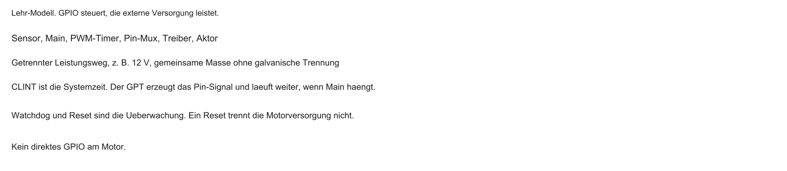
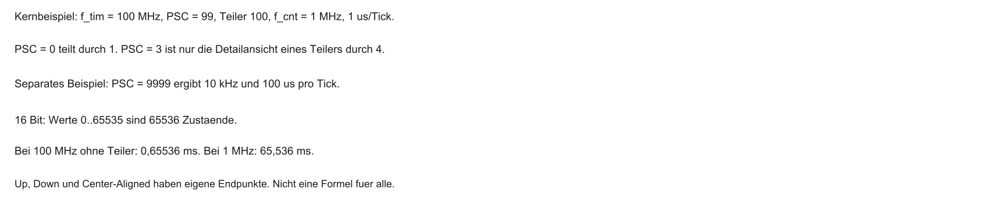
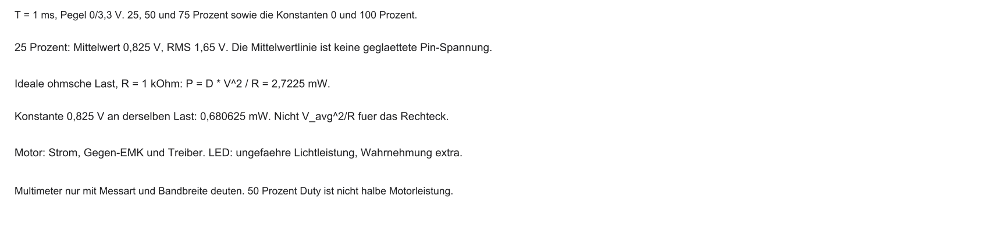
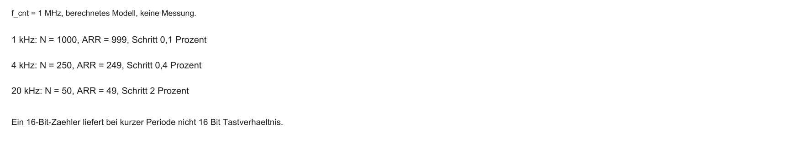
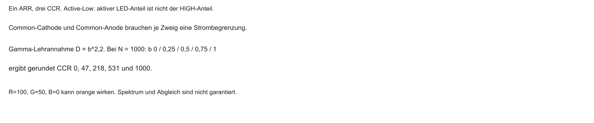
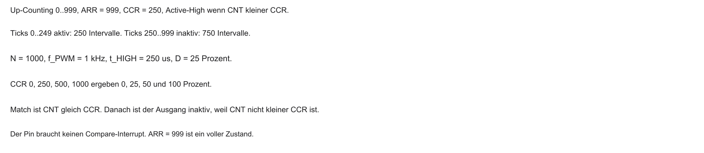
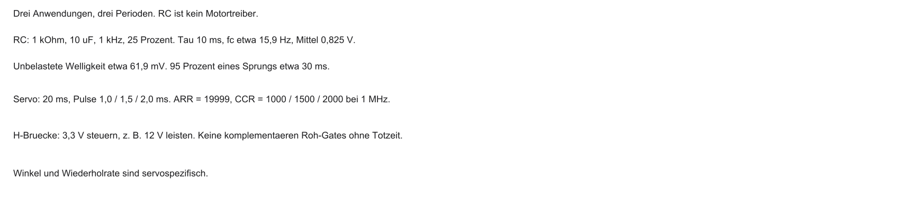
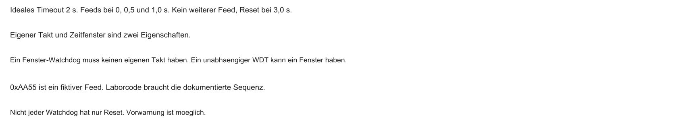
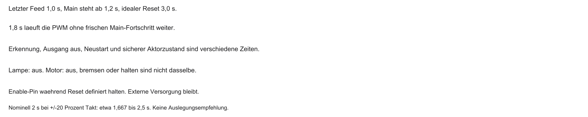

## Willkommen zu Block 4!

- Willkommen zur vierten Vorlesung in Mikrocomputertechnik 3
- Rückblick: In Block 3 hat der CLINT dem SoC einen Herzschlag (System-Tick) gegeben
- Bisher: CPU reagiert auf Ereignisse (Interrupts) und verarbeitet Daten
- Heute: das System wird aktiv — physikalische Welt steuern (Aktorik)
- Sicherheitsnetz: Wer passt auf die CPU auf, wenn Software hängt?

::: notes
Willkommen zu Block 4 knüpft an die bisherige Frage nach Signal und Überwachung an. CPU heißt Central Processing Unit, SoC System on Chip. CLINT ist der Core Local Interruptor, PLIC der Platform-Level Interrupt Controller. Eine LED ist eine Leuchtdiode. Der Prozessor kann Helligkeit rechnen, der Pin braucht daraus ein brauchbares Signal. PWM-Hardware und Watchdog haben verschiedene Aufgaben: eines formt das Ausgangssignal, das andere überwacht ausbleibenden Fortschritt. Ein System-Tick ist eine mögliche Architektur, kein Pflichtherzschlag. Solange Timer und Takt laufen, kann das letzte PWM-Signal weiterlaufen, auch wenn die Hauptschleife hängt. Willkommen zur vierten Vorlesung in Mikrocomputertechnik 3. Rückblick: In Block 3 hat der CLINT dem SoC einen Herzschlag (System-Tick) gegeben. Bisher: CPU reagiert auf Ereignisse (Interrupts) und verarbeitet Daten. Verständnischeck: Was passiert mit Hardware-PWM bei einem Hänger der Hauptschleife? Sie kann unverändert weiterlaufen. Die nächste Folie nimmt die noch offene Modellfrage auf. Adressen, Takte und Toleranzen sind Lehrannahmen. Code auf der Folie ist Lehrcode und wurde nicht kompiliert oder ausgeführt.
:::

## Einordnung im Semester

```{mermaid}
%%| fig-width: 4.2
%%{init: {'theme': 'base', 'themeVariables': {'background': '#FFFFFF', 'primaryColor': '#FFFFFF', 'primaryBorderColor': '#E5E5EA', 'primaryTextColor': '#1D1D1F', 'lineColor': '#86868B', 'secondaryColor': '#F5F5F7', 'tertiaryColor': '#FFFFFF', 'mainBkg': '#FFFFFF', 'nodeBorder': '#E5E5EA', 'clusterBkg': '#F5F5F7', 'clusterBorder': '#E5E5EA', 'titleColor': '#1D1D1F', 'edgeLabelBackground': '#FFFFFF'}}}%%
flowchart LR
  A[Block 3: Interrupts] -->|CPU reagiert| B[Block 4: Aktorik]
  B -->|CPU steuert| C[LEDs und Motoren]
  D[Watchdog] -.->|Hardware schützt| B
  style B fill:#FFFFFF,stroke:#E2001A,stroke-width:2px !important
```

::: notes
Einordnung im Semester knüpft an die bisherige Frage nach Signal und Überwachung an. Aktorik ist die Wirkung auf die Umwelt, nicht nur eine ausgegebene Zahl. Verfügbarkeit durch Neustart ist etwas anderes als ein definierter Zustand bei Gefahr. Funktionale Sicherheit wird hier nicht abgeschlossen. Block 3 liefert die monotone Zeit, mit der Fading-Schritte zu Sollzeitpunkten geplant werden. Verständnischeck: Warum ist Block 3 Voraussetzung? Ohne Zeitbasis gibt es kein festes 10-ms-Raster. Die nächste Folie nimmt die noch offene Modellfrage auf. Adressen, Takte und Toleranzen sind Lehrannahmen. Code auf der Folie ist Lehrcode und wurde nicht kompiliert oder ausgeführt.
:::

## Anknüpfung: CLINT, Tick und volatile

Kurz-Recap aus Block 3 (Vertiefung im Übungsblatt):

- CLINT liefert eine monotone Zeit für Termine, keinen PWM-Pin
- Ein Folgetermin knüpft an den bisherigen Solltermin an
- `volatile` verhindert bestimmte Wegoptimierungen, nicht Atomarität
- Die PWM-Flanken erzeugt später ein eigener Peripherietimer

```c
/* Lehrcode, verkürzt. Kein vollständiger Trap-Pfad.
   Relatives now+Intervall verschiebt das Raster. */
void timer_isr(void) {
    if (now >= next_deadline) {
        next_deadline += TICKS_PER_MS;
        write_mtimecmp(next_deadline);
    }
}
```

::: notes
Anknüpfung: CLINT, Tick und volatile knüpft an die bisherige Frage nach Signal und Überwachung an. mtime und mtimecmp sind Zähler und Vergleich der Maschinenzeit. Ein Folgetermin read_mtime plus Intervall verschiebt das Raster um die ISR-Latenz. Bei 1 ms Soll und 20 µs konstanter Verspätung wird das Raster etwa 1,020 ms. An den alten Solltermin anzuknüpfen hält die Phase. uptime_ms plus plus zählt Aufrufe, nicht ausgelassene Perioden. volatile unterdrückt Wegoptimierungen und garantiert keine Atomarität und keinen konsistenten 64-Bit-Lesezugriff auf RV32. Das Attribut installiert keinen vollständigen Trap-Pfad. Die PWM-Trägerfrequenz kommt vom GPT, nicht vom CLINT. CLINT liefert eine monotone Zeit für Termine, keinen PWM-Pin. Ein Folgetermin knüpft an den bisherigen Solltermin an. `volatile` verhindert bestimmte Wegoptimierungen, nicht Atomarität. Verständnischeck: Was macht relatives Rearming bei 20 µs Verspätung? Das Raster wächst auf etwa 1,020 ms. Die nächste Folie nimmt die noch offene Modellfrage auf. Adressen, Takte und Toleranzen sind Lehrannahmen. Code auf der Folie ist Lehrcode und wurde nicht kompiliert oder ausgeführt.
:::

## Von der Zeitmessung zur Weltsteuerung

- EVA-Prinzip: Eingabe, Verarbeitung, Ausgabe
- Bisheriger Fokus: RAM (Verarbeitung) und Interrupts (Eingabe)
- Fehlender Teil: Eingriff in die physikalische Welt
- Aktorik setzt ein Kommando in Licht, Wärme oder Bewegung um
- Ein Tastverhältnis ist offene Steuerung, keine Drehzahlregelung

::: notes
Von der Zeitmessung zur Weltsteuerung knüpft an die bisherige Frage nach Signal und Überwachung an. EVA heißt Eingabe, Verarbeitung, Ausgabe. RAM ist der Arbeitsspeicher, nicht die Verarbeitung selbst. Ein Aktor setzt ein elektrisches Kommando in Licht, Wärme oder Bewegung um. 50 Prozent PWM ist offene Steuerung. Regelung bräuchte Messung und Vergleich. Die Lastenergie kommt meist aus einer eigenen Versorgung. EVA-Prinzip: Eingabe, Verarbeitung, Ausgabe. Bisheriger Fokus: RAM (Verarbeitung) und Interrupts (Eingabe). Fehlender Teil: Eingriff in die physikalische Welt. Verständnischeck: Ist 50 Prozent PWM schon Drehzahlregelung? Nein, Messung und Sollvergleich fehlen. Die nächste Folie nimmt die noch offene Modellfrage auf. Adressen, Takte und Toleranzen sind Lehrannahmen. Code auf der Folie ist Lehrcode und wurde nicht kompiliert oder ausgeführt.
:::

## EVA — Schema



```{mermaid}
%%| fig-width: 4.0
%%{init: {'theme': 'base', 'themeVariables': {'background': '#FFFFFF', 'primaryColor': '#FFFFFF', 'primaryBorderColor': '#E5E5EA', 'primaryTextColor': '#1D1D1F', 'lineColor': '#86868B', 'secondaryColor': '#F5F5F7', 'tertiaryColor': '#FFFFFF', 'mainBkg': '#FFFFFF', 'nodeBorder': '#E5E5EA', 'clusterBkg': '#F5F5F7', 'clusterBorder': '#E5E5EA', 'titleColor': '#1D1D1F', 'edgeLabelBackground': '#FFFFFF'}}}%%
flowchart LR
  E[Eingabe: Sensor] --> V[Verarbeitung: SoC]
  V --> A[Ausgabe: Aktorik]
  A --> M[Motor / LED]
  style A fill:#FFFFFF,stroke:#E2001A,stroke-width:2px !important
```

::: notes
EVA — Schema knüpft an die bisherige Frage nach Signal und Überwachung an. GPIO ist ein digitaler Ein- und Ausgang. Der WDT ist der Watchdog Timer. Die Grafik trennt Signalpfeile von Leistungspfaden. Der 12-V-Motorstrom darf nicht durch den GPIO fließen. Ein gezeichneter Reset ist keine automatische Motorabschaltung. Verständnischeck: Warum nicht 12 V durch den GPIO? Der Pin liefert ein Steuerpegel und ist dafür nicht ausgelegt. Die nächste Folie nimmt die noch offene Modellfrage auf. Adressen, Takte und Toleranzen sind Lehrannahmen. Code auf der Folie ist Lehrcode und wurde nicht kompiliert oder ausgeführt.
:::

## Das Problem der digitalen Welt

- Die CPU lebt in einer binären Welt
- GPIO-Pin: typisch nur HIGH (z. B. $3{,}3\,\mathrm{V}$) oder LOW ($0\,\mathrm{V}$)
- Dilemma: der Pin kennt nur zwei Pegel. Helligkeit und Kraft folgen nicht linear aus einem Zwischenwert.
- Viele MCU-Pins haben keinen stufenlosen Analogausgang (DAC)
- Lösungsidee: Trägheit der realen Welt ausnutzen

::: notes
Das Problem der digitalen Welt knüpft an die bisherige Frage nach Signal und Überwachung an. HIGH und LOW sind logische Zustände. 3,3 V und 0 V sind ideale Beispielpegel, keine RISC-V-Norm. Ein DAC wäre ein Digital-Analog-Wandler. PWM ändert Zeitanteile, nicht die Pulshöhe. Bei 50 Prozent liegen am ungefilterten Pin weiterhin 0 V und 3,3 V im Wechsel. 1,65 V ist der Mittelwert. Die CPU lebt in einer binären Welt. GPIO-Pin: typisch nur HIGH (z. B. $3{,}3\,\mathrm{V}$) oder LOW ($0\,\mathrm{V}$). Dilemma: der Pin kennt nur zwei Pegel. Helligkeit und Kraft folgen nicht linear aus einem Zwischenwert. Verständnischeck: Liegen dauerhaft 1,65 V an? Nein, das ist der zeitliche Mittelwert des Rechtecks. Die nächste Folie nimmt die noch offene Modellfrage auf. Adressen, Takte und Toleranzen sind Lehrannahmen. Code auf der Folie ist Lehrcode und wurde nicht kompiliert oder ausgeführt.
:::

## Das Problem der Software-Fehler

- Zuverlässigkeit: Was, wenn der Code in `while (1);` hängt?
- Folgen: System reagiert nicht; Aktoren können unkontrolliert weiterlaufen
- In sicherheitskritischen Domänen (Medizin, Avionik, Industrie) inakzeptabel
- Bedarf: Hardware, die die CPU überwacht und im Notfall resetten kann

```{mermaid}
%%| fig-width: 3.6
%%{init: {'theme': 'base', 'themeVariables': {'background': '#FFFFFF', 'primaryColor': '#FFFFFF', 'primaryBorderColor': '#E5E5EA', 'primaryTextColor': '#1D1D1F', 'lineColor': '#86868B', 'secondaryColor': '#F5F5F7', 'tertiaryColor': '#FFFFFF', 'mainBkg': '#FFFFFF', 'nodeBorder': '#E5E5EA', 'clusterBkg': '#F5F5F7', 'clusterBorder': '#E5E5EA', 'titleColor': '#1D1D1F', 'edgeLabelBackground': '#FFFFFF'}}}%%
flowchart TD
  A[Normaler Betrieb] --> B{Software-Bug?}
  B -->|ja| C[Freeze / Endlosschleife]
  C --> D[Hardware muss eingreifen]
  style D fill:#FFFFFF,stroke:#E2001A,stroke-width:2px !important
```

::: notes
Das Problem der Software-Fehler knüpft an die bisherige Frage nach Signal und Überwachung an. Eine Endlosschleife kann Instruktionen ausführen, ohne relevanten Fortschritt zu machen. Ein unabhängiger Abschaltpfad kann trotzdem arbeiten. Der Watchdog erkennt fehlenden Feed, nicht jeden falschen Helligkeitswert. Sicher ist anwendungsabhängig: Lampe aus ist nicht dasselbe wie Motor ausrollen oder halten. Zuverlässigkeit: Was, wenn der Code in `while (1);` hängt?. Folgen: System reagiert nicht; Aktoren können unkontrolliert weiterlaufen. In sicherheitskritischen Domänen (Medizin, Avionik, Industrie) inakzeptabel. Verständnischeck: Erkennt der Watchdog jeden falschen Helligkeitswert? Nein, wenn weiter gültig gefüttert wird. Die nächste Folie nimmt die noch offene Modellfrage auf. Adressen, Takte und Toleranzen sind Lehrannahmen. Code auf der Folie ist Lehrcode und wurde nicht kompiliert oder ausgeführt.
:::

## Agenda für den heutigen Tag

1. Hardware-Counter und Timer-Architektur (warum der CLINT hier nicht reicht)
2. Pulsweitenmodulation (PWM) — Illusion analoger Signale
3. PWM-Erzeugung in Hardware (Compare-Register)
4. System-Sicherheit und Watchdog Timer (WDT)
5. Brückenschlag zum Labor (z. B. Renode und RGB-LEDs)

::: notes
Agenda für den heutigen Tag knüpft an die bisherige Frage nach Signal und Überwachung an. GPT heißt General Purpose Timer. PWM ist Pulsweitenmodulation. RGB steht für Rot, Grün und Blau. Renode ist ein optionaler, nicht ausgeführter Laborausblick. Der CLINT plant Softwaretermine, der GPT erzeugt im Modell den Pinimpuls. Zuerst muss klar sein, warum der Aktor ohne Hauptschleife weiterlaufen kann. Verständnischeck: Warum nicht sofort Watchdog-Code? Weil das Weiterlaufen der PWM sonst unverständlich bleibt. Die nächste Folie nimmt die noch offene Modellfrage auf. Adressen, Takte und Toleranzen sind Lehrannahmen. Code auf der Folie ist Lehrcode und wurde nicht kompiliert oder ausgeführt.
:::

## Lernziele Block 4

- Aufbau eines General Purpose Timers (GPT) inkl. Prescaler erklären
- Mathematik der PWM verstehen (Frequenz, Duty Cycle)
- Begründen, warum Software-PWM (Bit-Banging) die CPU belastet und Timing gefährdet
- Watchdog Timer (WDT) korrekt konfigurieren und „füttern“
- Typische Anfängerfehler beim WDT vermeiden

::: notes
Lernziele Block 4 knüpft an die bisherige Frage nach Signal und Überwachung an. Prüfbar sind Frequenz aus Takt, PSC und ARR, CCR für ein Tastverhältnis, eine verspätete Softwareflanke, Feed an Fortschritt und die Grenzen eines Resets. PSC, CNT, ARR und CCR sind Register eines Timermodells, keine RISC-V-Register. Eine reale Konfiguration braucht Taktquelle, Registersemantik, Pinbelegung und Beschaltung. Aufbau eines General Purpose Timers (GPT) inkl. Prescaler erklären. Mathematik der PWM verstehen (Frequenz, Duty Cycle). Begründen, warum Software-PWM (Bit-Banging) die CPU belastet und Timing gefährdet. Verständnischeck: Welche Zusatzinformation fehlt? Datenblatt, Pin-Mux und Ausgangsbeschaltung. Die nächste Folie nimmt die noch offene Modellfrage auf. Adressen, Takte und Toleranzen sind Lehrannahmen. Code auf der Folie ist Lehrcode und wurde nicht kompiliert oder ausgeführt.
:::

## Die Leitfrage des Tages

- SoC-Pin: oft maximal $3{,}3\,\mathrm{V}$ (100 %) oder $0\,\mathrm{V}$ (0 %)
- Ziel im Beispiel: 50 Prozent Tastverhaeltnis. Das ist nicht allgemein halbe Motorleistung.
- Ohne externe Bauteile wie digitale Potentiometer
- Wie dimmt man auf 50 %, wenn der Pin nur „Vollgas“ oder „Aus“ kennt?

::: notes
Die Leitfrage des Tages knüpft an die bisherige Frage nach Signal und Überwachung an. Die Leitfrage ist 50 Prozent aktive Zeit, nicht 50 Prozent Motorleistung oder Helligkeit. Ohne zusätzlichen Analogwandler bleibt das Steuersignal digital. Der Pin erzeugt ein Kommando, der Motor braucht eine Leistungsstufe. SoC-Pin: oft maximal $3{,}3\,\mathrm{V}$ (100 %) oder $0\,\mathrm{V}$ (0 %). Ziel im Beispiel: 50 Prozent Tastverhaeltnis. Das ist nicht allgemein halbe Motorleistung. Ohne externe Bauteile wie digitale Potentiometer. Verständnischeck: Was ist bei idealen 50 Prozent Active-High sicher? HIGH und LOW dauern gleich lang. Die Wirkung ist damit nicht bestimmt. Die nächste Folie nimmt die noch offene Modellfrage auf. Adressen, Takte und Toleranzen sind Lehrannahmen. Code auf der Folie ist Lehrcode und wurde nicht kompiliert oder ausgeführt.
:::

## Leitfrage — Schema

```{mermaid}
%%| fig-width: 3.8
%%{init: {'theme': 'base', 'themeVariables': {'background': '#FFFFFF', 'primaryColor': '#FFFFFF', 'primaryBorderColor': '#E5E5EA', 'primaryTextColor': '#1D1D1F', 'lineColor': '#86868B', 'secondaryColor': '#F5F5F7', 'tertiaryColor': '#FFFFFF', 'mainBkg': '#FFFFFF', 'nodeBorder': '#E5E5EA', 'clusterBkg': '#F5F5F7', 'clusterBorder': '#E5E5EA', 'titleColor': '#1D1D1F', 'edgeLabelBackground': '#FFFFFF'}}}%%
flowchart LR
  H[3.3 V HIGH] -->|Trick?| M[Motor bei 50 %]
  L[0 V LOW] -->|Trick?| M
  style M fill:#FFFFFF,stroke:#E2001A,stroke-width:2px !important
```

::: notes
Leitfrage — Schema knüpft an die bisherige Frage nach Signal und Überwachung an. Zwei Pulse gleicher Höhe und verschiedener Breite haben verschiedene Mittelwerte. Die gestrichelte Linie ist ein rechnerischer Mittelwert, keine ungefilterte Pinspannung. Der Treiber und die Versorgung gehören zum Motorpfad. Verständnischeck: Warum sind gleiche Höhe und verschiedene Breite nicht dasselbe Signal? Der aktive Zeitanteil unterscheidet sich. Die nächste Folie nimmt die noch offene Modellfrage auf. Adressen, Takte und Toleranzen sind Lehrannahmen. Code auf der Folie ist Lehrcode und wurde nicht kompiliert oder ausgeführt.
:::

## CLINT vs. Peripherie-Timer

- Warum nicht einfach `mtime` aus Block 3 für Aktorik?
- CLINT: 64-Bit-System-Timer — läuft durch, darf nicht „wild“ zurückgesetzt werden (OS-Zeitbasis)
- Aktorik braucht Timer, die periodisch bei 0 neu starten und mit Ausgangspins verbunden sind
- Lösung: General Purpose Timers (GPT) in der Peripherie — oft viele pro SoC

::: notes
CLINT vs. Peripherie-Timer knüpft an die bisherige Frage nach Signal und Überwachung an. Die Systemzeit plant alle 10 ms einen Stellwert. Der PWM-Zähler läuft mit 1 kHz, also zehn Perioden je Fading-Schritt. 10 MHz Systemzeit und 1 MHz Counter sind verschiedene Zähler. Hardware-PWM ist keine CLINT- und keine RISC-V-ISA-Funktion. Warum nicht einfach `mtime` aus Block 3 für Aktorik?. CLINT: 64-Bit-System-Timer — läuft durch, darf nicht „wild“ zurückgesetzt werden (OS-Zeitbasis). Aktorik braucht Timer, die periodisch bei 0 neu starten und mit Ausgangspins verbunden sind. Verständnischeck: Bleibt ein Helligkeitswert 10 ms, während zehn PWM-Perioden laufen? Ja, bei 1 kHz und 10-ms-Schritten. Die nächste Folie nimmt die noch offene Modellfrage auf. Adressen, Takte und Toleranzen sind Lehrannahmen. Code auf der Folie ist Lehrcode und wurde nicht kompiliert oder ausgeführt.
:::

## Der General Purpose Timer (GPT)

- Flexibles Zählwerk in Hardware, unabhängig vom RISC-V-Kern
- Aufgaben: externe Ereignisse zählen, Zeit stoppen, Pulsmuster auf Pins ausgeben
- Heute: programmierbarer Signalgenerator — nicht „System-Uhr“
- Konfiguration über Memory-Mapped Register (MMIO)

::: notes
Der General Purpose Timer (GPT) knüpft an die bisherige Frage nach Signal und Überwachung an. Der Timer liegt außerhalb des Rechenwerks. MMIO heißt Memory-Mapped Input/Output. TIM, PSC und ARR sind ein STM32-nahes Lehrmodell, keine RISC-V-Namen. Ein Schreiben konfiguriert Hardware, es legt nicht nur eine RAM-Variable ab. Flexibles Zählwerk in Hardware, unabhängig vom RISC-V-Kern. Aufgaben: externe Ereignisse zählen, Zeit stoppen, Pulsmuster auf Pins ausgeben. Heute: programmierbarer Signalgenerator — nicht „System-Uhr“. Verständnischeck: Was bedeutet ein MMIO-Schreiben? Es verändert einen Hardwarezustand nach Registervertrag. Die nächste Folie nimmt die noch offene Modellfrage auf. Adressen, Takte und Toleranzen sind Lehrannahmen. Code auf der Folie ist Lehrcode und wurde nicht kompiliert oder ausgeführt.
:::

## Anatomie eines Hardware-Counters

Drei Kernbausteine:

- Clock Source: oft Systemtakt (z. B. $100\,\mathrm{MHz}$)
- Prescaler (PSC): Vorteiler, drosselt den Takt
- Counter-Register (CNT): Zählwert (typisch 16- oder 32-Bit)

Jeder Tick hinter dem Prescaler erhöht `CNT` um 1.

::: notes
Anatomie eines Hardware-Counters knüpft an die bisherige Frage nach Signal und Überwachung an. 100 MHz sind 100 Millionen Eingangsperioden je Sekunde, hier eine Modellannahme am Timer-Eingang. Ein Tick erhöht CNT nur im Up-Counting. 16 Bit bieten 65536 Zustände von 0 bis 65535. Ein freier Durchlauf bei 100 MHz dauert 655,36 µs. Clock Source: oft Systemtakt (z. B. $100\,\mathrm{MHz}$). Prescaler (PSC): Vorteiler, drosselt den Takt. Counter-Register (CNT): Zählwert (typisch 16- oder 32-Bit). Verständnischeck: Wie lange dauern 65536 Intervalle bei 100 MHz? 655,36 µs. Die nächste Folie nimmt die noch offene Modellfrage auf. Adressen, Takte und Toleranzen sind Lehrannahmen. Code auf der Folie ist Lehrcode und wurde nicht kompiliert oder ausgeführt.
:::

## Counter-Kette — Schema



```{mermaid}
%%| fig-width: 4.0
%%{init: {'theme': 'base', 'themeVariables': {'background': '#FFFFFF', 'primaryColor': '#FFFFFF', 'primaryBorderColor': '#E5E5EA', 'primaryTextColor': '#1D1D1F', 'lineColor': '#86868B', 'secondaryColor': '#F5F5F7', 'tertiaryColor': '#FFFFFF', 'mainBkg': '#FFFFFF', 'nodeBorder': '#E5E5EA', 'clusterBkg': '#F5F5F7', 'clusterBorder': '#E5E5EA', 'titleColor': '#1D1D1F', 'edgeLabelBackground': '#FFFFFF'}}}%%
flowchart LR
  A[System Clock\n100 MHz] -->|Takt| B[Prescaler PSC]
  B -->|verlangsamt| C[Counter CNT]
  style B fill:#FFFFFF,stroke:#E2001A,stroke-width:2px !important
```

::: notes
Counter-Kette — Schema knüpft an die bisherige Frage nach Signal und Überwachung an. PSC gleich 99 teilt durch 100. 100 MHz geteilt durch 100 ist 1 MHz, also 1 µs je Tick. Die 65536 Zustände sind die Registerbreite. ARR gleich 999 benutzt später nur 1000 Intervalle. Die Pfeile sind Takte, kein Instruktionsfluss. Verständnischeck: Wie lange dauert ein voller 16-Bit-Durchlauf nach der Teilung? 65536 µs, also 65,536 ms, ohne kleinere ARR-Grenze. Die nächste Folie nimmt die noch offene Modellfrage auf. Adressen, Takte und Toleranzen sind Lehrannahmen. Code auf der Folie ist Lehrcode und wurde nicht kompiliert oder ausgeführt.
:::

## Der Prescaler (Vorteiler)

- Problem: $100\,\mathrm{MHz}$ = $10^{8}$ Ticks/s; 16-Bit-Max $\approx 65\,535$ → Überlauf in unter 1 ms
- Lösung: Prescaler lässt nur jeden $n$-ten Takt durch
- Typisch: Registerwert $PSC$, Teilung durch $PSC + 1$ (weil 0 mitzählt)
- Beispiel: $PSC = 99$ → Teiler 100 → langsameres Zählen, längere Messfenster

::: notes
Der Prescaler (Vorteiler) knüpft an die bisherige Frage nach Signal und Überwachung an. Im Modell bedeutet Registerwert 0 den Teiler 1, Wert 99 den Teiler 100. Null stoppt den Timer nicht. Für den Überlauf zählen 65536 Intervalle, nicht nur der Zahlenwert 65535. Die Semantik ist datenblattabhängig und hier festgesetzt. Problem: $100\,\mathrm{MHz}$ = $10^{8}$ Ticks/s; 16-Bit-Max $\approx 65\,535$ → Überlauf in unter 1 ms. Lösung: Prescaler lässt nur jeden $n$-ten Takt durch. Typisch: Registerwert $PSC$, Teilung durch $PSC + 1$ (weil 0 mitzählt). Verständnischeck: Welcher PSC ergibt 1 MHz? PSC plus 1 gleich 100, also PSC gleich 99. Die nächste Folie nimmt die noch offene Modellfrage auf. Adressen, Takte und Toleranzen sind Lehrannahmen. Code auf der Folie ist Lehrcode und wurde nicht kompiliert oder ausgeführt.
:::

## Mathematik: Zählfrequenz

$$
f_{\mathrm{cnt}} = \frac{f_{\mathrm{clock}}}{PSC + 1}
$$

Beispiel: $f_{\mathrm{clock}} = 100\,\mathrm{MHz}$, $PSC = 9999$

$$
f_{\mathrm{cnt}} = \frac{10^{8}}{10^{4}} = 10\,\mathrm{kHz}
$$

→ Counter erhöht sich $10\,000$-mal pro Sekunde (alle $0{,}1\,\mathrm{ms}$).

::: notes
Mathematik: Zählfrequenz knüpft an die bisherige Frage nach Signal und Überwachung an. f_cnt gleich f_clock geteilt durch PSC plus 1. PSC gleich 9999 ergibt 10 kHz und 100 µs je Tick. Das ist eine Rechenvariante, nicht der spätere PSC 99. PWM-Frequenz braucht zusätzlich N Intervalle. 10 kHz Zähltakt und N gleich 1000 ergäben nur 10 Hz PWM. Verständnischeck: Sind 10 kHz Zähltakt automatisch 10 kHz PWM? Nein. Die nächste Folie nimmt die noch offene Modellfrage auf. Adressen, Takte und Toleranzen sind Lehrannahmen. Code auf der Folie ist Lehrcode und wurde nicht kompiliert oder ausgeführt.
:::

## Das Auto-Reload Register (ARR)

- Wo endet das Zählen? → Auto-Reload / Period Register (ARR)
- Programmierte Periodengrenze in diesem Up-Counting-Modell
- `CNT = ARR` gilt einen vollen Tick; der nächste Tick setzt auf 0
- Die Periode hat N = ARR+1 Intervalle
- Im Kernmodell: PSC+1, Vergleich `CNT < CCR`, Active-High

::: notes
Das Auto-Reload Register (ARR) knüpft an die bisherige Frage nach Signal und Überwachung an. ARR ist die programmierte Grenze, nicht die Registerbreite. CNT gleich 999 dauert einen vollen Tick, danach folgt 0. N gleich ARR plus 1. Bei 1 MHz und ARR 999 ist T gleich 1000 µs. CNT von 0 bis 9 einschließlich sind zehn Intervalle, ARR gleich 9. Wo endet das Zählen? → Auto-Reload / Period Register (ARR). Programmierte Periodengrenze in diesem Up-Counting-Modell. `CNT = ARR` gilt einen vollen Tick; der nächste Tick setzt auf 0. Verständnischeck: Wie viele Intervalle hat CNT gleich 0 bis 9? Zehn, also N gleich 10. Die nächste Folie nimmt die noch offene Modellfrage auf. Adressen, Takte und Toleranzen sind Lehrannahmen. Code auf der Folie ist Lehrcode und wurde nicht kompiliert oder ausgeführt.
:::

## Zähl-Modus: Up-Counting

- Standard für viele GPT-Anwendungen
- Ablauf: 0 → hoch bis ARR → Reset auf 0
- Signalform: Sägezahn
- Einsatz: Zeitmessung, periodische Interrupts, einfache PWM

| Phase | CNT |
|-------|-----|
| Start | 0 |
| Mitte | steigt |
| Grenze | ARR |
| Danach | 0 (neu) |

::: notes
Zähl-Modus: Up-Counting knüpft an die bisherige Frage nach Signal und Überwachung an. Up-Counting ist eine Treppe, kein glatter Sägezahn. Nach dem vollständigen ARR-Intervall setzt der nächste Tick auf null. Ein Update kann Register übernehmen, muss aber keinen CPU-Interrupt erzeugen. Bei ARR gleich 3 gehören 0, 1, 2 und 3 zu einer Periode. Standard für viele GPT-Anwendungen. Ablauf: 0 → hoch bis ARR → Reset auf 0. Signalform: Sägezahn. Verständnischeck: Welche Werte hat eine Periode bei ARR gleich 3? 0, 1, 2 und 3. Die nächste Folie nimmt die noch offene Modellfrage auf. Adressen, Takte und Toleranzen sind Lehrannahmen. Code auf der Folie ist Lehrcode und wurde nicht kompiliert oder ausgeführt.
:::

## Zähl-Modus: Down-Counting

- Umgekehrt: Start bei ARR, herunter bis 0
- Bei 0 oft Event/Interrupt; Neu laden mit ARR
- Signalform: fallender Sägezahn
- Einsatz: Timeouts; verwandt mit manchen SysTick-Konzepten (z. B. Cortex-M)

::: notes
Zähl-Modus: Down-Counting knüpft an die bisherige Frage nach Signal und Überwachung an. Down-Counting braucht eine eigene Regel, wann null ein Intervall ist und wann neu geladen wird. Die Formel CNT kleiner CCR gilt nicht ungeprüft. SysTick ist ein ARM-Cortex-M-Zeitgeber, kein RISC-V-Modul. Umgekehrt: Start bei ARR, herunter bis 0. Bei 0 oft Event/Interrupt; Neu laden mit ARR. Signalform: fallender Sägezahn. Verständnischeck: Was fehlt bei Startwert 3? Welche Zustände wie lange gelten und wann das Ablaufereignis kommt. Die nächste Folie nimmt die noch offene Modellfrage auf. Adressen, Takte und Toleranzen sind Lehrannahmen. Code auf der Folie ist Lehrcode und wurde nicht kompiliert oder ausgeführt.
:::

## Zähl-Modus: Center-Aligned

- Fortgeschrittener Modus: 0 → ARR → wieder zurück nach 0 (Richtungsumkehr)
- Signalform: Dreieck
- Einsatz: moderne Motorsteuerung (z. B. FOC), Wechselrichter

| Phase | Verhalten |
|-------|-----------|
| Aufwärts | 0 → ARR |
| Abwärts | ARR → 0 |
| Form | Dreieck |

::: notes
Zähl-Modus: Center-Aligned knüpft an die bisherige Frage nach Signal und Überwachung an. Center-Aligned kehrt die Richtung um. BLDC ist ein bürstenloser Gleichstrommotor, FOC feldorientierte Regelung, beides nur Ausblick. Im kleinen Modell ARR gleich 4 lautet die Folge 0, 1, 2, 3, 4, 3, 2, 1 und dann wieder 0, also acht Ticks. Die Edge-Formel ARR plus 1 gilt hier nicht automatisch. Fortgeschrittener Modus: 0 → ARR → wieder zurück nach 0 (Richtungsumkehr). Signalform: Dreieck. Einsatz: moderne Motorsteuerung (z. B. FOC), Wechselrichter. Verständnischeck: Darf man dieselbe PWM-Frequenz wie im Up-Counting annehmen? Nein, der Auf-und-ab-Zyklus hat eine andere Intervallzahl. Die nächste Folie nimmt die noch offene Modellfrage auf. Adressen, Takte und Toleranzen sind Lehrannahmen. Code auf der Folie ist Lehrcode und wurde nicht kompiliert oder ausgeführt.
:::

## Fragen? — Counter und GPT

- Rolle von Prescaler (PSC) und Auto-Reload (ARR) klar?
- Zählfrequenz $f_{\mathrm{cnt}}$ berechnen können?
- Up-Counting vs. Center-Aligned unterschieden?
- Warum Datenblatt zu $ARR$ vs. $ARR+1$ prüfen?

::: notes
Fragen? — Counter und GPT knüpft an die bisherige Frage nach Signal und Überwachung an. PSC setzt den Countertakt, ARR die Periodengrenze im gewählten Modus. Mit 100 MHz, PSC 99 und ARR 999 bleibt das Kernmodell bei 1 kHz. Steigt nur PSC auf 199, halbieren sich f_cnt und f_PWM auf 500 kHz und 500 Hz. D bei gleichem CCR bleibt gleich. Rolle von Prescaler (PSC) und Auto-Reload (ARR) klar?. Zählfrequenz $f_{\mathrm{cnt}}$ berechnen können?. Up-Counting vs. Center-Aligned unterschieden?. Verständnischeck: Was ändert PSC gleich 199? Frequenz halbiert, Duty bei gleichem CCR nicht. Die nächste Folie nimmt die noch offene Modellfrage auf. Adressen, Takte und Toleranzen sind Lehrannahmen. Code auf der Folie ist Lehrcode und wurde nicht kompiliert oder ausgeführt.
:::

## Die analoge Illusion

- Zurück zur Leitfrage: 50 Prozent aktive Zeit an einem binären Pin?
- Trick: Pin sehr schnell ein- und ausschalten
- Beispiel: 1 kHz, je Hälfte der Periode HIGH/LOW
- Motor und Auge sind zu träge, um dem Stottern zu folgen
- Effekt: schnelles Schalten. Wahrnehmung und mechanische Wirkung sind davon zu trennen.

::: notes
Die analoge Illusion knüpft an die bisherige Frage nach Signal und Überwachung an. Bei T gleich 1 ms und je 0,5 ms HIGH und LOW bleibt die Periode gleich, wenn nur das Tastverhältnis auf 25 Prozent fällt. Die Pulsdauer wird kürzer. 1 kHz ist kein Garant gegen Flimmern, Kamerabänder oder Geräusche. Trägheit gehört zur Last, nicht zum Pin. Zurück zur Leitfrage: 50 Prozent aktive Zeit an einem binären Pin?. Trick: Pin sehr schnell ein- und ausschalten. Beispiel: 1 kHz, je Hälfte der Periode HIGH/LOW. Verständnischeck: Was bleibt bei festem f_PWM gleich? Periode und Pegelhöhe. Die aktive Dauer ändert sich. Die nächste Folie nimmt die noch offene Modellfrage auf. Adressen, Takte und Toleranzen sind Lehrannahmen. Code auf der Folie ist Lehrcode und wurde nicht kompiliert oder ausgeführt.
:::

## Was ist PWM?

- Pulsweitenmodulation (PWM, Pulse Width Modulation)
- Wichtige Schnittstelle: digitale Steuerung und Leistungselektronik
- Grundfrequenz bleibt konstant; die Pulsweite (HIGH-Anteil) wird moduliert
- Breiter Puls → viel Energie; schmaler Puls → wenig Energie

::: notes
Was ist PWM knüpft an die bisherige Frage nach Signal und Überwachung an. PWM verändert die aktive Dauer bei fester Periode. Breiter Puls bedeutet mehr Energie nur bei gleicher Spannung und Last. Ein Servo nutzt die Pulsbreite später als Information. 1 ms bei T gleich 2 ms ist 50 Prozent, bei T gleich 20 ms nur 5 Prozent. Pulsweitenmodulation (PWM, Pulse Width Modulation). Wichtige Schnittstelle: digitale Steuerung und Leistungselektronik. Grundfrequenz bleibt konstant; die Pulsweite (HIGH-Anteil) wird moduliert. Verständnischeck: Sind 1-ms-Pulse bei 2 ms und 20 ms dasselbe Tastverhältnis? Nein, 50 beziehungsweise 5 Prozent. Die nächste Folie nimmt die noch offene Modellfrage auf. Adressen, Takte und Toleranzen sind Lehrannahmen. Code auf der Folie ist Lehrcode und wurde nicht kompiliert oder ausgeführt.
:::

## Periode und Frequenz

- Periode $T$: Dauer eines Zyklus (HIGH + LOW)
- Frequenz $f = 1/T$
- Zu niedrige $f$ (z. B. 10 Hz): sichtbares Flackern, ruckelige Motoren
- Richtwerte (Faustregeln): LEDs oft $\gtrsim 200\,\mathrm{Hz}$; Motoren oft 10–20 kHz (weniger hörbares Fiepen)

| Abschnitt | Bedeutung |
|-----------|-----------|
| HIGH | Energie ein |
| LOW | Energie aus |
| $T$ | ein voller Zyklus |

::: notes
Periode und Frequenz knüpft an die bisherige Frage nach Signal und Überwachung an. f gleich 1 geteilt durch T. 1 ms ist 0,001 s, also 1000 Hz. HIGH und LOW sind Kommandopegel im Active-High-Modell. In LOW kann Freilaufstrom fließen. 20 kHz haben eine Periode von 50 µs. Frequenzwahl hängt von Treiber, Last und Auflösung ab. Periode $T$: Dauer eines Zyklus (HIGH + LOW). Frequenz $f = 1/T$. Zu niedrige $f$ (z. B. 10 Hz): sichtbares Flackern, ruckelige Motoren. Verständnischeck: Wie lang ist eine Periode bei 20 kHz? 50 µs. Die nächste Folie nimmt die noch offene Modellfrage auf. Adressen, Takte und Toleranzen sind Lehrannahmen. Code auf der Folie ist Lehrcode und wurde nicht kompiliert oder ausgeführt.
:::

## Der Duty Cycle (Tastverhältnis)

- Wichtigste PWM-Größe: Anteil der HIGH-Zeit an der Periode

$$
\mathrm{Duty\ Cycle} = \frac{t_{\mathrm{HIGH}}}{T}
$$

- Anteil der aktiven Zeit im gewählten PWM-Modell
- Periode/Frequenz konstant; wir ändern den Duty Cycle

::: notes
Der Duty Cycle (Tastverhältnis) knüpft an die bisherige Frage nach Signal und Überwachung an. D_aktiv ist t_aktiv geteilt durch T, zwischen 0 und 1. Im Active-High-Modell ist das der HIGH-Anteil. Bei Active-Low ist der HIGH-Anteil 1 minus D_aktiv. 250 µs aktiv bei 1000 µs sind 25 Prozent, unabhängig vom aktiven Pegel. Wichtigste PWM-Größe: Anteil der HIGH-Zeit an der Periode. Anteil der aktiven Zeit im gewählten PWM-Modell. Periode/Frequenz konstant; wir ändern den Duty Cycle. Verständnischeck: Wie groß ist D bei 250 µs aktiv und T gleich 1000 µs? 0,25. Die nächste Folie nimmt die noch offene Modellfrage auf. Adressen, Takte und Toleranzen sind Lehrannahmen. Code auf der Folie ist Lehrcode und wurde nicht kompiliert oder ausgeführt.
:::

## Duty Cycle in Prozent

Bei konstanter Frequenz:

| Duty Cycle | Wirkung (qualitativ) |
|------------|----------------------|
| 10 % | kurze Pulse; schwach |
| 50 % | halbe aktive Zeit |
| 90 % | fast dauerhaft HIGH |

Die Periode bleibt gleich — nur die fallende Flanke wandert.

::: notes
Duty Cycle in Prozent knüpft an die bisherige Frage nach Signal und Überwachung an. Bei T gleich 1 ms dauern 10, 50 und 90 Prozent 100, 500 und 900 µs. Die fallende Flanke wandert nur in der gezeigten Edge-Aligned-Active-High-Darstellung. Die Wirkung ist eine Tendenz, keine garantierte Licht- oder Motorleistung. Verständnischeck: Welche Pulsdauer hat 90 Prozent bei 1 kHz? 900 µs. Die nächste Folie nimmt die noch offene Modellfrage auf. Adressen, Takte und Toleranzen sind Lehrannahmen. Code auf der Folie ist Lehrcode und wurde nicht kompiliert oder ausgeführt.
:::

## Mittlere Spannung berechnen



Zeitlicher Mittelwert über die Periode (nicht der Effektivwert/RMS):

$$
\bar{V} = V_{\mathrm{Pin}} \times \mathrm{Duty\ Cycle}
$$

Beispiel: $V_{\mathrm{Pin}} = 3{,}3\,\mathrm{V}$, Duty Cycle $= 25\,\%$ $= 0{,}25$

$$
\bar{V} = 3{,}3\,\mathrm{V} \times 0{,}25 = 0{,}825\,\mathrm{V}
$$

Zum Vergleich RMS eines Rechtecksignals: $V_{\mathrm{RMS}} = V_{\mathrm{Pin}} \cdot \sqrt{D}$ — bei 25 % also $\approx 1{,}65\,\mathrm{V}$. Bei idealer ohmscher Last gilt $P=D\cdot V^2/R$, nicht $V_{\mathrm{avg}}^2/R$ fuer das ungefilterte Rechteck.

::: notes
Mittlere Spannung berechnen knüpft an die bisherige Frage nach Signal und Überwachung an. V_mittel gleich D mal 3,3 V. V_RMS, der Effektivwert, ist 3,3 V mal Wurzel aus D. Bei D gleich 0,25 sind das 0,825 V und 1,65 V. Für R gleich 100 Ohm ist die mittlere Rechteckleistung D mal V quadrat geteilt durch R, also 27,225 mW. Das Quadrat des Mittelwerts ergibt nur 6,806 mW und unterschätzt die Heizwirkung. LOW gleich 0, ideale Flanken und ohmsche Last sind Annahmen. Die Mittelwertlinie ist kein gefilterter Ausgang. Verständnischeck: Warum ist der Effektivwert größer? Die hohen Pulse gehen quadratisch ein. Die nächste Folie nimmt die noch offene Modellfrage auf. Adressen, Takte und Toleranzen sind Lehrannahmen. Code auf der Folie ist Lehrcode und wurde nicht kompiliert oder ausgeführt.
:::

## Auflösung (Resolution)



- Nutzbare Schrittweite im Kernmodell: 1/N mit N = ARR+1
- 16 Bit sind die Registergrenze, nicht automatisch 16 Bit PWM-Auflösung
- Bei 1 MHz: 1 kHz hat 0,1 Prozentpunkte, 20 kHz hat 2 Prozentpunkte

::: notes
Auflösung (Resolution) knüpft an die bisherige Frage nach Signal und Überwachung an. Die Schrittweite ist 1/N. Bei 1 MHz sind N gleich 1000, 250 und 50 für 1, 4 und 20 kHz, ARR gleich 999, 249 und 49, Schritte 0,1, 0,4 und 2 Prozentpunkte. log2 von N ist etwa 9,97, 7,97 und 5,64 Bit des Zeitrasters. N Intervalle und N plus 1 Schwellen sind verschieden. Ein 16-Bit-CCR kann N gleich 65536 nicht halten. Nutzbare Schrittweite im Kernmodell: 1/N mit N = ARR+1. 16 Bit sind die Registergrenze, nicht automatisch 16 Bit PWM-Auflösung. Bei 1 MHz: 1 kHz hat 0,1 Prozentpunkte, 20 kHz hat 2 Prozentpunkte. Verständnischeck: Warum sinkt die Auflösung bei höherer PWM-Frequenz? Pro Periode bleiben weniger Ticks. Die nächste Folie nimmt die noch offene Modellfrage auf. Adressen, Takte und Toleranzen sind Lehrannahmen. Code auf der Folie ist Lehrcode und wurde nicht kompiliert oder ausgeführt.
:::

## Warum nicht Software? (Bit-Banging)


```c
/* Software-PWM — blockiert die CPU */
while (1) {
    set_pin_high();
    delay_us(50);   /* 50 % HIGH */
    set_pin_low();
    delay_us(50);
}
```

- CPU zu 100 % im Busy Waiting — keine andere Arbeit
- Jeder Interrupt zerstört das Timing

::: notes
Warum nicht Software? (Bit-Banging) knüpft an die bisherige Frage nach Signal und Überwachung an. Bit-Banging schaltet den Pin in Software. Die gezeigte Warteschleife bindet den Vordergrund, nicht jede Software-PWM muss die CPU voll belegen. Ein angenommener 20-µs-Interrupt vor der fallenden Flanke macht HIGH 70 µs, LOW 50 µs, T 120 µs und D etwa 58,33 Prozent. Das ist eine Rechnung, keine Ausführung. Trifft die Verzögerung LOW, sinkt D auf etwa 41,67 Prozent. CPU zu 100 % im Busy Waiting — keine andere Arbeit. Jeder Interrupt zerstört das Timing. Verständnischeck: Was passiert, wenn die 20 µs in LOW fallen? D sinkt auf etwa 41,67 Prozent. Die nächste Folie nimmt die noch offene Modellfrage auf. Adressen, Takte und Toleranzen sind Lehrannahmen. Code auf der Folie ist Lehrcode und wurde nicht kompiliert oder ausgeführt.
:::

## Timing-Problem: Jitter

- Auch mit Timer-ISRs statt `delay()`: andere Interrupts (z. B. UART) verzögern Toggles
- Jitter: unbestimmte Verschiebung der Flanken
- Folge: Duty Cycle schwankt → Motor zuckt, LED blitzt

::: notes
Timing-Problem: Jitter knüpft an die bisherige Frage nach Signal und Überwachung an. Latenz ist Verzögerung, Jitter ihre Schwankung. Eine gleiche Verschiebung beider Flanken um 5 µs ändert die Pulsdauer nicht, wohl die Phase. UART ist eine serielle Schnittstelle. Zucken oder Blitzen sind mögliche Folgen, kein allgemeiner Lagerschaden. Auch mit Timer-ISRs statt `delay()`: andere Interrupts (z. B. UART) verzögern Toggles. Jitter: unbestimmte Verschiebung der Flanken. Folge: Duty Cycle schwankt → Motor zuckt, LED blitzt. Verständnischeck: Ändern 5 µs auf beiden Flanken die Pulsdauer? Nein. Die nächste Folie nimmt die noch offene Modellfrage auf. Adressen, Takte und Toleranzen sind Lehrannahmen. Code auf der Folie ist Lehrcode und wurde nicht kompiliert oder ausgeführt.
:::

## Hardware-PWM rettet den Tag

- Philosophie: konfigurieren und vergessen
- GPT ist oft direkt mit dem Pin verdrahtet (Alternate Function / Pin-Mux)
- CPU setzt Frequenz und Duty Cycle einmal — dann weiterrechnen oder schlafen
- Hardware erzeugt das Rechteck autark und jitterarm

::: notes
Hardware-PWM rettet den Tag knüpft an die bisherige Frage nach Signal und Überwachung an. Der Pfad ist Zähler, Vergleich, Ausgangsfunktion, Pin. Pin-Mux wählt die interne Funktion. Hardware-PWM nimmt die CPU aus der einzelnen Flanke, nicht aus Takt und Fehlerbehandlung. Im Sleep läuft der Timer nur weiter, wenn Takt und Ausgangsdomäne aktiv bleiben. Philosophie: konfigurieren und vergessen. GPT ist oft direkt mit dem Pin verdrahtet (Alternate Function / Pin-Mux). CPU setzt Frequenz und Duty Cycle einmal — dann weiterrechnen oder schlafen. Verständnischeck: Warum kann die CPU rechnen, während PWM läuft? Der Timer vergleicht in eigener Hardware. Die nächste Folie nimmt die noch offene Modellfrage auf. Adressen, Takte und Toleranzen sind Lehrannahmen. Code auf der Folie ist Lehrcode und wurde nicht kompiliert oder ausgeführt.
:::

## Praxis: RGB-LEDs

- RGB-LED: drei Dioden (Rot, Grün, Blau)
- Je Farbe ein PWM-Kanal
- Beispiel: R 100 %, G 50 %, B 0 % → wahrgenommenes Orange
- Laborziel (geplant): Farbverläufe über Duty Cycles

::: notes
Praxis: RGB-LEDs knüpft an die bisherige Frage nach Signal und Überwachung an. Drei LED-Chips brauchen drei Kanäle und Strombegrenzung. Common Cathode und Common Anode bestimmen den aktiven Pegel. Gleiche Duty-Werte sind nicht gleich viel wahrgenommenes Rot, Grün und Blau. Beliebige RGB-Farben werden nicht behauptet. RGB-LED: drei Dioden (Rot, Grün, Blau). Je Farbe ein PWM-Kanal. Beispiel: R 100 %, G 50 %, B 0 % → wahrgenommenes Orange. Verständnischeck: Warum nicht gleiche Helligkeit bei gleichem Duty? Kanäle und spektrale Empfindlichkeit unterscheiden sich. Die nächste Folie nimmt die noch offene Modellfrage auf. Adressen, Takte und Toleranzen sind Lehrannahmen. Code auf der Folie ist Lehrcode und wurde nicht kompiliert oder ausgeführt.
:::

## Nichtlinearität des Auges

- Helligkeitsempfindung folgt nicht linear dem Tastverhältnis
- Lehrkennlinie: $D = b^{2{,}2}$, keine universelle Gamma-Norm
- Für $N = 1000$ sind die gerundeten CCR-Werte 0, 47, 218, 531, 1000



::: notes
Nichtlinearität des Auges knüpft an die bisherige Frage nach Signal und Überwachung an. b ist die gewünschte Helligkeitsstufe, D das elektrische Tastverhältnis. Das Modell ist D gleich b hoch 2,2. Für N gleich 1000 ergeben gerundete CCR-Werte 0, 47, 218, 531 und 1000. Eine LUT speichert solche Werte. 50 Prozent gewünschte Helligkeit und 50 Prozent Duty sind verschiedene Eingaben. Die Prozentfunktion setzt zunächst elektrischen Duty. Helligkeitsempfindung folgt nicht linear dem Tastverhältnis. Lehrkennlinie: $D = b^{2{,}2}$, keine universelle Gamma-Norm. Für $N = 1000$ sind die gerundeten CCR-Werte 0, 47, 218, 531, 1000. Verständnischeck: Welcher CCR gehört zu b gleich 0,5? 218, etwa 21,8 Prozent elektrischer Duty. Die nächste Folie nimmt die noch offene Modellfrage auf. Adressen, Takte und Toleranzen sind Lehrannahmen. Code auf der Folie ist Lehrcode und wurde nicht kompiliert oder ausgeführt.
:::

## Fragen? — PWM-Grundlagen

- Periode $T$ und Duty Cycle klar?
- Warum ist Bit-Banging riskant für Stabilität und Timing?
- $V_{\mathrm{eff}}$ nachvollziehbar?

::: notes
Fragen? — PWM-Grundlagen knüpft an die bisherige Frage nach Signal und Überwachung an. Bei T gleich 1 ms und 250 µs aktiv sind Frequenz 1 kHz und Duty 25 Prozent. Mittelwert 0,825 V, Effektivwert 1,65 V. Am ungefilterten Pin liegt keine konstante Zwischenpegelspannung. Aus 0,825 V folgt keine Motorleistung. Periode $T$ und Duty Cycle klar?. Warum ist Bit-Banging riskant für Stabilität und Timing?. $V_{\mathrm{eff}}$ nachvollziehbar?. Verständnischeck: Kann man aus 0,825 V die Motorleistung rechnen? Nein, Last und Stromverlauf fehlen. Die nächste Folie nimmt die noch offene Modellfrage auf. Adressen, Takte und Toleranzen sind Lehrannahmen. Code auf der Folie ist Lehrcode und wurde nicht kompiliert oder ausgeführt.
:::

## Counter trifft Compare-Register

- Bekannt: `CNT` zählt, `ARR` begrenzt die Periode
- Neu: Capture/Compare Register (`CCR`) — Schwelle für den Duty Cycle
- Merksatz:
  - `ARR` → Frequenz / Periode
  - `CCR` → Duty Cycle

::: notes
Counter trifft Compare-Register knüpft an die bisherige Frage nach Signal und Überwachung an. Capture erfasst Zeitpunkte, Compare vergleicht mit einer Schwelle. Hier gilt Compare. f_PWM gleich f_cnt geteilt durch ARR plus 1, D_aktiv gleich CCR geteilt durch ARR plus 1, bei festem Takt und PSC. CCR von 250 auf 500 verdoppelt D von 25 auf 50 Prozent, die Frequenz bleibt. Preload kann die Wirkung verzögern. Bekannt: `CNT` zählt, `ARR` begrenzt die Periode. Neu: Capture/Compare Register (`CCR`) — Schwelle für den Duty Cycle. Merksatz:. Verständnischeck: Was ändert CCR von 250 auf 500? Nur das Tastverhältnis, nicht die Frequenz. Die nächste Folie nimmt die noch offene Modellfrage auf. Adressen, Takte und Toleranzen sind Lehrannahmen. Code auf der Folie ist Lehrcode und wurde nicht kompiliert oder ausgeführt.
:::

## Der Komparator im Timer

- Hardware vergleicht fortlaufend `CNT` und `CCR`
- Typische Logik (vereinfacht): solange `CNT < CCR` → Pin HIGH, sonst LOW
- Läuft automatisch — ohne Software-Latenz pro Takt

::: notes
Der Komparator im Timer knüpft an die bisherige Frage nach Signal und Überwachung an. Bei CCR gleich 250 sind CNT 249 aktiv, 250 und 251 inaktiv, weil die Regel CNT kleiner CCR ist. Sofort heißt hier ohne Softwaretakt je Flanke, nicht null physikalische Verzögerung. Dunkler folgt nur bei passender Beschaltung. Hardware vergleicht fortlaufend `CNT` und `CCR`. Typische Logik (vereinfacht): solange `CNT < CCR` → Pin HIGH, sonst LOW. Läuft automatisch — ohne Software-Latenz pro Takt. Verständnischeck: Ist der Ausgang bei CNT gleich CCR noch aktiv? Im Modell nein. Die nächste Folie nimmt die noch offene Modellfrage auf. Adressen, Takte und Toleranzen sind Lehrannahmen. Code auf der Folie ist Lehrcode und wurde nicht kompiliert oder ausgeführt.
:::

## Edge-Aligned PWM



- Up-Counting (Sägezahn) + Vergleich mit CCR → Edge-Aligned PWM
- Beispiel: `ARR = 999`, `CCR = 250` → exakt 25 % Duty Cycle (Periode $0\ldots999$ = 1000 Takte)
- Pin HIGH von 0 bis unter CCR, danach LOW bis ARR, dann Reset

::: notes
Edge-Aligned PWM knüpft an die bisherige Frage nach Signal und Überwachung an. Bei 1 MHz gilt CNT 0 von 0 bis 1 µs, CNT 249 von 249 bis 250 µs, CNT 999 von 999 bis 1000 µs. Aktiv sind 0 bis 250 µs, inaktiv 250 bis 1000 µs. CCR 0 ist immer inaktiv. CCR 1000 ist immer aktiv, wenn der Wert darstellbar ist. 250 geteilt durch 999 wäre falsch, weil null mitzählt. Up-Counting (Sägezahn) + Vergleich mit CCR → Edge-Aligned PWM. Beispiel: `ARR = 999`, `CCR = 250` → exakt 25 % Duty Cycle (Periode $0\ldots999$ = 1000 Takte). Pin HIGH von 0 bis unter CCR, danach LOW bis ARR, dann Reset. Verständnischeck: Warum 25 Prozent und nicht 250 geteilt durch 999? Weil N gleich 1000 ist. Die nächste Folie nimmt die noch offene Modellfrage auf. Adressen, Takte und Toleranzen sind Lehrannahmen. Code auf der Folie ist Lehrcode und wurde nicht kompiliert oder ausgeführt.
:::

## Schritt 1: Start — Pin HIGH

- Start: `CNT = 0`
- Vergleich: $0 < 250$ (`CNT < CCR`) → ja → Pin HIGH ($3{,}3\,\mathrm{V}$)
- Timer zählt weiter; die CPU kann andere Aufgaben erledigen
- LED leuchtet in der HIGH-Phase

| CNT | CCR | Pin |
|-----|-----|-----|
| 0 … 249 | 250 | HIGH |
| $\ge$ 250 | 250 | LOW (nächster Schritt) |

::: notes
Schritt 1: Start — Pin HIGH knüpft an die bisherige Frage nach Signal und Überwachung an. Der Start CNT gleich 0 ist aktiv, weil 0 kleiner 250. Die Intervalle 0 bis 249 sind aktiv. 3,3 V ist der ideale Pegel. Bei CCR gleich 0 ist 0 kleiner 0 falsch, der Start ist inaktiv. Start immer HIGH gilt daher nicht. Start: `CNT = 0`. Vergleich: $0 < 250$ (`CNT < CCR`) → ja → Pin HIGH ($3{,}3\,\mathrm{V}$). Timer zählt weiter; die CPU kann andere Aufgaben erledigen. Verständnischeck: Was liefert CCR gleich 0 am Start? Keine aktive Phase. Die nächste Folie nimmt die noch offene Modellfrage auf. Adressen, Takte und Toleranzen sind Lehrannahmen. Code auf der Folie ist Lehrcode und wurde nicht kompiliert oder ausgeführt.
:::

## Schritt 2: Counter erreicht CCR (Match)

- Counter erreicht exakt `CCR = 250`
- Vergleich: $250 < 250$? → nein → Compare Match
- Ab `CNT = CCR` ist der Steuerpin im Active-High-Modell inaktiv
- Induktive Lasten können in LOW weiter Strom führen
- Ein ungepufferter CCR-Wechsel mitten in der Periode kann erneut aktivieren

| Phase | Bedingung | Pin |
|-------|-----------|-----|
| aktiv | `CNT < CCR` | HIGH |
| Match | `CNT = CCR` | LOW, Beginn der inaktiven Phase |
| danach | `CNT > CCR` bis ARR | LOW |


::: notes
Schritt 2: Counter erreicht CCR (Match) knüpft an die bisherige Frage nach Signal und Überwachung an. Match ist die Gleichheit CNT gleich CCR. CNT größer oder gleich CCR beschreibt die anschließende inaktive Phase. Ab 250 µs bleibt der Pin bis 1000 µs inaktiv. Der Steuerpin ist inaktiv, die Last kann weiter Strom führen. Ohne Preload wird bei CNT gleich 500 und neuem CCR 750 der Vergleich 500 kleiner 750 wieder wahr. Mit Preload bleibt die erste Periode 25 Prozent, die nächste wird 75 Prozent. Registernamen sind herstellerspezifisch. Counter erreicht exakt `CCR = 250`. Vergleich: $250 < 250$? → nein → Compare Match. Ab `CNT = CCR` ist der Steuerpin im Active-High-Modell inaktiv. Verständnischeck: Warum wird ungepuffert bei CNT 500 wieder aktiv? Weil 500 kleiner 750 nun gilt. Die nächste Folie nimmt die noch offene Modellfrage auf. Adressen, Takte und Toleranzen sind Lehrannahmen. Code auf der Folie ist Lehrcode und wurde nicht kompiliert oder ausgeführt.
:::

## Nach dem ARR-Intervall: Neustart

- `CNT = 999` dauert von 999 bis 1000 µs
- Erst der nächste Tick setzt `CNT = 0` und startet die neue Periode
- Vergleich erneut: $0 < 250$ → Pin wieder HIGH
- Im Kernmodell ist das 1 kHz, nicht ungeprüft 10 kHz

::: notes
Nach dem ARR-Intervall: Neustart knüpft an die bisherige Frage nach Signal und Überwachung an. CNT gleich 998 liegt in 998 bis 999 µs, CNT gleich 999 in 999 bis 1000 µs, CNT gleich 0 erst in 1000 bis 1001 µs. Der Ausgang wird bei 1000 µs wieder aktiv. Das Beispiel bleibt 1 kHz. Ein Sleep muss den Timer-Takt behalten. Flackerfrei ist keine Wahrnehmungsgarantie. `CNT = 999` dauert von 999 bis 1000 µs. Erst der nächste Tick setzt `CNT = 0` und startet die neue Periode. Vergleich erneut: $0 < 250$ → Pin wieder HIGH. Verständnischeck: Wann beginnt die zweite Periode? Bei t gleich 1000 µs. Die nächste Folie nimmt die noch offene Modellfrage auf. Adressen, Takte und Toleranzen sind Lehrannahmen. Code auf der Folie ist Lehrcode und wurde nicht kompiliert oder ausgeführt.
:::

## Die Polarität (Polarity)

- Bisher Active-High: `CNT < CCR` → Pin HIGH, $D_{\mathrm{HIGH}} = D_{\mathrm{aktiv}}$
- Active-Low: dieselbe aktive Zeit, aber LOW. Bei CCR = 250 ist HIGH dann 75 Prozent
- Größeres CCR verlängert die aktive Phase, nicht automatisch die HIGH-Zeit

::: notes
Die Polarität (Polarity) knüpft an die bisherige Frage nach Signal und Überwachung an. Bei CCR 250 und N 1000 ist D_aktiv in beiden Polaritäten 25 Prozent. Active-High hat 25 Prozent HIGH, Active-Low 25 Prozent LOW und damit 75 Prozent HIGH. Größeres CCR verlängert die aktive Phase auch bei Active-Low. Bei CNT gleich 100 und Active-Low ist der Pegel LOW. Bisher Active-High: `CNT < CCR` → Pin HIGH, $D_{\mathrm{HIGH}} = D_{\mathrm{aktiv}}$. Active-Low: dieselbe aktive Zeit, aber LOW. Bei CCR = 250 ist HIGH dann 75 Prozent. Größeres CCR verlängert die aktive Phase, nicht automatisch die HIGH-Zeit. Verständnischeck: Welcher Pegel ist bei CNT 100 im Active-Low-Fall? LOW, der aktive Anteil bleibt CCR geteilt durch N. Die nächste Folie nimmt die noch offene Modellfrage auf. Adressen, Takte und Toleranzen sind Lehrannahmen. Code auf der Folie ist Lehrcode und wurde nicht kompiliert oder ausgeführt.
:::

## Mehrere Kanäle an einem Timer

- Ein Timer: ein Counter und ein ARR → gemeinsame Frequenz
- Oft 4 Compare-Register (CCR1–CCR4) → bis zu 4 Pins
- Unterschiedliche Duty Cycles möglich, gleiche Grundfrequenz
- Ideal für RGB: ein Rhythmus, drei Helligkeiten

```{mermaid}
%%| fig-width: 4.0
%%{init: {'theme': 'base', 'themeVariables': {'background': '#FFFFFF', 'primaryColor': '#FFFFFF', 'primaryBorderColor': '#E5E5EA', 'primaryTextColor': '#1D1D1F', 'lineColor': '#86868B', 'secondaryColor': '#F5F5F7', 'tertiaryColor': '#FFFFFF', 'mainBkg': '#FFFFFF', 'nodeBorder': '#E5E5EA', 'clusterBkg': '#F5F5F7', 'clusterBorder': '#E5E5EA', 'titleColor': '#1D1D1F', 'edgeLabelBackground': '#FFFFFF'}}}%%
flowchart LR
  CNT[Counter und ARR] --> C1[CCR1]
  CNT --> C2[CCR2]
  CNT --> C3[CCR3]
  C1 --> R[LED Rot]
  C2 --> G[LED Grün]
  C3 --> B[LED Blau]
  style CNT fill:#FFFFFF,stroke:#E2001A,stroke-width:2px !important
```

::: notes
Mehrere Kanäle an einem Timer knüpft an die bisherige Frage nach Signal und Überwachung an. Ein gemeinsamer Zähler kann mehrere CCR und Pins haben. Vier Kanäle sind keine allgemeine Garantie. CCR 100, 500 und 900 sind 10, 50 und 90 Prozent bei N 1000. Dieselbe ARR-Einstellung kann nicht zugleich 1 kHz und 50 Hz erzeugen. Drei Schreibzugriffe, die ein Update überstreichen, können trotz Preload einen gemischten Kanalsatz erzeugen. Ein Timer: ein Counter und ein ARR → gemeinsame Frequenz. Oft 4 Compare-Register (CCR1–CCR4) → bis zu 4 Pins. Unterschiedliche Duty Cycles möglich, gleiche Grundfrequenz. Verständnischeck: Geht 1-kHz-LED und 50-Hz-Servo am selben ARR? Nein. Die nächste Folie nimmt die noch offene Modellfrage auf. Adressen, Takte und Toleranzen sind Lehrannahmen. Code auf der Folie ist Lehrcode und wurde nicht kompiliert oder ausgeführt.
:::

## Center-Aligned PWM

- Dreieckszähler: Komparator schaltet beim Hoch- und Herunterzählen
- PWM-Pulse symmetrisch zur Periodenmitte
- Nutzen: Wechselrichter / Motorantrieb — oft weniger störende Harmonische
- Für LEDs reicht meist Edge-Aligned

::: notes
Center-Aligned PWM knüpft an die bisherige Frage nach Signal und Überwachung an. Symmetrische Pulse brauchen die Vergleichsregel in beiden Richtungen. Das Dreieck mit acht Intervallen ist das Modell von Folie 21. EMI heißt elektromagnetische Störung, falls genannt. Geringere Verluste sind keine Garantie. Ein Dreieckbild allein liefert keine exakten Prozente. Dreieckszähler: Komparator schaltet beim Hoch- und Herunterzählen. PWM-Pulse symmetrisch zur Periodenmitte. Nutzen: Wechselrichter / Motorantrieb — oft weniger störende Harmonische. Verständnischeck: Warum reicht das Dreieck nicht für Prozente? Endpunkte, Vergleich und Polarität fehlen. Die nächste Folie nimmt die noch offene Modellfrage auf. Adressen, Takte und Toleranzen sind Lehrannahmen. Code auf der Folie ist Lehrcode und wurde nicht kompiliert oder ausgeführt.
:::

## Glättung von PWM-Signalen

- Manche Lasten brauchen echte Gleichspannung (z. B. Audio)
- RC-Glied (Widerstand + Kondensator) als Tiefpass am PWM-Pin
- Hohe Frequenzanteile (Kanten) werden gedämpft → Mittelwert bleibt
- Ergebnis: steuerbare Analogspannung — PWM als einfacher DAC

::: notes
Glättung von PWM-Signalen knüpft an die bisherige Frage nach Signal und Überwachung an. RC ist hier Widerstand und Kondensator, ein Tiefpass. Audio ist ein veränderliches Nutzsignal, keine Gleichspannung. R gleich 10 Kiloohm und C gleich 1 Mikrofarad ergeben Tau gleich 10 ms und eine Grenzfrequenz von etwa 15,9 Hz im unbelasteten Modell. Bei 1 kHz und 50 Prozent nähert sich der Mittelwert 1,65 V. Größeres Tau glättet stärker und reagiert langsamer. Das ist kein geprüftes Schaltungsdesign. Manche Lasten brauchen echte Gleichspannung (z. B. Audio). RC-Glied (Widerstand + Kondensator) als Tiefpass am PWM-Pin. Hohe Frequenzanteile (Kanten) werden gedämpft → Mittelwert bleibt. Verständnischeck: Warum folgt der neue Mittelwert nicht sofort? Der Kondensator lädt mit endlicher Zeitkonstante. Die nächste Folie nimmt die noch offene Modellfrage auf. Adressen, Takte und Toleranzen sind Lehrannahmen. Code auf der Folie ist Lehrcode und wurde nicht kompiliert oder ausgeführt.
:::

## Anwendung: Servomotoren



- Hier ist PWM oft Datenprotokoll, nicht reine Leistungsübertragung
- Typisch: 50 Hz (Periode 20 ms)
- Pulsbreite steuert den Winkel:
  - $1{,}0\,\mathrm{ms}$ → eine Endlage
  - $1{,}5\,\mathrm{ms}$ → Mitte
  - $2{,}0\,\mathrm{ms}$ → andere Endlage
- Motorleistung kommt über separate Versorgung

::: notes
Anwendung: Servomotoren knüpft an die bisherige Frage nach Signal und Überwachung an. RC-Servo heißt Radio-Control-Servo, nicht Widerstand-Kondensator. 20 ms Rahmen und 1, 1,5 und 2 ms Pulse sind häufige Beispiele, keine Winkelgarantie. 1,5 geteilt durch 20 ist 7,5 Prozent des Steuersignals, nicht der Motorleistung. Die Versorgung speist die interne Stufe separat. Hier ist PWM oft Datenprotokoll, nicht reine Leistungsübertragung. Typisch: 50 Hz (Periode 20 ms). Pulsbreite steuert den Winkel:. Verständnischeck: Wie groß ist D bei 1,5 ms in 20 ms? 7,5 Prozent, im Beispiel der mittlere Positionsbefehl. Die nächste Folie nimmt die noch offene Modellfrage auf. Adressen, Takte und Toleranzen sind Lehrannahmen. Code auf der Folie ist Lehrcode und wurde nicht kompiliert oder ausgeführt.
:::

## Anwendung: DC-Motoren und H-Brücke

- Motor nie direkt an GPIO (Strombegrenzung, Chip-Schutz)
- Motortreiber / H-Brücke dazwischen
- SoC: schwaches PWM-Kommando (z. B. $3{,}3\,\mathrm{V}$)
- H-Brücke: schaltet externe Versorgung (z. B. 12 V) im PWM-Takt

::: notes
Anwendung: DC-Motoren und H-Brücke knüpft an die bisherige Frage nach Signal und Überwachung an. DC heißt Gleichstrom. 3,3 V ist das Logiksignal, 12 V eine beispielhafte Motorversorgung. Eine H-Brücke kann die Polarität ändern. PWM, Richtung und Enable sind nur dann Pins, wenn das Modell sie definiert. Gleichzeitiges Durchschalten einer Brücke ist unzulässig. In LOW kann Induktivität weiter Strom treiben. Motor nie direkt an GPIO (Strombegrenzung, Chip-Schutz). Motortreiber / H-Brücke dazwischen. SoC: schwaches PWM-Kommando (z. B. $3{,}3\,\mathrm{V}$). Verständnischeck: Warum fließt in LOW noch Strom? Die Wicklung speichert Energie, der Treiber stellt einen Pfad bereit. Die nächste Folie nimmt die noch offene Modellfrage auf. Adressen, Takte und Toleranzen sind Lehrannahmen. Code auf der Folie ist Lehrcode und wurde nicht kompiliert oder ausgeführt.
:::

## Zusammenfassung: Hardware-PWM

- GPT erzeugt Signale autark (kein Bit-Banging)
- Frequenz: Prescaler (PSC) und Auto-Reload (ARR)
- Duty Cycle: Compare-Register (CCR)
- Active-High (typisch): `CNT < CCR` → Pin HIGH
- LEDs direkt (strombegrenzt); Motoren über Treiber/H-Brücke — jitterarm

::: notes
Zusammenfassung: Hardware-PWM knüpft an die bisherige Frage nach Signal und Überwachung an. Das Kernmodell: 100 MHz, PSC 99, ARR 999, CCR 250 ergeben 1 kHz und 25 Prozent aktive Zeit. Der Pin muss gemultiplext sein. LEDs brauchen Strombegrenzung, Motoren einen Treiber. Nach einem Hänger kann das letzte PWM-Signal bleiben. GPT erzeugt Signale autark (kein Bit-Banging). Frequenz: Prescaler (PSC) und Auto-Reload (ARR). Duty Cycle: Compare-Register (CCR). Verständnischeck: Was bleibt bei einem Hänger aktiv? Das letzte PWM-Signal, solange Takt und Timer laufen. Die nächste Folie nimmt die noch offene Modellfrage auf. Adressen, Takte und Toleranzen sind Lehrannahmen. Code auf der Folie ist Lehrcode und wurde nicht kompiliert oder ausgeführt.
:::

## Fragen? — Hardware-PWM

- Zusammenspiel von Counter, ARR und CCR?
- Warum gleiche Frequenz, aber unterschiedliche Duty Cycles auf einem Timer?
- PWM zum Dimmen vs. PWM als Servo-Protokoll?

::: notes
Fragen? — Hardware-PWM knüpft an die bisherige Frage nach Signal und Überwachung an. Der Counter liefert das Raster, ARR beendet es nach N Intervallen, CCR setzt die Schwelle. Mehrere Kanäle teilen die Grundfrequenz. Ein direktes CCR-Schreiben mitten in der Periode kann Pulse zerschneiden oder verdoppeln. Preload verschiebt die Wirkung an das Update. Zusammenspiel von Counter, ARR und CCR?. Warum gleiche Frequenz, aber unterschiedliche Duty Cycles auf einem Timer?. PWM zum Dimmen vs. PWM als Servo-Protokoll?. Verständnischeck: Warum ist direktes Schreiben heikel? Der neue Vergleich kann in derselben Periode zusätzlich schalten. Die nächste Folie nimmt die noch offene Modellfrage auf. Adressen, Takte und Toleranzen sind Lehrannahmen. Code auf der Folie ist Lehrcode und wurde nicht kompiliert oder ausgeführt.
:::

## Szenario: System ohne Reset-Zugang

- Beispiel: Gerät ohne physischen Zugang (Satellit, Implantat, Feldgerät)
- Software hängt in einer Endlosschleife (Freeze)
- Kommunikation und Steuerung fallen aus
- Niemand kann den Reset-Knopf drücken
- Folge: Mission / Funktion dauerhaft verloren — ohne Selbstheilung

::: notes
Szenario: System ohne Reset-Zugang knüpft an die bisherige Frage nach Signal und Überwachung an. Das Beispiel ist ein entferntes LED-Feldgerät, kein Implantat. Ein Hänger blockiert die Anwendung, autonome Peripherie kann weiterlaufen. Ein Reset beseitigt einen temporären Zustand, nicht zwingend eine bleibende Ursache. Ein kurzgeschlossener Sensor kann nach dem Boot erneut hängen lassen. Beispiel: Gerät ohne physischen Zugang (Satellit, Implantat, Feldgerät). Software hängt in einer Endlosschleife (Freeze). Kommunikation und Steuerung fallen aus. Verständnischeck: Warum hilft Reset bei einem dauerhaften Sensorfehler nicht immer? Die Ursache bleibt. Die nächste Folie nimmt die noch offene Modellfrage auf. Adressen, Takte und Toleranzen sind Lehrannahmen. Code auf der Folie ist Lehrcode und wurde nicht kompiliert oder ausgeführt.
:::

## Warum stürzt Software ab?

- Endlosschleifen (z. B. Timeout vergessen: `while (sensor_busy);`)
- Deadlocks (Multicore, später Block 9)
- Stack Overflow (z. B. zu tiefes Nesting)
- Soft-Errors: Bit-Flips (z. B. Strahlung) → Program Counter / Zustand zerstört

::: notes
Warum stürzt Software ab knüpft an die bisherige Frage nach Signal und Überwachung an. Eine Endlosschleife, unbegrenztes Warten, wechselseitige Locks, erschöpfter Stack und ein Bitfehler sind verschiedene Fälle. Deadlock ist nicht jede while-1-Schleife. Tiefe Aufrufe verbrauchen Stack, verschachtelte ifs nicht automatisch. Der Watchdog sieht ausbleibenden Feed, nicht den falschen Sensorwert. Endlosschleifen (z. B. Timeout vergessen: `while (sensor_busy);`). Deadlocks (Multicore, später Block 9). Stack Overflow (z. B. zu tiefes Nesting). Verständnischeck: Erkennt der Watchdog einen falschen Wert bei weiterem Feed? Nicht allein durch den Timeout. Die nächste Folie nimmt die noch offene Modellfrage auf. Adressen, Takte und Toleranzen sind Lehrannahmen. Code auf der Folie ist Lehrcode und wurde nicht kompiliert oder ausgeführt.
:::

## Leitfrage 2: Wer resettet die tote CPU?

- OS/C-Code abgestürzt — CPU reagiert nicht mehr
- Wie resettet man, wenn das „Gehirn“ den Reset nicht mehr auslösen kann?
- Antwort: Software nicht vertrauen — unabhängige, einfache Hardware

```{mermaid}
%%| fig-width: 3.6
%%{init: {'theme': 'base', 'themeVariables': {'background': '#FFFFFF', 'primaryColor': '#FFFFFF', 'primaryBorderColor': '#E5E5EA', 'primaryTextColor': '#1D1D1F', 'lineColor': '#86868B', 'secondaryColor': '#F5F5F7', 'tertiaryColor': '#FFFFFF', 'mainBkg': '#FFFFFF', 'nodeBorder': '#E5E5EA', 'clusterBkg': '#F5F5F7', 'clusterBorder': '#E5E5EA', 'titleColor': '#1D1D1F', 'edgeLabelBackground': '#FFFFFF'}}}%%
flowchart TD
  CPU[CPU abgestürzt] -->|keine Reaktion| S[System eingefroren]
  W{Wer drückt Reset?} -.-> S
  style W fill:#FFFFFF,stroke:#E2001A,stroke-width:2px !important
```

::: notes
Leitfrage 2: Wer resettet die tote CPU knüpft an die bisherige Frage nach Signal und Überwachung an. Tot ist ein Bild: die CPU kann weiterlaufen, während die relevante Arbeit fehlt. Der Watchdog kann im SoC sitzen. Der Pfad ist Ablauf des Zählers zur Resetlogik ohne die hängende Schleife. Eine eigene Taktquelle ist ein zusätzlicher Entwurf, keine Folge der räumlichen Trennung. OS/C-Code abgestürzt — CPU reagiert nicht mehr. Wie resettet man, wenn das „Gehirn“ den Reset nicht mehr auslösen kann?. Antwort: Software nicht vertrauen — unabhängige, einfache Hardware. Verständnischeck: Warum genügt ein Reset-Aufruf am Schleifenende nicht? Der Hänger erreicht ihn nicht. Die nächste Folie nimmt die noch offene Modellfrage auf. Adressen, Takte und Toleranzen sind Lehrannahmen. Code auf der Folie ist Lehrcode und wurde nicht kompiliert oder ausgeführt.
:::

## Der Watchdog Timer (WDT)

- WDT: einfaches Hardware-Modul, getrennt von der ALU
- Ultimatum im Basismodell: Reset 2 s nach dem letzten gültigen Feed
- Gesunde Software erneuert die Frist nach geprüftem Fortschritt
- Bei Ausfall: Timeout → Hardware zieht die Reset-Leitung

::: notes
Der Watchdog Timer (WDT) knüpft an die bisherige Frage nach Signal und Überwachung an. ALU ist das Rechenwerk. Getrennt von der ALU heißt noch keine eigene Takt- oder Stromversorgung. Das Basismodell nutzt 2 s, nicht 5 s. Ein Feed erneuert die Frist und prüft keine Ergebnisse. Der Hund ist nur die Analogie nach dieser Beschreibung. WDT: einfaches Hardware-Modul, getrennt von der ALU. Ultimatum im Basismodell: Reset 2 s nach dem letzten gültigen Feed. Gesunde Software erneuert die Frist nach geprüftem Fortschritt. Verständnischeck: Was schließt ein gültiger Feed? Nur, dass der Feed-Vorgang stattfand. Die nächste Folie nimmt die noch offene Modellfrage auf. Adressen, Takte und Toleranzen sind Lehrannahmen. Code auf der Folie ist Lehrcode und wurde nicht kompiliert oder ausgeführt.
:::

## Architektur des WDT



- Oft Down-Counter
- Beim Start: Timeout nominal 2 s laden
- Feeds bei 0, 0,5 und 1,0 s starten die Frist neu; idealer Reset bei 3,0 s
- Abschaltbarkeit ist plattformabhängig, keine allgemeine Garantie

::: notes
Architektur des WDT knüpft an die bisherige Frage nach Signal und Überwachung an. Feeds bei 0, 0,5 und 1 s starten je 2 s neu. Nach dem Feed bei 1 s endet die Frist bei 3 s. Ein Hänger bei 1,2 s wartet im Idealmodell 1,8 s. 0xAA55 ist ein Lehrschlüssel. Ein Down-Counter ist eine mögliche Umsetzung, keine notwendige Innenschaltung. Nicht jeder WDT lässt sich nach dem Scharfmachen abschalten. Oft Down-Counter. Beim Start: Timeout nominal 2 s laden. Feeds bei 0, 0,5 und 1,0 s starten die Frist neu; idealer Reset bei 3,0 s. Verständnischeck: Warum nicht schon bei 2 s seit Start? Der Feed bei 1 s hat die Frist neu gestartet. Die nächste Folie nimmt die noch offene Modellfrage auf. Adressen, Takte und Toleranzen sind Lehrannahmen. Code auf der Folie ist Lehrcode und wurde nicht kompiliert oder ausgeführt.
:::

## Der Biss des Hundes

- Counter erreicht 0
- Kein „freundlicher“ Interrupt (CPU könnte taub sein)
- Direkter Eingriff in Reset-/Power-Management
- Chip wie nach Hardware-Reset: CPU, Zustand, Peripherie neu
- Boot ab Reset-Vektor / Flash-Startadresse

::: notes
Der Biss des Hundes knüpft an die bisherige Frage nach Signal und Überwachung an. Manche Watchdogs warnen vor oder wählen die Ablaufaktion. Dieses Modell erzwingt einen Reset ohne die hängende ISR. Ein Watchdog-Reset ist nicht zwingend ein Power-On-Reset. RAM, Peripherie und Flags können verschiedene Domänen haben. Der Bootpfad ist plattformspezifisch. Dieselbe Ursache kann erneut hängen lassen. Counter erreicht 0. Kein „freundlicher“ Interrupt (CPU könnte taub sein). Direkter Eingriff in Reset-/Power-Management. Verständnischeck: Kann die Firmware denselben Fehler erneut treffen? Ja. Die nächste Folie nimmt die noch offene Modellfrage auf. Adressen, Takte und Toleranzen sind Lehrannahmen. Code auf der Folie ist Lehrcode und wurde nicht kompiliert oder ausgeführt.
:::

## Den Hund streicheln (Feed)

- Gesunde Software muss den WDT periodisch zurücksetzen
- „Petting / kicking the dog“: magischen Wert ins Feed-Register schreiben
- Counter springt auf den Startwert zurück

```c
void wdt_feed(void) {
    *(volatile uint32_t *)WDT_FEED_REG = 0xAA55;
}
```

::: notes
Den Hund streicheln (Feed) knüpft an die bisherige Frage nach Signal und Überwachung an. Der Zeigerzugriff schreibt 32 Bit an eine fiktive Adresse. volatile macht den Zugriff im C-Modell sichtbar, ersetzt aber Breite, Sequenz und Ordnung nicht. Manche Bausteine brauchen mehrere Schlüssel. Der Aufruf erneuert nur die Frist. Gesunde Software muss den WDT periodisch zurücksetzen. „Petting / kicking the dog“: magischen Wert ins Feed-Register schreiben. Counter springt auf den Startwert zurück. Verständnischeck: Warum nicht 0xAA55 auf ein anderes Board? Adresse und Sequenz stehen im Datenblatt. Die nächste Folie nimmt die noch offene Modellfrage auf. Adressen, Takte und Toleranzen sind Lehrannahmen. Code auf der Folie ist Lehrcode und wurde nicht kompiliert oder ausgeführt.
:::

## Wo streichelt man den Hund?

- Falsch: Füttern nur in der SysTick-ISR
  - `main` kann tot sein, Interrupts laufen weiter → kein Reset
- Falsch: bedingungsloses Füttern in einer weiterlaufenden Tick-ISR
- Ein Aufruf am Ende von `main` reicht nicht, wenn die Arbeit selbst nicht geprüft wurde

```c
/* Lehrcode. Timeout 2 s. Feed nur nach frischem Fortschritt. */
while (1) {
    bool fresh = work_finished_and_plausible();
    if (service_due && fresh)
        wdt_feed();
}
```

::: notes
Wo streichelt man den Hund knüpft an die bisherige Frage nach Signal und Überwachung an. Ein Tick-Feed verdeckt einen Hänger der Hauptschleife. Rückkehr von lese_sensoren und berechne_werte beweist keine frischen, plausiblen Daten. Feed nur, wenn die vereinbarte Arbeit neu und rechtzeitig fertig ist. Alte Flags gelten nicht für den nächsten Abschnitt. 0,5 s Service ist nicht die 10-ms-Fading-Periode. Falsch: Füttern nur in der SysTick-ISR. `main` kann tot sein, Interrupts laufen weiter → kein Reset. Falsch: bedingungsloses Füttern in einer weiterlaufenden Tick-ISR. Verständnischeck: Warum reicht die Rückkehr der beiden Funktionen nicht? Sie können veraltete oder falsche Ergebnisse liefern. Die nächste Folie nimmt die noch offene Modellfrage auf. Adressen, Takte und Toleranzen sind Lehrannahmen. Code auf der Folie ist Lehrcode und wurde nicht kompiliert oder ausgeführt.
:::

## Unabhängige Taktquelle (LSI)

- Was, wenn der Hauptquarz ausfällt?
- Gemeinsamer Takt: CPU und WDT würden gemeinsam einfrieren
- Für den Ausfall des Haupttakts braucht die Überwachung eine eigene Zeitquelle
- LSI und etwa 32 kHz sind ein Herstellerbeispiel, keine Norm jedes Watchdogs

::: notes
Unabhängige Taktquelle (LSI) knüpft an die bisherige Frage nach Signal und Überwachung an. LSI, Low-Speed Internal, ist ein Herstellername, keine Norm. Für einen Ausfall des Haupttakts braucht der WDT eine passende eigene Zeitquelle. 20 Prozent höhere Taktfrequenz verkürzt 2 s auf 2 geteilt durch 1,2, etwa 1,667 s. 20 Prozent weniger dehnt auf 2,5 s. Das sind keine symmetrischen plus minus 20 Prozent der Zeit. Ein gemeinsamer Spannungsausfall bleibt unbeobachtet. Verständnischeck: Warum wird der Timeout kürzer? Derselbe Zählwert wird schneller erreicht. Die nächste Folie nimmt die noch offene Modellfrage auf. Adressen, Takte und Toleranzen sind Lehrannahmen. Code auf der Folie ist Lehrcode und wurde nicht kompiliert oder ausgeführt.
:::

## Window Watchdog (WWDG)


- Normaler WDT: erkennt zu langsames Füttern (Timeout)
- Problem: fehlerhafter Code füttert zu oft / zu früh
- Window Watchdog: Füttern nur in einem Zeitfenster erlaubt
- Zu früh oder zu spät → Reset

| Zeitpunkt | Bewertung |
|-----------|-----------|
| vor Fenster | Reset (zu früh) |
| im Fenster | OK |
| nach Timeout | Reset (zu spät) |

::: notes
Window Watchdog (WWDG) knüpft an die bisherige Frage nach Signal und Überwachung an. WWDG ist ein herstellerspezifischer Name für einen Window-Watchdog. Im Modell gilt 0,5 s kleiner Delta t kleiner 2 s seit dem letzten gültigen Feed. Ein Feed alle 10 ms ist hier zu früh. Das Fenster prüft ein Zeitmuster, keine Ergebnisrichtigkeit. Eigene Taktquelle und Fenster sind unabhängige Merkmale. Normaler WDT: erkennt zu langsames Füttern (Timeout). Problem: fehlerhafter Code füttert zu oft / zu früh. Window Watchdog: Füttern nur in einem Zeitfenster erlaubt. Verständnischeck: Warum passt der 10-ms-Fade-Feed nicht ins Fenster? Er kommt vor den erlaubten 0,5 s. Die nächste Folie nimmt die noch offene Modellfrage auf. Adressen, Takte und Toleranzen sind Lehrannahmen. Code auf der Folie ist Lehrcode und wurde nicht kompiliert oder ausgeführt.
:::

## Zusammenfassung Watchdog

- WDT: Netz bei Freeze, Deadlocks, entgleistem Ablauf
- Autarker Down-Counter → harter System-Reset bei 0
- Software setzt periodisch zurück (Feed)
- Feed in der Main-Loop, nicht in der Timer-ISR
- Window Watchdog: auch zu schnelles Abarbeiten erkennen

::: notes
Zusammenfassung Watchdog knüpft an die bisherige Frage nach Signal und Überwachung an. Das Basismodell ist Zeitüberwachung mit Reset, optional eigener Takt und optionalem Fenster. Feed hängt an frischem Fortschritt. Ein zeitlich korrektes Fenster beweist keine inhaltliche Richtigkeit. Der Aktor kann nach dem CPU-Reset noch aktiv sein, bis ein eigener Abschaltpfad wirkt. WDT: Netz bei Freeze, Deadlocks, entgleistem Ablauf. Autarker Down-Counter → harter System-Reset bei 0. Software setzt periodisch zurück (Feed). Verständnischeck: Können Reset und weiter laufender Aktor zugleich gelten? Ja, bis zur separaten Abschaltwirkung. Die nächste Folie nimmt die noch offene Modellfrage auf. Adressen, Takte und Toleranzen sind Lehrannahmen. Code auf der Folie ist Lehrcode und wurde nicht kompiliert oder ausgeführt.
:::

## Fragen? — Watchdog

- Warum eigener Takt (nicht CPU-Takt)?
- Warum ist Feed in der Timer-ISR ein Designfehler?
- Welches Problem löst der Window Watchdog zusätzlich?

::: notes
Fragen? — Watchdog knüpft an die bisherige Frage nach Signal und Überwachung an. Eine eigene Zeitquelle hilft beim angenommenen Haupttaktausfall. Feed aus dem Tick kann die Hauptschleife verdecken. Das Fenster erkennt zu frühes Füttern, nicht falsche Ergebnisse. Renode braucht passende Timer-, GPIO- und Watchdog-Modelle. Ein Lauf liegt nicht vor. Warum eigener Takt (nicht CPU-Takt)?. Warum ist Feed in der Timer-ISR ein Designfehler?. Welches Problem löst der Window Watchdog zusätzlich?. Verständnischeck: Ist Feed aus einer ISR immer falsch? Nein, falsch ist bedingungsloses Füttern ohne Fortschrittsvertrag. Die nächste Folie nimmt die noch offene Modellfrage auf. Adressen, Takte und Toleranzen sind Lehrannahmen. Code auf der Folie ist Lehrcode und wurde nicht kompiliert oder ausgeführt.
:::

## Ausblick Labor: smarte Lampe

Geplantes Szenario:

- Timer als PWM-Generator; virtuelle RGB-LEDs in Renode
- Fading in der Main-Schleife
- Watchdog aktivieren
- Virtueller Taster → künstliche `while (1);` (Freeze provozieren)

::: notes
Ausblick Labor: smarte Lampe knüpft an die bisherige Frage nach Signal und Überwachung an. Das Labor ist ein späterer Ausblick. Virtuelle LEDs belegen weder Flanken noch Jitter. Ohne Firmware lassen sich Registerarithmetik, 10-ms-Plan, Feed-Zeitlinie und Resetgrenzen nachrechnen. Während des Hängers kann PWM weiterlaufen, der nominale Reset folgt der 2-s-Frist. Timer als PWM-Generator; virtuelle RGB-LEDs in Renode. Fading in der Main-Schleife. Watchdog aktivieren. Verständnischeck: Was ist ohne Ausführung prüfbar? Die Modellrechnung von PWM, Fading und Watchdog-Zeit. Die nächste Folie nimmt die noch offene Modellfrage auf. Adressen, Takte und Toleranzen sind Lehrannahmen. Code auf der Folie ist Lehrcode und wurde nicht kompiliert oder ausgeführt.
:::

## MMIO-Register für den Timer

Beispielhafte Adressen (fiktiv — immer Datenblatt prüfen):

```c
#define TIMER_BASE 0x40000000
#define TIMER_PSC  (*(volatile uint32_t *)(TIMER_BASE + 0x00))
#define TIMER_ARR  (*(volatile uint32_t *)(TIMER_BASE + 0x04))
#define TIMER_CCR1 (*(volatile uint32_t *)(TIMER_BASE + 0x0C))

/* Registerausschnitt, fiktiv. Kein vollstaendiger Treiber. */
void init_pwm_registers(void) {
    TIMER_PSC = 99;     /* Teiler 100 */
    TIMER_ARR = 999;    /* N = 1000 */
    TIMER_CCR1 = 0;
}
/* Danach noch noetig: Takt, Pin-Mux, Modus, Polaritaet,
   Preload, Kanal- und Timerfreigabe laut Datenblatt. */
```

- PSC: Takt drosseln
- ARR: Periode / Frequenz
- CCR1: Duty Cycle Kanal 1

::: notes
MMIO-Register für den Timer knüpft an die bisherige Frage nach Signal und Überwachung an. TIMER_BASE 0x40000000 ist fiktiv. Die Makros benennen Zugriffe. PSC 99 und ARR 999 folgen aus 100 MHz und 1 kHz. CCR 0 legt eine inaktive Schwelle fest. uint32_t beschreibt den Lehrzugriff, nicht jede echte Busbreite. Danach fehlen Takt, Pin-Mux, Modus, Polarität, Preload, Update und Freigabe. Drei Register allein erzeugen keinen Pin. PSC: Takt drosseln. ARR: Periode / Frequenz. CCR1: Duty Cycle Kanal 1. Verständnischeck: Warum CCR 0 vor dem Start? Als inaktive Anfangsschwelle. Der sichere Ausgang braucht zusätzlich die Beschaltung. Die nächste Folie nimmt die noch offene Modellfrage auf. Adressen, Takte und Toleranzen sind Lehrannahmen. Code auf der Folie ist Lehrcode und wurde nicht kompiliert oder ausgeführt.
:::

## Hilfsfunktion: Prozent → CCR

```c
void set_led_duty_percent(uint8_t percent) {
    if (percent > 100) percent = 100;
    const uint32_t N = 1000u; /* ARR + 1 im Kernmodell */
    uint32_t ccr = ((uint32_t)percent * N) / 100u;
    TIMER_CCR1 = ccr;
}
```

- 0, 25, 50 und 100 Prozent ergeben CCR 0, 250, 500 und 1000.
- Kleine Abstraktion erleichtert die Main-Logik

::: notes
Hilfsfunktion: Prozent → CCR knüpft an die bisherige Frage nach Signal und Überwachung an. percent wird auf 0 bis 100 begrenzt. Der Cast vor der Multiplikation vermeidet einen zu kleinen Typ. Geteilt durch 100 ist Ganzzahldivision. 0, 25, 50 und 100 ergeben 0, 250, 500 und 1000. Die Funktion setzt elektrischen Duty, nicht b gleich 0,5. Dafür wäre CCR 218. 100 Prozent braucht CCR gleich N. Bei N 1000 passt das in ein 16-Bit-Feld. Preload verzögert die Wirkung bis zum Update. 0, 25, 50 und 100 Prozent ergeben CCR 0, 250, 500 und 1000. Kleine Abstraktion erleichtert die Main-Logik. Verständnischeck: Setzt 50 Prozent die Helligkeitsstufe 0,5? Nein, das wäre im Gammamodell CCR 218. Die nächste Folie nimmt die noch offene Modellfrage auf. Adressen, Takte und Toleranzen sind Lehrannahmen. Code auf der Folie ist Lehrcode und wurde nicht kompiliert oder ausgeführt.
:::

## Fading alle 10 ms

```c
/* Lehrcode — nicht kompiliert.
   10 MHz Systemzeit, nicht der 1-MHz-PWM-Zähler. */
#define FADE_TICKS UINT64_C(100000)
static uint64_t next_fade;
static int brightness;
static int direction;

void fade_init(uint64_t now) {
    brightness = 0;
    direction = 1;
    next_fade = now + FADE_TICKS;
}

bool fade_poll(uint64_t now) {
    if (now < next_fade)
        return false;
    uint64_t k = UINT64_C(1)
        + (now - next_fade) / FADE_TICKS;
    next_fade += k * FADE_TICKS;
    brightness += direction;
    if (brightness == 100 || brightness == 0)
        direction = -direction;
    set_led_duty_percent((uint8_t)brightness);
    return true;
}
```

Der Watchdog-Feed steht nicht in dieser Funktion.

::: notes
Fading alle 10 ms knüpft an die bisherige Frage nach Signal und Überwachung an. FADE_TICKS 100000 bei 10 MHz sind 10 ms. fade_init setzt den ersten Termin auf now plus ein Intervall. Bei now kleiner next_fade passiert nichts. k gleich 1 plus der ganzzahlige Abstand überspringt verpasste Plätze, ein Aufruf macht genau einen Schritt. Start bei 0: erster Schritt bei 100000 auf 1 Prozent, nächster Termin 200000. Bei next 100000 und now 350000 ist k gleich 3, next wird 400000, ein Schritt. Derselbe now noch einmal ändert nichts. 100 Schritte erreichen 100 Prozent, danach geht es abwärts, nach 200 Schritten wieder 0. Ideal sind 1 s hin und 2 s für hin und zurück. Der Feed bleibt außerhalb. Ein altes Erfolgskennzeichen darf nicht weiter füttern. Lehrcode, nicht kompiliert. Die Zeitbasis überläuft im betrachteten Betrieb nicht. Verständnischeck: Was macht now gleich 350000? k gleich 3, nächster Termin 400000, genau ein Helligkeitsschritt. Die nächste Folie nimmt die noch offene Modellfrage auf. Adressen, Takte und Toleranzen sind Lehrannahmen. Code auf der Folie ist Lehrcode und wurde nicht kompiliert oder ausgeführt.
:::

## Den Crash provozieren



- Watchdog-Timeout z. B. 2 s
- Button löst einen künstlichen Hänger aus, keinen Deadlock
- Letzter Feed bei 1,0 s, Hänger ab 1,2 s, nominaler Reset bei 3,0 s

```c
if (button_pressed()) {
    printf("Freeze — warte auf WDT...\n");
    while (1) {
        /* kein wdt_feed() */
    }
}
```

::: notes
Den Crash provozieren knüpft an die bisherige Frage nach Signal und Überwachung an. Der while-1-Zustand ist ein Hänger, kein Deadlock, weil keine zwei Seiten aufeinander warten. printf kann selbst blockieren. Feeds bei 0, 0,5 und 1 s, Hänger bei 1,2 s, Reset bei 3 s. Vom Hänger bis zum Reset sind 1,8 s, weil die 2 s seit 1 s laufen. PWM kann bis zum Reset den letzten CCR halten. Der Pinzustand nach Reset ist plattformabhängig. Watchdog-Timeout z. B. 2 s. Button löst einen künstlichen Hänger aus, keinen Deadlock. Letzter Feed bei 1,0 s, Hänger ab 1,2 s, nominaler Reset bei 3,0 s. Verständnischeck: Warum 1,8 s? 3 minus 1,2, weil der Timeout seit dem Feed bei 1 s läuft. Die nächste Folie nimmt die noch offene Modellfrage auf. Adressen, Takte und Toleranzen sind Lehrannahmen. Code auf der Folie ist Lehrcode und wurde nicht kompiliert oder ausgeführt.
:::

## Reset-Ursache lesen

- Nach Reboot: warum neu gestartet?
- Reset-Reason-Register (Power-/Reset-Block)
- Beim Boot zuerst auswerten

```c
void check_reset_reason(void) {
    uint32_t reason = *(volatile uint32_t *)RESET_REASON_REG;
    if (reason & WDT_RESET_FLAG) {
        printf("WDT-Reset nach Freeze\n");
        /* optional: loggen / sicherer Modus */
    }
}
```

::: notes
Reset-Ursache lesen knüpft an die bisherige Frage nach Signal und Überwachung an. RESET_REASON_REG und das Flag sind fiktiv. Das Flag nennt eine Resetquelle, nicht die volle Ursachenkette. Mehrere Flags können gesetzt sein. W1C, write one to clear, löscht durch Schreiben einer Eins, falls das Datenblatt das so definiert. Diagnose darf den sicheren Start nicht blockieren. Nach Reboot: warum neu gestartet?. Reset-Reason-Register (Power-/Reset-Block). Beim Boot zuerst auswerten. Verständnischeck: Beweist das Flag einen konkreten Softwarefehler? Nein, nur die gemeldete Resetquelle. Die nächste Folie nimmt die noch offene Modellfrage auf. Adressen, Takte und Toleranzen sind Lehrannahmen. Code auf der Folie ist Lehrcode und wurde nicht kompiliert oder ausgeführt.
:::

## Best Practices: WDT-Intervall

- Der maximale gesunde Feed-Abstand muss kleiner sein als der kürzeste tatsächliche Timeout
- Im fiktiven ±20-Prozent-Taktmodell liegt ein 2-s-Nennwert zwischen etwa 1,667 s und 2,5 s
- Abschalt- und Lastzeit kommen gegebenenfalls hinzu

::: notes
Best Practices: WDT-Intervall knüpft an die bisherige Frage nach Signal und Überwachung an. Der gesunde Feed-Abstand muss unter dem kürzesten Timeout liegen. Die verlangte Reaktion muss den längsten Timeout plus Abschalt- und Lastzeit fassen. 2,5 s plus 0,02 s plus 0,08 s sind 2,60 s Modellzeit und verfehlen eine 1-s-Anforderung. Bootzeit zählt nur, wenn der sichere Zustand erst dann entsteht. Ein 0,5-s-Feed kann gesund sein und die 1-s-Reaktion trotzdem verfehlen. Der maximale gesunde Feed-Abstand muss kleiner sein als der kürzeste tatsächliche Timeout. Im fiktiven ±20-Prozent-Taktmodell liegt ein 2-s-Nennwert zwischen etwa 1,667 s und 2,5 s. Abschalt- und Lastzeit kommen gegebenenfalls hinzu. Verständnischeck: Passt 2,5 s Maximum zu einer 1-s-Reaktion? Nein. Die nächste Folie nimmt die noch offene Modellfrage auf. Adressen, Takte und Toleranzen sind Lehrannahmen. Code auf der Folie ist Lehrcode und wurde nicht kompiliert oder ausgeführt.
:::

## Zusammenfassung Block 4

- PWM-Duty ist nicht allgemein Leistung oder Wahrnehmung
- Feed nach frischem Fortschritt, nicht allein weil eine ISR weiterläuft
- Reset garantiert keinen sicheren Aktorzustand
- Das Labor ist geplant und hier nicht ausgeführt

Vielen Dank — wir sehen uns im Labor.

::: notes
Zusammenfassung Block 4 knüpft an die bisherige Frage nach Signal und Überwachung an. Der Block erklärt Ausgabe, Zeitüberwachung und Wiederanlauf, keinen Safety-Nachweis. f_PWM folgt aus Takt, PSC und ARR, D aus CCR geteilt durch N. Feed nach frischem Fortschritt ist nicht schon richtig, nur weil er in main steht. Rechnung, Lehrcode und Labor bleiben drei Evidenzen. Renode ist nicht ausgeführt. PWM-Duty ist nicht allgemein Leistung oder Wahrnehmung. Feed nach frischem Fortschritt, nicht allein weil eine ISR weiterläuft. Reset garantiert keinen sicheren Aktorzustand. Verständnischeck: Welche drei Grenzen bleiben? Duty ist nicht Leistung, Feed ist kein Richtigkeitsbeweis, Reset ist kein sicherer Aktor. Als Ausblick bleiben echte Hardwaredaten und ein optionales späteres Labor. Adressen, Takte und Toleranzen sind Lehrannahmen. Code auf der Folie ist Lehrcode und wurde nicht kompiliert oder ausgeführt.
:::
