## Willkommen zu Block 5!

- Willkommen zur fünften Vorlesung in Mikrocomputertechnik 3
- Bisher: Programmierung und Hardware weitgehend *innerhalb* des Chips
- Auch PWM war vor allem Energie an einem Ausgangs-Pin
- Heute: physikalische Grenze des SoCs überschreiten
- Ziel: komplexe Daten mit externen Chips austauschen (Text, Messwerte, Konfiguration)

::: notes
Willkommen zu Block 5 knüpft an den bisherigen Weg von Bits, Zeit und Teilnehmern an. Ein Messwert braucht Bitfolge, Zeitraster und Bedeutung. PWM aus Block 4 kann Energie oder, beim Servo, Information tragen. HIGH allein überträgt keinen 16-Bit-Wert. Willkommen zur fünften Vorlesung in Mikrocomputertechnik 3. Bisher: Programmierung und Hardware weitgehend *innerhalb* des Chips. Verständnischeck: Reicht ein HIGH-Pegel für 16 Bit? Nein. Die nächste Folie nimmt die noch offene Frage auf. Adressen und Zeiten sind Lehrannahmen. Code ist Lehrcode und wurde nicht kompiliert oder ausgeführt.
:::

## Einordnung im Semester

```{mermaid}
%%| fig-width: 4.2
%%{init: {'theme': 'base', 'themeVariables': {'background': '#FFFFFF', 'primaryColor': '#FFFFFF', 'primaryBorderColor': '#E5E5EA', 'primaryTextColor': '#1D1D1F', 'lineColor': '#86868B', 'secondaryColor': '#F5F5F7', 'tertiaryColor': '#FFFFFF', 'mainBkg': '#FFFFFF', 'nodeBorder': '#E5E5EA', 'clusterBkg': '#F5F5F7', 'clusterBorder': '#E5E5EA', 'titleColor': '#1D1D1F', 'edgeLabelBackground': '#FFFFFF'}}}%%
flowchart LR
  A[Bisher: CPU und RAM] -->|PWM / GPIO| B[Aktorik]
  C[Heute: Kommunikation] -->|Protokolle| D[Sensoren, Displays, WLAN]
  style C fill:#FFFFFF,stroke:#E2001A,stroke-width:2px !important
```

::: notes
Einordnung im Semester knüpft an den bisherigen Weg von Bits, Zeit und Teilnehmern an. CPU ist der Prozessor, RAM der Arbeitsspeicher, GPIO ein digitaler Pin. Interne Daten, Aktorik und Protokolle sind drei Schichten. Smart heißt hier eigene Register, nicht künstliche Intelligenz. On-Board ist kein Internet. Verständnischeck: Was kommt zum GPIO-Kommando hinzu? Vereinbarte Bits, Phasen und die Bedeutung von Adresse und Abschluss. Die nächste Folie nimmt die noch offene Frage auf. Adressen und Zeiten sind Lehrannahmen. Code ist Lehrcode und wurde nicht kompiliert oder ausgeführt.
:::

## Anknüpfung: PWM und Watchdog

Kurz-Recap aus Block 4 (Vertiefung im Übungsblatt):

- PWM-Frequenz folgt aus Timer-Takt, PSC, ARR und Zählmodus
- CCR setzt im Kernmodell den aktiven Anteil
- Feed nur nach frischer, plausibler Arbeit und fälligem Service
- Ein Reset schaltet einen extern versorgten Aktor nicht automatisch ab

```c
/* Lehrcode. Kein bedingungsloses Füttern. */
if (service_due && work_fresh_and_plausible())
    wdt_feed();
```

::: notes
Anknüpfung: PWM und Watchdog knüpft an den bisherigen Weg von Bits, Zeit und Teilnehmern an. ARR bestimmt die PWM-Frequenz nur mit Timer-Takt, PSC und Zählmodus. CCR setzt den aktiven Anteil. WDT ist der Watchdog. Feed nur nach frischer plausibler Arbeit. Ein Reset schaltet einen externen Aktor nicht automatisch ab. Der UART-Controller erzeugt und erkennt Bitzeiten. PWM-Frequenz folgt aus Timer-Takt, PSC, ARR und Zählmodus. CCR setzt im Kernmodell den aktiven Anteil. Verständnischeck: Was übernimmt der UART für die CPU? Framephasen und Bitzeiten, nicht die Bedeutung der Nutzdaten. Die nächste Folie nimmt die noch offene Frage auf. Adressen und Zeiten sind Lehrannahmen. Code ist Lehrcode und wurde nicht kompiliert oder ausgeführt.
:::

## Die SoC-Grenze

- Beispiel: digitaler Beschleunigungssensor (IMU) auf der Platine
- Der Sensor speichert Beschleunigungsrohwerte (X, Y, Z), hier als 16-Bit-Zweierkomplement
- Neigung ist daraus nur unter Bewegungsannahmen abgeleitet, kein Registerinhalt
- Frage: Wie kommen diese Bits in die Register/ALU unseres SoCs?
- Chips sind durch Kupferbahnen getrennt
- Wir brauchen ein physikalisches und zeitliches Regelwerk — ein Protokoll

::: notes
Die SoC-Grenze knüpft an den bisherigen Weg von Bits, Zeit und Teilnehmern an. IMU heißt inertiale Messeinheit. Hier werden nur die drei Beschleunigungsachsen gelesen, als 16-Bit-Zweierkomplement. ALU ist das Rechenwerk. 0x3B ist der Beginn der Rohwerte, kein Neigungswinkel. Die Bits laufen über Schnittstelle, Leitung und Controller. Beispiel: digitaler Beschleunigungssensor (IMU) auf der Platine. Der Sensor speichert Beschleunigungsrohwerte (X, Y, Z), hier als 16-Bit-Zweierkomplement. Verständnischeck: Enthält 0x3B einen Winkel? Im Beispiel nein. Die nächste Folie nimmt die noch offene Frage auf. Adressen und Zeiten sind Lehrannahmen. Code ist Lehrcode und wurde nicht kompiliert oder ausgeführt.
:::

## SoC und Sensor — Schema

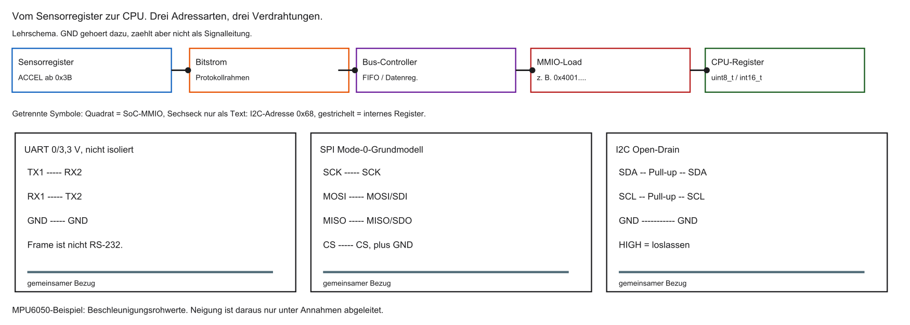

```{mermaid}
%%| fig-width: 3.8
%%{init: {'theme': 'base', 'themeVariables': {'background': '#FFFFFF', 'primaryColor': '#FFFFFF', 'primaryBorderColor': '#E5E5EA', 'primaryTextColor': '#1D1D1F', 'lineColor': '#86868B', 'secondaryColor': '#F5F5F7', 'tertiaryColor': '#FFFFFF', 'mainBkg': '#FFFFFF', 'nodeBorder': '#E5E5EA', 'clusterBkg': '#F5F5F7', 'clusterBorder': '#E5E5EA', 'titleColor': '#1D1D1F', 'edgeLabelBackground': '#FFFFFF'}}}%%
flowchart LR
  A[RISC-V SoC] <-->|Kupferbahnen| B[Sensor-Chip]
  style A fill:#FFFFFF,stroke:#E2001A,stroke-width:2px !important
```

::: notes
SoC und Sensor — Schema knüpft an den bisherigen Weg von Bits, Zeit und Teilnehmern an. MMIO ist speicherabgebildete Peripherie. 0x3B ist der Sensorregisterzeiger, 0x68 die 7-Bit-Geräteadresse, die SoC-Adresse des Controllers ist ein dritter Zahlenraum. Ein Load liest 0x68 nicht direkt. GND ist der elektrische Bezug. Verständnischeck: Liest die CPU 0x68 mit einem gewöhnlichen Load? Nein, die Adresse ist Teil der I²C-Transaktion. Die nächste Folie nimmt die noch offene Frage auf. Adressen und Zeiten sind Lehrannahmen. Code ist Lehrcode und wurde nicht kompiliert oder ausgeführt.
:::

## Parallel vs. seriell

Parallele Übertragung:

- Viele Leitungen (z. B. 32) — ein Wort in einem Takt
- So arbeiten typische interne CPU–RAM-Pfade

Serielle Übertragung:

- Wenige Leitungen (oft eine Datenleitung)
- Bits nacheinander — mehr Takte, weniger Pins

::: notes
Parallel vs. seriell knüpft an den bisherigen Weg von Bits, Zeit und Teilnehmern an. Acht parallele Datenbits können in einem Transferfenster liegen. Ein Einbitpfad braucht acht Bitzeiten plus Protokoll. Das ist kein allgemeines Geschwindigkeitsgesetz. USB und PCIe haben weitere Modelle. Viele Leitungen (z. B. 32) — ein Wort in einem Takt. So arbeiten typische interne CPU–RAM-Pfade. Verständnischeck: Wie viele Bitzeiten braucht ein Byte seriell ohne Overhead? Acht. Die nächste Folie nimmt die noch offene Frage auf. Adressen und Zeiten sind Lehrannahmen. Code ist Lehrcode und wurde nicht kompiliert oder ausgeführt.
:::

## Parallel vs. seriell — Schema

```{mermaid}
%%| fig-width: 3.8
%%{init: {'theme': 'base', 'themeVariables': {'background': '#FFFFFF', 'primaryColor': '#FFFFFF', 'primaryBorderColor': '#E5E5EA', 'primaryTextColor': '#1D1D1F', 'lineColor': '#86868B', 'secondaryColor': '#F5F5F7', 'tertiaryColor': '#FFFFFF', 'mainBkg': '#FFFFFF', 'nodeBorder': '#E5E5EA', 'clusterBkg': '#F5F5F7', 'clusterBorder': '#E5E5EA', 'titleColor': '#1D1D1F', 'edgeLabelBackground': '#FFFFFF'}}}%%
flowchart TD
  P[Parallel] -->|viele Leitungen| E1[Empfänger]
  S[Seriell] -->|Bit für Bit| E2[Empfänger]
  style S fill:#FFFFFF,stroke:#E2001A,stroke-width:2px !important
```

::: notes
Parallel vs. seriell — Schema knüpft an den bisherigen Weg von Bits, Zeit und Teilnehmern an. Links acht Leitungen und ein gültiges Fenster, rechts eine Leitung und acht Intervalle. Eine Takt- oder Referenzleitung kann zusätzlich nötig sein. Seriell spart Datenpins und kostet aufeinanderfolgende Bitzeiten. Laufzeit ist ausgeblendet. Verständnischeck: Was spart die serielle Variante? Datenpins. Sie braucht mehr Bitzeiten bei gleicher Symbolrate. Die nächste Folie nimmt die noch offene Frage auf. Adressen und Zeiten sind Lehrannahmen. Code ist Lehrcode und wurde nicht kompiliert oder ausgeführt.
:::

## Warum sich Seriell durchgesetzt hat

- Kosten und Platz: wenige Pins am Gehäuse sind günstiger
- Crosstalk: viele parallele Bahnen stören sich gegenseitig
- Clock Skew: bei hohen Frequenzen kommen Bits nicht mehr gleichzeitig an
- Seriell kann hohe Symbolraten auf wenigen Leitungen erreichen
- „Seriell ist schneller“ gilt nicht pauschal: Pins, Takt und Nutzdatenrate getrennt betrachten
- Mehrere serielle Lanes (USB, PCIe) sind ein anderes Modell als UART/SPI/I2C

::: notes
Warum sich Seriell durchgesetzt hat knüpft an den bisherigen Weg von Bits, Zeit und Teilnehmern an. Crosstalk ist Einkopplung, Skew unterschiedlicher Ankunftszeitpunkt. Ein gemeinsames Abtastfenster ist die Grenze, nicht das Scheitern jeder Parallelleitung. Eine hohe Symbolrate ist keine Nutzdatenrate. Eine Lane ist ein serieller Pfad. USB und PCIe sind andere Modelle. Kosten und Platz: wenige Pins am Gehäuse sind günstiger. Crosstalk: viele parallele Bahnen stören sich gegenseitig. Verständnischeck: Warum reicht die Symbolrate nicht? Kodierung, Framing, Pausen und Lanes zählen mit. Die nächste Folie nimmt die noch offene Frage auf. Adressen und Zeiten sind Lehrannahmen. Code ist Lehrcode und wurde nicht kompiliert oder ausgeführt.
:::

## Das Schieberegister

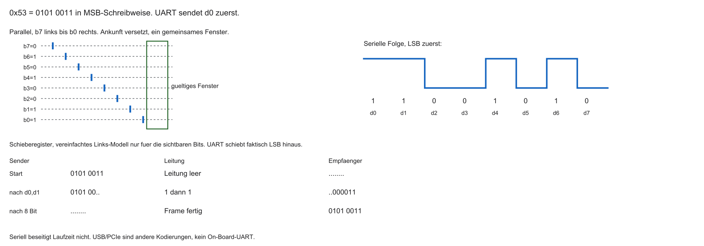

- Wandlung: parallele CPU-Daten → serieller Bitstrom
- Kern: Schieberegister (Kette von D-Flip-Flops, MCT1)
- CPU schreibt parallel; Kommunikations-Hardware schiebt Bit für Bit auf die Leitung
- Empfänger schiebt Bits wieder zu einem Wort zusammen

```{mermaid}
%%| fig-width: 4.0
%%{init: {'theme': 'base', 'themeVariables': {'background': '#FFFFFF', 'primaryColor': '#FFFFFF', 'primaryBorderColor': '#E5E5EA', 'primaryTextColor': '#1D1D1F', 'lineColor': '#86868B', 'secondaryColor': '#F5F5F7', 'tertiaryColor': '#FFFFFF', 'mainBkg': '#FFFFFF', 'nodeBorder': '#E5E5EA', 'clusterBkg': '#F5F5F7', 'clusterBorder': '#E5E5EA', 'titleColor': '#1D1D1F', 'edgeLabelBackground': '#FFFFFF'}}}%%
flowchart LR
  A[Bit 7] --> B[Bit 6] --> C[...] --> D[Bit 0] -->|Leitung| E[Empfänger]
  style D fill:#FFFFFF,stroke:#E2001A,stroke-width:2px !important
```

::: notes
Das Schieberegister knüpft an den bisherigen Weg von Bits, Zeit und Teilnehmern an. MSB ist das höchstwertige, LSB das niederwertigste Bit. 0x53 ist binär 0101 0011. UART sendet LSB zuerst: 1, 1, 0, 0, 1, 0, 1, 0. Ein Rechts-Schiebe-Modell mit Nullen ergibt nach zwei Schritten 0x14. Der Empfänger legt d_i auf Bit i. Das ist ein Lehrschieber, keine UART-Innenschaltung. Wandlung: parallele CPU-Daten → serieller Bitstrom. Kern: Schieberegister (Kette von D-Flip-Flops, MCT1). Verständnischeck: Warum beginnt die Leitung mit 1, obwohl links 0 steht? Auf Papier steht b7 links, gesendet wird b0. Die nächste Folie nimmt die noch offene Frage auf. Adressen und Zeiten sind Lehrannahmen. Code ist Lehrcode und wurde nicht kompiliert oder ausgeführt.
:::

## Synchron vs. asynchron

Synchrone Kommunikation:

- Eigene Taktleitung (Clock, z. B. SCK)
- Empfänger tastet bei klaren Taktflanken ab — robust und schnell

Asynchrone Kommunikation:

- Keine Taktleitung — nur Daten
- Beide Seiten brauchen vereinbarte Bitzeiten (Baudrate)

::: notes
Synchron vs. asynchron knüpft an den bisherigen Weg von Bits, Zeit und Teilnehmern an. Synchron heißt gemeinsamer Takt, hier oft eine eigene SCK-Leitung. UART ist asynchron ohne Clock-Draht, aber mit vereinbarter Bitdauer. Drei Nullen bleiben durch das Raster unterscheidbar. Der gemeinsame Takt beseitigt keine Laufzeit. Eigene Taktleitung (Clock, z. B. SCK). Empfänger tastet bei klaren Taktflanken ab — robust und schnell. Verständnischeck: Erkennt der Empfänger drei Nullen ohne Zwischenflanke? Ja, mit Raster und Framebeginn. Die nächste Folie nimmt die noch offene Frage auf. Adressen und Zeiten sind Lehrannahmen. Code ist Lehrcode und wurde nicht kompiliert oder ausgeführt.
:::

## Simplex, Half-Duplex, Full-Duplex

- Simplex: nur eine Richtung (z. B. GPS sendet Positionen)
- Half-Duplex: beide Richtungen, aber nicht gleichzeitig (ein Medium)
- Full-Duplex: getrennte Pfade — gleichzeitig senden und empfangen

```{mermaid}
%%| fig-width: 3.8
%%{init: {'theme': 'base', 'themeVariables': {'background': '#FFFFFF', 'primaryColor': '#FFFFFF', 'primaryBorderColor': '#E5E5EA', 'primaryTextColor': '#1D1D1F', 'lineColor': '#86868B', 'secondaryColor': '#F5F5F7', 'tertiaryColor': '#FFFFFF', 'mainBkg': '#FFFFFF', 'nodeBorder': '#E5E5EA', 'clusterBkg': '#F5F5F7', 'clusterBorder': '#E5E5EA', 'titleColor': '#1D1D1F', 'edgeLabelBackground': '#FFFFFF'}}}%%
flowchart LR
  A[A] -->|Simplex| B[B]
  C[1] <-->|Half-Duplex| D[2]
  E[1] -->|TX| F[2]
  F -->|TX| E
```

::: notes
Simplex, Half-Duplex, Full-Duplex knüpft an den bisherigen Weg von Bits, Zeit und Teilnehmern an. Simplex ist eine Nutzdatenrichtung, Half-Duplex beide nacheinander, Full-Duplex gleichzeitig. GPS ist hier nur ein Ausgabekanal. Eine SDA-Leitung mit abwechselndem Write und Read ist Half-Duplex. Simplex: nur eine Richtung (z. B. GPS sendet Positionen). Half-Duplex: beide Richtungen, aber nicht gleichzeitig (ein Medium). Verständnischeck: Ist eine SDA-Leitung Full-Duplex? Nein. Die nächste Folie nimmt die noch offene Frage auf. Adressen und Zeiten sind Lehrannahmen. Code ist Lehrcode und wurde nicht kompiliert oder ausgeführt.
:::

## Die Leitfrage des Tages

- Punkt-zu-Punkt ist einfach
- Moderne Platinen: viele Sensoren/Chips an einer CPU
- Nicht für jeden Teilnehmer eigene Leitungsbündel (Pin-Mangel)
- Wie teilen sich viele Geräte wenige Pins, ohne Chaos und Kurzschluss?

::: notes
Die Leitfrage des Tages knüpft an den bisherigen Weg von Bits, Zeit und Teilnehmern an. Drei Sensoren brauchen entweder weitere Punktverbindungen oder eine Auswahlregel. Zwei gegensätzliche Push-Pull-Treiber können einen elektrischen Konflikt erzeugen. Open-Drain funktioniert anders. Pins, Geschwindigkeit und Adressen zählen zusammen. Punkt-zu-Punkt ist einfach. Moderne Platinen: viele Sensoren/Chips an einer CPU. Verständnischeck: Welche zwei Regeln braucht eine geteilte Leitung? Wer sprechen darf und wie der Pegel entsteht. Die nächste Folie nimmt die noch offene Frage auf. Adressen und Zeiten sind Lehrannahmen. Code ist Lehrcode und wurde nicht kompiliert oder ausgeführt.
:::

## Leitfrage — Schema

```{mermaid}
%%| fig-width: 3.4
%%{init: {'theme': 'base', 'themeVariables': {'background': '#FFFFFF', 'primaryColor': '#FFFFFF', 'primaryBorderColor': '#E5E5EA', 'primaryTextColor': '#1D1D1F', 'lineColor': '#86868B', 'secondaryColor': '#F5F5F7', 'tertiaryColor': '#FFFFFF', 'mainBkg': '#FFFFFF', 'nodeBorder': '#E5E5EA', 'clusterBkg': '#F5F5F7', 'clusterBorder': '#E5E5EA', 'titleColor': '#1D1D1F', 'edgeLabelBackground': '#FFFFFF'}}}%%
flowchart TD
  CPU[CPU] --> S1[Sensor 1]
  CPU --> S2[Sensor 2]
  CPU --> Sn[Sensor n]
  style CPU fill:#FFFFFF,stroke:#E2001A,stroke-width:2px !important
```

::: notes
Leitfrage — Schema knüpft an den bisherigen Weg von Bits, Zeit und Teilnehmern an. Die Pfeile zeigen Kommunikationsbedarf, keine Kabel. UART bleibt typischerweise ein Direktlink, SPI teilt Leitungen mit eigener CS, I²C teilt SDA und SCL. Dieselbe Sternzeichnung ist kein gemeinsamer Busplan. Verständnischeck: Warum kein I²C-Kabelplan? Pull-ups und die gemeinsamen Netze fehlen. Die nächste Folie nimmt die noch offene Frage auf. Adressen und Zeiten sind Lehrannahmen. Code ist Lehrcode und wurde nicht kompiliert oder ausgeführt.
:::

## Agenda: Die „Big 3“

Industrie-Standards für On-Board-Kommunikation:

1. UART — asynchron, Punkt-zu-Punkt
2. SPI — synchron, sehr schnell (Displays, Flash)
3. I2C — synchron, Netzwerk auf zwei Leitungen

| | UART | SPI | I2C |
|--|------|-----|-----|
| Signale ohne GND | 2 | 4, plus weitere CS | 2 |
| Takt | asynchron | synchron | synchron |
| Duplex | Full | Full im 4-Signal-Modell | Half |
| Grundtempo | Baud plus Framing | SCK aus dem Timingbudget | 100/400 kHz als Fokus |

::: notes
Agenda: Die „Big 3“ knüpft an den bisherigen Weg von Bits, Zeit und Teilnehmern an. UART im Voll-Duplex-Grundmodell: TX und RX. SPI für ein Target: SCK, MOSI, MISO, CS. Drei Targets: drei gemeinsame Signale plus drei CS, also sechs Pins, plus Bezug. I²C: SDA und SCL. GND und Versorgung zählen extra. 100 und 400 kHz sind der Fokus, nicht die Obergrenze. Verständnischeck: Wie viele Signalpins bei drei SPI-Targets? Sechs plus elektrischer Bezug. Die nächste Folie nimmt die noch offene Frage auf. Adressen und Zeiten sind Lehrannahmen. Code ist Lehrcode und wurde nicht kompiliert oder ausgeführt.
:::

## Lernziele Block 5

- UART, SPI und I2C nach Pins, Takt und Topologie einordnen
- UART-Frame (Start/Stop/Parity) und Baudrate erklären
- SPI-Modi (CPOL/CPHA) und Chip-Select begründen
- I2C-Transaktion inkl. ACK/NACK und Repeated Start nachvollziehen
- Single-Ended vs. differenziell und EMI-Grundlagen einordnen

::: notes
Lernziele Block 5 knüpft an den bisherigen Weg von Bits, Zeit und Teilnehmern an. Prüfbar sind UART-Dekodierung, SPI-Flanken, ein I²C-Read mit Rollen und elektrische Grenzen. CPOL ist die Idle-Polarität, CPHA die Abtastphase. ACK bestätigt, NACK lehnt ab oder beendet. EMI ist elektromagnetische Störung. Harris ergänzt, ersetzt die Erklärung nicht. UART, SPI und I2C nach Pins, Takt und Topologie einordnen. UART-Frame (Start/Stop/Parity) und Baudrate erklären. Verständnischeck: Was ist prüfbar? Start, Datenreihenfolge, Stop und Bytewert einer Zeitlinie benennen. Die nächste Folie nimmt die noch offene Frage auf. Adressen und Zeiten sind Lehrannahmen. Code ist Lehrcode und wurde nicht kompiliert oder ausgeführt.
:::

## Was ist UART?

- UART: Universal Asynchronous Receiver-Transmitter
- Eher Schnittstelle/Direktverbindung als Multi-Drop-Bus
- Asynchron: kein Taktkabel
- Der UART-Frame ist nicht die elektrische Schnittstelle
- RS-232 nutzt andere Pegel; ein 0/3,3-V-Pin darf daran nicht direkt
- Heute oft: Debug/`printf` über einen Pegelwandler oder USB-UART

::: notes
Was ist UART knüpft an den bisherigen Weg von Bits, Zeit und Teilnehmern an. UART heißt Universal Asynchronous Receiver/Transmitter. Das Frameformat ist nicht der elektrische Standard. 3,3-V-Pins sind kein RS-232. Ein USB-UART-Adapter ist eine Brücke, kein passives Kabel. printf braucht eine Ausgabeanbindung. Mindestens ein UART ist ein Beispiel, kein RISC-V-Zwang. UART: Universal Asynchronous Receiver-Transmitter. Eher Schnittstelle/Direktverbindung als Multi-Drop-Bus. Verständnischeck: Darf 3,3 V direkt an RS-232? Nein. Die nächste Folie nimmt die noch offene Frage auf. Adressen und Zeiten sind Lehrannahmen. Code ist Lehrcode und wurde nicht kompiliert oder ausgeführt.
:::

## Punkt-zu-Punkt

- Typisch genau zwei Teilnehmer
- TX (Transmit) und RX (Receive)
- Kreuzverkabelung: TX1 → RX2, TX2 → RX1
- Direktes 0/3,3-V-Modell: gemeinsamer Bezug zwingend, keine galvanische Trennung
- Full-Duplex auf zwei Datenleitungen; GND, Versorgung und RTS/CTS zählen extra

```{mermaid}
%%| fig-width: 3.8
%%{init: {'theme': 'base', 'themeVariables': {'background': '#FFFFFF', 'primaryColor': '#FFFFFF', 'primaryBorderColor': '#E5E5EA', 'primaryTextColor': '#1D1D1F', 'lineColor': '#86868B', 'secondaryColor': '#F5F5F7', 'tertiaryColor': '#FFFFFF', 'mainBkg': '#FFFFFF', 'nodeBorder': '#E5E5EA', 'clusterBkg': '#F5F5F7', 'clusterBorder': '#E5E5EA', 'titleColor': '#1D1D1F', 'edgeLabelBackground': '#FFFFFF'}}}%%
flowchart LR
  T1[Gerät 1 TX] -->|Kabel| R2[Gerät 2 RX]
  R1[Gerät 1 RX] -->|Kabel| T2[Gerät 2 TX]
```

::: notes
Punkt-zu-Punkt knüpft an den bisherigen Weg von Bits, Zeit und Teilnehmern an. TX ist der Ausgang, RX der Eingang des jeweiligen Geräts. TX1 geht an RX2. Der direkte Link hat keine galvanische Trennung. RTS und CTS sind optionaler Flusskontroll-Handshake. Ein drittes Gerät braucht eine andere Topologie. Typisch genau zwei Teilnehmer. TX (Transmit) und RX (Receive). Verständnischeck: Warum TX1 an RX2? Der Ausgang muss den Eingang erreichen. Die nächste Folie nimmt die noch offene Frage auf. Adressen und Zeiten sind Lehrannahmen. Code ist Lehrcode und wurde nicht kompiliert oder ausgeführt.
:::

## Die Asynchronität

- Kein Taktkabel
- Problem: Ist HIGH eine Eins oder fünf Einsen hintereinander?
- Lösung: vereinbarte Bitdauer — gleiche Baudrate auf beiden Seiten

::: notes
Die Asynchronität knüpft an den bisherigen Weg von Bits, Zeit und Teilnehmern an. Fünf Einsen bleiben HIGH. Nur Bitdauer und Framegrenzen bestimmen die Zahl. Falsche Baudrate erzeugt falsche Daten oder einen Framefehler, nicht bloß unspezifischen Müll. Kein Taktkabel. Problem: Ist HIGH eine Eins oder fünf Einsen hintereinander?. Verständnischeck: Sind zwei dauerhafte HIGH-Leitungen dasselbe Byte? Nein, ohne Rahmen ist der Inhalt offen. Die nächste Folie nimmt die noch offene Frage auf. Adressen und Zeiten sind Lehrannahmen. Code ist Lehrcode und wurde nicht kompiliert oder ausgeführt.
:::

## Die Baudrate

- Baud: Symbole pro Sekunde; hier typisch 1 Bit pro Symbol → bps
- Klassiker: 9600 oder 115200 Baud
- Bei 115200 Baud: Bitdauer $\approx 1/115200 \approx 8{,}68\,\mu\mathrm{s}$
- Prescaler/Baud-Generator aus Systemtakt in C konfigurieren

::: notes
Die Baudrate knüpft an den bisherigen Weg von Bits, Zeit und Teilnehmern an. Bei einem Bit je Symbol sind Baud und Leitungsbitrate gleich. 115200 Baud ergeben etwa 8,681 µs je Bit. 8N1 braucht zehn Symbole, höchstens 11520 Byte/s ohne Pausen. Ein realer Teiler kann abweichen. Baud: Symbole pro Sekunde; hier typisch 1 Bit pro Symbol → bps. Klassiker: 9600 oder 115200 Baud. Verständnischeck: Warum nicht 115200 Byte/s? Zehn Symbole je Byte ergeben 11520. Die nächste Folie nimmt die noch offene Frage auf. Adressen und Zeiten sind Lehrannahmen. Code ist Lehrcode und wurde nicht kompiliert oder ausgeführt.
:::

## Der UART-Frame

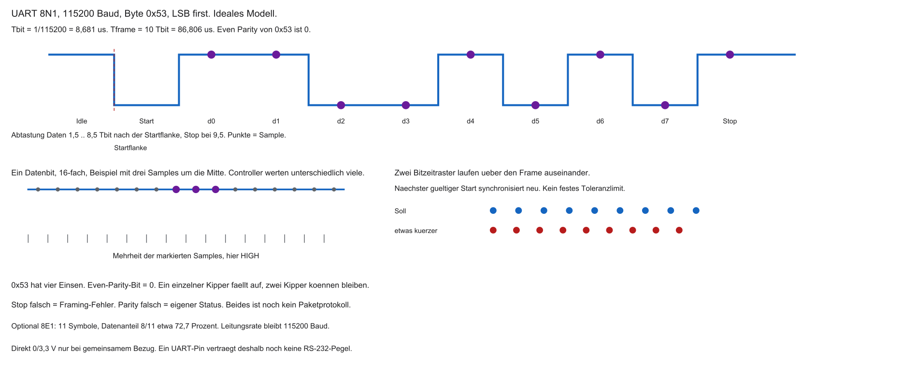

- Idle: Leitung typisch HIGH
- Frame-Aufbau:
  - Start-Bit: LOW
  - Daten: meist 8 Bit (oft LSB first)
  - Parity: optional
  - Stop-Bit(s): HIGH

| Abschnitt | Pegel / Inhalt |
|-----------|----------------|
| Idle | HIGH |
| Start | LOW |
| Data | 8 Bits |
| Stop | HIGH |

::: notes
Der UART-Frame knüpft an den bisherigen Weg von Bits, Zeit und Teilnehmern an. 8N1: acht Datenbits, keine Parität, ein Stop. Idle HIGH, Start LOW, Daten LSB zuerst, Stop HIGH. Zehn Symbole dauern etwa 86,806 µs. Even-Parity 0 gehört zur getrennten 8E1-Variante mit elf Symbolen. Idle: Leitung typisch HIGH. Frame-Aufbau:. Verständnischeck: Wie viele Symbole hat 8E1? Elf. Die nächste Folie nimmt die noch offene Frage auf. Adressen und Zeiten sind Lehrannahmen. Code ist Lehrcode und wurde nicht kompiliert oder ausgeführt.
:::

## Das Start-Bit

- Start-Bit (LOW): Synchronisations-Trigger
- Fallende Flanke Idle→Start startet die Baud-Uhr des Empfängers
- Abtastung typisch nahe der Bitmitte (erstes Datenbit nach $\approx 1{,}5$ Bitzeiten)
- Danach Abtastung im Raster von 1 Bitzeit; nach dem Frame Uhr stoppen

::: notes
Das Start-Bit knüpft an den bisherigen Weg von Bits, Zeit und Teilnehmern an. Die Startflanke setzt die Phase, nicht die Baudrate. Die Mitte von d0 liegt bei 1,5 Bitzeiten, etwa 13,021 µs. d7 bei 8,5, Stop bei 9,5. Uhr stoppen meint das Ende dieser Frameabtastung, nicht zwingend das Abschalten des Generators. Start-Bit (LOW): Synchronisations-Trigger. Fallende Flanke Idle→Start startet die Baud-Uhr des Empfängers. Verständnischeck: Wann ist die ideale Mitte des ersten Datenbits? Nach etwa 13,021 µs. Die nächste Folie nimmt die noch offene Frage auf. Adressen und Zeiten sind Lehrannahmen. Code ist Lehrcode und wurde nicht kompiliert oder ausgeführt.
:::

## Oversampling

- Empfänger tastet oft mehrfach pro Bit ab (z. B. 16×)
- Mehrheitsentscheid um die Bitmitte filtert kurze Spikes
- Erhöht Robustheit bei gestörten Leitungen

::: notes
Oversampling knüpft an den bisherigen Weg von Bits, Zeit und Teilnehmern an. 16-fach ist eine häufige Architektur, keine Norm. Drei Samples um die Mitte können mehrheitlich entscheiden. 1, 0, 1 ergibt 1. Das mittelt nicht alle 16 Punkte und beweist keine beliebige Störfestigkeit. Empfänger tastet oft mehrfach pro Bit ab (z. B. 16×). Mehrheitsentscheid um die Bitmitte filtert kurze Spikes. Verständnischeck: Was ergibt die Mehrheit 1, 0, 1? Datenbit 1. Die nächste Folie nimmt die noch offene Frage auf. Adressen und Zeiten sind Lehrannahmen. Code ist Lehrcode und wurde nicht kompiliert oder ausgeführt.
:::

## Clock Drift und Stop-Bit

- Quarze weichen ab (Temperatur, Toleranz) → Clock Drift
- Lange ununterbrochene Ströme würden Abtastpunkte verschieben
- Start-Bit kalibriert neu; Stop-Bit (HIGH) stellt Idle wieder her
- Nächstes Start-Bit erzeugt wieder eine klare fallende Flanke

::: notes
Clock Drift und Stop-Bit knüpft an den bisherigen Weg von Bits, Zeit und Teilnehmern an. Das Start-Bit richtet die Phase neu aus und kalibriert die Frequenz nicht. Das Stop-Bit prüft HIGH. Ein Empfänger mit 1,02-facher Bitzeit verschiebt die Stop-Probe um 0,19 Senderbitzeiten. Daraus folgt keine universelle Prozentgrenze. LOW im Stop ist ein Framing-Fehler, getrennt von Parität. Quarze weichen ab (Temperatur, Toleranz) → Clock Drift. Lange ununterbrochene Ströme würden Abtastpunkte verschieben. Verständnischeck: Was bedeutet Stop gleich LOW? Ein Framing-Fehler. Die nächste Folie nimmt die noch offene Frage auf. Adressen und Zeiten sind Lehrannahmen. Code ist Lehrcode und wurde nicht kompiliert oder ausgeführt.
:::

## Das Parity-Bit

- Optional: Even oder Odd Parity über die Datenbits
- Empfänger prüft; bei Fehler oft Status/Interrupt (Framing/Parity Error)

| Daten (Beispiel) | Einsen | Even | Odd |
|------------------|--------|------|-----|
| `1010 0001` | 3 | 1 | 0 |
| `0000 0000` | 0 | 0 | 1 |
| `0x53` = `0101 0011` | 4 | 0 | 1 |

::: notes
Das Parity-Bit knüpft an den bisherigen Weg von Bits, Zeit und Teilnehmern an. 0x53 hat vier Einsen, Even-Parity ist 0, Odd ist 1. Bei 1010 0001 sind drei Einsen, Even ist 1. Zwei gekippte Bits ändern die Parität nicht. CRC wäre eine stärkere, hier nicht ausgeführte Schicht. Optional: Even oder Odd Parity über die Datenbits. Empfänger prüft; bei Fehler oft Status/Interrupt (Framing/Parity Error). Verständnischeck: Erkennt Even zwei gekippte Bits? Nein. Die nächste Folie nimmt die noch offene Frage auf. Adressen und Zeiten sind Lehrannahmen. Code ist Lehrcode und wurde nicht kompiliert oder ausgeführt.
:::

## FIFOs im UART

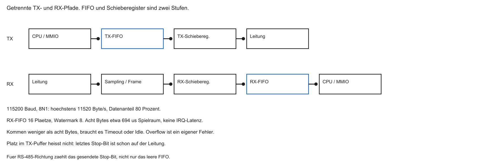

- Bei 115200 Baud und 8N1 (10 Bit/Frame): grob alle $\approx 87\,\mu\mathrm{s}$ ein Byte
- Interrupt pro Byte belastet die CPU stark
- Lösung: RX/TX-FIFOs (z. B. 16–64 Bytes), Interrupt bei Watermark

```{mermaid}
%%| fig-width: 3.8
%%{init: {'theme': 'base', 'themeVariables': {'background': '#FFFFFF', 'primaryColor': '#FFFFFF', 'primaryBorderColor': '#E5E5EA', 'primaryTextColor': '#1D1D1F', 'lineColor': '#86868B', 'secondaryColor': '#F5F5F7', 'tertiaryColor': '#FFFFFF', 'mainBkg': '#FFFFFF', 'nodeBorder': '#E5E5EA', 'clusterBkg': '#F5F5F7', 'clusterBorder': '#E5E5EA', 'titleColor': '#1D1D1F', 'edgeLabelBackground': '#FFFFFF'}}}%%
flowchart LR
  K[Kabel] --> F[UART-FIFO]
  F -->|Watermark| ISR[CPU-ISR]
  style F fill:#FFFFFF,stroke:#E2001A,stroke-width:2px !important
```

::: notes
FIFOs im UART knüpft an den bisherigen Weg von Bits, Zeit und Teilnehmern an. FIFO heißt First In, First Out. Bei 8N1 und 115200 Baud kommt etwa alle 86,806 µs ein Byte, höchstens 11520 Byte/s. Acht freie Plätze sind grob 694 µs Spielraum, wenn der Strom nicht pausiert. Eine Watermark löst Bedienung aus, sie ist kein abgeschlossenes Lesen. Überlauf ist kein Paritätsfehler. Bei 115200 Baud und 8N1 (10 Bit/Frame): grob alle $\approx 87\,\mu\mathrm{s}$ ein Byte. Interrupt pro Byte belastet die CPU stark. Verständnischeck: Warum ist ein voller FIFO problematisch? Das nächste Byte kann nicht mehr aufgenommen werden. Die nächste Folie nimmt die noch offene Frage auf. Adressen und Zeiten sind Lehrannahmen. Code ist Lehrcode und wurde nicht kompiliert oder ausgeführt.
:::

## Nachteile von UART

- Keine Geräteadressen → schlecht skalierbar (kein Multi-Drop)
- Baudrate muss auf beiden Seiten übereinstimmen (starr konfiguriert)
- Framing-Overhead (Start/Stop/Parity) und asynchrone Grenzen
- Für Displays/Kameras/viele Sensoren meist ungeeignet

::: notes
Nachteile von UART knüpft an den bisherigen Weg von Bits, Zeit und Teilnehmern an. Ein Standardframe hat keine Geräteadresse. Höhere Protokolle können trotzdem adressieren. Autobaud existiert bei manchen Controllern. 100 kByte/s passen nicht in 11,52 kByte/s Nutzdaten. Keine Geräteadressen → schlecht skalierbar (kein Multi-Drop). Baudrate muss auf beiden Seiten übereinstimmen (starr konfiguriert). Verständnischeck: Passt ein Dauerstrom von 100 kByte/s? Nein. Die nächste Folie nimmt die noch offene Frage auf. Adressen und Zeiten sind Lehrannahmen. Code ist Lehrcode und wurde nicht kompiliert oder ausgeführt.
:::

## Zusammenfassung UART

| Eigenschaft | UART |
|-------------|------|
| Leitungen | TX, RX (+ GND) |
| Takt | asynchron (Baudrate) |
| Duplex | Full-Duplex |
| Topologie | Point-to-Point (2 Teilnehmer) |
| Overhead | Start/Stop/(Parity) |
| Einsatz | Terminal, GPS, Bluetooth-Module |

::: notes
Zusammenfassung UART knüpft an den bisherigen Weg von Bits, Zeit und Teilnehmern an. Im Direktmodell: TX, RX und Bezug, keine eigene Clock, zwei Endpunkte, Framing. GPS und Bluetooth sind Beispiele mit möglichen Zusatzleitungen. 11520 Byte/s gilt nur für 115200 Baud und 8N1. Die Nutzdatenrate ist kleiner als der Baudwert, weil Start und Stop Symbole belegen. Verständnischeck: Was unterscheidet Nutzdatenrate und Baud? Start, Stop und gegebenenfalls Parität. Die nächste Folie nimmt die noch offene Frage auf. Adressen und Zeiten sind Lehrannahmen. Code ist Lehrcode und wurde nicht kompiliert oder ausgeführt.
:::

## Aufgabe — UART-Frame

Dekodieren Sie das Datenbyte. Idle ist HIGH, dann folgen Start, acht Datenbits LSB first und Stop.

- Sichtbare Datenbits nach dem Start: 1, 1, 0, 0, 1, 0, 1, 0
- Welche schriftliche MSB-Darstellung hat das Byte?
- Even Parity: welches Parity-Bit entsteht?

::: notes
Aufgabe — UART-Frame knüpft an den bisherigen Weg von Bits, Zeit und Teilnehmern an. Die Folge 1, 1, 0, 0, 1, 0, 1, 0 hat die Gewichte 1, 2, 16 und 64, Summe 83, also 0x53. Schriftlich ist das 0101 0011. Even-Parity wäre 0, aber nur in einer 8E1-Frage. Als MSB zuerst gelesen wäre dieselbe Folge 0xCA. Sichtbare Datenbits nach dem Start: 1, 1, 0, 0, 1, 0, 1, 0. Welche schriftliche MSB-Darstellung hat das Byte?. Verständnischeck: Was ergäbe MSB-first? 0xCA. Die nächste Folie nimmt die noch offene Frage auf. Adressen und Zeiten sind Lehrannahmen. Code ist Lehrcode und wurde nicht kompiliert oder ausgeführt.
:::

## Was ist SPI?

- SPI: Serial Peripheral Interface (u. a. Motorola, 1980er)
- Synchron: eigene Taktleitung — kein Baudraten-Drift wie bei UART
- Full-Duplex, oft sehr hohe SCK-Taktraten (einige zehn MHz möglich; Bitrate $\approx$ SCK bei 1 Bit/Takt)
- Wenig Framing-Overhead: Bits folgen dem Takt

::: notes
Was ist SPI knüpft an den bisherigen Weg von Bits, Zeit und Teilnehmern an. SPI ist Serial Peripheral Interface, eine Familie mit gerätespezifischem Timing. Ein Bit je Takt bei 10 MHz sind nominal 10 Mbit/s je Richtung, vor Pausen und Kommandos. Full-Duplex heißt nicht, dass jedes Empfangsbyte nützlich ist. 5 MHz Datenblattgrenze verbietet 20 MHz. SPI: Serial Peripheral Interface (u. a. Motorola, 1980er). Synchron: eigene Taktleitung — kein Baudraten-Drift wie bei UART. Verständnischeck: Darf ein 5-MHz-Target mit 20 MHz laufen? Nein. Die nächste Folie nimmt die noch offene Frage auf. Adressen und Zeiten sind Lehrannahmen. Code ist Lehrcode und wurde nicht kompiliert oder ausgeführt.
:::

## Die Synchronität (SCK)

- Taktleitung: SCK (Serial Clock)
- Empfänger braucht keinen eigenen Baud-Generator
- Typisch: bei definierter Flanke Datenleitung abtasten
- Deterministisch, unempfindlich gegen Quarz-Abweichungen zwischen den Chips

| Phase | Bedeutung |
|-------|-----------|
| SCK-Flanke | Abtast-/Verschiebezeitpunkt |
| Datenleitung | gültiges Bit im vereinbarten Fenster |

::: notes
Die Synchronität (SCK) knüpft an den bisherigen Weg von Bits, Zeit und Teilnehmern an. Eine Flanke bereitet Daten vor, die andere tastet ab. Setup ist die stabile Zeit davor, Hold danach. Der gemeinsame Takt verhindert UART-Drift, nicht Laufzeit. Ein fiktives Budget: 4 ns hin, 12 ns Antwort, 4 ns zurück, 5 ns Setup. Bei 10 MHz bleiben 25 ns, bei 25 MHz fehlen 5 ns. Das sind Annahmen. Taktleitung: SCK (Serial Clock). Empfänger braucht keinen eigenen Baud-Generator. Verständnischeck: Warum kommt ein Bit zu spät? Der Weg über das Target braucht endliche Zeit. Die nächste Folie nimmt die noch offene Frage auf. Adressen und Zeiten sind Lehrannahmen. Code ist Lehrcode und wurde nicht kompiliert oder ausgeführt.
:::

## Die 4-Draht-Architektur

Klassisch 4 Signale (+ GND):

| Signal | Richtung | Zweck |
|--------|----------|--------|
| SCK | Master → Slave | Takt |
| MOSI | Master → Slave | Daten zum Slave |
| MISO | Slave → Master | Daten zum Master |
| CS / SS | Master → Slave | Slave auswählen (meist Active-Low) |

::: notes
Die 4-Draht-Architektur knüpft an den bisherigen Weg von Bits, Zeit und Teilnehmern an. MOSI ist Controller-Ausgang, MISO Controller-Eingang. SDO und SDI sind aus Sicht des Bausteins. Target-SDO geht an MISO. CS ist oft Active-Low. Vier Signale zählen Versorgung und GND nicht mit. Verständnischeck: Wohin gehört Target-SDO? Zum Controller-Dateneingang, klassisch MISO. Die nächste Folie nimmt die noch offene Frage auf. Adressen und Zeiten sind Lehrannahmen. Code ist Lehrcode und wurde nicht kompiliert oder ausgeführt.
:::

## Controller und Target

Ältere Datenblätter sagen Master und Slave. Hier: Controller und Target. MOSI und MISO bleiben die Signalnamen.

- Controller (meist die MCU): erzeugt SCK, steuert CS, startet Transfers
- Target: antwortet nur, wenn selektiert und getaktet
- Ein Controller: ein aktiver Taktgeber in diesem Grundmodell
- Das Target sendet nicht unaufgefordert

::: notes
Controller und Target knüpft an den bisherigen Weg von Bits, Zeit und Teilnehmern an. Der Controller erzeugt SCK und CS. Das Target treibt MISO nur im passenden Transfer. Ein separater IRQ kann Bereitschaft melden, ohne den Transfer zu starten. Zwei aktive MISO-Treiber können trotzdem kollidieren. Controller (meist die MCU): erzeugt SCK, steuert CS, startet Transfers. Target: antwortet nur, wenn selektiert und getaktet. Verständnischeck: Wie kündigt ein Sensor Daten an? Zum Beispiel über eine eigene IRQ-Leitung. Die nächste Folie nimmt die noch offene Frage auf. Adressen und Zeiten sind Lehrannahmen. Code ist Lehrcode und wurde nicht kompiliert oder ausgeführt.
:::

## Full-Duplex: Ringtausch

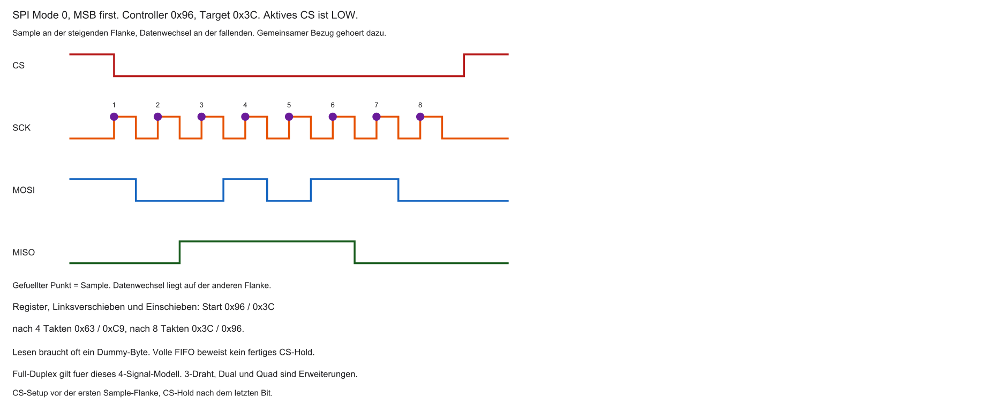

- Pro Takt: Bit auf MOSI hinaus und Bit auf MISO herein
- Nach $n$ Takten: Schieberegister getauscht
- Auch zum reinen Lesen: Dummy-Bytes senden, damit SCK läuft

```{mermaid}
%%| fig-width: 3.6
%%{init: {'theme': 'base', 'themeVariables': {'background': '#FFFFFF', 'primaryColor': '#FFFFFF', 'primaryBorderColor': '#E5E5EA', 'primaryTextColor': '#1D1D1F', 'lineColor': '#86868B', 'secondaryColor': '#F5F5F7', 'tertiaryColor': '#FFFFFF', 'mainBkg': '#FFFFFF', 'nodeBorder': '#E5E5EA', 'clusterBkg': '#F5F5F7', 'clusterBorder': '#E5E5EA', 'titleColor': '#1D1D1F', 'edgeLabelBackground': '#FFFFFF'}}}%%
flowchart LR
  M[Master-Schieberegister] -->|MOSI| S[Slave-Schieberegister]
  S -->|MISO| M
  style M fill:#FFFFFF,stroke:#E2001A,stroke-width:2px !important
```

::: notes
Full-Duplex: Ringtausch knüpft an den bisherigen Weg von Bits, Zeit und Teilnehmern an. Mode 0, MSB zuerst. 0x96 und 0x3C tauschen gleichzeitig ihre alten MSBs. Nach einem Takt stehen 0x2C und 0x79, nach vier 0x63 und 0xC9, nach acht 0x3C und 0x96. Das sind Modellregister, nicht garantiert lesbare Zwischenstände. Ein Read braucht Takte, oft durch Dummybytes. Pro Takt: Bit auf MOSI hinaus und Bit auf MISO herein. Nach $n$ Takten: Schieberegister getauscht. Verständnischeck: Warum Takte beim Lesen? Ohne SCK schiebt das Target nicht. Die nächste Folie nimmt die noch offene Frage auf. Adressen und Zeiten sind Lehrannahmen. Code ist Lehrcode und wurde nicht kompiliert oder ausgeführt.
:::

## Chip Select (CS)

- SCK/MOSI/MISO parallel an mehrere Slaves möglich
- CS wählt den aktiven Slave (meist Active-Low)
- Andere Slaves: Bus ignorieren, MISO hochohmig

::: notes
Chip Select (CS) knüpft an den bisherigen Weg von Bits, Zeit und Teilnehmern an. Ein aktives Target und hochohmige andere MISO-Ausgänge sind die Voraussetzung. CS rahmt oft das Kommando. Ignorieren von MOSI heißt nicht, dass MISO schweigt. Zwei gegensätzliche Push-Pull-Treiber sind ein Konflikt. SCK/MOSI/MISO parallel an mehrere Slaves möglich. CS wählt den aktiven Slave (meist Active-Low). Verständnischeck: Warum reicht Ignorieren nicht? Der MISO-Ausgang muss hochohmig sein. Die nächste Folie nimmt die noch offene Frage auf. Adressen und Zeiten sind Lehrannahmen. Code ist Lehrcode und wurde nicht kompiliert oder ausgeführt.
:::

## Star-Routing

- Jeder Slave: eigenes CS → eigener GPIO am Master
- 10 Slaves ≈ 3 Busleitungen + 10 CS = viele Pins
- SPI skaliert bei vielen Teilnehmern pinseitig schlecht

```{mermaid}
%%| fig-width: 3.8
%%{init: {'theme': 'base', 'themeVariables': {'background': '#FFFFFF', 'primaryColor': '#FFFFFF', 'primaryBorderColor': '#E5E5EA', 'primaryTextColor': '#1D1D1F', 'lineColor': '#86868B', 'secondaryColor': '#F5F5F7', 'tertiaryColor': '#FFFFFF', 'mainBkg': '#FFFFFF', 'nodeBorder': '#E5E5EA', 'clusterBkg': '#F5F5F7', 'clusterBorder': '#E5E5EA', 'titleColor': '#1D1D1F', 'edgeLabelBackground': '#FFFFFF'}}}%%
flowchart LR
  CPU -->|SCK MOSI MISO| S1[Slave 1]
  CPU -->|SCK MOSI MISO| S2[Slave 2]
  CPU -->|CS1| S1
  CPU -->|CS2| S2
  style CPU fill:#FFFFFF,stroke:#E2001A,stroke-width:2px !important
```

::: notes
Star-Routing knüpft an den bisherigen Weg von Bits, Zeit und Teilnehmern an. Der Stern teilt SCK, MOSI und MISO und gibt jedem Target eine CS. Zehn Targets brauchen drei gemeinsame Signale plus zehn CS, also 13 Signalpins, plus Bezug. Das ist ein Nachteil, keine starre Obergrenze. Jeder Slave: eigenes CS → eigener GPIO am Master. 10 Slaves ≈ 3 Busleitungen + 10 CS = viele Pins. Verständnischeck: Warum reichen drei gemeinsame Signale nicht? Die Auswahl braucht je Target einen CS-Pfad. Die nächste Folie nimmt die noch offene Frage auf. Adressen und Zeiten sind Lehrannahmen. Code ist Lehrcode und wurde nicht kompiliert oder ausgeführt.
:::

## Daisy-Chaining

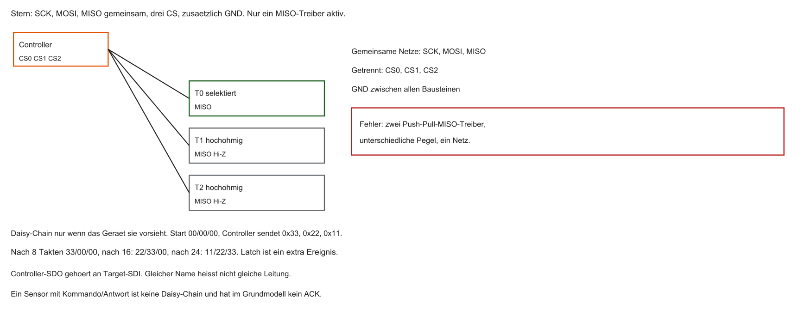

- Ein CS für mehrere Schieberegister in Serie
- MOSI → Slave1 → … → zurück MISO
- CPU schiebt lange Bitkette; Daten wandern durch die Kette
- Typisch bei LED-Ketten / Schieberegister-Arrays

```{mermaid}
%%| fig-width: 3.8
%%{init: {'theme': 'base', 'themeVariables': {'background': '#FFFFFF', 'primaryColor': '#FFFFFF', 'primaryBorderColor': '#E5E5EA', 'primaryTextColor': '#1D1D1F', 'lineColor': '#86868B', 'secondaryColor': '#F5F5F7', 'tertiaryColor': '#FFFFFF', 'mainBkg': '#FFFFFF', 'nodeBorder': '#E5E5EA', 'clusterBkg': '#F5F5F7', 'clusterBorder': '#E5E5EA', 'titleColor': '#1D1D1F', 'edgeLabelBackground': '#FFFFFF'}}}%%
flowchart LR
  CPU -->|MOSI| S1[Slave 1]
  S1 --> S2[Slave 2]
  S2 -->|MISO| CPU
```

::: notes
Daisy-Chaining knüpft an den bisherigen Weg von Bits, Zeit und Teilnehmern an. Die Kette führt Daten vom Controller durch geeignete Bausteine. Start 00, 00, 00 und Sendefolge 33, 22, 11 ergeben nach 8, 16 und 24 Takten 33/00/00, 22/33/00 und 11/22/33. Das fernste Byte 33 wird zuerst gesendet. Ein Latch kann danach übernehmen. Nicht jeder Sensor ist verkettbar. Ein CS für mehrere Schieberegister in Serie. MOSI → Slave1 → … → zurück MISO. Verständnischeck: Welches Byte zuerst für das ferne Register 33? 33. Die nächste Folie nimmt die noch offene Frage auf. Adressen und Zeiten sind Lehrannahmen. Code ist Lehrcode und wurde nicht kompiliert oder ausgeführt.
:::

## Push-Pull und Geschwindigkeit

- SPI-Treiber typisch Push-Pull: aktiv HIGH und aktiv LOW
- Steile Flanken, schnelles Umladen der Leitungskapazität
- Ermöglicht hohe SCK-Frequenzen (je nach Layout und Slave)

::: notes
Push-Pull und Geschwindigkeit knüpft an den bisherigen Weg von Bits, Zeit und Teilnehmern an. Push-Pull treibt aktiv HIGH und LOW. Steile Flanken helfen kurzen Bits und können Störungen erhöhen. Open-Drain ist das spätere gemeinsame Prinzip, nicht pauschal robuster. Nicht gewählte MISO-Treiber müssen hochohmig sein. SPI-Treiber typisch Push-Pull: aktiv HIGH und aktiv LOW. Steile Flanken, schnelles Umladen der Leitungskapazität. Verständnischeck: Warum nicht zugleich HIGH und LOW? Zwei Treiber erzwingen verschiedene Pegel. Die nächste Folie nimmt die noch offene Frage auf. Adressen und Zeiten sind Lehrannahmen. Code ist Lehrcode und wurde nicht kompiliert oder ausgeführt.
:::

## CPOL und CPHA

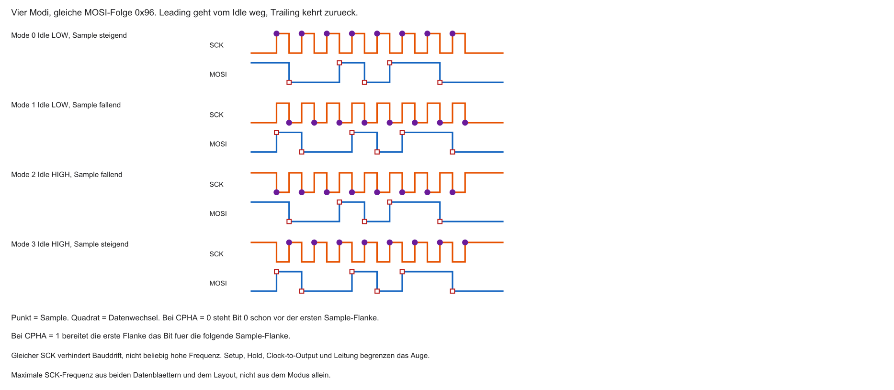

- Vier SPI-Modi (0–3): Kombination aus Ruhepegel und Abtastflanke
- CPOL: Idle LOW oder HIGH?
- CPHA: Abtastung bei erster oder zweiter Flanke?
- Immer Sensor-Datenblatt und Master-Register abgleichen — der Modus entscheidet über gültige Daten

| Modus | CPOL | CPHA | Kurz |
|-------|------|------|------|
| 0 | 0 | 0 | Idle LOW, Sample steigend |
| 1 | 0 | 1 | Idle LOW, Sample fallend |
| 2 | 1 | 0 | Idle HIGH, Sample fallend |
| 3 | 1 | 1 | Idle HIGH, Sample steigend |

::: notes
CPOL und CPHA knüpft an den bisherigen Weg von Bits, Zeit und Teilnehmern an. CPOL ist der Idle-Pegel, CPHA die Abtastung an der ersten oder zweiten Flanke. Mode 0: Idle LOW, Sample steigend. Mode 1: Sample fallend. Mode 2: Idle HIGH, Sample fallend. Mode 3: Sample steigend. Bei CPHA 0 liegt das erste Bit vor der Sample-Flanke. Mode allein ersetzt Setup und Hold nicht. Vier SPI-Modi (0–3): Kombination aus Ruhepegel und Abtastflanke. CPOL: Idle LOW oder HIGH?. Verständnischeck: Welche Flanke tastet Mode 2 ab? Die fallende, weg vom Idle HIGH. Die nächste Folie nimmt die noch offene Frage auf. Adressen und Zeiten sind Lehrannahmen. Code ist Lehrcode und wurde nicht kompiliert oder ausgeführt.
:::

## Nachteile von SPI

- Viele CS-Leitungen bei Star-Routing
- Nur physikalisches Bit-Schieben: keine Adressen, kein ACK in der Grundschicht
- Single-Master — Multi-Master schwierig
- Fehlende Slaves erkennt die Hardware nicht automatisch

::: notes
Nachteile von SPI knüpft an den bisherigen Weg von Bits, Zeit und Teilnehmern an. Keine Adresse und kein ACK gelten für die Bitübertragung, nicht für jedes Geräteprotokoll. 0xFF kann gültig oder ein freier Pegel sein. Multi-Controller ist im Grundmodell nicht enthalten. Viele CS-Leitungen bei Star-Routing. Nur physikalisches Bit-Schieben: keine Adressen, kein ACK in der Grundschicht. Verständnischeck: Warum ist 0xFF kein universeller Fehler? Der Wert kann gültige Daten sein. Die nächste Folie nimmt die noch offene Frage auf. Adressen und Zeiten sind Lehrannahmen. Code ist Lehrcode und wurde nicht kompiliert oder ausgeführt.
:::

## Typische Einsatzgebiete

- Große Datenmengen, wenige Teilnehmer
- TFT-Displays, SD-Karten, externe Flash/EEPROM (auch Quad-SPI)
- Weniger ideal: dutzende langsame Sensoren (Pin-Overhead)

::: notes
Typische Einsatzgebiete knüpft an den bisherigen Weg von Bits, Zeit und Teilnehmern an. Große Datenmengen und wenige Targets sind ein häufiger Grund für SPI, keine Gerätezuordnung. SD und Quad-SPI haben weitere Modi. Ein kleines Display kann I²C nutzen, wenn der Datenbedarf passt. Große Datenmengen, wenige Teilnehmer. TFT-Displays, SD-Karten, externe Flash/EEPROM (auch Quad-SPI). Verständnischeck: Warum kann ein kleines Display I²C nutzen? Weniger Pins bei passender Datenmenge. Die nächste Folie nimmt die noch offene Frage auf. Adressen und Zeiten sind Lehrannahmen. Code ist Lehrcode und wurde nicht kompiliert oder ausgeführt.
:::

## Zusammenfassung SPI

| Eigenschaft | SPI |
|-------------|-----|
| Leitungen | SCK, MOSI, MISO, CS (+…) |
| Takt | synchron (Master) |
| Duplex | Full (Ringtausch) |
| Netz | Master/Slave, Star oder Daisy-Chain |
| Speed | hoch: SCK oft 10–50 MHz ($\approx$ Bitrate in Mbit/s bei 1 Bit/Takt) |
| Einsatz | Display, SD, Flash |

::: notes
Zusammenfassung SPI knüpft an den bisherigen Weg von Bits, Zeit und Teilnehmern an. Vier Signale gelten für ein Target. Ein Bit je Takt macht die Leitungsbitrate zahlenmäßig gleich dem SCK-Wert, nicht die Nutzdatenrate. 10 bis 50 MHz sind ein Beispiel. Für einen Transfer fehlen Modus, Bitreihenfolge, Rahmen und Timing. Verständnischeck: Was fehlt bei SPI 10 MHz? Modus, Reihenfolge, Kommando und Grenzen. Die nächste Folie nimmt die noch offene Frage auf. Adressen und Zeiten sind Lehrannahmen. Code ist Lehrcode und wurde nicht kompiliert oder ausgeführt.
:::

## Aufgabe — SPI-Flanke

Mode 0, Idle LOW. Controller sendet `0x96`, Target sendet `0x3C`, MSB first.

- Welche Flanke tastet ab, welche darf das nächste Bit setzen?
- Welcher Registerstand gilt nach vier Takten im Links-Schiebe-Modell?

::: notes
Aufgabe — SPI-Flanke knüpft an den bisherigen Weg von Bits, Zeit und Teilnehmern an. Mode 0: Idle LOW, Sample steigend, Wechsel fallend. Das erste MSB liegt vorher an. Controller gibt 1, Target 0. Danach stehen 0x2C und 0x79. Beide Register werden aus den alten Zuständen gleichzeitig berechnet. Welche Flanke tastet ab, welche darf das nächste Bit setzen?. Welcher Registerstand gilt nach vier Takten im Links-Schiebe-Modell?. Verständnischeck: Welche ersten Bits? Controller 1, Target 0. Die nächste Folie nimmt die noch offene Frage auf. Adressen und Zeiten sind Lehrannahmen. Code ist Lehrcode und wurde nicht kompiliert oder ausgeführt.
:::

## Was ist I2C?

- I2C: Inter-Integrated Circuit (Philips/NXP, 1980er)
- Rückgrat vieler Sensor-Netzwerke auf der Platine
- Synchron: Taktleitung `SCL` (Serial Clock)
- Half-Duplex: eine Datenleitung `SDA` (Serial Data) — nicht gleichzeitig beide Richtungen
- Viele Bausteine an exakt zwei Signalen (+ GND)

::: notes
Was ist I2C knüpft an den bisherigen Weg von Bits, Zeit und Teilnehmern an. I²C heißt Inter-Integrated Circuit. SCL ist der Takt, SDA die Datenleitung. Beide Richtungen nutzen SDA nacheinander, deshalb Half-Duplex. Der Controller bleibt Taktorganisator. GND und Versorgung kommen hinzu. I2C: Inter-Integrated Circuit (Philips/NXP, 1980er). Rückgrat vieler Sensor-Netzwerke auf der Platine. Verständnischeck: Warum Half-Duplex? Dieselbe Datenleitung wechselt die Richtung. Die nächste Folie nimmt die noch offene Frage auf. Adressen und Zeiten sind Lehrannahmen. Code ist Lehrcode und wurde nicht kompiliert oder ausgeführt.
:::

## Ein echter Bus

- Kein SPI-Star-Routing mit vielen CS-Pins
- `SCL` und `SDA` als gemeinsame Busleitungen über die Platine
- Alle Teilnehmer parallel angeklemmt
- Dutzende Slaves an denselben zwei MCU-Pins möglich

```{mermaid}
%%| fig-width: 4.0
%%{init: {'theme': 'base', 'themeVariables': {'background': '#FFFFFF', 'primaryColor': '#FFFFFF', 'primaryBorderColor': '#E5E5EA', 'primaryTextColor': '#1D1D1F', 'lineColor': '#86868B', 'secondaryColor': '#F5F5F7', 'tertiaryColor': '#FFFFFF', 'mainBkg': '#FFFFFF', 'nodeBorder': '#E5E5EA', 'clusterBkg': '#F5F5F7', 'clusterBorder': '#E5E5EA', 'titleColor': '#1D1D1F', 'edgeLabelBackground': '#FFFFFF'}}}%%
flowchart LR
  CPU[CPU] <-->|SDA und SCL| Bus((2-Draht-Bus))
  Bus --- S1[Sensor 1]
  Bus --- S2[Sensor 2]
  Bus --- S3[Sensor 3]
  style Bus fill:#FFFFFF,stroke:#E2001A,stroke-width:2px !important
```

::: notes
Ein echter Bus knüpft an den bisherigen Weg von Bits, Zeit und Teilnehmern an. Der Bus sind zwei durchgehende Netze plus Pull-ups. Kein Push-Pull an SDA oder SCL. Dieselbe Adresse macht parallele identische Chips nicht unterscheidbar. Dutzende Teilnehmer sind keine Garantie. Kein SPI-Star-Routing mit vielen CS-Pins. `SCL` und `SDA` als gemeinsame Busleitungen über die Platine. Verständnischeck: Warum nicht drei identische Chips parallel? Sie können dieselbe Adresse haben. Die nächste Folie nimmt die noch offene Frage auf. Adressen und Zeiten sind Lehrannahmen. Code ist Lehrcode und wurde nicht kompiliert oder ausgeführt.
:::

## Adressierung statt CS-Kabel

- Geräte können eine oder mehrere wählbare 7-Bit-Adressen haben
- `0x68` ist die Lehradresse dieses Sensors, nicht jede I²C-Adresse
- Master sendet Adresse auf SDA
- Nur der angesprochene Slave antwortet; andere ignorieren
- 7 Bit $\Rightarrow$ theoretisch 128 Slots; praktisch weniger (reservierte Adressen); optional auch 10-Bit-Adressierung

::: notes
Adressierung statt CS-Kabel knüpft an den bisherigen Weg von Bits, Zeit und Teilnehmern an. 0x68 links geschoben ist 0xD0 für Write und 0xD1 für Read. 0x3B wählt danach ein Register im schon adressierten Sensor. 128 Muster sind nicht 128 freie Geräte. Zwei gleiche Adressen trennt das Basisprotokoll nicht. Geräte können eine oder mehrere wählbare 7-Bit-Adressen haben. `0x68` ist die Lehradresse dieses Sensors, nicht jede I²C-Adresse. Verständnischeck: Wählt 0x3B ein anderes Gerät? Nein. Die nächste Folie nimmt die noch offene Frage auf. Adressen und Zeiten sind Lehrannahmen. Code ist Lehrcode und wurde nicht kompiliert oder ausgeführt.
:::

## Open-Drain

- Problem: zwei Treiber gleichzeitig HIGH und LOW → bei Push-Pull Kurzschlussrisiko
- I2C: Open-Drain / Open-Collector
- Geräte können nur aktiv nach GND (LOW) ziehen
- HIGH: Leitung loslassen (hochohmig) — nicht aktiv „hochdrücken“

```{mermaid}
%%| fig-width: 3.4
%%{init: {'theme': 'base', 'themeVariables': {'background': '#FFFFFF', 'primaryColor': '#FFFFFF', 'primaryBorderColor': '#E5E5EA', 'primaryTextColor': '#1D1D1F', 'lineColor': '#86868B', 'secondaryColor': '#F5F5F7', 'tertiaryColor': '#FFFFFF', 'mainBkg': '#FFFFFF', 'nodeBorder': '#E5E5EA', 'clusterBkg': '#F5F5F7', 'clusterBorder': '#E5E5EA', 'titleColor': '#1D1D1F', 'edgeLabelBackground': '#FFFFFF'}}}%%
flowchart TD
  Bus[SDA] --- A[Schalter Chip A]
  Bus --- B[Schalter Chip B]
  A --> G1[GND]
  B --> G2[GND]
  style Bus fill:#FFFFFF,stroke:#E2001A,stroke-width:2px !important
```

::: notes
Open-Drain knüpft an den bisherigen Weg von Bits, Zeit und Teilnehmern an. Open-Drain zieht nach Masse oder gibt frei. HIGH kommt vom Pull-up. Open-Collector ist das verwandte Prinzip. Ohne Pull-up schwebt die Leitung, wenn alle Schalter offen sind. Problem: zwei Treiber gleichzeitig HIGH und LOW → bei Push-Pull Kurzschlussrisiko. I2C: Open-Drain / Open-Collector. Verständnischeck: Was passiert ohne Pull-up bei offenen Schaltern? Kein definierter HIGH-Pegel. Die nächste Folie nimmt die noch offene Frage auf. Adressen und Zeiten sind Lehrannahmen. Code ist Lehrcode und wurde nicht kompiliert oder ausgeführt.
:::

## Pull-Up-Widerstände

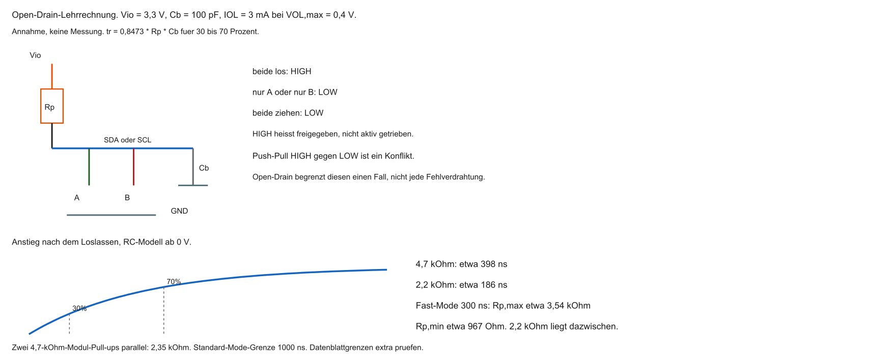

- Ohne aktives HIGH: je ein Pull-up an SDA und an SCL
- „Wenige kΩ“ ist keine Dimensionierung: Kapazität, Rise Time und Sinkstrom begrenzen $R_P$
- Je einer an SDA und SCL gegen $V_{IO}$ (z. B. $3{,}3\,\mathrm{V}$)
- Alle loslassen → Pull-up zieht HIGH (logisch 1)
- Ein Chip zieht → Leitung LOW (logisch 0)

::: notes
Pull-Up-Widerstände knüpft an den bisherigen Weg von Bits, Zeit und Teilnehmern an. R minimum ist (3,3 minus 0,4) V geteilt durch 3 mA, etwa 967 Ohm. Bei 300 ns und 100 pF ist R maximum etwa 3,54 kOhm. 2,2 kOhm ergeben etwa 186 ns, 4,7 kOhm etwa 398 ns. Zwei 4,7 kOhm parallel sind 2,35 kOhm und etwa 199 ns. t_r ist der Anstieg von 30 auf 70 Prozent. Das ist eine RC-Lehrrechnung. Ohne aktives HIGH: je ein Pull-up an SDA und an SCL. „Wenige kΩ“ ist keine Dimensionierung: Kapazität, Rise Time und Sinkstrom begrenzen $R_P$. Verständnischeck: Warum ist 4,7 kOhm hier zu groß? Der Anstieg liegt bei etwa 398 ns über 300 ns. Die nächste Folie nimmt die noch offene Frage auf. Adressen und Zeiten sind Lehrannahmen. Code ist Lehrcode und wurde nicht kompiliert oder ausgeführt.
:::

## Dominantes LOW (Wired-AND)

- LOW ist dominant, HIGH rezessiv
- Gleichzeitig 1 und 0 → Leitung wird 0
- Sender kann mitlesen: „Ich wollte 1, Bus ist 0“ → Überstimmt

::: notes
Dominantes LOW (Wired-AND) knüpft an den bisherigen Weg von Bits, Zeit und Teilnehmern an. Alle frei ergibt HIGH, ein LOW zieht die Leitung auf LOW. Senden einer 1 heißt freigeben. LOW während Daten, ACK oder Stretching hat verschiedene Bedeutung. Nicht jedes gesehene LOW ist Arbitration-Verlust. LOW ist dominant, HIGH rezessiv. Gleichzeitig 1 und 0 → Leitung wird 0. Verständnischeck: Was liegt an, wenn einer zieht? LOW. Die nächste Folie nimmt die noch offene Frage auf. Adressen und Zeiten sind Lehrannahmen. Code ist Lehrcode und wurde nicht kompiliert oder ausgeführt.
:::

## I2C-Nachrichtenaufbau

Typische Transaktion:

1. START (SDA fällt bei SCL HIGH)
2. 7-Bit-Adresse
3. R/W-Bit (0 = Write, 1 = Read)
4. ACK vom Empfänger
5. Datenbyte(s) + ACK/NACK
6. STOP

| Feld | Bedeutung |
|------|-----------|
| START | Transferbeginn erkennen, nicht jedes Aufwecken |
| Adresse + R/W | Ziel und Richtung |
| ACK | Quittung |
| DATA | Nutzdaten |

::: notes
I2C-Nachrichtenaufbau knüpft an den bisherigen Weg von Bits, Zeit und Teilnehmern an. START ist fallende SDA bei SCL HIGH. Danach sieben Adressbits, R/W und der neunte ACK-Takt. Daten wechseln bei SCL LOW. START weckt nicht jeden Sleep-Zustand. ACK ist Protokollannahme, kein Messwertbeweis. Adresse plus ACK braucht neun Pulse. Verständnischeck: Wie viele Pulse für Adresse und ACK? Neun. Die nächste Folie nimmt die noch offene Frage auf. Adressen und Zeiten sind Lehrannahmen. Code ist Lehrcode und wurde nicht kompiliert oder ausgeführt.
:::

## ACK und NACK

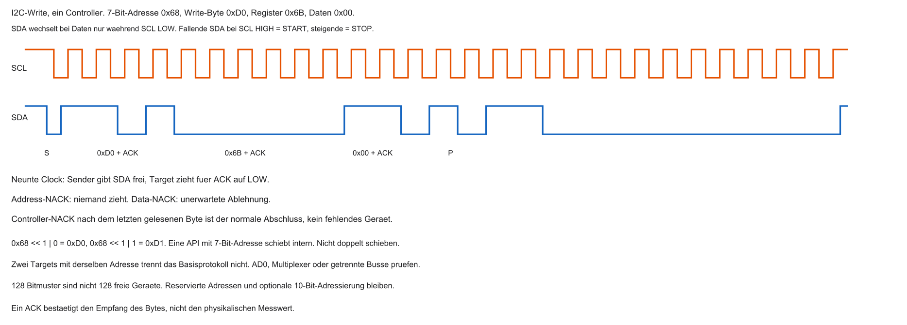

- Nach jedem Byte: 9. Takt für Quittung
- Sender lässt SDA los (Tendenz HIGH = NACK)
- Empfänger zieht SDA auf LOW = ACK
- Address-NACK: Gerät fehlt oder hört nicht. Data-NACK: unerwartete Ablehnung. Letzter Read-NACK: normaler Abschluss durch den Controller.

::: notes
ACK und NACK knüpft an den bisherigen Weg von Bits, Zeit und Teilnehmern an. Beim Write quittiert das Target. Der Controller taktet und gibt SDA für das ACK frei. Ein Address-NACK ist nicht eindeutig Gerät fehlt. Beim Read bestätigt der Controller die ersten Datenbytes und erzeugt nach dem letzten bewusst NACK. Das ist Erfolg, kein Fehler. Ein ACK beweist keinen physikalischen Wert. Nach jedem Byte: 9. Takt für Quittung. Sender lässt SDA los (Tendenz HIGH = NACK). Verständnischeck: Wer quittiert 0xD1 und wer die Daten? Das Target die Adresse, der Controller die Daten. Die nächste Folie nimmt die noch offene Frage auf. Adressen und Zeiten sind Lehrannahmen. Code ist Lehrcode und wurde nicht kompiliert oder ausgeführt.
:::

## Senden vs. Empfangen

Master Write:

- Adresse + R/W $= 0$ → ACK → Daten vom Master → ACK vom Slave

Master Read:

- Adresse + R/W $= 1$ → ACK → Slave treibt SDA, Master taktet weiter SCL
- Master sendet ACK/NACK für empfangene Bytes

::: notes
Senden vs. Empfangen knüpft an den bisherigen Weg von Bits, Zeit und Teilnehmern an. Controller und Target sind die Busrollen. Sender und Empfänger wechseln je Phase. Beim Read bleibt der Controller Taktorganisator. Stretching darf SCL verlängern, erzeugt aber keine freie Target-Clock. Adresse + R/W $= 0$ → ACK → Daten vom Master → ACK vom Slave. Adresse + R/W $= 1$ → ACK → Slave treibt SDA, Master taktet weiter SCL. Verständnischeck: Wird das Target zum Controller? Nein, es wird Datensender. Die nächste Folie nimmt die noch offene Frage auf. Adressen und Zeiten sind Lehrannahmen. Code ist Lehrcode und wurde nicht kompiliert oder ausgeführt.
:::

## STOP-Condition

- Master beendet: bei SCL HIGH steigt SDA von LOW nach HIGH
- Signal: Bus frei für neue Transaktionen
- Slaves gehen zurück in Idle

::: notes
STOP-Condition knüpft an den bisherigen Weg von Bits, Zeit und Teilnehmern an. STOP ist steigende SDA bei SCL HIGH. Ein Softwarebefehl ist nicht schon der elektrische Abschluss. Repeated START gibt den Bus nicht frei. Bei festgehaltenem SCL LOW gibt es keinen normalen STOP. Master beendet: bei SCL HIGH steigt SDA von LOW nach HIGH. Signal: Bus frei für neue Transaktionen. Verständnischeck: Kann man bei SCL LOW stoppen? Nicht als definierte STOP-Flanke. Die nächste Folie nimmt die noch offene Frage auf. Adressen und Zeiten sind Lehrannahmen. Code ist Lehrcode und wurde nicht kompiliert oder ausgeführt.
:::

## Clock Stretching

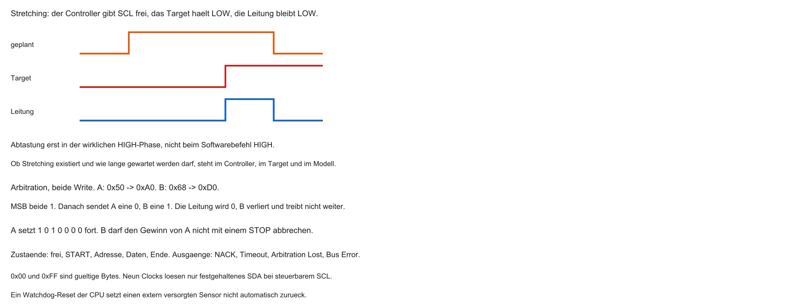

- Zu schneller Master-Takt? Slave kann SCL auf LOW halten
- Master will HIGH, sieht aber LOW (Wired-AND) → wartet
- Slave lässt los → Transfer geht weiter

::: notes
Clock Stretching knüpft an den bisherigen Weg von Bits, Zeit und Teilnehmern an. Stretching hält SCL LOW, bis alle Open-Drain-Ausgänge freigeben und der Pegel steigt. Der Controller muss die tatsächliche HIGH-Phase sehen. Eine Deadline begrenzt das Warten, ist aber keine I²C-Norm. Nicht jeder Stuck-LOW ist erlaubtes Stretching. Zu schneller Master-Takt? Slave kann SCL auf LOW halten. Master will HIGH, sieht aber LOW (Wired-AND) → wartet. Verständnischeck: Wann darf abgetastet werden? Erst nach ausreichendem HIGH und passendem Timing. Die nächste Folie nimmt die noch offene Frage auf. Adressen und Zeiten sind Lehrannahmen. Code ist Lehrcode und wurde nicht kompiliert oder ausgeführt.
:::

## Multi-Master

- Mehrere Master auf demselben Bus möglich
- Beide können START generieren und Sensoren ansprechen
- Risiko: gleichzeitiger Buszugriff → Arbitration nötig

::: notes
Multi-Master knüpft an den bisherigen Weg von Bits, Zeit und Teilnehmern an. Multi-Master ist die ältere Bezeichnung für mehrere Controller. Sie beobachten den freien Bus. SCL wird gemeinsam synchronisiert, SDA entscheidet die Datenkonkurrenz. Ein fremder Read darf nicht mit STOP beendet werden. Mehrere Master auf demselben Bus möglich. Beide können START generieren und Sensoren ansprechen. Verständnischeck: Darf ein zweiter Controller STOP senden? Nein, er besitzt die Transaktion nicht. Die nächste Folie nimmt die noch offene Frage auf. Adressen und Zeiten sind Lehrannahmen. Code ist Lehrcode und wurde nicht kompiliert oder ausgeführt.
:::

## Arbitration

- Bei Kollision entscheidet dominantes LOW
- Wer 1 senden will, aber 0 liest, verliert und bricht ab
- Gewinner sendet weiter — Nachricht bleibt intakt

::: notes
Arbitration knüpft an den bisherigen Weg von Bits, Zeit und Teilnehmern an. A sendet 0xA0, B sendet 0xD0. Beide beginnen mit 1. Am zweiten Bit sendet A 0 und B 1, die Leitung ist 0. B verliert und darf den Gewinner nicht stören. Das ist Datenarbitration, kein ACK. Bei Kollision entscheidet dominantes LOW. Wer 1 senden will, aber 0 liest, verliert und bricht ab. Verständnischeck: Wer gewinnt? A, weil sein 0 bestehen bleibt. Die nächste Folie nimmt die noch offene Frage auf. Adressen und Zeiten sind Lehrannahmen. Code ist Lehrcode und wurde nicht kompiliert oder ausgeführt.
:::

## Nachteile von I2C

- Open-Drain + Pull-up: langsamere Flanken als Push-Pull
- Typisch Standard/Fast Mode: $100\,\mathrm{kHz}$ / $400\,\mathrm{kHz}$ (vs. SPI: SCK oft einige zehn MHz)
- Buskapazität begrenzt Teilnehmerzahl und Kabellänge

::: notes
Nachteile von I2C knüpft an den bisherigen Weg von Bits, Zeit und Teilnehmern an. 100 und 400 kHz sind Standard- und Fast-Mode im Fokus, nicht die absolute Obergrenze. Mehr Kapazität und zusätzliche Pull-ups ändern Anstieg und Strom. Adressen können kollidieren. Open-Drain + Pull-up: langsamere Flanken als Push-Pull. Typisch Standard/Fast Mode: $100\,\mathrm{kHz}$ / $400\,\mathrm{kHz}$ (vs. SPI: SCK oft einige zehn MHz). Verständnischeck: Warum wird ein größeres Netz heikel? Kapazität, Pull-ups und Adressen. Die nächste Folie nimmt die noch offene Frage auf. Adressen und Zeiten sind Lehrannahmen. Code ist Lehrcode und wurde nicht kompiliert oder ausgeführt.
:::

## Zusammenfassung der Big 3

| Merkmal | UART | SPI | I2C |
|---------|------|-----|-----|
| Signale ohne GND | TX, RX | SCK, MOSI, MISO, CS | SDA, SCL |
| Takt | asynchron | Controller-Takt | Controller-Takt |
| Routing | Punkt-zu-Punkt | CS oder geeignete Daisy-Chain | adressierter Bus |
| Tempo | Baud mal Framing | Timingbudget beider Bausteine | 100/400 kHz als Fokus |
| Treiber | Push-Pull, Pegel beachten | Push-Pull | Open-Drain, Pull-ups |
| Einsatz | Debug, Module | Display, Flash | Sensoren auf der Platine |

::: notes
Zusammenfassung der Big 3 knüpft an den bisherigen Weg von Bits, Zeit und Teilnehmern an. Debug oft UART, große Transfers mit wenigen Targets oft SPI, viele kleine Sensoren oft I²C. Keine Schnittstelle ist automatisch die beste. 115200 mal 8 geteilt durch 10 sind 92160 Nutzdatenbit/s. GND zählt extra. Verständnischeck: Welche ist die beste? Keine, der Bedarf entscheidet. Die nächste Folie nimmt die noch offene Frage auf. Adressen und Zeiten sind Lehrannahmen. Code ist Lehrcode und wurde nicht kompiliert oder ausgeführt.
:::

## Aufgabe — Adresse, ACK und Pull-up

- Geräteadresse `0x68`. Welches Byte geht bei Write, welches bei Read auf den Bus?
- Wer zieht SDA im neunten Takt eines Writes? Wer erzeugt den NACK nach dem letzten gelesenen Byte?
- Lehrannahme: $V_{IO}=3{,}3\,\mathrm{V}$, $C_B=100\,\mathrm{pF}$, $3\,\mathrm{mA}$ bei $0{,}4\,\mathrm{V}$, $t_r=0{,}8473\,R_P C_B$. Liegt $2{,}2\,\mathrm{k}\Omega$ im Fast-Mode-Fenster?

::: notes
Aufgabe — Adresse, ACK und Pull-up knüpft an den bisherigen Weg von Bits, Zeit und Teilnehmern an. 0x68 links plus Write-Bit ist 0xD0, Read ist 0xD1. Das Target quittiert Writes, der Controller beendet den Read mit NACK. R minimum etwa 967 Ohm, R maximum etwa 3,54 kOhm. 2,2 kOhm liegen dazwischen. Ein einzelner 4,7-kOhm-Widerstand verfehlt 300 ns, läge aber unter 1000 ns. Geräteadresse `0x68`. Welches Byte geht bei Write, welches bei Read auf den Bus?. Wer zieht SDA im neunten Takt eines Writes? Wer erzeugt den NACK nach dem letzten gelesenen Byte?. Verständnischeck: Ist 4,7 kOhm im 300-ns-Modell zulässig? Nein. Die nächste Folie nimmt die noch offene Frage auf. Adressen und Zeiten sind Lehrannahmen. Code ist Lehrcode und wurde nicht kompiliert oder ausgeführt.
:::

## Grenzen von Single-Ended

- UART/SPI/I2C: Single-Ended — Pegel gegen gemeinsames GND
- Lange Kabel / getrennte Massepotentiale → Referenz driftet
- Empfänger sieht verfälschte Spannungen → Bitfehler

::: notes
Grenzen von Single-Ended knüpft an den bisherigen Weg von Bits, Zeit und Teilnehmern an. Single-Ended bewertet ein Signal gegen den Bezug des Empfängers. Verschobene Masse ändert den gesehenen Pegel. Eine Metergrenze ersetzt keine elektrische Prüfung. UART/SPI/I2C: Single-Ended — Pegel gegen gemeinsames GND. Lange Kabel / getrennte Massepotentiale → Referenz driftet. Verständnischeck: Warum kann HIGH falsch ankommen? Der Empfänger sieht eine andere Spannung gegen seinen Bezug. Die nächste Folie nimmt die noch offene Frage auf. Adressen und Zeiten sind Lehrannahmen. Code ist Lehrcode und wurde nicht kompiliert oder ausgeführt.
:::

## Elektromagnetische Interferenzen (EMI)

- Lange Leitungen wirken als Antennen
- Motoren/Wechselrichter induzieren Spikes
- Single-Ended: Spike kann 0 als 1 erscheinen lassen

::: notes
Elektromagnetische Interferenzen (EMI) knüpft an den bisherigen Weg von Bits, Zeit und Teilnehmern an. EMI ist elektromagnetische Störung. Ein Stromwechsel kann in eine Datenleitung einkoppeln. Baudrate verhindert keine Pegelverfälschung. On-Board-Busse sind nicht automatisch für jedes lange Kabel gedacht. Lange Leitungen wirken als Antennen. Motoren/Wechselrichter induzieren Spikes. Verständnischeck: Warum reicht die Baudrate nicht? Sie korrigiert keinen gestörten Pegel. Die nächste Folie nimmt die noch offene Frage auf. Adressen und Zeiten sind Lehrannahmen. Code ist Lehrcode und wurde nicht kompiliert oder ausgeführt.
:::

## Differentielle Übertragung

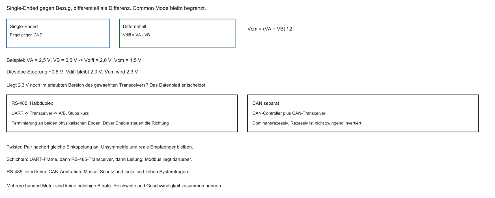

- Signal auf zwei Leitungen: normal und invertiert
- Empfänger misst Differenz $V_A - V_B$, nicht gegen GND
- Gleiche Störung auf beiden Leitungen ändert die Differenz nicht
- Der Common-Mode-Bereich des Empfängers bleibt endlich; große Potentialunterschiede können weiter stören oder schädigen

```{mermaid}
%%| fig-width: 3.6
%%{init: {'theme': 'base', 'themeVariables': {'background': '#FFFFFF', 'primaryColor': '#FFFFFF', 'primaryBorderColor': '#E5E5EA', 'primaryTextColor': '#1D1D1F', 'lineColor': '#86868B', 'secondaryColor': '#F5F5F7', 'tertiaryColor': '#FFFFFF', 'mainBkg': '#FFFFFF', 'nodeBorder': '#E5E5EA', 'clusterBkg': '#F5F5F7', 'clusterBorder': '#E5E5EA', 'titleColor': '#1D1D1F', 'edgeLabelBackground': '#FFFFFF'}}}%%
flowchart LR
  S[Sender] -->|A| E[Empfänger]
  S -->|B invertiert| E
  E -->|Differenz| CPU[Logik]
  style E fill:#FFFFFF,stroke:#E2001A,stroke-width:2px !important
```

::: notes
Differentielle Übertragung knüpft an den bisherigen Weg von Bits, Zeit und Teilnehmern an. V_diff ist V_A minus V_B, V_cm der Mittelwert. 2,5 V und 0,5 V ergeben 2 V Differenz und 1,5 V Gleichtakt. Plus 0,8 V auf beiden lässt die Differenz bei 2 V und hebt den Gleichtakt auf 2,3 V. Der Eingangsbereich bleibt begrenzt. Rezessives CAN ist nicht einfach die invertierte zweite Leitung. Signal auf zwei Leitungen: normal und invertiert. Empfänger misst Differenz $V_A - V_B$, nicht gegen GND. Verständnischeck: Was ändert die gleiche Störung? Den Gleichtakt, nicht die ideale Differenz. Die nächste Folie nimmt die noch offene Frage auf. Adressen und Zeiten sind Lehrannahmen. Code ist Lehrcode und wurde nicht kompiliert oder ausgeführt.
:::

## Twisted Pair

- Adern eng verdrillt
- Gleichtaktstörung hebt beide Adern ähnlich an
- Differenz bleibt: $(V_A+\Delta)-(V_B+\Delta)=V_A-V_B$

::: notes
Twisted Pair knüpft an den bisherigen Weg von Bits, Zeit und Teilnehmern an. Verdrillung macht die Einkopplung ähnlicher. Exakt gleiches Delta hebt sich in der Differenz auf. 0,8 V und 0,6 V lassen 0,2 V Differenzstörung. Die Leitung legt kein Protokoll fest. Adern eng verdrillt. Gleichtaktstörung hebt beide Adern ähnlich an. Verständnischeck: Was bleibt bei ungleicher Störung? 0,2 V zusätzliche Differenz. Die nächste Folie nimmt die noch offene Frage auf. Adressen und Zeiten sind Lehrannahmen. Code ist Lehrcode und wurde nicht kompiliert oder ausgeführt.
:::

## RS-485

- Physikalische Schicht für lange Strecken (oft mit UART-Logik)
- Transceiver: Single-Ended TX/RX → differenziell A/B
- Reichweite und Bitrate gelten gemeinsam; „einige hundert Meter“ ist keine beliebige Geschwindigkeit
- Häufig mit Protokollen wie Modbus

::: notes
RS-485 knüpft an den bisherigen Weg von Bits, Zeit und Teilnehmern an. RS-485 ist die physikalische Schnittstelle. UART bleibt das Framing, Modbus ein höheres Protokoll. Der Treiber-Enable bestimmt, wer sendet. Es gibt keine I²C-artige Arbitration. Reichweite und Bitrate gehören zusammen. Physikalische Schicht für lange Strecken (oft mit UART-Logik). Transceiver: Single-Ended TX/RX → differenziell A/B. Verständnischeck: Reicht der Transceiver für mehrere Sender? Nein, das Protokoll muss den Zugriff ordnen. Die nächste Folie nimmt die noch offene Frage auf. Adressen und Zeiten sind Lehrannahmen. Code ist Lehrcode und wurde nicht kompiliert oder ausgeführt.
:::

## CAN-Bus

- Controller Area Network (Bosch) — Standard im Fahrzeug
- Differenziell (CAN_H / CAN_L)
- Multi-Drop mit Arbitration (dominant/rezessiv)
- Verbindet Steuergeräte über ein Twisted-Pair

::: notes
CAN-Bus knüpft an den bisherigen Weg von Bits, Zeit und Teilnehmern an. CAN ist Controller Area Network mit eigenem Controller und Transceiver. Dominant und rezessiv ähneln der Idee von LOW und Freigabe, sind aber nicht I²C. Ein UART plus CAN-Transceiver erzeugt keine CAN-Nachrichten. Controller Area Network (Bosch) — Standard im Fahrzeug. Differenziell (CAN_H / CAN_L). Verständnischeck: Erzeugt ein UART mit Transceiver CAN? Nein. Die nächste Folie nimmt die noch offene Frage auf. Adressen und Zeiten sind Lehrannahmen. Code ist Lehrcode und wurde nicht kompiliert oder ausgeführt.
:::

## Warum im Labor I2C?

- MCT3-Fokus: Sensoren wenige Zentimeter neben der MCU
- Differentielle Transceiver: Platz, Strom, Kosten
- Für die „letzte Meile“ auf dem Board: I2C oft die passende Wahl

::: notes
Warum im Labor I2C knüpft an den bisherigen Weg von Bits, Zeit und Teilnehmern an. I²C passt hier zum kurzen Link und kleinen Registerzugriff, wenn Adresse, Pegel und Pull-ups stimmen. Letzte Meile ist eine Metapher, keine Kilometerangabe. Der Laboraufbau ist optional. MCT3-Fokus: Sensoren wenige Zentimeter neben der MCU. Differentielle Transceiver: Platz, Strom, Kosten. Verständnischeck: Welche drei Bedingungen vor dem Read? Adresse, Elektrik und Registerformat. Die nächste Folie nimmt die noch offene Frage auf. Adressen und Zeiten sind Lehrannahmen. Code ist Lehrcode und wurde nicht kompiliert oder ausgeführt.
:::

## Aufgabe — Burst und Common Mode

- Bytes `10 00 E0 00 40 00` ab Register `0x3B`, Bereich $\pm 2\,\mathrm{g}$ mit 16384 LSB/g. Welche Werte in g entstehen?
- $V_A=2{,}5\,\mathrm{V}$, $V_B=0{,}5\,\mathrm{V}$, danach $+0{,}8\,\mathrm{V}$ auf beiden Leitungen. Was bleibt gleich, was ändert sich?

::: notes
Aufgabe — Burst und Common Mode knüpft an den bisherigen Weg von Bits, Zeit und Teilnehmern an. 0x1000 ist 4096 und plus 0,25 g. 0xE000 ist vorzeichenbehaftet minus 8192 und minus 0,5 g, nicht plus 3,5 g. 0x4000 ist plus 1 g. g ist Fallbeschleunigung, kein Gramm. 16384 LSB/g gelten für plus minus 2 g. Bei 2,5 V und 0,5 V plus 0,8 V bleibt die Differenz 2 V. Bytes `10 00 E0 00 40 00` ab Register `0x3B`, Bereich $\pm 2\,\mathrm{g}$ mit 16384 LSB/g. Welche Werte in g entstehen?. $V_A=2{,}5\,\mathrm{V}$, $V_B=0{,}5\,\mathrm{V}$, danach $+0{,}8\,\mathrm{V}$ auf beiden Leitungen. Was bleibt gleich, was ändert sich?. Verständnischeck: Warum nicht plus 3,5 g? Weil das Zweierkomplement zuerst gilt. Die nächste Folie nimmt die noch offene Frage auf. Adressen und Zeiten sind Lehrannahmen. Code ist Lehrcode und wurde nicht kompiliert oder ausgeführt.
:::

## Ausblick Labor: IMU per I2C

Geplantes Szenario:

- 3-Achsen-Beschleunigungssensor (IMU) am I2C-Bus
- Master: SCL erzeugen, Adresse senden
- Write: Sensor konfigurieren/aufwecken
- Read: Rohwerte X/Y/Z holen

::: notes
Ausblick Labor: IMU per I2C knüpft an den bisherigen Weg von Bits, Zeit und Teilnehmern an. Die Folge ist Konfiguration, vollständiger Read, Status, Dekodierung, Skalierung. Aufwecken ist ein Sensorregister, kein allgemeiner I²C-Befehl. Ein gültiger Vektor braucht erfolgreichen Transfer und passenden Bereich. 3-Achsen-Beschleunigungssensor (IMU) am I2C-Bus. Master: SCL erzeugen, Adresse senden. Verständnischeck: Wann ist der Vektor verwendbar? Nach vollständigem Erfolg und passender Skalierung. Die nächste Folie nimmt die noch offene Frage auf. Adressen und Zeiten sind Lehrannahmen. Code ist Lehrcode und wurde nicht kompiliert oder ausgeführt.
:::

## MEMS kurz

- MEMS: mikromechanische Strukturen im Silizium
- Beschleunigung verbiegt Strukturen → Kapazität ändert sich
- Wandlung in Digitalwerte → Register im Sensor
- Diese Register lesen wir per I2C

::: notes
MEMS kurz knüpft an den bisherigen Weg von Bits, Zeit und Teilnehmern an. MEMS sind mikroelektromechanische Systeme. Das Lehrbild ist eine Masse, deren Lage Kapazitäten ändert. I²C transportiert nur die digitalen Register. Eine fehlerfreie Übertragung korrigiert keinen Offset. MEMS: mikromechanische Strukturen im Silizium. Beschleunigung verbiegt Strukturen → Kapazität ändert sich. Verständnischeck: Warum kann der Wert trotzdem ungenau sein? Sensorfehler bleiben außerhalb des Busses. Die nächste Folie nimmt die noch offene Frage auf. Adressen und Zeiten sind Lehrannahmen. Code ist Lehrcode und wurde nicht kompiliert oder ausgeführt.
:::

## Registerkarte des Sensors

- Sensor hat eigene Memory Map (Datenblatt!)
- Beispiele aus der MPU-6000/MPU-6050-Registerkarte, im Labor gegen das Datenblatt prüfen:
  - `0x6B`: Power Management, Aufwecken ist bausteinspezifisch
  - `0x1C`: Beschleunigungsbereich; $\pm 2\,\mathrm{g}$ entspricht im Datenblatt oft 16384 LSB/g
  - `0x3B` bis `0x40`: X, Y, Z je High/Low, zusammenhängend lesbar
- I2C: erst Geräteadresse, dann Registerzeiger, dann Daten

::: notes
Registerkarte des Sensors knüpft an den bisherigen Weg von Bits, Zeit und Teilnehmern an. 0x6B, 0x1C und 0x3B bis 0x40 sind Sensorregister, nicht SoC-MMIO. 0x00 an 0x6B ist das Wake-Lehrbeispiel, keine vollständige Initialisierung. Die Skalierung muss zum Bereich passen. Der Registervertrag ist das Lehrmodell und hier nicht neu am Originaldatenblatt verifiziert. Sensor hat eigene Memory Map (Datenblatt!). Beispiele aus der MPU-6000/MPU-6050-Registerkarte, im Labor gegen das Datenblatt prüfen:. Verständnischeck: Warum muss der Bereich zur Dekodierung passen? Dieselbe Rohzahl bedeutet sonst eine andere Beschleunigung. Die nächste Folie nimmt die noch offene Frage auf. Adressen und Zeiten sind Lehrannahmen. Code ist Lehrcode und wurde nicht kompiliert oder ausgeführt.
:::

## C: I2C initialisieren

Beispielhafte Adressen und Bits (fiktiv — immer Datenblatt prüfen):

```c
#define I2C_BASE 0x40010000u
#define I2C_CR1  (*(volatile uint32_t *)(I2C_BASE + 0x00))

void i2c_init(void) {
    /* Davor, plattformspezifisch: Taktfreigabe, Pin-Mux, Open-Drain, Pull-up. */
    I2C_CR1 |= (1u << 0);  /* Enable — Bitlage nur im Lehrmodell */
    I2C_CR1 |= (1u << 8);  /* Controller-Modus — nur schematisch */
}
```

- Register-Offsets und Bitpositionen sind plattformspezifisch
- Nicht 1:1 auf einen realen Chip übernehmen

::: notes
C: I2C initialisieren knüpft an den bisherigen Weg von Bits, Zeit und Teilnehmern an. I2C_BASE 0x40010000 ist fiktiv. volatile macht den Zugriff sichtbar, ersetzt aber Breite und Registerregeln nicht. Das Oder-Gleich ist nur bei einem lesbaren Kontrollregister zulässig. Enable allein setzt weder Pin-Mux noch Pull-ups. Register-Offsets und Bitpositionen sind plattformspezifisch. Nicht 1:1 auf einen realen Chip übernehmen. Verständnischeck: Warum reicht das Enable-Bit nicht? Takt, Pins, Treiber und Timing fehlen. Die nächste Folie nimmt die noch offene Frage auf. Adressen und Zeiten sind Lehrannahmen. Code ist Lehrcode und wurde nicht kompiliert oder ausgeführt.
:::

## C: Bus-Frequenz

- Typisch $100\,\mathrm{kHz}$ oder $400\,\mathrm{kHz}$
- Aus Systemtakt (z. B. $100\,\mathrm{MHz}$) Teiler setzen

```c
#define I2C_CLK_DIV (*(volatile uint32_t *)(I2C_BASE + 0x10))

void i2c_set_speed(void) {
    /* 100 MHz / 1000 = 100 kHz ist nur dieses Rechenmodell. */
    I2C_CLK_DIV = 1000;
}
```

::: notes
C: Bus-Frequenz knüpft an den bisherigen Weg von Bits, Zeit und Teilnehmern an. 100 MHz geteilt durch 1000 sind 100 kHz nur in diesem Teilermodell. Der Peripherietakt muss nicht der CPU-Takt sein. 400 kHz wären hier Teiler 250, ohne reale Registerfelder. Der Pull-up-Anstieg bleibt zusätzlich nötig. Typisch $100\,\mathrm{kHz}$ oder $400\,\mathrm{kHz}$. Aus Systemtakt (z. B. $100\,\mathrm{MHz}$) Teiler setzen. Verständnischeck: Beweisen 400 kHz Fast-Mode? Nein, die Zeitbedingungen müssen passen. Die nächste Folie nimmt die noch offene Frage auf. Adressen und Zeiten sind Lehrannahmen. Code ist Lehrcode und wurde nicht kompiliert oder ausgeführt.
:::

## C: Write-Transaktion

Ablauf: START → Adresse+W → Reg → Daten → STOP. Status: OK, NACK, TIMEOUT, ARB_LOST, BUS_ERR.

```c
/* Lehrcode — nicht kompiliert.
   Jede Phase meldet Status und Deadline. */
int sensor_wakeup(uint64_t deadline, uint64_t cleanup) {
    int st = i2c_start(deadline);
    if (st != I2C_OK) return i2c_abort(st, cleanup);
    st = i2c_tx_byte(0xD0u, deadline);
    if (st != I2C_OK) return i2c_abort(st, cleanup);
    st = i2c_tx_byte(0x6Bu, deadline);
    if (st != I2C_OK) return i2c_abort(st, cleanup);
    st = i2c_tx_byte(0x00u, deadline);
    if (st != I2C_OK) return i2c_abort(st, cleanup);
    st = i2c_stop(deadline);
    if (st != I2C_OK) return i2c_abort(st, cleanup);
    return I2C_OK;
}
```

Nach Arbitration-Verlust kein STOP. Erfolg erst nach abgeschlossenem STOP.

::: notes
C: Write-Transaktion knüpft an den bisherigen Weg von Bits, Zeit und Teilnehmern an. Der Wake-Write ist START, 0xD0, 0x6B, 0x00, STOP. Jede Phase hat Status und Deadline. I2C_OK erst nach abgeschlossenem STOP. Nach ARB_LOST kein STOP und keine Recovery-Takte. NACK, Timeout und Busfehler bleiben erhalten. Die Adressen und Helfer sind Lehrplätze. Verständnischeck: Was ist am alten wait_phase-Kommentar zu klären? START und STOP brauchen denselben Statusvertrag wie die Bytes. Die nächste Folie nimmt die noch offene Frage auf. Adressen und Zeiten sind Lehrannahmen. Code ist Lehrcode und wurde nicht kompiliert oder ausgeführt.
:::

## C: Read mit Repeated Start

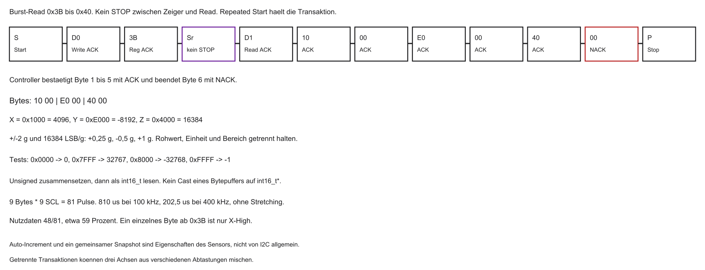

Zuerst Registerzeiger setzen (Write), dann Repeated START und Read:

```c
/* Lehrcode. out erst nach erfolgreichem STOP übernehmen. */
int read_accel_xyz(uint8_t out[6], uint64_t deadline,
                   uint64_t cleanup) {
    uint8_t tmp[6];
    int st = i2c_start(deadline);
    if (st != I2C_OK) return i2c_abort(st, cleanup);
    st = i2c_tx_byte(0xD0u, deadline);
    if (st != I2C_OK) return i2c_abort(st, cleanup);
    st = i2c_tx_byte(0x3Bu, deadline);
    if (st != I2C_OK) return i2c_abort(st, cleanup);
    st = i2c_restart(deadline);
    if (st != I2C_OK) return i2c_abort(st, cleanup);
    st = i2c_tx_byte(0xD1u, deadline);
    if (st != I2C_OK) return i2c_abort(st, cleanup);
    for (int i = 0; i < 6; i++) {
        st = i2c_rx_byte(&tmp[i], i < 5, deadline);
        if (st != I2C_OK) return i2c_abort(st, cleanup);
    }
    st = i2c_stop(deadline);
    if (st != I2C_OK) return i2c_abort(st, cleanup);
    for (int i = 0; i < 6; i++) out[i] = tmp[i];
    return I2C_OK;
}
```

::: notes
C: Read mit Repeated Start knüpft an den bisherigen Weg von Bits, Zeit und Teilnehmern an. Der Read setzt den Zeiger mit 0xD0 und 0x3B, macht Repeated START, sendet 0xD1 und liest sechs Bytes. Die ersten fünf werden bestätigt, das sechste mit NACK beendet. out wird erst nach STOP aus tmp kopiert. Neun Bytes mal neun Takte sind 81 Pulse, 810 µs bei 100 kHz und 202,5 µs bei 400 kHz reine Taktzeit. Auto-Increment ist eine Sensoreigenschaft. Verständnischeck: Warum NACK beim sechsten Byte? Es signalisiert das Ende, die ersten ACK fordern Fortsetzung. Die nächste Folie nimmt die noch offene Frage auf. Adressen und Zeiten sind Lehrannahmen. Code ist Lehrcode und wurde nicht kompiliert oder ausgeführt.
:::

## Renode: virtueller I2C-Sensor

- Ein Registermodell kann ACK und Bursts nachbilden
- Es beweist keine realen Flanken, keine RC-Zeit und keine zyklusgenaue Controllerlatenz
- `Sensors.MPU6050` und `FeedSample` sind hier nicht als vorhandene API geprüft

::: notes
Renode: virtueller I2C-Sensor knüpft an den bisherigen Weg von Bits, Zeit und Teilnehmern an. Renode könnte Register und ACK nachbilden. Es beweist keine RC-Kurve und keine Chip-Latenz. Sensors.MPU6050 und FeedSample sind nicht als vorhandene API geprüft. Ein späterer erfolgreicher Read beweist nur das konkrete Modell. Ein Registermodell kann ACK und Bursts nachbilden. Es beweist keine realen Flanken, keine RC-Zeit und keine zyklusgenaue Controllerlatenz. Verständnischeck: Was beweist ein virtuelles Read höchstens? Die Funktion im Modell, nicht die Platine. Die nächste Folie nimmt die noch offene Frage auf. Adressen und Zeiten sind Lehrannahmen. Code ist Lehrcode und wurde nicht kompiliert oder ausgeführt.
:::

## Platine beschreiben (`.repl`)

Im Repository liegt keine `.repl`. Der folgende Typname ist ein ungeprüftes Schema, keine Renode-API dieser Lehrveranstaltung:

```text
# nicht ausgefuehrt, Typname nicht verifiziert
# sensor: Sensors.MPU6050 @ i2c0 0x68
```

- Erst die installierte Renode-Version und das echte Peripheriemodell prüfen
- Fehlt das Modell, bleibt der Treiber ein Lehrmodell mit explizitem Registervertrag

::: notes
Platine beschreiben (`.repl`) knüpft an den bisherigen Weg von Bits, Zeit und Teilnehmern an. .repl wäre eine Plattformbeschreibung. Im Repository liegt keine geprüfte Datei, und der Typname ist ungeprüft. 0x68 ist die virtuelle Geräteadresse, nicht die CPU-Adresse. Ein plausibler Text ist kein Nachweis. Erst die installierte Renode-Version und das echte Peripheriemodell prüfen. Fehlt das Modell, bleibt der Treiber ein Lehrmodell mit explizitem Registervertrag. Verständnischeck: Warum ist der Ausschnitt kein Nachweis? Typ und Anschluss müssen in der Installation existieren. Die nächste Folie nimmt die noch offene Frage auf. Adressen und Zeiten sind Lehrannahmen. Code ist Lehrcode und wurde nicht kompiliert oder ausgeführt.
:::

## Stimuli im Startskript (`.resc`)

Schematisch:

```text
# Schema, in dieser Version nicht ausgefuehrt
# machine LoadPlatformDescription @board.repl
# sysbus LoadELF @firmware.elf
# FeedSample ist kein gepruefter Befehl mit drei Fließkomma-Argumenten
```

- Virtuelle Registertransfers können Treiberfehler zeigen
- Sie beweisen keine Pull-up-Auslegung, keine RC-Flanke und keine Controllerlatenz

::: notes
Stimuli im Startskript (`.resc`) knüpft an den bisherigen Weg von Bits, Zeit und Teilnehmern an. .resc wäre ein Startskript, ELF ein Programmformat. FeedSample ist kein geprüfter Befehl. Der Bytevektor ist nicht automatisch drei Gleitkomma-Argumente. Es gibt keine ausgeführte Firmware. Virtuelle Registertransfers können Treiberfehler zeigen. Sie beweisen keine Pull-up-Auslegung, keine RC-Flanke und keine Controllerlatenz. Verständnischeck: Darf man die g-Werte direkt übergeben? Nein, ohne API-Vertrag ist die Kodierung offen. Die nächste Folie nimmt die noch offene Frage auf. Adressen und Zeiten sind Lehrannahmen. Code ist Lehrcode und wurde nicht kompiliert oder ausgeführt.
:::

## Endianness

- 16-Bit-Werte oft als High- dann Low-Byte (Big-Endian am Sensor)
- In C zusammensetzen:

```c
/* Lehrcode. Bit 15 setzt das Zweierkomplement explizit. */
int32_t decode_s16_be(uint8_t high, uint8_t low) {
    uint32_t u = ((uint32_t)high << 8) | low;
    if ((u & 0x8000u) != 0u)
        return (int32_t)u - 65536;
    return (int32_t)u;
}
```

::: notes
Endianness knüpft an den bisherigen Weg von Bits, Zeit und Teilnehmern an. High- dann Low-Byte ist das Sensorformat, nicht die CPU-Endianness und nicht die Bitreihenfolge auf dem Bus. Der Decoder bildet zuerst die vorzeichenlose Zahl. Ist Bit 15 gesetzt, wird 65536 subtrahiert. 0x0000, 0x7FFF, 0x8000 und 0xFFFF sind 0, 32767, minus 32768 und minus 1. Null bleibt ein gültiger Messwert. Ein Fehler steht im Status. 16-Bit-Werte oft als High- dann Low-Byte (Big-Endian am Sensor). In C zusammensetzen:. Verständnischeck: Was ist 0xFFFF? Minus 1, kein automatischer Transferfehler. Die nächste Folie nimmt die noch offene Frage auf. Adressen und Zeiten sind Lehrannahmen. Code ist Lehrcode und wurde nicht kompiliert oder ausgeführt.
:::

## Polling vs. Interrupt

- Blockierendes Polling, Zustands-Polling und IRQ/DMA sind drei Implementierungen
- Ein I2C-IRQ ist auf RISC-V eine externe Quelle, bei einem PLIC die Claim-ID, keine eigene `mcause`-Gerätekennung
- Jede Warteschleife braucht eine Deadline. Ein CPU-Reset setzt den extern versorgten Sensor nicht zurück

::: notes
Polling vs. Interrupt knüpft an den bisherigen Weg von Bits, Zeit und Teilnehmern an. Blockierendes Warten, kurzes Zustandspolling und IRQ oder DMA sind drei Wege. Nichtblockierendes Polling kann andere Arbeit zulassen. Beim PLIC ist mcause die Klasse, die Claim-ID die Quelle. DMA-Ende ist nicht automatisch I²C-Ende. Ein CPU-Reset setzt das weiter versorgte Target nicht zuverlässig zurück. Blockierendes Polling, Zustands-Polling und IRQ/DMA sind drei Implementierungen. Ein I2C-IRQ ist auf RISC-V eine externe Quelle, bei einem PLIC die Claim-ID, keine eigene `mcause`-Gerätekennung. Verständnischeck: Kann Zustandspolling andere Arbeit zulassen? Ja, wenn jeder Aufruf schnell zurückkehrt. Die nächste Folie nimmt die noch offene Frage auf. Adressen und Zeiten sind Lehrannahmen. Code ist Lehrcode und wurde nicht kompiliert oder ausgeführt.
:::

## Zusammenfassung Block 5

- Seriell ersetzt parallel extern: Pins, Crosstalk, Skew
- UART: asynchron, Punkt-zu-Punkt, Debug
- SPI: synchron, schnell, CS-intensiv
- I2C: adressierter Open-Drain-Bus auf zwei Leitungen
- Differenziell (RS-485, CAN): lange, gestörte Strecken
- Treiber: MMIO, Busbyte `(addr7 << 1) | rw`, Registerzeiger, Status vor der Dekodierung

::: notes
Zusammenfassung Block 5 knüpft an den bisherigen Weg von Bits, Zeit und Teilnehmern an. Seriell spart im Modell Pins und ist nicht automatisch schneller. UART braucht passende Physik, SPI Modus und Budget, I²C Adresse, Open-Drain und Pull-ups. Differenzielle Leitungen haben Gleichtaktgrenzen. Das Busbyte ist (Adresse links um 1) oder Lese-Bit. Vier Ebenen: Pegel, Protokoll, Registerformat, Anwendung. Seriell ersetzt parallel extern: Pins, Crosstalk, Skew. UART: asynchron, Punkt-zu-Punkt, Debug. Verständnischeck: Welche vier Ebenen? Physik, Bus, Sensorformat und Interpretation. Die nächste Folie nimmt die noch offene Frage auf. Adressen und Zeiten sind Lehrannahmen. Code ist Lehrcode und wurde nicht kompiliert oder ausgeführt.
:::

## Ausblick und Abschluss

- Geplanter späterer Ausblick, hier nicht ausgeführt
- Dieselbe Bytefolge, ACK-Rollen und Dekodierung lassen sich ohne Simulator nachrechnen

Vielen Dank — viel Erfolg im Labor.

::: notes
Ausblick und Abschluss knüpft an den bisherigen Weg von Bits, Zeit und Teilnehmern an. Renode bleibt ein späterer Ausblick ohne vorliegenden Lauf. Dieselbe Bytefolge lässt sich auf Papier prüfen. Sechs Bytes genügen nicht: Status, Vollständigkeit, Vorzeichen, Skalierung und Aktualität müssen stimmen. Die Ausschnitte sind Lehrcode. Geplanter späterer Ausblick, hier nicht ausgeführt. Dieselbe Bytefolge, ACK-Rollen und Dekodierung lassen sich ohne Simulator nachrechnen. Verständnischeck: Warum reichen sechs Bytes nicht? Format, Status und Skalierung fehlen noch. Ein späterer Versuch braucht eine passende Umgebung. Adressen und Zeiten sind Lehrannahmen. Code ist Lehrcode und wurde nicht kompiliert oder ausgeführt.
:::
