## Willkommen zu Block 6!

- Willkommen zur sechsten Vorlesung in Mikrocomputertechnik 3
- Bisher: Denken (Speicher/Caches), Reagieren (Interrupts), Handeln (PWM), Sprechen (Busse)
- Heute: Effizienz — den größten Stau im Datenpfad auflösen
- Ziel: stupide Fleißarbeit von der CPU auf Hardware-Assistenten verlagern

::: notes
Willkommen zu Block 6 knüpft an den bisherigen Datenpfad an. DMA heißt Direct Memory Access. Neu ist der autonome Transfer zwischen Speicher und Peripherie, nicht die erste Hardware überhaupt. PWM und UART arbeiteten schon selbstständig. Die CPU bereitet Auftrag, Besitz und Fehler vor. Willkommen zur sechsten Vorlesung in Mikrocomputertechnik 3. Bisher: Denken (Speicher/Caches), Reagieren (Interrupts), Handeln (PWM), Sprechen (Busse). Verständnischeck: Was bleibt CPU-Aufgabe? Vorbereitung, gültige Puffer und die Verwendung des Ergebnisses. Die nächste Folie nimmt die noch offene Modellfrage auf. Adressen und Zeiten sind Lehrannahmen. Code ist Lehrcode und wurde nicht kompiliert oder ausgeführt.
:::

## Einordnung im Semester

```{mermaid}
%%| fig-width: 4.2
%%{init: {'theme': 'base', 'themeVariables': {'background': '#FFFFFF', 'primaryColor': '#FFFFFF', 'primaryBorderColor': '#E5E5EA', 'primaryTextColor': '#1D1D1F', 'lineColor': '#86868B', 'secondaryColor': '#F5F5F7', 'tertiaryColor': '#FFFFFF', 'mainBkg': '#FFFFFF', 'nodeBorder': '#E5E5EA', 'clusterBkg': '#F5F5F7', 'clusterBorder': '#E5E5EA', 'titleColor': '#1D1D1F', 'edgeLabelBackground': '#FFFFFF'}}}%%
flowchart LR
  A[Bisher: CPU bedient den Datentransfer] -->|Flaschenhals| B[CPU überlastet]
  C[Heute: Arbeitsteilung] -->|CPU rechnet| D[DMA schaufelt]
  style C fill:#FFFFFF,stroke:#E2001A,stroke-width:2px !important
```

::: notes
Einordnung im Semester knüpft an den bisherigen Datenpfad an. Nebenläufig heißt, Rechnung und Transfer können sich überlappen und trotzdem denselben Bus teilen. Zwei Pfeile verdoppeln den Durchsatz nicht. Verständnischeck: Kann DMA die CPU verzögern? Ja, durch konkurrierende Zugriffe. Die nächste Folie nimmt die noch offene Modellfrage auf. Adressen und Zeiten sind Lehrannahmen. Code ist Lehrcode und wurde nicht kompiliert oder ausgeführt.
:::

## Anknüpfung: I2C-Labor

Kurz-Recap aus Block 5 (Vertiefung im Übungsblatt):

- IMU per I2C: Start, Adresse, R/W, ACK/NACK, Stop
- High/Low-Byte per Shift zu 16-Bit-Werten
- CPU wartete oft auf die I2C-Hardware (`wait_for_ack` / Polling)

```c
/* Block 5: zusammenhängender Burst, nicht ein einzelnes X-High-Byte.
   Polling auf ACK ist bei seltenen Samples tragbar. */
int read_accel_xyz(uint8_t out[6]);
```

::: notes
Anknüpfung: I2C-Labor knüpft an den bisherigen Datenpfad an. Das I²C-Beispiel aus Block 5 ist nicht ausgeführt. Sechs Beschleunigungsbytes brauchen Registerzeiger, Repeated START, finales NACK und STOP. out[6] prüft die Puffergröße im Parameter nicht. Negative Werte brauchen Zweierkomplement. DMA ersetzt das Protokoll nicht. IMU per I2C: Start, Adresse, R/W, ACK/NACK, Stop. High/Low-Byte per Shift zu 16-Bit-Werten. Verständnischeck: Ersetzt DMA das finale NACK? Nein. Die nächste Folie nimmt die noch offene Modellfrage auf. Adressen und Zeiten sind Lehrannahmen. Code ist Lehrcode und wurde nicht kompiliert oder ausgeführt.
:::

## Schnelle Schnittstellen, langsames Füttern

- Big 3 beherrscht: UART, SPI, I2C
- Externe Geräte anschließbar
- SPI für Displays oft mit SCK im Zehner-MHz-Bereich
- Ein Bit je Takt: 10 MHz ergeben höchstens 1,25 MB/s, 50 MHz höchstens 6,25 MB/s
- DMA verkürzt Nachfüllpausen. Die Leitung wird dadurch nicht schneller

::: notes
Schnelle Schnittstellen, langsames Füttern knüpft an den bisherigen Datenpfad an. Ein Bit je SCK: 10 MHz sind 1,25 MB/s, 50 MHz sind 6,25 MB/s. MB ist eine Million Byte. DMA füllt Lücken, ersetzt aber keinen zu langsamen Draht. Big 3 beherrscht: UART, SPI, I2C. Externe Geräte anschließbar. Verständnischeck: Verdoppelt DMA die Maximalrate bei gleichem SCK? Nein. Die nächste Folie nimmt die noch offene Modellfrage auf. Adressen und Zeiten sind Lehrannahmen. Code ist Lehrcode und wurde nicht kompiliert oder ausgeführt.
:::

## Das Problem: Datenmenge

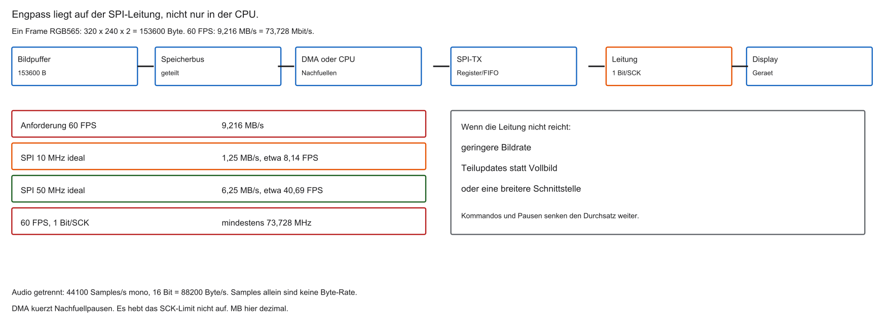

- Temperaturfühler: wenige Bytes/s — unkritisch
- Audio braucht Kanalzahl und Samplebreite: mono, 16 Bit, 44100 Samples/s sind 88200 Byte/s
- TFT $320\times 240$, RGB565, 60 FPS:

$$
320 \times 240 \times 2 \times 60 = 9\,216\,000\ \mathrm{Bytes/s}
$$

- CPU müsste millionenfach RAM lesen und SPI-Register füllen

::: notes
Das Problem: Datenmenge knüpft an den bisherigen Datenpfad an. RGB565 sind 16 Bit je Pixel. 320 mal 240 mal 2 sind 153600 Byte. Mal 60 sind 9,216 MB/s oder 73,728 Mbit/s. Mono 16 Bit bei 44100 Hz sind 88200 Byte/s, Stereo 176400. 10 MHz SPI schaffen ideal etwa 8,14 FPS, 50 MHz etwa 40,69. Für 60 FPS fehlen schon die reinen Nutzdaten. Temperaturfühler: wenige Bytes/s — unkritisch. Audio braucht Kanalzahl und Samplebreite: mono, 16 Bit, 44100 Samples/s sind 88200 Byte/s. Verständnischeck: Warum reichen 6,25 MB/s nicht? Der Bedarf ist 9,216 MB/s. Die nächste Folie nimmt die noch offene Modellfrage auf. Adressen und Zeiten sind Lehrannahmen. Code ist Lehrcode und wurde nicht kompiliert oder ausgeführt.
:::

## Refresher: Wie die CPU kopiert

- MCT1: Speicherzugriff über Load/Store
- `lw`: RAM → Register; `sw`: Register → MMIO (z. B. SPI-TX)
- Kein „direkt von RAM nach SPI“ in einem Befehl

```asm
loop:
    lw   t0, 0(s1)     /* RAM lesen */
    sw   t0, 0(s2)     /* Peripherie schreiben */
    addi s1, s1, 4
    bne  s1, s3, loop
```

::: notes
Refresher: Wie die CPU kopiert knüpft an den bisherigen Datenpfad an. lw lädt, sw speichert, addi addiert, bne verzweigt. s1 wandert als Quelle, s2 bleibt das feste Ziel, s3 ist das exklusive Ende, t0 das Zwischenregister. Vier Byte je Schritt nur bei erlaubten ausgerichteten Words. TX-Bereitschaft fehlt in diesem Ausschnitt. Lehrcode, nicht ausgeführt. MCT1: Speicherzugriff über Load/Store. `lw`: RAM → Register; `sw`: Register → MMIO (z. B. SPI-TX). Verständnischeck: Warum bleibt s2 konstant? Das Ziel ist ein einzelnes Register. Die nächste Folie nimmt die noch offene Modellfrage auf. Adressen und Zeiten sind Lehrannahmen. Code ist Lehrcode und wurde nicht kompiliert oder ausgeführt.
:::

## Agenda

1. CPU-Flaschenhals: Polling und Interrupt-Stürme
2. DMA: Bypass der CPU und Bus-Mastering
3. Kanäle und Konfiguration (Source, Destination, Increment)
4. Burst, Ringpuffer, Double Buffering
5. Labor-Ausblick (Renode)

::: notes
Agenda knüpft an den bisherigen Datenpfad an. Die Agenda fragt: Wer bewegt Daten, wer bekommt den Bus, welche Parameter gelten, wem gehört der Puffer, was kann ein späteres Modell zeigen? Kleine Transfers können per Software sinnvoll bleiben. Renode ist optional und hier nicht vorhanden. Verständnischeck: Welche zwei Abschlüsse werden getrennt? DMA-Ende und serielles Ende. Die nächste Folie nimmt die noch offene Modellfrage auf. Adressen und Zeiten sind Lehrannahmen. Code ist Lehrcode und wurde nicht kompiliert oder ausgeführt.
:::

## Lernziele Block 6

- Begründen, warum Polling und häufige ISRs den Prozessor auslasten
- Bus-Mastering und Arbitration im SoC erklären
- DMA-Kanal: Source, Destination, Increment Mode
- Cache-Kohärenz bei DMA einordnen
- Ringpuffer und Double Buffering (Ping-Pong) für Streams erklären

::: notes
Lernziele Block 6 knüpft an den bisherigen Datenpfad an. Prüfbar sind Rate, CPU-Aufwand, zwei Arbiter, Adresse, Breite, Count, Besitz und Nachfüllfrist. DMA ist eine Option, keine Qualitätsstufe. SRC, DST und COUNT allein genügen nicht. Begründen, warum Polling und häufige ISRs den Prozessor auslasten. Bus-Mastering und Arbitration im SoC erklären. Verständnischeck: Reicht SRC/DST/COUNT? Nein, Breite, Route, Leben und Sichtbarkeit fehlen. Die nächste Folie nimmt die noch offene Modellfrage auf. Adressen und Zeiten sind Lehrannahmen. Code ist Lehrcode und wurde nicht kompiliert oder ausgeführt.
:::

## Die Leitfrage des Tages

- 1 MB Array im SRAM (z. B. Bild) → SPI → Display
- Parallel: CPU führt schwere Berechnung aus (z. B. Edge-AI)
- Wie fließen die Bytes RAM → Peripherie, ohne die CPU-Rechnung zu stoppen?

```{mermaid}
%%| fig-width: 3.8
%%{init: {'theme': 'base', 'themeVariables': {'background': '#FFFFFF', 'primaryColor': '#FFFFFF', 'primaryBorderColor': '#E5E5EA', 'primaryTextColor': '#1D1D1F', 'lineColor': '#86868B', 'secondaryColor': '#F5F5F7', 'tertiaryColor': '#FFFFFF', 'mainBkg': '#FFFFFF', 'nodeBorder': '#E5E5EA', 'clusterBkg': '#F5F5F7', 'clusterBorder': '#E5E5EA', 'titleColor': '#1D1D1F', 'edgeLabelBackground': '#FFFFFF'}}}%%
flowchart LR
  RAM[(SRAM)] -.->|Tunnel?| SPI[SPI]
  CPU[CPU] -->|weiterrechnen| KI[Berechnung]
  style SPI fill:#FFFFFF,stroke:#E2001A,stroke-width:2px !important
```

::: notes
Die Leitfrage des Tages knüpft an den bisherigen Datenpfad an. Ein MB ist hier eine Million Byte und passt nicht in die spätere 256-KiB-Karte. Das Bild mit 153600 Byte ist ein anderes Beispiel. Edge-AI ist Motivation, kein vorhandenes Programm. Der Tunnel ist eine offene Architekturfrage. 1 MB Array im SRAM (z. B. Bild) → SPI → Display. Parallel: CPU führt schwere Berechnung aus (z. B. Edge-AI). Verständnischeck: Passt 1 MB in 256 KiB? Nein, getrennte Modelle. Die nächste Folie nimmt die noch offene Modellfrage auf. Adressen und Zeiten sind Lehrannahmen. Code ist Lehrcode und wurde nicht kompiliert oder ausgeführt.
:::

## Aufgabe — 60 FPS

Warum liefert DMA bei 50-MHz-SPI mit einem Bit je Takt kein RGB565-Vollbild mit 60 FPS?

::: notes
Aufgabe — 60 FPS knüpft an den bisherigen Datenpfad an. 153600 mal 60 sind 9216000 Byte/s. 50 MHz geteilt durch 8 sind 6,25 MB/s, also höchstens etwa 40,69 FPS. Der nötige reine SCK-Takt wäre 73,728 MHz, Zusatzaufwand liegt darüber. DMA entfernt nur Nachfüllpausen. Verständnischeck: Wie hoch ist der reine SCK-Bedarf? 73,728 MHz. Die nächste Folie nimmt die noch offene Modellfrage auf. Adressen und Zeiten sind Lehrannahmen. Code ist Lehrcode und wurde nicht kompiliert oder ausgeführt.
:::

## Methode 1: Polling

```c
/* Lehrcode. Ohne Deadline kann die Schleife hängen. */
void send_bild_polling(const uint8_t *bild, uint32_t length,
                       uint64_t deadline) {
    for (uint32_t i = 0; i < length; i++) {
        while ((SPI_STATUS_REG & TX_EMPTY_FLAG) == 0) {
            if (now() >= deadline) return; /* Fehlerpfad */
        }
        SPI_DATA_REG = bild[i];
    }
}
```

- TX_EMPTY ist ein Modellstatus, kein universelles FIFO-leer
- Rückkehr nach dem letzten Store ist nicht automatisch Leitungsende

::: notes
Methode 1: Polling knüpft an den bisherigen Datenpfad an. Die Schleife wartet auf TX_EMPTY und schreibt dann ein Byte. Ohne Deadline kann sie hängen. const schützt den Quellzeiger im C-Modell, nicht den Bus. Rückkehr nach dem letzten Store ist nicht CS darf HIGH. Bei Full-Duplex entstehen zugleich RX-Daten. TX_EMPTY ist ein Modellstatus, kein universelles FIFO-leer. Rückkehr nach dem letzten Store ist nicht automatisch Leitungsende. Verständnischeck: Was passiert, wenn TX_EMPTY nie kommt? Der alte Ausschnitt wartet endlos; der Lehrvertrag endet mit Fehler. Die nächste Folie nimmt die noch offene Modellfrage auf. Adressen und Zeiten sind Lehrannahmen. Code ist Lehrcode und wurde nicht kompiliert oder ausgeführt.
:::

## Die Polling-Falle

- Beispiel: SPI mit $10\,\mathrm{MHz}$-SCK, ein Bit je Takt → $0{,}8\,\mu\mathrm{s}$ je Byte
- $10^{6}$ Bytes brauchen mindestens $0{,}8\,\mathrm{s}$ Leitungszeit
- Bei angenommener 100-MHz-CPU sind das 80 Millionen Takte, nicht pauschal Milliarden
- Die aufrufende Funktion wartet. Aktivierte Interrupts können weiterlaufen

::: notes
Die Polling-Falle knüpft an den bisherigen Datenpfad an. Acht Bits durch 10 MHz sind 0,8 µs. Eine Million Byte brauchen mindestens 0,8 s. Bei 100 MHz sind das 80 Millionen Takte. SPI hat hier keine UART-Startbits. Aktivierte Interrupts können während der Warteschleife laufen. Nicht jedes Polling blockiert. Beispiel: SPI mit $10\,\mathrm{MHz}$-SCK, ein Bit je Takt → $0{,}8\,\mu\mathrm{s}$ je Byte. $10^{6}$ Bytes brauchen mindestens $0{,}8\,\mathrm{s}$ Leitungszeit. Verständnischeck: Warum ist 0,8 s eine Untergrenze? Zusatzpausen fehlen noch. Die nächste Folie nimmt die noch offene Modellfrage auf. Adressen und Zeiten sind Lehrannahmen. Code ist Lehrcode und wurde nicht kompiliert oder ausgeführt.
:::

## Methode 2: Interrupt-Versand

- SPI löst bei TX-leer Interrupt aus (über PLIC)
- ISR schreibt ein Byte; CPU rechnet dazwischen weiter

```c
volatile uint32_t bytes_sent;

void spi_tx_empty_isr(void) {
    if (bytes_sent < 1000000u) {
        SPI_DATA_REG = bild_array[bytes_sent++];
    } else {
        disable_tx_empty_irq(); /* sonst feuert die Quelle weiter */
    }
    /* bytes_sent: übergeben, nicht nachweislich auf der Leitung */
}
```

::: notes
Methode 2: Interrupt-Versand knüpft an den bisherigen Datenpfad an. Der Zähler zählt übergebene Bytes, nicht bereits ausgesendete. Ein 1000-Byte-Array ist keine Million Indizes. Beim letzten Byte den Bereitschafts-IRQ abschalten. volatile ist Sichtbarkeit, keine Atomarität. FIFO kann nach dem Zählerstand noch senden. SPI löst bei TX-leer Interrupt aus (über PLIC). ISR schreibt ein Byte; CPU rechnet dazwischen weiter. Verständnischeck: Sind alle Bytes auf der Leitung, wenn der Zähler fertig ist? Nein. Die nächste Folie nimmt die noch offene Modellfrage auf. Adressen und Zeiten sind Lehrannahmen. Code ist Lehrcode und wurde nicht kompiliert oder ausgeführt.
:::

## Interrupt-Overhead

Pro Interrupt typisch:

- Kontext sichern. Ein universelles Leeren der Pipeline gibt es nicht
- `mepc`/`mcause` setzen
- Register retten (Stack)
- Nutzarbeit: ein Byte kopieren
- Register wiederherstellen, `mret`

Oft Dutzende Takte Overhead für wenige Nutz-Takte.

::: notes
Interrupt-Overhead knüpft an den bisherigen Datenpfad an. Die Hardware setzt Trap-CSRs, die Software sichert Register. RISC-V hat keine allgemeinen PUSH-Befehle. mret beendet den Trap nach Wiederherstellung. Dutzende Takte sind eine Größenordnung; die Rechnung nutzt 100 Zyklen. Ein IRQ ist kein automatischer Taskwechsel. Kontext sichern. Ein universelles Leeren der Pipeline gibt es nicht. `mepc`/`mcause` setzen. Verständnischeck: Ist ein IRQ ein Taskwechsel? Nein. Die nächste Folie nimmt die noch offene Modellfrage auf. Adressen und Zeiten sind Lehrannahmen. Code ist Lehrcode und wurde nicht kompiliert oder ausgeführt.
:::

## Interrupt Storm

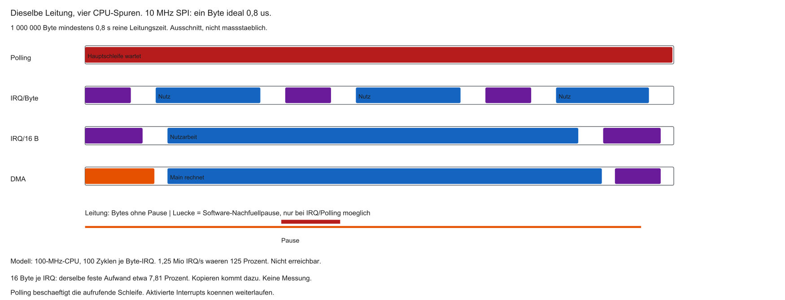

- SPI meldet „leer“ im Sub-µs- bis µs-Takt
- Millionen ISRs/s möglich
- CPU: Zeit geht in Push/Pop statt Nutzarbeit

| Phase | Was passiert |
|-------|----------------|
| kurz | KI/Main |
| lang | ISR-Overhead |
| kurz | KI/Main |
| lang | ISR-Overhead |

::: notes
Interrupt Storm knüpft an den bisherigen Datenpfad an. 1,25 Millionen Byte-IRQs je Sekunde mal 100 Zyklen bei 100 MHz sind 125 Prozent und nicht nachhaltig. Bei 16 Byte je IRQ bleiben etwa 7,81 Prozent festen Aufwands, ohne Kopierkosten. Die Spuren sind schematisch. Auch DMA kann die Leitung unterbrechen, wenn der Puffer fehlt. SPI meldet „leer“ im Sub-µs- bis µs-Takt. Millionen ISRs/s möglich. Verständnischeck: Warum reicht 125 Prozent als Gegenbeispiel? Es wird mehr CPU-Zeit verlangt, als vorhanden ist. Die nächste Folie nimmt die noch offene Modellfrage auf. Adressen und Zeiten sind Lehrannahmen. Code ist Lehrcode und wurde nicht kompiliert oder ausgeführt.
:::

## CPU als Postbote

- Polling und ISR: jedes Byte durch CPU-Register
- Pfad: RAM → Bus → (Cache) → Register → Bus → SPI
- ALU/Pipeline involviert, obwohl nur 1:1 kopiert wird

::: notes
CPU als Postbote knüpft an den bisherigen Datenpfad an. Der Weg ist Load, Register, Store auf MMIO. Die ALU rechnet Adressen, nicht zwingend den Dateninhalt. Die Postbotenmetapher gilt für große Mengen, nicht für jede kurze Kopie. Beim DMA entfällt die CPU als Zwischenstation jedes Elements. Polling und ISR: jedes Byte durch CPU-Register. Pfad: RAM → Bus → (Cache) → Register → Bus → SPI. Verständnischeck: Welche Station entfällt? Die CPU-Register je Element. Die nächste Folie nimmt die noch offene Modellfrage auf. Adressen und Zeiten sind Lehrannahmen. Code ist Lehrcode und wurde nicht kompiliert oder ausgeführt.
:::

## Bus-Engstelle beim Software-Kopieren

- Auch mit getrennten L1-I/D-Caches teilen sich CPU und Peripherie oft den Systembus zum Hauptspeicher
- Intensives `lw`/`sw`-Kopieren belegt diesen Pfad
- Instruction-Fetch und Nutzarbeit konkurrieren → Pipeline stottert

::: notes
Bus-Engstelle beim Software-Kopieren knüpft an den bisherigen Datenpfad an. Getrennte L1-Caches bedienen Treffer lokal. Misses teilen sich spätere Ressourcen. Ein lw ist nicht automatisch ein DRAM-Zugriff. DMA braucht ebenfalls Bandbreite. Von-Neumann ist hier ein historischer Bezug. Auch mit getrennten L1-I/D-Caches teilen sich CPU und Peripherie oft den Systembus zum Hauptspeicher. Intensives `lw`/`sw`-Kopieren belegt diesen Pfad. Verständnischeck: Verhindern getrennte Caches jeden Konflikt? Nein. Die nächste Folie nimmt die noch offene Modellfrage auf. Adressen und Zeiten sind Lehrannahmen. Code ist Lehrcode und wurde nicht kompiliert oder ausgeführt.
:::

## Lösung: Hardware-Assistent

- CPU = Manager (rechnen, entscheiden)
- Auftrag: Quelle, Ziel, Länge — dann weiterarbeiten
- Assistent schaufelt und meldet „fertig“
- Name: Direct Memory Access (DMA) / DMAC

::: notes
Lösung: Hardware-Assistent knüpft an den bisherigen Datenpfad an. Einmal konfigurieren gilt für einen Auftrag. Der Assistent meldet Phasen und Fehler, nicht nur Erfolg. Fertig ohne Bedeutung verwechselt DMA-Ende und Kommunikationsende. CPU = Manager (rechnen, entscheiden). Auftrag: Quelle, Ziel, Länge — dann weiterarbeiten. Verständnischeck: Was ist an fertig problematisch? Der DMA kann enden, während die Peripherie noch sendet. Die nächste Folie nimmt die noch offene Modellfrage auf. Adressen und Zeiten sind Lehrannahmen. Code ist Lehrcode und wurde nicht kompiliert oder ausgeführt.
:::

## Fragen? — Flaschenhals

- Warum Interrupt-Sturm bei schnellem SPI?
- Warum verschwenden `lw`/`sw`-Schleifen ALU/Bus?
- „Postboten“-Problem klar?

::: notes
Fragen? — Flaschenhals knüpft an den bisherigen Datenpfad an. Der Sturm ist Rate mal Aufwand. lw und sw führen Elemente durch Register. FIFO-Bündelung ändert das Budget. Vor der Wahl IRQ je Byte rechnet man Ereignisse mal Zyklen geteilt durch den CPU-Takt. Warum Interrupt-Sturm bei schnellem SPI?. Warum verschwenden `lw`/`sw`-Schleifen ALU/Bus?. Verständnischeck: Welche Größe zuerst? Ereignisse je Sekunde mal Zyklen je Ereignis durch die Taktrate. Die nächste Folie nimmt die noch offene Modellfrage auf. Adressen und Zeiten sind Lehrannahmen. Code ist Lehrcode und wurde nicht kompiliert oder ausgeführt.
:::

## Was ist DMA?

- DMA: Direct Memory Access — direkter Speicherzugriff
- Peripherie (SPI, UART, ADC, …) liest/schreibt RAM ohne CPU-Kopierschleife
- Steuerung: DMA-Controller (DMAC) als dediziertes Subsystem

::: notes
Was ist DMA knüpft an den bisherigen Datenpfad an. DMA bewegt Daten nach vorbereiteten Aufträgen. Im Modell ist der DMAC der Initiator. Der UART meldet Bereitschaft und ist MMIO-Ziel, nicht selbst Speicherbusmaster. CPU-Kopierfreiheit ist keine Busfreiheit. DMA: Direct Memory Access — direkter Speicherzugriff. Peripherie (SPI, UART, ADC, …) liest/schreibt RAM ohne CPU-Kopierschleife. Verständnischeck: Wer liest das RAM im UART-Modell? Der konfigurierte DMAC. Die nächste Folie nimmt die noch offene Modellfrage auf. Adressen und Zeiten sind Lehrannahmen. Code ist Lehrcode und wurde nicht kompiliert oder ausgeführt.
:::

## Bypass der CPU

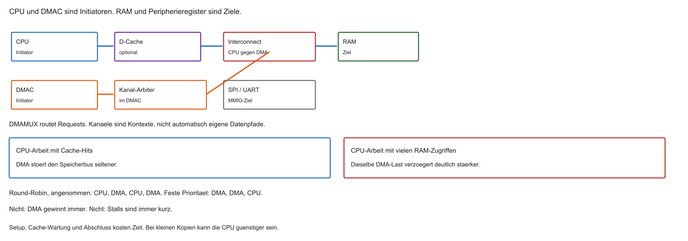

- Ohne DMA: RAM → CPU → UART/SPI
- Mit DMA: RAM → DMAC → Peripherie
- Der Kopierpfad läuft am Registerfile vorbei. Setup, Cache und Abschluss bleiben
- Buskonflikte können die CPU trotzdem verzögern

```{mermaid}
%%| fig-width: 3.8
%%{init: {'theme': 'base', 'themeVariables': {'background': '#FFFFFF', 'primaryColor': '#FFFFFF', 'primaryBorderColor': '#E5E5EA', 'primaryTextColor': '#1D1D1F', 'lineColor': '#86868B', 'secondaryColor': '#F5F5F7', 'tertiaryColor': '#FFFFFF', 'mainBkg': '#FFFFFF', 'nodeBorder': '#E5E5EA', 'clusterBkg': '#F5F5F7', 'clusterBorder': '#E5E5EA', 'titleColor': '#1D1D1F', 'edgeLabelBackground': '#FFFFFF'}}}%%
flowchart TD
  RAM[(SRAM)] <--> DMAC[DMA-Controller]
  DMAC <--> SPI[SPI]
  CPU[CPU] -.->|Auftrag| DMAC
  style DMAC fill:#FFFFFF,stroke:#E2001A,stroke-width:2px !important
```

::: notes
Bypass der CPU knüpft an den bisherigen Datenpfad an. Der Datenweg geht vom RAM über den Interconnect zum UART. Der Kanal-Arbiter wählt innerhalb des DMAC, der Interconnect-Arbiter zwischen CPU und DMA. Setup und Cache bleiben CPU-Arbeit. Ohne DMA: RAM → CPU → UART/SPI. Mit DMA: RAM → DMAC → Peripherie. Verständnischeck: Warum zwei Arbiter? Einer wählt Kanäle, einer teilt den gemeinsamen Bus. Die nächste Folie nimmt die noch offene Modellfrage auf. Adressen und Zeiten sind Lehrannahmen. Code ist Lehrcode und wurde nicht kompiliert oder ausgeführt.
:::

## Der DMA-Controller (DMAC)

- Eigenes Silizium-Modul auf dem SoC
- Keine allgemeine ALU — spezialisiert auf Adressen und Transfers
- Merkt sich u. a. Quelle, Ziel, Restlänge
- Oft mehrere Controller/Kanäle (DMA1, DMA2, …)

::: notes
Der DMA-Controller (DMAC) knüpft an den bisherigen Datenpfad an. Der DMAC hält Quelle, Ziel, Rest, Modus und Status. Keine allgemeine ALU heißt keine Anwendungsrechnung. Bei wenigen Bytes können Setup und Synchronisation teurer sein als eine Kopierschleife. Eigenes Silizium-Modul auf dem SoC. Keine allgemeine ALU — spezialisiert auf Adressen und Transfers. Verständnischeck: Warum kann eine kurze CPU-Kopie günstiger sein? Der DMA-Weg hat festen Aufwand. Die nächste Folie nimmt die noch offene Modellfrage auf. Adressen und Zeiten sind Lehrannahmen. Code ist Lehrcode und wurde nicht kompiliert oder ausgeführt.
:::

## Kampf um den Bus

- Oft ein gemeinsamer Pfad zum RAM
- Früher: CPU alleiniger Nutzer
- DMA will denselben Bus — Konfliktregelung nötig

::: notes
Kampf um den Bus knüpft an den bisherigen Datenpfad an. Mehrere Initiatoren können dieselbe RAM-Ressource brauchen. Parallel rechnen heißt nicht beliebig viele gleichzeitige Zugriffe auf einen Port. Echte SoCs können weitere Master haben. Oft ein gemeinsamer Pfad zum RAM. Früher: CPU alleiniger Nutzer. Verständnischeck: Warum reicht DMA läuft parallel nicht? Dieselbe Ressource kann der Engpass bleiben. Die nächste Folie nimmt die noch offene Modellfrage auf. Adressen und Zeiten sind Lehrannahmen. Code ist Lehrcode und wurde nicht kompiliert oder ausgeführt.
:::

## Bus-Mastering

- Bus-Master: darf selbst Transaktionen starten
- CPU: Bus-Master
- DMAC: ebenfalls Bus-Master
- UART/SPI-Datenregister typisch: Slave (passiv)

::: notes
Bus-Mastering knüpft an den bisherigen Datenpfad an. Ein Bus-Master startet Transaktionen. Der DMAC ist für Konfiguration ein MMIO-Ziel und für Nutzdaten ein Initiator. Das UART-Datenregister nimmt Stores entgegen. Das ist nicht die SPI-Rolle Controller gegen Target. Bus-Master: darf selbst Transaktionen starten. CPU: Bus-Master. Verständnischeck: Ist der DMAC nur Master? Nein, seine Register sind Ziele. Die nächste Folie nimmt die noch offene Modellfrage auf. Adressen und Zeiten sind Lehrannahmen. Code ist Lehrcode und wurde nicht kompiliert oder ausgeführt.
:::

## Bus-Arbitration

- Bus-Matrix / Arbiter steuert den Zugang
- Gleichzeitiger Zugriff CPU und DMA → Priorität entscheidet
- Priorität ist eine Politik, kein Naturgesetz. Round-Robin und feste Priorität unterscheiden
- „DMA gewinnt immer“ und „Stalls sind immer kurz“ gelten nicht allgemein

```{mermaid}
%%| fig-width: 3.6
%%{init: {'theme': 'base', 'themeVariables': {'background': '#FFFFFF', 'primaryColor': '#FFFFFF', 'primaryBorderColor': '#E5E5EA', 'primaryTextColor': '#1D1D1F', 'lineColor': '#86868B', 'secondaryColor': '#F5F5F7', 'tertiaryColor': '#FFFFFF', 'mainBkg': '#FFFFFF', 'nodeBorder': '#E5E5EA', 'clusterBkg': '#F5F5F7', 'clusterBorder': '#E5E5EA', 'titleColor': '#1D1D1F', 'edgeLabelBackground': '#FFFFFF'}}}%%
flowchart LR
  CPU[CPU] --> A{Arbiter}
  DMA[DMA] --> A
  A --> RAM[(SRAM)]
  style A fill:#FFFFFF,stroke:#E2001A,stroke-width:2px !important
```

::: notes
Bus-Arbitration knüpft an den bisherigen Datenpfad an. Round-Robin wechselt, feste Priorität kann einen niedrigeren Initiator aushungern, wenn keine Fairness gilt. Die CPU hat nicht immer die weichere Frist. Keine maximale Wartezeit ohne Busvertrag. Bus-Matrix / Arbiter steuert den Zugang. Gleichzeitiger Zugriff CPU und DMA → Priorität entscheidet. Verständnischeck: Garantiert DMA-Priorität kurze CPU-Stalls? Nein. Die nächste Folie nimmt die noch offene Modellfrage auf. Adressen und Zeiten sind Lehrannahmen. Code ist Lehrcode und wurde nicht kompiliert oder ausgeführt.
:::

## Cycle Stealing

- DMA „klaut“ gelegentlich Bus-Zyklen
- Kein ISR-Overhead pro Byte → Störung oft gering
- Mit L1-Cache rechnet die CPU oft ohne Dauerzugriff auf den Hauptspeicherbus

::: notes
Cycle Stealing knüpft an den bisherigen Datenpfad an. Cycle Stealing schiebt DMA-Zugriffe in eine gemeinsame Ressource. Das ist kein IRQ. Ein Cache-Hit kann lokal bleiben. Ein Stall braucht gleichzeitige Konkurrenz. DMA „klaut“ gelegentlich Bus-Zyklen. Kein ISR-Overhead pro Byte → Störung oft gering. Verständnischeck: Muss jeder DMA-Zugriff die CPU stoppen? Nein. Die nächste Folie nimmt die noch offene Modellfrage auf. Adressen und Zeiten sind Lehrannahmen. Code ist Lehrcode und wurde nicht kompiliert oder ausgeführt.
:::

## Transparent vs. Blocking

- Transparent: DMA nutzt Bus, wenn die CPU ihn ohnehin nicht braucht
- Blocking / Burst: DMA belegt den Bus länger — CPU stottert kurz
- Immer noch weit günstiger als C-Kopierschleifen

::: notes
Transparent vs. Blocking knüpft an den bisherigen Datenpfad an. Transparent und Burst sind Vereinfachungen, nicht jeder Controller. Asynchron starten beseitigt geteilte Busressourcen nicht. Ein guter Durchsatz kann die schlechteste Wartezeit verschlechtern. Immer günstiger als C gilt nicht. Transparent: DMA nutzt Bus, wenn die CPU ihn ohnehin nicht braucht. Blocking / Burst: DMA belegt den Bus länger — CPU stottert kurz. Verständnischeck: Kann ein DMA-Burst die CPU warten lassen? Ja. Die nächste Folie nimmt die noch offene Modellfrage auf. Adressen und Zeiten sind Lehrannahmen. Code ist Lehrcode und wurde nicht kompiliert oder ausgeführt.
:::

## Hardware-Handshake

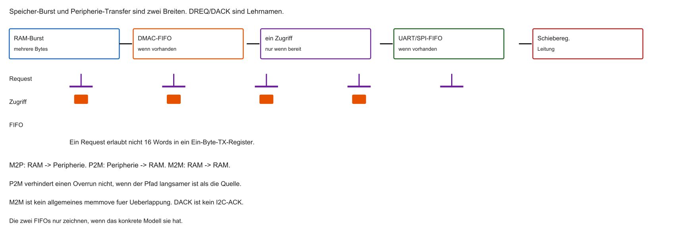

- DMA darf Peripherie nicht überfluten
- Synchronisation über dedizierte Signale im SoC (ohne CPU)

::: notes
Hardware-Handshake knüpft an den bisherigen Datenpfad an. DREQ und DACK sind Request und Acknowledge des DMA-Handshakes, kein I²C-ACK. Ein RAM-Burst darf ein Einbyte-TX-Register nicht überfüllen. Ein DMA-FIFO kann Raten entkoppeln, wenn er vorhanden ist. Eine dauerhaft schnellere Quelle bleibt ein Durchsatzproblem. DMA darf Peripherie nicht überfluten. Synchronisation über dedizierte Signale im SoC (ohne CPU). Verständnischeck: Darf ein 16-Word-Burst in ein Byte-Register? Nicht ohne Kapazitätsvertrag. Die nächste Folie nimmt die noch offene Modellfrage auf. Adressen und Zeiten sind Lehrannahmen. Code ist Lehrcode und wurde nicht kompiliert oder ausgeführt.
:::

## Request / Acknowledge (Handshake)

- Request (klassisch oft DREQ): Peripherie „Register leer / bereit“
- DMAC: Transfer RAM → Peripherie
- Acknowledge (klassisch oft DACK): „geliefert“
- Signale und Namen sind herstellerspezifisch — das Prinzip bleibt gleich

```{mermaid}
%%| fig-width: 3.6
%%{init: {'theme': 'base', 'themeVariables': {'background': '#FFFFFF', 'primaryColor': '#FFFFFF', 'primaryBorderColor': '#E5E5EA', 'primaryTextColor': '#1D1D1F', 'lineColor': '#86868B', 'secondaryColor': '#F5F5F7', 'tertiaryColor': '#FFFFFF', 'mainBkg': '#FFFFFF', 'nodeBorder': '#E5E5EA', 'clusterBkg': '#F5F5F7', 'clusterBorder': '#E5E5EA', 'titleColor': '#1D1D1F', 'edgeLabelBackground': '#FFFFFF'}}}%%
flowchart LR
  SPI -->|DREQ| DMAC
  DMAC -->|Daten| SPI
  DMAC -->|DACK| SPI
  style DMAC fill:#FFFFFF,stroke:#E2001A,stroke-width:2px !important
```

::: notes
Request / Acknowledge (Handshake) knüpft an den bisherigen Datenpfad an. Der Request zeigt Bereitschaft nach Controllervertrag. Puls oder Pegel und ein eigenes DACK sind herstellerspezifisch. DACK beweist nicht das letzte serielle Bit. Der UART erzeugt weiter Frame und Takt. Request (klassisch oft DREQ): Peripherie „Register leer / bereit“. DMAC: Transfer RAM → Peripherie. Verständnischeck: Beweist DACK das letzte Bit? Nein. Die nächste Folie nimmt die noch offene Modellfrage auf. Adressen und Zeiten sind Lehrannahmen. Code ist Lehrcode und wurde nicht kompiliert oder ausgeführt.
:::

## Richtung: Memory → Peripheral

- SRAM → UART / SPI / I2C / DAC
- Quelle: Array (Adresse steigt); Ziel: festes Datenregister
- Typisch: Audio-Out, Display-Refresh

::: notes
Richtung: Memory → Peripheral knüpft an den bisherigen Datenpfad an. M2P liest ein Array und schreibt ein festes Register. Die Quelle steigt, das Ziel bleibt. Daten müssen sichtbar sein und der Puffer leben. I²C-Adresse und ACK bleiben Treiberaufgaben. Ein DAC-Takt kommt vom Trigger, nicht vom RAM-Burst. SRAM → UART / SPI / I2C / DAC. Quelle: Array (Adresse steigt); Ziel: festes Datenregister. Verständnischeck: Warum bleibt DST konstant? Jeder Store trifft dasselbe TX-Register. Die nächste Folie nimmt die noch offene Modellfrage auf. Adressen und Zeiten sind Lehrannahmen. Code ist Lehrcode und wurde nicht kompiliert oder ausgeführt.
:::

## Richtung: Peripheral → Memory

- UART / SPI / ADC → SRAM
- z. B. ADC sampelt Mikrofon mit hoher Rate → DREQ → DMA füllt Puffer
- CPU wertet später aus (Spracherkennung etc.)

::: notes
Richtung: Peripheral → Memory knüpft an den bisherigen Datenpfad an. P2M hält die Quelle fest und steigert das Ziel. DMA verhindert keinen Overrun, wenn Bus oder Verarbeitung zu spät sind. Die CPU liest erst nach Phasengrenze und nötiger Synchronisation. UART / SPI / ADC → SRAM. z. B. ADC sampelt Mikrofon mit hoher Rate → DREQ → DMA füllt Puffer. Verständnischeck: Verhindert DMA jeden RX-Overrun? Nein. Die nächste Folie nimmt die noch offene Modellfrage auf. Adressen und Zeiten sind Lehrannahmen. Code ist Lehrcode und wurde nicht kompiliert oder ausgeführt.
:::

## Richtung: Memory → Memory

- SRAM-Array A → Array B
- Ersetzt/beschleunigt `memcpy`-artige Kopien
- Oft ohne externes DREQ — so schnell der Bus erlaubt

::: notes
Richtung: Memory → Memory knüpft an den bisherigen Datenpfad an. M2M steigert beide Adressen, wenn der Controller das kann. Überlappung ist nicht automatisch memmove. Flash braucht mehr als einen Store. Abschluss und gültiger Zielbereich bleiben nötig. SRAM-Array A → Array B. Ersetzt/beschleunigt `memcpy`-artige Kopien. Verständnischeck: Ist überlappendes M2M memmove? Nein. Die nächste Folie nimmt die noch offene Modellfrage auf. Adressen und Zeiten sind Lehrannahmen. Code ist Lehrcode und wurde nicht kompiliert oder ausgeführt.
:::

## DMA-Interrupts

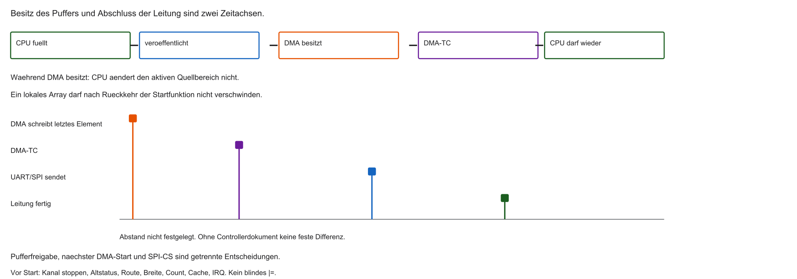

- Anbindung an PLIC / Interrupt-System
- Typisch: Transfer Complete (TC), Half Transfer (HT), Transfer Error (TE)
- Ein Interrupt nach $N$ Bytes statt $N$ Interrupts

::: notes
DMA-Interrupts knüpft an den bisherigen Datenpfad an. HT ist Half Transfer, TC Transfer Complete, TE Transfer Error. Im TX-Modell kann TC das Ende der DMA-Lesearbeit sein, während FIFO und Schieberegister noch senden. SPI-CS folgt dem Gerätevertrag, nicht allein TC. Anbindung an PLIC / Interrupt-System. Typisch: Transfer Complete (TC), Half Transfer (HT), Transfer Error (TE). Verständnischeck: Darf CS allein wegen TC hoch? Nur wenn der Leitungsabschluss zusätzlich belegt ist. Die nächste Folie nimmt die noch offene Modellfrage auf. Adressen und Zeiten sind Lehrannahmen. Code ist Lehrcode und wurde nicht kompiliert oder ausgeführt.
:::

## Fragen? — DMA-Grundlagen

- Was bedeutet Bus-Mastering?
- Wie schlichtet der Arbiter (Cycle Stealing)?
- Rolle des Hardware-Handshakes (Request/Acknowledge)?

::: notes
Fragen? — DMA-Grundlagen knüpft an den bisherigen Datenpfad an. Bus-Mastering ist eigenes Starten von Transaktionen. Arbitration wählt Anfragen. Cycle Stealing ist eine Strategie, nicht die einzige. Der Handshake verhindert unzulässige Peripheriebedienung nach seinem Vertrag, nicht jeden Systemfehler. Was bedeutet Bus-Mastering?. Wie schlichtet der Arbiter (Cycle Stealing)?. Verständnischeck: Ist Cycle Stealing die einzige Busregel? Nein. Die nächste Folie nimmt die noch offene Modellfrage auf. Adressen und Zeiten sind Lehrannahmen. Code ist Lehrcode und wurde nicht kompiliert oder ausgeführt.
:::

## DMA-Kanäle (Channels / Streams)

- Viele Peripherien wollen parallel Daten bewegen (UART, SPI, I2C, …)
- Ein DMAC hat daher mehrere Kanäle (z. B. Channel 0–7)
- Jeder Kanal: eigene Quelle, Ziel, Länge, Priorität
- Interner DMA-Arbiter: bei gleichzeitigen DREQs entscheidet die Kanalpriorität

```{mermaid}
%%| fig-width: 4.0
%%{init: {'theme': 'base', 'themeVariables': {'background': '#FFFFFF', 'primaryColor': '#FFFFFF', 'primaryBorderColor': '#E5E5EA', 'primaryTextColor': '#1D1D1F', 'lineColor': '#86868B', 'secondaryColor': '#F5F5F7', 'tertiaryColor': '#FFFFFF', 'mainBkg': '#FFFFFF', 'nodeBorder': '#E5E5EA', 'clusterBkg': '#F5F5F7', 'clusterBorder': '#E5E5EA', 'titleColor': '#1D1D1F', 'edgeLabelBackground': '#FFFFFF'}}}%%
flowchart LR
  SPI -->|DREQ| CH1[Kanal 1]
  UART -->|DREQ| CH2[Kanal 2]
  I2C -->|DREQ| CH3[Kanal 3]
  CH1 --> A{DMA-Arbiter}
  CH2 --> A
  CH3 --> A
  A --> Bus[Systembus]
  style A fill:#FFFFFF,stroke:#E2001A,stroke-width:2px !important
```

::: notes
DMA-Kanäle (Channels / Streams) knüpft an den bisherigen Datenpfad an. Ein Kanal ist eine gespeicherte Konfiguration, nicht automatisch ein eigener Datenpfad. Acht Kanäle können sich eine Engine teilen. Kanalpriorität ist nicht die PLIC-Priorität. Die Zuordnung Audio und Log ist fiktiv. Viele Peripherien wollen parallel Daten bewegen (UART, SPI, I2C, …). Ein DMAC hat daher mehrere Kanäle (z. B. Channel 0–7). Verständnischeck: Garantieren acht Kanäle acht gleichzeitige Kopien? Nein. Die nächste Folie nimmt die noch offene Modellfrage auf. Adressen und Zeiten sind Lehrannahmen. Code ist Lehrcode und wurde nicht kompiliert oder ausgeführt.
:::

## Multiplexing der Kanäle (DMAMUX)

- Oft mehr Peripherien als DMA-Kanäle
- Lösung: Multiplexer-Matrix (häufig DMAMUX) vor dem DMAC
- Software verbindet z. B. `UART_TX`-Request mit Kanal 3
- Doppelbelegung desselben Kanals → undokumentiertes / fehlerhaftes Verhalten
- Referenzhandbuch: Request-Tabellen sind Pflichtlektüre

::: notes
Multiplexing der Kanäle (DMAMUX) knüpft an den bisherigen Datenpfad an. DMAMUX leitet Requests, er kopiert keine Nutzdaten. Nicht jeder SoC hat einen programmierbaren Multiplexer. Route und Zieladresse müssen beide stimmen. Ein aktiver Kanal wird nicht nebenbei umgeschaltet. Oft mehr Peripherien als DMA-Kanäle. Lösung: Multiplexer-Matrix (häufig DMAMUX) vor dem DMAC. Verständnischeck: Reicht das UART-Mapping bei falschem Ziel? Nein. Die nächste Folie nimmt die noch offene Modellfrage auf. Adressen und Zeiten sind Lehrannahmen. Code ist Lehrcode und wurde nicht kompiliert oder ausgeführt.
:::

## MMIO-Register eines Kanals

- Steuerung über Memory-Mapped Register
- In C oft als `struct` abgebildet
- Vier Kernfragen: Woher? Wohin? Wie viel? Welche Breite / Modi?

```c
typedef struct {
    volatile uint32_t SRC_ADDR;  /* Quelle */
    volatile uint32_t DST_ADDR;  /* Ziel */
    volatile uint32_t COUNT;     /* Anzahl */
    volatile uint32_t CONTROL;   /* Breite, Enable, … */
} DMA_Channel_TypeDef;

/* fiktiv — Labor: Datenblatt / Renode */
#define DMA_CH1 ((DMA_Channel_TypeDef *)0x40020000u)
```

::: notes
MMIO-Register eines Kanals knüpft an den bisherigen Datenpfad an. volatile betrifft Compilerzugriffe, nicht Kohärenz. Die Struktur bei 0x40020000 ist fiktiv. Ein Cast macht kein gültiges Layout. CONTROL bündelt Modus und Enable und darf nur nach Vertrag geschrieben werden. Steuerung über Memory-Mapped Register. In C oft als `struct` abgebildet. Verständnischeck: Wird eine C-Struktur automatisch ein Registerblock? Nein. Die nächste Folie nimmt die noch offene Modellfrage auf. Adressen und Zeiten sind Lehrannahmen. Code ist Lehrcode und wurde nicht kompiliert oder ausgeführt.
:::

## Parameter 1: Source Address (SRC)

- Physikalische Startadresse der Quelle in `SRC_ADDR`
- Senden: oft Adresse eines Arrays im SRAM
- DMA liest von dort (ggf. mit Auto-Inkrement)

```c
uint8_t bild_array[1000];
DMA_CH1->SRC_ADDR = (uint32_t)&bild_array[0];
```

::: notes
Parameter 1: Source Address (SRC) knüpft an den bisherigen Datenpfad an. Die Quelle muss für den DMA erreichbar sein und leben. uintptr_t ist eine Pointerdarstellung, kein Mapping und kein Beweis für 32 Bit. Ein 1000-Byte-Array ist nicht der 4096-Byte-UART-Puffer und nicht die Million-Byte-Rechnung. Physikalische Startadresse der Quelle in `SRC_ADDR`. Senden: oft Adresse eines Arrays im SRAM. Verständnischeck: Warum reicht uintptr_t nicht? Er beweist weder Erreichbarkeit noch Wertebereich. Die nächste Folie nimmt die noch offene Modellfrage auf. Adressen und Zeiten sind Lehrannahmen. Code ist Lehrcode und wurde nicht kompiliert oder ausgeführt.
:::

## Parameter 2: Destination Address (DST)

- Zieladresse in `DST_ADDR`
- Senden über SPI/UART: Adresse des Datenregisters (z. B. TX_DATA)
- DMA schreibt blind auf diese Adresse

```c
#define SPI_TX_DATA_REG 0x4003000Cu  /* fiktiv */

DMA_CH1->DST_ADDR = SPI_TX_DATA_REG;
```

::: notes
Parameter 2: Destination Address (DST) knüpft an den bisherigen Datenpfad an. Das Ziel im UART-Modell ist ein festes TX-Register. 0x4003000C ist hier UART, nicht zugleich SPI. Ein Store übergibt Daten, beendet nicht das letzte Bit. Eine falsche, aber gültige Adresse kann ein Nachbarregister ändern, ohne Busfehler. Zieladresse in `DST_ADDR`. Senden über SPI/UART: Adresse des Datenregisters (z. B. TX_DATA). Verständnischeck: Was kann eine falsche MMIO-Adresse tun? Ein anderes Register still verändern. Die nächste Folie nimmt die noch offene Modellfrage auf. Adressen und Zeiten sind Lehrannahmen. Code ist Lehrcode und wurde nicht kompiliert oder ausgeführt.
:::

## Parameter 3: Transfer Count

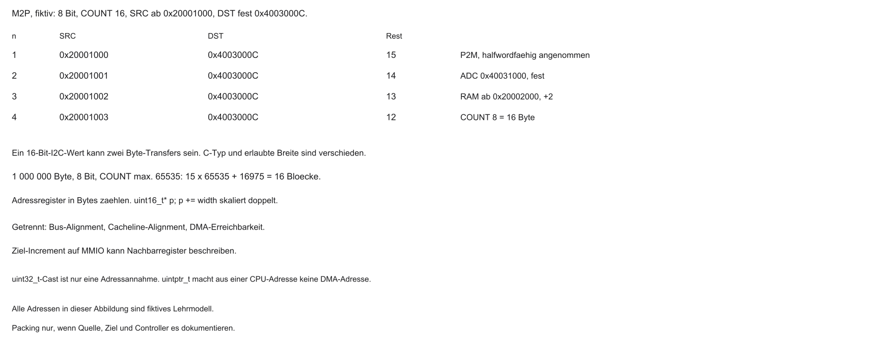

- `COUNT` zählt Transferelemente, nicht automatisch Bytes
- Beispiel: höchstens 65535 Elemente. 1000000 Byte zu 8 Bit brauchen 16 Blöcke: fünfzehnmal 65535 plus 16975
- Nach erfolgreichem Transfer: Hardware dekrementiert automatisch
- COUNT zählt Elemente. Null vor dem Start ist kein allgemeiner Leerauftrag
- Nach dem letzten Element kann TC folgen; Rest null allein beweist keinen fehlerfreien Abschluss

```{mermaid}
%%| fig-width: 3.6
%%{init: {'theme': 'base', 'themeVariables': {'background': '#FFFFFF', 'primaryColor': '#FFFFFF', 'primaryBorderColor': '#E5E5EA', 'primaryTextColor': '#1D1D1F', 'lineColor': '#86868B', 'secondaryColor': '#F5F5F7', 'tertiaryColor': '#FFFFFF', 'mainBkg': '#FFFFFF', 'nodeBorder': '#E5E5EA', 'clusterBkg': '#F5F5F7', 'clusterBorder': '#E5E5EA', 'titleColor': '#1D1D1F', 'edgeLabelBackground': '#FFFFFF'}}}%%
flowchart LR
  A[COUNT = 1000] --> B[Transfer]
  B --> C[COUNT = 999]
  C --> D[COUNT = 0]
  D -->|STOP| E[IRQ an CPU]
  style E fill:#FFFFFF,stroke:#E2001A,stroke-width:2px !important
```

::: notes
Parameter 3: Transfer Count knüpft an den bisherigen Datenpfad an. COUNT zählt Elemente. Bei Start 16 und Bytezugriff steht nach dem ersten Rest 15. Eine Million Byte bei höchstens 65535 Elementen braucht 15 mal 65535 plus 16975, also 16 Blöcke. Rest null allein ist kein fehlerfreier Erfolg. Circular lädt neu, Normal endet. `COUNT` zählt Transferelemente, nicht automatisch Bytes. Beispiel: höchstens 65535 Elemente. 1000000 Byte zu 8 Bit brauchen 16 Blöcke: fünfzehnmal 65535 plus 16975. Verständnischeck: Wie viele Blöcke für eine Million Byte? Sechzehn. Die nächste Folie nimmt die noch offene Modellfrage auf. Adressen und Zeiten sind Lehrannahmen. Code ist Lehrcode und wurde nicht kompiliert oder ausgeführt.
:::

## Parameter 4: Data Width

- Pro Transfer: 8, 16 oder 32 Bit — nur wenn Quelle, Ziel und DMA-Pfad das erlauben
- Ein `uint16_t` im C-Programm rechtfertigt keinen Halfword-Zugriff auf ein Byte-Register

| C-Typ | DMA-Breite | Transfers für 32 Bit Nutzdaten |
|-------|------------|--------------------------------|
| `uint8_t` | Byte (8) | 4 |
| `uint16_t` | Halfword (16) | 2 |
| `uint32_t` | Word (32) | 1 (oft maximal effizient) |

::: notes
Parameter 4: Data Width knüpft an den bisherigen Datenpfad an. Die Tabelle rechnet 32 Bit Nutzinhalt um, sie konfiguriert keine Hardware nach C-Typ. Ein 16-Bit-Wert über ein Byte-RX braucht zwei Zugriffe. Word auf ein Byte-Register kann unzulässig sein. uint16_t audio darf nicht automatisch als Halfword in jeden UART. Pro Transfer: 8, 16 oder 32 Bit — nur wenn Quelle, Ziel und DMA-Pfad das erlauben. Ein `uint16_t` im C-Programm rechtfertigt keinen Halfword-Zugriff auf ein Byte-Register. Verständnischeck: Darf jedes uint16_t-Array per Halfword in den UART? Nein. Die nächste Folie nimmt die noch offene Modellfrage auf. Adressen und Zeiten sind Lehrannahmen. Code ist Lehrcode und wurde nicht kompiliert oder ausgeführt.
:::

## Address Increment Mode

- Arrays: Pointer muss wandern — sonst 1000× dieselbe Adresse
- INC: nach jedem Transfer $+$ Data-Width auf SRC und/oder DST
- Hardware-Äquivalent zu `pointer++`
- Quelle und Ziel getrennt schaltbar

```c
/* Konzept — in Hardware als Auto-Inkrement */
*DST_ADDR = *SRC_ADDR;
SRC_ADDR += width;  /* wenn Memory-Increment aktiv */
```

::: notes
Address Increment Mode knüpft an den bisherigen Datenpfad an. Der Ausdruck mit Stern auf einem Adressregister ist kein lauffähiges C. Numerisch steigt die Byteadresse um die Breite in Byte. Ein uint16_t-Zeiger mit p++ steigt schon um zwei Byte; p += 2 steigt um vier. SRC- und DST-Inkrement sind getrennt. Arrays: Pointer muss wandern — sonst 1000× dieselbe Adresse. INC: nach jedem Transfer $+$ Data-Width auf SRC und/oder DST. Verständnischeck: Was tut p += 2 bei uint16_t? Zwei Elemente, typischerweise vier Byte. Die nächste Folie nimmt die noch offene Modellfrage auf. Adressen und Zeiten sind Lehrannahmen. Code ist Lehrcode und wurde nicht kompiliert oder ausgeführt.
:::

## Memory → Peripheral: Pointer

- Source Increment: **an** (Array durchlaufen)
- Destination Increment: **aus** (festes TX-Register)
- Ziel inkrementieren → Schreiben neben das Register → oft Bus Fault

```{mermaid}
%%| fig-width: 3.8
%%{init: {'theme': 'base', 'themeVariables': {'background': '#FFFFFF', 'primaryColor': '#FFFFFF', 'primaryBorderColor': '#E5E5EA', 'primaryTextColor': '#1D1D1F', 'lineColor': '#86868B', 'secondaryColor': '#F5F5F7', 'tertiaryColor': '#FFFFFF', 'mainBkg': '#FFFFFF', 'nodeBorder': '#E5E5EA', 'clusterBkg': '#F5F5F7', 'clusterBorder': '#E5E5EA', 'titleColor': '#1D1D1F', 'edgeLabelBackground': '#FFFFFF'}}}%%
flowchart LR
  A[SRAM++] -->|INC an| B[UART_TX fest]
  style B fill:#FFFFFF,stroke:#E2001A,stroke-width:2px !important
```

::: notes
Memory → Peripheral: Pointer knüpft an den bisherigen Datenpfad an. Quellbytes 0x20001000 bis 03, Ziel bleibt 0x4003000C. Nach vier Byteelementen ist DST unverändert. Ein gesetztes Zielinkrement würde Nachbarregister treffen, nicht zuverlässig einen Busfault auslösen. Source Increment: **an** (Array durchlaufen). Destination Increment: **aus** (festes TX-Register). Verständnischeck: Wie ändert sich DST nach vier Bytes? Gar nicht. Die nächste Folie nimmt die noch offene Modellfrage auf. Adressen und Zeiten sind Lehrannahmen. Code ist Lehrcode und wurde nicht kompiliert oder ausgeführt.
:::

## Peripheral → Memory: Pointer

- Source Increment: **aus** (festes ADC-/RX-Register)
- Destination Increment: **an** (Werte im Array ablegen)

```{mermaid}
%%| fig-width: 3.8
%%{init: {'theme': 'base', 'themeVariables': {'background': '#FFFFFF', 'primaryColor': '#FFFFFF', 'primaryBorderColor': '#E5E5EA', 'primaryTextColor': '#1D1D1F', 'lineColor': '#86868B', 'secondaryColor': '#F5F5F7', 'tertiaryColor': '#FFFFFF', 'mainBkg': '#FFFFFF', 'nodeBorder': '#E5E5EA', 'clusterBkg': '#F5F5F7', 'clusterBorder': '#E5E5EA', 'titleColor': '#1D1D1F', 'edgeLabelBackground': '#FFFFFF'}}}%%
flowchart LR
  B[ADC_DATA fest] -->|INC an| A[SRAM++]
  style B fill:#FFFFFF,stroke:#E2001A,stroke-width:2px !important
```

::: notes
Peripheral → Memory: Pointer knüpft an den bisherigen Datenpfad an. Im Halfword-ADC-Modell bleibt 0x40031000 fest, das Ziel startet bei 0x20002000 und steigt um zwei. COUNT acht sind 16 Byte. UART-RX als Byte ist ein anderes Modell. Ein MMIO-Read ist keine wiederholbare RAM-Abfrage. Source Increment: **aus** (festes ADC-/RX-Register). Destination Increment: **an** (Werte im Array ablegen). Verständnischeck: Warum kein Source-Increment? Das nächste Sample kommt aus demselben Register. Die nächste Folie nimmt die noch offene Modellfrage auf. Adressen und Zeiten sind Lehrannahmen. Code ist Lehrcode und wurde nicht kompiliert oder ausgeführt.
:::

## Memory Alignment

- Word-Transfers (32 Bit): Startadressen typisch 4-Byte-aligned
- Unaligned (z. B. `0x20000001`) → oft Bus Error / Transfer Error
- In C Alignment erzwingen:

```c
__attribute__((aligned(4))) uint8_t dma_buffer[1000];
```

::: notes
Memory Alignment knüpft an den bisherigen Datenpfad an. 0x20000001 ist nicht durch vier teilbar, 0x20000000 schon. aligned(4) ist eine Compilerhilfe, keine RISC-V-Instruktion und keine 64-Byte-Cacheline. Ein 1000-Byte-Puffer braucht im 64-Byte-Modell 1024 Byte isolierte Fläche, die Nutzlänge bleibt 1000. Word-Transfers (32 Bit): Startadressen typisch 4-Byte-aligned. Unaligned (z. B. `0x20000001`) → oft Bus Error / Transfer Error. Verständnischeck: Reicht aligned(4) für 64-Byte-Zeilen? Nein. Die nächste Folie nimmt die noch offene Modellfrage auf. Adressen und Zeiten sind Lehrannahmen. Code ist Lehrcode und wurde nicht kompiliert oder ausgeführt.
:::

## Cache-Kohärenz und DMA

- Relevant, sobald ein Data-Cache (Write-Back) vorhanden ist — viele einfache MCUs haben keinen
- Erinnerung Block 2: L1-D-Cache puffert RAM-Inhalte
- DMA sieht den CPU-D-Cache typischerweise **nicht** — Zugriff auf den physischen Speicher
- CPU und DMA können unterschiedliche Sicht auf dieselben Adressen haben

```{mermaid}
%%| fig-width: 3.8
%%{init: {'theme': 'base', 'themeVariables': {'background': '#FFFFFF', 'primaryColor': '#FFFFFF', 'primaryBorderColor': '#E5E5EA', 'primaryTextColor': '#1D1D1F', 'lineColor': '#86868B', 'secondaryColor': '#F5F5F7', 'tertiaryColor': '#FFFFFF', 'mainBkg': '#FFFFFF', 'nodeBorder': '#E5E5EA', 'clusterBkg': '#F5F5F7', 'clusterBorder': '#E5E5EA', 'titleColor': '#1D1D1F', 'edgeLabelBackground': '#FFFFFF'}}}%%
flowchart TD
  CPU[CPU] <--> Cache[L1 Cache]
  Cache -.->|Write-Back verzögert| RAM[(SRAM)]
  DMAC[DMA] <-->|liest/schreibt RAM| RAM
  style Cache fill:#FFFFFF,stroke:#E2001A,stroke-width:2px !important
```

::: notes
Cache-Kohärenz und DMA knüpft an den bisherigen Datenpfad an. Ohne D-Cache, mit kohärentem DMA oder ohne Kohärenz sind drei Fälle. Eine saubere alte RX-Kopie kann falsch sein, nicht nur Write-Back. Write-Back kann eine schmutzige Zeile später zurückschreiben. Das Modell sagt nicht, jeder DMA sehe nie den Cache. Relevant, sobald ein Data-Cache (Write-Back) vorhanden ist — viele einfache MCUs haben keinen. Erinnerung Block 2: L1-D-Cache puffert RAM-Inhalte. Verständnischeck: Kann eine saubere RX-Zeile stören? Ja, wenn sie nach dem DMA-Write noch gelesen wird. Die nächste Folie nimmt die noch offene Modellfrage auf. Adressen und Zeiten sind Lehrannahmen. Code ist Lehrcode und wurde nicht kompiliert oder ausgeführt.
:::

## Stale Data (beide Richtungen)

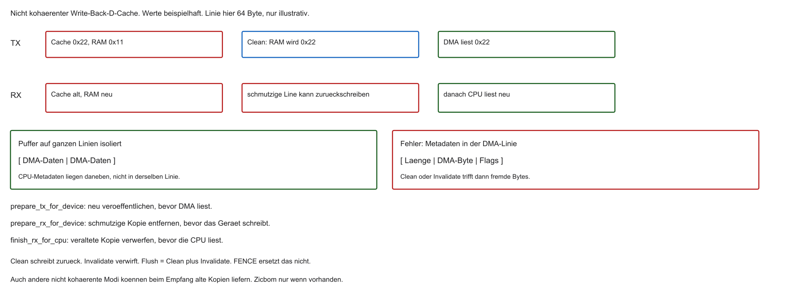

- Senden (CPU → DMA): frische Daten nur im Cache → DMA sendet alte RAM-Inhalte
- Empfangen (DMA → CPU): frische Daten im RAM → CPU trifft veralteten Cache-Hit
- TX: Daten vor dem DMA-Start veröffentlichen. RX: Bereich vor der Übergabe vorbereiten und nach Abschluss synchronisieren
- Nur „danach invalidieren“ schützt nicht vor einer schmutzigen Zeile, die später zurückschreibt

::: notes
Stale Data (beide Richtungen) knüpft an den bisherigen Datenpfad an. TX: Cache hält 0x22, RAM noch 0x11, DMA liest ohne Clean 0x11. RX: alte Kopie und zusätzlich eine dirty Rückschreibung können neue Daten zerstören. Vor RX die alte schmutzige Kopie beseitigen, nach RX vor dem CPU-Lesen synchronisieren. Der Puffer darf während des Besitzes nicht erneut dirty werden. Senden (CPU → DMA): frische Daten nur im Cache → DMA sendet alte RAM-Inhalte. Empfangen (DMA → CPU): frische Daten im RAM → CPU trifft veralteten Cache-Hit. Verständnischeck: Warum reicht Invalidieren nach RX nicht allein? Eine alte dirty Zeile kann schon zurückgeschrieben haben. Die nächste Folie nimmt die noch offene Modellfrage auf. Adressen und Zeiten sind Lehrannahmen. Code ist Lehrcode und wurde nicht kompiliert oder ausgeführt.
:::

## Cache Clean / Invalidate

- Clean (Flush): vor DMA-Sendestart schmutzige Lines des Puffers in den RAM schreiben
- Invalidate: vor CPU-Lesen empfangener DMA-Daten Lines verwerfen → nächster Read geht zum RAM
- API ist plattformabhängig (ARM: Cache-Maintenance; RISC-V: Fence ordnet Zugriffe; für Cache-Kohärenz ggf. Zicbom — `cbo.clean`/`cbo.inval`)

```c
bild_berechnen();
/* Konzept: Cache-Bereich in den RAM schreiben */
cache_clean((uintptr_t)bild_array, sizeof(bild_array));
dma_start();
```

::: notes
Cache Clean / Invalidate knüpft an den bisherigen Datenpfad an. Clean veröffentlicht Änderungen. Invalidate verwirft eine Kopie. Flush meint hier Clean plus Invalidate; APIs können anders heißen. FENCE ordnet und bereinigt den Cache nicht. Zicbom ist optional und hier nicht nachgewiesen. Wenige Takte ohne Längenmodell streichen. Clean (Flush): vor DMA-Sendestart schmutzige Lines des Puffers in den RAM schreiben. Invalidate: vor CPU-Lesen empfangener DMA-Daten Lines verwerfen → nächster Read geht zum RAM. Verständnischeck: Machen volatile oder FENCE den TX-Puffer aktuell? Nein. Die nächste Folie nimmt die noch offene Modellfrage auf. Adressen und Zeiten sind Lehrannahmen. Code ist Lehrcode und wurde nicht kompiliert oder ausgeführt.
:::

## Uncached DMA-Zonen

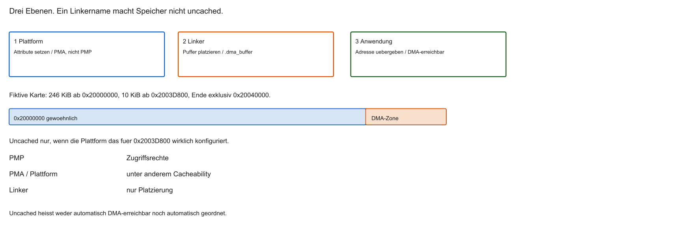

- Alternative nur, wenn die Plattform einen nicht gecachten Bereich bereitstellt
- Standard-RISC-V-PMP regelt Zugriffsrechte, nicht Cacheability. Dafür sind PMAs oder die Plattform zuständig
- Der Linker legt `.dma_buffer` in einen Bereich, dessen Attribute schon gelten
- Uncached ist nicht automatisch DMA-erreichbar und nicht die einzige professionelle Lösung

```text
MEMORY {
  RAM_CACHED   : ORIGIN = 0x20000000, LENGTH = 246K
  RAM_UNCACHED : ORIGIN = 0x2003D800, LENGTH = 10K  /* DMA */
}
```

::: notes
Uncached DMA-Zonen knüpft an den bisherigen Datenpfad an. PMA sind Speichereigenschaften, PMP ist Hart-Zugriffsschutz. Der Linkername RAM_UNCACHED setzt keine Attribute. 246 KiB ab 0x20000000 enden exklusiv bei 0x2003D800, danach 10 KiB bis 0x20040000. K im GNU-Linker-Modell ist 1024 Byte. Ein 1-MB-Array passt nicht hinein. Alternative nur, wenn die Plattform einen nicht gecachten Bereich bereitstellt. Standard-RISC-V-PMP regelt Zugriffsrechte, nicht Cacheability. Dafür sind PMAs oder die Plattform zuständig. Verständnischeck: Passt 1 MB in die Karte? Nein, sie hat 256 KiB. Die nächste Folie nimmt die noch offene Modellfrage auf. Adressen und Zeiten sind Lehrannahmen. Code ist Lehrcode und wurde nicht kompiliert oder ausgeführt.
:::

## Aufgabe — Adresse und Linker

Welche Adresse bleibt beim UART-TX fest? Macht der Name `RAM_UNCACHED` den Bereich uncached?

::: notes
Aufgabe — Adresse und Linker knüpft an den bisherigen Datenpfad an. Beim UART-TX wandert die Quelle, das Ziel bleibt. Uncached ist nur ein Name, bis die Plattform das Attribut setzt. Erreichbarkeit, Breite, Besitz und Ordnung bleiben. Verständnischeck: Darf ein platzierter Puffer sofort starten? Nein. Die nächste Folie nimmt die noch offene Modellfrage auf. Adressen und Zeiten sind Lehrannahmen. Code ist Lehrcode und wurde nicht kompiliert oder ausgeführt.
:::

## Single-Transfer vs. Burst

- Single: ein DREQ → typisch ein Read + ein Write; Bus danach wieder frei
- Burst: nach einem Request ein Block (z. B. 16 Words) am Stück
- Burst: höherer Durchsatz, kurz härtere Busbelegung für die CPU

::: notes
Single-Transfer vs. Burst knüpft an den bisherigen Datenpfad an. Ein Request erlaubt nicht automatisch 16 Words in die Peripherie. Der Controller kann die DMA-Länge in Teilbursts teilen. Längere Belegung kann andere Initiatoren verzögern. Bandbreite ist bedingt, nicht maximal in jedem Fall. Single: ein DREQ → typisch ein Read + ein Write; Bus danach wieder frei. Burst: nach einem Request ein Block (z. B. 16 Words) am Stück. Verständnischeck: Ist die ganze DMA-Länge ein Busburst? Nein. Die nächste Folie nimmt die noch offene Modellfrage auf. Adressen und Zeiten sind Lehrannahmen. Code ist Lehrcode und wurde nicht kompiliert oder ausgeführt.
:::

## Warum Burst-Transfers?

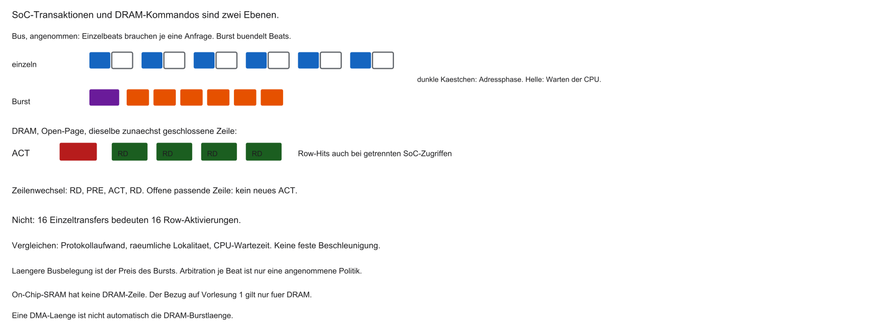

- On-Chip-SRAM: Burst spart vor allem wiederholte Bus-Arbitration
- Externes DRAM (Block 1): Zeile öffnen kostet; offene Zeile → schnelle Column-Zugriffe
- Eine offene Zeile kann mehrere Reads bedienen, auch bei getrennten SoC-Zugriffen
- Ein Zeilenwechsel braucht PRE und ACT. SRAM hat diese Zeilenlogik nicht

| Modus | Typischer Nachteil Single | Vorteil Burst |
|-------|---------------------------|---------------|
| On-Chip-SRAM | 16× Arbitration | 1× Arbitration, hoher Durchsatz |
| DRAM | Zeile kann schon offen sein | Row-Hits hängen von Abbildung und Politik ab |

::: notes
Warum Burst-Transfers knüpft an den bisherigen Datenpfad an. 16 getrennte Beats können denselben Anfrageaufwand wiederholen. Das ist kein Gesetz jedes Interconnects. Mehrere Reads derselben offenen DRAM-Zeile brauchen nicht je ein ACT. PRE schließt die Zeile, ACT öffnet sie. SRAM hat diese Kommandos nicht. On-Chip-SRAM: Burst spart vor allem wiederholte Bus-Arbitration. Externes DRAM (Block 1): Zeile öffnen kostet; offene Zeile → schnelle Column-Zugriffe. Verständnischeck: Brauchen 16 Reads derselben Zeile 16 Aktivierungen? Nein. Die nächste Folie nimmt die noch offene Modellfrage auf. Adressen und Zeiten sind Lehrannahmen. Code ist Lehrcode und wurde nicht kompiliert oder ausgeführt.
:::

## FIFOs im DMAC

- Problem: Burst holt schnell aus dem RAM; SPI/UART sind langsamer
- Viele DMACs: interner FIFO als Zwischenpuffer
- Burst → FIFO füllen → Bus freigeben → Peripherie per DREQ aus dem FIFO füttern

```{mermaid}
%%| fig-width: 3.6
%%{init: {'theme': 'base', 'themeVariables': {'background': '#FFFFFF', 'primaryColor': '#FFFFFF', 'primaryBorderColor': '#E5E5EA', 'primaryTextColor': '#1D1D1F', 'lineColor': '#86868B', 'secondaryColor': '#F5F5F7', 'tertiaryColor': '#FFFFFF', 'mainBkg': '#FFFFFF', 'nodeBorder': '#E5E5EA', 'clusterBkg': '#F5F5F7', 'clusterBorder': '#E5E5EA', 'titleColor': '#1D1D1F', 'edgeLabelBackground': '#FFFFFF'}}}%%
flowchart LR
  RAM[(SRAM)] -->|Burst| FIFO[DMA-FIFO]
  FIFO -->|DREQ-getaktet| SPI[SPI]
  style FIFO fill:#FFFFFF,stroke:#E2001A,stroke-width:2px !important
```

::: notes
FIFOs im DMAC knüpft an den bisherigen Datenpfad an. Der FIFO holt einen Speicherburst und gibt den Bus frei, die Peripherie nimmt bei Bereitschaft. Ein endlicher Puffer heilt keinen dauerhaft höheren Eingang. Prefetch trennt DMA-Lesende und tatsächliche Ausgabe. Problem: Burst holt schnell aus dem RAM; SPI/UART sind langsamer. Viele DMACs: interner FIFO als Zwischenpuffer. Verständnischeck: Kann ein FIFO eine dauerhaft höhere Rate unbegrenzt schlucken? Nein. Die nächste Folie nimmt die noch offene Modellfrage auf. Adressen und Zeiten sind Lehrannahmen. Code ist Lehrcode und wurde nicht kompiliert oder ausgeführt.
:::

## Problem endloser Streams

- Audio-DAC: z. B. $\approx 44\,100$ Samples/s, lange Dauer
- RAM fasst nicht die ganze Datei
- Kleiner Normalauftrag endet nach dem letzten Element; Nachschub muss rechtzeitig da sein
- Ständiges Stoppen/Neustarten in Software → Glitches

::: notes
Problem endloser Streams knüpft an den bisherigen Datenpfad an. Mono, 16 Bit, 44100 Hz sind 88200 Byte/s. Ein 4096-Byte-Auftrag ist endlich. COUNT null beendet nur den Normalmodus. Circular, Doppelbuffer und Deskriptoren sind Alternativen. Audio-DAC: z. B. $\approx 44\,100$ Samples/s, lange Dauer. RAM fasst nicht die ganze Datei. Verständnischeck: Warum reicht 4096 Byte nicht für beliebig lange Wiedergabe? Die Samplezahl ist endlich. Die nächste Folie nimmt die noch offene Modellfrage auf. Adressen und Zeiten sind Lehrannahmen. Code ist Lehrcode und wurde nicht kompiliert oder ausgeführt.
:::

## Circular Mode (Ringpuffer)

- Array fester Größe als Ring (z. B. 4 KiB)
- Bei `COUNT = 0`: Pointer und Zähler werden in Hardware neu geladen (Wrap)
- DMA rotiert, bis Software den Kanal stoppt

::: notes
Circular Mode (Ringpuffer) knüpft an den bisherigen Datenpfad an. Nach dem Ende lädt Circular Adresse und Zähler neu, wenn die Hardware das kann. Bei 16-Bit-Audio ist COUNT 2048, nicht 4096. Wrap beschafft keine neuen Samples. Next gleich null ist kein universelles Stop. Array fester Größe als Ring (z. B. 4 KiB). Bei `COUNT = 0`: Pointer und Zähler werden in Hardware neu geladen (Wrap). Verständnischeck: Warum COUNT 2048? Es zählt Halfwords, nicht Bytes. Die nächste Folie nimmt die noch offene Modellfrage auf. Adressen und Zeiten sind Lehrannahmen. Code ist Lehrcode und wurde nicht kompiliert oder ausgeführt.
:::

## Ringpuffer: Software-Pflicht

- DMA-Lesezeiger läuft im Kreis
- CPU muss den gerade verlassenen Bereich nachfüllen (z. B. aus Flash/Netz)
- Zu langsam → alte Daten → Stottern (Buffer Underrun)

```{mermaid}
%%| fig-width: 3.4
%%{init: {'theme': 'base', 'themeVariables': {'background': '#FFFFFF', 'primaryColor': '#FFFFFF', 'primaryBorderColor': '#E5E5EA', 'primaryTextColor': '#1D1D1F', 'lineColor': '#86868B', 'secondaryColor': '#F5F5F7', 'tertiaryColor': '#FFFFFF', 'mainBkg': '#FFFFFF', 'nodeBorder': '#E5E5EA', 'clusterBkg': '#F5F5F7', 'clusterBorder': '#E5E5EA', 'titleColor': '#1D1D1F', 'edgeLabelBackground': '#FFFFFF'}}}%%
flowchart LR
  CPU[CPU schreibt] --> R((Ringpuffer))
  R --> DMA[DMA liest]
  DMA -->|Wrap| R
  style R fill:#FFFFFF,stroke:#E2001A,stroke-width:2px !important
```

::: notes
Ringpuffer: Software-Pflicht knüpft an den bisherigen Datenpfad an. Beim TX ist die CPU Produzent und der DMA Konsument. Nur die freie Hälfte darf beschrieben werden. Ein einzelner Zählerstand kann während des Lesens wechseln. Gleichzeitiges Überschreiben mischt alte und neue Werte. DMA-Lesezeiger läuft im Kreis. CPU muss den gerade verlassenen Bereich nachfüllen (z. B. aus Flash/Netz). Verständnischeck: Was passiert beim Überschreiben der aktiven Hälfte? Der DMA liest eine Mischung. Die nächste Folie nimmt die noch offene Modellfrage auf. Adressen und Zeiten sind Lehrannahmen. Code ist Lehrcode und wurde nicht kompiliert oder ausgeführt.
:::

## Double Buffering (Ping-Pong)

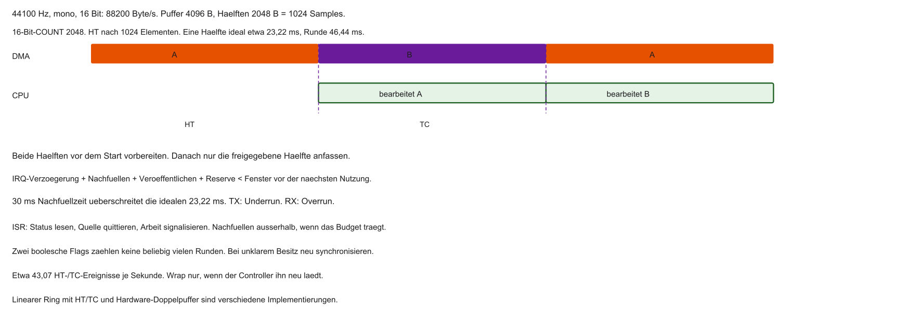

- Ring in zwei Hälften A und B
- DMA liest A → CPU füllt parallel B (und umgekehrt)
- Kein Konflikt: getrennte Bereiche

::: notes
Double Buffering (Ping-Pong) knüpft an den bisherigen Datenpfad an. 1024 Samples geteilt durch 44100 sind etwa 23,22 ms je Hälfte, der Umlauf etwa 46,44 ms. Beide Hälften vor Start füllen. 30 ms Nachfüllen verpasst das Fenster. Getrennte Bytes genügen nicht bei gemeinsamer Cacheline oder verspäteter Bearbeitung. Ring in zwei Hälften A und B. DMA liest A → CPU füllt parallel B (und umgekehrt). Verständnischeck: Wie viel Zeit bleibt ideal? Etwa 23,22 ms, abzüglich Kosten. Die nächste Folie nimmt die noch offene Modellfrage auf. Adressen und Zeiten sind Lehrannahmen. Code ist Lehrcode und wurde nicht kompiliert oder ausgeführt.
:::

## Ping-Pong: Interrupt-Logik

- Mitte erreicht → Signal: Hälfte A fertig → CPU füllt A nach
- Ende erreicht → Signal: Hälfte B fertig → Wrap, CPU füllt B nach
- Endlos mit klarer Phasengrenze

::: notes
Ping-Pong: Interrupt-Logik knüpft an den bisherigen Datenpfad an. Nach HT liest der DMA B und die CPU darf A füllen, nach TC umgekehrt, wenn der Vertrag und die Frist stimmen. Ein alter Hinweis A frei gilt nicht mehr, wenn A schon wieder aktiv ist. IRQ-Latenz gehört ins Fenster. Mitte erreicht → Signal: Hälfte A fertig → CPU füllt A nach. Ende erreicht → Signal: Hälfte B fertig → Wrap, CPU füllt B nach. Verständnischeck: Darf ein später HT-Hinweis A füllen? Nein, wenn A wieder aktiv ist. Die nächste Folie nimmt die noch offene Modellfrage auf. Adressen und Zeiten sind Lehrannahmen. Code ist Lehrcode und wurde nicht kompiliert oder ausgeführt.
:::

## Half-Transfer-Interrupt (HT)

- Bei vielen Controllern: HT bei exakt 50 % von `COUNT` → erste Hälfte nachfüllen
- TC (`COUNT = 0`): zweite Hälfte nachfüllen (bei Circular: Wrap)
- Ein Array + zwei Flags in der ISR (Namen/Bits herstellerspezifisch)

```c
volatile unsigned ht_count, tc_count;

void dma_isr(void) {
    if (STATUS_REG & HALF_TRANSFER_FLAG) {
        clear_ht(); /* Semantik laut Controller, bei W1C kein RMW */
        ht_count++;
    }
    if (STATUS_REG & TRANSFER_COMPLETE_FLAG) {
        clear_tc();
        tc_count++;
    }
}
/* Nachfüllen im Worker, nicht als lange Arbeit in der ISR */
```

::: notes
Half-Transfer-Interrupt (HT) knüpft an den bisherigen Datenpfad an. Die ISR macht einen Snapshot, quittiert mit der richtigen Clear-Semantik und meldet knapp. W1C ist Write One to Clear, kein blindes Oder. Zähler zählen beobachtete Meldungen. Ein sticky Bit fasst mehrere Ereignisse zusammen. Gleichzeitiges HT und TC braucht den aktuellen Zustand, nicht blindes Nachfüllen. Bei vielen Controllern: HT bei exakt 50 % von `COUNT` → erste Hälfte nachfüllen. TC (`COUNT = 0`): zweite Hälfte nachfüllen (bei Circular: Wrap). Verständnischeck: Rekonstruieren die Zähler jede Runde? Nein, zusammengefasste Ereignisse fehlen. Die nächste Folie nimmt die noch offene Modellfrage auf. Adressen und Zeiten sind Lehrannahmen. Code ist Lehrcode und wurde nicht kompiliert oder ausgeführt.
:::

## Ausblick: DMA2D (2D-Kopie)

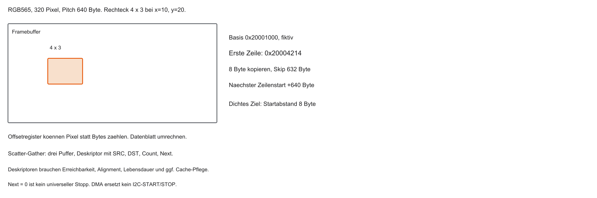

- High-End-SoCs: 2D-DMA / Grafik-Accelerator (z. B. Chrom-ART)
- Versteht Rechtecke ($X$/$Y$), nicht nur lineare Bytes
- Zeilenoffsets am Ende jeder Zeile — Ausschnitte aus Framebuffer-Layouts

::: notes
Ausblick: DMA2D (2D-Kopie) knüpft an den bisherigen Datenpfad an. Start ist Basis plus (20 mal 320 plus 10) mal 2, also 0x20004214. Je Zeile acht Byte, Pitch 640, Skip 632. Drei Zeilen sind 24 Nutzbyte. Chrom-ART ist ein Herstellerbeispiel, kein RISC-V-Standard. High-End-SoCs: 2D-DMA / Grafik-Accelerator (z. B. Chrom-ART). Versteht Rechtecke ($X$/$Y$), nicht nur lineare Bytes. Verständnischeck: Warum Skip 632 und nicht 640? Acht Byte wurden schon kopiert. Die nächste Folie nimmt die noch offene Modellfrage auf. Adressen und Zeiten sind Lehrannahmen. Code ist Lehrcode und wurde nicht kompiliert oder ausgeführt.
:::

## Scatter-Gather (verkettete Listen)

- Viele kleine Puffer im RAM verstreut
- Neu-Konfigurieren nach jedem Puffer kostet CPU/IRQs
- Scatter-Gather: Deskriptor-Liste (SRC, DST, COUNT, Next) im RAM
- DMA lädt den nächsten Auftrag selbst nach

::: notes
Scatter-Gather (verkettete Listen) knüpft an den bisherigen Datenpfad an. Ein Deskriptor hält SRC, DST, COUNT und Next. Next ist eine DMA-Adresse, kein beliebiger CPU-Zeiger. Ende ist controllerspezifisch. Auch die Kette muss sichtbar und langlebig sein. Nicht jeder DMAC kann Scatter-Gather. Viele kleine Puffer im RAM verstreut. Neu-Konfigurieren nach jedem Puffer kostet CPU/IRQs. Verständnischeck: Reicht Clean der Nutzdaten, wenn die Deskriptoren nur im Cache sind? Nein. Die nächste Folie nimmt die noch offene Modellfrage auf. Adressen und Zeiten sind Lehrannahmen. Code ist Lehrcode und wurde nicht kompiliert oder ausgeführt.
:::

## Grenzen von DMA

- Verschiebt Bytes — keine allgemeine Logik
- Kein `if` auf Nutzdaten, keine Berechnung pro Byte
- Kein Protokollverständnis (z. B. I2C-ACK): nur Reaktion auf DREQ/Handshake
- Für Entscheidungen bleibt die CPU zuständig

::: notes
Grenzen von DMA knüpft an den bisherigen Datenpfad an. Keine allgemeine Anwendungsentscheidung heißt nicht, der Kanal habe keine Kontrolllogik. I²C-NACK bleibt Controllerstatus. Zuverlässig nur mit Konfiguration, Status, Frist und Besitz. DMA beseitigt weder falsche Daten noch zu wenig Bandbreite. Verschiebt Bytes — keine allgemeine Logik. Kein `if` auf Nutzdaten, keine Berechnung pro Byte. Verständnischeck: Wertet der Kanal einen I²C-NACK als Diagnose? Nein. Die nächste Folie nimmt die noch offene Modellfrage auf. Adressen und Zeiten sind Lehrannahmen. Code ist Lehrcode und wurde nicht kompiliert oder ausgeführt.
:::

## Aufgabe — CS und Audiofenster

Darf CS bei DMA-TC bereits HIGH werden? Was folgt aus 30 ms Nachfüllzeit im Audio-Beispiel?

::: notes
Aufgabe — CS und Audiofenster knüpft an den bisherigen Datenpfad an. CS wartet auf das Ende der letzten Bitphase, nicht nur auf DMA-TC. Die Halbzeit ist 2048 geteilt durch 88200, etwa 23,22 ms. 30 ms liegen etwa 6,78 ms darüber, vor weiteren Kosten. 20 ms reichen nicht automatisch, wenn IRQ und Veröffentlichung dazukommen. Verständnischeck: Reicht 20 ms Nachfüllen? Nur wenn alle Zusatzzeiten im Fenster bleiben. Die nächste Folie nimmt die noch offene Modellfrage auf. Adressen und Zeiten sind Lehrannahmen. Code ist Lehrcode und wurde nicht kompiliert oder ausgeführt.
:::

## Ausblick Labor: DMA in Renode

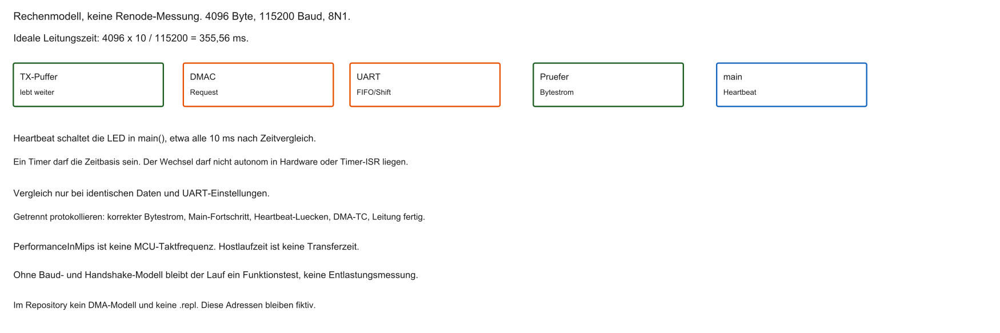

Geplantes Szenario (Details im Übungsblatt):

- Langer String (z. B. HTML-Header) über UART
- Runde 1: Polling — CPU blockiert sichtbar
- Runde 2: DMA-Kanal — CPU rechnet/blinkt weiter, Text läuft im Hintergrund

::: notes
Ausblick Labor: DMA in Renode knüpft an den bisherigen Datenpfad an. 4096 mal 10 geteilt durch 115200 sind etwa 0,3556 s, weil 8N1 zehn Symbole hat. Das ist eine Rechnung, kein Lauf. Virtuelle Zeit ist nicht die Hostuhr. MIPS sind keine MHz. Ein späterer Test bräuchte dasselbe Muster und getrennte Prüfungen. Langer String (z. B. HTML-Header) über UART. Runde 1: Polling — CPU blockiert sichtbar. Verständnischeck: Warum länger als 4096 mal 8 durch 115200? Wegen Start- und Stopbit. Die nächste Folie nimmt die noch offene Modellfrage auf. Adressen und Zeiten sind Lehrannahmen. Code ist Lehrcode und wurde nicht kompiliert oder ausgeführt.
:::

## Geplante Variante: Polling (blockierend)

- LED als Heartbeat der `main`-Schleife
- Klassische UART-Sendeschleife:

```c
void send_uart_polling(const char *text, uint32_t len) {
    for (uint32_t i = 0; i < len; i++) {
        while (!(UART_STATUS_REG & TX_EMPTY)) { }
        UART_TX_REG = text[i];
    }
}
```

::: notes
Geplante Variante: Polling (blockierend) knüpft an den bisherigen Datenpfad an. Die Polling-Variante ist geplant, nicht gemessen. TX_EMPTY heißt im Modell Platz für ein Element. Ein Bytepuffer mit Länge darf 0x00 enthalten, strlen nicht. Der Heartbeat kommt aus main. Ein Timer-IRQ während der Schleife zeigt nicht, dass main weiterläuft. LED als Heartbeat der `main`-Schleife. Klassische UART-Sendeschleife:. Verständnischeck: Was zeigt ein Timer-IRQ in der Warteschleife? Dass Interrupts laufen, nicht dass main frei ist. Die nächste Folie nimmt die noch offene Modellfrage auf. Adressen und Zeiten sind Lehrannahmen. Code ist Lehrcode und wurde nicht kompiliert oder ausgeführt.
:::

## Geplante Beobachtung des Main-Fortschritts

- Eine LED, die nur in `main` umschaltet, kann eine Pause der Hauptschleife zeigen
- Timer-ISR oder autonome PWM dürfen nicht als Main-Heartbeat dienen
- Das ist eine Erwartung, keine bereits beobachtete Messung

::: notes
Geplante Beobachtung des Main-Fortschritts knüpft an den bisherigen Datenpfad an. Die LED darf nur in main umschalten. Timer-ISR oder PWM wären der falsche Beweis. Eine stehende LED ist ein qualitativer Hinweis, keine Messung von Nutzdaten oder Stalls. Es liegt keine Beobachtung vor. Eine LED, die nur in `main` umschaltet, kann eine Pause der Hauptschleife zeigen. Timer-ISR oder autonome PWM dürfen nicht als Main-Heartbeat dienen. Verständnischeck: Warum taugt eine ISR-LED nicht? Sie blinkt, obwohl main hängt. Die nächste Folie nimmt die noch offene Modellfrage auf. Adressen und Zeiten sind Lehrannahmen. Code ist Lehrcode und wurde nicht kompiliert oder ausgeführt.
:::

## Geplanter DMA-Lehrablauf

- Polling-Schleife ersetzen durch MMIO-Konfiguration des DMAC
- Generisches Rezept in vier Schritten (herstellerübergreifend)

::: notes
Geplanter DMA-Lehrablauf knüpft an den bisherigen Datenpfad an. Die vier Schritte sind eine Gliederung, kein Herstellerrezept. Vor dem Programmieren muss der Kanal inaktiv sein. Das UART-Modell mit 4096 Byte ist nicht das SPI-Bild und nicht das Audiofenster. Dieselben Felder gibt es nicht auf jedem Chip. Polling-Schleife ersetzen durch MMIO-Konfiguration des DMAC. Generisches Rezept in vier Schritten (herstellerübergreifend). Verständnischeck: Welche Frage vor dem Neuprogrammieren? Ob der alte Auftrag wirklich beendet ist. Die nächste Folie nimmt die noch offene Modellfrage auf. Adressen und Zeiten sind Lehrannahmen. Code ist Lehrcode und wurde nicht kompiliert oder ausgeführt.
:::

## Schritt 1: UART für DMA scharfschalten

- Standard: UART erwartet CPU-Writes
- Enable-Bit für DMA-Request (DREQ), wenn TX-Register Platz hat

```c
#define UART_CR3     (*(volatile uint32_t *)(UART_BASE + 0x08u))
#define UART_DMA_EN  (1u << 7)  /* Bitlage fiktiv */

UART_CR3 |= UART_DMA_EN;
```

::: notes
Schritt 1: UART für DMA scharfschalten knüpft an den bisherigen Datenpfad an. UART_CR3 und Bit 7 sind fiktiv. Das Oder-Gleich gilt nur bei passender Registersemantik. Enable erzeugt den Request, startet aber keinen Transfer ohne fertigen Kanal. Ein schon anliegender Level kann sofort wirken, deshalb erst nach Vorbereitung freigeben. Standard: UART erwartet CPU-Writes. Enable-Bit für DMA-Request (DREQ), wenn TX-Register Platz hat. Verständnischeck: Reicht UART_DMA_EN allein? Nein. Die nächste Folie nimmt die noch offene Modellfrage auf. Adressen und Zeiten sind Lehrannahmen. Code ist Lehrcode und wurde nicht kompiliert oder ausgeführt.
:::

## Schritt 2: Kanal konfigurieren

- SRC = String im SRAM, DST = UART-TX-Register (fest)
- COUNT = Länge; Memory-Increment an, Peripherie-Increment aus

```c
DMA_CH1->SRC_ADDR = (uint32_t)(uintptr_t)tx_sram; /* Identität angenommen */
DMA_CH1->DST_ADDR = (uint32_t)(uintptr_t)&UART_TX_REG;
DMA_CH1->COUNT    = string_laenge; /* Einheit laut Controller */
DMA_CH1->CONTROL  = DMA_MINC_EN | DMA_DIR_M2P; /* kein blindes |= */
```

::: notes
Schritt 2: Kanal konfigurieren knüpft an den bisherigen Datenpfad an. 4096 Byte, 8 Bit, SRC-Inkrement, festes Ziel, Normalmodus. CONTROL setzt Breite und Modus ausdrücklich, keine unbekannten Defaults. Identität von CPU- und DMA-Adresse ist eine Annahme. tx_sram lebt im SRAM, kein Stringliteral im Flash. Vorher Inaktivität und Veröffentlichung. SRC = String im SRAM, DST = UART-TX-Register (fest). COUNT = Länge; Memory-Increment an, Peripherie-Increment aus. Verständnischeck: Welche Felder verhindern Nachbarregister? SRC an, DST aus, Breite festgelegt. Die nächste Folie nimmt die noch offene Modellfrage auf. Adressen und Zeiten sind Lehrannahmen. Code ist Lehrcode und wurde nicht kompiliert oder ausgeführt.
:::

## Schritt 3: Interrupts aktivieren

- Transfer-Complete-Enable im DMA
- PLIC (bzw. Interrupt-Controller) für den Kanal freischalten

```c
/* TCIE in demselben kontrollierten CONTROL-Wort, nicht per Altzustand. */
enable_interrupt(DMA_CH1_IRQn);  /* Pseudocode */
```

::: notes
Schritt 3: Interrupts aktivieren knüpft an den bisherigen Datenpfad an. TCIE ist die lokale Ereignisfreigabe. enable_interrupt ist Pseudocode, keine RISC-V-API. mcause nennt die externe Klasse, Claim die Quellen-ID, Complete dieselbe ID. Der Softwarezustand steht vor der ersten möglichen Meldung. Transfer-Complete-Enable im DMA. PLIC (bzw. Interrupt-Controller) für den Kanal freischalten. Verständnischeck: Warum reicht TCIE nicht? Controller, Hart und Dispatcher müssen den Handler erreichen. Die nächste Folie nimmt die noch offene Modellfrage auf. Adressen und Zeiten sind Lehrannahmen. Code ist Lehrcode und wurde nicht kompiliert oder ausgeführt.
:::

## Schritt 4: Enable (Startschuss)

- ENABLE-Bit setzen → Transfer startet hardwareseitig
- C-Funktion kehrt sofort zurück — CPU ist frei

```c
void start_dma_transfer(void) {
    DMA_CH1->CONTROL = DMA_MINC_EN | DMA_DIR_M2P
        | DMA_TCIE_EN | DMA_ENABLE_BIT;
}
```

::: notes
Schritt 4: Enable (Startschuss) knüpft an den bisherigen Datenpfad an. Der Start schreibt ein kontrolliertes Wort, nicht blindes Oder auf alte Bits. ACTIVE wird gesetzt, bevor der erste IRQ kommen kann. Die Funktion wartet nicht auf 4096 ausgesendete Bytes. ENABLE-Bit setzen → Transfer startet hardwareseitig. C-Funktion kehrt sofort zurück — CPU ist frei. Verständnischeck: Bedeutet die Rückkehr, dass alles gesendet wurde? Nein. Die nächste Folie nimmt die noch offene Modellfrage auf. Adressen und Zeiten sind Lehrannahmen. Code ist Lehrcode und wurde nicht kompiliert oder ausgeführt.
:::

## Erwartung mit DMA

- Text erscheint weiter im Monitor
- Der Heartbeat kommt aus `main()`, nicht aus einer Timer-ISR und nicht aus Hardware-PWM
- Die LED kann weiterlaufen und trotzdem Busstalls haben. Das ist kein Beweis für null Last
- DMA-TC heißt: letztes Element übergeben. FIFO und Schieberegister können noch senden

::: notes
Erwartung mit DMA knüpft an den bisherigen Datenpfad an. Weiterblinken aus main zeigt höchstens Fortschritt der Schleife. Es beweist keine korrekten Bytes, keine fehlenden Stalls und kein Leitungsende. DMA-TC kann vor dem letzten Stopbit liegen. Der Simulatorlauf ist hypothetisch. Text erscheint weiter im Monitor. Der Heartbeat kommt aus `main()`, nicht aus einer Timer-ISR und nicht aus Hardware-PWM. Verständnischeck: Was erlaubt der Heartbeat? Nur den beobachteten Main-Fortschritt. Die nächste Folie nimmt die noch offene Modellfrage auf. Adressen und Zeiten sind Lehrannahmen. Code ist Lehrcode und wurde nicht kompiliert oder ausgeführt.
:::

## Interrupt-Handling am Ende

- DMA-TC meldet das Ende der DMA-Zugriffe, nicht automatisch das letzte UART-Bit
- Status mit passender Clear-Semantik quittieren; PLIC-Complete bleibt getrennt

```c
void dma_channel1_isr(void) {
    if (DMA_STATUS_REG & TRANSFER_COMPLETE) {
        DMA_CLEAR_REG = CLEAR_TRANSFER_COMPLETE; /* W1C: schreiben, nicht RMW */
        /* optional: nächsten Transfer starten */
    }
}
```

::: notes
Interrupt-Handling am Ende knüpft an den bisherigen Datenpfad an. Zuerst Fehler prüfen, dann TC. W1C schreibt die Maske. Die ISR bleibt kurz, Drain und Cache liegen im Service. Der Puffer wird frei, wenn die DMA-Zugriffe belegt beendet sind. UART-Idle ist getrennt. Bei unbestätigter Inaktivität bleibt der Besitz gesperrt. SysTick ist hier kein RISC-V-Register. DMA-TC meldet das Ende der DMA-Zugriffe, nicht automatisch das letzte UART-Bit. Status mit passender Clear-Semantik quittieren; PLIC-Complete bleibt getrennt. Verständnischeck: Was bei Fehler ohne bestätigtes Ende? Puffer nicht freigeben. Die nächste Folie nimmt die noch offene Modellfrage auf. Adressen und Zeiten sind Lehrannahmen. Code ist Lehrcode und wurde nicht kompiliert oder ausgeführt.
:::

## Zusammenfassung Block 6

- Die gezeigte Polling-Funktion blockiert ihren Aufrufer; Zustandspolling kann zurückkehren
- DMA ist ein Transfermodul, kein allgemeiner Coprozessor
- DMAC als Bus-Master, Cycle Stealing mit dem Arbiter
- Kanal: SRC, DST, COUNT, Breite, Increment
- Cache: Richtung, Besitz und Plattformsequenz. PMP ist kein Cache-Schalter
- Circular Mode, HT/TC → Ringpuffer und Ping-Pong

::: notes
Zusammenfassung Block 6 knüpft an den bisherigen Datenpfad an. Die Kette ist Engpass, Konfiguration, Sichtbarkeit, Transfer, Status und getrenntes Leitungsende. Zwei Arbiter, Cache-Richtung und Ringfrist gehören dazu. Polling blockiert nur die gezeigte Warteschleife. Neben den Adressen bleiben Breite, Besitz, Fristen und die Bedeutung von fertig. Die gezeigte Polling-Funktion blockiert ihren Aufrufer; Zustandspolling kann zurückkehren. DMA ist ein Transfermodul, kein allgemeiner Coprozessor. Verständnischeck: Welche vier Fragen neben den Orten? Breite, Sichtbarkeit, Fristen und Abschlussbedeutung. Die nächste Folie nimmt die noch offene Modellfrage auf. Adressen und Zeiten sind Lehrannahmen. Code ist Lehrcode und wurde nicht kompiliert oder ausgeführt.
:::

## Ausblick und Abschluss

- Übungsblatt: Polling vs. DMA in Renode nachvollziehen
- Nächster Block: moderne CPU-Beschleunigung (u. a. Out-of-Order)

Vielen Dank — viel Erfolg im Labor.

::: notes
Ausblick und Abschluss knüpft an den bisherigen Datenpfad an. Geprüft sind Unterlage, Rechnungen und Verträge. Nicht geprüft sind Firmware, Renode und Messungen. Die fiktiven Adressen stehen auf den Modellfolien. Der nächste Block betrifft die CPU-interne Ausführung. DMA war die Entlastung des Datenpfads. Übungsblatt: Polling vs. DMA in Renode nachvollziehen. Nächster Block: moderne CPU-Beschleunigung (u. a. Out-of-Order). Verständnischeck: Was wurde nicht geprüft? Kompilierung, Emulation und Hardwarezeit. Der nächste Block fragt, wie der Prozessor seine Rechenarbeit effizienter ausführt. Adressen und Zeiten sind Lehrannahmen. Code ist Lehrcode und wurde nicht kompiliert oder ausgeführt.
:::

::: notes
Wenn Terminal flüssig schreibt und die LED weiterblinkt, ist die Architektur verstanden. Bis zum nächsten Block!
:::
