## Willkommen zu Block 7!

- Willkommen zur siebten Vorlesung in Mikrocomputertechnik 3
- Bisher: RAM, Caches, Interrupts, Busse, DMA — das SoC ist ausgestattet
- Peripherie und Transfers können autonom laufen; der Engpass wandert zurück zum Kern
- Heute: wie High-End-CPUs intern mehr Rechenleistung aus demselben Takt holen

```{mermaid}
%%| fig-width: 4.0
%%{init: {'theme': 'base', 'themeVariables': {'background': '#FFFFFF', 'primaryColor': '#FFFFFF', 'primaryBorderColor': '#E5E5EA', 'primaryTextColor': '#1D1D1F', 'lineColor': '#86868B', 'secondaryColor': '#F5F5F7', 'tertiaryColor': '#FFFFFF', 'mainBkg': '#FFFFFF', 'nodeBorder': '#E5E5EA', 'clusterBkg': '#F5F5F7', 'clusterBorder': '#E5E5EA', 'titleColor': '#1D1D1F', 'edgeLabelBackground': '#FFFFFF'}}}%%
flowchart LR
  A[MCT1: 5-Stufen-CPU] --> B[MCT3: SoC-Peripherie]
  B --> C[Heute: High-End-Kern]
  style C fill:#FFFFFF,stroke:#E2001A,stroke-width:2px !important
```

::: notes
Caches und DMA haben externe Engpässe entschärft. Zurück zum Prozessorkern: Warum reicht die MCT1-Pipeline für Desktop-/Smartphone-CPUs nicht?
:::

## Anknüpfung: DMA-Labor

Kurz-Recap aus Block 6 (Vertiefung im Übungsblatt):

- DMA kopiert Arrays autonom; Polling blockiert die CPU stark
- Ein Heartbeat aus `main()` kann weiterlaufen. Das beweist keine Last von null
- Bus-Mastering und Cycle Stealing: DMA teilt sich den Bus mit der CPU
- Folge: weniger ALU-Zeit für stupides Kopieren — mehr Zeit für echte Berechnung

```c
/* Konzept — Adressen/Bits fiktiv bzw. Datenblatt */
DMA_CH1->SRC_ADDR = (uint32_t)text_array;
DMA_CH1->DST_ADDR = (uint32_t)&UART_TX;
DMA_CH1->CONTROL = DMA_ENABLE;  /* fiktiv, kein blindes |= */
```

::: notes
DMA befreit von Kopierarbeit. Als Nächstes: Wie schnell rechnet die CPU selbst auf Befehlsebene?
:::

## Zurück in die CPU

- Fokus: Ausführungsgeschwindigkeit im Kern
- Weg von Systembus, MMIO und Peripherie-IRQs
- Rein: Pipeline, ALU, Assembler auf Befehlsebene
- Metriken und Hardware-Parallelität innerhalb eines Kerns

::: notes
Alles außerhalb des L1 blenden wir didaktisch aus — Takte, Gatter, Instruktionsstrom.
:::

## Refresher MCT1: 5-Stufen-Pipeline

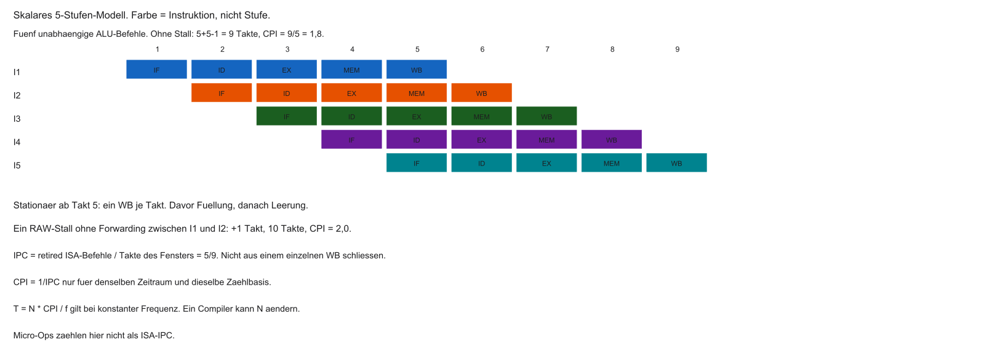

Klassische RISC-Pipeline (Harris/Harris):

| Stufe | Name | Aufgabe |
|-------|------|---------|
| IF | Instruction Fetch | Befehl holen |
| ID | Decode | Dekodieren, Register lesen |
| EX | Execute | ALU |
| MEM | Memory | Datenspeicher |
| WB | Write Back | Ergebnis ins Registerfile |

Nach dem Füllen strebt der Durchsatz gegen ein Retire je Takt. Fünf Befehle brauchen im Modell ohne Stall $N+k-1 = 9$ Takte, mittleres CPI $= 1{,}8$.

::: notes
Stand MCT1: Fließband mit fünf Stufen — Grundlage für alles Weitere heute.
:::

## Metriken: IPC und CPI

- IPC: retired ISA-Instruktionen pro Core-Takt im betrachteten Fenster
- Execution-Completion und Retire können in verschiedenen Takten liegen
- Micro-Ops sind keine ISA-IPC
- CPI = Takte / retired Instruktionen. CPI und IPC sind nur dann Kehrwerte
- Laufzeit bei konstanter Frequenz $f$ im selben Fenster:

$$
T = N \times \mathrm{CPI} / f
$$

::: notes
Ein Compiler kann N ändern. Höheres IPC allein verkürzt die Laufzeit nicht. Mittelwerte verschiedener Läufe nicht ungewichtet invertieren. Kurze Sequenzen enthalten Füllung und Leerung.
:::

## Limit der skalaren Pipeline

- Ideal ohne Stalls/Hazards/Misses: $\mathrm{IPC} = 1$, $\mathrm{CPI} = 1$
- Eine skalare Ein-Issue-Pipeline: strukturell kein $\mathrm{CPI} < 1$
- Ein Pfad → Befehle im Gänsemarsch
- Realität oft schlechter ($\mathrm{CPI} > 1$) durch Bubbles und Hazards

::: notes
Mauer der MCT1-Architektur: IPC höchstens 1 im Ideal — oft darunter.
:::

## Die Taktraten-Mauer (Power Wall)

- Idee der 2000er: Frequenz massiv erhöhen (GHz-Wettrennen)
- Vereinfacht $P_{dyn} \approx \alpha C V^{2} f$. Leckleistung ist davon getrennt
- Keine feste Frequenzgrenze aus dieser Formel. Breitere Kerne brauchen mehr Ports, Scheduler und Bypass
- CPI verbessern ist ein Weg, kein kostenloser Ersatz für Takt

::: notes
Pentium-4-Ära: Hoffnung auf extrem hohe GHz — Physik und Kühlung setzen Grenzen.
:::

## Die Leitfrage des Tages

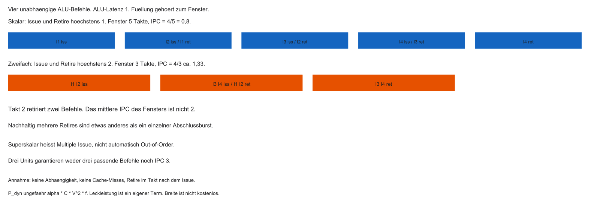

- Taktfrequenz: physikalisch begrenzt
- Skalare Pipeline: Ideal $\mathrm{CPI} = 1$ (mit Stalls oft $> 1$)
- Wie kann der Kern langfristig mehr als eine ISA-Instruktion je Takt retiren?
- Antwort: Parallelität *innerhalb* des Kerns (ILP ausnutzen)

Das Zeitdiagramm oben ersetzt die Ein-Takt-Skizze. IPC wird über das ganze Fenster gerechnet.

::: notes
Nicht schneller takten — breiter und smarter schedulen.
:::

## Agenda

1. Grenzen des Pipelining
2. ILP und Superskalarität
3. Out-of-Order Execution
4. Branch Prediction
5. Spekulation und Security (Spectre/Meltdown)
6. Labor-Ausblick (Compiler / Godbolt)

::: notes
Von skalarer Pipeline über OoO und Prediction bis Spekulation und Compiler.
:::

## Lernziele Block 7

- Skalare vs. superskalare Pipeline erklären
- Datenabhängigkeiten RAW, WAW, WAR unterscheiden
- Register Renaming und Reorder Buffer (ROB) einordnen
- Warum Branches tiefe Pipelines treffen
- Rolle von Compiler-Scheduling (`-O3`)

::: notes
Ziel: Datenblätter moderner Kerne architektonisch lesen können — nicht nur Takt und Kerne zählen.
:::

## Instruction-Level Parallelism (ILP)

- ILP: wie viele Befehle eines Programms *theoretisch* parallel laufen könnten
- Beispiel ohne Abhängigkeit:

```c
a = b + c;
x = y * z;
```

- Unabhängige Operationen → auf getrennten Execution Units im selben Takt denkbar

::: notes
Viele Programme haben unabhängige Teilrechnungen — das ist der Hebel für IPC > 1.
:::

## Datenabhängigkeiten: RAW

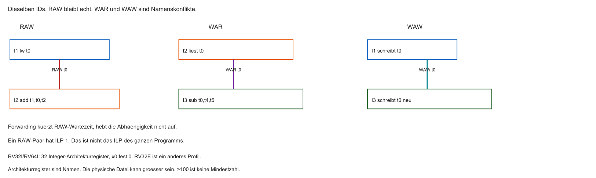

- True Dependency / Read-After-Write (RAW): Befehl 2 braucht Ergebnis von Befehl 1

```asm
add t0, t1, t2   # schreibt t0
sub t3, t0, t4   # liest t0 — muss warten
```

- Dieses Paar hat ILP 1. Das ist keine Aussage über das ganze Programm
- Forwarding verkürzt die Wartezeit und hebt die RAW-Kante nicht auf

::: notes
Bekannt aus MCT1: echte Datenabhängigkeit — Hardware kann Mathematik nicht „wegoptimieren“.
:::

## Statisches vs. dynamisches Scheduling

- Statisch (Compiler): Befehle vorab umordnen, Abhängigkeiten auseinanderziehen
- Dynamisch (Hardware): zur Laufzeit unabhängige Befehle finden und an die Units ausgeben (Issue)
- Compiler kennt u. a. Cache-Misses zur Laufzeit nicht → dynamisches Scheduling oft mächtiger

::: notes
Beide Ansätze ergänzen sich; High-End-Kerne verlassen sich stark auf Hardware-Scheduling.
:::

## Superskalare Architekturen

- Skalar: typisch ein Issue pro Takt
- Superskalar: Multiple Issue. Das ist noch nicht Out-of-Order
- Fetch-Bytes, Decode, Issue, Ports und Retire-Breite sind verschiedene Größen
- Pipeline wird „breiter“: mehrspurige Autobahn statt einspurigem Fließband

::: notes
Erster Schritt zu CPI < 1: Execution Units und Issue-Breite vervielfachen.
:::

## Mehrere Execution Units

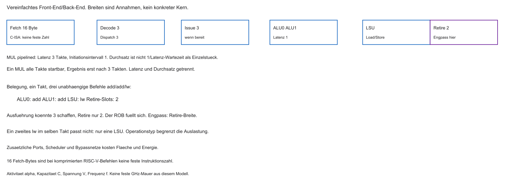

- Zwei Integer-ALU und eine LSU sind das vereinfachte Modell aus der Abbildung
- Ein pipelinierter Multiplizierer trennt Latenz und Initiationsintervall

::: notes
Drei Units reichen nicht für IPC 3. Im Bild begrenzt die Retire-Breite 2 den nachhaltigen Durchsatz, wenn alles andere passt.
:::

## Multi-Issue Fetch und Decode

- Fetch holt zum Beispiel 16 Byte. Mit der C-Erweiterung ist das keine feste Instruktionszahl
- Decode prüft Abhängigkeiten *zwischen* den Kandidaten und verteilt auf Units
- Aufwand der Abhängigkeitsprüfung wächst stark mit der Issue-Width

::: notes
Breites Back-End nützt wenig ohne breites Front-End — Decode wird oft zum Flaschenhals.
:::

## In-Order Superskalar

- Start-Reihenfolge = Programmreihenfolge (z. B. ältere In-Order-Kerne)
- Unabhängige Nachbarn können gemeinsam starten
- Stoppt ein früher Befehl (Hazard/Miss), stauen dahinter auch Unabhängige

::: notes
Breit, aber starr: ein Stau vorne blockiert freie Units hinten.
:::

## Problem: Cache-Miss in-order

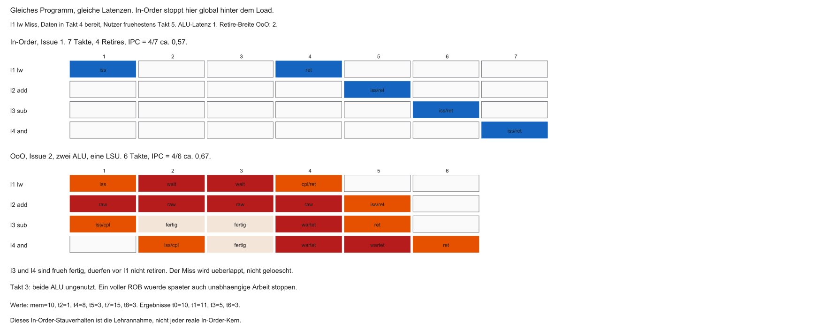

```asm
lw  t0, 0(s1)    # Miss → viele Wartezyklen
add t1, t0, t2   # RAW auf t0 → muss warten
sub t4, t5, t6   # unabhängig — trotzdem oft blockiert
```

- Lehrannahme hier: der In-Order-Kern gibt hinter dem wartenden Load nichts weiter aus
- Reale In-Order-Kerne dürfen davon abweichen
- Der Miss bleibt auch bei OoO bestehen. Unabhängige Befehle können ihn nur überlappen

::: notes
Cache-Misses sind Gift für strikte Programmreihenfolge trotz freier ALUs.
:::

## Falsche Abhängigkeit: WAW

Write-After-Write:

```asm
add t0, t1, t2   # schreibt t0
sub t0, t4, t5   # schreibt ebenfalls t0
```

- Keine RAW-Abhängigkeit der Operanden
- Dennoch: Schreibreihenfolge muss erhalten bleiben — sonst falscher Endwert in `t0`

::: notes
Konflikt nur wegen wiederverwendeten Zielregisters — „falsche“ Abhängigkeit.
:::

## Falsche Abhängigkeit: WAR

Write-After-Read:

```asm
add t1, t0, t2   # liest t0
sub t0, t4, t5   # überschreibt t0
```

- `sub` darf `t0` nicht zu früh überschreiben, bevor `add` gelesen hat
- Verhindert unkritische Überholvorgänge ohne weitere Maßnahmen

::: notes
Wieder Register-Recycling: mathematisch unabhängig, architektonisch verkoppelt.
:::

## Engpass: 32 ISA-Register

- RV32I und RV64I: 32 Integerregister `x0`–`x31`. `x0` ist fest 0
- Das sind Architektur-Namen, keine physischen Kisten. RV32E hat ein anderes Registerprofil
- Wiederverwendung erzeugt WAR/WAW. Erweiterungen bringen weitere Registerdateien

::: notes
Zu wenige Namen erzeugen falsche Abhängigkeiten. Wie viele physische Register ein Kern hat, steht nicht in der ISA.
:::

## Aufgabe — RAW und Breite

Warum bleibt die Kante von I1 nach I2 bestehen, obwohl I3 und I4 unabhängig sind? Warum folgt aus zwei ALU nicht IPC 2?

::: notes
I2 liest t0, das I1 erst liefert. Das ist RAW. I3 und I4 können den Miss nur überlappen. Die Retire-Breite und der älteste unfertige Befehl begrenzen den Durchsatz. Siehe Abhängigkeitsbild und das OoO-Zeitdiagramm.
:::

## Out-of-Order Execution (OoO)

- Dynamisches Scheduling: blockierte Befehle „parken“
- Unabhängige spätere Befehle dürfen vorgezogen werden
- Issue in datenabhängiger, dynamisch gewählter Reihenfolge. Der Kern bleibt getaktet

::: notes
Modern: nicht mehr nur „nächster PC“ — freie Units mit bereiten Operanden füttern.
:::

## Datenfluss-Maschine

- Instruktion „feuert“, wenn Operanden da sind — nicht nur wenn der PC sie erreicht
- Der Miss blockiert die Nutzer des Load. Unabhängige Befehle können vorbeilaufen, bis Issue-Queue oder ROB voll sind
- „Nur Abhängige warten“ gilt nicht ohne diese Grenzen

::: notes
Paradigmenwechsel: vom starren Befehlszeiger zum datengetriebenen Issue.
:::

## Drei Phasen der OoO-Pipeline

1. In-Order Front-End: Fetch / Decode
2. Out-of-Order Back-End: Execute
3. In-Order Retire (Commit): Ergebnisse programmgerecht sichtbar machen

Dazwischen: große Puffer (Queues, ROB).

```{mermaid}
%%| fig-width: 4.0
%%{init: {'theme': 'base', 'themeVariables': {'background': '#FFFFFF', 'primaryColor': '#FFFFFF', 'primaryBorderColor': '#E5E5EA', 'primaryTextColor': '#1D1D1F', 'lineColor': '#86868B', 'secondaryColor': '#F5F5F7', 'tertiaryColor': '#FFFFFF', 'mainBkg': '#FFFFFF', 'nodeBorder': '#E5E5EA', 'clusterBkg': '#F5F5F7', 'clusterBorder': '#E5E5EA', 'titleColor': '#1D1D1F', 'edgeLabelBackground': '#FFFFFF'}}}%%
flowchart LR
  A[In-Order\nFetch/Decode] --> B[(Instruction\nQueue)]
  B --> C[Out-of-Order\nExecute]
  C --> D[(Reorder\nBuffer)]
  D --> E[In-Order\nCommit]
  style C fill:#FFFFFF,stroke:#E2001A,stroke-width:2px !important
```

::: notes
Vorne geordnet lesen, Mitte ausnutzen, hinten Ordnung für Software/OS wiederherstellen.
:::

## Front-End und Renaming

- Mehrere Befehle aus dem I-Cache holen und dekodieren
- Vor dem Chaos: Register Renaming gegen WAW/WAR
- Architektur-Register der ISA ≠ physische Registerdatei

::: notes
32 ISA-Namen bleiben die Illusion für den Compiler — Hardware mappt um.
:::

## Register Renaming

- Die ISA-Namen werden auf eine größere physische Datei abgebildet. Eine Zahl über 100 ist kein allgemeines Minimum
- Jeder Befehl mit Ziel außer der festen Null bekommt typisch ein neues physisches Register
- Befehle ohne Ziel und `x0` sind Ausnahmen

::: notes
Genialer Trick: WAW/WAR verschwinden, weil Schreibziele physisch getrennt werden.
:::

## Renaming am Beispiel (WAW)

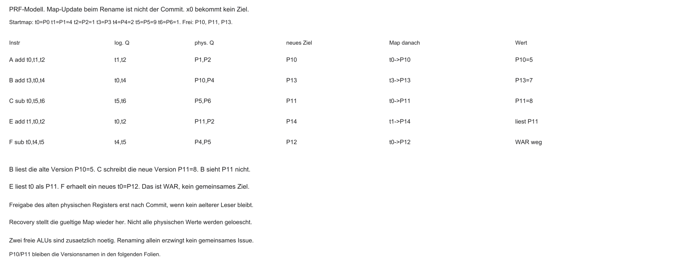

```asm
add t0, t1, t2
sub t0, t4, t5
```

Hardware (schematisch):

- `add` → schreibt `P10` (Mapping `t0` → `P10`)
- `sub` → schreibt `P11` (neues Mapping `t0` → `P11`)

Getrennte Ziele erlauben unabhängige Ausführung. Zwei belegte ALU-Ports können das Issue trotzdem verhindern.

::: notes
Namen werden recycelt, physische Kisten sind frisch — ILP gerettet.
:::

## Reservation Stations

- Nach Renaming: Befehle in Reservation Stations / Issue Queue
- Klassisch Reservation Stations, alternativ eine gemeinsame Issue Queue. Ein einzelner Common Data Bus ist nur das Lehrbild
- Operand bereit reicht nicht: Unit, Port und Auswahlregel müssen passen

::: notes
Wartehalle: Bordkarte = physische Register; Abflug = Operanden komplett.
:::

## Out-of-Order Issue

- Ergebnisse erscheinen auf dem Common Data Bus / Wakeup-Netz
- Wartende Einträge greifen Werte ab; bereite Befehle melden sich
- Scheduler gibt bereite Befehle in freie Units — Reihenfolge $\neq$ Programmzeile

::: notes
Wer Daten hat, rechnet; wer auf Memory wartet, bleibt in der Queue.
:::

## Problem: Interrupts im Chaos

- Frühe Befehle noch nicht fertig, spätere schon executed
- Interrupt / Exception: architektonisch sichtbarer Zustand muss konsistent sein
- Ohne Schutz: RAM/Register könnten „Zukunft“ schon enthalten — inkonsistent für OS

::: notes
Betriebssysteme erwarten präzise, geordnete Architektursicht — nicht Zwischenchaos.
:::

## Reorder Buffer (ROB)

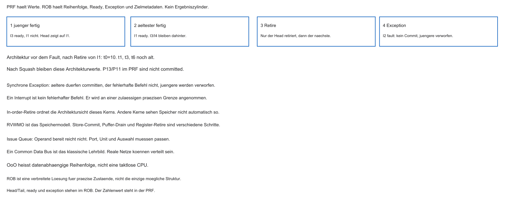

- In diesem PRF-Modell schreibt die ALU in ein physisches Register, nicht in den ROB
- Der ROB führt Reihenfolge, Completion, Exception und Zielmetadaten. Ein result-holding ROB wäre ein anderes, hier nicht verwendetes Modell

Das PRF-Bild ersetzt den Ergebniszylinder. Fertige jüngere Befehle stehen in physischen Registern, bis der Head retiriert.

::: notes
Netz mit doppeltem Boden: rechnen darf chaotisch sein — sichtbar werden geordnet.
:::

## In-Order Commit (Retire)

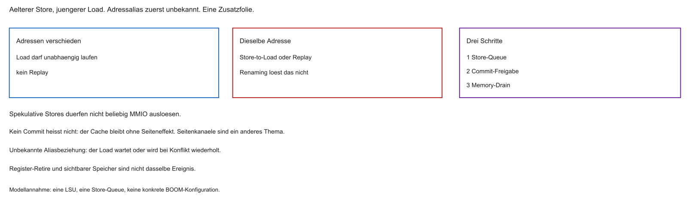

- Retire nur am ältesten noch nicht retired Befehl, bis zur Retire-Breite
- Dadurch wird der Architektur-Registerzustand sichtbar. Ein Store darf danach noch im Puffer stehen
- Andere Beobachter sehen Speicher nach RVWMO, nicht automatisch in dieser Retire-Reihenfolge
- Spätere fertige Einträge warten, auch wenn ihre PRF-Werte schon stehen

::: notes
Programmierer und OS sehen geordnete Semantik — trotz OoO im Back-End.
:::

## Exceptions und ROB

- Synchrone Exception: ältere Instruktionen dürfen committen. Die fehlerhafte Instruktion committet ihren normalen Effekt nicht. Jüngere Effekte werden verworfen
- Ein asynchroner Interrupt hat keinen fehlerhaften Befehl. Er wird an einer zulässigen präzisen Grenze angenommen
- Recovery stellt das gültige Mapping wieder her

::: notes
Der Architekturzustand wird präzise. Ein verworfener Store ist nicht dasselbe wie ein unsichtbarer Cache-Seiteneffekt.
:::

## Grenzen von OoO

Warum viele Cortex-M / MCU-Kerne ohne OoO bleiben:

- Transistoren: Renaming, Stations, ROB sind teuer
- Energie: ständiges Wakeup/Scheduling kostet — oft Watt statt µW/mW-Regime
- Determinismus: Laufzeiten schwerer vorherzusagen (Hard Real-Time)

::: notes
Königsklasse für Desktop/Phone — für Knopfzellen-Sensoren oft ungeeignet.
:::

## Drei Phasen — Kurzfazit

| Phase | Ordnung | Aufgabe |
|-------|---------|---------|
| Fetch/Decode | in-order | lesen, renaming |
| Execute | out-of-order | Units auslasten |
| Commit | in-order | sichtbar machen, Exceptions |

::: notes
Anatomie eines High-End-Kerns in einem Satz: geordnet rein, parallel rechnen, geordnet raus.
:::

## Aufgabe — Version und Exception

Welche physische Version liest Befehl B? Was bleibt architektonisch gültig, wenn I2 eine synchrone Exception auslöst, nachdem nur I1 retiriert wurde?

::: notes
B liest P10, nicht P11. Nach Retire von I1 ist t0 = 10. I2 committet nicht, I3 und I4 werden verworfen. Ein Interrupt ist davon getrennt: er hat keinen fehlerhaften Befehl. Siehe Rename-Tabelle und ROB-Bild.
:::

## Control Hazards

- WAR und WAW kann Renaming entfernen. RAW bleibt. Kontrollfluss ist ein eigener Engpass
- Neuer Engpass: Kontrollfluss (`beq` und andere Branches)
- Beim Fetch des Branch: welcher nächste PC — Fall-through oder Target?
- Entscheidung oft erst nach dem Vergleich in EX (oder später in tiefen Pipelines)

::: notes
Die Pipeline braucht jeden Takt neuen Nachschub — an der Weggabelung fehlt das Vergleichsergebnis noch.
:::

## Kosten eines Pipeline-Flush

- Warten auf die ALU: wenige Bubbles — bei 5 Stufen oft erträglich
- Moderne High-Performance-Kerne: deutlich tiefere Pipelines (Größenordnung: viele Stufen), u. a. für hohe Taktraten
- Falscher Weg → Flush vieler spekulativer Instruktionen
- Misprediction Penalty: oft im Bereich vieler Takte — teuer für IPC

::: notes
Tiefe Pipelines erhöhen die Branch Penalty: falsch geraten heißt viele Arbeitseinheiten verwerfen.
:::

## Misprediction: Zahlenbeispiel

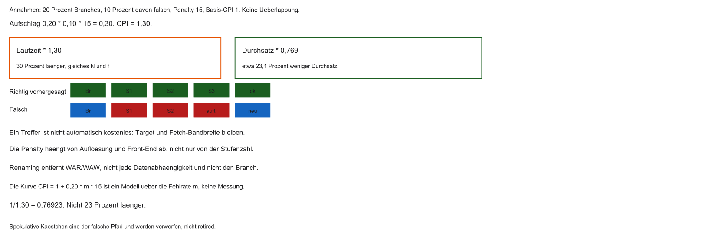

- $20\,\%$ der Befehle sind Branches
- Misprediction-Rate $10\,\%$, Penalty $15$ Takte
- Basis-CPI $= 1$ (ideale Pipeline ohne andere Stalls)
- CPI-Aufschlag: $0{,}20 \times 0{,}10 \times 15 = 0{,}30$
- Effektives CPI $= 1{,}30$: bei gleichem $N$ und $f$ ist die Laufzeit 30 Prozent länger
- Der Durchsatz sinkt auf $1/1{,}30 \approx 0{,}769$, also rund 23,1 Prozent

::: notes
Modell ohne Überlappung: Anteil mal Fehlrate mal Penalty. 1,30 CPI bedeutet 30 Prozent mehr Laufzeit und etwa 23 Prozent weniger Durchsatz. Nicht 23 Prozent länger.
:::

## Branch Prediction

- Nicht warten — spekulativ den wahrscheinlichen Weg füllen
- Vorhersage typisch schon beim Fetch
- Ein Treffer vermeidet den Flush, ist aber nicht automatisch kostenlos
- Fehlprognose: Flush / Misprediction Penalty
- Ziel: hohe Accuracy (in der Praxis oft deutlich über 90 %)

::: notes
Glaskugel der Architektur: richtig geraten → Pipeline bleibt voll; falsch → teurer Rollback.
:::

## Statische Vorhersage

Einfache fest verdrahtete Heuristiken:

- Rückwärtssprung oft „taken“ (typisch Schleifenende)
- Vorwärtssprung oft „not taken“ (häufig seltene Fehlerpfade)

Hilfreich, aber für sehr tiefe Pipelines oft zu ungenau.

::: notes
90er-Heuristik: hinten = Schleife, vorne = seltenes `if` — gut, aber nicht genug für 15+ Stufen.
:::

## Dynamische Vorhersage

- Lernen zur Laufzeit aus der Branch-Historie
- Muster: was zuletzt passierte, passiert oft wieder
- Lange Schleifen: nach wenigen Iterationen fast immer korrektes „taken“

::: notes
Maschinenlernen auf unterster Ebene: pro Sprungstelle Historie im Silizium.
:::

## Branch History Table (BHT)

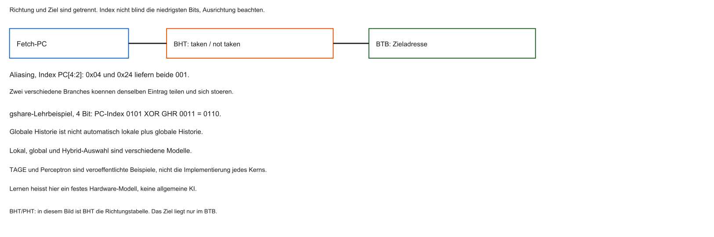

- Kleiner schneller Speicher (oft SRAM) für Predictions
- Index: typisch untere PC-Bits der Branch-Adresse
- Parallel zum Fetch: Eintrag liefert Taken/Not-Taken-Historie

::: notes
Notizbuch der if-Abfragen: Hausnummer = PC, Eintrag = letztes Verhalten.
:::

## 1-Bit-Prädiktor

- Ein Bit: zuletzt Taken (1) oder Not Taken (0)
- Schwachpunkt: verschachtelte Schleifen
- Schleifenende kippt auf Not Taken → nächster Eintritt oft sofort falsch geraten
- Zwei Fehlprognosen pro äußerem Durchlauf sind typisch

::: notes
Zu reaktiv: ein Abbruch überschreibt die „Schleifen-Meinung“ zu aggressiv.
:::

## 2-Bit saturierender Zähler

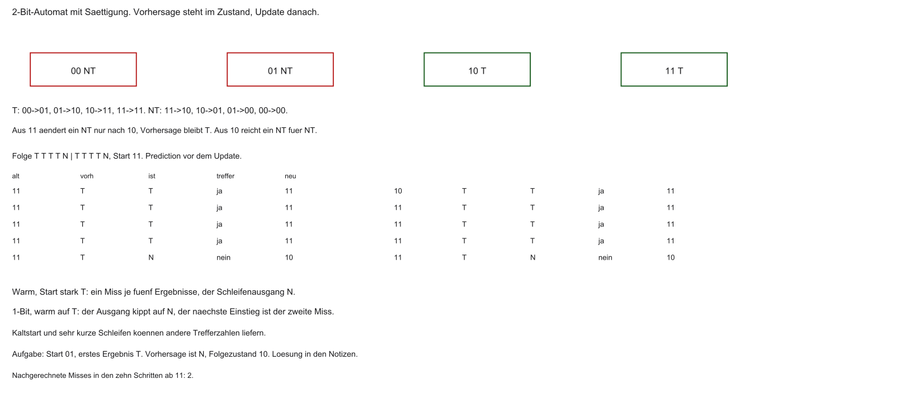

Industrie-Standard: Zustände $00$–$11$

| Code | Bedeutung | Vorhersage |
|------|-----------|------------|
| $00$ | Strongly Not Taken | Not Taken |
| $01$ | Weakly Not Taken | Not Taken |
| $10$ | Weakly Taken | Taken |
| $11$ | Strongly Taken | Taken |

Taken: $+1$ (Sättigung bei $11$); Not Taken: $-1$ (Sättigung bei $00$). Die Selbstschleifen an $00$ und $11$ stehen im Diagramm.

::: notes
Start im schwachen Not-Taken $01$, erstes Ergebnis Taken: Vorhersage Not Taken, Folgezustand $10$. Ab stark Taken kostet die Folge T T T T N einen Miss. Der unvollständige Kettengraph ohne Sättigungsschleifen gilt nicht mehr.
:::

## Hysterese des 2-Bit-Zählers

- Lange Schleife → oft $11$ (Strongly Taken)
- Einmaliges Ende: $11 \rightarrow 10$ — Vorhersage bleibt Taken
- Nächster Schleifeneintritt: oft sofort korrekt; Zähler steigt wieder
- Aus einem starken Zustand braucht der Wechsel zwei widersprechende Ergebnisse. Aus einem schwachen Zustand genügt eines

::: notes
Trägheit spart Fehlprognosen bei typischen Schleifenabbrüchen.
:::

## Branch Target Buffer (BTB)

- Taken allein reicht nicht — Zieladresse muss früh bekannt sein
- Decode/Add für Offset oft zu spät für den nächsten Fetch
- BTB: Cache mit (u. a.) zuletzt beobachteter Target-Adresse
- IF: Prediction + bei Taken sofortiger Target aus dem BTB

::: notes
GPS-Gedächtnis: nicht nur links/rechts, sondern die Zielkoordinaten ohne Wartezeit.
:::

## Globale Historie (Korrelation)

- Branches korrelieren oft im C-Kontrollfluss
- Global History Register (GHR): Bitmuster der letzten $N$ Outcomes
- gshare ist ein konkretes Modell: PC-Index XOR globale Historie. Das ist nicht automatisch lokale plus globale Historie
- Erkennt Muster über einzelne Sprungstellen hinweg

::: notes
Nicht nur „dieser `beq`“, sondern „was tat das Programm kurz davor?“.
:::

## Fortgeschrittene Prädiktoren

- TAGE und Perceptron-Prädiktoren sind veröffentlichte Beispiele, nicht die Angabe jedes Kerns
- Lernen von Gewichtungen aus der Historie in Hardware
- Praxis: sehr hohe Accuracy bei vielen Workloads — selten, aber teuer bei Misses

::: notes
Die Analogie zum Lernen bleibt im festen Hardware-Modell. Das ist keine allgemeine KI.
:::

## Aufgabe — CPI und schwacher Zustand

Was bedeuten CPI 1,30 für Laufzeit und Durchsatz? Der 2-Bit-Zähler steht auf 01, das nächste Ergebnis ist T. Welche Vorhersage gilt?

::: notes
Laufzeitfaktor 1,30, also 30 Prozent länger. Durchsatzfaktor etwa 0,769, also rund 23 Prozent weniger Durchsatz. Zustand 01 sagt Not Taken voraus und geht nach T auf 10. Siehe CPI-Bild und den Automaten.
:::

## Spekulative Ausführung

- Spekulativer Fetch braucht kein OoO. Im High-Performance-Modell kommen Prediction und OoO zusammen
- Predictor sagt z. B. „Taken“ → spekulativer Pfad wird gestartet (Issue)
- ALUs rechnen und laden bereits — bevor der Branch architektonisch bestätigt ist

::: notes
Zenit der Performance: rechnen auf Pfaden, die logisch noch unsicher sind.
:::

## Rechnen auf Verdacht

- Best Case: Prediction korrekt → Arbeit schon (fast) fertig im ROB
- Speicherlatenzen werden hinter Spekulation versteckt
- IPC kann stark steigen, wenn Units nicht idle auf den Branch warten

::: notes
Während der Branch noch „unterwegs“ ist, läuft der vorhergesagte Pfad schon.
:::

## Rollback bei Misprediction

- Falscher Pfad: spekulative Loads/Rechnungen verwerfen
- ROB hält Ergebnisse zurück — kein vorzeitiges Commit in Architekturzustand
- Squash des spekulativen ROB-Teils, dann korrekten Pfad nachfüllen

::: notes
Sicherheitsnetz aus Teil 1: spekulieren darf, sichtbar wird erst nach Bestätigung.
:::

## Spectre und Meltdown (2018)

- Lange Annahme: Fehlspekulation sei für Software unsichtbar
- Meltdown: spekulativ über Privilege-Grenzen (z. B. Kernel-Daten) — vor allem bestimmte ältere Designs
- Spectre: spekulativ über fehlvorhergesagte Branches / manipulierte Predictor-Zustände
- Gemeinsam: Architekturzustand wird zurückgerollt — Cache-/Timing-Spuren können bleiben

::: notes
Zwei verwandte, aber unterschiedliche Klassen: Privilege-Bypass (Meltdown) vs. Branch-/Predictor-Missbrauch (Spectre).
:::

## Seitenkanal über den Cache

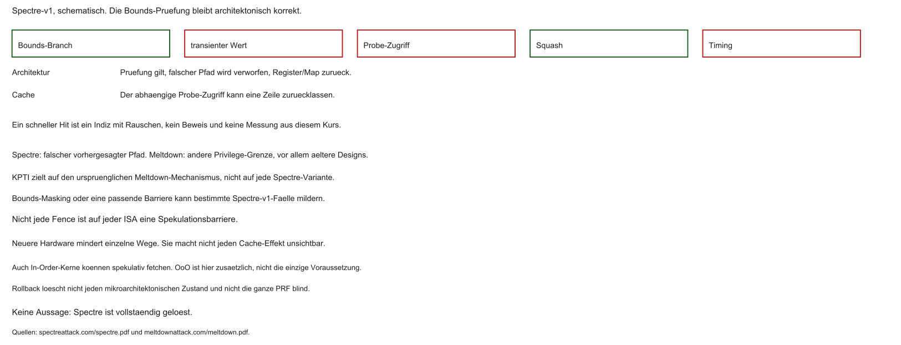

Prinzip (Spectre-artig, stark vereinfacht):

1. Die Bounds-Prüfung bleibt architektonisch korrekt
2. Der vorhergesagte Pfad läuft transient, bevor die Prüfung wirkt
3. Das Geheimnis steuert die Adresse eines folgenden Probe-Zugriffs
4. Squash verwirft den Architekturzustand. Die Cache-Spur kann bleiben

::: notes
Ein schneller Hit ist ein verrauschtes Indiz, kein automatischer Beweis und keine Messung aus dieser Vorlesung.
:::

## Timing als Orakel

- Angreifer misst Zugriffszeiten (Flush+Reload / ähnliche Muster)
- Schneller Hit $\Rightarrow$ Zeile war im Cache
- Aus der getroffenen Position lässt sich Information über spekulativ genutzte Werte rekonstruieren
- Klassischer mikroarchitektonischer Side Channel

::: notes
Stoppuhr statt direktem Leserecht — Architektur verbietet, Mikroarchitektur leakt.
:::

## Mitigationen

- KPTI zielt vor allem auf den ursprünglichen Meltdown-Mechanismus
- Passendes Bounds-Masking oder eine geeignete Barriere kann bestimmte Spectre-v1-Fälle treffen. Nicht jede Fence ist auf jeder ISA eine Spekulationsbarriere
- Neuere Hardware mindert einzelne Wege und macht nicht jeden Cache-Effekt unsichtbar
- Spectre ist damit nicht vollständig gelöst

::: notes
Patches und Fences kosten Performance; langfristig hilft Silizium-Design.
:::

## Ausblick Labor: Compiler hilft der Pipeline

- Hardware kompensiert viel (OoO, BHT) — Compiler kann Hazards und Branches reduzieren
- GCC/Clang: Optimierungsstufen `-O0` … `-O3`
- Ziel: bessere IPC, weniger Stalls und teure Control Hazards

::: notes
Kein direkter ROB-Zugriff — aber Maschinencode so formen, dass die Pipeline „glücklich“ wird.
:::

## Was `-O3` typisch tut

- `-O0` ist zum Debuggen gedacht und keine garantierte Zeile-für-Zeile-Übersetzung
- `-O2` und `-O3` erlauben mehr Analysen. `-O3` garantiert weder Unrolling noch weniger Branches noch kürzere Laufzeit
- Ob eine Schleife ausgerollt wird, hängt von Compiler, Version, `-march` und dem Code ab

::: notes
Derselbe Algorithmus, anderer Assembler — Laufzeit kann stark differieren.
:::

## Trick: Instruction Scheduling

- Problem: `lw` → abhängiger Nutzer → Load-Use-Stall
- Compiler schiebt unabhängige Instruktionen in die Lücke (statisches Scheduling)
- C-Reihenfolge $\neq$ optimale Maschinenreihenfolge

::: notes
Blasen in der Pipeline mit nützlicher Arbeit füllen.
:::

## Trick: Loop Unrolling

- Enge Schleifen: viele Branches relativ zur Nutzarbeit
- Unrolling: Iterationen ausrollen → weniger `beq`, mehr gerader Code
- Trade-off: größere Code-Größe (I-Cache) vs. weniger Control Hazards

::: notes
Kontrolle gegen Branches — Flash/I-Cache zahlen den Preis.
:::

## Tool: Compiler Explorer (Godbolt)

- Web-Tool: C links, Assembler rechts (live)
- Farbzuordnung C-Zeile → Instruktionen
- Ideal, um `-O1` vs. `-O3` und RISC-V-Output zu vergleichen

::: notes
Röntgenblick für Embedded- und Performance-Entwicklung.
:::

## Laboridee: Godbolt und Messung

Geplant (Details im Übungsblatt):

- Godbolt zeigt die Übersetzung, kein OoO-Timing
- Ein Ripes-Vergleich gilt nur für das dort gewählte Pipeline-Modell, nicht für eine Desktop-OoO-CPU
- Renode ohne validiertes Mikroarchitekturmodell belegt keine Stall-, Branch- oder OoO-Zahlen
- Flags, Compilerversion und ABI gehören zur Beobachtung. Siehe Übungsblatt

::: notes
Sehen (Assembler) und messen (Zyklen) — derselbe C-Algorithmus, andere Pipeline-Last.
:::

## Zusammenfassung Block 7

- Skalare Pipeline: Ideal oft $\mathrm{IPC} \le 1$
- Superskalar: mehrere Units / Issues pro Takt
- OoO: Renaming + ROB für dynamisches Scheduling und präzise Exceptions
- Branch Prediction (u. a. 2-Bit, BTB): Flushes vermeiden
- Spekulation beschleunigt — Cache-Seitenkanäle (Spectre/Meltdown) als Kehrseite
- Compiler (`-O3`): Scheduling und Unrolling unterstützen die Hardware

::: notes
Moderne Kerne: vorhersagend, spekulativ, superskalar — Semantik nach außen dennoch „geordnet“.
:::

## Evolution: MCT1 → MCT3

- MCT1: klare In-Order-Pipeline, begrenztes ILP
- MCT3 bisher: Caches, DMA, Bus-Mastering
- Heute: physische Register, OoO, Prediction, Spekulation
- Brücke zur realen High-Performance- und zur energieeffizienten MCU-Welt

::: notes
Vom Addierer zum spekulativen Kern — Konzepte von Grund auf aufgebaut.
:::

## Ausblick und Abschluss

- Übungsblatt: Godbolt — `-O0`/`-O3`, Scheduling, Unrolling
- Optional: Zyklusvergleich in der Simulation

Vielen Dank — viel Erfolg beim Experimentieren.

::: notes
Quellen, Stand der Vorlesung: RISC-V ISA und RVWMO; BOOM-Pipeline, ROB und LSU als dokumentiertes OoO-Beispiel, nicht als Laborplattform; GCC Optimize-Options; Spectre- und Meltdown-Paper; Ripes und Renode nur in den dort genannten Grenzen. Adressen und Breiten dieser Folien sind das Lehrmodell.
:::

::: notes
Wer Assembler-Optimierungen lesen kann, programmiert näher an der Hardware. Viel Erfolg!
:::
