## Willkommen zu Block 8!

- Willkommen zur achten Vorlesung in Mikrocomputertechnik 3
- Block 7: OoO und Branch Prediction maximieren die General-Purpose-CPU
- Heute: Workload Künstliche Intelligenz — und warum Spezialhardware (NPUs) hilft
- Ziel: Memory Wall bei neuronalen Netzen verstehen und den Weg zu DSAs skizzieren

```{mermaid}
%%| fig-width: 3.8
%%{init: {'theme': 'base', 'themeVariables': {'background': '#FFFFFF', 'primaryColor': '#FFFFFF', 'primaryBorderColor': '#E5E5EA', 'primaryTextColor': '#1D1D1F', 'lineColor': '#86868B', 'secondaryColor': '#F5F5F7', 'tertiaryColor': '#FFFFFF', 'mainBkg': '#FFFFFF', 'nodeBorder': '#E5E5EA', 'clusterBkg': '#F5F5F7', 'clusterBorder': '#E5E5EA', 'titleColor': '#1D1D1F', 'edgeLabelBackground': '#FFFFFF'}}}%%
flowchart LR
  A[Block 7: CPU] -->|Alleskönner| B[Kontrollfluss]
  C[Heute: NPU] -->|Spezialist| D[Datenfluss / KI]
  style C fill:#FFFFFF,stroke:#E2001A,stroke-width:2px !important
```

::: notes
General-Purpose-Kerne sind stark bei chaotischem Kontrollfluss. KI: oft Milliarden simpler MACs — andere Hardware-Prioritäten.
:::

## Anknüpfung: Compiler-Labor

Kurz-Recap aus Block 7 (Vertiefung im Übungsblatt):

- Godbolt zeigt die Übersetzung, kein OoO-Timing
- `-O3` garantiert weder Unrolling noch kürzere Laufzeit
- Scheduling und Unrolling sind mögliche, keine sicheren Folgen
- Eine MAC-Kette bleibt RAW. Mehrere Akkumulatoren können unabhängig sein

```c
/* Konzept: Unrolling von for (i = 0; i < 4; i++) a[i] = 0; */
a[0] = 0;
a[1] = 0;
a[2] = 0;
a[3] = 0;
```

::: notes
Neuronale Netze: lange, vorhersagbare Schleifen — ideal für DLP, teuer für OoO-Overhead.
:::

## Grenze der General-Purpose-CPU

- Mehr Issue-Breite verteuert Scheduler, Ports und Bypass. Quadratisch gilt nicht pauschal für ROB, Renaming und Decode zusammen
- OoO kann Loads überlappen. Es hebt eine einzelne Akkumulatorkette nicht auf
- DLP ergänzt ILP. SIMD ist eine Umsetzung, keine Definition von DLP

::: notes
Schweizer Taschenmesser vs. Motorsäge: Excel und OS brauchen Flexibilität; Milliarden MACs brauchen Durchsatz.
:::

## Neuer Workload: Edge AI

- Edge AI umfasst Endgerät und Gateway. Nicht jede lokale Inferenz braucht eine NPU
- Beispiele: Schrittzählung, Wake-Word, Vibrationsdiagnose an Maschinen
- Dauerbetrieb auf knappen Ressourcen (Energie, SRAM, Flash)

::: notes
KI verlässt Serverfarmen — trifft auf Knopfzelle und Milliwatt-Budgets.
:::

## Cloud AI vs. Edge AI

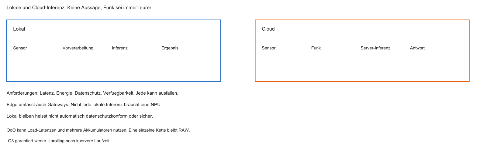

Warum nicht alles in die Cloud?

1. Latenz — sicherheitskritische Reaktionen dulden keine Funkwartezeit
2. Privacy — Audio/Video sollen oft lokal bleiben
3. Energie und Verfügbarkeit sind Anforderungen. Funk ist nicht immer teurer als lokale Rechnung

```{mermaid}
%%| fig-width: 3.6
%%{init: {'theme': 'base', 'themeVariables': {'background': '#FFFFFF', 'primaryColor': '#FFFFFF', 'primaryBorderColor': '#E5E5EA', 'primaryTextColor': '#1D1D1F', 'lineColor': '#86868B', 'secondaryColor': '#F5F5F7', 'tertiaryColor': '#FFFFFF', 'mainBkg': '#FFFFFF', 'nodeBorder': '#E5E5EA', 'clusterBkg': '#F5F5F7', 'clusterBorder': '#E5E5EA', 'titleColor': '#1D1D1F', 'edgeLabelBackground': '#FFFFFF'}}}%%
flowchart LR
  A[Sensordaten] -->|lokal| B[Edge-NPU]
  A -.->|Funk| C[Cloud]
  style B fill:#FFFFFF,stroke:#E2001A,stroke-width:2px !important
```

::: notes
Lokal bleiben garantiert weder Datenschutz noch sicheren Betrieb. Cloud und Edge sind Entwurfsoptionen.
:::

## Agenda

1. KI-Herausforderung und Memory Wall
2. DSPs und SIMD
3. RISC-V Vector Extension (RVV)
4. NPU und Systolic Arrays
5. Edge-AI-Software / TensorFlow Lite

::: notes
Von Memory Wall über RVV und Systolic Arrays bis TFLM am Edge.
:::

## Lernziele Block 8

- Memory Wall bei Matrix-/MAC-Lasten erklären
- MAC-Operation und ihre Bedeutung benennen
- ILP vs. DLP unterscheiden
- Systolic Arrays einordnen
- TensorFlow Lite Micro Workflow skizzieren

::: notes
Ziel: verstehen, warum NPUs/TPUs anders gebaut sind als OoO-Kerne.
:::

## Die Leitfrage des Tages

- Kleines Netz: z. B. $10^{6}$ Gewichte — Inferenz verrechnet sie mit Aktivierungen
- SRAM, Cache-Hit, Flash und DRAM haben verschiedene Kosten. Nicht jeder Zugriff ist ein DRAM-Miss
- Wie rechnet man Millionen MACs/s auf knapper Energie, ohne am Speicher zu ersticken?

```{mermaid}
%%| fig-width: 3.2
%%{init: {'theme': 'base', 'themeVariables': {'background': '#FFFFFF', 'primaryColor': '#FFFFFF', 'primaryBorderColor': '#E5E5EA', 'primaryTextColor': '#1D1D1F', 'lineColor': '#86868B', 'secondaryColor': '#F5F5F7', 'tertiaryColor': '#FFFFFF', 'mainBkg': '#FFFFFF', 'nodeBorder': '#E5E5EA', 'clusterBkg': '#F5F5F7', 'clusterBorder': '#E5E5EA', 'titleColor': '#1D1D1F', 'edgeLabelBackground': '#FFFFFF'}}}%%
flowchart TD
  A[RAM: Gewichte] -->|Flaschenhals| B[ALU]
  B --> C[Ergebnis]
  style A fill:#FFFFFF,stroke:#E2001A,stroke-width:2px !important
```

::: notes
Zentrale Spannung: Datenvolumen vs. Speicherlatenz/Energie auf dem Edge-SoC.
:::

## Aufgabe — Sechs MACs

Warum sind sechs Gewichte hier sechs MACs, bei einer Faltung aber nicht? Was ist y0?

::: notes
Jedes Gewicht wird einmal mit einem Input multipliziert. y0 ist 14. Eine Faltung verwendet Gewichte mehrfach, deshalb übersteigt die MAC-Zahl die Parameterzahl. Siehe die Dense-Abbildung.
:::

## Neuronale Netze auf Hardware-Ebene

- Abseits des Hypes: große Zahlenarrays
- Inputs / Activations: Sensordaten (z. B. $28\times 28$ Pixel)
- Weights: trainierte Konstanten (oft Flash)
- Neuron: gewichtete Summe der Eingänge (+ Aktivierung, hier ausgeblendet)

::: notes
Für Architekten: Listen von Zahlen und MAC-Schleifen — kein „Gehirn“-Mythos nötig.
:::

## Mathematik: Matrix / Dot Product

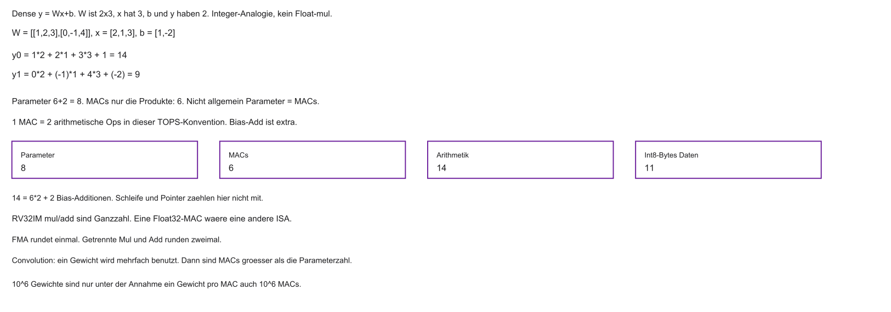

```c
float sum = 0.0f;
for (int i = 0; i < N; i++) {
    sum += input[i] * weights[i];
}
```

- Kein Kontrollfluss-Chaos: vorhersagbarer Datenstrom
- Pro Iteration: zwei Loads + Mul + Add

::: notes
Simpler Code — brutal für den Speicherbus.
:::

## MAC-Operation

- Multiply-Accumulate: $a \leftarrow a + (w \times x)$
- $w$: Gewicht, $x$: Activation, $a$: Akkumulator
- KI-Chips: oft in TOPS (viele MAC-Äquivalente / s) spezifiziert — nicht nur in MHz

::: notes
MAC ist das Atom der Inferenz-Hardware.
:::

## Anatomie einer MAC auf RISC-V

Vereinfachte Befehlsfolge:

```asm
# Konzept — RV32IM (mul); Adressen schematisch
lw  t0, 0(s1)    # x
lw  t1, 0(s2)    # w
mul t2, t0, t1
add t3, t3, t2   # a += w*x
```

- `mul`/`add` sind hier Ganzzahl, die C-Schleife darüber ist Float. Das ist eine Analogie, keine Float-ISA
- Zwei Loads und zwei Ops gelten nur ohne Wiederverwendung und ohne FMA

::: notes
Ohne Wiederverwendung der Daten verhungert die ALU am Bus.
:::

## Arithmetic Intensity: Zahlenbeispiel

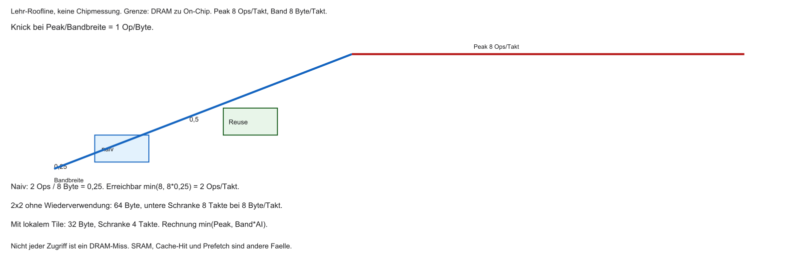

- $\mathrm{AI} = \mathrm{Ops}/\mathrm{Bytes}$
- Grenze dieses Beispiels: DRAM zum On-Chip-Speicher. Output und Bias zählen hier noch nicht
- $2$ Ops und $8$ Byte ergeben $0{,}25$ Ops/Byte. Das ist nicht allgemein „unter 1 = memory-bound“
- Erreichbar ist $\min(P_{peak}, Bandbreite \times AI)$. Der Knick liegt bei $P_{peak}/Bandbreite$

::: notes
Im Lehrmodell mit 8 Ops/Takt und 8 Byte/Takt liegt der Knick bei 1 Op/Byte. Andere Maschinen haben einen anderen Knick.
:::

## Datenproblem: Gewichte

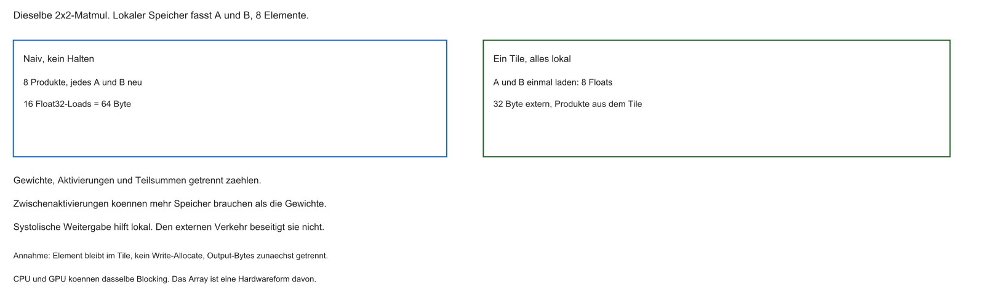

- Modelle wie ResNet-50: Millionen Parameter — Megabyte-Bereich
- L1 oft nur Dutzende KiB → Matrizen passen nicht
- Ein Streaming-Datensatz erzeugt nicht bei jedem Skalarzugriff einen Capacity Miss. Cachezeilen und Prefetch bündeln Zugriffe

::: notes
Block-2-Caches helfen bei Lokalität — bei einmaligem Durchlauf riesiger Matrizen kaum.
:::

## Memory Wall bei KI

| Phase | Typische Dauer (schematisch) |
|-------|------------------------------|
| Load $x$, $w$ (DRAM) | viele Takte |
| MUL + ADD | wenige Takte |
| nächster Load | wieder viele Takte |

- ALU oft idle; Energie geht in Wartezeit und Datentransport

::: notes
Diagramm des Grauens: Mathematik ist billig, Daten holen ist teuer.
:::

## Rechenbeispiel: $10^{6}$ MACs

- $10^{6}$ Gewichte sind nur dann $10^{6}$ MACs, wenn jedes Gewicht genau einmal multipliziert wird
- Eine Faltung nutzt Gewichte mehrfach. Sequenz, Bild und Batch ändern den Aufwand
- Einzelne Miss-Latenzen darf man nicht zu einer Summe addieren, wenn Zugriffe überlappen

::: notes
Selbst mit Prefetch bleibt der Von-Neumann-Pfad der Engpass.
:::

## Warum OoO hier wenig hilft

- OoO/Predictor: stark bei unregelmäßigem Kontrollfluss
- MAC-Schleife: linear, hoch vorhersagbar
- Der Predictor ist bei einer festen Schleife nicht wertlos, aber selten der Engpass
- Unabhängige Akkumulatoren kann OoO ausführen. Die Speichergrenze bleibt, wenn die Arithmetic Intensity niedrig ist

::: notes
Ironie: Cleverness aus Block 7 ist für diesen Workload oft Verschwendung.
:::

## Fazit: CPU vs. KI-Last

- ALU-Auslastung bei naiver Matrixrechnung oft gering
- Viel Zeit/Energie in Transport und Instruktionsverwaltung
- Edge-KI braucht andere Datenpfade — Richtung Domain-Specific Architecture

::: notes
Verhältnis Rechenwerk zu Datenbeschaffung muss radikal anders werden.
:::

## Lösung: Data-Level Parallelism (DLP)

- Weg von „viele verschiedene Instruktionen“ (ILP)
- Hin zu: eine Instruktion auf vielen Daten gleichzeitig (DLP)
- Viele unabhängige MACs → viele Units, ein Kommando

::: notes
100 unabhängige Multiplikationen: nicht nacheinander — parallel mit einem Issue.
:::

## Domain-Specific Architecture (DSA)

- Extreme DLP-Optimierung → Verlust der Allzweck-Fähigkeit
- DSA: Silizium für eine Domäne (z. B. Matrizen) — oft deutlich effizienter
- Evolutionsschritte: SIMD → DSP-Tricks → Vektoren → NPUs

::: notes
Nach dem Ende leichter CPU-Gains: Spezialchips als Leistungspfad.
:::

## Fragen? — MAC und Memory Wall

- Was leistet die MAC-Operation im Netz?
- Warum kehrt die Memory Wall bei KI zurück?
- ILP vs. DLP?

::: notes
Als Nächstes: SIMD und DSPs — historische und praktische DLP-Stufen.
:::

## Was bedeutet SIMD?

- SIMD: Single Instruction, Multiple Data
- Paradebeispiel für DLP
- Ein Fetch/Decode → intern mehrere parallele Operationen

::: notes
Breite Execution hinter einem Befehl — weniger Instruktions-Overhead.
:::

## SIMD-Prinzip

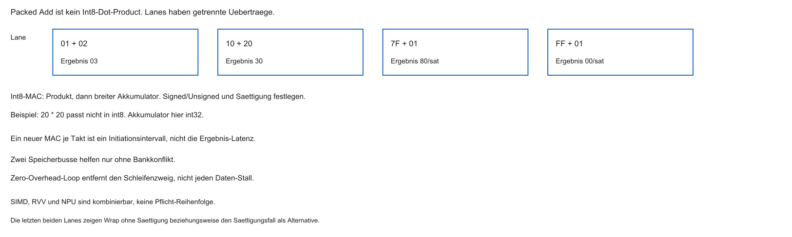

- Skalar (SISD): `add` → eine Addition
- SIMD: ein Befehl → mehrere parallele Adds auf Daten-Lanes

```{mermaid}
%%| fig-width: 3.8
%%{init: {'theme': 'base', 'themeVariables': {'background': '#FFFFFF', 'primaryColor': '#FFFFFF', 'primaryBorderColor': '#E5E5EA', 'primaryTextColor': '#1D1D1F', 'lineColor': '#86868B', 'secondaryColor': '#F5F5F7', 'tertiaryColor': '#FFFFFF', 'mainBkg': '#FFFFFF', 'nodeBorder': '#E5E5EA', 'clusterBkg': '#F5F5F7', 'clusterBorder': '#E5E5EA', 'titleColor': '#1D1D1F', 'edgeLabelBackground': '#FFFFFF'}}}%%
flowchart LR
  A[SIMD Add] --> B{Verteiler}
  B --> A1[ALU1]
  B --> A2[ALU2]
  B --> A3[ALU3]
  B --> A4[ALU4]
  style A fill:#FFFFFF,stroke:#E2001A,stroke-width:2px !important
```

::: notes
Fetch/Decode einmal — Execution-Width multipliziert.
:::

## Packed SIMD

- Problem: schmale ISA-Register, breite Parallelität?
- Lösung: Register in Lanes zerlegen (z. B. 32 Bit → $4\times 8$ Bit)
- SIMD-Op: Lane für Lane parallel, ohne Carry zwischen Lanes

::: notes
90er-Hack: vorhandene Datenwege in Scheiben für Audio/Sensorwerte nutzen.
:::

## Digital Signal Processors (DSPs)

- Vor dem KI-Boom: DSPs für Audio, Modem, Filter
- Algorithmen (FIR etc.): wie KI stark Array-/Skalarprodukt-lastig
- Vorläufer vieler NPU-Ideen

::: notes
Großväter der NPUs — Datenstrom statt allgemeiner Kontrollfluss.
:::

## DSP: dedizierte MAC-Einheit

- Mul und Add oft fest verdrahtet als eine MAC
- $a + (x \times w)$ in wenigen Takten / oft einem Zyklus (je nach Design)
- Weniger Instruktionsfolge als auf skalarer RISC-ALU

::: notes
Werte rein — Summe raus: Hardware für den Hot Path.
:::

## Super-Harvard in DSPs

- Mehrere parallele Speicherpfade gegen die Memory Wall
- Typisch: Code-Bus + getrennte Datenbusse für $x$ und $w$
- Loads und MAC können im selben Takt überlappen

::: notes
Zwei Zahlen brauchen zwei Wege — Architektur folgt dem Workload.
:::

## Zero-Overhead Loops

- Hardware-Schleifenzähler: Start, Ende, Count
- Kein `beq` pro Iteration — kein Predictor-Overhead
- PC-Wrap in Hardware bis Count abgelaufen

::: notes
Schleifen ohne Software-Branch-Penalty — reine Rechenpower.
:::

## Grenze: Packed SIMD skaliert schlecht

- Feste Vektorbreite in der ISA (z. B. 128 / 256 / 512 Bit)
- Alter Code nutzt neue breitere Units nicht automatisch
- Oft Neukompilieren / Intrinsics für jede Generation

::: notes
Starrheit: Software an Bitbreite gekoppelt.
:::

## Instruction-Fetch-Overhead bleibt

- Auch breites SIMD: weiterhin viele Instruktionen für große Matrizen
- Decode und I-Cache kosten Energie
- Wunsch: „rechne lange auf diesen Daten“ mit weniger Instruction Stream

::: notes
SIMD lindert — heilt den Instruktions-Overhead nicht vollständig.
:::

## Übergang zu Vektoren

- Weg von starrem Packed SIMD → flexible Vektorlängen
- RISC-V Vector Extension (RVV): Ansatz für skalierbare Vektor-ISAs
- Code-Idee: dieselbe Software auf schmalen und breiten Implementierungen

::: notes
RVV und danach Systolic Arrays / NPUs.
:::

## Kurzfazit: DSP und SIMD

- DLP: ein Befehl, viele Daten
- Packed SIMD: breite Register, starre Breiten
- DSPs: MAC, Multi-Bus, Zero-Overhead Loops
- Für moderne KI-Arrays oft noch zu starr / zu instruction-lastig → Vektoren & NPUs

::: notes
Pioniere der Datenparallelität — Grundlage für heutige Beschleuniger.
:::

## Fragen? — SIMD und DSP

- Wie senkt SIMD den Fetch/Decode-Overhead?
- Warum ist eine Hardware-MAC für Signalverarbeitung wertvoll?
- Warum muss Packed-SIMD-Code oft neu angepasst werden?

::: notes
Als Nächstes: RISC-V Vectors, Systolic Arrays, TensorFlow Lite Micro.
:::

## Echte Vektor-Architektur

- Verarbeitet lineare Arrays (Vektoren), nicht nur Skalare
- Anders als Packed SIMD: Vektorlänge flexibel, nicht in feste Registerhäppchen geschnitten
- Befehlssatz abstrahiert: „Addiere Vektor A und B“ — unabhängig von der Implementierungsbreite

::: notes
Seit Cray-Supercomputern bekannt; RISC-V bringt das Konzept zurück in die MCU-Welt.
:::

## Vektor-Register-File

- Neben `x0`–`x31`: Vektorregister `v0`–`v31`
- Jedes `v`-Register hält viele Elemente gleichzeitig
- Kapazität hängt von der Implementierung ab ($\mathrm{VLEN}$ = Vector Length)

::: notes
32 „Güterzüge“ neben den Skalar-Kisten — ein Vektorbefehl arbeitet auf dem ganzen Zug.
:::

## RISC-V Vector Extension (RVV)

- Offizielle RISC-V-Erweiterung für Vektormathematik (u. a. ML, Krypto)
- Neue Instruktionen, z. B. `vadd.vv`
- Software kennt die physische Breite oft nicht (Watch vs. Server)
- Frage: ein Binary für unbekannte $\mathrm{VLEN}$?

::: notes
Anders als AVX: Code nicht an feste Bitbreite ketten.
:::

## `vsetvli` / hardware-agnostisch

- Software: „Array mit $N$ Elementen“
- Bei LMUL $= 1$ ist $\mathrm{VLMAX} = \mathrm{VLEN}/\mathrm{SEW}$. Allgemein $\mathrm{VLMAX} = \mathrm{LMUL}\times\mathrm{VLEN}/\mathrm{SEW}$
- `vsetvli` liefert nicht immer $\min(AVL, VLMAX)$
- Schleife läuft in Hardware-Schritten durch das Array

```asm
# RVV 1.0, LMUL=1, e32, ta, ma. Nicht in diesem Repo assembliert.
loop:
    vsetvli t0, a0, e32, m1, ta, ma
    vle32.v v1, (a1)
    vle32.v v2, (a2)
    vadd.vv v3, v1, v2
    vse32.v v3, (a3)
    slli t1, t0, 2
    add a1, a1, t1
    add a2, a2, t1
    add a3, a3, t1
    sub a0, a0, t0
    bnez a0, loop
```

::: notes
Laufzeit-Abfrage der Kapazität — Schrittweite passt sich dem Silizium an.
:::

## Ein Binary, viele $\mathrm{VLEN}$

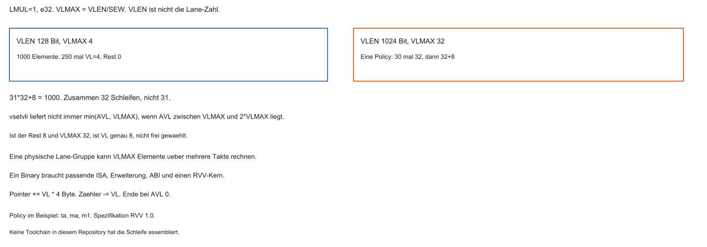

Beispiel: 1000 Elemente, `vadd.vv` (schematisch)

| Plattform | Breite (schematisch) | $\mathrm{VL}$ (e32) | Schleifenläufe |
|-----------|----------------------|---------------------|----------------|
| Edge | schmal (z. B. 128 Bit) | 4 | 250 |
| Server | 1024 Bit, LMUL 1 | 32, dann 20+20 oder 32+8 | 32 |

Gleiche RVV-Schleifenidee skaliert mit $\mathrm{VLEN}$ — ohne feste Packed-SIMD-Breite im Quelltext.

::: notes
1000 Elemente und VLMAX 32: nach 30 vollen Schritten ist AVL 40. Dann erlaubt die Spezifikation jede VL von 20 bis 32. Diese Folie zeigt zwei zulässige Reste, 20+20 und 32+8. Der Zeiger folgt immer dem zurückgegebenen VL.
:::

## Energie: weniger Instruction Fetch

- Ein Vektorbefehl → viele Elemente parallel
- Skalar: dutzende Loads/Adds/Branches aus dem I-Cache
- Weniger Fetch kann Energie sparen und garantiert keinen geringeren Gesamtverbrauch

::: notes
Speicher- und Registerverkehr bleiben in der Energiebilanz. Chaining ist Mikroarchitektur, nicht die ISA.
:::

## Vector Load/Store

- Breite Speicherpfade zum D-Cache / SRAM
- `vle32.v`: zusammenhängender Block → Vektorregister
- Ähnlich Burst-Idee: DRAM-/Bus-Lokalität besser ausnutzen

::: notes
Speicher muss mitwachsen — ein Load füllt den Güterzug.
:::

## Chaining

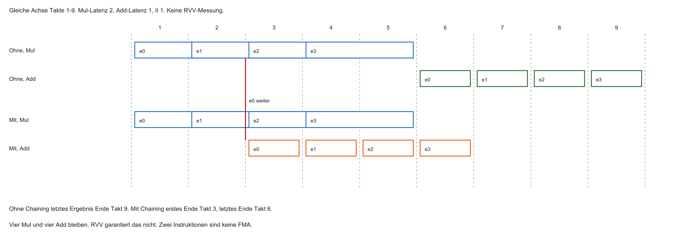

- MAC: Mul dann Add — Zwischenergebnis sonst zurück ins Registerfile
- Chaining ist eine Option des Kerns. Eine FMA ist eine andere Instruktion mit einer Rundung
- Weniger Registerverkehr, höherer Durchsatz

::: notes
Pipelining im Rechenwerk: Zwischenergebnisse fließen weiter, ohne zu „parken“.
:::

## RVV und TinyML

- TinyML: Inferenz auf sehr knappen Energie-/SRAM-Budgets
- RVV-fähige Kerne: flexibel (noch volle CPU) + Vektor-Durchsatz
- Typisch: Keyword Spotting, kleine Sensor-Modelle am Edge

::: notes
Mittelweg: C/OS auf der CPU, heiße Mathe auf Vektorunits.
:::

## Grenzen von Vektoren

- Registerfile bleibt: lesen/schreiben kostet Energie und limitiert Skalierung
- Sehr große Modelle: Pfad ALU → Register wird Engpass
- Nächste Stufe: Daten fließen ohne ständiges Zurückschreiben — Systolic Arrays

::: notes
Wenn Matrizen absurd wachsen, reicht „Vektor + Register“ nicht mehr.
:::

## Kurzfazit RVV

- Ein Befehl, lange Arrays
- $\mathrm{VLEN}$/$\mathrm{VL}$ abstrahiert Hardwarebreite
- Binary skaliert von Edge bis Server
- Weniger Front-End-Last (DLP)
- Loads und Chaining senken interne Wartezeiten

::: notes
Elegante DLP-Integration in eine Allzweck-ISA.
:::

## Aufgabe — AVL 40

VLMAX ist 32. Nach 30 Schritten mit VL 32 bleiben 40 Elemente. Welche letzten VL-Werte sind zulässig, und wie viele Iterationen ergeben 1000 Elemente?

::: notes
Zulässig sind zum Beispiel 20 und 20 oder 32 und 8. Beide Folgen haben insgesamt 32 Iterationen. `vsetvli` allein legt die letzte Länge nicht fest. Der Zeiger rückt um das tatsächlich zurückgegebene VL mal 4 Byte vor.
:::

## Was ist eine NPU?

- Neural Processing Unit: Beschleuniger für Inferenz (manchmal Training)
- Namen: TPU (Google), Neural Engine (Apple), NVDLA, …
- Kein Allzweck-`if/else`-OS — starrer Matrix-Datenfluss
- CPU füttert Adressen/Puffer (ähnlich DMA-Aufträgen)

::: notes
Radikale DSA: nur Matrizen — dafür extrem effizient.
:::

## NPU vs. GPU vs. CPU

| | Optimierung | Stärke | Schwäche |
|---|-------------|--------|----------|
| CPU | Latenz / ILP | Kontrollfluss, Flexibilität | Array-Mathe ineffizient |
| GPU | Durchsatz / SIMT | viele parallele Threads | Energie, Kosten |
| NPU | Datenfluss / DLP | sehr viele MACs/Takt, effizient | starr |

Edge: GPUs oft zu hungrig — NPUs für den Rand des Netzes.

::: notes
GPU kann Matrizen — NPU ist darauf zugeschnitten (oft mW-Regime).
:::

## Flaschenhals: Register / Verdrahtung

- Wunsch: zehntausende MACs/Takt
- Jede MAC braucht Operanden — unmöglich, unendlich viele Ports zum SRAM
- Routing und Multiplexer begrenzen die Breite
- Lösung: Daten lokal zwischen Zellen weiterreichen

::: notes
65k Multiplizierer druckbar — 65k dicke Kabel zum Cache nicht.
:::

## Systolic Arrays

- 2D-Gitter aus MAC-Zellen
- Nur der Rand spricht mit dem Speicher
- Ergebnisse/Operanden wandern zu Nachbarn — ohne Systembus pro Schritt

::: notes
Eimerkette: niemand rennt zum Brunnen, jeder reicht weiter.
:::

## „Systolisch“ — Namensbild

- Systole: rhythmische Pumpwelle
- Takt pumpt Werte wellenartig durch das Gitter
- Pro Zyklus: Daten eine Zelle weiter (rechts/unten je nach Dataflow)

::: notes
Oszillator = Herzschlag für Nullen und Einsen im Array.
:::

## Eine systolische Zelle

Pro Takt typisch:

1. Empfängt $x$ (links) und $w$ (oben)
2. MAC auf interne Teilsumme
3. Reicht $x$ nach rechts und $w$ nach unten weiter

```{mermaid}
%%| fig-width: 3.2
%%{init: {'theme': 'base', 'themeVariables': {'background': '#FFFFFF', 'primaryColor': '#FFFFFF', 'primaryBorderColor': '#E5E5EA', 'primaryTextColor': '#1D1D1F', 'lineColor': '#86868B', 'secondaryColor': '#F5F5F7', 'tertiaryColor': '#FFFFFF', 'mainBkg': '#FFFFFF', 'nodeBorder': '#E5E5EA', 'clusterBkg': '#F5F5F7', 'clusterBorder': '#E5E5EA', 'titleColor': '#1D1D1F', 'edgeLabelBackground': '#FFFFFF'}}}%%
flowchart TD
  W[w von oben] --> Z[MAC-Zelle]
  X[x von links] --> Z
  Z --> R[x nach rechts]
  Z --> U[w nach unten]
  style Z fill:#FFFFFF,stroke:#E2001A,stroke-width:2px !important
```

::: notes
Einfach, aber entscheidend: Originalwerte durchreichen für Wiederverwendung.
:::

## Weniger RAM-Zugriffe

- Ein Wert wird einmal eingespeist und wandert durch viele Zellen
- Viele MACs ohne erneuten Cache-/DRAM-Load
- Arithmetic Intensity steigt — Memory Wall entschärft

::: notes
Load ist teuer; lokale Wiederverwendung ist der Triumph.
:::

## Datenfluss füllt das Array

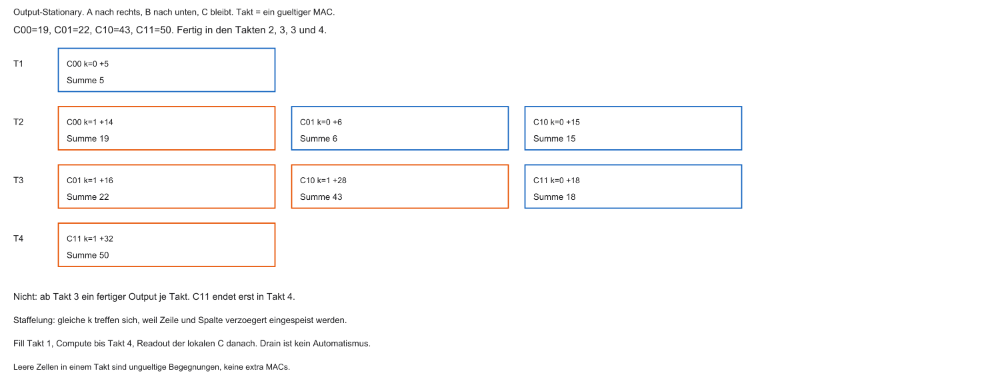

$2\times 2$-Idee (schematisch):

- Takt 1: erste Paare treffen sich, Summen starten
- Takt 2: Wellen wandern, neue Werte am Rand
- Im 2×2-Output-Stationary-Beispiel enden die vier Summen in den Takten 2, 3, 3 und 4
- Das ist kein Ergebnis je Takt ab Takt 3. Readout der lokalen Summen kommt danach

::: notes
Die vier lokalen Summen sind nach Takt 4 fertig. Der Readout ist ein eigener Schritt. Ein kontinuierlicher Strom bräuchte einen extra definierten Tile-Takt.
:::

## Weight-Stationary

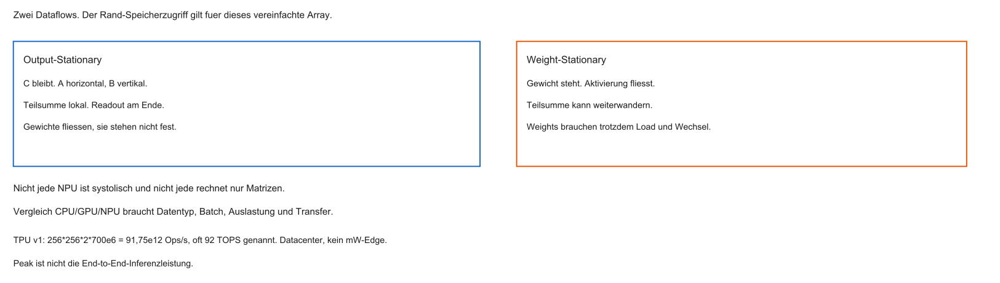

- Gewichte während einer Inferenz oft konstant
- Variante: Weights in Zellen „parken“, nur Activations durchschieben
- Weniger Bewegungen der großen Konstanten-Matrizen

::: notes
Konstanten einmal setzen — dynamische Inputs fluten das Gitter.
:::

## Beispiel: Google TPU v1

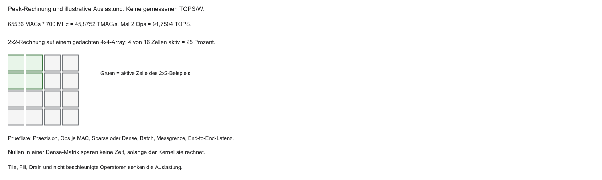

- $256\times 256 = 65\,536$ Int8-MACs. Bei 700 MHz sind das 45,8752 TMAC/s
- Mit zwei Ops je MAC: 91,7504 TOPS, in der Originalarbeit oft 92 TOPS. Das ist Peak, kein End-to-End
- TPU v1 ist ein Datacenter-Baustein, kein Milliwatt-Edge-Teil

::: notes
Weckruf: fast nur Multiplikator-Gitter — Domäne statt Alleskönner. Marketing-TOPS von der Zählkonvention abhängig.
:::

## NPUs am Edge

- SoCs mit kleineren Arrays (z. B. $32\times 32$ / $64\times 64$)
- CPU: OS, Netz; NPU: Bild/Audio-Inferenz (oft per DMA gefüttert)
- Wake-Word & Co.: NPU arbeitet, CPU kann schlafen

::: notes
Technologie geschrumpft — Systolic Arrays in günstigen Edge-Chips.
:::

## Grenzen systolischer Arrays

- Starr an Array-/Tile-Größen — Padding bei ungünstigen Layern
- Dense-Matrizen stark; Sparse (viele Nullen) weniger effizient
- Kein General Purpose — kein TCP/IP-Stack auf der NPU

::: notes
Spezialist: falsch dimensionierte Layer → brachliegende Zellen.
:::

## Kurzfazit NPU

- Systolic Arrays: lokale Weitergabe statt Von-Neumann-Pendeln
- Wellenartiger Datenfluss, hohe Wiederverwendung
- Weight-Stationary spart Bewegungen
- Hohe TOPS/Watt — nur für Matrix-Domäne

::: notes
Hardware verstanden — als Nächstes Software-Brücke zum MCU.
:::

## Aufgabe — Takt 4

Wann ist C11 im 2×2-Output-Stationary-Beispiel fertig? Ist 92 TOPS eine End-to-End-Leistung?

::: notes
C11 wird in Takt 4 zu 50. 91,75 TOPS sind der Peak aus 65536 MACs, 700 MHz und zwei Ops je MAC. Siehe Array- und TOPS-Abbildung.
:::

## Edge-AI-Software: das Problem

- Training oft in Python (TensorFlow/PyTorch) auf GPUs — große Float32-Modelle
- MCU: kein Python, knappes SRAM, oft keine FPU
- Wie wird das Cloud-Modell zu Bare-Metal-C?

::: notes
Zwei Welten: unbegrenzte Cloud vs. jedes Kilobyte und jeden Takt zählen.
:::

## TensorFlow Lite for Microcontrollers (TFLM)

- Kleine C++-Runtime für MCUs (ohne OS, ohne `malloc`)
- Nimmt kompaktes Modell, interpretiert Layer (Conv2D, Dense, …)
- Rechnet mit Firmware-Kerneln. Eine NPU braucht ein passendes Backend, nicht nur das Silizium

::: notes
Feste Arena im SRAM — kein dynamisches Heap-Wachstum.
:::

## Workflow Embedded AI

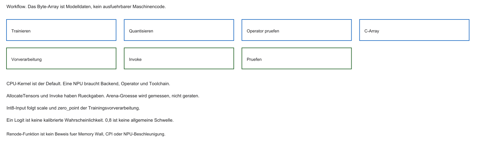

1. Trainieren (Cloud / Python)
2. Konvertieren → `.tflite`
3. Export als C-Byte-Array (`xxd` o. Ä.)
4. Linken in Flash (`.rodata`)
5. Firmware: `Invoke()` / Interpreter

::: notes
Laboridee: fertiges Modell als Hex-Array in die Firmware schweißen.
:::

## Quantisierung

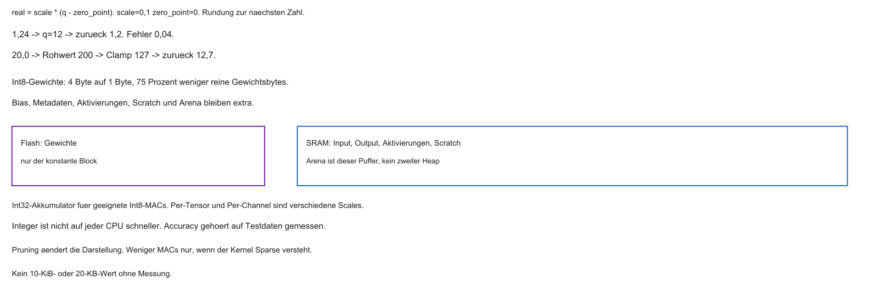

- Float32: 4 Byte/Gewicht, teuer ohne FPU
- Reine Float32-Gewichte werden als Int8 um 75 Prozent kleiner. Bias, Aktivierungen und Arena nicht automatisch
- Integer ist nicht auf jeder CPU schneller. Den Accuracy-Verlust messen, nicht annehmen

::: notes
Netze sind robust gegen Quantisierungsrauschen — oft akzeptabler Trade-off.
:::

## Pruning

- Viele Gewichte nahe null nach dem Training
- Pruning braucht eine sparsityfähige Darstellung und einen passenden Kernel
- Flash-Ersparnis und weniger ausgeführte MACs sind zwei verschiedene Folgen

::: notes
Tote Äste entfernen — näher an der Memory Wall vorbei. Oft im Trainingsgraphen, nicht im C-Compiler.
:::

## Laborausblick: KI-Schrittzähler

Geplant (Details im Übungsblatt):

- Kleines quantisiertes Modell ($< 20\,\mathrm{KB}$)
- Eingabe: 3-Achsen-Beschleunigung (Anknüpfung I2C, Block 5)
- Klassen Stehen, Gehen, Laufen sind eine Aktivitätserkennung, noch kein Schrittzähler
- Simulation: Renode mit virtuellen Sensordaten

::: notes
Pipeline: Sensor → TFLM → Klasse — Busse + Edge AI zusammen.
:::

## Modell als C-Array

```c
/* Platzhalter, kein gültiges Modell und keine Lizenzdatei. */
const unsigned char step_model_tflite[]
    __attribute__((aligned(4))) = {
    0x1c, 0x00, 0x00, 0x00, 0x54, 0x46, 0x4c, 0x33,
    /* … weitere Bytes … */
};
```

::: notes
Die Bytes sind Modelldaten. Kernel in der Firmware führen Operatoren aus. Flash-Lesen ist möglich, wenn Plattform und Kernel das erlauben.
:::

## Tensor Arena

```cpp
alignas(16) static uint8_t tensor_arena[1024];
/* 1024 Byte sind eine Lehrannahme, kein gemessenes Budget. */

static int setup_interpreter(void) {
    if (model == 0)
        return -1;
    if (model->version() != TFLITE_SCHEMA_VERSION)
        return -2;
    tflite::MicroInterpreter ip(
        model, resolver, tensor_arena, 1024);
    if (ip.AllocateTensors() != kTfLiteOk)
        return -3;
    return 0;
}
```

- Statischer SRAM-Block — keine Heap-Leaks
- Zu kleine Arena → klarer Fehler bei Allokation

::: notes
Sicherheit durch feste Grenzen statt stiller Stack-Korruption.
:::

## Inferenz-Zyklus

```cpp
static int run_window(void) {
    TfLiteTensor *in = interpreter.input(0);
    TfLiteTensor *out = interpreter.output(0);
    if (in == 0 || out == 0)
        return -4;
    if (in->type != kTfLiteInt8)
        return -5;
    if (in->bytes != (int)sizeof(sample))
        return -6;
    if (out->type != kTfLiteInt8 || out->bytes < 3)
        return -7;
    for (int i = 0; i < in->bytes; i++)
        in->data.int8[i] = quantize(sample[i], in);
    if (interpreter.Invoke() != kTfLiteOk)
        return -8;
    return out->data.int8[2]; /* Logit, keine Wahrscheinlichkeit */
}
```

- `sample` hat dieselbe Länge wie der bestätigte Int8-Input.
- Index 2 wird nur gelesen, wenn mindestens drei Ausgabebytes existieren.
- Es gibt im Repository kein gültiges Modell und keinen gepinnten TFLM-Commit.

::: notes
Weniger handgeschriebene Filter — schwarze Kiste mit Wahrscheinlichkeiten.
:::

## Renode: virtuelle Stimuli

- Wie Block 5: Muster in `.resc` / Sensor-Modell einspeisen
- Firmware liest I2C-Register, füttert TFLM
- Erwartung: Klassifikation in der Konsole

::: notes
Kreis: Emulation, Bus, Modell.
:::

## Erwartung: CPU ohne NPU

- Simulation oft RV32IM ohne RVV/NPU → `Invoke()` teuer
- Eine funktionale Simulation belegt weder die Memory Wall noch eine NPU-Beschleunigung
- Motiviert, warum SoCs NPUs neben die CPU setzen

::: notes
Absichtlich „falsche“ Architektur — Flaschenhals im Terminal erleben.
:::

## Zusammenfassung Block 8

- KI-Inferenz: Massen an MACs / Matrizen
- CPUs an der Memory Wall bei vorhersehbaren Loads
- DLP → RVV (hardware-agnostisch)
- Systolic Arrays / NPUs: lokale Datenweitergabe
- TFLM + Quantisierung: Modelle in MCU-Flash

::: notes
Edge AI verändert Silizium und Firmware-Workflow.
:::

## Ausblick und Abschluss

- Übungsblatt: TFLM / Renode-Schrittklassifikation
- Sensorpipeline aus Block 5 mit Inferenz verbinden

Vielen Dank — viel Erfolg beim Experimentieren.

::: notes
Quellen: RISC-V Vector 1.0, TPU-Paper Jouppi et al. 2017, TFLM und die Int8-Spezifikation von LiteRT. Im Repository liegen kein TFLM-Tree, kein trainiertes Modell und keine `.repl`.
:::

::: notes
Wenn das Array plötzlich „Gehen“ erkennt, schließt sich der Kreis von Bus bis NPU-Idee.
:::
