## Willkommen zum Finale!

- Neunte und letzte Vorlesung in Mikrocomputertechnik 3
- Weg: Speicherzelle → Caches → DMA → Busse → OoO → Edge AI
- Heute: Multi-Core — Thread-Level Parallelism auf dem SoC
- Praxis: Theorie zu MESI/Atomics, danach Wrap-Up und Klausurvorbereitung

::: notes
Der bisherige Weg hat Werte im Speicher, Bewegung über Caches und Busse, Entlastung durch DMA (Direct Memory Access) und Interrupts sowie begrenzte Instruktionsparallelität durch OoO (Out of Order) verbunden. Heute greifen mehrere Harts, also Hardware-Threads, auf gemeinsame Adressen zu. TLP (Thread-Level Parallelism) ist diese gleichzeitige Arbeit. MESI (Modified, Exclusive, Shared, Invalid) koordiniert Kopien, eine atomare RMW (Read-Modify-Write) macht ein zusammengesetztes Update unteilbar, Acquire/Release ordnet weitere Zugriffe. Ein zweiter Kern stellt trotz schneller Caches eine neue Frage, weil mehrere gültige Kopien und konkurrierende Updates koordiniert werden müssen. Als Nächstes trennt die Agenda diese drei Fragen. Zahlen und Zeitfolgen sind Lehrannahmen. Assembler und C sind Lehrcode und wurden nicht kompiliert oder auf kohärenter Hardware ausgeführt.
:::

## Agenda und Lernziele

1. Cache-Kohärenz und MESI (Bus Snooping)
2. Race Conditions und Hardware-Atomics (LR/SC, AMO)
3. Amdahls Gesetz und Semester-Rückblick / Klausurfokus

Lernziele:

- Kohärenzproblem und MESI-Zustände erklären
- Race Conditions auf Assembler-Ebene begründen
- Software-Locks vs. Hardware-Atomics unterscheiden
- Speedup-Grenzen mit Amdahl abschätzen
- Systemwissen der Blöcke 1–8 für die Klausur strukturieren

::: notes
Cache-Kohärenz betrifft die Beobachtung derselben Adresse. MESI ist das Zustandsmodell dafür, Snooping das Mithören fremder Transaktionen. Eine Race Condition ist ein zeitabhängiges Ergebnis. RMW, LR/SC (Load-Reserved/Store-Conditional) und AMO (Atomic Memory Operation) betreffen Unteilbarkeit. Amdahl begrenzt den Speedup, also die Beschleunigung gegenüber einem Kern. Drei Fragen am Zähler x: Welche Kopie gilt? Ist x++ unteilbar? Werden zugehörige Daten mit einem Flag sichtbar? Kohärenz allein beantwortet die zweite Frage nicht. Die Lernziele sind eine Zustandstabelle, ein Lost-Update-Ablauf, der SC-Status, ein Lock-/ISR-Ablauf und eine Amdahlrechnung. Das ist Orientierung im Kurs, keine neue Prüfungszusage. Danach knüpft der Rückblick an Daten- und Aufgabenparallelität an. Zahlen und Zeitfolgen sind Lehrannahmen. Assembler und C sind Lehrcode und wurden nicht kompiliert oder auf kohärenter Hardware ausgeführt.
:::

## Anknüpfung: Edge-AI-Labor

Kurz-Recap aus Block 8 (Vertiefung im Übungsblatt):

- TFLM-Inferenz auf dem RISC-V-Kern
- Matrix-Last blockiert die General-Purpose-CPU lange
- Eine funktionale Simulation hat keine Memory Wall gemessen
- TLP und DLP schließen sich nicht aus

::: notes
TFLM (TensorFlow Lite for Microcontrollers) und eine Renode-Plattform liegen hier nicht als ausgeführtes Labor vor. Die Memory Wall, also die Begrenzung durch Speicherbandbreite, wurde nicht gemessen. TLP verteilt Arbeit auf Threads, DLP (Data-Level Parallelism) bearbeitet viele Werte ähnlich, etwa mit SIMD oder RVV. Ein Thread kann selbst Vektoroperationen ausführen. Mehrere Kerne erhöhen die Speicherbandbreite nicht automatisch. Das Beispiel bleibt konzeptionell. Als Nächstes steht der Entwurfsanreiz für mehrere Kerne. Zahlen und Zeitfolgen sind Lehrannahmen. Assembler und C sind Lehrcode und wurden nicht kompiliert oder auf kohärenter Hardware ausgeführt.
:::

## Erinnerung: Taktraten-Mauer

- Warum Multicore? Power Wall (Block 7)
- Höherer Takt → stark steigende Verlustleistung und Kühlbedarf
- Besonders kritisch bei Mobile/Embedded
- Ausweg: mehr Kerne statt immer höherer GHz

::: notes
Die Power Wall bezeichnet den Leistungsanstieg bei höherer Frequenz. Unter konkreten Bedingungen gilt näherungsweise P_dyn ungefähr alpha mal C mal V zum Quadrat mal f: Aktivitätsfaktor, Kapazität, Spannung, Frequenz. Leakage und Kühlung kommen hinzu. Mehr Kerne sind kein kostenloser Ersatz und keine Pflicht für jede MCU (Microcontroller Unit). Ein zweiter Kern spart nicht automatisch Energie, weil Aktivität, Kommunikation und ungenutzte Ressourcen in der Bilanz bleiben. Als Nächstes wird TLP als Arbeitsform definiert. Zahlen und Zeitfolgen sind Lehrannahmen. Assembler und C sind Lehrcode und wurden nicht kompiliert oder auf kohärenter Hardware ausgeführt.
:::

## Multi-Core: Thread-Level Parallelism

- Zwei (oder mehr) Kerne auf einem Chip statt „doppelt so schneller“ Einzelkern
- TLP: unabhängige Threads/Tasks parallel
- Beispiel: UI/Media auf Kern 0, Hintergrundarbeit auf Kern 1
- Mehr Kerne sparen nicht stets Energie und beschleunigen einen einzelnen Thread nicht

::: notes
Ein Softwarethread ist ein Ablauf, eine Task die schedulbare Einheit, ein Hart der Hardware-Thread, der Kern das Rechenwerk. Im Lehrmodell hat jeder Kern einen Hart. UI (User Interface) und Hintergrundarbeit sind Beispiele, keine feste Affinity, also keine erzwungene Kernbindung. Zwei Threads laufen nur gleichzeitig, wenn Scheduler, freie Harts und Abhängigkeiten das erlauben. Mehr Kerne beschleunigen einen einzelnen Thread nicht. Gemeinsame Daten brauchen Synchronisation. Als Nächstes beschreibt SMP eine mögliche Organisation. Zahlen und Zeitfolgen sind Lehrannahmen. Assembler und C sind Lehrcode und wurden nicht kompiliert oder auf kohärenter Hardware ausgeführt.
:::

## Symmetric Multiprocessing (SMP)

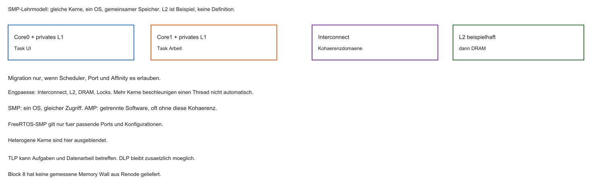

- Lehr-SMP: gleiche Kerne, ein Betriebssystem, gemeinsamer Speicherzugriff
- Private L1 und ein geteiltes L2 sind ein Beispiel, keine Definition
- Migration hängt von Scheduler, Port und Affinity ab. Nicht jedes FreeRTOS ist SMP
- AMP und heterogene Kerne bleiben abgegrenzt

::: notes
SMP (Symmetric Multiprocessing) bedeutet im Lehrmodell ein Betriebssystem und gleichberechtigten Zugriff auf gemeinsamen Speicher. AMP (Asymmetric Multiprocessing) organisiert Software und Ownership getrennt. Private L1-Caches und ein geteiltes L2 sind ein Beispiel, keine Definition. Migration, also das Verlagern einer Task, braucht Scheduler, Port und Affinity. Nicht jedes FreeRTOS kann SMP. Ein gemeinsames L2 definiert SMP nicht. Als Nächstes zeigt das Schema die Speicherpfade. Zahlen und Zeitfolgen sind Lehrannahmen. Assembler und C sind Lehrcode und wurden nicht kompiliert oder auf kohärenter Hardware ausgeführt.
:::

## Architektur eines SMP-SoC

- Pro Kern: privater L1 (I und D)
- Geteilt: oft L2 und DRAM (Shared Memory)

```{mermaid}
%%| fig-width: 3.6
%%{init: {'theme': 'base', 'themeVariables': {'background': '#FFFFFF', 'primaryColor': '#FFFFFF', 'primaryBorderColor': '#E5E5EA', 'primaryTextColor': '#1D1D1F', 'lineColor': '#86868B', 'secondaryColor': '#F5F5F7', 'tertiaryColor': '#FFFFFF', 'mainBkg': '#FFFFFF', 'nodeBorder': '#E5E5EA', 'clusterBkg': '#F5F5F7', 'clusterBorder': '#E5E5EA', 'titleColor': '#1D1D1F', 'edgeLabelBackground': '#FFFFFF'}}}%%
flowchart TD
  C0[Core 0] <--> L10[L1 Cache 0]
  C1[Core 1] <--> L11[L1 Cache 1]
  L10 <--> L2[Shared L2]
  L11 <--> L2
  L2 <--> RAM[(DRAM)]
  DMA[DMA, Vertrag offen] -.-> L2
  style L2 fill:#FFFFFF,stroke:#E2001A,stroke-width:2px !important
```

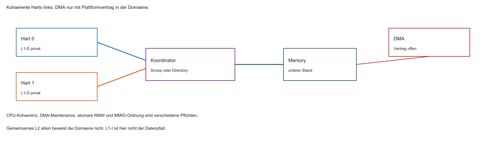

::: notes
L1-I hält Befehle, L1-D Daten. Die folgenden Beispiele betreffen Datenlines. Der Interconnect transportiert Anfragen und Datenantworten. Geteiltes L2 und DRAM sind gewählte Ebenen, keine Pflicht jeder MCU. Ein DMA-Gerät gehört nicht automatisch zur Kohärenzdomäne. CPU-Kohärenz, DMA-Maintenance, atomare RMW und MMIO-Ordnung (Memory-Mapped Input/Output) sind verschiedene Pflichten. Als Nächstes erzeugt Write-Back eine neue gültige Kopie bei möglicherweise altem unterem Stand. Zahlen und Zeitfolgen sind Lehrannahmen. Assembler und C sind Lehrcode und wurden nicht kompiliert oder auf kohärenter Hardware ausgeführt.
:::

## Die Leitfrage des Tages

- Write-Back (Block 2): Writes oft nur im privaten L1 — RAM kann veraltet sein
- Core 0 schreibt `score = 10` in seinen L1
- Core 1 will `score` lesen
- Woher kommt der aktuelle Wert, wenn Core 0 eine Modified-Line hält und der untere Stand noch alt ist?

::: notes
Write-Back schreibt den neuen Wert zuerst in die private Line. Dirty bedeutet verändert gegenüber dem unteren Stand. Owner ist die berechtigte exklusive Kopie, kein Software-Mutex. Eine M-Line mit 5 bei RAM 0 ist im Modell korrekt, solange ein kohärenter Read den Owner fragt und nicht blind den alten Stand verwendet. Ein alter RAM-Wert ist also kein Fehler, wenn das Protokoll den aktuellen Wert liefert. Unkoordiniertes cachebares Sharing ist das Problem. Non-cacheable Speicher und Ownership bleiben Alternativen. Als Nächstes werden die drei Fragen getrennt. Zahlen und Zeitfolgen sind Lehrannahmen. Assembler und C sind Lehrcode und wurden nicht kompiliert oder auf kohärenter Hardware ausgeführt.
:::

## Kohärenzverlust (Stale Data)

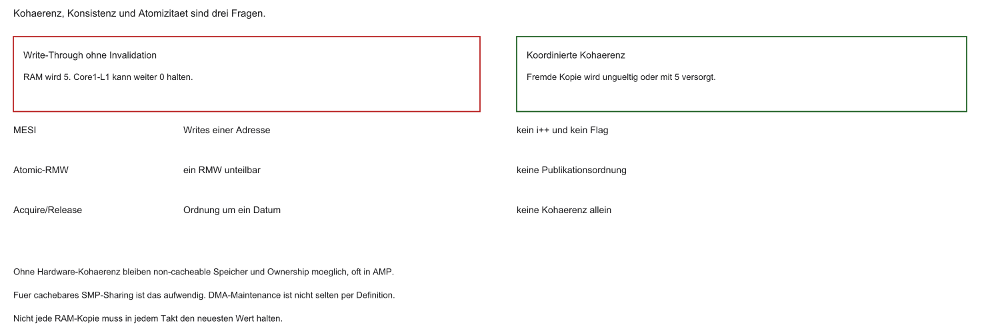

- Private Write-Back-Caches können unterschiedliche Sichten auf dieselbe Adresse erzeugen
- Kohärenz (pro Adresse): alle Kerne sehen eine einheitliche Reihenfolge der Writes
- Kohärenz ordnet Writes einer Adresse. Sie macht weder `i++` atomar noch ein Daten-plus-Flag korrekt
- Non-cacheable Speicher und Ownership bleiben möglich, besonders in AMP

::: notes
Stale Data ist eine veraltete, aber noch als gültig benutzte Kopie. Write-Through ohne Invalidation kann den RAM auf 5 setzen und eine fremde Cachekopie bei 0 lassen. Beim Lost Update sehen zwei Harts die 0, rechnen je 1 und schreiben 1. Ein atomarer Flagstore macht nur den Flag unteilbar. Ohne passende Ordnung kann die Payload fehlen. Kohärenz, Atomizität und Konsistenz über mehrere Zugriffe sind verschiedene Fragen. Das Hardwarebild ist Motivation, keine Ergebnisliste eines C-Data-Race. Als Nächstes reicht Cachemaintenance nicht als Ersatz. Zahlen und Zeitfolgen sind Lehrannahmen. Assembler und C sind Lehrcode und wurden nicht kompiliert oder auf kohärenter Hardware ausgeführt.
:::

## Warum Software-Flush scheitert

- Für cachebares SMP-Sharing ist manuelles Spülen nach jedem Write unpraktikabel
- DMA-Maintenance ist nicht per Definition selten
- Hardware-Kohärenz kann für die Anwendung unsichtbar sein und kostet trotzdem Traffic

::: notes
Clean schreibt dirty Daten nach unten. Invalidate entzieht die lokale Gültigkeit. Write-Through aktualisiert den unteren Stand und invalidiert allein keine fremde Kopie. DMA-Maintenance kann häufig sein und braucht Ownership sowie einen Plattformvertrag. Hardwarekohärenz automatisiert bestimmte Kopienarbeit und kostet Traffic. Clean einer Line ersetzt nicht die atomare Übernahme eines Schlosses. Als Nächstes erkennt Snooping fremde Transaktionen. Zahlen und Zeitfolgen sind Lehrannahmen. Assembler und C sind Lehrcode und wurden nicht kompiliert oder auf kohärenter Hardware ausgeführt.
:::

## Bus Snooping

- Klassisch: Cache-Controller lauschen am gemeinsamen Bus/Interconnect
- Fremder Zugriff auf lokal Modified → eingreifen (Daten liefern / Invalidate)
- Große Systeme oft directory-basiert statt reinem Broadcast-Snoop

::: notes
Bus Snooping bedeutet, dass Cache-Controller relevante Transaktionen ihrer Lineadresse prüfen. Ein Fremdread auf M braucht aktuelle Daten. Ein Fremdwrite braucht Übergabe oder Invalidierung, nicht dieselbe Reaktion. Broadcast ist das vereinfachte Modell. Ein Directory merkt sich Kopien oder Owner und leitet gezielter weiter. Jede fremde Lesetransaktion muss die lokale Line nicht invalidieren. Im klassischen Fremdread kann sie nach S wechseln. Als Nächstes benennt MESI die stabilen Rechte. Zahlen und Zeitfolgen sind Lehrannahmen. Assembler und C sind Lehrcode und wurden nicht kompiliert oder auf kohärenter Hardware ausgeführt.
:::

## MESI-Protokoll

- Zustandsautomat je Cache-Line. 64 Byte sind hier nur ein Beispiel
- Zustände: Modified (M), Exclusive (E), Shared (S), Invalid (I)
- Basis vieler kohärenter Multicore-Designs (Varianten: MOESI, …)

::: notes
M ist dirty und allein gültig, E clean und allein gültig, S clean und teilbar, I lokal nicht nutzbar. Der Zustand gilt für die ganze Cacheline. 64 Byte sind eine Lehrannahme. MOESI ergänzt Owned. Dieses Modell verwendet kein dirty Shared. Transiente Zwischenzustände sind ausgeblendet. Eine Line kann mehrere Variablen enthalten, die dann dieselbe Ownership teilen. Die Klausurorientierung ist die des Kurses, keine neue Festlegung. Als Nächstes verbindet der Automat Rechte und Ereignisse. Zahlen und Zeitfolgen sind Lehrannahmen. Assembler und C sind Lehrcode und wurden nicht kompiliert oder auf kohärenter Hardware ausgeführt.
:::

## MESI: Zustandsübersicht

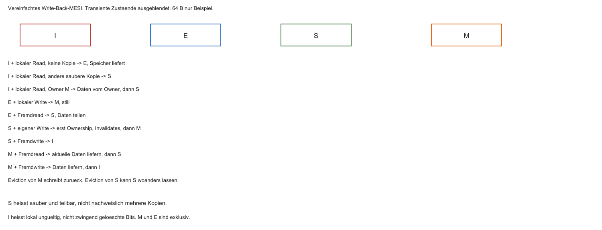

```{mermaid}
%%| fig-width: 4.2
%%{init: {'theme': 'base', 'themeVariables': {'background': '#FFFFFF', 'primaryColor': '#FFFFFF', 'primaryBorderColor': '#E5E5EA', 'primaryTextColor': '#1D1D1F', 'lineColor': '#86868B', 'secondaryColor': '#F5F5F7', 'tertiaryColor': '#FFFFFF', 'mainBkg': '#FFFFFF', 'nodeBorder': '#E5E5EA', 'clusterBkg': '#F5F5F7', 'clusterBorder': '#E5E5EA', 'titleColor': '#1D1D1F', 'edgeLabelBackground': '#FFFFFF'}}}%%
stateDiagram-v2
  [*] --> I
  I --> E: Read Miss (allein)
  I --> S: Read Miss (geteilt)
  E --> S: Fremd-Read
  E --> M: lokaler Write
  S --> M: Write + Invalidate
  S --> I: Invalidate empfangen
  M --> S: Fremd-Read (Intervention)
  M --> I: Fremd-Ownership, Daten uebergeben
```

::: notes
Lokale Ereignisse und fremde Transaktionen sind getrennt. I plus lokaler Read wird E, wenn keine andere Kopie existiert, sonst S. Ein lokaler Write auf E wird still M. S wird M erst nach Ownership und Bestätigungen. E wird bei einem Fremdread zu S. M liefert bei einem Fremdread aktuelle Daten und wird S. Ein fremder Ownershiprequest kann E, S oder M nach I bringen. Bei dirty M müssen die Daten übergeben werden. Eine überlebende S-Kopie kann S bleiben, weil der Controller nicht sicher weiß, dass alle anderen verworfen wurden. Flush ohne Definition ist hier kein eigener Übergang. Als Nächstes steht M für sich. Zahlen und Zeitfolgen sind Lehrannahmen. Assembler und C sind Lehrcode und wurden nicht kompiliert oder auf kohärenter Hardware ausgeführt.
:::

## Zustand M (Modified)

- Line lokal geändert. Der untere Stand kann noch alt sein
- Exklusiv: kein anderer gültiger Besitzer im Modell
- Klassischer Write-Back-„Boss“-Zustand

::: notes
M bedeutet gültig, verändert und exklusiv. Andere gültige Kopien sind ausgeschlossen. Alte Bits in I dürfen existieren, sind aber kein Hit. Der untere Stand kann 0 sein, während die Line 5 hält. Lokale Reads und Writes treffen die eigene Line. Ein Fremdread braucht die aktuellen Daten. M ist kein vom Programm gehaltenes Lock. Als Nächstes ist E exklusiv, aber noch clean. Zahlen und Zeitfolgen sind Lehrannahmen. Assembler und C sind Lehrcode und wurden nicht kompiliert oder auf kohärenter Hardware ausgeführt.
:::

## Zustand E (Exclusive)

- Sauber: Übereinstimmung mit dem kohärenten unteren Stand
- Exklusiv: niemand sonst hat die Line
- Write → oft still zu M, ohne Broadcast

::: notes
E stimmt mit dem kohärenten unteren Stand überein und ist allein gültig. Ein lokaler Write darf still nach M gehen, weil keine fremde gültige Kopie invalidiert werden muss. Clean meint diese Ebene, nicht jeden DRAM-Takt. Ein Fremdread führt nach S. Ein fremder Ownershiprequest kann E invalidieren. E ist eine Optimierung dieses Modells. Als Nächstes fehlt bei S das exklusive Schreibrecht. Zahlen und Zeitfolgen sind Lehrannahmen. Assembler und C sind Lehrcode und wurden nicht kompiliert oder auf kohärenter Hardware ausgeführt.
:::

## Zustand S (Shared)

- Sauber und teilbar. Es müssen nicht nachweislich mehrere Kopien existieren
- Gut für paralleles Lesen
- Vor lokalem Write: andere Kopien invalidieren

::: notes
S erlaubt Lesen. Eine oder mehrere gültige Kopien können bestehen und müssen im stabilen Modell dieselben Daten halten. Vor einem Write übernimmt der Schreiber Ownership und wartet auf Invalidates und Bestätigungen. Core 0 darf seine S-Line nicht heimlich ändern, auch wenn Core 1 gerade nichts tut. S ist kein dauerhafter Nur-Lese-Status des Programms. Als Nächstes darf I nicht als Hit dienen. Zahlen und Zeitfolgen sind Lehrannahmen. Assembler und C sind Lehrcode und wurden nicht kompiliert oder auf kohärenter Hardware ausgeführt.
:::

## Zustand I (Invalid)

- Nach Reset oder Invalidate
- Lokal ungültig. Die Bits müssen nicht gelöscht sein. Ein Hit auf I ist verboten
- Daten müssen neu geholt werden

::: notes
I ist lokale Ungültigkeit, nicht zwingend das Löschen der Bits. Reset, Eviction oder Invalidate können dorthin führen. Ein Read braucht einen neuen Datenpfad, ein Write einen Ownershippfad. Eine noch sichtbare 0 in einer I-Line darf nicht gelesen werden, weil der aktuelle Wert beim Owner liegen kann. Als Nächstes entscheidet der Read-Miss über Lieferant und neuen Zustand. Zahlen und Zeitfolgen sind Lehrannahmen. Assembler und C sind Lehrcode und wurden nicht kompiliert oder auf kohärenter Hardware ausgeführt.
:::

## MESI: Read-Miss

Core 0 liest `x`, lokal I:

- Request auf dem Interconnect
- Niemand hat `x` → Memory liefert, Core 0 oft → E
- Anderer Kern hat `x` sauber (E/S) → beide → S
- Anderer Kern hat `x` Modified → der Owner liefert (Write-Back/Intervention), Zustände typisch → S

::: notes
Beim Read-Miss gibt es drei Fälle. Keine andere Kopie: der untere Stand liefert, der Leser wird E. Eine saubere andere Kopie: beide werden S. Ein dirty Owner M: der aktuelle Wert kommt vom Owner, der untere Stand wird im vereinfachten Modell aktualisiert, beide werden S. Existiert M:5 bei RAM 0, darf die alte RAM-Antwort nicht ungeprüft gelten. Das ist keine Zyklengarantie und keine Pflicht, dass jeder reale DRAM-Chip sofort 5 enthält. Als Nächstes fordert ein Write auf Shared exklusives Recht. Zahlen und Zeitfolgen sind Lehrannahmen. Assembler und C sind Lehrcode und wurden nicht kompiliert oder auf kohärenter Hardware ausgeführt.
:::

## MESI: Write auf Shared


- Core 0 und 1: `x` in S
- Core 0: `x = 5`
- Erst Ownership und die nötigen Invalidates abschließen
- Danach im Modell schreiben und nach M gehen. Der Broadcast allein ist nicht der Abschluss

::: notes
Start ist S:0 und S:0. Core 0 fordert Ownership für den Write 5. Core 1 invalidiert. Erst nach der nötigen Bestätigung ist der stabile Abschluss M:5 und I. Der gesendete Invalidatebroadcast allein genügt nicht. Der untere Stand bleibt in diesem Write-Back-Schritt 0. Spekulative Puffer sind ausgeblendet. Als Nächstes verliert der andere Kern die Leseberechtigung. Zahlen und Zeitfolgen sind Lehrannahmen. Assembler und C sind Lehrcode und wurden nicht kompiliert oder auf kohärenter Hardware ausgeführt.
:::

## Reaktion: Invalidate

- Core 1 sieht Invalidate für `x` → lokal I
- Späteres Lesen → Miss → frische Kopie (Wert 5) von Core 0 / Memory-Pfad

::: notes
Invalidate ist eine Kohärenzaktion, keine Speicherordnung. Core 1 verwirft die Gültigkeit der alten x-Line, nicht zwingend die Bits. Der spätere Read ist ein Miss und erhält im Beispiel 5. Eine Fence und ein Invalidate haben verschiedene Aufgaben. Invalidate löscht nicht zwingend die alten Datenbytes. Als Nächstes steht die ganze Folge mit Werten. Zahlen und Zeitfolgen sind Lehrannahmen. Assembler und C sind Lehrcode und wurden nicht kompiliert oder auf kohärenter Hardware ausgeführt.
:::

## MESI-Beispiel: Zustandsfolge


Zwei Kerne, Variable `x`, Start beide Invalid:

| Schritt | Aktion | Core 0 | Core 1 |
|---------|--------|--------|--------|
| 1 | Core 0 liest `x` | E | I |
| 2 | Core 1 liest `x` | S | S |
| 3 | Core 0 schreibt `x=5` | M | I |
| 4 | Core 1 liest `x` | S | S |

- Nach dem Write kann der RAM noch 0 enthalten, während Core0 M den Wert 5 hält
- Der folgende Read erhält 5. Beide Lines werden S, der untere Stand wird 5

::: notes
Start beide I, RAM 0. Core 0 liest: E:0, I, RAM 0. Core 1 liest: S:0, S:0, RAM 0. Core 0 schreibt 5: M:5, I, RAM 0. Core 1 liest: S:5, S:5, RAM 5. Nach dem Write kann der RAM noch 0 sein, während Core 0 gültig 5 hält. Höchstens eine exklusive gültige Kopie, S-Werte gleich, I kein Hit. Die letzte 5 im RAM gilt nur für dieses vereinfachte Write-Back-Modell. Als Nächstes kostet die Koordination Verkehr. Zahlen und Zeitfolgen sind Lehrannahmen. Assembler und C sind Lehrcode und wurden nicht kompiliert oder auf kohärenter Hardware ausgeführt.
:::

## Overhead von MESI

- Preis: Kohärenz-Traffic (Invalidate, Snoop)
- Viele Kerne + häufige Shared-Writes → Interconnect belastet
- Große Server: Ringe/Meshes statt einfachem Broadcast-Bus

::: notes
Request, Datenantwort und Bestätigung sind mögliche Verkehrsarten. Ring und Mesh sind Topologien, Directory und Broadcast Organisationsformen. Ein Kern, der M schon besitzt, muss nicht bei jedem lokalen Write neu broadcasten. Die Kernzahl allein bestimmt den Aufwand nicht. Zugriffsmuster, Ownershipwechsel und Datenmenge entscheiden mit. Als Nächstes entsteht Aufwand sogar bei verschiedenen Variablen. Zahlen und Zeitfolgen sind Lehrannahmen. Assembler und C sind Lehrcode und wurden nicht kompiliert oder auf kohärenter Hardware ausgeführt.
:::

## False Sharing

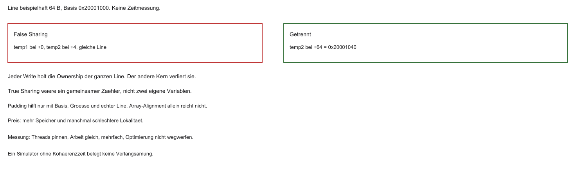

- Core 0: `temp1`, Core 1: `temp2` — logisch unabhängig
- Liegen in derselben Cache-Line → Write invalidiert den Partner
- Ping-Pong trotz verschiedener Variablen
- Padding trennt nur bei passender Basis, Objektgröße und echter Line

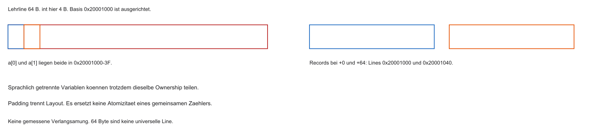
- Es kostet Speicher und kann die Lokalität verschlechtern. Ein Simulator ohne Kohärenzzeit misst das nicht

::: notes
False Sharing heißt, logisch unabhängige Variablen teilen eine Line. True Sharing ist eine gemeinsam bearbeitete Variable. Basis 0x20001000, Line 64 Byte, int 4 Byte: Offsets 0 und 4 liegen in 0x20001000 bis 0x2000103F. Offset 64 liegt bei 0x20001040. Wechselnde Writes holen die Ownership der ganzen Line. Ein Write des bereits besitzenden M-Kerns erzeugt nicht jedes Mal Ping-Pong. Padding kostet Platz und kann Lokalität verschlechtern. Es repariert keinen Data Race eines gemeinsamen Zählers. Eine Ausrichtung nur der Arraybasis genügt bei Abstand 4 nicht. Keine gemessene Verlangsamung. Als Nächstes prüft die Aufgabe den Wertpfad. Zahlen und Zeitfolgen sind Lehrannahmen. Assembler und C sind Lehrcode und wurden nicht kompiliert oder auf kohärenter Hardware ausgeführt.
:::

## Aufgabe — MESI-Zeile

Core0 hat nach seinem Write den Zustand M und den Wert 5. Welchen Wert hat der RAM in diesem Modell noch, und was sieht Core1 beim folgenden Read?

::: notes
Vor dem Folge-Read hält Core 0 M:5, Core 1 ist I, der RAM kann 0 sein. Core 1 liest und erhält 5 über den Ownerpfad. Danach sind beide S:5, und der untere Stand wird in diesem Modell 5. Eine gültige 0 bei Core 1 nach dem abgeschlossenen Read wäre unzulässig. S bedeutet nicht, dass vorher mehrere Kopien nachgewiesen wurden. In einer echten Mehrstufenhierarchie kann die saubere Ebene ein L2 sein. Das ist keine DRAM-Pflicht. Als Nächstes kann ein zusammengesetztes Update trotzdem verloren gehen. Zahlen und Zeitfolgen sind Lehrannahmen. Assembler und C sind Lehrcode und wurden nicht kompiliert oder auf kohärenter Hardware ausgeführt.
:::

## Software: gemeinsamer Zähler

- MESI: Caches *kohärent* (pro Adresse)
- Semantik von `zaehler++` (RMW) ist MESI egal
- Beide Kerne: `zaehler++` auf globalem `int` — Erwartung: $+2$

::: notes
Der Zähler startet bei 0. Zwei Inkremente sollen 2 ergeben. Ein normales C-int mit konkurrierendem i++ ist ein Data Race. Unter C11 (Sprachstandard 2011) ist das undefiniertes Verhalten, keine zugesicherte Ergebnisliste. MESI ordnet Einzelwrites und hat keinen Vertrag für die Gruppe Load, Add, Store. Im Hardwarebild können beide aus 0 die 1 berechnen. Der Endwert 1 ist dann möglich. Ein atomarer Zähler schützt nicht beliebige andere Daten. Ein _Atomic-Integer hat für den Inkrementzugriff selbst andere Semantik. Als Nächstes zerlegt der Assembler das nichtatomare Update. Zahlen und Zeitfolgen sind Lehrannahmen. Assembler und C sind Lehrcode und wurden nicht kompiliert oder auf kohärenter Hardware ausgeführt.
:::

## Anatomie von `i++`

Eine Quelltextoperation, keine Atomizität. Das typische RMW lautet:

```asm
lw   t0, 0(s1)   # Read
addi t0, t0, 1   # Modify
sw   t0, 0(s1)   # Write
```

- Drei Schritte — können sich zwischen Kernen überlappen

::: notes
Der Ausschnitt ist RV32I-Lehrcode, nicht ein Compileroutput. s1 zeigt auf ein gültiges, vier-Byte-ausgerichtetes Wort. lw lädt nach t0, addi erhöht nur das Register, sw schreibt zurück. Zwischen lw und sw kann der andere Hart dieselbe alte 0 gelesen haben. MESI schützt diese lokale Rechnung nicht. Für ein nichtatomares int bleibt das in C ein Data Race. Bei einem passenden _Atomic-Integer ist der C11-Inkrementzugriff selbst atomar. Eine einzelne Instruktion ohne Atomizitätsvertrag beweist das umgekehrt nicht. Als Nächstes zeigt ein Interleaving den verlorenen Beitrag. Zahlen und Zeitfolgen sind Lehrannahmen. Assembler und C sind Lehrcode und wurden nicht kompiliert oder auf kohärenter Hardware ausgeführt.
:::

## Race Condition


1. Core 0 liest 0
2. Core 1 liest 0 (Shared)
3. Core 0 schreibt 1
4. Core 1 schreibt ebenfalls 1 (seine lokale Rechnung)

Im Hardwarebild endet der Speicher bei 1. Das ist keine garantierte Semantik des fehlerhaften C-Programms.

::: notes
Hart 0 liest 0, Hart 1 liest 0, beide addieren lokal 1, beide speichern 1. Der gemeinsame Wert endet bei 1, weil beide Stores dieselbe berechnete 1 enthalten. Die Reihenfolge der Stores rettet das verlorene Inkrement nicht. Zwei atomare RMW ab 0 liefern alte Werte 0 und 1 und enden bei 2. Race Condition ist der weitere Timingbegriff. Data Race ist der Sprachbegriff. Das Bild ist kein ausgeführtes C-Programm. Als Nächstes soll ein Schloss den Abschnitt ausschließen. Zahlen und Zeitfolgen sind Lehrannahmen. Assembler und C sind Lehrcode und wurden nicht kompiliert oder auf kohärenter Hardware ausgeführt.
:::

## Naive Software-Locks

```c
/* Absichtlich falsch. volatile wuerde den Spin nicht zur atomaren Uebernahme machen. */
while (lock == 1) { }
lock = 1;
zaehler++;
lock = 0;
```

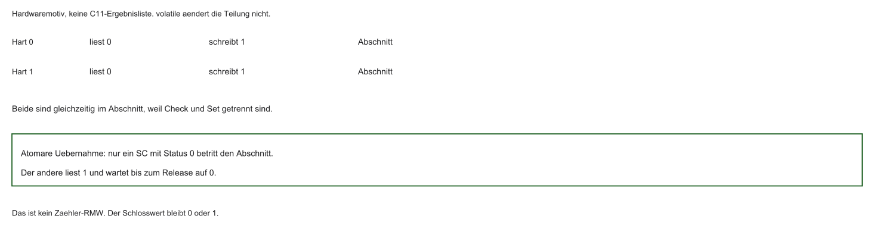

Idee: Mutual Exclusion — aber Check und Set sind getrennt.

::: notes
Der C-Ausschnitt ist absichtlich falsch. Check und Set sind getrennt. volatile betrifft gekennzeichnete Zugriffe nach Compilervertrag. Es stoppt nicht jede Optimierung, macht die Gruppe nicht atomar und ordnet keine Payload. Ein volatile int lock ist keine korrekte Reparatur. Im Hardwaremotiv können beide 0 sehen, 1 schreiben und gleichzeitig eintreten. Das ist keine definierte C11-Ergebnisliste. Als Nächstes wird die fehlende Eigenschaft benannt. Zahlen und Zeitfolgen sind Lehrannahmen. Assembler und C sind Lehrcode und wurden nicht kompiliert oder auf kohärenter Hardware ausgeführt.
:::

## Warum diese Check-then-Set-Schleife scheitert

- Prüfen und Setzen sind zwei Operationen. `volatile` ändert das nicht
- Beide können frei sehen und eintreten
- Korrekte Software-Locks nutzen atomare Primitive und Ordnung, sie sind nicht unmöglich

::: notes
Unteilbar entschieden werden muss, ob das Schloss frei ist und wer es übernimmt. Korrekte Locks kombinieren zugesicherte Primitive mit Ordnung. Peterson und ähnliche Verfahren brauchen Atomic-, Ordering- und Teilnehmerbedingungen. Sie sind kein naiver Ersatz aus gewöhnlichen C-Loads. In einer ISR (Interrupt Service Routine) kommen weitere Fortschrittsbedingungen hinzu. Als Nächstes stellt RISC-V Instruktionsfamilien bereit, wenn Kern und Region sie unterstützen. Zahlen und Zeitfolgen sind Lehrannahmen. Assembler und C sind Lehrcode und wurden nicht kompiliert oder auf kohärenter Hardware ausgeführt.
:::

## RISC-V A-Extension

- A oder Zalrsc/Zaamo, ausgerichtet, nur in unterstützten Regionen
- LR/SC und AMO gelten für eine Adresse in ihrer Domäne, nicht für den ganzen Bus
- DMA gehört nur dazu, wenn die Reservationsdomäne das festlegt. Ohne A-Erweiterung ist ein korrektes System nicht unmöglich, es braucht dann andere zugesicherte Primitive

::: notes
Die A-Erweiterung der Unprivileged ISA 20240411 enthält LR/SC und AMO. Zalrsc und Zaamo sind Teilmengennamen, keine Register. Nicht jeder Kern unterstützt sie. Für .w gelten hier vier Byte Ausrichtung und eine unterstützte gewöhnliche Speicherregion. AMO ist kein globaler Bus-Lock. Ohne A kann ein System andere zugesicherte Primitive nutzen. Beobachtete Gerätewrites auf die vom LR gelesenen Bytes dürfen den SC nicht ignorieren. Andere Bytes einer größeren Reservation und nichtkohärente Geräte haben eigene Verträge. Die Erweiterung allein genügt nicht für jedes MMIO-Register. Als Nächstes trennt LR das Lesen von der späteren bedingten Speicherung. Zahlen und Zeitfolgen sind Lehrannahmen. Assembler und C sind Lehrcode und wurden nicht kompiliert oder auf kohärenter Hardware ausgeführt.
:::

## LR/SC

- `lr.w` liest und setzt eine Reservation auf eine implementierungsabhängige Granule
- `sc.w` schreibt bei Erfolg und liefert 0. Bei Fehlschlag kein Store und ein Wert ungleich 0
- Die Reservation ist kein gehaltenes Mutex

::: notes
lr.w liest den Wert und setzt eine Reservation auf eine implementierungsabhängige Granule. Das ist kein Mutex und kein 64-Byte-Lock. sc.w schreibt nur bei Erfolg und liefert im Zielregister 0. Bei Fehlschlag gibt es keinen Datenstore und einen Status ungleich 0, nicht nur die Zahl 1. Danach ist die eigene Reservation beendet. Mehrere Harts dürfen gleichzeitig 0 lesen. Ein Fehlschlag beweist keinen fremden Write. Die gelesene 0 ist nicht der spätere Erfolgscode. Als Nächstes vollendet ein erfolgreicher SC die Übernahme. Zahlen und Zeitfolgen sind Lehrannahmen. Assembler und C sind Lehrcode und wurden nicht kompiliert oder auf kohärenter Hardware ausgeführt.
:::

## LR/SC: Erfolg

- Core 0: `lr.w` → frei → `sc.w` erfolgreich
- Lock exklusiv übernommen

::: notes
Das Schloss ist 0. LR liest 0. Bleibt die Reservation gültig, schreibt SC die 1 und liefert Status 0. Erst danach beginnt der kritische Abschnitt. Die Reservation ist beendet. Das Schloss bleibt 1 bis zum Release. Ein anderer Hart, der 1 liest, darf nicht auf 2 inkrementieren. Neben der Atomizität braucht der geschützte Datenzugriff eine passende Acquire-Ordnung. Es gibt keine Zeitzahl und keinen garantierten ersten Erfolg. Der Code erkennt die Übernahme am Status 0. Als Nächstes führen zwei gelesene Nullen nicht zu zwei Erfolgen. Zahlen und Zeitfolgen sind Lehrannahmen. Assembler und C sind Lehrcode und wurden nicht kompiliert oder auf kohärenter Hardware ausgeführt.
:::

## LR/SC: Fehlschlag

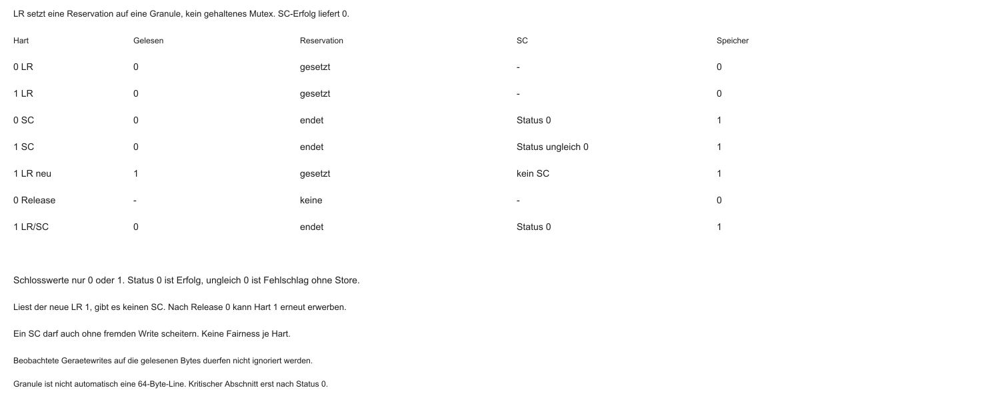

- Beide: `lr.w` nahezu gleichzeitig
- Core 0: `sc.w` ok
- Core 1: `sc.w` scheitert (Reservation gebrochen / Kohärenz)
- Software von Core 1 wiederholt die Schleife

::: notes
Beide LR lesen 0. Hart 0 schreibt mit SC die 1 und Status 0. Hart 1 scheitert mit Status ungleich 0, der Speicher bleibt 1. Ein neuer LR von Hart 1 liest 1, verzweigt als belegt und führt keinen SC aus. Nach dem Release auf 0 kann Hart 1 erneut LR 0 und SC 1 mit Status 0 ausführen. Werte bleiben 0 oder 1. Ein Retry, der 2 speichert, wäre ein Zähler, nicht dieses Schloss. Kein Hart hat eine Fairnessgarantie. Liest der neue LR 1, wird der Abschnitt nicht betreten. Als Nächstes zeigt der Assembler die drei Phasen. Zahlen und Zeitfolgen sind Lehrannahmen. Assembler und C sind Lehrcode und wurden nicht kompiliert oder auf kohärenter Hardware ausgeführt.
:::

## LR/SC: Spinlock in Assembler


```asm
acquire:
  lr.w.aq t0, (a0)
  bnez    t0, acquire
  li      t1, 1
  sc.w    t2, t1, (a0)
  bnez    t2, acquire
  # kritischer Abschnitt: geschuetzte Daten, Lehrcode
release:
  fence rw, w
  sw    zero, 0(a0)
```

- Erfolg von `sc.w` ist 0. Die Sequenz ist Lehrannahme für gewöhnlichen Speicher und hier nicht assembliert
- Im kritischen Abschnitt nicht schlafen und keine blockierende Arbeit ausführen

::: notes
a0 ist die Lockadresse, t0 der gelesene Wert, t1 die Konstante 1, t2 der SC-Status. lr.w.aq liest mit Acquire: nachfolgende Memoryzugriffe werden nicht vor diesem Zugriff beobachtet. bnez auf t0 wartet, wenn das Schloss belegt ist. sc.w versucht die 1. bnez auf t2 wiederholt bei Fehlschlag. Der Kommentar dazwischen ist der kritische Abschnitt. fence rw,w ordnet vorherige Reads und Writes vor nachfolgenden Writes, insbesondere vor sw zero. Das ist kein Cacheflush. Alle Zugreifer brauchen denselben Vertrag für gewöhnlichen Speicher. Als Inline-Assembler in C fehlt hier noch der Compilervertrag. Nicht schlafen, nicht blockierend warten. Das Unlock braucht Ordnung, damit der neue Besitzer die geschützten Daten sieht. Als Nächstes drückt eine AMO einfache Updates direkt aus. Zahlen und Zeitfolgen sind Lehrannahmen. Assembler und C sind Lehrcode und wurden nicht kompiliert oder auf kohärenter Hardware ausgeführt.
:::

## AMO-Befehle


- `amoadd.w` auf den Wert 10 mit Addend 3: Rückgabe 10, Speicher 13
- Das ist kein globaler Bus-Lock. Ohne aq/rl fehlt die zusätzliche Ordnung

::: notes
amoadd.w rd, rs2, (rs1) addiert atomar. Speicher 10, Addend 3: rd erhält 10, der Speicher wird 13. Zwei Inkremente ab 0 enden bei 2. Die Zuordnung der alten Werte 0 und 1 zu den Harts bleibt offen. Ohne aq/rl bleibt die RMW atomar, die Ordnung um andere Objekte fehlt. Das ist keine Ein-Takt-Garantie. C11-atomic_fetch_add ohne explizites memory_order-Argument ist seq_cst, nicht „ohne Ordnung“. seq_cst serialisiert nicht das ganze Programm. Als Nächstes beschreibt C die Sprachebene. Zahlen und Zeitfolgen sind Lehrannahmen. Assembler und C sind Lehrcode und wurden nicht kompiliert oder auf kohärenter Hardware ausgeführt.
:::

## C11: `<stdatomic.h>`

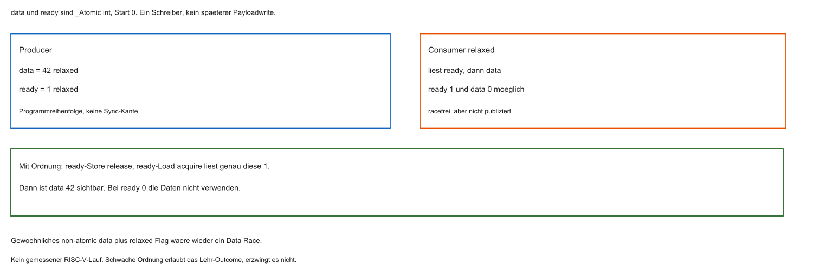

```c
#include <stdatomic.h>

_Atomic int zaehler = 0;

void hart_increment(void) {
    atomic_fetch_add(&zaehler, 1); /* seq_cst */
}
```

- Der Compiler kann AMO, LR/SC oder einen Library-Fallback erzeugen
- `atomic_fetch_add` ist standardmäßig sequentially consistent und macht nicht das ganze Programm seriell
- Ein blockierender Fallback gehört nicht in eine ISR

::: notes
Der Header stellt die C11-Atomics bereit. zaehler ist vor der konkurrierenden Nutzung 0. atomic_fetch_add gibt den alten Wert zurück. Hier wird er ignoriert. Alle Benutzer müssen den atomaren Typ verwenden. Ohne _explicit gilt seq_cst. Für einen reinen Zähler ohne Datenpublikation kann relaxed reichen. Der Endwert 2N gilt erst nach Abschluss beider Worker. Die Übersetzung kann AMO, LR/SC oder ein Bibliotheksfallback sein und ist hier nicht geprüft. Atomic ist nicht automatisch lock-free, lock-free nicht wait-free und nicht automatisch ISR-sicher. Ein atomarer Zähler publiziert nicht nebenbei andere Daten. Das Flag-Bild zeigt: relaxed ready 1 bei data 0 kann unter schwacher Ordnung erlaubt sein. Release auf ready und Acquire, der genau diese 1 liest, sichert data 42. Als Nächstes bleibt ein Wartezyklus möglich. Zahlen und Zeitfolgen sind Lehrannahmen. Assembler und C sind Lehrcode und wurden nicht kompiliert oder auf kohärenter Hardware ausgeführt.
:::

## Deadlocks

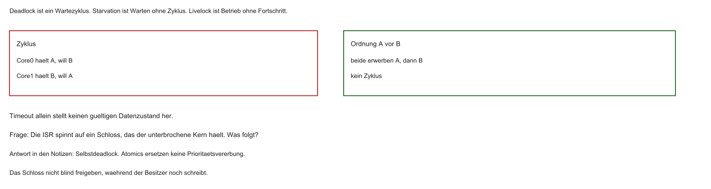

- Locks gegen Races — Risiko: zirkuläres Warten
- Core 0 hält A, will B; Core 1 hält B, will A
- Hardware rettet nicht — Reihenfolge der Lock-Hierarchie in Software

::: notes
Deadlock ist zirkuläres Warten. Core 0 hält A und will B, Core 1 hält B und will A. Die Reihenfolge A vor B verhindert diesen Zyklus, nicht jedes Deadlockproblem. Starvation ist fehlender Fortschritt ohne Zyklus. Livelock ist Aktivität ohne nützlichen Abschluss. Timeout darf das fremde Schloss nicht auf 0 setzen, während der Besitzer noch schreibt. Atomics ändern Scheduling und Prioritätsinversion nicht. Als Nächstes verbindet die Aufgabe den naiven Lock mit dem Interruptkontext. Zahlen und Zeitfolgen sind Lehrannahmen. Assembler und C sind Lehrcode und wurden nicht kompiliert oder auf kohärenter Hardware ausgeführt.
:::

## Aufgabe — Schloss und ISR

Warum genügt `volatile` nicht für das Check-then-Set? Was passiert, wenn die ISR auf das Schloss spinnt, das der unterbrochene Kontext hält?

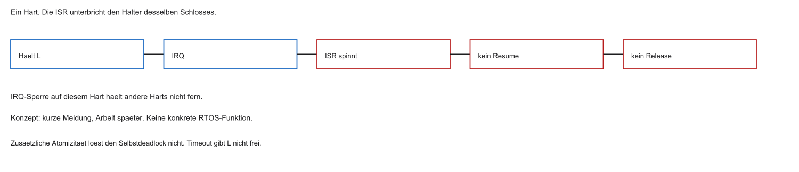

::: notes
volatile macht Test und Set nicht unteilbar und ordnet keine gewöhnliche Payload. Der naive C-Fall bleibt ein Data Race. Auf demselben Hart hält ein Kontext L. Die ISR spinnt auf L. Der Halter kann bis zum ISR-Ende nicht freigeben. Das ist Selbstdeadlock. Zusätzliche Atomizität löst ihn nicht. Eine IRQ-Sperre hält andere Harts nicht fern. Konzeptuell hilft eine kurze IRQ-sichere Disziplin oder das Verschieben der Arbeit. Das Assemblerpattern ist kein universelles ISR-Rezept. Erfolg bleibt Status 0, danach der Abschnitt, Release mit fence rw,w vor dem Store 0. Als Nächstes begrenzen serieller Anteil und Kommunikation den Nutzen weiterer Kerne. Zahlen und Zeitfolgen sind Lehrannahmen. Assembler und C sind Lehrcode und wurden nicht kompiliert oder auf kohärenter Hardware ausgeführt.
:::

## Amdahls Gesetz

- Nicht alles ist parallelisierbar: serieller Anteil $s$, paralleler Anteil $p = 1 - s$
- Speedup bei $N$ Kernen:

$$
S(N) = \frac{1}{s + \frac{p}{N}}
$$

- Grenze für $N \to \infty$: $S_{\max} = 1/s$

::: notes
s ist der serielle Anteil der Ein-Kern-Laufzeit, p gleich 1 minus s der parallel verteilbare Anteil. T(1) ist 1. T(N) ist s plus p/N bei fester Arbeit, gleichen Kernen, idealer Balance und ohne Overhead. S(N) ist T(1)/T(N). Für s größer 0 ist die Grenze 1/s. s gleich 0 ergibt ideal S gleich N. s gleich 0,2 bedeutet zwanzig Prozent der Ein-Kern-Zeit, nicht der verkürzten Multicorezeit. Kommunikation und Locks liegen außerhalb, solange kein h(N) benannt ist. Eine größere Aufgabe ist ein anderer Vertrag. Als Nächstes folgen die Zahlen. Zahlen und Zeitfolgen sind Lehrannahmen. Assembler und C sind Lehrcode und wurden nicht kompiliert oder auf kohärenter Hardware ausgeführt.
:::

## Amdahl: Zahlenbeispiel

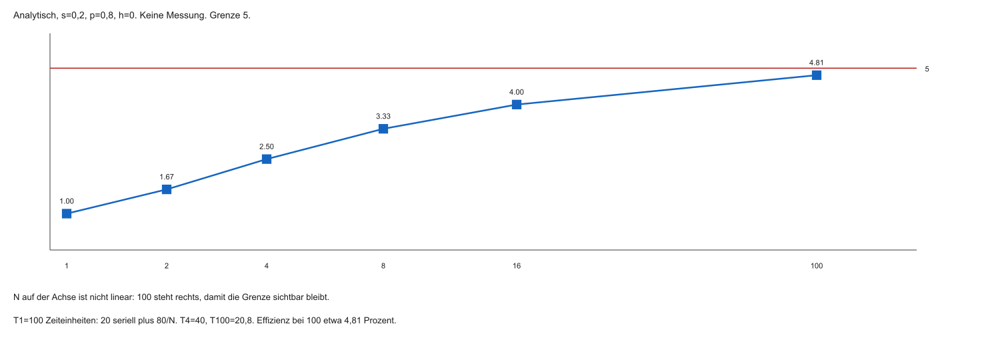

- Programm: 80 % parallel, 20 % seriell ($s = 0{,}2$)
- 4 Kerne: $S(4) = 1 / (0{,}2 + 0{,}8/4) = 1 / 0{,}4 = 2{,}5$
- 100 Kerne: $S(100) = 1/0{,}208 \approx 4{,}8077$, nahe an der Grenze 5
- Die Effizienz $S(100)/100$ ist nur etwa 4,8 Prozent. Overhead ist in dieser Rechnung noch 0

::: notes
Bei s 0,2 und p 0,8 ist S(1) gleich 1, S(2) etwa 1,6667, S(4) gleich 2,5, S(8) etwa 3,3333, S(16) gleich 4 und S(100) gleich 4,807692. Die Grenze ist 5. Mit T(1) gleich 100 Zeiteinheiten bleiben 20 seriell und 80/N parallel. T(4) ist 40, T(100) ist 20,8. Die Effizienz S/N ist bei 4 gleich 62,5 Prozent und bei 100 etwa 4,8077 Prozent. Der Speedup liegt nahe an 5, die Kernnutzung ist trotzdem klein, weil zusätzliche Kerne nur den restlichen parallelen Anteil verkürzen. h ist 0. Die N-Achse des Bildes ist nicht linear. Keine Messung. Als Nächstes ordnet der Rückblick die Bausteine. Zahlen und Zeitfolgen sind Lehrannahmen. Assembler und C sind Lehrcode und wurden nicht kompiliert oder auf kohärenter Hardware ausgeführt.
:::

## Unser fertiges SoC (Rückblick)

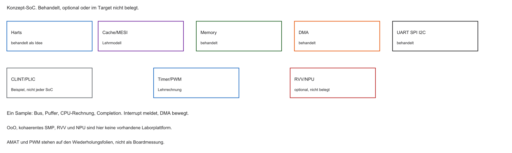

Dual-Core-Idee mit Bausteinen aus MCT3:

- Konzept, nicht das Laborgerät: OoO, MESI und SMP sind hier nicht als vorhandenes Target belegt
- Behandelt: Caches, CLINT/PLIC als RISC-V-Beispiel, UART/SPI/I2C, DMA, Timer
- Optional und nicht im Repository nachgewiesen: RVV, NPU, kohärentes SMP

::: notes
Das Bild ist ein Konzept-SoC (System on Chip), kein Laborgerät. Caches, CLINT (Core Local Interruptor) und PLIC (Platform-Level Interrupt Controller) sind Kursbeispiele, nicht die Pflicht jedes Chips. UART, SPI, I2C, DMA und Timer wurden behandelt. OoO, MESI als vorhandenes Target, RVV und NPU sind nicht belegt. Ein Sample läuft vom Bus in einen Puffer und in die CPU-Rechnung. Ein Interrupt meldet, DMA bewegt Daten, MESI würde Kopien koordinieren. Die Kursbehandlung einer NPU beweist nicht, dass sie im Labor-SoC vorhanden ist. Als Nächstes fragt die Tabelle nach dem passenden Hebel. Zahlen und Zeitfolgen sind Lehrannahmen. Assembler und C sind Lehrcode und wurden nicht kompiliert oder auf kohärenter Hardware ausgeführt.
:::

## Drei Flaschenhälse — Lösungen

| Feind | Lösungspfad |
|-------|-------------|
| Memory Wall | Lokalität, Tiling, Bandbreite, nicht nur DLP |
| Control Hazards | Prediction, Unrolling, Scheduling |
| CPU blockiert durch I/O | Interrupts, DMA |

::: notes
Die Memory Wall wird nicht dadurch beseitigt, dass mehr ALUs rechnen. Tiling und Lokalität können Transferbytes senken, die Bandbreite aber nicht heben. DLP schafft Rechenmöglichkeiten, nicht automatisch weniger Verkehr. Ein Branch Predictor hilft nur bei bestimmten Sprüngen. Unrolling darf die Semantik nicht ändern. Ein IRQ (Interrupt Request) kann Busywaiting vermeiden, DMA den Transfer übernehmen. Setup, Ownership und Speicher bleiben. RAW-Abhängigkeiten und Locks sind weitere Grenzen. Als Nächstes müssen diese Bedingungen im C-Code erkennbar sein. Zahlen und Zeitfolgen sind Lehrannahmen. Assembler und C sind Lehrcode und wurden nicht kompiliert oder auf kohärenter Hardware ausgeführt.
:::

## C-Code vs. Hardware

Ohne Hardwareblick typisch:

- Cache-feindliche Schleifen (Layout)
- Busy-Waiting auf UART/Status
- Shared `i++` ohne `_Atomic` / falsches `volatile`

Mit Systemblick: Caches, Pipeline, DMA und Kohärenz mitdenken.

::: notes
C-Arrays sind row-major: der letzte Index liegt benachbart. Die innere Schleife sollte dazu passen, sonst springt der Zugriff über Lines. Polling, also wiederholtes Statuslesen, kann bei kurzer Wartezeit sinnvoll sein. Busywaiting ist nicht immer falsch. Ein geteiltes normales int braucht Synchronisation. volatile ersetzt sie nicht. _Atomic schützt das bezeichnete Objekt, nicht automatisch mehrere gekoppelte Invarianten. Der Systemblick ist eine Diagnose, kein Speeduprezept. Als Nächstes strukturiert der Klausurhinweis die Wiederholung. Zahlen und Zeitfolgen sind Lehrannahmen. Assembler und C sind Lehrcode und wurden nicht kompiliert oder auf kohärenter Hardware ausgeführt.
:::

## Infos zur Klausur

- Dauer und Hilfsmittel nur aus der autorisierten Ankündigung. Hier nichts Neues festlegen
- Unbestätigte Formalia vor der Klausur prüfen
- Fokus der Vorlesung: Konzepte, kleine Rechnungen, Skizzen, kurze C-Ausschnitte

::: notes
Dauer und Hilfsmittel stehen nur in der autorisierten Ankündigung. Hier wird nichts Neues festgelegt. Sinnvolle Vorbereitung ist eine Zustandsfolge, eine kleine Rechnung und ein fehlerhafter Schnipsel. Benannte Annahmen machen die Zählgrenze prüfbar. Es gibt keine Zusage über exakte Aufgaben. Als Nächstes wiederholt der Speicherblock Adresse und Zugriffszeit. Zahlen und Zeitfolgen sind Lehrannahmen. Assembler und C sind Lehrcode und wurden nicht kompiliert oder auf kohärenter Hardware ausgeführt.
:::

## Klausurfokus: Speicher

- Lehrcache: 4 KiB direct-mapped, Line 64 B, 32-Bit-Adresse. 64 Sätze, Offset 6, Index 6, Tag 20
- Adresse 0x20001084: Offset 4, Index 2, Tag 0x20001, Linebasis 0x20001080
- AMAT: Hitzeit 2 Takte, Hitrate 0,9, zusätzliche Misspenalty 40. Ergebnis 6 Takte, bei 100 MHz 60 ns
- AMAT bei Hit-Rate und Miss-Penalty
- Direct-Mapped vs. satzassoziativ; Thrashing
- Cache-Line: Tag, Index, Offset, Valid, Dirty
- Write-Back + DMA; MESI bei Multicore

::: notes
AMAT (Average Memory Access Time) ist Hitzeit plus Missrate mal zusätzlicher Misspenalty. Bei Hitzeit 2, Hitrate 0,9 und Penalty 40 sind das 2 plus 0,1 mal 40 gleich 6 Takte. Bei fiktiven 100 MHz dauert ein Takt 10 ns, also 60 ns. Ein Direct-Mapped-Datencache mit 4 KiB und 64-Byte-Lines hat 64 Sätze. Offset und Index haben je 6 Bit, der Tag 20. Die Adresse 0x20001084 hat Offset 4, Index 2, Tag 0x20001 und Linebasis 0x20001080. Valid und Dirty sind Metadaten, keine Nutzbytes. Satzassoziativität mildert Konflikte, hebt die Kapazitätsgrenze aber nicht auf. DMA-Maintenance und MESI bleiben verschiedene Verträge. Keine Boardmessung. Als Nächstes entscheidet hardwarenahes C über die Zugriffsverträge. Zahlen und Zeitfolgen sind Lehrannahmen. Assembler und C sind Lehrcode und wurden nicht kompiliert oder auf kohärenter Hardware ausgeführt.
:::

## Klausurfokus: Hardwarenahes C

- Row- vs. Column-Major / Lokalität
- MMIO-Pointer
- `volatile` bei MMIO/IRQ (Compiler darf Zugriffe nicht wegoptimieren) — ersetzt keine Atomics
- Races erkennen; `_Atomic` / `stdatomic` als Lösung

::: notes
Ein kleines int a[2][3] liegt zeilenweise. Der Laufindex der innersten Schleife sollte die benachbarten Elemente treffen. MMIO verlangt die dokumentierte Zugriffsbreite. volatile verhindert nicht jede Optimierung und liefert keine Ordnung gegenüber DMA. Nicht jedes volatile Register wird durch _Atomic ersetzt. Geräte und atomare Speicherregionen haben verschiedene Verträge. Eine ISR ist nicht automatisch ein C11-Thread. Ein fehlerhafter Schnipsel ist while(lock==1); lock=1; auf einem gewöhnlichen int: Data Race und getrennte Übernahme. Die konzeptionelle Korrektur ist eine atomare RMW mit passender Ordnung, nicht volatile. Als Nächstes verbindet der Systemblock Peripherie und Zeitbasis. Zahlen und Zeitfolgen sind Lehrannahmen. Assembler und C sind Lehrcode und wurden nicht kompiliert oder auf kohärenter Hardware ausgeführt.
:::

## Klausurfokus: System

- Polling vs. IRQ; CLINT vs. PLIC
- Lehrtimer: 1 MHz, Teiler 10, 1000 Zählertakte je Periode ergeben 100 Hz. Zähler 0–249 high sind 25 Prozent
- Timer/Prescaler, PWM Duty Cycle; WDT
- UART/SPI/I2C-Eigenschaften
- DMA: SRC, DST, Increment
- OoO: Renaming, ROB (Grundidee)

::: notes
Polling fragt aktiv, ein IRQ meldet. CLINT und PLIC sind Beispiele lokaler und plattformweiter Interruptcontroller. Der Lehrtimer hat 1 MHz Eingang, Teiler 10 und 1000 Zählertakte je Periode, also 100 Hz. Die Zähler 0 bis 249 high sind 250 von 1000, also 25 Prozent Duty Cycle. Das ist kein Registerlayout. Der WDT (Watchdog Timer) überwacht Fortschritt. UART ist asynchron, SPI synchron mit Takt und Auswahl, I2C ein adressierter Bus. Es gibt keine universelle Displaywahl. DMA braucht Quelle, Ziel, Inkrement, Ownership und Completion. OoO-Renaming löst falsche Namensabhängigkeiten. Der ROB (Reorder Buffer) hält die Abschlussordnung. Eine echte RAW-Kette bleibt. Als Nächstes grenzt der Umfang die Wiederholung ab. Zahlen und Zeitfolgen sind Lehrannahmen. Assembler und C sind Lehrcode und wurden nicht kompiliert oder auf kohärenter Hardware ausgeführt.
:::

## Was nicht im Fokus steht

- Keine auswendig gelernten Chip-Basisadressen (ggf. gegeben)
- Keine langen Assembler-Programme (MCT1)
- Keine Halbleiterphysik/Leckstrom-Formeln

::: notes
Auswendig gelernte Basisadressen sind nicht der Fokus. Eine gegebene Registerbeschreibung muss trotzdem gelesen und angewandt werden. Kurze Folgen zu RMW und LR/SC können konzeptionell wichtig sein, lange Assemblerprogramme nicht. Halbleiterphysik ist nicht dieser Block. Das ist die vorhandene Kursabgrenzung, keine neue Garantie über Nichtprüfbarkeit. Als Nächstes können offene Punkte an konkreten Größen festgemacht werden. Zahlen und Zeitfolgen sind Lehrannahmen. Assembler und C sind Lehrcode und wurden nicht kompiliert oder auf kohärenter Hardware ausgeführt.
:::

## Offene Fragerunde

- Welche Bausteine des SoCs sind noch unklar?
- Was soll wiederholt werden?

::: notes
Drei Diagnosen: Bei M:5 und RAM 0 ist der RAM alt, der Owner aktuell. SC-Erfolg ist Status 0, nicht der gelesene Schlosswert. S(100) nahe 5 kann mit etwa 4,8 Prozent Effizienz zusammenfallen. Bei einem falschen Wert ist zu fragen, ob die Kopie ungültig ist, eine RMW verloren ging, die Ordnung fehlt oder der Gerätevertrag nicht passt. Keine neue Pflichtübung. Als Nächstes bindet die Zusammenfassung die drei Fragen zurück. Zahlen und Zeitfolgen sind Lehrannahmen. Assembler und C sind Lehrcode und wurden nicht kompiliert oder auf kohärenter Hardware ausgeführt.
:::

## Zusammenfassung Block 9

- SMP ist gemeinsame Software und gleicher Zugriff, nicht die Formel privates L1 plus L2
- MESI verwaltet Lines. Ein normales `i++` wird dadurch nicht atomar
- Atomare RMW und Acquire/Release sind verschiedene Fragen. Ein Schloss ist kein Zähler
- Amdahl: serieller Anteil begrenzt den Multicore-Speedup
- Klausur: AMAT, Mapping, IRQ/Timer, PWM, DMA, OoO-Idee, MESI

::: notes
SMP ist nicht durch private L1 definiert. MESI verwaltet Lines und Schreibrechte. Ein normales i++ wird dadurch nicht atomar. Ein binäres Schloss bleibt 0 oder 1. Acquire/Release publiziert zugehörige Daten, ein Cacheflush ersetzt das nicht. Amdahl gilt unter fester Arbeit und ohne Overhead, nicht als gemessener Speedup. AMAT, IRQ, PWM und DMA bleiben getrennte Werkzeuge. Korrektes Sharing beantwortet drei Fragen: gültige Kopien, unteilbare Updates und passende Ordnung. Als Nächstes trennt der Abschluss Konzept und späteres Experiment. Zahlen und Zeitfolgen sind Lehrannahmen. Assembler und C sind Lehrcode und wurden nicht kompiliert oder auf kohärenter Hardware ausgeführt.
:::

## Abschluss und Ausblick

- Theorie MCT3 abgeschlossen
- Geplant bleibt die Wiederholung. Ein kohärentes Dual-Core-Labor liegt hier nicht vor

Vielen Dank für Ihre Mitarbeit im Semester!

::: notes
Geprüft sind Zustandsfolgen, Schlossablauf, Ordnung und die Rechnungen zu Amdahl, Adresse, AMAT und PWM. Nicht geprüft sind RISC-V-Kompilierung, Renode und ein Kohärenz-Zeitmodell. Eine manuell korrekte MESI-Tabelle beweist die Konsistenz des Lehrmodells, keine vorhandene Hardware und keine Zykluszeit. Quellen sind die Unprivileged ISA 20240411, der C11-Draft N1570, die GCC-Volatile-Beschreibung und die Kernelnotiz zu False Sharing. Ein späteres Experiment bräuchte Plattform, Toolchain und ein Zeitmodell. Damit endet der fachliche Bogen dieses Blocks. Zahlen und Zeitfolgen sind Lehrannahmen. Assembler und C sind Lehrcode und wurden nicht kompiliert oder auf kohärenter Hardware ausgeführt.
:::
